# DTMiner: A Data-Centric System for Efficient Temporal Motif Mining

| Yinbo Hou ∗†                       |                                     |
|------------------------------------|-------------------------------------|
| Huazhong University of Science and |                                     |
| Wuhan, China                       |                                     |
|                                    | Hao Qi ∗†                           |
| Huazhong                           | University of Science and           |
| Wuhan,                             | China                               |
|                                    | Ligang He                           |
|                                    | University of Warwick               |
|                                    | Coventry, United Kingdom            |
| Jin Zhao ∗‡                        |                                     |
| Huazhong University of Science and |                                     |
| Wuhan, China                       |                                     |
| Yu                                 | Zhang ∗                             |
| Huazhong                           | University of Science and           |
| Wuhan,                             | China                               |
|                                    | Hui Yu                              |
|                                    | Hong Kong University of Science and |
|                                    | Hongkong, China                     |
| Longlong Lin                       |                                     |
| Southwest University               |                                     |
| Chongqing, China                   |                                     |
|                                    | Lin Gu ∗                            |
| Huazhong                           | University of Science and           |
| Wuhan,                             | China                               |
|                                    | Wenbin Jiang ∗                      |
|                                    | Huazhong University of Science and  |
|                                    | Wuhan, China                        |
| Xiaofei Liao ∗                     |                                     |
| Huazhong University of Science and |                                     |
| Wuhan, China                       |                                     |
|                                    | Hai Jin ∗                           |
|                                    | Huazhong University of Science and  |
|                                    | Wuhan, China                        |

# Abstract

Mining temporal motifs in temporal graphs is essential for many critical applications. Although several solutions have been proposed to handle temporal motif mining, they still suffer from substantial inefficiencies due to significant redundant graph traversals and fragmented memory access, both caused by irregular search tree expansions across different motif matching tasks. In this work, we observe that data accesses issued by these tasks exhibit strong spatial similarity and temporal monotonicity. Based on these observations, this paper proposes an efficient data-centric temporal motif

mining system DTMiner, which introduces a novel Load-Explore-Synchronize (LES) execution model to efficiently regularize data accesses to the common temporal graph data among different tasks. Specifically, DTMiner enables the temporal graph chunks to be sequentially loaded into the cache in temporal order and then triggers all relevant tasks to explore only these loaded data for search tree expansions in a fine-grained synchronization mechanism. In this way, different tasks can share the graph traversal corresponding to the same chunks, while fragmented memory accesses are restricted to the graph data residing in the cache, significantly reducing data access overhead. Experimental results demonstrate that DTMiner achieves 1.14×-11.98× performance improvement in comparison with the state-of-the-art temporal motif mining solutions.

CCS Concepts: • Computing methodologies → Parallel algorithms.

Keywords: Temporal Motif Mining; Spatial Similarity; Temporal Monotonicity; Data-Centric

# ACM Reference Format:

Yinbo Hou, Hao Qi, Ligang He, Jin Zhao, Yu Zhang, Hui Yu, Longlong Lin, Lin Gu, Wenbin Jiang, Xiaofei Liao, Hai Jin. 2026. DT-Miner: A Data-Centric System for Efficient Temporal Motif Mining.

∗National Engineering Research Center for Big Data Technology and System; Services Computing Technology and System Lab; Cluster and Grid Computing Lab; School of Computer Science and Technology, Huazhong University of Science and Technology, Wuhan 430074, China.

†Both authors contributed equally to this work.

‡Corresponding author.

[This work is licensed under a Creative Commons Attribution 4.0 Interna](https://creativecommons.org/licenses/by/4.0)[tional License.](https://creativecommons.org/licenses/by/4.0)

PPoPP '26, Sydney, NSW, Australia

© 2026 Copyright held by the owner/author(s).

ACM ISBN 979-8-4007-2310-0/2026/01 <https://doi.org/10.1145/3774934.3786416>

In Proceedings of the 31st ACM SIGPLAN Annual Symposium on Principles and Practice of Parallel Programming (PPoPP '26), January 31 – February 4, 2026, Sydney, NSW, Australia. ACM, New York, NY, USA, [14](#page-13-0) pages. <https://doi.org/10.1145/3774934.3786416>

# 1 Introduction

Many real-world graphs exhibit an inherently temporal nature, wherein each edge is annotated with a timestamp that specifies the moment of interaction between two vertices [\[22,](#page-12-0) [37,](#page-12-1) [46,](#page-12-2) [51\]](#page-13-1). Such temporal information is indispensable for accurately modeling and analyzing in many time-sensitive domains, including transportation networks [\[14\]](#page-11-0), social media networks [\[36\]](#page-12-3), real-time epidemic surveillance [\[52\]](#page-13-2), and online marketplaces [\[24\]](#page-12-4). Temporal motifs, which are fundamental building blocks of temporal graphs, enable the understanding of the structure and function of real-world temporal graphs [\[31,](#page-12-5) [35,](#page-12-6) [38,](#page-12-7) [46,](#page-12-2) [51\]](#page-13-1). For example, mining temporal motifs is crucial for detecting fraudulent behaviors in financial networks [\[18\]](#page-12-8), uncovering insider threats in organizations [\[16,](#page-11-1) [31\]](#page-12-5), analyzing energy usage in smart grids [\[43\]](#page-12-9), and predicting biological functions such as protein or peptide binding [\[34\]](#page-12-10). Moreover, temporal motif counts can enhance the expressive power of graph neural networks by capturing fine-grained dynamic patterns [\[3,](#page-11-2) [5\]](#page-11-3).

Despite the broad applicability and importance of temporal motif mining, many approaches [\[2,](#page-11-4) [4,](#page-11-5) [8,](#page-11-6) [11](#page-11-7)[–13,](#page-11-8) [28,](#page-12-11) [29,](#page-12-12) [47\]](#page-12-13) have been tailored exclusively for serving static graph mining. Compared to static graph mining, as shown in Figure [1,](#page-1-0) temporal motif mining introduces an additional time dimension, which makes the computation more complex and incurs more irregular memory access. To address these challenges, several solutions [\[27,](#page-12-14) [31,](#page-12-5) [38,](#page-12-7) [46,](#page-12-2) [51\]](#page-13-1) have been proposed to enhance parallelism and reduce memory access costs. However, owing to the inherently irregular search tree expansions across different matching tasks (where each task explores temporal motifs starting from a specific edge in the temporal graph), these solutions still yield suboptimal performance, primarily due to the following two problems.

First, during temporal motif mining, different matching tasks incur substantial redundant graph traversals over the temporal graph. Specifically, existing solutions [\[27,](#page-12-14) [31,](#page-12-5) [38,](#page-12-7) [46,](#page-12-2) [51\]](#page-13-1) typically handle each matching task independently, traversing the temporal graph separately to generate their valid candidate edges (i.e., edges satisfying both topological and temporal constraints). As a result, these task-centric solutions cause the same temporal graph data to be repeatedly traversed by different tasks at different times, incurring significant redundant data access overhead. In addition, when a matching task attempts to generate its candidate edges, it introduces numerous unnecessary accesses to invalid edges, i.e., those that fail to meet the temporal constraints.

Second, temporal motif mining exhibits severe fragmented memory access to temporal graph data, which leads to poor data locality and inefficient utilization of memory bandwidth.

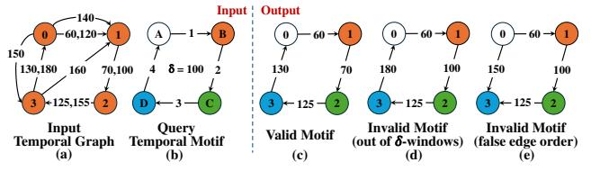

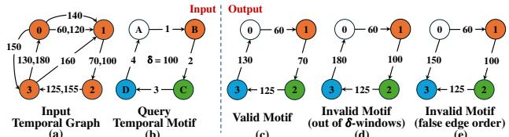

Figure 1. Example of temporal motif mining. (a) Input graph; (b) query temporal motif; (c) valid candidate for the query temporal motif in the input graph; (d) and (e) invalid motifs violating the ��-constraint and edge ordering, respectively

In detail, the temporal graph edges are typically stored in chronological order [\[27,](#page-12-14) [31,](#page-12-5) [38,](#page-12-7) [46,](#page-12-2) [51\]](#page-13-1), which means that the outgoing/incoming edges of each vertex are not stored contiguously. When a task expands the search tree, retrieving the neighbors of matched vertices to generate candidate edges inevitably incurs random memory access to temporal edges. Moreover, in order to identify the candidate edges that satisfy temporal constraints, existing solutions [\[31,](#page-12-5) [46,](#page-12-2) [51\]](#page-13-1) typically rely on binary search operations, which exacerbates the problem of poor data locality.

Through analyzing memory access patterns in temporal motif mining, we make two key observations. First, a large portion of temporal edges are repeatedly traversed by different matching tasks, revealing strong spatial similarity among the tasks. Second, since the expansion of the search tree must adhere to temporal constraints, these shared temporal edges are accessed by matching tasks in strictly chronological order, demonstrating strong temporal monotonicity. These two observations leave us with good opportunities to significantly reduce the data access cost of temporal motif mining.

Based on the above observations, this paper proposes an efficient data-centric system DTMiner to efficiently support temporal motif mining. Specifically, DTMiner divides the temporal edges into fine-grained chunks along the temporal order. Furthermore, DTMiner develops a novel Load-Explore-Synchronize (LES) execution model that efficiently regularizes data accesses to the same temporal graph data for different matching tasks by fully exploiting the spatial similarity and temporal monotonicity. It enables the temporal graph chunks to be sequentially loaded into the cache along their temporal order and then triggers all relevant tasks for each loaded chunk to explore only its data in a fine-grained synchronization mechanism. That is, these triggered tasks are restricted to accessing only the data in cache for search tree expansions. By such means, different tasks can share the data accesses to the same temporal graph data, while fragmented memory accesses are restricted to the graph data loaded in the cache, effectively reducing memory access cost.

To validate its effectiveness, we evaluated DTMiner using 13 temporal motifs over four real-world temporal graphs. Compared to the state-of-the-art temporal motif mining solution Mackey-o (i.e., integrating the SOTA algorithm proposed by Mackey et al. in [\[31\]](#page-12-5) with the cutting-edge temporal motif

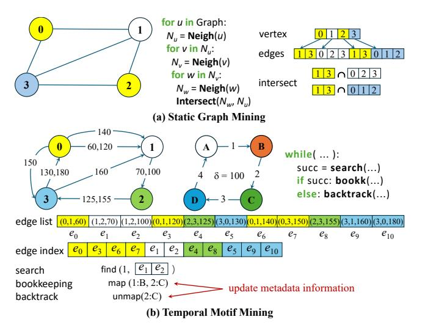

Figure 2. The workload characteristics of static graph mining and temporal motif mining

mining techniques [\[46,](#page-12-2) [51\]](#page-13-1)), DTMiner achieves 1.14×-11.98× performance improvement.

The key contributions of this work are as follows:

- We identify the issues of excessive redundant graph traversals and fragmented memory access in temporal motif mining, and further observe strong spatial similarity and temporal monotonicity in the data accesses across different matching tasks.
- We introduce a novel LES execution model to efficiently regularize data accesses to the same temporal graph data for different matching tasks, significantly reducing the data access cost of temporal motif mining.
- We design a hierarchical index of chunk storage to retrieve temporal edges of vertices for efficiently generating valid candidate edges and propose a three-level work stealing strategy to achieve load balancing.
- We develop an efficient data-centric temporal motif mining system DTMiner and conduct extensive experiments demonstrating that it significantly outperforms existing cutting-edge CPU-based solutions.

# 2 Background and Motivation

# 2.1 Temporal Motif Mining

Temporal Graph. A temporal graph is a directed graph where each edge is annotated with a timestamp. An edge ���� is represented as a triplet (���� , ���� , ����), where ���� and ���� denote the source and destination vertices, respectively, and ���� ∈ R + denotes the timestamp of this edge. A temporal graph �� can be represented as a set of timestamped edges�� = {(���� , ���� , ����)}�� ��=1 , where the edges are typically sorted in chronological order and have unique timestamps [\[31,](#page-12-5) [38,](#page-12-7) [46,](#page-12-2) [51\]](#page-13-1).

Temporal Motif Mining. A ��-temporal motif �� is defined as a sequence of �� time-ordered edges, denoted as �� = {(���� , ���� , ����)}�� ��=1 , where ��1<��2<. . . &lt;���� and ����−��1≤�� (i.e., all edges in the motif occur within a time span of at most ��). Temporal motif mining aims to identify all ��-temporal motifs in a temporal graph �� that match both the topological and temporal constraints. Following existing studies [\[31,](#page-12-5) [46,](#page-12-2) [51\]](#page-13-1), we focus on counting the motifs. Unlike static motif mining, which focuses only on topological isomorphism, temporal motif mining incorporates additional constraints on the temporal order and time interval among the edges [\[31,](#page-12-5) [38,](#page-12-7) [46,](#page-12-2) [51\]](#page-13-1).

Figures [1\(](#page-1-0)a) and (b) show the input temporal graph and the query temporal motif, which is specified with a time interval constraint of �� ≤ 100, respectively. The valid motif depicted in Figure [1\(](#page-1-0)c) satisfies both topological and temporal constraints, whereas Figure [1\(](#page-1-0)d) and (e) satisfy only the topological or temporal constraints, respectively. However, in static graph mining, all three motifs would be considered valid, as it focuses only on topological isomorphism without accounting for edge ordering and timestamps.

Workload Characteristics of Temporal Motif Mining. Different from static graph mining, temporal motif mining exhibits distinct workload characteristics [\[27,](#page-12-14) [31,](#page-12-5) [38,](#page-12-7) [46,](#page-12-2) [51\]](#page-13-1). In detail, as shown in Figure [2\(](#page-2-0)a), static graph mining generally involves traversing the input graph and then performing set operations (e.g., intersection) to identify valid subgraphs that satisfy only the topological constraint. These set operations constitute the key performance bottleneck and have thus been the focus of optimization in prior works [\[2,](#page-11-4) [4,](#page-11-5) [8–](#page-11-6) [10,](#page-11-9) [13,](#page-11-8) [20,](#page-12-15) [28,](#page-12-11) [29\]](#page-12-12). In contrast, as shown in Figure [2\(](#page-2-0)b), temporal motif mining generally operates on a temporal edge list, where edges are ordered based on their timestamps and the edges of a vertex are not stored contiguously. Instead of maintaining neighbor vertex IDs for each vertex, it maintains an edge index to retrieve each vertex's temporal edges from the temporal edge list.

To mine temporal motifs, existing solutions [\[31,](#page-12-5) [38,](#page-12-7) [46,](#page-12-2) [51\]](#page-13-1) typically perform search, bookkeeping, and backtrack to conduct search tree expansions. This process is referred to as a task that begins by mapping the first motif edge to each edge of the input graph, and then iteratively expands a search tree to match the remaining edges, following a Depth First Search (DFS) tree traversal. Figure [3\(](#page-3-0)b) presents the search trees of two tasks (where a task is created with a certain edge), both consisting of 4 levels. In these trees, each edge corresponds to one expansion operation. During each expansion, the search step locates the next edge satisfying topological and temporal constraints using binary search [\[31,](#page-12-5) [46,](#page-12-2) [51\]](#page-13-1), which accounts for the majority of the execution time. For example, as shown in Figure [2\(](#page-2-0)b), the search operation is executed using the binary search to find valid edges (i.e., their timestamps are larger than that of the edge ��0) from the candidate edges ��1 and ��2. When using Figure [1\(](#page-1-0)b) as the query graph, for the searched edge (1, 2, 70), vertices ○1 and ○2 are mapped to query vertices �� and ��, respectively. If a valid edge is found, the bookkeeping step records key metadata information (e.g., mappings between query motif

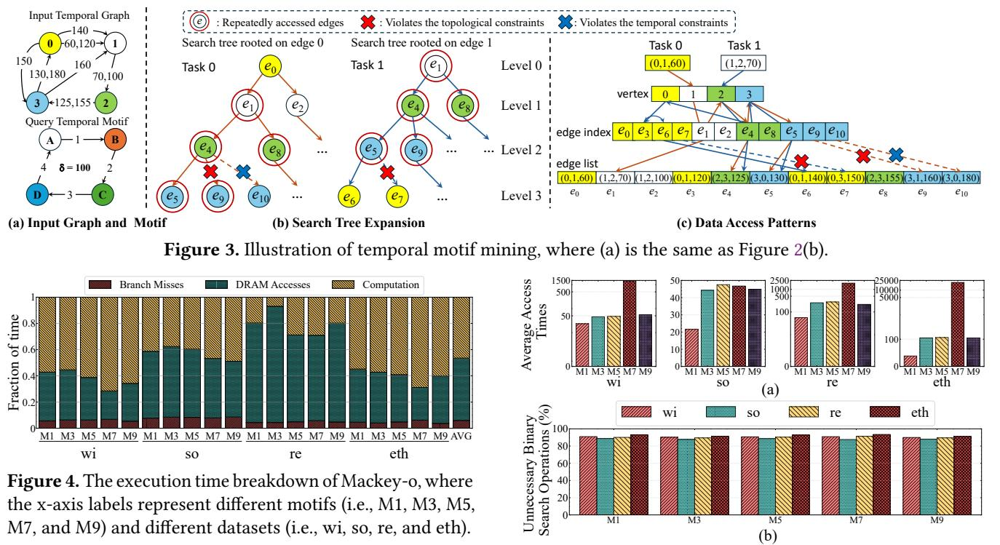

vertices and graph vertices). Otherwise, the backtrack step voids the previous mapped edge (e.g., the mapping ○2 → ��) in the metadata structures. These steps are repeated until all temporal motifs are found. For example, task 0 identifies a valid motif composed of ��0, ��1, ��4, and ��5.

### 2.2 Limitations of Existing Solutions

To support temporal motif mining, several solutions [\[31,](#page-12-5) [38,](#page-12-7) [46,](#page-12-2) [51\]](#page-13-1) have been proposed to alleviate the binary search overhead by leveraging search index memoization and candidate edge caching techniques. However, these solutions still suffer from significant data access cost due to extensive redundant graph traversals and fragmented memory access across different matching tasks. To demonstrate it, Figure [4](#page-3-1) breaks down the total execution time of the cuttingedge temporal motif mining solution Mackey-o [\[31,](#page-12-5) [51\]](#page-13-1) over four real-world temporal graphs. The datasets and benchmarks are detailed in § [5.1.](#page-8-0) We can find that DRAM accesses contribute 22.7%–88.7% of the total execution time. This overhead primarily stems from the following two problems.

Redundant Graph Traversals. Existing approaches [\[46,](#page-12-2) [51\]](#page-13-1) typically launch massive matching tasks in parallel, each traversing the graph independently to mine temporal motifs. These task-centric temporal motif mining systems inevitably cause excessive repeated access to the same temporal edges. For instance, as shown in Figure [3\(](#page-3-0)b), both task 0 and task 1 require access to common temporal edges (e.g., ��1, ��4, ��5, ��8, and ��9). Since these tasks are executed independently, they traverse the shared temporal edges repeatedly at different times, resulting in significant redundant memory

Figure 5. Studies of the data accesses of the temporal motif mining: (a) the average traversal times of the temporal edges, where the x-axis labels represent different motifs (i.e., M1, M3, M5, M7, and M9) and different datasets (i.e., wi, so, re, and eth); (b) the ratio of unnecessary binary search operations

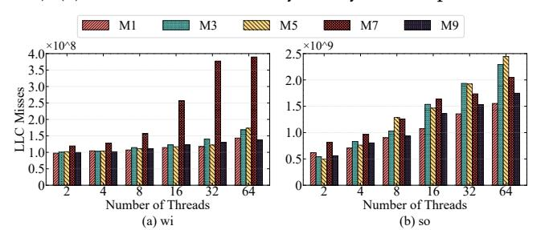

Figure 6. Total number of LLC misses with different number of concurrently executed tasks

accesses. Figure [5\(](#page-3-2)a) shows that the temporal edges can be accessed on average up to tens of thousands of times. Besides, existing solutions [\[46,](#page-12-2) [51\]](#page-13-1) perform binary search over the entire candidate set (i.e., all outgoing temporal edges of a vertex) to generate valid candidate edges, which leads to massive unnecessary traversals to the invalid edges (i.e., edges that fail to meet the temporal constraints). For example, in Figure [3\(](#page-3-0)b), task 0 performs a binary search among all outgoing edges of vertex ○3 during expanding ��4, even though ��10 violates the temporal constraint (exceeding the time span ��). Figure [5\(](#page-3-2)b) shows that more than 87.63% binary search operations are conducted to traverse invalid edges.

Fragmented Memory Access. The temporal edges are stored in chronological order [\[31,](#page-12-5) [46,](#page-12-2) [51\]](#page-13-1), which causes highly

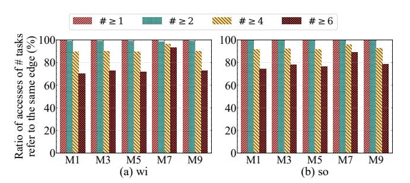

Figure 7. The ratio of the accesses to temporal edges that can be shared by different numbers of matching tasks

fragmented memory accesses when retrieving the neighbors of matched vertices and consequently results in poor data locality. For example, as illustrated in Figure [3\(](#page-3-0)c), the edges of vertex ��0 are scattered rather than stored contiguously in the temporal edge list. Thus, accessing its neighbors to explore candidate edges requires random memory accesses to edges such as ��0 and ��3. Moreover, existing solutions [\[31,](#page-12-5) [46,](#page-12-2) [51\]](#page-13-1) typically rely on binary search to identify valid candidate edges, which further aggravates the data locality problem. Figure [6](#page-3-3) presents the total number of Last Level Cache (LLC) misses when executing varying numbers of concurrent matching tasks, reflecting the volume of temporal graph data loaded into the LLC. The results indicate that with an increasing number of concurrent tasks, the amount of data fetched into the LLC grows rapidly, primarily due to their fragmented memory accesses that cause severe cache interference.

### 2.3 Observations

Through analyzing the data access patterns in temporal motif mining, we observed strong spatial similarity and temporal monotonicity across the data accesses issued by different matching tasks. These characteristics present opportunities to enhance the performance of temporal motif mining.

Observation 1. A large portion of temporal edges are frequently traversed by multiple matching tasks, exhibiting strong spatial similarity. This arises because different matching tasks expand their search trees over the same temporal graph, leading to substantial overlap in the temporal edges they access. Figure [7](#page-4-0) shows that 75.94% (on average) of temporal edges are traversed by at least 6 tasks. Such pronounced spatial similarity enables the opportunity of consolidating memory accesses to shared temporal edges across different tasks, substantially reducing the overall memory access cost.

Observation 2. Temporal graph edges are traversed by matching tasks in strictly chronological order, exhibiting strong temporal monotonicity. Formally, for any two consecutive temporal edges (���� , ���� , ����) and (���� , ���� , ����) within a temporal motif, the timestamps must satisfy ����<���� . To enforce this constraint, existing temporal motif mining systems [\[31,](#page-12-5) [46,](#page-12-2) [51\]](#page-13-1) enumerate temporal motifs by exploring edges strictly in temporal order. For example, as shown in Figure [3\(](#page-3-0)c), a matching task starting from edge ��0 must sequentially traverse edges ��1, ��4, and ��5 to form a valid temporal motif. Thus, the data accesses induced by matching tasks naturally follow the ordering of the temporal edge list. This property motivates us to regularize traversal paths of different tasks according to chronological order, so that the loaded partial temporal edges can be shared among related tasks, fully exploiting data locality.

# 3 Data-centric Temporal Motif Mining

To fully exploit the above spatial similarity and temporal monotonicity inherent in matching tasks, we propose a datacentric Load-Explore-Synchronize (LES) execution model, aiming to mitigate redundant graph traversal and fragmented memory accesses of temporal motif mining. In this model, temporal edges are divided into consecutive chunks, which are sequentially loaded into the cache in chronological order and shared across all matching tasks. Specifically, only a single chunk is loaded into the cache, after which all relevant tasks are triggered to explore the loaded chunk under a fine-grained synchronization mechanism. By such means, data accesses to the chunk can be effectively shared by multiple tasks, while fragmented memory accesses are confined to the graph data stored in the cache, thereby substantially reducing the data access cost of temporal motif mining.

### 3.1 Data-centric **LES** Execution Model

In our LES model, the processing of the chunks consists of three stages: chunk loading, parallel exploring, and crosschunk synchronizing, which are presented as follows.

Chunk Loading. During the execution, the chunks, e.g., a chunk ���� , are sequentially loaded in chronological order for the matching tasks to process. This is performed by the operator:��������������������←BoundSearch(���� ,���� ), which conducts the binary search only on the data within chunk ���� , where ���� is the set of the matching tasks (maintained in the task queue task\_queue�� ) associated with ���� , and �������������������� denotes the valid candidate edges for these tasks in ���� . This way, only the scheduled chunk can be loaded by the tasks, and each chunk is loaded only once for all its relevant matching tasks, thereby providing an opportunity to enable these tasks to share the data access of the same chunk.

Parallel Exploring. For each loaded chunk ���� , all relevant matching tasks that rely on the data in ���� are triggered for parallel execution. These tasks explore ���� to expand their search trees via the following operator: Explore(���� , ���� , ��), which denotes triggering all matching tasks in ���� to explore ���� , where �� is the query temporal motif. In detail,���� consists of two types of tasks: 1) in-chunk tasks, where each task takes an edge from ���� as the initial edge for search tree expansion, and 2) cross-chunk tasks, which are previously suspended tasks (to be introduced later) that resume their executions when chunk ���� is loaded. By using the BoundSearch operation, the tasks in ���� can be restricted to accessing only

the data in ���� for search tree expansion, ensuring that fragmented memory accesses are confined to the cached graph data. Moreover, the next chunk ����+1 is loaded only after all tasks in ���� have completed their expansion in ���� . By such means, multiple matching tasks can efficiently handle the shared chunks in parallel with minimized data access costs.

Cross-chunk Synchronizing. During expansion, if a matching task within the current chunk ���� depends on temporal edges located in other chunks, this task does not perform cross-chunk accesses immediately. Instead, the metadata of this task will be gathered and pushed into the task\_queue of the target chunk, and the task itself will be suspended. This way, the cache pollution caused by cross-chunk data access can be alleviated. When the target chunk is loaded for processing, the suspended tasks during the expansion of ���� will be retrieved from the task\_queue and resume their executions, which can achieve efficient isolation of data accesses and synchronized executions across chunks.

### 3.2 Challenges of System Design

Although our LES execution model effectively mitigates redundant graph traversal and fragmented memory accesses in temporal motif mining, implementing it into an efficient and generic system still faces several challenges. First, efficiently retrieving a vertex's outgoing/incoming edges in each chunk is challenging, owing to the large search space and low efficiency of binary search. Second, ensuring balanced load on the multiple-core platform is difficult, due to the power-law distribution of real-world temporal graphs combined with the inherent structural/temporal constraints. Finally, suspending matching tasks necessitates maintaining their metadata, which consumes extra memory footprints.

# 4 Overview of DTMiner

### 4.1 System Architecture

To overcome the above challenges, we propose a data-centric system called DTMiner for efficient temporal motif mining. Figure [8](#page-5-0) depicts the system architecture, which is primarily composed of the following three major components.

Locality-aware Graph Preprocessor. Given a temporal graph that is typically stored as an edge list [\[46,](#page-12-2) [51\]](#page-13-1), it logically divides the temporal edges into multiple consecutive temporal chunks (step ○1 ), each of which can fit within the LLC to improve both data locality and memory efficiency. Then, a hierarchical index structure is designed to efficiently index the temporal edges of each vertex within each chunk (step ○2 ). Note that the temporal graph is preprocessed only once for different temporal motif mining applications.

Chunk-based Exploiter. After the preprocessing step, the chunks are sequentially scheduled to be loaded into the LLC in chronological order, so as to drive the execution of the matching tasks. For each scheduled chunk (step ○3 ), all its relevant matching tasks maintained in its task\_queue are

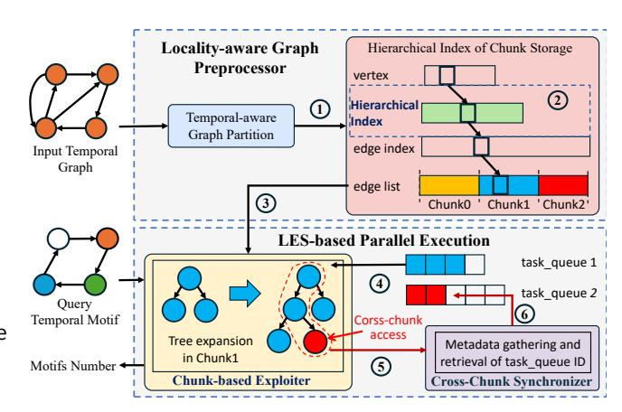

Figure 8. System Architecture of DTMiner

triggered to concurrently expand their search trees (step ○4 ), thus enabling shared data access and enhancing memory efficiency. Moreover, it employs a three-level work-stealing strategy to ensure load balance on the multiple-core platform for efficient temporal motif mining.

Cross-Chunk Synchronizer. When a matching task requires cross-chunk accesses to expand its search tree, it first gathers metadata information of this task (step ○5 ), then retrieves the corresponding task\_queue chunk ID, and finally pushes this metadata into the task\_queue of the target chunk (step ○6 ). In addition, a memory-aware adaptive synchronization method is proposed to reduce the additional memory consumption induced by the fine-grained synchronization mechanism.

### 4.2 Locality-aware Temporal Graph Preprocessing

4.2.1 Temporality-aware Graph Partition. To exploit the spatial locality and temporal monotonicity of temporal motif mining, it sequentially divides the temporal edges into a series of consecutive chunks in temporal order. Nevertheless, the cache locality and memory consumption may be affected by the chunk size, denoted as ���� . If ���� is set too large, the data access cost may increase. This is because when only a portion of a chunk can fit into the LLC, it must be evicted when the remaining part of the chunk has to be loaded. Since a chunk is usually traversed by multiple matching tasks, its data may be repeatedly evicted from and reloaded into the LLC, leading to substantial cost. In contrast, if ���� is too small, it may cause excessive memory usage for metadata information during execution, as more matching tasks may be suspended due to frequent cross-chunk accesses. Thus, a suitable chunk size is expected to be the maximum integer satisfying ���� + ���� + �� ≤ ��������, where ���� denotes the size of the index structure for each chunk (to be introduced later), �� is the size of the reserved space in the LLC (which is used to store the intermediate data, e.g., mapping between query motif and the graph, generated at runtime), and �������� denotes the size of the LLC. Note that ���� is aligned to be a common

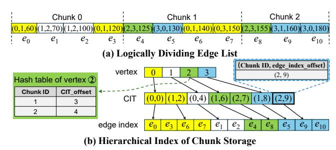

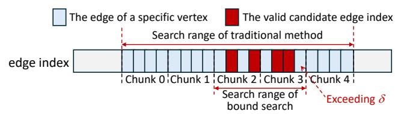

Figure 10. Illustration of the bound search operation

4.3.1 Bound Search for Temporal Chunk Loading. During the execution, DTMiner tries to sequentially stream the chunks into the LLC in chronological order for processing. To achieve this goal, during the exploration (e.g., ���������� ) of a chunk (e.g., ���� ), as shown in Algorithm [1,](#page-6-1) we introduce a BoundSearch operation (lines 17-21) that strictly confines data accesses to ���� . Specifically, for the matching task ���������� , it employs the BoundSearch operation to retrieve the outgoing/incoming temporal edges within���� of its matched vertex (e.g., ���� ) of the current search level (line 18) to explore valid candidate edges. To this end, it first obtains the Bound (e.g., the start and end offsets of���� 's edge index within���� ) from the CIT (line 19). Note that if ���� has a hash table, it can be used to index the corresponding entry in the CIT. After that, it directly applies the traditional Search operation, as adopted in the existing solutions [\[31,](#page-12-5) [46,](#page-12-2) [51\]](#page-13-1), to filter the candidate edges that satisfy both topological and temporal constraints (line 20). Note that if the edge of ���� does not exist in ���� , the Bound is set as false (i.e., its start is larger than its end) and then the Search operation returns an empty Candidates (line 21). In this way, only the data within the scheduled chunk is traversed by the matching tasks, allowing the loaded data to be shared among them while restricting memory accesses to the graph data already stored in the cache. More importantly, as shown in Figure [10,](#page-7-0) it naturally prunes the search range of binary search operation on chunks whose timestamps are earlier (e.g., Chunk 0 and Chunk 1) than the current chunk and are exceeding the time span �� (e.g., Chunk 4). This contrasts with existing approaches [\[31,](#page-12-5) [46,](#page-12-2) [51\]](#page-13-1), which perform binary searches over all outgoing/incoming temporal edges of a vertex to identify valid candidate edges. Note that if, in extreme cases, valid candidate edges appear in both Chunk 0 and Chunk 4, the search range would remain the same as the existing approaches [\[31,](#page-12-5) [46,](#page-12-2) [51\]](#page-13-1).

4.3.2 Parallel Exploration of Temporal Chunk. For each scheduled chunk ���� , as illustrated in Algorithm [1,](#page-6-1) its relevant tasks are divided into a series of consecutive parts and then evenly distributed across the threads for parallel execution (line 4). After that, each parallel task (e.g., task�� ) employs the Explore function to expand the search tree within the chunk ���� (line 5). Specifically, the BoundSearch operation is first employed to obtain valid candidate edges in ���� (line 7). If a valid candidate edge is found, the bookkeeping operation records its corresponding metadata for task�� (lines 8–9). When an extended edge of task�� matches the query temporal motif, the count of valid motifs is incremented

(lines 11–12); otherwise, the Explore function recursively explores the neighboring temporal edges to continue search tree expansion within ���� (line 14). If no further edge can be explored in ���� for task�� , the Synchronize operation pushes the metadata information of task�� to a subsequent chunk (introduced in §[4.3.3\)](#page-7-1), thereby avoiding cross-chunk accesses for better data locality.

Three-level Work Stealing. Due to the power-law distribution of real-world temporal graphs and inherent both topological and temporal constraints in temporal motif mining, the search trees starting from different temporal edges may suffer from significant load imbalance. To address this problem, we introduce a three-level work-stealing strategy on NUMA architecture [\[25\]](#page-12-17) commonly adopted in modern servers, i.e., intra-NUMA level, inter-NUMA level, and Cross-Chunk level. The details are described as follows.

- Intra-NUMA Work Stealing. We bind each thread to a fixed physical core, which first allocates the memory from the corresponding local NUMA node by default to ensure memory affinity. When a thread finishes its assigned tasks, it first steals tasks from other threads within the local NUMA node, ensuring better data locality and reducing cross-socket memory access.
- Inter-NUMA Work Stealing. When no tasks can be stolen from threads within the local NUMA node, the stealing thread attempts to steal the tasks from remote NUMA nodes. In this way, hardware resources can be further utilized, thereby enhancing overall performance.
- Cross-Chunk Work Stealing. If there are no tasks that can be stolen from the remote NUMA node, the thread steals the tasks across chunk, i.e., assigns the tasks of the subsequent contiguous chunk in local memory for execution, ensuring load balancing with low data access overhead.

4.3.3 Synchronization of Cross-chunk Exploration. When no additional edges can be explored within the scheduled chunk for a matching task, the search tree expansion of this task needs to be synchronized to push its metadata information to ��������\_���������� of another chunk �������������� that contains valid candidate edges, so as to continue its search tree expansion when loading �������������� in the future. Specifically, as shown in Algorithm [1,](#page-6-1) once the matched vertex's in-chunk exploration within the current chunk is completed, the synchronize operation first retrieves a subsequent valid candidate edge ���� from another chunk (line 23). It can be directly performed based on the edge index. For example, as shown in Figure [9,](#page-6-0) when the search tree expansion in the Chunk 0 originating from vertex ○0 finishes, it will obtain the subsequent temporal edge (e.g., ��4) following Chunk 0 and then checks whether this edge satisfies both the topological and temporal constraints. If so, the target chunk that contains ���� can be directly obtained based on the chunk size

Table 1. Temporal graph datasets used in the experiments

| Temporal              |           | Graph | #Vertices      | #Temporal Edges | Average Degree #Static | Undirected Edges | Time Span (years) |
|-----------------------|-----------|-------|----------------|-----------------|------------------------|------------------|-------------------|
| wikitalk              | (wi) [26] |       | 1,140,149      | 7,833,140       | 6.87                   | 2,787,968        | 6.24              |
| stackoverflow         | (so)      | [26]  | 2,601,977      | 63,497,050      | 24.40                  | 34,875,685       | 7.6               |
| temporal-reddit-reply |           | (re)  | [30] 8,901,033 | 646,044,687     | 72.58                  | 435,290,421      | 10.1              |
| ethereum              | (eth)     | [21]  | 66,323,478     | 628,810,973     | 9.48                   | 186,064,655      | 3.58              |

**M1** 1 2 3 **M2** 2 1 3 **M3** 1 2 4 3 **M4** 1 4 3 2 **M5** 2 1 3 4 1 2 3 4 **M6 M7** 3 4 2 1 **M8** 1 3 4 2 **M9** 4 3 1 2 **M10** 1 4 5 2 3 **M11** 5 4 1 2 3 **M12** 1 5 2 3 4 1 5 2 3 **M13** 4

Figure 11. Temporal motifs used for evaluation

���� (line 25). After that, the metadata of this task will be enqueued to the ��������\_���������� of this target chunk, and the size of the ��������\_���������� dynamically grows and shrinks at runtime. Note that the metadata of this task is pushed into the ��������\_���������� of only one chunk, thereby reducing memory consumption.

Memory-aware Adaptive Synchronization. The finegrained synchronization of search tree expansion across chunks increases memory consumption, as it requires storing metadata of tasks. To overcome this challenge, we design a memory-aware adaptive synchronization method. Specifically, it enforces a memory usage threshold (set to 30% of total memory by default) to limit the memory consumption of metadata. Initially, the threshold is evenly divided among all threads, such that each thread has an equal upper bound on memory consumption. When a thread exceeds its assigned quota, it attempts to dynamically acquire unused memory size from other threads. If no additional memory is available, the synchronization strategy is disabled. That is, instead of pushing metadata into the ��������\_���������� of the target chunk, the task directly accesses the edge data of the target chunk for tree expansion, preventing further memory consumption growth. Meanwhile, overall memory usage decreases as tasks from the current chunk's ��������\_���������� are handled. Once all tasks in a chunk are completed, it reevaluates the available free memory space to decide whether to revert to the fine-grained synchronization mechanism.

# 5 Evaluation

# 5.1 Experimental Setup

Hardware Environments. All experiments are conducted on a dual-socket server, which is equipped with two 32 core Intel Xeon Platinum 8357B processors (48 MB last-level cache) running at 2.6 GHz, 503 GB DDR4 RAM, and 16 memory channels. It runs Ubuntu 20.04 with the Linux kernel

version 5.15.0. All programs are compiled using cmake version 4.0.1 and gcc version 11.4.0 with -O3 optimization.

Temporal Graph Datasets and Motifs. Similar to prior works [\[46,](#page-12-2) [51\]](#page-13-1), we use four representative real-world temporal graphs as shown in Table [1](#page-8-1) and 13 structurally diverse motifs with 3 to 5 edges as illustrated in Figure [11.](#page-8-2) Meanwhile, like prior works [\[46,](#page-12-2) [51\]](#page-13-1), we set different time window parameter �� for the temporal graph datasets, i.e., 1 day for wikitalk and stackoverflow, 10 hours for temporal-reddit-reply, and 1 hour for ethereum, respectively.

Baseline. To evaluate the performance of DTMiner, we first extend the open-source implementation of the stateof-the-art temporal motif mining algorithm by Mackey et al. [\[31\]](#page-12-5) into an in-house parallel version, denoted as Mackey-P, following [\[51\]](#page-13-1). Next, we optimize Mackey-P by incorporating several temporal motif mining optimizations, including candidate edge caching, load balancing, and motif-specific code generation in [\[51\]](#page-13-1) and search index memoization in [\[46\]](#page-12-2). The optimized version of Mackey-P is named Mackey-o, which outperforms Mackey-P by up to 15.1 times and is used as the baseline system.

### 5.2 Overall Performance

Figure [12](#page-9-0) evaluates the performance of different solutions. This figure shows that DTMiner achieves 1.14× to 11.98× (4.25× on average) performance improvement compared to Mackey-o. This is primarily because our data-centric LES execution model reduces redundant graph traversal and improves data locality during temporal motif mining. Note that we also revise Mackey-o to directly store temporal edges in edge index, obtaining Mackey-M, which outperforms Mackey-o by only 1.05× on average. This is because the primary bottleneck in Mackey-o lies in binary search within the edge index, rather than indirect access in the edge list. DTMiner still outperforms Mackey-M by up to 11.41×.

Figure [13](#page-9-1) further evaluates the amount of data swapped into the LLC using the metric of cache misses. The results show that the amount of memory access in DTMiner is only 3.6%-36.4%, 22.3%-44.6%, 9.3%-38.2%, and 0.8%-17.8% of Mackey-o for wi, so, re, and eth, respectively. Specifically, the total cache references of DTMiner are only 3.3%-60.5% of those of Mackey-o, and the cache miss rate of Mackey-o and DTMiner are 13.4%-42.6% and 1.3%-23.7%, respectively. This reduction mainly comes from the following reasons. First, the data accesses to the same temporal graph data can be efficiently shared by different matching tasks. Second,

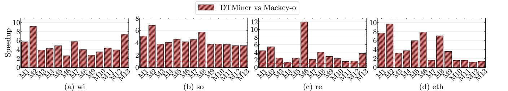

Figure 12. Performance improvements compared to Mackey-o

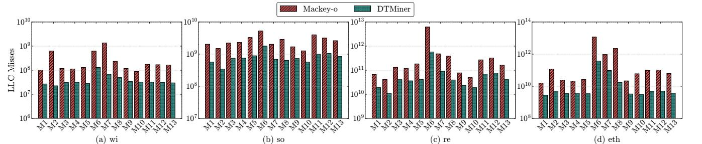

Figure 13. LLC misses comparison of Mackey-o and DTMiner

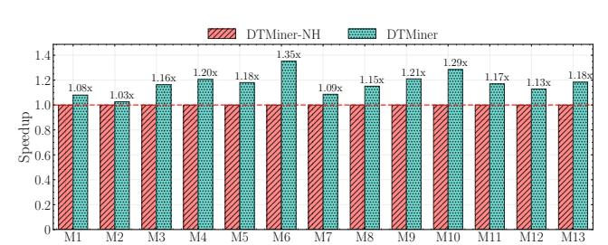

Figure 14. Effectiveness of hash index on wi

the fragmented memory accesses among different tasks are confined to the graph data residing in the cache for better data locality.

### 5.3 Effectiveness of Optimization Techniques

In this section, we evaluate the effectiveness of several optimization techniques adopted in DTMiner.

Effectiveness of Hash Index. To evaluate the performance improvement brought by the hash table used in the hierarchical index structure, we implement DTMiner-NH, which does not employ the hash table, and then evaluate the performance of DTMiner-NH on wi. Figure [14](#page-9-2) shows that DTMiner outperforms DTMiner-NH by 1.03×–1.35× (1.17× on average). This is attributed to the fact that the hash index can reduce the overhead of searching Chunk ID in CIT during tree exploration, thereby enhancing the performance. The performance improvement obtained by the hash index is affected by the number of cross-chunk tasks, which is mainly affected by both properties of dataset and motif. For example, M2 and M7 have multiple edges connecting to the same vertex in the same edge direction, and those edges are expanded consecutively. Therefore, they experience numerous in-chunk expansions rather than cross-chunk expansions, incurring low speedup gains from the hash index.

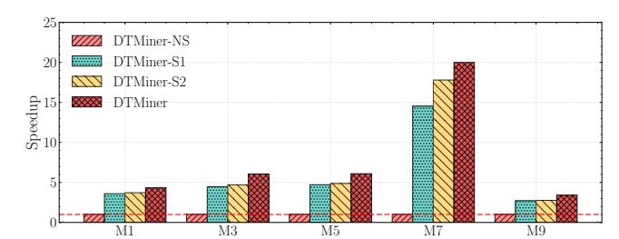

Figure 15. Effectiveness of three-level work stealing on wi

Effectiveness of Three-level Work Stealing. To evaluate the performance improvement of our work stealing strategy, we implement DTMiner-NS (without work stealing), DTMiner-S1 (with intra-NUMA work stealing), and DTMiner-S2 (with both intra-NUMA and inter-NUMA work stealing) and evaluate their performances on wi. Figure [15](#page-9-3) shows that, DTMiner, DTMiner-S2, and DTMiner-S1 gain 4.33×-20.00×, 3.72×-17.80×, and 3.60×-14.52× speedups compared with DTMiner-NS, respectively. The performance improvements differ across motifs due to properties of both graph and motif. Specifically, real-world temporal graphs typically follow a power-law distribution. That is, within short time intervals, multiple directed edges are often generated to the same vertex in the same direction (either all incoming or all outgoing). When a motif contains multiple edges in the same direction from/to same vertex (e.g., M7), this vertex may be mapped to a high-degree vertex in a chunk. Consequently, the thread processing this vertex experiences a heavy workload, as it must check many candidate edges within this chunk. Our work-stealing strategy provides higher performance improvements for such motifs.

Effectiveness of Memory-aware Adaptive Synchronization. Figure [16](#page-10-0) evaluates the impacts of our memoryaware adaptive synchronization, where DTMiner-without

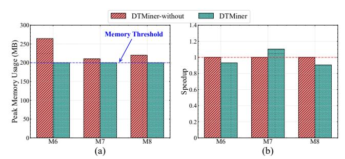

Figure 16. (a) the peak memory usage and (b) execution time with/without our memory-aware adaptive synchronization on re

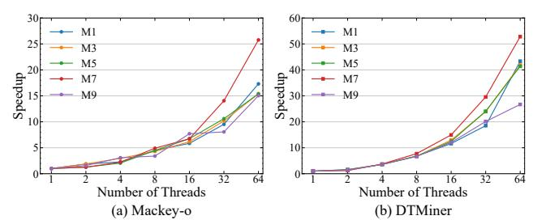

Figure 17. Scalability of Mackey-o and DTMiner on wi, where (a) and (b) use different y-axis ranges.

is the version of DTMiner that disables this optimization. It shows that DTMiner achieves comparable performance with lower memory consumption during execution on re, where only the peak memory consumption during the mining of M6, M7, and M8 on re exceeds the memory threshold. In detail, limiting memory consumption typically incurs performance degradation (e.g., M6 and M8). However, M7 suffers from severe load imbalance as discussed above. Its improved performance can be attributed to immediately conducting cross-chunk exploration exposes greater parallelism, alleviating load imbalance. Note that DTMiner increases the cache misses by 1.94%-8.32% comapred to DTMiner-without due to the cross-chunk data access.

### 5.4 Scalability Analysis

Figure [17](#page-10-1) demonstrates that DTMiner exhibits better scalability than Mackey-o as the number of threads increases. For example, when mining motif M7 on wi with 64 threads, DTMiner achieves 52.8× speedup over its single-threaded baseline, whereas Mackey-o gains only 25.8× improvement. As shown in Figure [6,](#page-3-3) as the number of threads increases, Mackey-o incurs a rapidly growing number of memory accesses, leading to severe cache contention and consequently limiting its scalability. In contrast, DTMiner effectively regularizes data accesses of different tasks, thereby improving data locality and mitigating contention.

# 5.5 Preprocessing Overhead Analysis

Table [2](#page-10-2) shows that DTMiner incurs 4.8%, 10.6%, 25.9%, and 90.7% extra preprocessing time (generating the fine-grained

Table 2. Comparison of preprocessing time and memory usage between Mackey-o and DTMiner

| Graph | Graph Size (MB) | Preprocessing Mackey-o | Time (ms) DTMiner | Memory Mackey-o | Usage (MB) DTMiner |
|-------|-----------------|------------------------|-------------------|-----------------|--------------------|
| wi    | 165.50          | 2646                   | 2773              | 227.43          | 327.71             |
| so    | 1561.97         | 13861                  | 15334             | 975.64          | 1283.84            |
| re    | 15743.97        | 144283                 | 181752            | 8226.74         | 13231.79           |
| eth   | 16443.15        | 78808                  | 150365            | 11226.28        | 19215.44           |

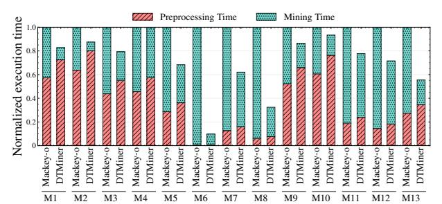

Figure 18. Fraction of time spent on preprocessing and mining of DTMiner and Mackey-o on re

chunks and hierarchical index structure) and 44.1%, 31.5%, 60.8%, and 71.2% additional memory usage (maintaining our hierarchical index structure) compared to Mackey-o for wi, so, re, and eth, respectively. Despite DTMiner requiring such additional preprocessing cost, the end-to-end execution time (including both preprocessing time and temporal motif mining time) of DTMiner is still lower than that of Mackeyo. As shown in Figure [18,](#page-10-3) compared to Mackey-o, DTMiner still gains 2.13× end-to-end performance improvement on average. Note that the preprocessing for a temporal graph is performed only once and can be reused by multiple temporal motif mining applications, further amortizing its cost.

# 6 Related Work

Static Graph Mining. Several systems [\[1,](#page-11-10) [6](#page-11-11)[–9,](#page-11-12) [11,](#page-11-7) [15,](#page-11-13) [17,](#page-12-21) [19,](#page-12-22) [20,](#page-12-15) [28,](#page-12-11) [29,](#page-12-12) [32,](#page-12-23) [33,](#page-12-24) [39,](#page-12-25) [40,](#page-12-26) [44,](#page-12-27) [45,](#page-12-28) [47,](#page-12-13) [48,](#page-13-3) [50\]](#page-13-4) are proposed to support static graph mining. Early systems [\[1,](#page-11-10) [7,](#page-11-14) [15,](#page-11-13) [47,](#page-12-13) [48,](#page-13-3) [50\]](#page-13-4) adopt the pattern-oblivious method, which performs exhaustive subgraph enumeration followed by isomorphism tests to filter out invalid subgraphs. To further improve efficiency, recent systems [\[6,](#page-11-11) [8,](#page-11-6) [9,](#page-11-12) [11,](#page-11-7) [17,](#page-12-21) [19,](#page-12-22) [20,](#page-12-15) [28,](#page-12-11) [29,](#page-12-12) [32,](#page-12-23) [33,](#page-12-24) [44,](#page-12-27) [45\]](#page-12-28) employ and optimize the pattern-aware method, which uses intersection operations to generate valid candidate vertices during search tree exploration, avoiding isomorphism tests and reducing the search space. However, these static graph mining systems cannot directly support temporal motif mining, because they focus only on the structural constraint of static graphs and ignore the temporal constraints inherent in temporal graphs.

Temporal Motif Mining. Recently, several systems have sified into two categories, i.e., approximate motif mining systems [\[30,](#page-12-19) [42,](#page-12-29) [49\]](#page-13-5) and exact motif mining systems [\[23,](#page-12-30) [31,](#page-12-5) pling and mining partial temporal edges, thereby achieving good scalability. Wang et al. [\[49\]](#page-13-5) try to efficiently support approximate temporal motif counting via edge sampling and wedge sampling. In contrast, the latter supports a wider range of application scenarios and has consequently been the focus of recent studies. MoTTo [\[27\]](#page-12-14) employs multiple pruning strategies to efficiently count temporal motifs with up to three vertices and three edges. Mackey et al. [\[31\]](#page-12-5) try to achieve more general temporal motif mining by resolving both structural and temporal constraints together. Based on allelism and high internal bandwidth of GPUs to accelerate ator that exploits fine-grained parallelism. However, they still suffer from redundant graph traversals and fragmented memory access. In comparison, DTMiner enables traversal tially reducing random memory accesses, thereby achieving

been developed for temporal motif mining and can be clas-[38,](#page-12-7) [46,](#page-12-2) [51\]](#page-13-1). The former reduces processing overhead by sam-Mackey et al.'s algorithm, Everest [\[51\]](#page-13-1) leverages massive parmotif mining, and Mint [\[46\]](#page-12-2) proposes a hardware accelersharing across different motif matching tasks and substansignificantly lower data access overhead. 7 Conclusion This paper proposes a novel data-centric system DTMiner to handle temporal motif mining efficiently. Specifically, DT-Miner develops a novel Load-Explore-Synchronize (LES) execution model to efficiently regularize data accesses of different matching tasks through fully exploiting the spatial similarity and temporal monotonicity among them. The experimental results show that DTMiner achieves up to 11.98× performance improvement compared to the cutting-edge temporal motif mining solution. Acknowledgments The authors would like to thank all anonymous reviewers for their insightful comments. This paper is supported by National Key Research and Development Program of China (No. 2024YFB4504200) and National Natural Science Foundation of China (No. 62402457 and 62372199). Jin Zhao (zjin@hust.edu.cn) is the corresponding author of this paper. References [1] Ehab Abdelhamid, Ibrahim Abdelaziz, Panos Kalnis, Zuhair Khayyat, and Fuad Jamour. 2016. ScaleMine: Scalable Parallel Frequent Subgraph Mining in a Single Large Graph. In Proceedings of the 2016 International Conference for High Performance Computing, Networking, Storage and Analysis. 716–727. doi:[10.5555/3014904.3014986](https://doi.org/10.5555/3014904.3014986) [2] Maciej Besta, Raghavendra Kanakagiri, Grzegorz Kwasniewski, Rachata Ausavarungnirun, Jakub Beránek, Konstantinos Kanellopoulos, Kacper Janda, Zur Vonarburg-Shmaria, Lukas Gianinazzi, Ioana Stefan, Juan Gómez Luna, Jakub Golinowski, Marcin Copik, Lukas Kapp-Schwoerer, Salvatore Di Girolamo, Nils Blach, Marek Konieczny, Onur Mutlu, and Torsten Hoefler. 2021. SISA: Set-Centric Instruction Set Architecture for Graph Mining on Processing-in-Memory Systems. In Proceedings of the 54th IEEE/ACM International Symposium on Microarchitecture. 282–297. doi:[10.1145/3466752.3480133](https://doi.org/10.1145/3466752.3480133) [3] Giorgos Bouritsas, Fabrizio Frasca, Stefanos Zafeiriou, and Michael M. Bronstein. 2022. Improving graph neural network expressivity via subgraph isomorphism counting. IEEE Transactions on Pattern Analysis and Machine Intelligence 45, 1 (2022), 657–668. doi:[10.1109/TPAMI.](https://doi.org/10.1109/TPAMI.2022.3154319) [2022.3154319](https://doi.org/10.1109/TPAMI.2022.3154319) [4] Weichen Cao, Ke Meng, Zhiheng Lin, and Guangming Tan. 2025. GLumin: Fast Connectivity Check Based on LUTs For Efficient Graph Pattern Mining. In Proceedings of the 30th ACM SIGPLAN Annual Symposium on Principles and Practice of Parallel Programming. 455–468. doi:[10.1145/3710848.3710889](https://doi.org/10.1145/3710848.3710889) [5] Benjamin Paul Chamberlain, Sergey Shirobokov, Emanuele Rossi, Fabrizio Frasca, Thomas Markovich, Nils Hammerla, Michael M. Bronstein, and Max Hansmire. 2022. Graph neural networks for link prediction with subgraph sketching. arXiv preprint arXiv:2209.15486 (2022). doi:[10.48550/arXiv.2209.15486](https://doi.org/10.48550/arXiv.2209.15486) [6] Joanna Che, Kasra Jamshidi, and Keval Vora. 2024. Contigra: Graph Mining with Containment Constraints. In Proceedings of the 19th European Conference on Computer Systems. 50–65. doi:[10.1145/3627703.](https://doi.org/10.1145/3627703.3629589) [3629589](https://doi.org/10.1145/3627703.3629589) [7] Hongzhi Chen, Miao Liu, Yunjian Zhao, Xiao Yan, Da Yan, and James Cheng. 2018. G-Miner: An Efficient Task-Oriented Graph Mining System. In Proceedings of the 13th European Conference on Computer Systems. 32:1–32:12. doi:[10.1145/3190508.3190545](https://doi.org/10.1145/3190508.3190545) [8] Jingji Chen and Xuehai Qian. 2022. DecoMine: A Compilation-Based Graph Pattern Mining System with Pattern Decomposition. In Proceedings of the 28th ACM International Conference on Architectural Support for Programming Languages and Operating Systems. 47–61. doi:[10.1145/3567955.3567956](https://doi.org/10.1145/3567955.3567956) [9] Jingji Chen and Xuehai Qian. 2023. Khuzdul: Efficient and Scalable Distributed Graph Pattern Mining Engine. In Proceedings of the 28th ACM International Conference on Architectural Support for Programming Languages and Operating Systems. 413–426. doi:[10.1145/3575693.3575743](https://doi.org/10.1145/3575693.3575743) [10] Qihang Chen, Boyu Tian, and Mingyu Gao. 2022. Fingers: Exploiting fine-grained parallelism in graph mining accelerators. In Proceedings of the 27th ACM International Conference on Architectural Support for Programming Languages and Operating Systems. 43–55. doi:[10.1145/](https://doi.org/10.1145/3503222.3507730) [3503222.3507730](https://doi.org/10.1145/3503222.3507730) [11] Xuhao Chen and Arvind. 2022. Efficient and Scalable Graph Pattern Mining on GPUs. In Proceedings of the 16th USENIX Symposium on Operating Systems Design and Implementation. 857–877. [https://www.](https://www.usenix.org/conference/osdi22/presentation/chen) [usenix.org/conference/osdi22/presentation/chen](https://www.usenix.org/conference/osdi22/presentation/chen) [12] Xuhao Chen, Roshan Dathathri, Gurbinder Gill, and Keshav Pingali. 2020. Pangolin: An efficient and flexible graph mining system on cpu and gpu. Proceedings of the VLDB Endowment 13, 8 (2020), 1190–1205. doi:[10.14778/3389133.3389137](https://doi.org/10.14778/3389133.3389137) [13] Xuhao Chen, Tianhao Huang, Shuotao Xu, Thomas Bourgeat, Chanwoo Chung, and Arvind. 2021. Flexminer: A pattern-aware accelerator for graph pattern mining. In Proceedings of the 48th ACM/IEEE Annual International Symposium on Computer Architecture. 581–594. doi:[10.1109/ISCA52012.2021.00052](https://doi.org/10.1109/ISCA52012.2021.00052) [14] Kenneth L. Cooke and Eric Halsey. 1966. The shortest route through a network with time-dependent internodal transit times. J. Math. Anal. Appl. 14, 3 (1966), 493–498. doi:[10.1016/0022-247X\(66\)90009-6](https://doi.org/10.1016/0022-247X(66)90009-6) [15] Vinicius Dias, Carlos H. C. Teixeira, Dorgival Guedes, Wagner Meira, and Srinivasan Parthasarathy. 2019. Fractal: A general-purpose graph pattern mining system. In Proceedings of the 2019 International Conference on Management of Data. 1357–1374. doi:[10.1145/3299869.3319875](https://doi.org/10.1145/3299869.3319875) [16] Joshua Glasser and Brian Lindauer. 2013. Bridging the gap: A pragmatic approach to generating insider threat data. In Proceedings of the 2013 IEEE Security and Privacy Workshops. 98–104. doi:[10.1109/SPW.2013.37](https://doi.org/10.1109/SPW.2013.37)

[17] Chuangyi Gui, Xiaofei Liao, Long Zheng, and Hai Jin. 2023. Cyclosa: Redundancy-Free Graph Pattern Mining via Set Dataflow. In Proceedings of the 2023 USENIX Annual Technical Conference. 71–85. <https://www.usenix.org/conference/atc23/presentation/gui> [18] László Hajdu and Miklós Krész. 2020. Temporal network analytics for fraud detection in the banking sector. In Proceedings of the 2020 International Conference on Theory and Practice of Digital Libraries. 145–157. doi:[10.1007/978-3-030-55814-7\\_12](https://doi.org/10.1007/978-3-030-55814-7_12) [19] Kasra Jamshidi, Rakesh Mahadasa, and Keval Vora. 2020. Peregrine: a pattern-aware graph mining system. In Proceedings of the Fifteenth European Conference on Computer Systems. 1–16. doi:[10.1145/3342195.](https://doi.org/10.1145/3342195.3387548) [3387548](https://doi.org/10.1145/3342195.3387548) [20] Kasra Jamshidi, Harry Xu, and Keval Vora. 2023. Accelerating Graph Mining Systems with Subgraph Morphing. In Proceedings of the 18th European Conference on Computer Systems. 162–181. doi:[10.1145/3552326.](https://doi.org/10.1145/3552326.3567489) [3567489](https://doi.org/10.1145/3552326.3567489) [21] Dániel Kondor, Nikola Bulatovic, József Stéger, István Csabai, and Gábor Vattay. 2021. The rich still get richer: Empirical comparison of preferential attachment via linking statistics in Bitcoin and Ethereum. Frontiers in Blockchain 4 (2021), 668510. doi:[10.3389/fbloc.2021.668510](https://doi.org/10.3389/fbloc.2021.668510) [22] Lauri Kovanen, Márton Karsai, Kimmo Kaski, János Kertész, and Jari Saramäki. 2011. Temporal motifs in time-dependent networks. Journal of Statistical Mechanics: Theory and Experiment 2011, 11 (2011), P11005. doi:[10.1145/3018661.3018731](https://doi.org/10.1145/3018661.3018731) [23] Rohit Kumar and Toon Calders. 2018. 2scent: An efficient algorithm to enumerate all simple temporal cycles. Proceedings of the VLDB Endowment 11, 11 (2018), 1441–1453. doi:[10.14778/3236187.3269460](https://doi.org/10.14778/3236187.3269460) [24] Srijan Kumar, Xikun Zhang, and Jure Leskovec. 2019. Predicting dynamic embedding trajectory in temporal interaction networks. In Proceedings of the 25th ACM SIGKDD International Conference on Knowledge Discovery & Data Mining. 1269–1278. doi:[10.1145/3292500.3330895](https://doi.org/10.1145/3292500.3330895) [25] Christoph Lameter. 2013. An overview of non-uniform memory access. Commun. ACM 56, 9 (2013), 59–54. doi:[10.1145/2500468.2500477](https://doi.org/10.1145/2500468.2500477) [26] Jure Leskovec and Andrej Krevl. 2014. SNAP Datasets: Stanford Large Network Dataset Collection. <http://snap.stanford.edu/data>. [27] Jiantao Li, Jianpeng Qi, Yueling Huang, Lei Cao, Yanwei Yu, and Junyu Dong. 2024. MoTTo: Scalable Motif Counting with Time-aware Topology Constraint for Large-scale Temporal Graphs. In Proceedings of the 33rd ACM International Conference on Information and Knowledge Management. 1195–1204. doi:[10.1145/3627673.3679694](https://doi.org/10.1145/3627673.3679694) [28] Zhiheng Lin, Ke Meng, Chaoyang Shui, Kewei Zhang, Junmin Xiao, and Guangming Tan. 2024. Exploiting Fine-Grained Redundancy in Set-Centric Graph Pattern Mining. In Proceedings of the 29th ACM SIGPLAN Annual Symposium on Principles and Practice of Parallel Programming. 175–187. doi:[10.1145/3627535.3638507](https://doi.org/10.1145/3627535.3638507) [29] Zhiheng Lin, Ke Meng, Changjie Xu, Weichen Cao, and Guangming Tan. 2025. Jupiter: Pushing Speed and Scalability Limitations for Subgraph Matching on Multi-GPUs. In Proceedings of the Twentieth European Conference on Computer Systems. 558–572. doi:[10.1145/3567955.](https://doi.org/10.1145/3567955.3567956) [3567956](https://doi.org/10.1145/3567955.3567956) [30] Paul Liu, Austin Benson, and Moses Charikar. 2018. A sampling framework for counting temporal motifs. arXiv preprint arXiv:1810.00980 (2018). doi:[10.1145/3289600.3290988](https://doi.org/10.1145/3289600.3290988) [31] Patrick Mackey, Katherine Porterfield, Erin Fitzhenry, Sutanay Choudhury, and George Chin Jr. 2018. A Chronological Edge-Driven Approach to Temporal Subgraph Isomorphism. In Proceedings of the 2018 IEEE International Conference on Big Data. 3972–3979. doi:[10.1109/](https://doi.org/10.1109/BigData.2018.8622100) [BigData.2018.8622100](https://doi.org/10.1109/BigData.2018.8622100) [32] Daniel Mawhirter, Sam Reinehr, Connor Holmes, Tongping Liu, and Bo Wu. 2021. GraphZero: A High-Performance Subgraph Matching System. ACM SIGOPS Operating Systems Review 55, 1 (2021), 21–37. doi:[10.1145/3469379.3469383](https://doi.org/10.1145/3469379.3469383) [33] Daniel Mawhirter and Bo Wu. 2019. Automine: harmonizing high-level abstraction and high performance for graph mining. In Proceedings of the 27th ACM Symposium on Operating Systems Principles. 509–523. doi:[10.1145/3341301.3359633](https://doi.org/10.1145/3341301.3359633) [34] Cem Meydan, Hasan H. Otu, and Osman Uğur Sezerman. 2013. Prediction of peptides binding to MHC class I and II alleles by temporal motif mining. BMC Bioinformatics 14, Suppl 2 (2013), S13. doi:[10.1186/1471-2105-14-S2-S13](https://doi.org/10.1186/1471-2105-14-S2-S13) [35] Ron Milo, Shai Shen-Orr, Shalev Itzkovitz, Nadav Kashtan, Dmitri Chklovskii, and Uri Alon. 2002. Network motifs: simple building blocks of complex networks. Science 298, 5594 (2002), 824–827. [doi:](https://doi.org/10.1126/science.298.5594.824)10. [1126/science.298.5594.824](https://doi.org/10.1126/science.298.5594.824) [36] Giang Hoang Nguyen, John Boaz Lee, Ryan A. Rossi, Nesreen K. Ahmed, Eunyee Koh, and Sungchul Kim. 2018. Continuous-time dynamic network embeddings. In Companion Proceedings of the The Web Conference. 969–976. doi:[10.1145/3184558.3191526](https://doi.org/10.1145/3184558.3191526) [37] Raj Kumar Pan and Jari Saramäki. 2011. Path lengths, correlations, and centrality in temporal networks. Physical Review E—Statistical, Nonlinear, and Soft Matter Physics 84, 1 (2011), 016105. doi:[10.1103/](https://doi.org/10.1103/PhysRevE.84.016105) [PhysRevE.84.016105](https://doi.org/10.1103/PhysRevE.84.016105) [38] Ashwin Paranjape, Austin R. Benson, and Jure Leskovec. 2017. Motifs in Temporal Networks. In Proceedings of the Tenth ACM International Conference on Web Search and Data Mining. 601–610. doi:[10.1145/](https://doi.org/10.1145/3018661.3018731) [3018661.3018731](https://doi.org/10.1145/3018661.3018731) [39] Hao Qi, Kang Luo, Ligang He, Yu Zhang, Minzhi Cai, Jingxin Dai, Bingsheng He, Hai Jin, Zhan Zhang, Jin Zhao, Hengshan Yue, Hui Yu, and Xiaofei Liao. 2025. OHMiner: An Overlap-centric System for Efficient Hypergraph Pattern Mining. In Proceedings of the Twentieth European Conference on Computer Systems. 621–636. doi:[10.1145/](https://doi.org/10.1145/3689031.3717474) [3689031.3717474](https://doi.org/10.1145/3689031.3717474) [40] Hao Qi, Yu Zhang, Ligang He, Kang Luo, Jun Huang, Haoyu Lu, Jin Zhao, and Hai Jin. 2023. PSMiner: A Pattern-Aware Accelerator for High-Performance Streaming Graph Pattern Mining. In Proceedings of the 60th ACM/IEEE Design Automation Conference. 1–6. doi:[10.1109/](https://doi.org/10.1109/DAC56929.2023.10247902) [DAC56929.2023.10247902](https://doi.org/10.1109/DAC56929.2023.10247902) [41] Kenneth A. Ross. 2007. Efficient Hash Probes on Modern Processors. In Proceedings of the 23rd International Conference on Data Engineering. 1297–1301. doi:[10.1109/ICDE.2007.368997](https://doi.org/10.1109/ICDE.2007.368997) [42] Ilie Sarpe and Fabio Vandin. 2021. Presto: Simple and scalable sampling techniques for the rigorous approximation of temporal motif counts. In Proceedings of the 2021 SIAM International Conference on Data Mining. 145–153. doi:[10.1137/1.9781611976700.17](https://doi.org/10.1137/1.9781611976700.17) [43] Huijuan Shao, Manish Marwah, and Naren Ramakrishnan. 2013. A temporal motif mining approach to unsupervised energy disaggregation: Applications to residential and commercial buildings. In Proceedings of the 2013 AAAI Conference on Artificial Intelligence. 1327–1333. doi:[10.1609/aaai.v27i1.8485](https://doi.org/10.1609/aaai.v27i1.8485) [44] Tianhui Shi, Jidong Zhai, Haojie Wang, Qiqian Chen, Mingshu Zhai, Zixu Hao, Haoyu Yang, and Wenguang Chen. 2023. GraphSet: High Performance Graph Mining through Equivalent Set Transformations. In Proceedings of the 2023 International Conference for High Performance Computing, Networking, Storage and Analysis. 32:1–32:14. doi:[10.1145/](https://doi.org/10.1145/3581784.3613213) [3581784.3613213](https://doi.org/10.1145/3581784.3613213) [45] Tianhui Shi, Mingshu Zhai, Yi Xu, and Jidong Zhai. 2020. Graphpi: High performance graph pattern matching through effective redundancy elimination. In Proceedings of the 2020 International Conference for High Performance Computing, Networking, Storage and Analysis. 100:1–100:14. doi:[10.1109/SC41405.2020.00104](https://doi.org/10.1109/SC41405.2020.00104) [46] Nishil Talati, Haojie Ye, Sanketh Vedula, Kuan-Yu Chen, Yuhan Chen, Daniel Liu, Yichao Yuan, David T. Blaauw, Alex M. Bronstein, Trevor N. Mudge, and Ronald G. Dreslinski. 2022. Mint: An Accelerator For Mining Temporal Motifs. In Proceedings of the 55th IEEE/ACM International Symposium on Microarchitecture. 1270–1287. doi:[10.1109/MICRO56248.2022.00089](https://doi.org/10.1109/MICRO56248.2022.00089) [47] Carlos H. C. Teixeira, Alexandre J. Fonseca, Marco Serafini, Georgos Siganos, Mohammed J. Zaki, and Ashraf Aboulnaga. 2015. Arabesque:

a system for distributed graph mining. In Proceedings of the 25th Symposium on Operating Systems Principles. 425–440. doi:[10.1145/2815400.](https://doi.org/10.1145/2815400.2815410) [2815410](https://doi.org/10.1145/2815400.2815410) [48] Vasileios Trigonakis, Jean-Pierre Lozi, Tomás Faltín, Nicholas P. Roth, Iraklis Psaroudakis, Arnaud Delamare, Vlad Haprian, Calin Iorgulescu, Petr Koupy, Jinsoo Lee, Sungpack Hong, and Hassan Chafi. 2021. aDFS: An Almost Depth-First-Search Distributed Graph-Querying System. In Proceedings of the 2021 USENIX Annual Technical Conference. 209–224. <https://www.usenix.org/conference/atc21/presentation/trigonakis> [49] Jingjing Wang, Yanhao Wang, Wenjun Jiang, Yuchen Li, and Kian-Lee Tan. 2020. Efficient sampling algorithms for approximate temporal motif counting. In Proceedings of the 29th ACM International Conference on Information & Knowledge Management. 1505–1514. doi:[10.1145/](https://doi.org/10.1145/3340531.3411862) [3340531.3411862](https://doi.org/10.1145/3340531.3411862) [50] Kai Wang, Zhiqiang Zuo, John Thorpe, Tien Quang Nguyen, and Guoqing Harry Xu. 2018. Rstream: marrying relational algebra with streaming for efficient graph mining on a single machine. In Proceedings of the 13th USENIX Symposium on Operating Systems Design and Implementation. 763–782. [https://www.usenix.org/conference/osdi18/](https://www.usenix.org/conference/osdi18/presentation/wang-kai) [presentation/wang-kai](https://www.usenix.org/conference/osdi18/presentation/wang-kai) [51] Yichao Yuan, Haojie Ye, Sanketh Vedula, Wynn Kaza, and Nishil Talati. 2023. Everest: GPU-Accelerated System For Mining Temporal Motifs. Proceedings of the VLDB Endowment 17, 2 (2023), 162–174. [doi:](https://doi.org/10.14778/3626292.3626299)10. [14778/3626292.3626299](https://doi.org/10.14778/3626292.3626299) [52] Yunling Zheng, Zhijian Li, Jack Xin, and Guofa Zhou. 2020. A spatialtemporal graph based hybrid infectious disease model with application to COVID-19. arXiv preprint arXiv:2010.09077 (2020). doi:[10.5220/](https://doi.org/10.5220/0010349003570364) [0010349003570364](https://doi.org/10.5220/0010349003570364)

Received 2025-09-01; accepted 2025-11-10