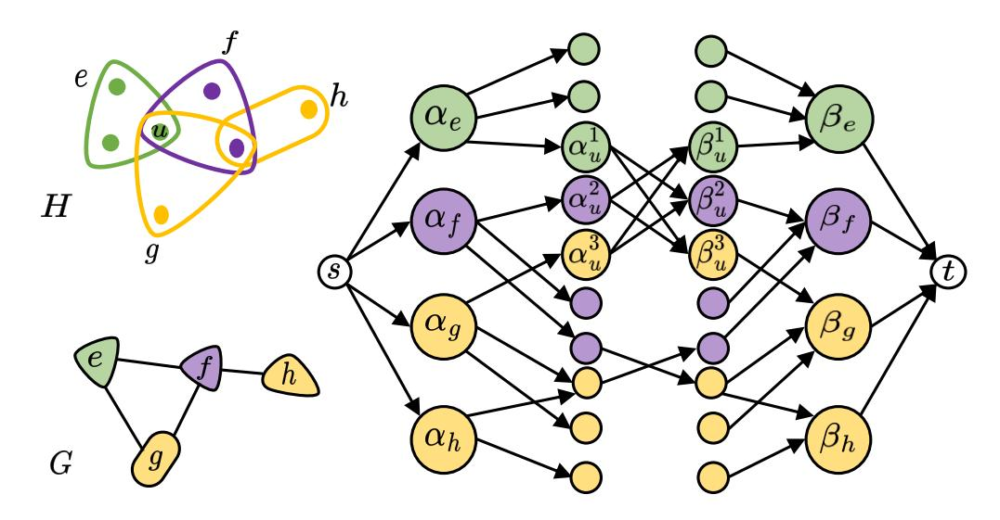

# An Improved Combinatorial Algorithm for Edge-Colored Clustering in Hypergraphs

Seongjune Han1 , Nate Veldt2

1Department of Mathematics, Texas A&M University, Texas, USA

2Department of Computer Science and Engineering, Texas A&M University, Texas, USA

#### Abstract

Many complex systems and datasets are characterized by multiway interactions of different categories, and can be modeled as edge-colored hypergraphs. We focus on clustering such datasets using the NP-hard edge-colored clustering problem, where the goal is to assign colors to nodes in such a way that node colors tend to match edge colors. A key focus in prior work has been to develop approximation algorithms for the problem that are combinatorial and easier to scale. In this paper, we present the first combinatorial approximation algorithm with an approximation factor better than 2.

# 1 Introduction

Graphs are a powerful model for representing pairwise relationships between entities in a dataset or complex real-world system. However, many systems and datasets involve multiway interactions among several entities at once (e.g., group emails, co-authored online articles, sets of co-reviewed retail products on e-commerce platforms) which cannot be fully captured by graphs. Furthermore, these multiway interactions are often associated with a certain type or category (e.g., email topic, venue where an article is published, IP address of product reviewer). One fundamental task for analyzing these types of datasets is to perform categorical clustering, where the goal is to identify groups of objects that tend to be in multiway interactions of a certain category. One formal objective for this problem is minimum edge-colored clustering in hypergraphs (MinECC) [\[1\]](#page-11-0). For this problem, the input is represented by an edge-colored hypergraph, where hyperedges represent multiway interactions and colors represent interaction types. The goal is to color nodes in a way that minimizes the weight of edges that are unsatisfied. An edge is unsatisfied if it contains at least one node that is not assigned the edge's color. Although the problem is NP-hard, many approximation algorithms have been developed. There has been a considerable focus on fast algorithms that can be made purely combinatorial (i.e., not relying on a global convex relaxation of the problem) [\[18,](#page-12-0) [14,](#page-12-1) [1,](#page-11-0) [9\]](#page-11-1). Faster algorithms for MinECC can serve as fundamental primitives for the various tasks that this problem has been motivated by and applied to, which include community detection [\[1\]](#page-11-0), team formation [\[2,](#page-11-2) [10\]](#page-11-3), and resource allocation [\[3\]](#page-11-4).

Related work. The earliest work on edge-colored clustering focused on graphs, and includes work on approximation algorithms for maximizing the number of satisfied edges [\[3\]](#page-11-4), and fixedparameter tractability results [\[6\]](#page-11-5). Amburg et al. [\[1\]](#page-11-0) extended the study to hypergraphs. They developed an approximation algorithm with approximation factor min 2 − k , 2 − 1 r+1 , by rounding a linear programming (LP) relaxation, where k is the number of colors and r is the maximum hyperedge size. Additionally, they introduced combinatorial algorithms with approximation factors that scale linearly with r. Amburg et al. [\[2\]](#page-11-2) later built upon this work by applying the framework to problems like diverse group discovery and team formation, expanding the scope of MinECC applications. Veldt [\[18\]](#page-12-0) developed a min 2 − 2 k , 2 − 2 r+1 -approximation algorithm based on LP rounding, and combinatorial 2-approximations with runtimes that are linear in terms of the hypergraph size. More recently, Crane et al. [\[9\]](#page-11-1) generalized ECC to allow for a budgeted number of overlapping cluster assignments or node deletions, and among other results presented greedy combinatorial r-approximation algorithms. Then, Lee et al. [\[14\]](#page-12-1) used the primal-dual method to develop combinatorial methods for the overlapping objectives, achieving better solution quality than the greedy algorithms and faster performance than the LP-rounding approach. Although much of this prior work has focused on algorithms that are fast and combinatorial, there is no known combinatorial algorithm with an approximation ratio better than 2. Furthermore, among linear-time algorithms, there is a deterministic 2-approximation for the unweighted case and a randomized 2-approximation for the weighted case, but no deterministic 2-approximation for the weighted case [\[18\]](#page-12-0).

Our contributions. Our main contribution is a (2−2/k)-approximation for MinECC that can be made completely combinatorial and has a theoretical runtime that is nearly linear in terms of the size of the hypergraph. This matches the best theoretical approximation algorithm of Veldt [\[18\]](#page-12-0) in cases where r ≥ k − 1, and comes with a faster runtime both in theory and practice. The key to this contribution is to show how to quickly and combinatorially solve a certain type of LP relaxation for MinECC by solving a minimum s-t cut problem in an auxiliary graph. As a secondary contribution, we develop a deterministic 2-approximation algorithm that has a linear runtime and applies to weighted hypergraphs. We accomplish this by combining core ideas from other linear-time MinECC algorithms [\[18\]](#page-12-0) with a fast 2-approximation for weighted minimum vertex cover [\[4\]](#page-11-6).

### 2 Preliminaries

An instance of MinECC is given by an edge-colored hypergraph H = (V, E, C, ℓ) where V is the node set, E is the edge set, C = [k] = {1, 2, 3, · · · , k} is the set of edge colors, and ℓ : E → C is a map assigning an edge to a color in C. Let r denote the maximum hyperedge size, and µ = P e∈E |e| denote the size of the hypergraph. Let Ei be the set of edges with color i. Let E(u) be the set of edges incident to node u ∈ V . For weighted instances, w(e) ≥ 0 represents a nonnegative weight for e ∈ E. Define w(A) = P e∈A w(e). In MinECC, the goal is to color nodes so that the color matches the color of its containing edges as much as possible. Formally, if all nodes in a hyperedge e ∈ E are given the color ℓ(e), then the hyperedge is satisfied; otherwise it is unsatisfied. MinECC seeks to color nodes to minimize the total weight of unsatisfied edges. When there is a node v contained in the intersection of edges e, f ∈ E with ℓ(e) ̸= ℓ(f), we cannot color v in a way that satisfies both edges. We call such a pair (e, f) a bad edge pair and let the set of all bad edge pairs be denoted as B. Let C(u) = {j ∈ C : ∃e ∋ u with j = ℓ(e)} be the list of colors incident to node u. The canonical linear programming relaxation for MinECC (LPECC), is defined as follows:

min P e∈Ew(e)ze s.t. ∀e ∈ E ze ≥ x ℓ(e) u ∀u ∈ e ∀u ∈ V P i∈C x i u = k − 1 ∀u ∈ V 0 ≤ x i u ≤ 1 ∀i ∈ C ∀e ∈ E 0 ≤ ze ≤ 1. (LPECC)

When variables x i u , ze are binary, the relaxation becomes a binary linear program that exactly captures the MinECC objective. The variable x i u for a node u and a color i can be interpreted as a distance. If variables are binary, x i u = 0 indicates that u is given color i, and the variable ze captures whether an edge e is satisfied (ze = 0) or unsatisfied (ze = 1). We denote the optimal solution value for LPECC as OPT(LPECC), and use similar notation for other LPs.

Vertex-cover reduction. Veldt [\[18\]](#page-12-0) showed MinECC can be reduced to Vertex Cover in an approximation preserving way as a means to developing fast 2-approximations. To see this reduction it is helpful to see that MinECC can equivalently be viewed as an edge deletion task, where the goal is to delete a minimum weight set of edges (or number of edges in the unweighted case) so that all nodes belong to edges of at most one color in the remaining hypergraph. This in turn is equivalent to deleting a minimum weight set of edges so that no bad edge pairs remain, then we can color nodes according to the remaining edges. This is analogous to Vertex Cover, the task of identifying a minimum weight set of nodes to cover all edges. In more detail, when reducing MinECC to Vertex Cover, each edge e ∈ E in the hypergraph is associated with a node ve in a Vertex Cover instance, and two nodes (ve, vf ) define an edge if (e, f) ∈ B (see Figure [1\)](#page-8-0). This reduction leads to an alternative type of LP relaxation LPVC for MinECC:

min P e∈E w(e)xe s.t. xe + xf ≥ 1 ∀(e, f) ∈ B xe ≥ 0 ∀e ∈ E. (LPVC)

This LP amounts to reducing MinECC to Vertex Cover and then taking the standard LP relaxation for Vertex Cover. The constraint xe +xf ≥ 1 captures the fact that at least one edge in every bad edge pair must be deleted. A standard fact from prior work on Vertex Cover is that this LP always has an optimal solution that is half-integral, meaning xe ∈ {0, 1, 1/2} for every e ∈ E [\[15\]](#page-12-2).

### 3 A Deterministic 2-approximation Algorithm

Veldt [\[18\]](#page-12-0) presented a randomized 2-approximation algorithm that runs in O(µ) time and applies even to weighted hypergraphs. This algorithm is obtained by implicitly applying the randomized 2 approximation for Vertex Cover by Pitt [\[16\]](#page-12-3) without forming a reduced graph. In order to obtain a linear-time 2-approximation for MinECC that applies to weighted MinECC and is deterministic, we follow a similar approach but instead implicitly implement an existing deterministic algorithm for Vertex Cover. In particular, Algorithm [1](#page-3-0) is the deterministic 2-approximation algorithm for node-weighted Vertex Cover of Bar-Yehuda and Even [\[4,](#page-11-6) [5\]](#page-11-7). It follows a greedy strategy that iterates through edges and locally lowers the weights of two adjacent nodes in the Vertex Cover instance by the minimum of their current weights. After iterating through all edges, the algorithm selects every node whose weight becomes zero. This algorithm can be implemented in linear time in terms of the number of edges in the Vertex Cover instance. However, if we explicitly reduce MinECC to a Vertex Cover instance and then apply Algorithm [1,](#page-3-0) this would take superlinear time in terms of the hypergraph size.

In Algorithm [2,](#page-4-0) we provide pseudocode for our algorithm LocalRatioECC, which implicitly applies Algorithm [1](#page-3-0) to the MinECC instance H = (V, E, C, ℓ) without forming the reduced Vertex Cover instance. For this algorithm, we assume that the edges E are sorted by color in increasing order. For each node v ∈ V , we examine its incident edges E(v), where v(1), v(2), . . . , v(dv) denote the indices of these edges and dv is the degree of v. Algorithm [1](#page-3-0) iterates through edges of the Vertex Cover instance, which would correspond to iterating through bad edge pairs in the MinECC

#### Algorithm 1 LocalRatioVC

Input: A graph G = (V, E) Output: A vertex cover C C ← ∅ for v ∈ V do r(v) = w(v) end for for (u, v) ∈ E do M ← min{r(u), r(v)} r(u) ← r(u) − M r(v) ← r(v) − M end for C ← {v ∈ V | r(v) = 0}

instance. To iterate through all bad edge pairs, we visit each node v ∈ V and consider pairs of edges that are in E(v). We use two pointers, f and b, initialized to 1 and dv, respectively. At each step, either f is incremented or b is decremented. When the pair (ev(f) , ev(b) ) forms a bad edge pair, we reduce the weights of both edges by the minimum of their current weights, following the local-ratio update in Algorithm [1.](#page-3-0) As a result, at least one of the two edges ends up with weight zero. Since the algorithm eventually collects all edges whose weights become zero, which corresponds exactly to the set of edges to be deleted, we can immediately delete the edge whose weight becomes zero. This approach avoids explicitly iterating over all bad edge pairs by skipping pairs involving edges that have already been deleted. This guarantees a total running time of O(µ). Algorithm [2](#page-4-0) follows the same bad edge pair traversal strategy as Veldt [\[18\]](#page-12-0). The difference is that when visiting a bad edge pair (ev(f) , ev(b) ). it deterministically deletes at least one hyperedge by implicitly implementing LocalRatioVC, rather than randomly deleting a hyperedge as in Pitt's algorithm. We summarize with the following theorem.

Theorem 3.1. Algorithm [2](#page-4-0) is a 2-approximation algorithm for MinECC. It runs in O( P v∈V dv) = O(µ) time.

Proof. Since Algorithm [2](#page-4-0) is an implicit implementation of LocalRatioVC and the reduction from MinECC to Vertex Cover is an approximation preserving reduction, Algorithm [2](#page-4-0) is a 2 approximation. When it visits bad edge pairs sharing node v, it performs O(dv) work, since at least one hyperedge containing v is deleted at each step. Therefore it runs in O( P v∈V dv) = O(µ) time overall.

#### Algorithm 2 LocalRatioECC

Input: A weighted instance H = (V, E, C, ℓ)

Output: D ⊆ E of edges to delete D ← ∅ for v ∈ V do E(v) = [ev(1) ev(2) · · · ev(dv) f = 1, b = dv while ev(b) ∈ D and b > f do b ← b − 1 end while while ev(f) ∈ D and b > f do f ← f + 1 end while while ℓ(ev(f) ) ̸= ℓ(ev(b) ) do if w(ev(f) ) < w(ev(b) ) then D ← D ∪ {ev(f)} w(ev(b) ) ← w(ev(b) ) − w(ev(f) ) while ev(f) ∈ D and b > f do f ← f + 1 end while else if w(ev(f) ) = w(ev(b) ) then D ← D ∪ {ev(f) , ev(b)} while ev(f) ∈ D and b > f do f ← f + 1 end while while ev(b) ∈ D and b > f do b ← b − 1 end while else D ← D ∪ {ev(b)} w(ev(f) ) ← w(ev(f) ) − w(ev(b) ) while ev(b) ∈ D and b > f do b ← b − 1 end while end if end while end for Return D

# 4 A Faster (2 − 2/k)-Approximation

This section details our new (2 − 2/k)-approximation for MinECC that can be made completely combinatorial. The approximation guarantee will be obtained by reducing to an instance of kcolorable Vertex Cover and then applying an approximation algorithm for that problem [\[11\]](#page-11-8). This amounts to applying a rounding algorithm for LPVC. The more important contribution is a new and more efficient approach to solve LPVC combinatorially without actually forming the Vertex Cover instance or setting up the LP explicitly.

#### Algorithm 3 Approximate LP rounding algorithm

Input: An optimal half-integral solution X = {xe | e ∈ E} to LPVC

Output: Y ⊆ E of edges to delete

E1 = {e ∈ E : xe = 1}

E1/2 = {e ∈ E : xe = 1/2}

E0 = {e ∈ E : xe = 0}

i ∗ ← argmaxi∈C(w(Ei ∩ E1/2 ))

return Y := E1 ∪ (E1/2 − Ei ∗ ∩ E1/2 )

#### 4.1 The LP rounding algorithm

The reduction from MinECC to Vertex Cover generates a naturally k-colorable graph, by associating hyperedge colors with colors for nodes in the reduced Vertex Cover instance. This is because by design, hyperedges with the same color cannot define bad edge pairs. This observation is beneficial since Hochbaum [\[11\]](#page-11-8) previously showed how to round the LP relaxation for Vertex Cover into a (2 − 2/k)-approximate solution for k-colorable graphs. Instead of explicitly forming a Vertex Cover instance when reducing from MinECC, we can apply the approach of Hochbaum (which amounts to Algorithm [3\)](#page-5-0) to directly round a half-integral solution to LPVC.

Theorem 4.1. Algorithm [3](#page-5-0) is a (2 − 2 k )-approximation for MinECC.

Proof. Given a hypergraph H = (V, E, C, ℓ) and an optimal half-integral solution {x ∗ e | e ∈ E} to LPVC, first, let us show that OPT(LPVC) := P e∈E w(e)x ∗ e = w(E1 ) + 1 2w(E1/2 ).

X e∈E w(e)x ∗ e = X e∈E1 w(e)x ∗ e + X e∈E1/2 w(e)x ∗ e + X e∈E0 w(e)x ∗ e = X e∈E1 w(e) · 1 + X e∈E1/2 w(e) · 1 2 + X e∈E0 w(e) · 0 = w(E 1 ) + 1 2 w(E 1/2 ).

Second, from the definition of i ∗ we know that

w(Ei ∗ ∩ E 1/2 ) ≥ 1 k w(E 1/2 ).

Next, note that if (e, f) is a bad edge pair where e ∈ E0 , then f must be in E1 in order to satisfy xe +xf ≥ 1. Therefore, E0 ∪(Ei ∗ ∩E1/2 ) is a set of satisfiable edges. Now, consider its complement E1 ∪ (E1/2 − Ei ∗ ∩ E1/2 ). Then, its weight (assuming k ≥ 2) is

w(E 1 ∪ (E 1/2 − Ei ∗ ∩ E 1/2 )) = w(E 1 ) + w(E 1/2 ) − w(Ei ∗ ∩ E 1/2 ) ≤ w(E 1 ) + w(E 1/2 ) − 1 k w(E 1/2 ) ≤ 2 − 2 k w(E 1 ) + 1 2 w(E 1/2 ) = 2 − 2 k OPT(LPVC) ≤ 2 − 2 k OPT(MinECC),

Hochbaum [\[11\]](#page-11-8) showed that the Vertex Cover LP relaxation can be solved by reducing it to a minimum s-t cut in an auxiliary graph, where the number of edges in the auxiliary graph is roughly twice the number of edges in the Vertex Cover instance. Applying this approach to a MinECC instance H = (V, E, C, ℓ) would result in an s-t cut problem in an auxiliary graph with 2|E| + 2 nodes and 2|E| + 2|B| = O(|E| 2 ) edges. The resulting minimum s-t cut problem can then in theory be solved in O˜(|E| 2 )-time using the algorithm of van den Brand et al. [\[17\]](#page-12-4). This is already faster than the best approximation obtained by rounding LPECC [\[18\]](#page-12-0), which gives the same (2 − 2/k)-approximation when r ≥ k − 1. The best theoretical runtime for solving an LP of the form minAx=b;x≥0 c T x with N variables is Ω(Nω )-time [\[13,](#page-12-5) [8\]](#page-11-9). When we convert LPECC to this form, the number of variables is N = |E| + k|V | + µ. Since ω ≥ 2, this results in a runtime of Ω((k|V | + µ) 2 ).

Key challenge. Although faster in theory, reducing explicitly to Vertex Cover and applying the results of Hochbaum [\[11\]](#page-11-8) is impractical because the reduced Vertex Cover instance becomes very dense. For many real MinECC datasets (see Table [1\)](#page-9-0), |B| is extremely large. Even finding B explicitly is expensive, and takes superlinear time in terms of the hypergraph size even if r and k are constants. Meanwhile, although the theoretical runtime for LPECC is bad, it often has far fewer constraints than LPVC in practice (see Table [1\)](#page-9-0), and it has been shown to be easily solved in practice for many real-world instances [\[1\]](#page-11-0). Our main contribution is a new way to solve LPVC that completely avoids dealing with bad edge pairs, resulting in better runtimes both in theory and practice.

#### 4.2 Color Pair Binary Linear Program

To avoid the challenge above, we present a binary linear program that is equivalent to LPVC but has far fewer constraints and can be reduced to a much sparser minimum s-t cut problem. The idea behind this binary linear program comes from blending concepts from LPECC and LPVC. We first define a new linear program—the color-pair LP (LPCP)—that merges constraints from LPECC and LPVC:

min X e∈E w(e)ze s.t. ∀e ∈ E, ze ≥ x ℓ(e) u ∀u ∈ e ∀u ∈ V, xi u + x j u ≥ 1 ∀(i, j) ∈ C(u) 2 ∀u ∈ V, 0 ≤ x i u ≤ 1 ∀i ∈ C(u) ∀e ∈ E, 0 ≤ ze ≤ 1. (2)

In this relaxation, the constraint (x i u + x j u ≥ 1) captures the fact that a node u cannot have both color i and color j. This constraint resembles the bad edge pair constraint xe + xf ≥ 1 from LP P VC, but we will not need Ω(|B|) constraints of this form. This constraint relaxes the constraint c∈C x c u = k − 1 from LPECC. This leads to a looser relaxation. LPCP can be shown to be equivalent to the following color-pair binary linear program (BLPCP):

min 1 2 X e∈E w(e)(be − ae + 1) s.t. ∀e ∈ E : ae ≤ a ℓ(e) u ∀u ∈ e ∀e ∈ E : b ℓ(e) u ≤ be ∀u ∈ e ∀u ∈ V : a i u ≤ b j u ∀(i, j) ∈ C(u) 2 ∀u ∈ V : a j u ≤ b i u ∀(i, j) ∈ C(u) 2 ∀u ∈ V : a i u , bi u ∈ {0, 1} ∀i ∈ C(u) ∀e ∈ E : ae, be ∈ {0, 1}. (BLPCP)

We prove that this BLP is equivalent to LPVC, which is perhaps surprising given that it does not include any explicit reference to bad edge pairs. We remark that it is not strictly necessary to consider or prove anything about LPCP in order to see that BLPCP is equivalent to LPVC. However, it serves as a helpful conceptual stepping stone. In particular, it is relatively easy to see that LPCP is a slight relaxation of LPECC. It differs in that it always permits a half-integral solution, and is equivalent with BLPCP and LPVC. Rather than proving all of these equivalences, it suffices for our analysis to prove directly that BLPCP is equivalent to LPVC and can be solved via reduction to a minimum s-t cut problem.

Theorem 4.2. Let {ae, be, ai u , bi u | e ∈ E, u ∈ V, i ∈ C} be a set of optimal variables for BLPCP and for e ∈ E define:

xe = 1 2 (be − ae + 1). (1)

Then, {xe} is an optimal set of variables for LPVC.

Proof. We first show that {xe} variables as defined in Eq. [\(1\)](#page-1-0) are feasible for LPVC. If (e, f) is a bad edge pair, there exists some u ∈ e ∩ f such that the following inequalities hold:

ae ≤ a ℓ(e) u ≤ b ℓ(f) u ≤ bf and af ≤ a ℓ(f) u ≤ b ℓ(e) u ≤ be.

This implies xe + xf = 1 2 (be + bf − ae − af + 2) ≥ 1. Hence, we have a feasible solution for LPVC with the same objective value, so OPT(BLPCP) ≥ OPT(LPVC).

Now, we show OPT(BLPCP) ≤ OPT(LPVC). Let {xe} be an optimal solution to LPVC, and define ae, be as follows:

(ae, be) := (1, 0) if xe = 0 (0, 1) if xe = 1 (1, 1) if xe = 1/2.

Notice that xe = (be − ae + 1)/2, meaning the objective functions of LPVC and BLPCP are equal. We also define a i u and b i u as follows:

a i u := max e∈Ei,u∈e ae and b i u := min e∈Ei,u∈e be.

This implies ae ≤ a ℓ(e) u and b ℓ(e) u ≤ be for all u ∈ e. Now, suppose a i u > bj u for i ̸= j. Then, a i u = 1 and b j u = 0. This tells us that there exists some e ∈ Ei such that u ∈ e and ae = 1. By the definition of ae, having ae = 1 means xe ≤ 2 . Similarly, there exists some f ∈ Ej such that u ∈ f and bf = 0. By the definition of be, having bf = 0 means xf = 0. Since u ∈ e ∩ f and i ̸= j, (e, f) is a bad edge pair, but xe + xf ≤ 2 which contradicts with the constraint xe + xf ≥ 1 in LPVC. Thus, a i u ≤ b j u is true. Using an analogous argument, we can also prove that the constraint a j u ≤ b i u also holds.

Figure 1: In the top left we show a MinECC instance H, which can be reduced to the k-colorable Vertex Cover instance G in the bottom left. On the right, we show the reduced flow network whose minimum s-t cut coincides with the optimal solution to BLPCP (see Section [4.3\)](#page-8-1).

In BLPCP, the number of constraints is 2 P u∈V |C(u)| + 2µ + 2|E| + 2 P u∈V |C(u)| 2 = O(µ + k 2 |V |). This does not depend on |B| and enables us to avoid the issue discussed in Section [4.1.](#page-5-1) If k is constant, this value is linear in terms of the hypergraph size µ.

#### 4.3 Reduction to Flow Network

In addition to having far fewer constraints than LPVC, BLPCP can be reduced to a new minimum s-t cut problem with fewer nodes and edges than the graph obtained by explicitly reducing to Vertex Cover and applying the results of Hochbaum [\[11\]](#page-11-8). Formally, we use the following flow network construction for an instance H = (V, E, C, ℓ):

- 1. Introduce source and sink nodes s and t, and initialize empty node sets AE, BE, AV , and BV .
- 2. For e ∈ E, add nodes αe ∈ AE and βe ∈ BE.
- 3. For u ∈ V and i ∈ C(u), add nodes α i u ∈ AV and β i u ∈ BV .
- 4. For u ∈ V and (i, j) ∈ C(u) 2 , add directed edges (α i u , βj
- u) and (α j u, βi u ) with weight ∞.
- 5. For e ∈ E and each u ∈ e, introduce directed edges (αe, α ℓ(e) u ) and (β ℓ(e) u , βe) with weight ∞.
- 6. For each e ∈ E, introduce directed edges (s, αe) and (βe, t) with weight 1 2w(e).

After forming this graph, we solve the maximum s-t flow problem over it, and use it to compute a minimum s-t cut using standard techniques. This partitions nodes into two sets, S and S¯. Each node in the graph corresponds to one binary variable in BLPCP: node αe corresponds to variable ae, node βe corresponds to be, and similarly we have the mapping α i u ↔ a i u , and β i u ↔ b i u . A variable is set to 1 if its corresponding node is in S, otherwise the variable is 0.

Now, we explain how the construction exactly captures constraints in BLPCP. If there is an ∞-weight directed edge from α to β, then β ∈ S¯ =⇒ α ∈ S¯, and α ∈ S =⇒ β ∈ S, to avoid

Table 1: Statistics for six benchmark MinECC datasets.

| Dataset | V       | E       | k  | Hypergraph r | µ       | Statistics  B | (2 − 2 /k | ) LP ECC | Constraints LP VC | LP CP      |
|---------|---------|---------|----|--------------|---------|---------------|-----------|----------|-------------------|------------|
| Brain   | 638     | 21,180  | 2  | 2            | 42,360  | 490,163       | 1         | 42,998   | 490,163           | 42,998     |
| MAG-10  | 80,198  | 51,889  | 10 | 25           | 180,726 | 473,780       | 1.8       | 260,924  | 473,780           | 910,795    |
| Cooking | 6,714   | 39,774  | 20 | 65           | 428,275 | 312,098,857   | 1.9       | 434,989  | 312,098,857       | 657,292    |
| DAWN    | 2,109   | 87,104  | 10 | 22           | 343,211 | 340,602,559   | 1.8       | 345,320  | 340,602,559       | 374,775    |
| Walmart | 88,837  | 65,898  | 44 | 25           | 452,208 | 27,283,314    | 1.955     | 541,045  | 27,283,314        | 4,680,597  |
| Trivago | 207,974 | 247,362 | 55 | 85           | 757,946 | 2,449,951     | 1.964     | 965,920  | 2,449,951         | 12,210,823 |

Table 2: Comparisons for three algorithms. The ratio columns indicate the objective score divided by the LP lower bound for each algorithm. We display the average and standard deviation over 5 runs.

| Dataset | ratio | LP      | ECC runtime round (s) | memory | ratio |        | runtime VC-Flow (s) | memory | ratio |        | runtime ColorPair-Flow (s) | memory |
|---------|-------|---------|-----------------------|--------|-------|--------|---------------------|--------|-------|--------|----------------------------|--------|
| Brain   | 1     | 0.191   | ± 0.009               | 54MB   | 1.002 | 5.443  | ± 0.196             | 1.1GB  | 1     | 0.526  | ± 0.179                    | 209MB  |
| MAG-10  | 1     | 5.383   | ± 0.378               | 861MB  | 1.193 | 12.413 | ± 0.163             | 1.2GB  | 1.193 | 4.454  | ± 0.142                    | 821MB  |
| Cooking | 1     | 18.465  | ± 1.647               | 540MB  | N/A   | timed  | out                 |        | 1.605 | 1.599  | ± 0.038                    | 1.1GB  |
| DAWN    | 1     | 2.888   | ± 0.121               | 398MB  | N/A   | timed  | out                 |        | 1     | 5.582  | ± 0.177                    | 1.2GB  |
| Walmart | 1     | 631.559 | ± 4.443               | 3.5GB  | N/A   | timed  | out                 |        | 1.654 | 6.794  | ± 0.042                    | 2.4GB  |
| Trivago | 1.001 | 51.124  | ± 7.399               | 9.5GB  | 1.272 | 299.06 | ± 2.25              | 6.1GB  | 1.272 | 54.646 | ± 0.159                    | 4.1GB  |

cutting and ∞-weight edge. If α and β are associated with variables a and b, this is equivalent to a constraint of the form a ≤ b, which enforces that a = 1 =⇒ b = 1 and b = 0 =⇒ a = 0.

Observe finally that the minimum cut value is exactly equal to OPT(BLPCP). Consider an edge e ∈ E. If αe ∈ S, βe ∈ S¯, then neither (s, αe) nor (βe, t) is cut. If αe ∈ S, β ¯ e ∈ S, then both (s, αe) and (βe, t) are cut. This contributes 2 × 1 2w(e) = w(e) to the cut value. If αe, βe ∈ S¯ or αe, βe ∈ S, then either (s, αe) or (βe, t) is cut, respectively. In either case, this contributes 1 2w(e) to the cut. We obtain the same contributions to the objective of BLPCP when we consider what the above cases imply about the variables ae and be.

Improved runtime. We now analyze the runtime of solving the new minimum s-t cut problem. The number of nodes in the reduced flow network is N = 2+2|E|+2 P u∈V |C(u)| ≤ 2+2|E|+2k|V | and the number of edges is

M = 2|E| + 2X e∈E |e| + 2 X u∈V |C(u)| 2 ≤ 2|E| + 2µ + (k 2 − k)|V |.

Given a directed graph with N nodes and M edges, the algorithm of van den Brand et al. [\[17\]](#page-12-4) finds a minimum s-t cut in O˜(M + N1.5 ) time. Chen et al. [\[7\]](#page-11-10) solves the problem in M1+o(1) time. From this we know that BLPCP can be solved in (µ + k 2 |V |) 1+o(1) time or O˜(µ + k 2 |V | + (|E| + k|V |) 1.5 ) time. This is significantly faster than the runtime obtained by reducing explicitly to Vertex Cover and applying the approach of Hochbaum [\[11\]](#page-11-8) (see Section [4.1\)](#page-5-1). In particular, if k is a constant, our best theoretical runtime is nearly linear in terms of the hypergraph size.

#### 5 Experimental Results

We call our new (2 − 2/k)-approximation for MinECC ColorPair-Flow, since it amounts to solving a maximum s-t flow problem derived from the color-pair BLP. This algorithm uses Theorem [4.2](#page-7-0) to obtain a solution to LPVC, and then uses Algorithm [3](#page-5-0) to delete certain edges so that nodes can be colored in a way that leaves all remaining edges satisfied. We implement this in Julia and run experiments on a standard suite of benchmark MinECC datasets. See Table [1](#page-9-0) for datasets statistics and prior work for more information about these hypergraphs [\[1,](#page-11-0) [18\]](#page-12-0). We run experiments on a research server with 1TB of RAM. Code is available at [https://github.com/shan-mcs/](https://github.com/shan-mcs/minecc-combinatorial/) [minecc-combinatorial/](https://github.com/shan-mcs/minecc-combinatorial/). We use a Julia implementation of the push-relabel algorithm for solving maximum flows, originally used in the work of Veldt et al. [\[19\]](#page-12-6) and improved by Huang et al. [\[12\]](#page-11-11). The results in Table [2](#page-9-1) show that this method typically finds solutions that are much better than the worst case guarantee of (2 − 2/k), and sometimes even finds optimal solutions.

For comparison we implement the minimum s-t cut construction that follows from the work of Hochbaum [\[11\]](#page-11-8) for Vertex Cover (VC-Flow; see Section [4\)](#page-4-1). This approach faces significant memory and runtime issues, since it requires explicit enumeration and storage of all bad edge pairs B, which can be extremely large. Not surprisingly, this method typically runs out of time (we set an upper bound of 15 minutes). We also attempted to directly solve LPVC using Gurobi optimization software, but this ran into memory and runtime issues for the same reason. This comparison highlights the benefits of our approach. LPVC is a useful LP relaxation to consider, as it has half-integral solutions and is particularly amenable to combinatorial approaches. However, direct approaches for solving it are completely infeasible since |B| can be huge even for medium sized hypergraphs. We stress that the poor performance of this approach for MinECC is not due in any way to limitations in the work of Hochbaum [\[11\]](#page-11-8), which focuses on Vertex Cover. Rather, the poor performance is due to issues in explicitly reducing MinECC to Vertex Cover. Our approach sidesteps this issue and solves the LP without ever enumerating B.

We also solve LPECC using Gurobi and round it via a standard approach: node u is given color c = arg maxi x i u [\[1,](#page-11-0) [18\]](#page-12-0). This produces better quality solutions (since LPECC provides a tighter lower bound), and in some cases is even slightly faster than ColorPair-Flow. However, this approach can have unusually long runtimes. On Walmart, LPECC-round takes over 10 minutes while ColorPair-Flow takes under 10 seconds. It is not immediately clear which hypergraph characteristics lead to particularly long runtimes. In particular, Walmart does not have the highest value for |V |, |E|, r, k, µ, or |B|. In contrast, ColorPair-Flow provides a favorable runtime and quality tradeoff, as it produces good solutions with much more predictable and consistently fast runtimes. We also tracked the memory allocated by each method. ColorPair-Flow required comparatively less memory on the large datasets. For Walmart and Trivago, ColorPair-Flow allocated 2.4GB and 4.1GB respectively, whereas the LPECC-based approach allocated 3.5GB and 9.5GB.

### 6 Conclusions

We have presented a combinatorial (2 − 2/k)-approximation algorithm for MinECC that comes with a much faster theoretical runtime than solving and rounding a canonical LP relaxation. In practice, the canonical LP still produces extremely good results and is often fast, but in some cases can also be very slow. An open direction is to try to obtain even better empirical runtimes for our ColorPair-Flow by using even faster max-flow solvers.

### Acknowledgments

Both authors are supported by AFOSR Award Number FA9550-25-1-0151. Nate Veldt is additionally supported by ARO Award Number W911NF24-1-0156. The views and conclusions contained in this document are those of the authors and should not be interpreted as representing the official policies, either expressed or implied, of the Army Research Office or the U.S. Government.

# References

[1] Ilya Amburg, Nate Veldt, and Austin Benson. Clustering in graphs and hypergraphs with categorical edge labels. In Proceedings of the 2020 ACM Web Conference 2020 (WWW 2020), 2020. [2] Ilya Amburg, Nate Veldt, and Austin R. Benson. Diverse and experienced group discovery via hypergraph clustering. In Proceedings of the 2022 SIAM International Conference on Data Mining (SDM 2022), 2022. [3] E. Angel, E. Bampis, A. Kononov, D. Paparas, E. Pountourakis, and V. Zissimopoulos. Clustering on k-edge-colored graphs. Discrete Applied Mathematics, 211:15–22, 2016. [4] R Bar-Yehuda and S Even. A linear-time approximation algorithm for the weighted vertex cover problem. Journal of Algorithms, 2(2):198–203, 1981. [5] R. Bar-Yehuda and S. Even. A local-ratio theorem for approximating the weighted vertex cover problem. 109:27–45, 1985. [6] Leizhen Cai and On Yin Leung. Alternating path and coloured clustering. arXiv preprint: 1807.10531, 2018. [7] Li Chen, Rasmus Kyng, Yang P Liu, Richard Peng, Maximilian Probst Gutenberg, and Sushant Sachdeva. Maximum flow and minimum-cost flow in almost-linear time. In Proceedings of the 2022 IEEE 63rd Annual Symposium on Foundations of Computer Science (FOCS 2022), 2022. [8] Michael B Cohen, Yin Tat Lee, and Zhao Song. Solving linear programs in the current matrix multiplication time. Journal of the ACM (JACM), 68(1):1–39, 2021. [9] Alex Crane, Brian Lavallee, Blair D. Sullivan, and Nate Veldt. Overlapping and robust edgecolored clustering in hypergraphs. In Proceedings of the 2024 ACM International Conference on Web Search and Data Mining, WSDM 2024, 2024. [10] Alex Crane, Thomas Stanley, Blair D Sullivan, and Nate Veldt. Edge-colored clustering in hypergraphs: Beyond minimizing unsatisfied edges. In International Conference on Machine Learning, ICML 2025, pages 11435–11464, 2025. [11] Dorit S Hochbaum. Efficient bounds for the stable set, vertex cover and set packing problems. Discrete Applied Mathematics, 6(3):243–254, 1983. [12] Yufan Huang, David F Gleich, and Nate Veldt. Densest subhypergraph: Negative supermodular functions and strongly localized methods. In Proceedings of the 2024 ACM Web Conference, WWW 2024, pages 881–892, 2024.

[13] Shunhua Jiang, Zhao Song, Omri Weinstein, and Hengjie Zhang. A faster algorithm for solving general lps. In Proceedings of the 53rd Annual ACM SIGACT Symposium on Theory of Computing, STOC 2021, 2021. [14] Changyeol Lee, Yongho Shin, and Hyung-Chan An. Improved algorithms for overlapping and robust clustering of edge-colored hypergraphs: An lp-based combinatorial approach. In Proceedings of the 39th Annual Conference on Neural Information Processing Systems, NeurIPS 2025, 2025. [15] George L Nemhauser and Leslie E Trotter. Vertex packings: structural properties and algorithms. Mathematical Programming, 8(1):232–248, 1975. [16] Leonard Brian Pitt. A simple probabilistic approximation algorithm for vertex cover. Yale University, Department of Computer Science, 1985. [17] Jan van den Brand, Yin Tat Lee, Yang P Liu, Thatchaphol Saranurak, Aaron Sidford, Zhao Song, and Di Wang. Minimum cost flows, MDPs, and ℓ1-regression in nearly linear time for dense instances. In Proceedings of the 53rd Annual ACM SIGACT Symposium on Theory of Computing, STOC 2021, 2021. [18] Nate Veldt. Optimal lp rounding and linear-time approximation algorithms for clustering edge-colored hypergraphs. In International Conference on Machine Learning (ICML 2023), 2023. [19] Nate Veldt, Christine Klymko, and David F Gleich. Flow-based local graph clustering with better seed set inclusion. In Proceedings of the 2019 SIAM International Conference on Data Mining, SDM 2019, pages 378–386, 2019.