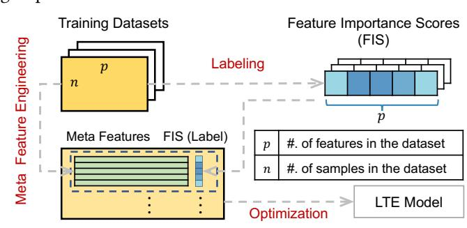
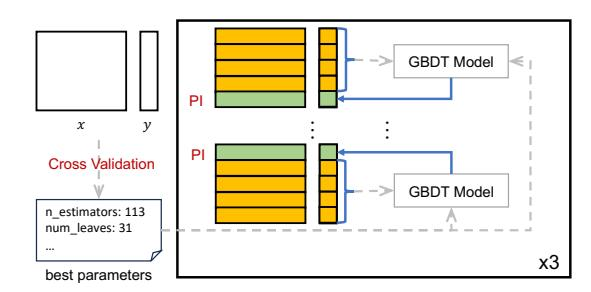
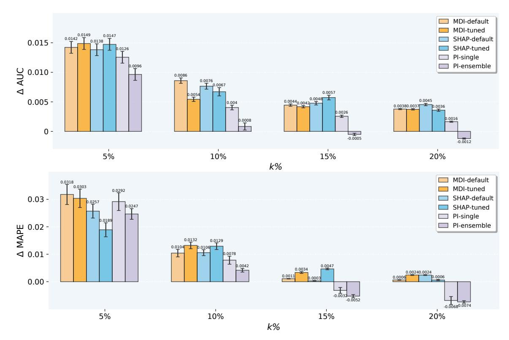

# Feature-PI: A Data Repository for Learning-based Feature Importance Estimation

[Yin Lou](https://orcid.org/0009-0004-8329-7192) Ant Group Sunnyvale, CA, USA yin.lou@antgroup.com

### Abstract

Learning to estimate feature importance is a new machine learning task that aims to build a general-purpose feature importance estimator by learning from a large number of observations. A properlyconstructed learned estimator can be much more efficient in producing feature importance estimates without sacrificing the quality. Different from standard ML tasks, the construction of such learned estimator typically starts with a repository of datasets where features in each dataset are associated with their importance scores as labels. However, pre-computing high-quality feature importance scores can be computationally challenging. Therefore, in this work, we have curated a data repository called Feature-PI that consists of nearly 1,000 public tabular datasets on both binary classification and regression problems with pre-computed high-quality feature importance scores. We release our data repository, pipeline for computing those feature importance scores, and code for evaluation and benchmarking to promote future research in this direction.

#### CCS Concepts

• Computing methodologies → Learning settings.

### Keywords

learning to estimate, feature importance estimator, data repository

#### ACM Reference Format:

Yin Lou. 2026. Feature-PI: A Data Repository for Learning-based Feature Importance Estimation. In Proceedings of the ACM Web Conference 2026 (WWW '26), April 13–17, 2026, Dubai, United Arab Emirates. ACM, New York, NY, USA, [4](#page-3-0) pages.<https://doi.org/10.1145/3774904.3792883>

### 1 Introduction

Learning to estimate (LTE) feature importance is a new machine learning task that aims to build a general-purpose feature importance score (FIS) estimator by learning from a large number of observations [\[19\]](#page-3-1). A learned FIS estimator (LTE model), if constructed properly, can match the quality of existing FIS estimators (such as permutation feature importance [\[1\]](#page-3-2)), but is much more efficient for large-scale problems, e.g., tables with millions of samples (rows) and hundreds to thousands of features (columns). Our prior work shows that LTE models on tabular data achieves an average 20x speedup in FIS estimation compared to variants of permutation feature importance without sacrificing the quality of

[This work is licensed under a Creative Commons Attribution 4.0 International License.](https://creativecommons.org/licenses/by/4.0) WWW '26, Dubai, United Arab Emirates

© 2026 Copyright held by the owner/author(s). ACM ISBN 979-8-4007-2307-0/2026/04 <https://doi.org/10.1145/3774904.3792883>

Figure 1: Overview of LTE framework.

FIS estimates [\[19\]](#page-3-1). FIS ranking on industrial-scale tables that were previously infeasible (often take days or months to complete) now becomes feasible (in hours) by using LTE models. We have deployed LTE models at Ant Group, and in our initial online experiments, we find LTE models can filter out 80% of irrelavant features without hurting key business metrics.

The construction of LTE models starts with a repository of tabular datasets as shown in Figure [1.](#page-0-0) For each feature in each dataset, its feature importance score is pre-computed and serves as label. The statistics for each feature in each dataset are used as meta features to describe that feature. Since FIS is only sensible within a single dataset and may not be comparable across different datasets, LTE is formalized as a learning-to-rank (LTR) problem; each feature is treated as the "document" in the LTR problem, its label (FIS) is regarded as the "relevance," and each dataset can be thought of as "query." Just like the goal of LTR is to predict correct document ranking for each query, the goal of LTE is to predict the correct ranking of importance for feature within each dataset.

While what makes an optimal set of meta features is debatable and deserves further research, there is no doubt that computing high-quality feature importance scores as labels is crucial in the LTE framework. Our previous extensive empirical study suggests that ensemble of 15 trials of permutation feature importance (PI) outperforms a number of other candidates as the best FIS estimator, and has been used as labels for LTE model training [\[19\]](#page-3-1). In many applications, PI has already been considered as the "gold standard" for FIS estimation [\[2,](#page-3-3) [4,](#page-3-4) [6,](#page-3-5) [7,](#page-3-6) [13,](#page-3-7) [17\]](#page-3-8), but for large-scale datasets even single trial of PI is computationally expensive since it requires shuffling the data many times that can incur lots of I/Os [\[20\]](#page-3-9).

This motivates us to curate a high-quality data repository called Feature-PI to promote future research on learning-based feature importance score estimation.[1](#page-0-1) All datasets in Feature-PI have been

1This work complements our previous research [\[19\]](#page-3-1) by releasing the Feature-PI repository that can be used to construct LTE models. Interested readers are referred to [\[19\]](#page-3-1)

converted into a unified format that enables easy downstream processing, along with pre-computed feature importance scores using ensemble of PI; the whole process takes about 150 CPU hours. We release our data repository,[2](#page-1-0) pipeline for computing those feature importance scores, and code for evaluation and benchmarking.[3](#page-1-1)

#### 2 Related work

Feature importance estimation is an important task in data science, analytics and exploration. It refers to a family of techniques which assign scores that represent importance of input features for a given predictive modeling task. A high score indicates that the specific feature plays an important role in predicting certain target variable. Traditionally, there are two types of approaches to estimating FIS; model-specific methods and model-agnostic methods [\[15\]](#page-3-10).

Model-agnostic approaches. This class of methods focuses on post hoc interpretations applicable to any model. Permutation feature importance (PI) [\[1\]](#page-3-2) as a model-agnostic method, for example, is arguably the most popular method for estimating FIS [\[4\]](#page-3-4). It measures the increase in prediction error of the predictive model (typically tree ensembles or neural nets) after one permutes a specific feature, which breaks the relationship between this feature and the target. While PI is effective, it struggles with correlated features and computational overhead. Lundberg and Lee present a unified approach called SHAP to interpreting model predictions via Shapley values [\[12\]](#page-3-11). For feature importance (known as global explanations), the absolute Shapley values of all instances in the data are averaged.

Model-specific approaches. For tree-based models, mean decrease in impurity (MDI) is still widely used. It sums up the total reduction in loss or impurity on all splits for each feature in a tree or tree ensembles (such as gradient boosted trees). Compared to PI, MDI is scalable, works reasonably well in practice, and is often used as the basis for feature selection [\[5,](#page-3-12) [10,](#page-3-13) [14,](#page-3-14) [17\]](#page-3-8). However, MDI has been criticized for its bias towards features with many categories [\[1,](#page-3-2) [17\]](#page-3-8) and recent research shows that MDI can be inconsistent and is not reliable for measuring FIS [\[11\]](#page-3-15). For linear models, feature importance is typically determined by the magnitude and sign of the coefficients of the corresponding feature [\[18\]](#page-3-16). Self-attention networks (SAN) exemplifies FIS estimation for neural networks [\[16\]](#page-3-17).

Learning-based approaches. Most learning-based approaches are for feature selection rather than feature importance estimation. ExploreKit proposes a pipeline to generate candidate features [\[8\]](#page-3-18). During such feature generation, they use meta learning to classify whether the newly generated features can further improve the performance of the original dataset and perform recursive feature selection that adds candidate features into the original dataset. Recently, Zhang et al. [\[19\]](#page-3-1) has demonstrated that it is possible to build general-purpose pre-trained model for FIS estimation, which opens up a new direction of learning-based approach to estimating FIS (in addition to the aforementioned two traditional types). It shows that a learned FIS estimator on tabular data achieves an average 20x speedup in FIS estimation compared to ensemble of

|       |          |       | Classification |     |         | Regression |           |         |
|-------|----------|-------|----------------|-----|---------|------------|-----------|---------|
| #. of | datasets |       |                | 655 |         |            | 130       |         |
| #.    | of       | Samp. | 75.54k         | ±   | 26.32k  | 51.24k     | ±         | 142.47k |
| #.    | of       | Feat. | 87.72          | ±   | 566.97  | 20.35      | ±         | 21.86   |
| #. of | datasets |       |                | 46  |         |            | 20        |         |
| #.    | of       | Samp. | 44.21k         | ±   | 94.61k  | 4.99k      | ± 100.44k |         |
| #.    | of       | Feat. | 1582.80        | ±   | 3391.97 | 209.65     | ±         | 129.72  |

Table 1: Dataset statistics.

permutation feature importance without sacrificing the quality of FIS estimates.

# 3 Feature-PI

# 3.1 Dataset collection

We collect 701 public classification datasets from UCI (121), OpenML (430), and Kaggle (150) platforms. As an initial step of this work, we focus on binary classification problems, and multi-class classification datasets are transformed into binary classification datasets via the one-vs-the-rest strategy (majority class is chosen as the positive class). Among these datasets, 46 datasets with more than 100 features are reserved for testing and benchmarking purposes, including 14 large-scale datasets with more than 50,000 samples. The rest of the 655 datasets are used for training and validation purposes to construct the learning-based FIS estimator for binary classification. Similarly, we collect 150 public regression datasets from UCI (3), OpenML (41), Kaggle (106) platforms. Among these datasets, 20 datasets with more than 100 features are reserved for testing and benchmarking purposes.

There are near 1,000 public datasets on different domains with various characteristics. The naming of each dataset in the repository is in the format of [data\_source]data\_name, where data\_source can be UCI, openml or kaggle. All datasets are converted into a unified format that enables easy downstream processing. Table [1](#page-1-2) summarizes the statistics for all datasets included in this repository. This repository of datasets presents a good mixture of categorical and continuous features with or without missing values, and we believe that it represents the problem space well.

### 3.2 Label Generation

Since computing PI requires constructing a reasonably sophisticated machine learning model to capture the dynamics in the data [\[15\]](#page-3-10), in this work we employ the LightGBM implementation [\[9\]](#page-3-19) of gradient boosted decision trees (GBDT) [\[3\]](#page-3-20) for their computational efficiency and capability of modeling complex patterns.

Figure [2](#page-2-0) illustrates the label generation process. For each dataset in the repository, we first determine the best hyperparameters for LightGBM via cross validation, which are saved for later use. We then shuffle and partition the whole dataset into 5 folds.[4](#page-1-3) We use one fold as the test partition and the remaining 4 folds for model training; the model are trained using the previously saved best hyperparameters. We find using saved hyperparameters that are computed on whole dataset improves both computational efficiency

for detailed methodology, design choices, experimental results for constructing and evaluating LTE models, which are not the focus of this paper.

2<https://huggingface.co/datasets/yinlou/Feature-PI>

3<https://github.com/yinlou/Feature-PI>

4 For binary classification problems, we use stratified 5 folds.

Figure 2: Label generation.

and training stability. We calculate permutation feature importance on its test partition and repeat the process for each fold as test partition. The whole process is then repeated 3 times and when everything is done, we would have 15 permutation feature importance scores for each feature. Random seed is specified in this process to ensure reproducibility.

### 3.3 Evaluation Protocol

Since the "true" feature importance scores do not exist, there is no ground truth information for FIS evaluation. Following our previous work [\[19\]](#page-3-1), we choose not to trust any "gold standard" method in FIS estimation but rather employ a "third-party protocol". In particular, we argue that FIS of high quality should be positively correlated to important features for a given predictive task, and in this work, we evaluate the quality of FIS by learning a predictive model built on top-ranked feature subset according to the estimated importance scores, which provides an orthogonal approach to FIS evaluation from FIS estimation methods. In this setting, the target (classification label or regression response) in the dataset is considered the only source of truth and we rely on the predictive performance evaluated on those targets to evaluate the quality of FIS.

Concretely, given a particular dataset ��, we repeat 5 trials of random partitioning of �� into training (60%), validation (20%) and test sets (20%). These 5 trials of random partitioning are materialized to enforce reproducibility of the whole pipeline (with fixed random seeds) and fair comparison across different FIS estimation methods (so that different FIS estimation methods are tested on the same partition). For each trial, FIS is estimated on the training set and its quality is evaluated using the test set. We select top ��% features (�� ∈ {5, 10, 15, 20}) according to a particular FIS ranking and build a best gradient boosted tree model on the training set with hyperparameters determined on validation set on the selected feature subset. For binary classification problems, we calculate the area under the ROC curve (AUC) on the test set and for regression problems, we calculate the mean absolute percentage error (MAPE) on the test set. We use the performance gap ΔAUC as the AUC difference between the model using all features and the model on selected features to measure the quality of FIS for binary classification problems. Similarly, we use the performance gap ΔMAPE as the MAPE difference between the model on selected features and the model using all features to measure the quality of FIS for regression problems. The performance gap is averaged on these 5 trials for this dataset ��.

Generally speaking, the performance gap measures the degradation of predictive performance when some features are filtered out, so typically the performance gap is positive for both classification and regression. The quality of a particular feature subset is inversely proportional to the performance gap. A small gap suggests most of the features that we filter out are redundant or irrelevant. In other words, features that are important in predicting the target are indeed assigned relative high scores compared to irrelevant features, and therefore the quality of FIS is high. Sometimes the performance gap can go negative, which suggests the predictive performance is improved after removing noisy features. A large gap indicates that some important features are not included and therefore the quality of the top-ranked feature subset is relatively low, which suggests the quality of FIS is not satisfactory.

#### 4 Analysis

In this section, we evaluate and benchmark Feature-PI over a number of candidates for FIS estimation. We consider 3 major FIS estimation methods, mean decrease in impurity, SHAP feature importance, and permutation feature importance. Since all of them require a reasonably sophisticated to begin with, we consider gradient boosted decision trees (GBDT) [\[3\]](#page-3-20) for their computational efficiency and strong ability to model complex patterns in tabular datasets.

In particular, we use the LightGBM implementation [\[9\]](#page-3-19) for GBDT and consider two types of variants; GBDT trained with default hyperparameters[5](#page-2-1) (GBDT-default) and GBDT with carefully tuned hyperparameters (GBDT-tuned). Although a carefully tuned GBDT model yields better accuracy, it requires costly hyperparameter optimization; training GBDT with default hyperparameters is much faster. Note that GBDT-default and GBDT-tuned are only used to generate FIS estimates. To evaluate the quality of FIS estimates, we always construct the best possible GBDT according to the evaluation protocol in Section [3.3.](#page-2-2)

Hence, we consider the following candidate methods.

- MDI-default. MDI computed from GBDT-default.
- MDI-tuned. MDI computed from GBDT-tuned.
- SHAP-default. SHAP computed from GBDT-default.
- SHAP-tuned. SHAP computed from GBDT-tuned.
- PI-single. Single trial of PI from GBDT-tuned.
- PI-ensemble. Ensemble of 15 trials of PI from GBDT-tuned.

Figure [3](#page-3-21) summarizes the evaluation results for binary classification and regression problems on test collection (46 classification datasets and 20 regression datasets). The performance gap (ΔAUC and ΔMAPE) is smaller the better, which indicates how important the top ��% retained features are in predicting the target. We can see that on virtually every cases, PI-ensemble outperforms the other candidates and results in best FIS quality, which validates our choice of using PI-ensemble as labels for LTE problems.

#### 5 Conclusion

Learning to estimate feature importance is a new machine learning task that aims to build a general-purpose feature importance estimator by learning from a large number of observations. In this work, we have curated Feature-PI, a data repository of nearly 1,000

5We use LightGBM with default parameter setting, e.g., 100 trees with 31 number of leaves in each tree, learning rate is 0.1, etc.

Figure 3: We measure performance gap ΔAUC (ΔMAPE) for binary classification (regression) problems. We select features according to the FIS generated by different methods. MDI: mean decrease in impurity. SHAP: SHAP values. PI: permutation feature importance. First we train GBDT with default hyperparameters (GBDT-default) and GBDT with carefully tuned hyperparameters (GBDT-tuned). Then we calculate MDI-default and SHAP-default from GBDT-default, and calculate MDItuned, SHAP-tuned, PI-single, and PI-ensemble from GBDT-tuned. The performance gap in the figure for each method is the averaged over test datasets (and five random seeds) and is lower the better.

datasets for both binary classification and regression problems with pre-computed feature importance scores using ensemble of PI. We release our data repository, pipeline for computing those feature importance scores, and code for evaluation and benchmarking pub-

licly to promote future research in this direction. Acknowledgments We would like to thank Tianping Zhang, Zhaoyang Wang, and Chen Qian for their valuable contribution in this work. References [1] L. Breiman. 2001. Random forests. Machine Learning 45, 1 (2001), 5–32. [2] A. Fisher, C. Rudin, and F. Dominici. 2019. All models are wrong, but many are useful: Learning a variable's importance by studying an entire class of prediction models simultaneously. Journal of Machine Learning Research 20, 177 (2019), 1–81. [3] J.H. Friedman. 2001. Greedy function approximation: A gradient boosting machine. Annals of Statistics 29, 5 (2001), 1189–1232. [4] B. Gregorutti, B. Michel, and P. Saint-Pierre. 2017. Correlation and variable importance in random forests. Statistics and Computing 27, 3 (2017), 659–678. [5] H. Han, X. Guo, and H. Yu. 2016. Variable selection using mean decrease accuracy and mean decrease gini based on random forest. In ICSESS. [6] H. Ishwaran. 2007. Variable importance in binary regression trees and forests. Electronic Journal of Statistics 1 (2007), 519–537. [7] S. Janitza, C. Strobl, and A.-L. Boulesteix. 2013. An AUC-based permutation variable importance measure for random forests. BMC Bioinformatics 14, 1 (2013), 1–11. [8] G. Katz, E.C.R. Shin, and D. Song. 2016. Explorekit: Automatic feature generation and selection. In ICDM. [9] G. Ke, Q. Meng, T. Finley, T. Wang, W. Chen, W Ma, Q. Ye, and T.-Y. Liu. 2017. LightGBM: A highly efficient gradient boosting decision tree. In NeurIPS. [10] G. Louppe, L. Wehenkel, A. Sutera, and P. Geurts. 2013. Understanding variable importances in forests of randomized trees. In NeurIPS. [11] S. Lundberg, G. Erion, and S. Lee. 2018. Consistent individualized feature attribution for tree ensembles. arXiv preprint arXiv:1802.03888 (2018). [12] S. Lundberg and S. Lee. 2017. A unified approach to interpreting model predictions. In NeurIPS. [13] N. Meinshausen and P. Bühlmann. 2010. Stability selection. Journal of the Royal Statistical Society: Series B (Statistical Methodology) 72, 4 (2010), 417–473. [14] B.H. Menze, B.M. Kelm, R. Masuch, U. Himmelreich, P. Bachert, W. Petrich, and F.A. Hamprecht. 2009. A comparison of random forest and its Gini importance with standard chemometric methods for the feature selection and classification of spectral data. BMC Bioinformatics 10, 1 (2009), 1–16. [15] C. Molnar. 2020. Interpretable machine learning. Lulu. com. [16] B. Škrlj, S. Džeroski, N. Lavrač, and M. Petković. 2020. Feature importance estimation with self-attention networks. In ECAI 2020. [17] C. Strobl, L. Boulesteix, A, A. Zeileis, and T. Hothorn. 2007. Bias in random forest variable importance measures: Illustrations, sources and a solution. BMC Bioinformatics 8, 1 (2007), 1–21. [18] R. Tibshirani. 1996. Regression shrinkage and selection via the lasso. Journal of the Royal Statistical Society: Series B (Methodological) 58, 1 (1996), 267–288. [19] T. Zhang, Z. Wang, C. Qian, J. Li, and Y. Lou. 2024. FeatureLTE: Learning to Estimate Feature Importance. Proceedings of the ACM on Management of Data 2, 3 (2024), 1–19. [20] A. Zien, N. Krämer, S. Sonnenburg, and G. Rätsch. 2009. The feature importance ranking measure. In ECML/PKDD.

