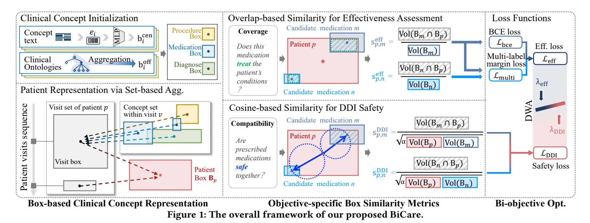
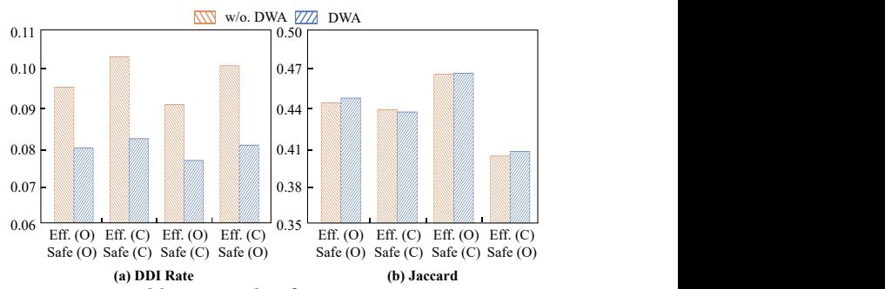

# BiCare: Bi-Objective Set Similarity with Box Embeddings for Safe and Effective Healthcare Decision Support

Guofang Ma Zhejiang Gongshang University Hangzhou, China maguofang@zjgsu.edu.cn

Pengxiang Zhan Fuzhou University Fuzhou, China yyyzhanpengxiang@163.com

Haoze Huang Fuzhou University Fuzhou, China 13395918696@163.com

Yanchao Tan† Fuzhou University Fuzhou, China yctan@fzu.edu.cn

# Abstract

Healthcare decision support requires balancing therapeutic effectiveness and medication safety, both of which fundamentally rely on complex set-level relations. While effectiveness involves coverage and overlap between patient needs and medication effects, safety necessitates modeling exclusionary Drug-Drug Interactions (DDIs). Existing vector-based methods, limited to point-level similarities, fail to capture these complex relations. To this end, we propose BiCare, a bi-objective set similarity framework based on box embeddings for safe and effective decision support. BiCare initializes clinical concepts as hyperrectangular boxes to enable expressive representation. Then, BiCare quantifies effectiveness via overlapbased set alignment and models safety using a patient-aware cosine compatibility that captures DDIs by assessing directional inconsistencies between medication and patient boxes. A dynamic weight averaging strategy further enables adaptive bi-objective balancing. Experiments on two real-world datasets demonstrate BiCare's state-of-the-art effectiveness with competitive safety.

# CCS Concepts

- Applied computing → Health informatics.

# Keywords

Clinical Decision Support, Box Embeddings, Bi-Objective Learning, Set Similarity, Drug-Drug Interactions, Healthcare

### ACM Reference Format:

Guofang Ma, Pengxiang Zhan, Haoze Huang, and Yanchao Tan† . 2026. Bi-Care: Bi-Objective Set Similarity with Box Embeddings for Safe and Effective Healthcare Decision Support. In Proceedings of the ACM Web Conference 2026 (WWW '26), April 13–17, 2026, Dubai, United Arab Emirates. ACM, New York, NY, USA, [4](#page-3-0) pages.<https://doi.org/10.1145/3774904.3792884>

# 1 Introduction

Healthcare decision support systems play a crucial role in clinical workflows by helping clinicians select appropriate interventions while balancing two competing objectives: therapeutic effectiveness [\[13\]](#page-3-1) and medication safety [\[6\]](#page-3-2). Real-world Electronic Health Records (EHRs) are inherently set-structured, where each patient

† Yanchao Tan is the corresponding author.

© 2026 Copyright held by the owner/author(s). ACM ISBN 979-8-4007-2307-0/2026/04 <https://doi.org/10.1145/3774904.3792884>

visit is represented as a set of diagnosed diseases, clinical findings, and prescribed medications. Consequently, bi-objective healthcare decision-making on such data fundamentally relies on set-level relations: effectiveness depends on coverage and partial overlap between patient needs and medication effects [\[1,](#page-3-3) [14\]](#page-3-4), while medication safety requires modeling exclusionary Drug-Drug Interactions (DDIs) among co-prescribed medications [\[9,](#page-3-5) [11\]](#page-3-6).

Existing bi-objective approaches typically embed clinical concepts as vectors, enabling only point-level similarity computation [\[10,](#page-3-7) [15\]](#page-3-8). Such vector-based models struggle to express more complex set relations (e.g., containment, partial overlap, and exclusionary DDI) that are crucial for bi-objective healthcare decision support. Recent advances in box embeddings [\[8\]](#page-3-9) provide a promising solution by encoding concepts as hyperrectangles, which enable expressive modeling for set-level similarity computation. Yet, leveraging such box embeddings for bi-objective decision remains non-trivial, as therapeutic effectiveness and medication safety correspond to fundamentally different geometric interactions, which is an unaddressed challenge in existing box-based works.

In this paper, we propose BiCare, a bi-objective set similarity framework based on box embeddings for safe and effective healthcare decision support. BiCare represents diagnoses, procedures, and medications as boxes in a shared embedding space and constructs patient representations via set-based aggregation. For therapeutic effectiveness, BiCare employs overlap-based similarity that quantifies the proportion of a medication's therapeutic scope that aligns with patient needs, naturally capturing set-level coverage relations. For medication safety, BiCare introduces cosine-based compatibility that captures directional alignment, where two medications may both overlap with patient needs yet exhibit low cosine similarity (large angular distance), signaling potential interactions. Furthermore, BiCare employs Dynamic Weight Averaging (DWA) [\[12\]](#page-3-10) for adaptive bi-objective balancing. Extensive experiments on realworld EHR datasets validate the effectiveness of BiCare, demonstrating its superior Jaccard performance compared to state-of-the-art methods, while maintaining a comparable DDI rate.

# 2 The BiCare Framework

# 2.1 Preliminaries

Given a patient ��'s EHR data represented as a sequence of visits V�� = {��1, ��2, . . . , ���� }, where each visit ���� at time �� contains a set of diagnoses D�� , procedures C�� , and medications M�� . Our goal is to support clinical decision-making by optimizing two objectives: (1) Therapeutic effectiveness: identify candidate medications Mcand that effectively address the patient's current clinical needs, and

[This work is licensed under a Creative Commons Attribution 4.0 International License.](https://creativecommons.org/licenses/by/4.0) WWW '26, Dubai, United Arab Emirates.

where Lbce measures prediction accuracy, Lmulti enforces separation margins between prescribed and non-prescribed medications, and ���� is a balancing hyperparameter. Specifically:

Lbce = − ∑︁ ��∈ P ∑︁ ��∈M -����,�� ln(s eff ��,��) + (1 − ����,��) ln(1 − s eff ��,��) , (10) Lmulti = ∑︁ ��∈ P ∑︁ ��,�� ����,��=1,����,��=0 max 0, 1 − s eff ��,�� − s eff ��,�� |M | , (11)

where ����,�� = 1 or ����,�� = 0 indicates whether medication is prescribed for patient �� in the ground truth.

The DDI safety loss penalizes co-prescription of interacting medication pairs:

LDDI = ∑︁ ��∈ P ∑︁ ��∈M ∑︁ ��∈M s DDI ��,�� · s DDI ��,�� · ������ , (12)

where ������ is the DDI severity between medications �� and �� from the TWOSIDES database [\[9\]](#page-3-5). During training with DDI loss, the model learns to position interacting drug boxes such that they exhibit low cosine-based compatibility scores, even when each drug individually matches the patient well.

Dynamic Weight Averaging. To avoid manual tuning and ensure balanced learning across effectiveness and safety objectives, BiCare employs DWA [\[12\]](#page-3-10), which adaptively adjusts loss weights based on each objective's learning progress. At training iteration ��, the weight for objective �� ∈ {eff, DDI} is:

���� (��) = 2 · exp(���� (�� − 1)/��) Í ′ exp(���� ′ (�� − 1)/��) , ���� (��) = L�� (��) L�� (�� − 1) , (13)

where ���� (��) measures the relative descent rate, and �� is a temperature parameter. DWA automatically increases the weight of slower-converging objectives. The final loss is:

Lfinal = ��eff(��) · Leff + ��DDI(��) · LDDI. (14)

### 3 Experiment

# 3.1 Experiment Settings

Dataset and Metric. We use two real-world EHR datasets. MIMIC-III [\[3\]](#page-3-12) is an open-access database including anonymized records of more than 40,000 patients. MIMIC-IV [\[2\]](#page-3-13) contains clinical data on over 65,000 ICU and 200,000 emergency department patients. We choose patients with at least two visits, and filter out the patients without valid clinical concept codes for each visit. We utilize Jaccard metrics for effectiveness and DDI rate metrics for safety evaluation, following previous works [\[11,](#page-3-6) [15\]](#page-3-8). # Med captures the average number of prescribed medications. Avg. Rank report the average rank over four metrics, i.e., Jaccard/DDI on MIMIC-III/IV.

Baselines. We adopt 10 baselines from two perspectives: (1) Effectiveness-focused methods: ECC [\[5\]](#page-3-14), LEAP [\[13\]](#page-3-1); BioBERT [\[4\]](#page-3-11), OntoMedRec [\[7\]](#page-3-15). UDC [\[14\]](#page-3-4). RETAIN [\[1\]](#page-3-3), (2) Bi-objective methods: GAMENet [\[6\]](#page-3-2), SafeDrug [\[10\]](#page-3-7), MoleRec [\[11\]](#page-3-6), DEPOT [\[15\]](#page-3-8).

Implementation Details. Both datasets are split into train/ validation/test sets (4:1:1), following [\[6,](#page-3-2) [10,](#page-3-7) [11,](#page-3-6) [15\]](#page-3-8). To simulate realworld sparse data scenarios, we sampled 5% of the training set and conducted multiple tests. Baselines are optimized using the standard Adam optimizer, with hyperparameters meticulously tuned following the recommendations in original papers. The dimension

Figure 2: Ablation study of BiCare on MIMIC-III.

������ is 16, batch size is 128, balancing coefficient ���� is 0.93, and temperature parameter in DWA �� is 1 unless otherwise specified.

# 3.2 Overall Performance Comparison

Experimental results are shown in Table [1,](#page-3-16) BiCare consistently achieves the highest effectiveness while maintaining competitive safety, demonstrating successful bi-objective optimization.

Superiority in Effectiveness. BiCare substantially outperforms all effectiveness-focused baselines in therapeutic accuracy. Compared to the most effective baseline UDC, BiCare represents an average improvement of 1.7%. These gains are even more pronounced against the Bi-objective baselines, showing approximately 4% improvement over DEPOT on MIMIC-III. The improvement stems from our overlap-based geometric similarity, which enables precise alignment between patient boxes and medication boxes, capturing nuanced condition–treatment relationships.

Competitive Safety Performance. While maintaining effectiveness, BiCare demonstrates competitive DDI rates of 0.0767 on MIMIC-III and 0.0727 on MIMIC-IV, only marginally higher than the most safety-focused baseline SafeDrug, yet substantially lower than other baselines. Importantly, BiCare's safety is achieved without sacrificing effectiveness. The combination of top-tier effectiveness and competitive safety yields the overall best ranking (1.50), confirming the advantage of BiCare's cosine-based compatibility metric and dynamic bi-objective weighting, which successfully balances bi-objectives for safe and effective healthcare.

### 3.3 Ablation Study

To assess the contribution of each component in BiCare, we conduct ablation experiments on MIMIC-III (Figure [2\)](#page-2-0). We vary the similarity for effectiveness (Eff.) and DDI safety (Safe), where "O" denotes the overlap similarity and "C" denotes the cosine compatibility, each further evaluated with and w/o. DWA.

Impact of DWA. Without DWA module, the optimization exhibits a strong bias at the substantial cost of elevated DDI rates. Introducing DWA alleviates this imbalance, reducing DDI in Eff. (O) × Safe (C) effectively (about 16% relative decrease) while keeping Jaccard virtually unchanged. These results demonstrate the critical role of DWA in adaptive bi-objective balancing.

Objective-Specific Similarity Design. The ablation results also provide strong evidence for employing distinct similarity metrics for different objectives. When fixing the safety metric and DWA setting, using overlap for effectiveness (Eff.(O)) consistently outperforms cosine (Eff.(C)), yielding an average 8.6% higher Jaccard and 6.4%

Table 1: Experimental results. The best results are highlighted in bold while the second best are marked with underline.

| Method     |   |      | DDI | ↓    |   |      | MIMIC-III Jaccard | ↑    |    | #    | Med |      |   |      | DDI | ↓    |   |      | MIMIC-IV Jaccard | ↑    |    | #    | Med |      | Avg. | Rank ↓ |
|------------|---|------|-----|------|---|------|-------------------|------|----|------|-----|------|---|------|-----|------|---|------|------------------|------|----|------|-----|------|------|--------|
| ECC        | 0 | 0898 | ± 0 | 0006 | 0 | 4087 | ± 0               | 0025 | 13 | 4845 | ± 0 | 0589 | 0 | 0937 | ± 0 | 0008 | 0 | 3818 | ± 0              | 0019 | 8  | 2940 | ± 0 | 0724 | 8    | 50     |
| LEAP       | 0 | 0875 | ± 0 | 0003 | 0 | 3939 | ± 0               | 0024 | 18 | 5664 | ± 0 | 0398 | 0 | 0752 | ± 0 | 0005 | 0 | 3539 | ± 0              | 0026 | 8  | 9526 | ± 0 | 0269 | 7    | 75     |
| BioBERT    | 0 | 1094 | ± 0 | 0004 | 0 | 4263 | ± 0               | 0022 | 25 | 5256 | ± 0 | 0637 | 0 | 0994 | ± 0 | 0008 | 0 | 4108 | ± 0              | 0022 | 15 | 5734 | ± 0 | 0637 | 8.50 |        |
| OntoMedRec | 0 | 0785 | ± 0 | 0003 | 0 | 4285 | ± 0               | 0021 | 15 | 8046 | ± 0 | 1548 | 0 | 0765 | ± 0 | 0006 | 0 | 4117 | ± 0              | 0023 | 11 | 6739 | ± 0 | 0924 | 5    | 00     |
| UDC        | 0 | 1060 | ± 0 | 0003 | 0 | 4631 | ± 0               | 0023 | 16 | 3416 | ± 0 | 1096 | 0 | 1127 | ± 0 | 0002 | 0 | 4354 | ± 0              | 0024 | 11 | 1518 | ± 0 | 0933 | 6    | 50     |
| RETAIN     | 0 | 0897 | ± 0 | 0008 | 0 | 3814 | ± 0               | 0028 | 12 | 7079 | ± 0 | 0564 | 0 | 0985 | ± 0 | 0012 | 0 | 3373 | ± 0              | 0007 | 6  | 7078 | ± 0 | 0845 | 9    | 75     |
| GAMENet    | 0 | 0805 | ± 0 | 0003 | 0 | 4105 | ± 0               | 0023 | 15 | 3363 | ± 0 | 0518 | 0 | 0977 | ± 0 | 0014 | 0 | 4099 | ± 0              | 0039 | 10 | 5075 | ± 0 | 0936 | 7    | 00     |
| SafeDrug   | 0 | 0700 | ± 0 | 0002 | 0 | 4317 | ± 0               | 0026 | 16 | 9059 | ± 0 | 0926 | 0 | 0631 | ± 0 | 0003 | 0 | 4083 | ± 0              | 0030 | 12 | 9756 | ± 0 | 0965 | 3    | 75     |
| MoleRec    | 0 | 0817 | ± 0 | 0002 | 0 | 4459 | ± 0               | 0020 | 22 | 6801 | ± 0 | 1565 | 0 | 0774 | ± 0 | 0008 | 0 | 4252 | ± 0              | 0027 | 12 | 6647 | ± 0 | 0953 | 5    | 00     |
| DEPOT      | 0 | 0769 | ± 0 | 0003 | 0 | 4530 | ± 0               | 0028 | 18 | 9076 | ± 0 | 1078 | 0 | 0736 | ± 0 | 0003 | 0 | 4348 | ± 0              | 0008 | 13 | 5496 | ± 0 | 0601 | 2    | 75     |
| BiCare     | 0 | 0767 | ± 0 | 0002 | 0 | 4709 | ± 0               | 0020 | 21 | 8419 | ± 0 | 0988 | 0 | 0727 | ± 0 | 0003 | 0 | 4428 | ± 0              | 0022 | 13 | 9161 | ± 0 | 0904 | 1    | 50     |

Figure 3: Interpretable case study on MIMIC-III.

lower DDI. Conversely, when fixing the effectiveness metric, using cosine for safety (Safe(C)) outperforms overlap (Safe(O)), achieving 6.7% lower DDI and 1.1% higher Jaccard on average.

# 3.4 Interpretable Case Studies

We showcase BiCare's interpretability via a MIMIC-III case (Figure [3\)](#page-3-17), where it trades marginally lower safety (DDI +1.7%) for significantly higher effectiveness (Jaccard +16.4%) compared to the safest baseline SafeDrug. This stems from their geometric reasoning. For example, to avoid DDI, SafeDrug's point vectors unduly separate C08C: Amlodipine(FN) from C10A: Atorvastatin(TP), risking under-treatment for heart failure. In contrast, BiCare's boxes maintain high overlap with the patient box for both medications, and its DWA strategy balances this therapeutic overlap against their angular distance (a clinically manageable, common DDI).

# 4 Conclusion

This work introduced BiCare, a box-embedding approach tailored for set-level bi-objective clinical decision support. Through overlapbased effectiveness modeling, cosine-driven compatibility for DDI safety, and adaptive weighting, BiCare achieves state-of-the-art effectiveness with competitive safety on two real-world datasets. Future work may explore incorporating additional clinical constraints and extending to broader multi-objective healthcare tasks.

# Acknowledgements

This work was supported in part by the Fujian Provincial Natural Science Foundation of China under Grants (2025J01540), National Natural Science Foundation of China under Grants (62302098), Zhejiang Provincial Department of Agriculture and Rural Affairs

Project under Grants (2024SNJF044), Fundamental Research Funds for the Provincial Universities of Zhejiang (FR25008Q), and Fujian Provincial Artificial Intelligence Industry Development Technology Project under Grant (2025H0042).

# References

[1] Edward Choi, Mohammad Taha Bahadori, Jimeng Sun, Joshua Kulas, Andy Schuetz, and Walter Stewart. 2016. Retain: An interpretable predictive model for healthcare using reverse time attention mechanism. In Proc. of NeurIPS 2016. 3504–3512. [2] Alistair EW Johnson, Lucas Bulgarelli, Lu Shen, Alvin Gayles, Ayad Shammout, Steven Horng, Tom J Pollard, Sicheng Hao, Benjamin Moody, Brian Gow, et al. 2023. MIMIC-IV, a freely accessible electronic health record dataset. Sci. Data 10 (2023), 1. [3] Alistair EW Johnson, Tom J Pollard, Lu Shen, Li-wei H Lehman, Mengling Feng, Mohammad Ghassemi, Benjamin Moody, Peter Szolovits, Leo Anthony Celi, and Roger G Mark. 2016. MIMIC-III, a freely accessible critical care database. Sci. Data 3, 1 (2016), 1–9. [4] Jinhyuk Lee, Wonjin Yoon, Sungdong Kim, Donghyeon Kim, Sunkyu Kim, Chan Ho So, and Jaewoo Kang. 2020. BioBERT: a pre-trained biomedical language representation model for biomedical text mining. Bioinformatics 36, 4 (2020), 1234–1240. [5] Jesse Read, Bernhard Pfahringer, Geoff Holmes, and Eibe Frank. 2011. Classifier chains for multi-label classification. Mach. Learn. 85 (2011), 333–359. [6] Junyuan Shang, Cao Xiao, Tengfei Ma, Hongyan Li, and Jimeng Sun. 2019. Gamenet: Graph augmented memory networks for recommending medication combination. In Proc. of AAAI 2019. 1126–1133. [7] Weicong Tan, Weiqing Wang, Xin Zhou, Wray Buntine, Gordon Bingham, and Hongzhi Yin. 2024. OntoMedRec: Logically-pretrained model-agnostic ontology encoders for medication recommendation. World Wide Web 27, 3 (2024), 28. [8] Yanchao Tan, Hang Lv, Yunfei Zhan, Guofang Ma, Xiong Bo, and Carl Yang. 2025. BoxLM: Unifying Structures and Semantics of Medical Concepts for Diagnosis Prediction in Healthcare. In Proc. of ICML 2025. [9] Nicholas P Tatonetti, Patrick P Ye, Roxana Daneshjou, and Russ B Altman. 2012. Data-driven prediction of drug effects and interactions. Sci. Transl. Med. (2012), 125ra31. [10] Chaoqi Yang, Cao Xiao, Fenglong Ma, Lucas Glass, and Jimeng Sun. 2021. Safedrug: Dual molecular graph encoders for recommending effective and safe drug combinations. In Proc. of IJCAI 2021. 3735–3741. [11] Nianzu Yang, Kaipeng Zeng, Qitian Wu, and Junchi Yan. 2023. Molerec: Combinatorial drug recommendation with substructure-aware molecular representation learning. In Proc. of WWW 2023. 4075–4085. [12] Zhong Yang, Bolong Zheng, Guohui Li, Xi Zhao, and Xiaofang Zhou. 2025. Universal Set Similarity Search via Multi-Task Representation Learning. In Proc. of ICDE 2025. 1483–1495. [13] Yutao Zhang, Robert Chen, Jie Tang, Walter F Stewart, and Jimeng Sun. 2017. LEAP: learning to prescribe effective and safe treatment combinations for multimorbidity. In Proc. of KDD 2017. 1315–1324. [14] Chuang Zhao, Hui Tang, Jiheng Zhang, and Xiaomeng Li. 2025. Unveiling Discrete Clues: Superior Healthcare Predictions for Rare Diseases. In Proc. of WWW 2025. 1747–1758. [15] Chuang Zhao, Hongke Zhao, Xiaofang Zhou, and Xiaomeng Li. 2024. Enhancing Precision Drug Recommendations via In-depth Exploration of Motif Relationships. IEEE Trans. Knowl. Data Eng. 36, 12 (2024), 8164–8178.