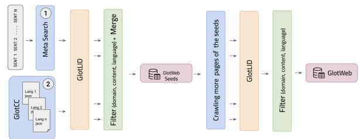
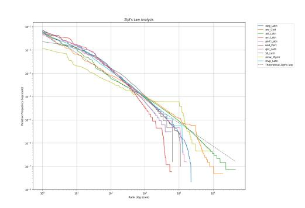
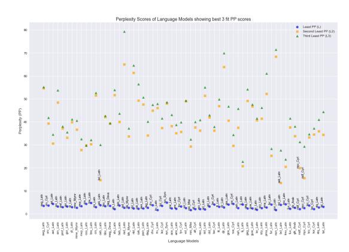

# GlotWeb: Web Indexing for Minority Languages

Abdullah Al Sefat Technical University of Munich Munich, Germany in.sefat@tum.de

Amir Hossein Kargaran LMU Munich & MCML Munich, Germany amir@cis.lmu.de

François Yvon Sorbonne Université & CNRS, ISIR Paris, France yvon@isir.upmc.fr

Hinrich Schütze LMU Munich & MCML Munich, Germany inquiries@cislmu.org

Figure 1: GlotWeb Interface: (left) Main view, (middle) Chosen language view, (right) JSON data for the chosen language

# Abstract

We introduce GlotWeb, a system for indexing webpages, each written in a minority language. While popular search engines allow filtering by language only on query results for high-resource languages, GlotWeb focuses on minority languages, systematically indexing webpages and providing highly accurate links for each. We start with seed data from multiple sources, including search engine queries and Common Crawl datasets, then iteratively crawl corresponding websites to collect additional pages in the same language. Language identification is applied to determine the language of each webpage, with high accuracy ensured through languagespecific wordlist filtering. GlotWeb v1.0 contains over 169K linguistically verified links across more than 400 languages, with most religious content removed. Notably, 47% of these languages are absent from major multilingual datasets such as FLORES-200, MADLAD-400, and Glot500, highlighting GlotWeb's role in expanding digital resources for underrepresented languages. The data indices are available at [hf.co/spaces/cis-lmu/GlotWeb](https://huggingface.co/spaces/cis-lmu/GlotWeb), and the pipeline is at [github.com/cisnlp/GlotWeb](https://github.com/cisnlp/GlotWeb).

[This work is licensed under a Creative Commons Attribution 4.0 International License.](https://creativecommons.org/licenses/by/4.0) WWW '26, Dubai, United Arab Emirates © 2026 Copyright held by the owner/author(s). ACM ISBN 979-8-4007-2307-0/2026/04 <https://doi.org/10.1145/3774904.3792887>

# CCS Concepts

- Information systems → Web mining; Computing methodologies → Language resources.

# Keywords

web indexing, minority languages, language identification

#### ACM Reference Format:

Abdullah Al Sefat, Amir Hossein Kargaran, François Yvon, and Hinrich Schütze. 2026. GlotWeb: Web Indexing for Minority Languages. In Proceedings of the ACM Web Conference 2026 (WWW '26), April 13–17, 2026, Dubai, United Arab Emirates. ACM, New York, NY, USA, [4](#page-3-0) pages. [https:](https://doi.org/10.1145/3774904.3792887) [//doi.org/10.1145/3774904.3792887](https://doi.org/10.1145/3774904.3792887)

### 1 Introduction

There are over 7,000 languages spoken today [\[4\]](#page-3-1) worldwide, among which 40% are endangered, often having fewer than 1,000 speakers [\[16\]](#page-3-2). Only 5% of languages will thrive digitally, while 95% will face digital extinction [\[18\]](#page-3-3). Despite many languages being routinely spoken, the development of Natural Language Processing (NLP) technologies is mostly limited to around 200 languages with accessible textual data [\[8\]](#page-3-4). Efforts to include more languages, such as compiling multilingual corpora [\[6\]](#page-3-5) or Web mining [\[11\]](#page-3-6) remain insufficient. Moreover, many minority language datasets are dominated by translations of the religious texts, could potentially biasing language models [\[5\]](#page-3-7).

Web crawling is the most scalable way to collect multilingual raw text. Common Crawl[1](#page-1-0) offers a public repository of Web crawl data, reducing the need for separate crawls and easing server load. However, it uses CLD2[2](#page-1-1) for language identification (LID), which supports only 160 languages[3](#page-1-2) . Data coverage is also uneven, with significantly less content for minority languages than for widely spoken ones. Currently, there is no comprehensive index of websites available for minority languages. While W3Techs provides information on popular websites in 201 languages [\[17\]](#page-3-8), this is insufficient for seeding Common Crawl's crawls with minority language websites. To address this gap, efforts such as "Web Languages Project"[4](#page-1-3) have been initiated to crowdsource seed data for 7076 languages.

In this work, we address the following problem: given a minority language, what are the non-religious websites or links written in that language on the Web? We introduce GlotWeb, a system for indexing webpages that provides a high-precision list of websites and links written in minority languages (see Figure [1\)](#page-0-0). We explore automatic, high-precision methods for identifying such sites with minimal supervision. Incorporating this list into web crawl routines could enhance the web presence of minority languages and support NLP development. It would also enable researchers to perform "language observatory"[5](#page-1-4) tasks and assess the status of these minority languages online. We hope that GlotWeb and its outputs contribute to reducing the barriers faced by minority language speakers and advancing their inclusion in NLP.

# 2 Related Work

Many studies focus on specific languages, sometimes using native speakers to identify webpages in their languages for crawling to perform various NLP tasks. Notable among these is the Suki project [\[7\]](#page-3-9), which built a Web corpus for Uralic minority languages using crawling and LID. Similar to our approach, it offers lists of languages and related webpages.[6](#page-1-5) The MC2 corpus [\[19\]](#page-3-10) is another key resource, covering Tibetan, Uyghur, Kazakh (Arabic script), and Mongolian (traditional script). This dataset was created by crawling a manually curated list of sites and integrating existing datasets [\[12\]](#page-3-11). For Southern Kurdish and Laki, Ahmadi et al. [\[1\]](#page-3-12) built a corpus by collecting radio scripts, crawling local news sites and transcribing fieldwork data. Broader multilingual efforts include the "No Language Left Behind project" [\[13\]](#page-3-13), which released the FLORES-200 dataset for 200+ languages via community translation.[7](#page-1-6) Large-scale multilingual corpora efforts includes MADLAD-400 [\[11\]](#page-3-6), built from Common Crawl data for 419 languages, and Glot500 [\[6\]](#page-3-5), covering 511 languages through web crawling and merging existing sentence-level data.

# 3 GlotWeb

Figure [2](#page-1-7) illustrates the GlotWeb pipeline, which begins with a meta-search process applied to a set of sample sentences and then incorporates GlotCC [\[10\]](#page-3-14), a language-annotated Common Crawl

Figure 2: The GlotWeb pipeline filters Common Crawl data (GlotCC here) and search dumps to generate seeds which undergo crawling to curate GlotWeb data

dump. The retrieved data undergoes a rigorous filtering procedure based on domain relevance (e.g., removal of religious and adult content), and LID before being merged into the GlotWeb seed data. The generated seed URLs are subsequently subjected to an iterative crawling process, applying additional domain, and language filtering, ultimately constructing the final GlotWeb indices. We respect robots.txt and discard links from disallowed websites. The entire pipeline and the generated lists are released as open-source under the public domain CC0 license[8](#page-1-8) .

# 3.1 GlotWeb Metasearch

This study aims to compile a Web index of minority language links while excluding religious content. We used sample sentences from 1474 languages in the Crubadan project [\[15\]](#page-3-15) as queries to collect URLs via "SearXNG"[9](#page-1-9) , an open-source metasearch engine. Search results along with the query language are stored as structured dictionaries.

# 3.2 Common Crawl Integration

In addition to the links extracted via the meta-search engine, we use GlotCC [\[10\]](#page-3-14), a Common Crawl–based dataset, to enhance both the quality and volume of the seed for subsequent stages of crawling. GlotCC provides a structured collection of Common Crawl dumps organized by language, from which only minority languages are considered.

The classification of a language as a minority language is inherently impressionistic [\[15\]](#page-3-15). We use the presence of languages in other popular datasets, including FLORES-200 [\[13\]](#page-3-13), MADLAD-400 [\[11\]](#page-3-6), and Glot500 [\[6\]](#page-3-5) (in terms of data volume), as a proxy for minority status. The number of speakers does not always indicate digital underrepresentation. For instance, Estonian (around 1M speakers) has over 1M links in GlotCC, while Sylheti (around 8M speakers), written in the Bengali script, has only 99 links available. Clearly, the latter is underrepresented on the Web and has been included in this study, whereas the former is among the top 40 Web languages according to W3Techs and was excluded.

1<https://commoncrawl.org/>

2<https://github.com/CLD2Owners/cld2>

3<https://commoncrawl.org/blog/august-2018-crawl-archive-now-available>

4<https://github.com/CommonCrawl/web-languages>

5[https://en.wikipedia.org/wiki/Language\\_observatory](https://en.wikipedia.org/wiki/Language_observatory)

6<http://suki.ling.helsinki.fi/wanca/languages>

7Additional data collection is performed under the OLDI initiative:<https://oldi.org/.>

8<https://creativecommons.org/public-domain/cc0/>

9<https://github.com/searxng/searxng>

### 3.3 GlotWeb Seeds

The search results from the previous step are filtered and structured into seeds for crawling. The filtering pipeline ensures linguistic precision and content relevance. This process consists of the following filtering steps:

F1. Domain Filtering: We remove all links from unwanted categories, including adult content, using UT1 Blacklists[10](#page-2-0) and a manually curated blacklist of frequently observed popular religious websites. Our manually curated blacklist was built iteratively during meta-search, seed creation, and post-crawling, by reviewing newly encountered domains at each step. Two authors manually annotated domains using heuristics based on domain names and landing-page content. Over 90 domains were flagged for religious websites with content in multiple languages.

F2. Language Filtering. For each link, the text is extracted and classified using GlotLID [\[9\]](#page-3-16), designed specifically for its lowresource language coverage. GlotLID v3 has been found to outperform alternative LID tools and uniquely supports over 2,000 languages [\[10\]](#page-3-14). Each prediction is associate with a confidence score (0-1), where higher scores indicate more reliable classifications. Only results matching the language ISO codes of the search query with confidence >= 0.7 are retained, while mismatches are logged for review.[11](#page-2-1)

### 3.4 GlotWeb Crawler

Using GlotWeb seeds, the crawler explores Web pages recursively, discarding duplicates and extracting hyperlinks while restricting navigation to the seed's domain to minimize noise. Discovered links undergo domain (F1) and language filtering (F2) as described in Section [3.3.](#page-2-2) Links from domains disallowing crawlers via robots.txt are discarded.

Challenges include circular links, parsing errors, and noise. A visited queue prevents infinite loops by handling circular links and preventing duplicates, while LXML parser serves as a fallback for malformed HTML handling parsing errors. The crawler supports batch processing for single or multiple languages with configurable execution modes. A cooling-off period prevents server overload, ensuring ethical crawling. As the core component of GlotWeb, the crawler iteratively expands the database, enhancing linguistic diversity and depth.

# 3.5 GlotWeb Audit and WordList Filtering

We conducted an audit to further improve quality. This involved systematically inspecting files for each language, identifying and removing duplicate URLs that differed only by hashtag anchors or protocol (http vs https) referring to the same webpage. We also filtered out inactive or noisy links. Certain languages (e.g., qvc\_Latn) contained entirely noisy data (typical internet noise) and were removed. Some Web links in minority scripts such as Hung, Newa, Shaw, Gran, Sylo, and Dsrt remained unrecognized as languages with GlotLID as it only detects the script. For cases where the script belongs to only one language, such as Sylo, which corresponds only to the Syl language, we infer the language from the script. Overall,

Table 1: GlotWeb Language Coverage Across Datasets

|   | Number of Datasets No datasets | Available Count 190 | Percentage 47.1% |
|---|--------------------------------|---------------------|------------------|
| 1 | dataset                        | 121                 | 30.0%            |
| 2 | datasets                       | 77                  | 19.1%            |
| 3 | datasets                       | 15                  | 3.7%             |
|   | GlotWeb                        | 403                 | 100%             |

Figure 3: Log-log graph of word rank vs. frequency for the ten random languages.

these combined automated and manual steps ensured that GlotWeb retains only high-confidence, linguistically meaningful Web links. Although GlotLID outperforms comparable LID systems, it can still misclassify high-resource languages as minority languages due to shared n-grams or words. To mitigate this, we incorporated highprecision wordlists from Bapna et al. [\[2\]](#page-3-17), Caswell et al. [\[3\]](#page-3-18), Penedo et al. [\[14\]](#page-3-19) after a systematic self-audit. These wordlists help decontaminate the dataset by filtering out content likely belonging to high-resource languages.

# 4 Analysis

GlotWeb v1.0 indexes 402 languages with 169,155 web links across 5,076 domains, averaging 411 links (median: 78) and 12 domains per language. Its language coverage is compared to prominent multilingual datasets such as FLORES-200 [\[13\]](#page-3-13), MADLAD-400 [\[11\]](#page-3-6), and Glot500 [\[6\]](#page-3-5) as illustrated in Table [1.](#page-2-3) Notably, 190 (47%) of the languages cataloged in GlotWeb lack representation in any of these established multilingual datasets, highlighting its role in expanding linguistic coverage for under-resourced languages.

We conducted two analyses to observe the adherence of a subset of minority languages[12](#page-2-4) in GlotWeb to natural language patterns. For this, we scraped the text from the indexed links. We conducted Zipf's law analysis, which states that word frequency is inversely proportional to its rank [\[20\]](#page-3-20). �� (��) ∝ 1 �� �� , where �� is a constant, typically close to 1 for many languages. Word ranks were computed for ten random languages, and a log-log plot (see Figure [3\)](#page-2-5) confirmed strong adherence to Zipf's law. Minor irregularities in lower-ranked words stem from corpus sparsity, common in minority languages.

We further performed 5-gram character-level language modeling and measured perplexity scores. For each selected language ���� , we

10<https://github.com/olbat/ut1-blacklists>

11Low-confidence scores may result in the discovery of languages not supported by GlotLID.

12Subset includes languages with corpus length above the global mean

Figure 4: Perplexity scores of the three best-fit languages per language model.

trained a language model ������ on 80% of its data and computed its perplexity on the 20% test data of every language ���� [\[6\]](#page-3-5). Each model achieved its lowest perplexity on data from its own language, indicating strong internal consistency in the text of the collected links (see Figure [4\)](#page-3-21). Cross-perplexity analysis among all selected languages further revealed known linguistic relationships: for example, Moksha (mdf) and Erzya (myv) from the Mordvin branch of the Uralic family emerged as each other's closest matches. They emerged as each other's second-best fit with significantly lower perplexities than other pairs, quantitatively validating their family connection.

# 5 Ethics Statement

We compiled the GlotWeb dataset using publicly accessible web sources while adhering to ethical crawling practices, including respecting robots.txt. Our focus was on obtaining linguistically and culturally relevant content while filtering out inappropriate and religious texts. To ensure reliability, we implemented additional measures such as manual community-based verification (as illustrated in the confidence part of Figure [1\)](#page-0-0), providing an opt-out list, and refraining from publishing the collected texts, releasing only aggregated lists similar to a search engine. GlotWeb is intended for academic research, language documentation and preservation, and NLP applications aimed at supporting minority languages. Users are advised to be cautious of potential noise in the dataset.

### 6 Conclusion

GlotWeb significantly expands access to minority language content on the web by systematically indexing and verifying webpages across over 400 languages. By providing high-accuracy links and covering languages often absent from major multilingual datasets, GlotWeb supports research and applications in low-resource language processing, fostering greater linguistic diversity in digital resources. Future work could further improve GlotWeb's accessibility and reliability for computational linguistics and under-resourced NLP by integrating continuous updates, enhancing language identification precision, and incorporating user-driven validation and community feedback to create a more robust linguistic resource.

### Acknowledgments

This work was funded by DFG (project SCHU 2246/14-1). François Yvon has been partly funded by the French National Funding Agency (ANR) under the France 2030 program (ref. ANR-23-IACL-0007).

#### References

- [1] Sina Ahmadi, Zahra Azin, Sara Belelli, and Antonios Anastasopoulos. 2023. Approaches to Corpus Creation for Low-Resource Language Technology: the Case of Southern Kurdish and Laki. In Proceedings of the FieldMatters Workshop. ACL, Dubrovnik, Croatia, 52–63. [doi:10.18653/v1/2023.fieldmatters-1.7](https://doi.org/10.18653/v1/2023.fieldmatters-1.7) [2] Ankur Bapna, Isaac Caswell, Julia Kreutzer, and Others. 2022. Building Machine Translation Systems for the Next Thousand Languages. arXiv[:2205.03983](https://arxiv.org/abs/2205.03983) [cs.CL] <https://arxiv.org/abs/2205.03983> [3] Isaac Caswell, Theresa Breiner, and et al. 2020. Language ID in the Wild: Unexpected Challenges on the Path to a Thousand-Language Web Text Corpus. In Proceedings of the 28th International Conference on Computational Linguistics. ICCL, Barcelona, Spain, 6588–6608. [doi:10.18653/v1/2020.coling-main.579](https://doi.org/10.18653/v1/2020.coling-main.579) [4] David M. Eberhard, Gary F. Simons, and Charles D. Fennig. 2024. Ethnologue: Languages of the World (twenty-seventh ed.). SIL International. Online version: [http://www.ethnologue.com.](http://www.ethnologue.com) [5] Ben Hutchinson. 2024. Modeling the Sacred: Considerations when Using Religious Texts in Natural Language Processing. In Findings of the ACL: NAACL 2024. ACL, Mexico City, Mexico, 1029–1043. [doi:10.18653/v1/2024.findings-naacl.65](https://doi.org/10.18653/v1/2024.findings-naacl.65) [6] Ayyoob Imani, Peiqin Lin, Amir Hossein Kargaran, Silvia Severini, and et al. 2023. Glot500: Scaling Multilingual Corpora and Language Models to 500 Languages. In Proceedings of the 61st Annual Meeting of the ACL (Volume 1: Long Papers). ACL, Toronto, Canada, 1082–1117. [doi:10.18653/v1/2023.acl-long.61](https://doi.org/10.18653/v1/2023.acl-long.61) [7] Heidi Jauhiainen, Tommi Jauhiainen, and Krister Lindén. 2020. Building Web Corpora for Minority Languages. In Proceedings of the 12th Web as Corpus Workshop. European Language Resources Association, Marseille, France, 23–
- 32.<https://aclanthology.org/2020.wac-1.4/> [8] Pratik Joshi, Sebastin Santy, Amar Budhiraja, Kalika Bali, and Monojit Choudhury. 2020. The State and Fate of Linguistic Diversity and Inclusion in the NLP World. In Proceedings of the 58th Annual Meeting of the ACL. ACL, Online, 6282–6293. [doi:10.18653/v1/2020.acl-main.560](https://doi.org/10.18653/v1/2020.acl-main.560) [9] Amir Hossein Kargaran, Ayyoob Imani, François Yvon, and Hinrich Schuetze. 2023. GlotLID: Language Identification for Low-Resource Languages. In Findings of the ACL: EMNLP 2023. ACL, Singapore, 6155–6218. [doi:10.18653/v1/2023.](https://doi.org/10.18653/v1/2023.findings-emnlp.410) [findings-emnlp.410](https://doi.org/10.18653/v1/2023.findings-emnlp.410) [10] Amir Hossein Kargaran, François Yvon, and Hinrich Schütze. 2024. GlotCC: An Open Broad-Coverage CommonCrawl Corpus and Pipeline for Minority Languages. In Advances in Neural Information Processing Systems, Vol. 37. Curran Associates, Inc., Vancouver, British Columbia, Canada, 16983–17005. [doi:10.](https://doi.org/10.52202/079017-0540) [52202/079017-0540](https://doi.org/10.52202/079017-0540) [11] Sneha Kudugunta, Isaac Caswell, Biao Zhang, and Others. 2023. MADLAD-400: A Multilingual And Document-Level Large Audited Dataset. In Advances in Neural Information Processing Systems, Vol. 36. Curran Associates, Inc., New Orleans, Louisiana, USA, 67284–67296.<https://openreview.net/forum?id=Y45ZCxslFx> [12] Thuat Nguyen, Chien Van Nguyen, Viet Dac Lai, and Others. 2024. CulturaX: A Cleaned, Enormous, and Multilingual Dataset for Large Language Models in 167 Languages. In Proceedings of LREC-COLING 2024. ELRA and ICCL, Torino, Italia, 4226–4237.<https://aclanthology.org/2024.lrec-main.377/> [13] NLLB Team, Marta R. Costa-jussà, James Cross, and Others. 2022. No Language Left Behind: Scaling Human-Centered Machine Translation. arXiv[:2207.04672](https://arxiv.org/abs/2207.04672) [cs.CL]<https://arxiv.org/abs/2207.04672> [14] Guilherme Penedo, Hynek Kydlíček, Vinko Sabolčec, and Others. 2025. FineWeb2: One Pipeline to Scale Them All — Adapting Pre-Training Data Processing to Every Language. In Second Conference on Language Modeling. Montréal, Canada. <https://openreview.net/forum?id=jnRBe6zatP> [15] Kevin P Scannell. 2007. The Crúbadán Project: Corpus building for underresourced languages. In Building and Exploring Web Corpora (WAC3-2007): Proceedings of the 3rd Web as Corpus Workshop, Incorporating Cleaneval, Vol. 4. Presses univ. de Louvain, Louvain-la-Neuve, Belgium, 5. [16] UNESCO. 2024. World Atlas of Languages.<https://en.wal.unesco.org/> [17] W3Techs. 2025. Usage Statistics of Content Languages for Websites. [https:](https://w3techs.com/technologies/overview/content_language) [//w3techs.com/technologies/overview/content\\_language](https://w3techs.com/technologies/overview/content_language) [18] Isabelle A. Zaugg, Anushah Hossain, and Brendan Molloy. 2022. Digitallydisadvantaged languages. Internet Policy Review 11, 2 (11 April 2022), 1–11. [doi:10.14763/2022.2.1654](https://doi.org/10.14763/2022.2.1654) [19] Chen Zhang, Mingxu Tao, Quzhe Huang, and et al. 2024. MC2 : Towards Transparent and Culturally-Aware NLP for Minority Languages in China. In Proceedings of the 62nd Annual Meeting of the ACL (Volume 1: Long Papers). ACL, Bangkok, Thailand, 8832–8850. [doi:10.18653/v1/2024.acl-long.479](https://doi.org/10.18653/v1/2024.acl-long.479) [20] George Kingsley Zipf. 1935. The Psycho-Biology of Language: An Introduction to Dynamic Philology. Houghton Mifflin, Boston.