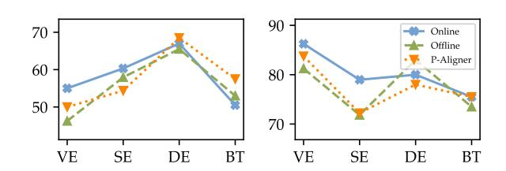
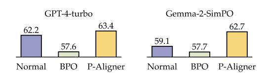
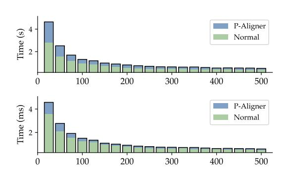

# P-Aligner: Pre-Aligning LLMs via Principled Instruction Synthesis

# Feifan Song

State Key Laboratory of Multimedia Information Processing, School of Computer Science, Peking University Beijing, China songff@stu.pku.edu.cn

Bofei Gao State Key Laboratory of Multimedia Information Processing, School of Computer Science, Peking University Beijing, China gaobofei@stu.pku.edu.cn

# Yifan Song

State Key Laboratory of Multimedia Information Processing, School of Computer Science, Peking University Beijing, China yfsong@pku.edu.cn

Yi Liu State Key Laboratory of Multimedia Information Processing, School of Computer Science, Peking University Beijing, China imliuyi@pku.edu.cn

Weimin Xiong State Key Laboratory of Multimedia Information Processing, School of Computer Science, Peking University Beijing, China wmxiong@pku.edu.cn

Yuyang Song University of Southampton Southampton, Hampshire, UK ys9y23@soton.ac.uk

Tianyu Liu Peking University Beijing, China tianyu0421@pku.edu.cn

Guoyin Wang Alibaba Group Seattle, WA, USA Guoyin.wang@alibaba-inc.com

Houfeng Wang∗ State Key Laboratory of Multimedia Information Processing, School of Computer Science, Peking University Beijing, China wanghf@pku.edu.cn

# Abstract

Large Language Models (LLMs) can fail to align with human preference on flawed instructions, leaving a large room for pre-aligning instructions before the inference. In this work, we show that such pre-alignment can be efficiently and effectively achieved by P-Aligner, a lightweight module generating instructions that hold the original intents but are expressed in a human-preferred way. It is trained on UltraPrompt, a dataset synthesized via our proposed principle-guided pipeline using Monte-Carlo Tree Search, exploring candidate instructions that are closely tied to human preference. Experiments show that it beats baselines across various models and benchmarks, accompanied by further analyses on data quality, search strategies, and time overhead.

# CCS Concepts

• Computing methodologies → Discourse, dialogue and pragmatics; • Information systems → Web applications.

### Keywords

Large Language Models, Preference Alignment, Data Synthesis

#### ACM Reference Format:

Feifan Song, Bofei Gao, Yifan Song, Yi Liu, Weimin Xiong, Yuyang Song, Tianyu Liu, Guoyin Wang, and Houfeng Wang. 2026. P-Aligner: Pre-Aligning LLMs via Principled Instruction Synthesis. In Proceedings of the ACM Web

∗Correspondence author.

© 2026 Copyright held by the owner/author(s). ACM ISBN 979-8-4007-2307-0/2026/04 <https://doi.org/10.1145/3774904.3792889>

Conference 2026 (WWW '26), April 13–17, 2026, Dubai, United Arab Emirates. ACM, New York, NY, USA, [4](#page-3-0) pages.<https://doi.org/10.1145/3774904.3792889>

# 1 Introduction

Large Language Models (LLMs) remain fragile in aligning outputs with human preferences, which can arises from the user inputs themselves: instructions with enough background or proper tones work well, but flawed ones lead to undesired outputs [\[5,](#page-3-1) [10\]](#page-3-2).

Pre-processing instructions are useful. For example, Cheng et al. [\[2\]](#page-3-3) released a module BPO for this, which is trained on a corpus of heuristically refined instructions. However, it fails to clearly define the directions of refinement, resulting in limited gains.

In this work, we propose to anchor the instruction-refinement process to a concrete principle set. Each encodes an explicit direction, converting the vague goal into a finite, interpretable action space. However, solely trying each edit direction does not guarantee monotonic improvement, requiring a quantitative feedback signal. We thereby score it by measuring the quality of LLM responses as a proxy upon an off-the-shelf preference reward model, without human annotation. With above components, we design a new pipeline for synthesizing high-quality instructions, where the refinement is structured as iterative self-editing with pre-defined principles corresponding to general human preference, implemented by Monte Carlo Tree Search (MCTS). We further customize each stages in it to accommodate the scenario of instruction refinement.

Then, we propose P-Aligner, a lightweight module that follows the spirit of instruction synthesis to automatically produce principled instructions end-to-end to empower LLM preference alignment. It is acquired via UltraPrompt, a preference corpus constructed by the above pipeline, including the top/bottom-ranked instructions filtered out from each search tree. We conduct comprehensive evaluations across competitive baselines and language

[This work is licensed under a Creative Commons Attribution 4.0 International License.](https://creativecommons.org/licenses/by/4.0) WWW '26, Dubai, United Arab Emirates

models to evaluate its effectiveness, where P-Aligner raises the average win rate by 28.35% over the best baseline on GPT-4-turbo and by 8.69% on Gemma-2-SimPO, demonstrating consistent gains. Ablations that control the data quality confirm that the synthesized corpus is the primary driver of improvement for P-Aligner. Benchmarking it against on-the-fly search implementations also shows its comparable performance at a fraction of the cost. We finally analyze its real-world serving overhead, revealing its high efficiency with negligible latency under batched deployment.

Another gain of this work is SinglePO, a single-step principleoriented rewriter acquired from UltraPrompt, which will be released along with P-Aligner to facilitate local and low-resource deployment of the data pipeline or further research by the community.

We summarize our contributions as follows: (1) We design a new instruction synthesis pipeline with principles, allowing training with controllable and interpretable data. (2) We build UltraPrompt, a synthesized instruction set, as well as P-Aligner, a lightweight module for pre-alignment before responses. (3) We conduct comprehensive experiments and analysis to validate our approach, as well as another module, SinglePO, to support local low-resource deployment of the synthesis pipeline.

#### 2 Methodology

In this section, we first formalize the task, then introduce a principled instruction-synthesis pipeline that generates high-quality, preference-oriented instruction pairs. Finally, we detail how P-Aligner is trained and deployed.

#### 2.1 Task Formulation

Let X denote the space of user instructions and Y the space of LLM responses. The LLM �� is expected to map the �� ∈ X to a response �� ∈ Y that aligns with human preference. Such preference is commonly summarized by the 3H criteria: Helpfulness, Harmlessness, and Honesty. However, as discussed in [§1,](#page-0-0) �� may fail to sample satisfactory �� when the input instruction is flawed. We thereby introduce a lightweight module ��′ for end-to-end instruction rewriting to counteract this negative effect, which is trained on high-quality data produced by our synthesis pipeline.

#### 2.2 Principled Instruction Synthesis

Refining flawed instructions demands (i) a clear direction toward human preference, and (ii) exhaustive yet efficient exploration of the (near-)paraphrase space. Similar to Wang et al. [\[7\]](#page-3-4), we leverage MCTS but re-design the inner components to build a scalable pipeline for instruction synthesis, in parallel to Yang et al. [\[8\]](#page-3-5), Ashizawa et al. [\[1\]](#page-3-6) and Yu et al. [\[9\]](#page-3-7).

In detail, by treating each instruction as a node, a single transition between nodes can be defined. Given an rewriter ��, a modified instruction �� ′ can be obtained on the raw �� and a principle �� ∈ ��:

�� ′ ∼ ��(��, ��) (1)

Here �� maintains all principles to define the action space. Each �� are designed as atomic actions and can be combined through multiple transitions.

Simulation. A key design is that every node is a terminal state, as one transition produces a completed instruction to return. Consequently, the simulation phase in MCTS needs adaption: If a new node �� is to be expanded, initially it should go through a rollout process to a terminal node, and then the reward is calculated to score ��. However, since �� is also completed, this stage can be performed in-place, and the corresponding score can be obtained directly. Another challenge is how to score instructions, since prevalent reward models only score �� ∈ ��. Here we define rewarding instruction ���� using its corresponding y�� from a local LLM ��,

���� = 1 y�� ∑︁ ��∈y�� ��(��0, ��) (2)

where �� is a normal reward model. The instruction reward ���� is the average of multiple response rewards based on the original instruction ��0 throughout the tree search process. It reduces randomness and ensures fairness in comparing different nodes.

Backpropagation. Next, the reward is backpropagated to update the Q-values of all its ancestors along the full path to the root in the search tree. For a node ���� containing ���� , paired with its child nodes {�� ′ }, we define computing Q-value of ���� as follows:

��(����) = 1 1 + {�� ′ �� } © « ���� + ∑︁ �� ′ ��(�� ′ �� ) ª ® ® ¬ (3)

The reward ���� of ���� is also considered, since returning ���� should be an implicit transition. We set ��(����) = ���� if �� is a leaf node.

Selection and Expansion. With Q-values updated, the search turns to select the next node to explore, progressively moving to highervalue regions. Here the next node is chosen via the UCB rule

�� ′ next = arg max �� ′ ��(�� ′ �� ) + �� √︄ log�� (����) �� (�� ′ �� ) ! (4)

where �� (��) records visit counts to one node ��, and the constant �� balances exploration versus exploitation. Expansion is then triggered whenever at least one unexplored action remains for ���� , and a new instruction is produced by applying Equation [1](#page-1-0) with a random ��, yielding a fresh node without considering its parent state is terminal. This ensures the search continues.

#### 2.3 P-Aligner

With the above pipeline, each seed instruction can be refined into a set of derived ones. We leverage it to construct a preference dataset named UltraPrompt, and acquire P-Aligner through preference learning. To be specific, 10000 seed instructions are collected from various sources to cover various domains. After data synthesis, we exploit the scores of instructions in MCTS to filter out the best/worst version of derived instructions as the chosen/rejected targets, thus assembling a contrastive sample with the seed instruction: (seed, chosen, rejected). Then, P-Aligner is gained with DPO on UltraPrompt. For implementation, its end-to-end production of principled instructions will reduce the cost in multiple aspects, as discussed in [§3.5.](#page-3-8) Additionally, we acquire SinglePO, a locally implemented rewriter �� used in the synthesis pipeline to reduce the future cost in financial and time overhead. It also derives from

Table 1: Results across different benchmarks.

| Model         | Method    | VE    | SE    | DE    | BT    |
|---------------|-----------|-------|-------|-------|-------|
|               | Normal    | 10.00 | 7.94  | 4.50  | 7.50  |
| GPT-4-turbo   | BPO       | 21.25 | 19.05 | 27.00 | 22.50 |
|               | P-Aligner | 50.00 | 54.37 | 68.50 | 57.50 |
|               | Normal    | 75.00 | 59.52 | 54.50 | 59.00 |
| Gemma-2-SimPO | BPO       | 78.75 | 65.87 | 63.00 | 62.00 |
|               | P-Aligner | 83.75 | 72.22 | 78.00 | 75.50 |
|               | Normal    | 0.00  | 1.98  | 1.50  | 1.50  |
| Llama-3.1-8B  | BPO       | 3.75  | 5.16  | 6.50  | 4.00  |
|               | P-Aligner | 6.25  | 22.22 | 37.00 | 27.50 |
| w/ Best-of-N  |           |       |       |       |       |
|               | Normal    | 0.00  | 1.19  | 2.50  | 4.50  |
|               | BPO       | 6.25  | 2.78  | 8.50  | 8.00  |
|               | P-Aligner | 13.75 | 28.97 | 42.50 | 41.00 |
| w/ URIAL      |           |       |       |       |       |
|               | Normal    | 5.00  | 14.68 | 23.00 | 15.00 |
|               | BPO       | 5.00  | 14.68 | 25.50 | 15.50 |
|               | P-Aligner | 5.00  | 20.24 | 40.00 | 32.50 |

Figure 1: Results on ArenaHard.

UltraPrompt, where we reuse the search trees and collect all 104602 positive transitions. More details can be found in [our released code](https://github.com/F2-Song/P-Aligner).

#### 3 Experiments

#### 3.1 Evaluation Setup

We compare P-Aligner with two baselines: using original instructions (Normal) or instructions optimized by BPO [\[2\]](#page-3-3), on various models and methods, including GPT-4-turbo, Gemma-2-SimPO [\[6\]](#page-3-9), and tuning-free methods such as Best-of-N and URIAL [\[4\]](#page-3-10) based on Llama-3.1-8B. All experiments exclude system prompts to eliminate additional effects. We take 4 benchmarks involved in BPO for experiments, including Vicuna Evaluation (VE), Self-instruct Evaluation (SE), Dolly Evaluation (DE), and BPO Test (BT). We further introduce another popular benchmark ArenaHard (AH) [\[3\]](#page-3-11), where we use its initial output score as the metric. For other benchmarks, the common metrics win-rates, i.e., rates of generated responses better than baseline ones, computed in double directions, are used. The baseline responses are from GPT-4o.

#### 3.2 Implementation Details

The default rewriter �� is GPT-4. Each principle is mapped into a description (see [our code](https://github.com/F2-Song/P-Aligner)) and embedded in the input to ��. For each simulation, 3 responses are sampled from Llama-3.1-8B as �� and scored by ArmoRM-Llama3-8B-v0.1, which indirectly reflects the quality of the given instructions. The exploration weight �� in data synthesis is 0.1 to fit the scale of outputs from ArmoRM. We train P-Aligner and SinglePO from Llama-3.2-3B-Instruct, which are completed by LlamaFactory. Inference with the two models is conducted with greedy search to ensure reproducibility. All predefined principles and prompt templates are included in [our code](https://github.com/F2-Song/P-Aligner).

Table 2: Results with different sampling ways for Ultra-Prompt. The maximum number of steps is 20 by default.

| Model | Range Sampling | of VE | SE    | DE    | BT    |
|-------|----------------|-------|-------|-------|-------|
| 2     | steps          | 16.25 | 26.59 | 26.50 | 23.00 |
| 11    | steps          | 48.75 | 45.24 | 63.50 | 52.50 |
| max   | steps          | 50.00 | 54.37 | 68.50 | 57.50 |
|       | random         | 41.25 | 46.83 | 58.50 | 48.50 |
| 2     | steps          | 75.00 | 63.89 | 65.00 | 63.50 |
| 11    | steps          | 76.25 | 66.67 | 73.50 | 71.00 |
| max   | steps          | 83.75 | 72.22 | 78.00 | 75.50 |
|       | random         | 78.75 | 69.44 | 76.50 | 65.00 |

Figure 2: Comparisons among different search strategies. Left: GPT-4-turbo. Right: Gemma-2-SimPO.

#### 3.3 Main Results

Table [1](#page-2-0) summarizes the results, where P-Aligner consistently surpasses both Normal and BPO. On GPT-4-turbo, P-Aligner raises the win rate by 28.35% overall, with large gains of 28.75% on VE and 35.32% on SE. Gemma-2-SimPO likewise benefits, showing an 8.69% average improvement. Even on the more challenging AH shown in Figure [1,](#page-2-1) P-Aligner still delivers further score increases. All these confirm its strong ability to enhance LLM preference alignment.

Moreover, the effectiveness of instruction optimization also depends on context. For example, since URIAL maintains a static context to shift the distribution of LLMs, the improvements from P-Aligner and BPO on it are partially offset.

#### 3.4 Ablation Study

3.4.1 Effect of Training Data. A crucial aspect of P-Aligner is Ultra-Prompt, where the data are collected from completed search trees. To evaluate the influence of data quality, we test several alternative collection methods aside from the default way, including random (selecting random nodes) and sampling from truncated search trees at 2 and 11 steps. Table [2](#page-2-2) shows the results that with larger trees, P-Aligner performs better, indicating the robustness of the pipeline and the effectiveness of the reward mechanism in it. The effect of random sampling is not stable, and sometimes the lowest, for which we infer that fluctuations in data quality hinder effective training.

3.4.2 Comparisons among Different Search Strategies. We evaluate P-Aligner alongside two alternative search strategies: online search, which utilizes the proposed pipeline with GPT-4 for instruction refinement, and offline search employing SinglePO instead of GPT-4. Results on both GPT-4-turbo and Gemma-2-SimPO are exhibited in Figure [2,](#page-2-3) where scores of these methods are closely matched, with their relative rankings varying across different benchmarks. For instance, on the VE, the online method leads with a 5

Table 3: Comparisons among strategies in implementation.

| Strategies | Free Use Local Use | E2E Time | Overhead |
|------------|--------------------|----------|----------|
| Online     | ✗ ✗                | ✗ 5300   | ms       |
| Offline    | ✓ ✓                | ✗ 3920   | ms       |
| P-Aligner  | ✓ ✓                | ✓ 108    | ms       |

Figure 3: Comparisons of time between normal inference and inference with P-Aligner. The X-axis represents the number of batch-submitted queries. Upper: time consumed per query. Lower: time consumed per token.

percentage point advantage over P-Aligner with GPT-4-turbo, while outperforming the offline approach by 8.75 points. However, this pattern reverses on the DE, where P-Aligner claims the top spot with a 68.50 point, over both the online and offline search. Similar fluctuations also exist with Gemma-2-SimPO, where P-Aligner leads the group for BT while the online search stays at the top position for SE. Such close performance underscores the robustness and versatility of P-Aligner, and after considering the cost of implementation, P-Aligner becomes the most recommended choice, as we discuss in [§3.5.](#page-3-8)

# 3.5 Analysis of Consumption

Compared with direct inference on raw user queries, introducing instruction optimization in advance inevitably brings additional overhead in multiple aspects, such as time overhead and financial cost. To quantify these trade-offs, we compare different search strategies discussed before with P-Aligner, along four axes: financial cost, local use, end-to-end execution (E2E), and time overhead. Results are included in Table [3,](#page-3-12) where GPT-4-based online search is the most expensive and slowest due to frequent API calls. In contrast, offline search with our proposed SinglePO can achieve comparable alignment quality while lowering cost, security (with local implementation), and time consumption, making it a valuable alternative. P-Aligner, however, emerges as the most economical: it is locally deployable, off-the-shelf, and executes in an end-to-end manner, eliminating both API fees and multi-stage latency.

To further assess the marginal time cost introduced by P-Aligner, we measure (i) average response time per query and (ii) average decoding time per token on Gemma-2-SimPO over 25–500 instructions sampled from ArenaHard. Figure [3](#page-3-13) shows that the relative overhead is most significant for small batch sizes, and as the number of queries grows, the amortized cost rapidly diminishes. Moreover, since P-Aligner is lightweight, the relative overhead is expected to shrink further when paired with larger models, whose base inference time dominates the total budget.

Another advantage of its efficiency is the near-optimal results in a single pass, since we experimented with iterative refinement in [\[2\]](#page-3-3) but see no clear benefit, and the first-pass outputs are strong enough. This reduces costly serial computation for improved performance. Please refer to [our code](https://github.com/F2-Song/P-Aligner) for detailed results and analysis.

# 4 Conclusion

In this work, we present a novel pipeline to synthesize humanpreferred instructions, from which we derive UltraPrompt, a highquality preference dataset of synthesized instructions for training P-Aligner. This lightweight end-to-end module refines raw instructions in a single forward pass. We also introduce SinglePO, a singlestep variant that allows the pipeline to be executed locally without a sharp loss of performance Evaluations confirm consistent gains from P-Aligner in preference learning with minimal additional overhead, offering a promising direction to make instruction-level pre-alignment a practical solution.

# Acknowledgments

This work is supported by National Natural Science Foundation of China (Grant No. 62576010).

# References

[1] Rin Ashizawa, Yoichi Hirose, Nozomu Yoshinari, Kento Uchida, and Shinichi Shirakawa. 2025. Bandit-Based Prompt Design Strategy Selection Improves Prompt Optimizers. arXiv preprint arXiv:2503.01163 (2025). [2] Jiale Cheng, Xiao Liu, Kehan Zheng, Pei Ke, Hongning Wang, Yuxiao Dong, Jie Tang, and Minlie Huang. 2024. Black-Box Prompt Optimization: Aligning Large Language Models without Model Training. In Proceedings of the 62nd Annual Meeting of the Association for Computational Linguistics (Volume 1: Long Papers), Lun-Wei Ku, Andre Martins, and Vivek Srikumar (Eds.). Association for Computational Linguistics, Bangkok, Thailand, 3201–3219. [doi:10.18653/v1/2024.](https://doi.org/10.18653/v1/2024.acl-long.176) [acl-long.176](https://doi.org/10.18653/v1/2024.acl-long.176) [3] Tianle Li, Wei-Lin Chiang, Evan Frick, Lisa Dunlap, Tianhao Wu, Banghua Zhu, Joseph E. Gonzalez, and Ion Stoica. 2025. From Crowdsourced Data to Highquality Benchmarks: Arena-Hard and Benchbuilder Pipeline. In Forty-second International Conference on Machine Learning. [4] Bill Yuchen Lin, Abhilasha Ravichander, Ximing Lu, Nouha Dziri, Melanie Sclar, Khyathi Chandu, Chandra Bhagavatula, and Yejin Choi. 2024. The Unlocking Spell on Base LLMs: Rethinking Alignment via In-Context Learning. In The Twelfth International Conference on Learning Representations. [5] Sam Lin, Wenyue Hua, Lingyao Li, Zhenting Wang, and Yongfeng Zhang. 2025. ADO: Automatic Data Optimization for Inputs in LLM Prompts. arXiv preprint arXiv:2502.11436 (2025). [6] Yu Meng, Mengzhou Xia, and Danqi Chen. 2024. SimPO: Simple Preference Optimization with a Reference-Free Reward. In Advances in Neural Information Processing Systems 38: Annual Conference on Neural Information Processing Systems 2024, NeurIPS 2024, Vancouver, BC, Canada, December 10 - 15, 2024, Amir Globersons, Lester Mackey, Danielle Belgrave, Angela Fan, Ulrich Paquet, Jakub M. Tomczak, and Cheng Zhang (Eds.). [7] Xinyuan Wang, Chenxi Li, Zhen Wang, Fan Bai, Haotian Luo, Jiayou Zhang, Nebojsa Jojic, Eric Xing, and Zhiting Hu. 2024. PromptAgent: Strategic Planning with Language Models Enables Expert-level Prompt Optimization. In The Twelfth International Conference on Learning Representations. [8] Chengrun Yang, Xuezhi Wang, Yifeng Lu, Hanxiao Liu, Quoc V Le, Denny Zhou, and Xinyun Chen. 2023. Large language models as optimizers. In The Twelfth International Conference on Learning Representations. [9] Zhuohao Yu, Jiali Zeng, Weizheng Gu, Yidong Wang, Jindong Wang, Fandong Meng, Jie Zhou, Yue Zhang, Shikun Zhang, and Wei Ye. 2025. RewardAnything: Generalizable Principle-Following Reward Models. arXiv preprint arXiv:2506.03637 (2025). [10] Yongchao Zhou, Andrei Ioan Muresanu, Ziwen Han, Keiran Paster, Silviu Pitis, Harris Chan, and Jimmy Ba. 2022. Large language models are human-level prompt engineers. In The Eleventh International Conference on Learning Representations.