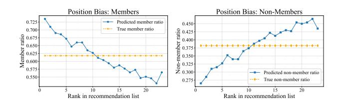
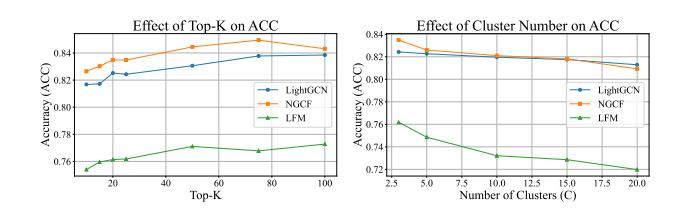

# Interaction-level Membership Inference Attack for Recommender Systems via Cluster-based User Modeling

[Danyang Zong](https://orcid.org/1234-5678-9012)∗ zongdanyang01@gmail.com State Key Laboratory of AI Safety, Institute of Computing Technology, Chinese Academy of Sciences Beijing, China Henan Institute of Advanced Technology, Zhengzhou University Zhengzhou, China

Kaike Zhang∗ Qi Cao Du Su zhangkaike21s@ict.ac.cn caoqi@ict.ac.cn sudu@ict.ac.cn State Key Laboratory of AI Safety, Institute of Computing Technology, Chinese Academy of Sciences Beijing, China

Fei Sun† sunfei@ict.ac.cn State Key Laboratory of AI Safety, Institute of Computing Technology, Chinese Academy of Sciences Beijing, China

# Abstract

Auditing the privacy risks of recommender systems has become increasingly important as these models are trained on large-scale user behavior data. Membership inference methods provide a practical means to assess such risks by testing whether individual data records were used during training. Most existing methods operate at the user level, inferring membership by comparing a user's overall preference signal derived from recommendation outputs with their historical interactions. However, in practice, inferring the membership of individual user interactions is more realistic and informative. Simply extending these coarse-grained user-level methods to the interaction level can introduce systematic biases, causing interactions related to top-ranked items to be disproportionately inferred as members. To address these issues, we observe that a user's preference is typically composed of multiple underlying interests. Motivated by this intuition, we propose Cluster-based Interactionlevel Membership Inference Attack (CMIA). Specifically, CMIA clusters the recommendation list into multiple interest groups and aggregates these clusters to reconstruct a multi-interest user representation. CMIA enables interaction-level membership inference while mitigating position bias and preserving a meaningful preference structure. Experiments on benchmark datasets show that CMIA substantially improves inference performance and exposes deeper privacy risks in recommender systems. The code is available at [https://github.com/zongAugust/CMIA.](https://github.com/zongAugust/CMIA)

# CCS Concepts

#### • Information systems → Information retrieval; • Security and privacy → Security services.

© 2026 Copyright held by the owner/author(s). ACM ISBN 979-8-4007-2307-0/2026/04 <https://doi.org/10.1145/3774904.3792890>

# Keywords

Recommender Systems, Membership Inference Attack, Privacy Leakage

#### ACM Reference Format:

Danyang Zong, Kaike Zhang, Qi Cao, Du Su, and Fei Sun. 2026. Interactionlevel Membership Inference Attack for Recommender Systems via Clusterbased User Modeling. In Proceedings of the ACM Web Conference 2026 (WWW '26), April 13–17, 2026, Dubai, United Arab Emirates. ACM, New York, NY, USA, [4](#page-3-0) pages.<https://doi.org/10.1145/3774904.3792890>

# 1 Introduction

Recommender systems learn from large-scale user–item interactions to deliver personalized experiences [\[9\]](#page-3-1), serving as a cornerstone of modern online services such as e-commerce, social media, and entertainment [\[5,](#page-3-2) [10\]](#page-3-3). However, user behaviors contain sensitive personal information that may be exploited without authorization, leading to severe privacy risks. To audit such risks, membership inference attacks (MIAs) [\[4\]](#page-3-4) have been widely adopted. The goal of MIA is to determine whether a specific data record was included in the training set, enabling audits of potential unauthorized or excessive data usage.

Currently, MIAs against recommender systems primarily focus on user-level inference [\[1,](#page-3-5) [12,](#page-3-6) [13,](#page-3-7) [15\]](#page-3-8). These methods typically assume that users in the training set exhibit historical interactions highly similar to the system's recommendations. Specifically, they quantify this similarity by comparing the user's history with a rank-weighted representation of the recommendation list. However, user-level attacks are inherently coarse-grained as they treat a user's entire interaction history as a single unit, failing to discern whether a specific interaction was used for training. This limitation hinders practical auditing in modern privacy scenarios. For instance, under the "right to be forgotten" [\[7\]](#page-3-9), users may request the deletion of specific behaviors rather than their entire profile. Such finegrained requirements necessitate the development of interactionlevel membership inference.

Transitioning from user-level to interaction-level inference is non-trivial. While user-level MIA identifies the presence of an entire user based on collective signals, interaction-level MIA must isolate the influence of a single interaction on the recommendation results from the user's behavioral history. In a black-box setting, this task

∗Equal contribution †Corresponding author.

[This work is licensed under a Creative Commons Attribution 4.0 International License.](https://creativecommons.org/licenses/by/4.0) WWW '26, Dubai, United Arab Emirates

Figure 1: Illustration of position bias in inference. Items similar to higher-ranked members are more likely to be inferred as members (left), while those similar to lower-ranked items tend to be classified as non-members (right).

becomes even more challenging because the attacker cannot distinguish which specific interaction among many actually triggered a particular recommendation. We observe that directly applying this strategy to interaction-level MIA [\[14\]](#page-3-10) introduces a significant position bias, where interactions similar to top-ranked items are disproportionately flagged as members, regardless of their actual training status (Fig. [1\)](#page-1-0). While assigning equal weights to all items can mitigate this bias, it effectively treats the recommendation list as a homogeneous set, blurring the boundaries between distinct interests and leading to a loss of fine-grained signals.

To address the above problems, we propose the Cluster-based Interaction-level Membership Inference Attack (CMIA). Instead of relying on positional weights, CMIA partitions the recommendation list into several interest groups to capture diverse user preferences. It then computes cluster-level embeddings to summarize the preference patterns within each group, aggregating them into a reconstructed, multi-interest user representation. This approach restores the true preference structure while eliminating the position bias inherent in previous aggregation methods. Consequently, CMIA demonstrates a consistent performance lead over all baseline methods across three representative models and three datasets. Specifically, it maintains a TPR between 0.1902 and 0.4759 under strict FPR constraints, validating its superior capability in interaction-level inference.

#### 2 Problem Formulation

Adversary Knowledge. We assume the adversary has only blackbox access to the target recommender model ��target. Specifically, the adversary can query ��target to obtain the top-�� recommendation list for any user��, denoted as R , but cannot access internal parameters.

As the target model is accessible in a black-box manner, the adversary typically employs a shadow model ��shadow to generate labeled data for the attack model. Under this setting, the membership inference task can be abstracted as a binary classification problem that determines whether a given interaction was included in the target model's training data.

Problem Definition. Given a candidate item �� and a ranked top- �� recommendation list R for user �� from target recommender ��target, an interaction-level membership inference attack A can be defined as follows:

A : R , ��,�� → ��, (1)

where �� ∈ {0, 1} denotes the prediction of A, with �� = 1 indicating that the interaction (��,��) is a member and �� = 0 otherwise.

#### 3 Method

In this section, we present the CMIA framework in detail, which consists of three core stages: (1) shadow recommender model training, (2) attack feature construction, and (3) attack model training. The following subsections elaborate on the technical implementation of each component.

#### 3.1 Shadow Recommender Model Training

Due to the inaccessible nature of the internal parameters in ��target within a black-box environment, we employ a shadow model ��shadow trained on an independent dataset to synthesize labeled training samples for the subsequent attack model. Specifically, for each shadow user ��, we designate their historical interaction set I mem as member samples to optimize the shadow recommender and extract latent item embeddings. Simultaneously, to maintain a balanced training distribution, we randomly sample an equal number of nonmember items I non from the set of items with which the user has never interacted, ensuring |Inon | = |Imem |.

#### 3.2 Attack feature construction

After obtaining item embeddings from ��shadow, we query the recommender to get the recommendation list R�� = {��1,��2, . . . ,���� } for user ��, where each ���� is represented by a ��-dimensional embedding v�� ∈ R �� , and �� is the length of the recommendation list. Intuitively, a user may have multiple interests, and recommender systems capture these interests when generating recommendations by learning user representations. As a result, the recommendation list often reflects the user's diverse preferences. To effectively capture this diversity and mitigate position bias caused by rank-discounted aggregation, we employ cosine-based K-Means to cluster the items in the user's recommendation list R�� into multiple interest groups, and then aggregate these clusters to form a multi-interest user representation.

{��1,��2, . . . ,���� } = k-means(R��,��). (2)

Each cluster center is computed as the mean vector of item embeddings within the cluster. Formally, the ��-th cluster center is computed as:

g�� = 1 |���� | ∑︁ v�� ∈���� , �� = 1, . . . ,��. (3)

These aggregated cluster centers can represent different aspects of a user's interests. Based on this, we represent the user as:

u = 1 �� ∑︁�� ��=1 g�� . (4)

Although the aggregated cluster centers capture the user's multiple interests, they only provide a static profile of the user's preferences. To evaluate the relevance of a candidate item to each specific interest, we compute the cosine similarity between the item's embedding v�� and each cluster center g�� :

���� = v�� · g�� ∥v�� ∥ ∥g�� ∥ , �� = 1, . . . ,��. (5)

By concatenating the candidate v�� with the user representation x��,�� and the similarities between the item and each interest cluster, the attack model can simultaneously learn the user–item matching relationship, capture the user's overall preference, and recognize the item's alignment with different interest clusters, enabling more accurate inference of whether the interaction is in the training set.

x��,�� = u ∥ v�� ∥ [��1, . . . , ����] ∈ R 2��+�� , (6)

where �� denotes the dimensionality of each item embedding, and �� denotes the number of interest clusters.

### 3.3 Attack model training

The attack model employs a three-layer Multi-Layer Perceptron (MLP), consisting of two hidden layers with 128 units each. The input is the user–item feature vector x��,�� constructed as described above. The output layer has two units, representing the probability of the interaction being a member or non-member. Formally, the model can be written as:

yˆ��,�� = ���� (x��,��). (7)

The model is trained using the cross-entropy loss:

L = − 1 |D | ∑︁ (��,��) ∈D h y��,�� log yˆ��,�� + (1 − y��,��) log(1 − yˆ��,��) . (8)

where y��,�� is the ground-truth label, and yˆ��,�� is the predicted label.

# 4 Experiment Results and Analysis

This section presents the experimental evaluation of our proposed framework. We first describe the experimental setup, including datasets and recommender systems, baseline methods and evaluation metrics. We then present our experimental results and illustrate the performance of our method under different parameter settings.

# 4.1 Experimental Setup

Target Recommender Systems and Datasets. We employ three representative recommender systems: LightGCN [\[3\]](#page-3-11), NGCF [\[11\]](#page-3-12), and LFM, with embedding dimensions set to 64. Experiments are conducted on three real-world datasets: the Amazon-book dataset [\[2\]](#page-3-13), the Gowalla dataset [\[6\]](#page-3-14), and the Yelp2018 dataset [\[8\]](#page-3-15). To ensure data isolation, we first partition each dataset by users: the first half of the users' data is used as the shadow dataset, and the second half as the target dataset. The shadow and target models are then trained separately. Subsequently, following the method described in Section 3.1, we construct the training set of the attack model based on the shadow dataset and the test set based on the target dataset.

- Baselines. We compare CMIA with the following attacks:
- MIARS (w/o) [\[13\]](#page-3-7): Since MIARS targets user-level inference, we adapt it for interaction-level attacks by using the difference vector between top-K weighted embedding and target item embedding.
- MIARS [\[13\]](#page-3-7): To remove the scale effect in MIARS, we use the difference vector between the normalized top-K weighted embedding and the normalized target item embedding.
- MINER [\[14\]](#page-3-10): For a candidate interaction, this method computes rank-weighted similarities between the target item and items in the user's recommendation list. Multiple distance measures (��1 distance, ��2 distance, Cosine, Bray-Curtis) are combined to form

Table 1: LightGCN Experimental Results.

| Dataset Attack         | ACC    | AUC    | TPR@0.5%FPR | TPR@1%FPR |
|------------------------|--------|--------|-------------|-----------|
| MIARS                  | 0.8187 | 0.8950 | 0.2339      | 0.3310    |
| MIARS(w/o) Amazon-book | 0.7121 | 0.8338 | 0.0454      | 0.0952    |
| MINER                  | 0.8160 | 0.8990 | 0.1681      | 0.3361    |
| Ours                   | 0.8243 | 0.9106 | 0.2651      | 0.3811    |
| MIARS                  | 0.8210 | 0.9021 | 0.3040      | 0.3948    |
| MIARS(w/o) Gowalla     | 0.7782 | 0.8676 | 0.0914      | 0.1732    |
| MINER                  | 0.8041 | 0.8847 | 0.2051      | 0.3124    |
| Ours                   | 0.8733 | 0.9424 | 0.3447      | 0.4759    |
| MIARS                  | 0.7844 | 0.8822 | 0.1387      | 0.2200    |
| MIARS(w/o) Yelp2018    | 0.7550 | 0.8335 | 0.0243      | 0.0488    |
| MINER                  | 0.7283 | 0.8153 | 0.1540      | 0.2234    |
| Ours                   | 0.8509 | 0.9320 | 0.2130      | 0.3184    |

Table 2: NGCF Experimental Results.

| Dataset Attack         | ACC    | AUC    | TPR@0.5%FPR | TPR@1%FPR |
|------------------------|--------|--------|-------------|-----------|
| MIARS                  | 0.8276 | 0.9045 | 0.1308      | 0.2458    |
| MIARS(w/o) Amazon-book | 0.7802 | 0.8941 | 0.1275      | 0.2239    |
| MINER                  | 0.8054 | 0.8814 | 0.0585      | 0.1171    |
| Ours                   | 0.8348 | 0.9208 | 0.2770      | 0.3865    |
| MIARS                  | 0.8875 | 0.9460 | 0.1537      | 0.3076    |
| MIARS(w/o) Gowalla     | 0.8785 | 0.9449 | 0.2788      | 0.3998    |
| MINER                  | 0.8765 | 0.9212 | 0.0687      | 0.1374    |
| Ours                   | 0.8945 | 0.9556 | 0.3317      | 0.4572    |
| MIARS                  | 0.8493 | 0.9188 | 0.1078      | 0.1881    |
| MIARS(w/o) Yelp2018    | 0.8678 | 0.9387 | 0.1703      | 0.2828    |
| MINER                  | 0.8425 | 0.9023 | 0.0503      | 0.1007    |
| Ours                   | 0.8838 | 0.9486 | 0.2150      | 0.3318    |

the attack vector x��,��. We remove item knowledge graph (KG) information, as our experiments do not use knowledge-graphbased recommenders.

Metrics. We evaluate our methods using the following metrics:

- ACC: The proportion of correctly predicted samples.
- AUC: The area under the ROC curve (AUC) measures the model's ability to distinguish members from non-members.
- TPR@FPR: Quantifies the TPR achieved when the FPR is set to a specific value �� (e.g., �� = 0.01), highlighting the model's effectiveness under a strict false positive constraint.

### 4.2 Experiment Results

In this section, we present the experimental results to evaluate the effectiveness of the proposed CMIA framework. We report both quantitative metrics and qualitative observations to demonstrate its performance compared to baseline methods. In our experiments, both the baselines and our method use the same MLP architecture, with the top-�� value set to 25 and the number of clusters set to 3. All attack models are trained using the Adam optimizer, with a learning rate of 0.001 and a batch size of 64. The results of our experiments are summarized in Tables [1,](#page-2-0) [2,](#page-2-1) and [3.](#page-3-16)

For the LightGCN and NGCF models, CMIA consistently outperforms the baselines in both classification accuracy (ACC) and AUC, with ACC reaching at least 0.8243 and AUC at least 0.9106 across different datasets. For the LFM model, while the ACC is comparable to the baselines, our method achieves significant improvements in scenarios with low false positive rates (FPR). Specifically, taking the LFM-Gowalla case as an example, CMIA achieves a True Positive Rate (TPR) as high as 0.2921 under strict FPR constraints. This

Table 3: LFM Experimental Results.

| Dataset Attack         | ACC    | AUC    | TPR@0.5%FPR | TPR@1%FPR |
|------------------------|--------|--------|-------------|-----------|
| MIARS                  | 0.7635 | 0.8387 | 0.0722      | 0.1320    |
| MIARS(w/o) Amazon-book | 0.7008 | 0.8255 | 0.0728      | 0.1265    |
| MINER                  | 0.7320 | 0.8059 | 0.0911      | 0.1519    |
| Ours                   | 0.7618 | 0.8407 | 0.1228      | 0.1902    |
| MIARS                  | 0.8284 | 0.9025 | 0.1110      | 0.1725    |
| MIARS(w/o) Gowalla     | 0.7993 | 0.8949 | 0.1364      | 0.2077    |
| MINER                  | 0.7890 | 0.8564 | 0.0551      | 0.1103    |
| Ours                   | 0.8155 | 0.9048 | 0.2028      | 0.2921    |
| MIARS                  | 0.8564 | 0.9149 | 0.0833      | 0.1410    |
| MIARS(w/o) Yelp2018    | 0.8501 | 0.9182 | 0.1037      | 0.1758    |
| MINER                  | 0.8478 | 0.9005 | 0.0459      | 0.0918    |
| Ours                   | 0.8529 | 0.9219 | 0.1278      | 0.2046    |

Figure 2: Impact of Top-K (left) and cluster number C (right) on attack accuracy.

indicates that the interest-cluster-based user representations can effectively capture user preferences, allowing the attack model to accurately identify training members even under strict thresholds. Overall, the results validate that CMIA not only effectively distinguishes members from non-members interactions at the interaction level but also maintains high true positive rates under low false positive rates.

# 4.3 Impact of Top-K and Cluster Numbers

When fixing the number of interest clusters to �� = 3, ACC increases with Top-K across all three recommendation models, but the improvement slows and plateaus for larger Top-K values, indicating that while longer recommendation lists provide more information, the gain becomes limited when the list is excessively long, as additional items beyond a certain point contribute diminishing new preference signals and may introduce noise. When keeping Top-�� fixed and varying��, ACC gradually decreases (by 0.02–0.04) as C increases. This is because increasing the number of clusters splits the user's interests into more groups, which may dilute the preference signals and slightly reduce the attack model's ability to distinguish members from non-members (see Figure [2\)](#page-3-17). Overall, the results indicate that CMIA is relatively robust to the choice of Top-�� and the number of clusters within a reasonable range.

# 5 Conclusion

In this work, we propose CMIA, an interaction-level membership inference attack for recommender systems. CMIA uses interestcluster-based user representations to capture user preferences and eliminates the position bias inherent in traditional methods. It can

accurately infer whether a user-item interaction is part of the training set of the recommender model. We conduct systematic experiments on three representative recommendation models and three real-world datasets. The experimental results show that, under low false positive rates, CMIA achieves significantly higher true positive rates than state-of-the-art baselines; moreover, its performance remains stable across different parameter settings. These results demonstrate the effectiveness and robustness of CMIA in interaction-level membership inference.

Discussion. In summary, interaction-level membership inference attacks pose significant privacy risks. Fine-grained interactions may expose users' sensitive interests or behaviors, particularly when the inferred items involve personal, medical, or political domains. Meanwhile, CMIA can serve as an effective privacy auditing tool to assess the extent to which recommender systems memorize individual interactions, thereby helping practitioners identify and mitigate potential privacy leakage.

## Acknowledgments

This work was supported by the Beijing Natural Science Foundation (4252023), the Strategic Priority Research Program of the Chinese Academy of Sciences (XDB0680201).

#### References

[1] Xiaoxiao Chi, Xuyun Zhang, Yan Wang, Lianyong Qi, Amin Beheshti, Xiaolong Xu, Kim-Kwang Raymond Choo, Shuo Wang, and Hongsheng Hu. 2024. Shadowfree membership inference attacks: recommender systems are more vulnerable than you thought. In IJCAI. Article 639, 9 pages. [2] Ruining He and Julian McAuley. 2016. Ups and Downs: Modeling the Visual Evolution of Fashion Trends with One-Class Collaborative Filtering. In WWW. 507–517. [3] Xiangnan He, Kuan Deng, Xiang Wang, Yan Li, YongDong Zhang, and Meng Wang. 2020. LightGCN: Simplifying and Powering Graph Convolution Network for Recommendation. In SIGIR. 639–648. [4] Hongsheng Hu, Zoran Salcic, Lichao Sun, Gillian Dobbie, Philip S. Yu, and Xuyun Zhang. 2022. Membership Inference Attacks on Machine Learning: A Survey. ACM Comput. Surv. 54, 11s, Article 235 (Sept. 2022), 37 pages. [5] Yehuda Koren, Robert Bell, and Chris Volinsky. 2009. Matrix Factorization Techniques for Recommender Systems. Computer 42, 8 (2009), 30–37. [6] Tommy Nguyen, Mingming Chen, and Boleslaw K. Szymanski. 2013. Analyzing the Proximity and Interactions of Friends in Communities in Gowalla. In ICDM Workshop. 1036–1044. [7] Eugenia Politou, Efthimios Alepis, and Constantinos Patsakis. 2018. Forgetting personal data and revoking consent under the GDPR: Challenges and proposed solutions. Journal of Cybersecurity 4, 1 (03 2018), tyy001. [8] Abdul Rafay, M. Suleman, and Affan Alim. 2020. Robust Review Rating Prediction Model based on Machine and Deep Learning: Yelp Dataset. In ICETST. 8138–8143. [9] Steffen Rendle, Christoph Freudenthaler, and Lars Schmidt-Thieme. 2010. Factorizing personalized Markov chains for next-basket recommendation. In WWW. 811–820. [10] Badrul Sarwar, George Karypis, Joseph Konstan, and John Riedl. 2001. Item-based collaborative filtering recommendation algorithms. In WWW. 285–295. [11] Xiang Wang, Xiangnan He, Meng Wang, Fuli Feng, and Tat-Seng Chua. 2019. Neural Graph Collaborative Filtering. In SIGIR. 165–174. [12] Zihan Wang, Na Huang, Fei Sun, Pengjie Ren, Zhumin Chen, Hengliang Luo, Maarten de Rijke, and Zhaochun Ren. 2022. Debiasing Learning for Membership Inference Attacks Against Recommender Systems. In KDD. 1959–1968. [13] Minxing Zhang, Zhaochun Ren, Zihan Wang, Pengjie Ren, Zhunmin Chen, Pengfei Hu, and Yang Zhang. 2021. Membership Inference Attacks Against Recommender Systems. In CCS. 864–879. [14] Da Zhong, Xiuling Wang, Zhichao Xu, Jun Xu, and Wendy Hui Wang. 2024. Interaction-level Membership Inference Attack against Recommender Systems with Long-tailed Distribution. In CIKM. 3433–3442. [15] Zhihao Zhu, Chenwang Wu, Rui Fan, Defu Lian, and Enhong Chen. 2023. Membership Inference Attacks Against Sequential Recommender Systems. In WWW. 1208–1219.