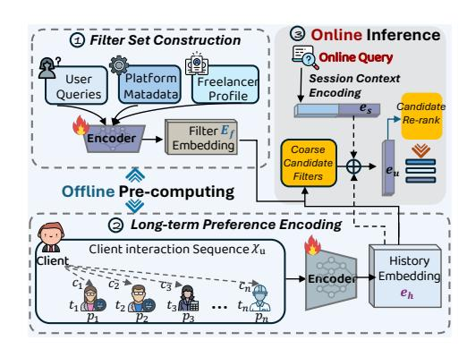
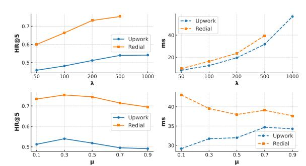

# FilterRec: An Intent-Aware Framework for Dynamic Filter Recommendation

Dingxian Wang\* Jiacheng Dong Jiaqi Deng Jing Long† dingxianwang@upwork.com jiacheng.dong@student.uts.edu.au jiaqi.deng@student.uts.edu.au jing.long@uts.edu.au University of Technology Sydney Sydney, Australia

Ted Liu George Barelas Arya Taylor Spyros Kapnissis Frank Yang Andrew Rabinovich tedliu@upwork.com barelas@cloud.upwork.com aryataylor@upwork.com spyroskapnissis@cloud.upwork.com frankyang@upwork.com andrewrabinovich@upwork.com Upwork Inc. Palo Alto, United States

Guandong Xu† gdxu@eduhk.hk The Education University of Hong Kong Hong Kong, China

## Abstract

Modern online marketplaces rely heavily on filtering mechanisms to help users navigate vast candidate pools efficiently. However, conventional predefined filters are unable to adapt to diverse user intents, often leading to irrelevant results and inefficient search experiences. To address this limitation, we propose FilterRec, an intent-aware filter generation framework that dynamically constructs and recommends personalized filters based on user queries, profiles, and behavioral contexts. FilterRec transforms filtering from a fixed, one-size-fits-all interface into an adaptive, contextsensitive process that enhances both accuracy and user control. The framework adopts a two-stage architecture that combines offline pre-computation for efficiency with online refinement for personalization. This design captures both long-term preferences and short-term intent while maintaining low latency for large-scale deployment. Extensive experiments on a large-scale freelancing marketplace demonstrate that FilterRec significantly improves search efficiency, recommendation accuracy, and overall user satisfaction.

## CCS Concepts

• Information systems → Recommender systems.

## Keywords

Dynamic Filter Recommendation; Online Labor Marketplace

### ACM Reference Format:

Dingxian Wang\*, Jiacheng Dong, Jiaqi Deng, Jing Long† , Ted Liu, George Barelas, Arya Taylor, Spyros Kapnissis, Frank Yang, Andrew Rabinovich,

© 2026 Copyright held by the owner/author(s). ACM ISBN 979-8-4007-2307-0/2026/04 <https://doi.org/10.1145/3774904.3792892>

and Guandong Xu† . 2026. FilterRec: An Intent-Aware Framework for Dynamic Filter Recommendation. In Proceedings of the ACM Web Conference 2026 (WWW '26), April 13–17, 2026, Dubai, United Arab Emirates. ACM, New York, NY, USA, [4](#page-3-0) pages.<https://doi.org/10.1145/3774904.3792892>

## 1 Introduction

Modern online marketplaces and recommendation platforms rely heavily on filters to help users efficiently navigate large candidate sets and reach relevant results. Beyond narrowing options, filters enable users to actively steer the recommendation process, aligning results more closely with their intent, therefore enhancing the interactions between users and the systems. This refined user-system interaction often yields greater accuracy and efficiency than item-level ranking alone, ultimately enabling more effective and satisfying search and recommendation experiences.

Existing filtering mechanisms on most platforms are static and manually predefined. For example, an e-commerce site may always provide the fixed set of filters such as brand or color, and a freelancing marketplace may list general categories like web development or graphic design. Although easy to implement, these static filters suffer from several limitations. In detail, they cannot adapt to diverse user intents, often expose irrelevant or overly broad options, and fail to highlight contextually important attributes that could better guide users decisions. This mismatch between fixed filters and dynamic user needs leads to longer search sessions, higher abandonment rates, and lost opportunities for conversion.

To this end, we propose FilterRec, an intent-aware filter generation framework that automatically constructs and recommends the most relevant filters based on the user's current query, profile, and behavioral context. The goal is to transform filtering from a static, one-size-fits-all mechanism into a personalized and adaptive process that directly enhances both efficiency and accuracy in user-system interaction. This framework is developed based on the business needs of Upwork, one of the world's largest freelancing marketplaces that connects millions of clients and freelancers across domains. In Upwork's search and recommendation pipeline, our

\*Also with Upwork Inc..

†Corresponding author.

[This work is licensed under a Creative Commons Attribution 4.0 International License.](https://creativecommons.org/licenses/by/4.0) WWW '26, Dubai, United Arab Emirates

Figure 1: The framework of the proposed FilterRec.

focus is on the client-side freelancer discovery process. By dynamically generating filters aligned with client intent, , FilterRec enables users to better articulate their needs and quickly narrow down large and heterogeneous candidate pools to qualified freelancers.

However, implementing such a framework is non-trivial due to two practical challenges. On one hand, capturing user intent is inherently complex [\[1](#page-3-1)[–3\]](#page-3-2). A client's goals emerge from long-term behavior, recent searches, and in-session interactions, requiring models to reason over heterogeneous signals to deliver the most relevant recommendations in the moment. Although large language models [\[6,](#page-3-3) [8\]](#page-3-4) can effectively interpret user intent, their computational cost and latency make them unsuitable for large-scale productions. FilterRec solves these challenges via a two-stage design that shifts heavy computation to the offline stage while keeping online scoring lightweight. In the offline stage, we construct a comprehensive filter set, encode long-term interaction sequences using a Transformer [\[7\]](#page-3-5), and pre-compute user-filter candidates. During online inference, a session embedding is formed from the current query and selected filters to re-rank the candidates, aligning immediate intent with stable long-term preferences under strict latency constraints. This design effectively captures user intent across temporal scales while meeting real-time requirements in production. The main contributions of this work are as follows.

- We propose FilterRec, an intent-aware framework that transforms static filtering into a personalized and adaptive recommendation process for online marketplaces.
- To balance accuracy and efficiency, FilterRec employs a two-stage design that pre-computes long-term user-filter matches offline and refines them online with session-specific signals.
- Extensive experiments on Upwork show that FilterRec significantly enhances both interaction efficiency and recommendation accuracy compared with static filtering methods.

## 2 Problem Definition

Let U, I, and F denote the sets of clients, freelancers, and filters respectively. A client �� ∈ U refers to a user who searches for and interacts with suitable freelancers. A freelancer �� ∈ I represents a candidate professional on the platform, characterized by profile attributes such as skills, hourly rate, and location. A filter �� ∈ F corresponds to a selectable constraint (e.g., skill tag, price range, availability) used to refine the freelancer pool. Each client is associated

with a historical interaction sequence X�� = {��1, ��2, . . . , ���� } that records past activities (e.g., clicks or hires), where each interaction �� is linked to a timestamp ���� and an activity type ���� . During an active search session, the client's session context is defined as S�� = {����, ��1, ��2, . . .}, where ���� is the issued query and {��1, ��2, . . .} are the filters already selected in the session. Given the historical interaction sequence X�� and the session context S��, the task is to generate a ranked subset of filters F ∗ ⊆ F that best capture the client's current intent and enhance search efficiency.

## 3 Method

FilterRec is an intent-aware dynamic filter recommendation framework with a clear separation between the offline stage and the online stage. In the offline stage, (1) Filter Set Construction builds a comprehensive repository of filters and their embeddings from platform metadata, freelancer profiles, and user queries; (2) Longterm Preference Encoding models historical client interactions with a Transformer to capture stable preferences; and (3) Coarse Candidate Generation pre-computes user-filter relevance to form an efficient candidate pool. In the online stage, (4) Session Context Encoding forms a real-time representation from the client's current query and already selected filters, and (5) Candidate Re-ranking refines the offline candidates to align with short-term intent under strict latency constraints. Finally, (6) End-to-End Training jointly optimizes all components to ensure consistency between offline and online representations.

## 3.1 Filter Set Construction

To enable FilterRec to capture the diversity of user intents or freelancer expertise and recommend intent-aware filters, we first construct a unified filter set F by integrating and processing multiple sources of information. Specifically, the filter set is derived from three complementary sources: (1) Existing platform filters, such as job categories and freelancer availability, to serve as the baseline set of constraints; (2) User queries, where we extract frequent keywords that reflect client demand but may not be covered in the predefined filters (e.g., emerging technologies or niche domains); (3) Freelancer profiles, particularly skills, certifications, and selfreported expertise, which provide fine-grained attributes that can enhance filter diversity and align with supply-side information.

Additionally, the constructed filters undergo systematic cleaning and normalization, where redundant entries are removed, noisy or semantically meaningless terms are discarded, and complex expressions are simplified into concise and consistent forms. The resulting filter set is both compact and expressive, covering diverse user intents while remaining interpretable. Each filter �� ∈ F is then embedded into a continuous vector space through a trainable embedding matrix E�� ∈ R | F |×�� , initialized from textual or categorical features and updated during end-to-end training. This representation serves as the foundation for both offline candidate generation and online re-ranking, ensuring semantic alignment between filters and user representations.

## 3.2 Long-term Preference Encoding

Long-term interaction histories capture enduring client preferences but are heterogeneous and temporally dispersed, so we encode them into latent representations to extract compact and learnable longterm patterns. Formally, each client �� has an interaction sequence X��, where each element ���� is associated with a freelancer ���� , a timestamp ���� , and an activity type ���� ∈ {click, hire}. Since clicks and hires carry different semantic implications where clicks indicate exploration while hires provide stronger evidence of commitment, it is necessary to explicitly distinguish them in the modeling process. We represent each interaction ���� with a composite embedding:

e���� = e���� + e���� + e���� , (1)

where e���� is the embedding of the freelancer involved in the interaction, e���� is the embedding of the activity type (click vs. hire), and e���� encodes temporal information. The sequence embedding [e��1 , e��2 , . . . , e���� ] is then fed into a Transformer encoder, which captures both temporal dependencies and higher-order interactions and produceseℎ ∈ R �� , which represents the stable intent of client ��, and is later aligned with filter embeddings to support coarse candidate generation during the offline stage.

## 3.3 Coarse Candidate Generation

Given the encoded long-term preference vector eℎ, the next step is to pre-compute a coarse candidate set of filters for each client. The goal is to substantially reduce online computation by narrowing the search space while retaining sufficient coverage of relevant filters. To measure the relevance between a filter and the client ��, we compare the preference embedding eℎ ∈ R �� with the filter embedding matrix E�� ∈ R | F |×�� and calculate a relevance score �� = E�� eℎ ∈ R | F | ,. We then select the top-�� filters with the highest scores as the coarse candidate set F �� , where �� is a hyperparameter which controls the candidate size.

## 3.4 Session Context Encoding

While long-term histories capture stable preferences, they are insufficient to reflect a client's immediate intent in an ongoing search session. To complement the offline stage, we encode the session context, which consists of the current query ���� and the set of already selected filters F ������ . This representation provides real-time signals that guide the refinement of the coarse candidate set. Specifically, we first retrieve the most relevant filter from the filter set F by computing similarity between the textual query ���� and filter descriptions. The retrieved filter embeddings are then used as the query representation e���� . For the selected filters, we directly retrieve their embeddings from the filter embedding matrix E�� , and aggregate them into a single vector using mean pooling:

e�� = Mean({e�� : �� ∈ F������ }). (2)

The session context representation is then formed by combining the query-induced and the aggregated selected-filter embeddings:

e�� = W�� [e���� ∥ e�� ], (3)

where [·∥·] denotes concatenation and W�� is a projection matrix. The resulting session embedding e�� captures the client's short-term intent in the same embedding space as filters, allowing efficient re-ranking of the coarse candidates during online inference.

Table 1: Dataset statistics.

#### 3.5 Candidate Re-ranking

Given the offline coarse candidate set F �� , the re-ranking stage refines these candidates by integrating both long-term and shortterm user representations. We first fuse the historical sequence embedding eℎ with the session context embedding e�� to obtain the final user representation:

e�� = ��eℎ + (1 − ��)e�� , (4)

where �� is a hyperparameter which controls the fusion weight. With e��, we compute the relevance score between the user and each candidate filter �� ∈ F�� as ��(�� , ��) = e�� · e�� . Finally, all candidates are sorted according to ��(�� , ��), and the top-�� filters are returned as the final re-ranked results.

## 3.6 End-to-End Training

To make FilterRec effective in practice, all components are trained jointly under a unified objective. The model learns from client interaction logs, where positive filters come from two sources: (1) filters that clients explicitly selected during search, and (2) contractderived filters extracted from freelancers ultimately hired. These provide strong supervisory signals reflecting both expressed and final intent. Negative samples are drawn from unselected filters. The training process updates the filter embeddings together with both long-term and session-level user encoders, ensuring that the two stages-coarse retrieval and fine re-ranking-are optimized cohesively. This unified training enables FilterRec to align filters with user preferences and achieve consistent gains in accuracy and efficiency.

## 4 Experiments Setup and Results

To validate the effectiveness of FilterRec, we conduct experiments to examine whether it outperforms existing baselines (RQ1), how each core component contributes (RQ2), and how robust the model is under different hyperparameter settings (RQ3). For evaluation, we use the proprietary Upwork dataset collected from freelancer discovery logs as the primary industry benchmark and the public Redial [\[4\]](#page-3-6) dataset as a supplementary benchmark for broader validation. Redial is a conversational recommendation dataset that contains both historical user interactions and rich session-level dialogue context. For our experiments, filters are constructed by extracting descriptive attributes from movie-related utterances, enabling a parallel evaluation setting consistent with the Upwork benchmark. Table [1](#page-2-0) summarizes the statistics of the two datasets. We employ two widely used rankings including Hit Ratio (HR@��) which measures whether the ground-truth item appears in the top-�� predictions, and Normalized Discounted Cumulative Gain (NDCG@��) that further emphasizes the ranking quality by assigning higher weights to correct items appearing earlier in the list. For baselines, we compare FilterRec with four representative recommender methods: MF [\[5\]](#page-3-7), LightGCN [\[2\]](#page-3-8), Attention [\[7\]](#page-3-5), and Llama [\[6\]](#page-3-3).

## 4.1 Overall Performance (RQ1)

As shown in Table [2,](#page-3-9) FilterRec achieves the best overall performance across both datasets, outperforming all baseline models in terms of both accuracy and efficiency. Compared with traditional models such as MF and LightGCN, FilterRec shows substantially stronger ability to capture user intent as measured by HR@5 and NDCG@5, demostrating the benefit of joint modeling of long-term and short-term contexts. While the Transformer-based Attention model narrows the gap by leveraging sequential dependencies, it still falls short of FilterRec due to the latter's explicit filter-level reasoning and two-stage optimization. When compared with the LLM-based baseline Llama, FilterRec delivers comparable accuracy but achieves an order-of-magnitude speedup in inference. This result highlights FilterRec's key advantage to preserve the intentawareness of large models while remaining lightweight enough for real-time deployment. Furthermore, the performance differences between the two datasets can be attributed to their structural characteristics. Compared to the smaller Redial dataset, Upwork's larger and more heterogeneous filter space increases modeling complexity which leads to lower absolute metric values.

Table 2: Overall Performance.

| Model     | HR@5   | Upwork NDCG@5 | ms     | HR@5   | Redial NDCG@5 | ms     |
|-----------|--------|---------------|--------|--------|---------------|--------|
| MF        | 0.2315 | 0.1672        | 72.48  | 0.4856 | 0.3699        | 82.38  |
| LightGCN  | 0.3328 | 0.2475        | 129.67 | 0.5830 | 0.4793        | 135.57 |
| Attention | 0.4386 | 0.3498        | 219.54 | 0.6798 | 0.5766        | 234.52 |
| Llama     | 0.5462 | 0.4273        | 368.13 | 0.7512 | 0.6448        | 382.47 |
| FilterRec | 0.5397 | 0.4258        | 31.72  | 0.7534 | 0.6603        | 39.51  |

## 4.2 Ablation Study (RQ2)

To assess the contribution of each core component, we evaluate three ablated variants of FilterRec, as reported in Table [3.](#page-3-10) Removing the candidate retrieval stage (w/o CR) leads to slightly higher accuracy but causes a dramatic increase in latency, showing the efficiency gain brought by the two-stage design. Eliminating the long-term encoder (w/o LE) results in a clear accuracy drop, highlighting the importance of stable historical preferences. In contrast, removing the session encoder (w/o SE) yields the worst performance, indicating that real-time intent signals are indispensable. Overall, both long-term and session-level modeling are complementary, and their joint integration within the two-stage architecture is crucial for achieving FilterRec's performance-efficiency balance.

## 4.3 Hyperparameter Sensitivity (RQ3)

In this section, we examine the robustness of FilterRec with respect to two key hyperparameters including the corase candidate size �� ∈ {50, 100, 200, 500, 1000} and the fusion weight for preference embedding and session embedding �� ∈ {0.1, 0.3, 0.5, 0.7, 0.9}. The results are illustrated in Figure [2,](#page-3-11) where we can observe that increasing �� gradually improves accuracy on both datasets while introducing a moderate increase in inference latency. For the fusion weight ��, both datasets achieve the highest HR@5 at �� = 0.3, and different choices of �� have almost no effect on inference time.

Table 3: Ablation study results.

|           | Variant | HR@5   | Upwork NDCG@5 | ms     | HR@5   | Redial NDCG@5 | ms    |
|-----------|---------|--------|---------------|--------|--------|---------------|-------|
| FilterRec |         | 0.5397 | 0.4258        | 31.72  | 0.7534 | 0.6603        | 39.51 |
| w/o       | CR      | 0.5468 | 0.4312        | 952.37 | 0.7394 | 0.6571        | 38.72 |
| w/o       | LE      | 0.4982 | 0.3860        | 33.11  | 0.7165 | 0.6227        | 38.29 |
| w/o       | SE      | 0.4825 | 0.3714        | 28.96  | 0.6532 | 0.5721        | 35.35 |

Figure 2: Hyperparameter Sensitivity.

## 5 Conclusion

This paper introduces FilterRec, an intent-aware filter generation framework that improves the effectiveness and responsiveness of filtering in large-scale recommendation and search environments. Unlike traditional static filters that remain fixed across all users and contexts, FilterRec dynamically generates filters aligned with each user's current intent, profile, and behavioral signals. Through its two-stage design, which combines offline pre-computation for efficiency with online refinement for personalization, FilterRec achieves a strong balance between accuracy and real-time responsiveness, making it practical for deployment in large-scale marketplaces. Our empirical results validate its effectiveness in improving both the quality and efficiency of user-system interaction.

## References

[1] Tong Chen, Hongzhi Yin, Hongxu Chen, Rui Yan, Quoc Viet Hung Nguyen, and Xue Li. 2019. AIR: Attentional Intention-Aware Recommender Systems. In 2019 IEEE 35th International Conference on Data Engineering (ICDE). 304–315. [2] Xiangnan He, Kuan Deng, Xiang Wang, Yan Li, Yongdong Zhang, and Meng Wang. 2020. Lightgcn: Simplifying and powering graph convolution network for recommendation. In Proceedings of the 43rd International ACM SIGIR conference on research and development in Information Retrieval. 639–648. [3] Dietmar Jannach and Markus Zanker. 2024. A Survey on Intent-aware Recommender Systems. ACM Trans. Recomm. Syst. 3, 2, Article 23 (Dec. 2024), 32 pages. [4] Raymond Li, Samira Ebrahimi Kahou, Hannes Schulz, Vincent Michalski, Laurent Charlin, and Chris Pal. 2018. Towards deep conversational recommendations. Advances in neural information processing systems 31 (2018). [5] Andriy Mnih and Russ R Salakhutdinov. 2007. Probabilistic matrix factorization. Advances in neural information processing systems 20 (2007). [6] Hugo Touvron, Thibaut Lavril, Gautier Izacard, Xavier Martinet, Marie-Anne Lachaux, Timothée Lacroix, Baptiste Rozière, Naman Goyal, Eric Hambro, Faisal Azhar, et al. 2023. Llama: Open and efficient foundation language models. arXiv preprint arXiv:2302.13971 (2023). [7] Ashish Vaswani, Noam Shazeer, Niki Parmar, Jakob Uszkoreit, Llion Jones, Aidan N Gomez, Łukasz Kaiser, and Illia Polosukhin. 2017. Attention is all you need. Advances in neural information processing systems 30 (2017). [8] Yaochen Zhu, Liang Wu, Qi Guo, Liangjie Hong, and Jundong Li. 2024. Collaborative large language model for recommender systems. In Proceedings of the ACM Web Conference 2024. 3162–3172.