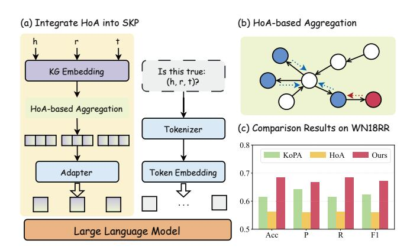
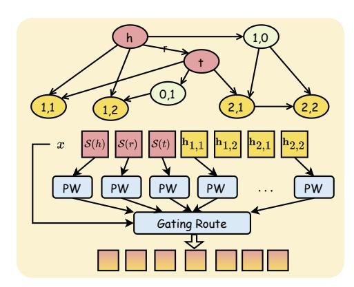
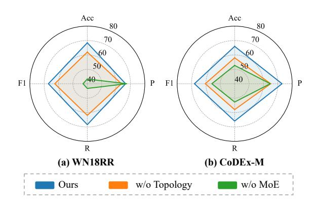

# SIT-KGED: Simply Inject Topology into LLM for Knowledge Graph Error Detection

[Ting Li](https://orcid.org/0009-0009-2105-5602) liting226@mail2.sysu.edu.cn Sun Yat-sen University Guangzhou, China

[Xingyi Mao](https://orcid.org/0009-0005-6916-5967) maoxy23@mail2.sysu.edu.cn Sun Yat-sen University Shenzhen, China

[Yipeng Yu](https://orcid.org/0000-0002-4212-0153) yypzju@163.com Alibaba Inc. Hangzhou, China

[Liang Yao](https://orcid.org/0000-0002-8637-0760)∗ yaoliang3@mail.sysu.edu.cn Sun Yat-sen University Shenzhen, China

# Abstract

Knowledge graphs (KGs) are composed of triples, each consisting of a head entity, a relation, and a tail entity. However, automatically constructed KGs often contain errors or incomplete information. Existing knowledge graph error detection (KGED) methods typically perform triple-level binary classification or triple confidence ranking, which are insufficient for accurately locating the erroneous element within a triple. In this work, we extend KGED to a fourclass classification task to identify which element is incorrect or whether the triple is correct. Directly adapting existing LLM-based methods to this setting yields limited performance, as they fail to effectively exploit the topological information of KGs. To address this issue, we propose a novel topology-injected LLM framework, which precomputes high-order common neighbors between head and tail entities as topological evidence, thereby reducing complexity. Furthermore, we introduce a mixture-of-experts adapter that maps structural and topological evidence into the text embedding space. Experiments on four KG datasets demonstrate that our approach consistently outperforms state-of-the-art triple classification methods. Comprehensive ablation studies further validate the necessity and effectiveness of our proposed modules. Our code is publicly available at [https://github.com/liting1024/SIT-KGED.](https://github.com/liting1024/SIT-KGED)

# CCS Concepts

#### • Computing methodologies → Knowledge representation and reasoning.

# Keywords

Knowledge Graph, Error Detection, Large Language Model

#### ACM Reference Format:

Ting Li, Xingyi Mao, Yipeng Yu, and Liang Yao. 2026. SIT-KGED: Simply Inject Topology into LLM for Knowledge Graph Error Detection. In Proceedings of the ACM Web Conference 2026 (WWW '26), April 13–17,

∗Corresponding author.

[This work is licensed under a Creative Commons Attribution 4.0 International License.](https://creativecommons.org/licenses/by/4.0)

WWW '26, Dubai, United Arab Emirates. © 2026 Copyright held by the owner/author(s). ACM ISBN 979-8-4007-2307-0/2026/04 <https://doi.org/10.1145/3774904.3792894>

2026, Dubai, United Arab Emirates. ACM, New York, NY, USA, [4](#page-3-0) pages. <https://doi.org/10.1145/3774904.3792894>

# 1 Introduction

Knowledge graphs (KGs) are structured representations of knowledge composed of triples, and each triple consists of three elements: head entity, relation, and tail entity. They are widely used in semantic retrieval, relation reasoning, and knowledge integration. In recent years, KGs have been increasingly utilized to provide reliable external knowledge, semantic constraints, and reasoning paths for large language models (LLMs), thereby enhancing their interpretability, reducing hallucinations, and alleviating issues of slow knowledge updates and limited coverage [\[1\]](#page-3-1). However, in realworld applications, KGs are often automatically constructed from large-scale web or document corpora, leading to uneven quality and incompleteness. The resulting noise and erroneous knowledge may mislead downstream retrieval and reasoning tasks. Existing knowledge graph error detection (KGED) research can be broadly categorized into two types. 1) Triple binary classification methods [\[14,](#page-3-2) [19\]](#page-3-3) classify each triple as true or false. 2) Triple confidence ranking methods[\[6,](#page-3-4) [17\]](#page-3-5) typically leverage contrastive learning to rank triples by generating confidence, thereby identifying high-risk triples. However, both types of methods fail to pinpoint the specific erroneous element within a triple, making them insufficient for improving the overall quality of KGs.

In this paper, we formulate the KGED task as a four-class classification problem. The model must not only judge whether a triple is correct, but also pinpoint the specific erroneous element. This more challenging setting demands finer-grained modeling of element. Fortunately, the recent success of LLMs in knowledge graph completion (KGC), attributable to their strong generative capability, has made fine-grained KGED feasible. In particular, KoPA [\[19\]](#page-3-3) integrates structural information from the knowledge graph embedding with contextual semantics from an LLM, it demonstrates that triple binary classification can be achieved while maintaining the LLM's original generative capability.

A natural approach is to extend KoPA directly to the four-class KGED setting. However, its performance remains limited, as shown in Figure [1\(](#page-1-0)c). Our analysis suggests that the structural knowledge prompting (SKP) paradigm [\[18\]](#page-3-6) adopted in KoPA is less effective for fine-grained tasks, but KGED requires identifying the specific erroneous element. SKP relies only on structural evidence and

Figure 1: An attempt to inject topological information into LLM through computing HoA and the comparison results.

overlooks topological information, which restricts its effectiveness. Subsequent studies [\[5,](#page-3-7) [15\]](#page-3-8) have also confirmed the importance of topological information in KGs. Nevertheless, these methods often introduce a large number of trainable parameters or require complex node sampling strategies, leading to unnecessary computational overhead and redundancy. As shown in Figure [1\(](#page-1-0)b), we incorporate high-order adjacency (HoA) to perform neighborhood aggregation [\[11\]](#page-3-9), and combine the resulting topological features with structural features before passing them into the adapter. Interestingly, it results in a performance drop. We attribute this to three factors: 1) multi-hop neighborhoods form large and highly overlapping sets, which can cause over-smoothing and distort the original entity feature distribution; 2) the inherent permutation invariance of GNNs limits their discriminative capacity; 3) high-order adjacency provides entity-level representations, introducing a gap with the triple-level representations required for KGED.

To address the above issues, we propose a novel topology-injection strategy that discards the full-neighborhood aggregation. Instead, we extract high-order common neighbor (CN) features of the head and tail entities, providing more precise evidence for KGED. The structural features of elements and the high-order CN features, are then routed to separate experts, and a learnable gating router activates the most relevant experts to identify the erroneous element. In summary, our contributions are threefold:

- We improve the framework, leveraging LLMs to enable more practical KGED.
- We propose a novel topology-injection strategy that pre-computes high-order CN features and employs the MoE adapter to inject structural and topological information into the LLM.
- Extensive experiments across four datasets demonstrate that our model achieves best performance in most cases, and comprehensive ablation studies further validate the contribution of each module.

# 2 Related Works

In KGC, KG-BERT [\[13\]](#page-3-10) converts knowledge graph triples into text and fine-tunes the pretrained language model BERT for contextual modeling, leveraging its rich semantic and syntactic knowledge to predict the correctness. Subsequently, KG-LLM [\[14\]](#page-3-2) fine-tunes more powerful LLMs, exploiting their strong generalization capability to improve performance. KoPA [\[19\]](#page-3-3) further builds on this line of work by using an adapter to project structural embeddings into the textual embedding space and injecting them as a prefix into the LLM, enabling structure-aware reasoning. In contrast, SuKE [\[15\]](#page-3-8) employs a graph neural network to encode entity and relation representations, which are then injected into the LLM as a prefix to mitigate errors arising from the lack of topological information.

Another line frames KGED as confidence ranking. CAGED [\[17\]](#page-3-5) generates multi-view triple representations and integrates contrastive learning with an error-aware encoder. CCA [\[6\]](#page-3-4) reconstructs triples and aligns textual and topological signals via contrastive learning to detect semantic and adversarial noise. However, the above approaches are unable to explicitly identify the incorrect element. Notably, TTMNM [\[16\]](#page-3-11) localizes erroneous elements via relation-path extraction but overlooks textual information, limiting performance. In contrast, our model integrates structural, topological, and textual information.

#### 3 Methodology

#### 3.1 Preliminary

3.1.1 Knowledge Graph Error. Assuming that each negative triple contains at most one erroneous element, knowledge graph errors are categorized into four types: correct triple, head entity error, relation error, and tail entity error.

3.1.2 Structural Knowledge Prompting Paradigm. To seamlessly inject structural information into the LLM, we first train an embeddingbased model TransE to obtain structural representations S, and concatenate them to construct a structural encoding K for each triple, while the textualized triple is fed to the LLM as contextual input. The resulting structural encoding is subsequently projected into the textual embedding space e through a adapter. Finally, we apply low-rank adaptation (LoRA) for efficient fine-tuning, enabling the LLM to better leverage the injected structural cues for downstream reasoning. Compared with approaches that feed all auxiliary information as textual inputs for in-context learning, SKP avoids the noise caused by excessively long prompt sequences and significantly reduces both algorithmic complexity and computational overhead. This general paradigm can be formulated as follows:

LLM(Adapter(K) ⊕ e; ��),

where K is S (ℎ) ⊕ S (��) ⊕ S (��), �� denotes the trainable parameters.

# 3.2 Injecting Topology by Mixture-of-Experts

The structural information K contains only the structural representations produced by a lightweight knowledge embedding model, thus provides relatively coarse-grained structural signals. To further inject topological evidence into the LLM, we hierarchically partition the neighboring entities of a triple according to their shortest-path distances to the head and tail entities, and aggregate structural features within each distance layer to obtain a more finegrained topological representation. Concretely, we pre-compute the high-order CN between the head and tail entities and perform a training-free feature aggregation, achieving an efficient retrieval of topological evidence.

Figure 2: The overview of topology-injection strategy.

h��,�� (ℎ, ��) = AGG S (��) | �� ∈ N�� (ℎ) ∩ N�� (��) ,

where AGG is a multiplicative operation, N�� (��) denotes the ��-hop neighbors of entity ��.

To align the structural and topological features with the textual embedding space, an adapter is typically required. Mixture-of-Experts (MoE) architectures have proven effective for integrating multi-source representations, consisting of a gating module and multiple experts that dynamically focus on different feature subspaces according to the characteristics of the knowledge graph. We first concatenate the triple-level structural embedding with the extracted topological features.

�� = [S (ℎ), S (��), S (��), h1,1, h1,2, h2,1, h2,2].

Inspired by RSMoE [\[4\]](#page-3-12), we employ multiple simple whitening linear transformations as experts, each focusing on projecting signals from its own perspective into the textual embedding space.

���� = �� (��) �� · (���� − �� (��) ),

where ���� is trainable parameter.

Then, we introduce a gating router to flexibly fuse multi-source representations, and incorporate learnable Gaussian noise to dynamically adjust its scale and enhance the router's discriminability.

�� = softmax �� ·���� + �� ⊙ ��(�� ·����) , �� ∼ Z (0, ��).

#### 4 Experiments

# 4.1 Experimental Setup

Table 1: Statistics of the four datasets.

|           | Dataset | #Ent   | #Rel | #Train  | #Test  | #Dev   |
|-----------|---------|--------|------|---------|--------|--------|
| WN18RR    | [3]     | 40,559 | 11   | 86,835  | 2,924  | 2,824  |
| CoDEx-S   | [7]     | 2,034  | 42   | 32,888  | 1,828  | 1,827  |
| CoDEx-M   | [7]     | 17,050 | 51   | 185,584 | 10,311 | 10,310 |
| FB15k-237 | [10]    | 14,505 | 237  | 272,115 | 20,438 | 17,526 |

4.1.1 Dataset and Baseline Models. We evaluate our method on four datasets, and the statistics are summarized in Table [1.](#page-2-0)

We compare our model with the following two categories of methods: Embedding-based Models. TransE, DistMult, ConvE, RGCN and RotatE are trained on link prediction task and using the PyKEEN[1](#page-2-1) library. Since the code of TTMNM is unavailable, we report its results from the original paper. LM-based Models. For KG-BERT, we follow the original hyperparameter settings. For KG-LLM and KoPA, we adopt Llama3-8B as the backbone and use the same LoRA configurations. CCA [\[6\]](#page-3-4) and CAGED [\[17\]](#page-3-5) are excluded because they assign confidence scores to a entire triple, making them incompatible with our setting.

4.1.2 Implementation Detail. High-quality negatives are essential for fine-grained KGED. Considering the 1-to-1, 1-to-N, and N-to-N mapping patterns, random corruption leads to an imbalanced distribution. Therefore, we adopt Bernoulli negative sampling to generate one relation and one entity negative sample for each triple.

To enable existing link prediction methods to be transferred to the KGED task, we first train each model under the standard link prediction setting to obtain fine-grained representations of entities and relations. We then perform head prediction, relation prediction, and tail prediction, using the ranking position to evaluate the plausibility of each element. An element is deemed potentially incorrect if it is ranked in the lower half of the candidate list.

- If the head, relation, and tail all rank within the top 50%, the triple is classified as triple correct.
- If exactly one element falls into the bottom 50%, that element is labeled as the error source.
- If two or more elements fall into the bottom 50%, we assign the final error category according to the element with the lowest ranking.

We evaluate our model with four metrics: Accuracy, Precision, Recall, and F1-score. To mitigate label imbalance, we compute each metric as a weighted average based on class proportions.

#### 4.2 Overall Results

The overall experimental results are shown in Table [2.](#page-3-16) Among embedding-based methods, TTMNM achieves the best performance by employing three specially designed components that gather sufficient evidence from multi-hop structure, entity enhancement, and relation-path reasoning. TransE achieves moderately lower accuracy but exhibits strong overall stability, as its simple additive translation mechanism ensures that any erroneous element directly disrupts the vector translation. Our model achieves the best performance on all datasets except FB15k-237. In particular, it surpasses the strongest baseline KoPA, demonstrating the effectiveness of our method in accurately identifying erroneous elements.

#### 4.3 Ablation Study

We keep all hyperparameters fixed and conduct ablation studies on WN18RR and CoDEx-M, as shown in Figure [3.](#page-3-17) To assess the impact of topological injection, we remove the topology-injection module and observe a performance drop, demonstrating the necessity of incorporating topological evidence for KGED. We then examine the contribution of the MoE adapter by replacing it with a multilayer perceptron (MLP). It results in a substantial performance drop, indicating that an MLP is struggles to integrate multi-source evidence, thereby validating the effectiveness of the MoE. We further note

1<https://github.com/pykeen/pykeen>

Table 2: The overall experimental results. All values are multiplied by 100 for comparison. The strongest competing method is highlighted with a gray background, and the best performance is bold.

|                 | Model | Acc   | P     | WN18RR R | F1    | Acc   | P     | CoDeX-S R | F1    | Acc   | P     | CoDeX-M R | F1    | Acc   | P     | FB15K-237 R | F1    |
|-----------------|-------|-------|-------|----------|-------|-------|-------|-----------|-------|-------|-------|-----------|-------|-------|-------|-------------|-------|
| TransE          | [2]   | 49.85 | 56.98 | 49.85    | 49.09 | 57.68 | 67.35 | 57.68     | 56.59 | 55.80 | 65.62 | 55.80     | 55.06 | 56.90 | 61.66 | 56.90       | 53.75 |
| DistMult Embed  | [12]  | 35.64 | 34.65 | 35.64    | 33.84 | 42.58 | 35.89 | 42.58     | 36.82 | 41.07 | 34.56 | 41.07     | 35.39 | 40.12 | 34.35 | 40.12       | 34.52 |
| ConvE ding      | [3]   | 43.86 | 43.89 | 43.86    | 42.96 | 53.61 | 62.07 | 53.61     | 52.73 | 49.73 | 61.30 | 49.73     | 49.76 | 55.28 | 60.04 | 55.28       | 53.23 |
| RGCN -based     | [8]   | 48.83 | 49.56 | 48.83    | 46.30 | 55.93 | 63.86 | 55.93     | 53.63 | 56.24 | 68.08 | 56.24     | 55.09 | 50.36 | 47.25 | 50.36       | 46.72 |
| RotatE          | [9]   | 43.01 | 45.29 | 43.01    | 42.58 | 45.06 | 39.83 | 45.06     | 40.76 | 48.51 | 49.05 | 48.51     | 46.01 | 50.36 | 47.25 | 50.36       | 46.72 |
| TTMNM           | [16]  | 53.93 | 45.64 | 55.33    | 45.31 | –     | –     | –         | –     | –     | –     | –         | –     | 89.24 | 88.19 | 88.25       | 88.19 |
| KG-BERT         | [13]  | 53.12 | 47.09 | 53.12    | 42.93 | 50.16 | 37.41 | 50.16     | 39.53 | 50.55 | 34.12 | 50.55     | 39.56 | –     | –     | –           | –     |
| KG-LLM LM-based | [14]  | 27.69 | 15.89 | 27.69    | 19.73 | 33.33 | 11.11 | 33.33     | 16.67 | 26.05 | 13.27 | 26.05     | 17.28 | 24.76 | 14.77 | 24.76       | 17.70 |
| KoPA            | [19]  | 61.48 | 64.22 | 61.48    | 62.25 | 48.50 | 60.55 | 48.50     | 49.62 | 56.76 | 62.99 | 56.76     | 58.61 | 64.89 | 68.53 | 64.89       | 65.63 |
| Ours            |       | 68.42 | 66.64 | 68.42    | 67.08 | 62.31 | 74.70 | 62.31     | 63.36 | 65.93 | 72.95 | 65.93     | 68.00 | 64.29 | 67.65 | 64.29       | 64.37 |

Figure 3: Ablation results across two datasets.

that precision remains consistently high across all settings, indicating that correct triples are already well recognized by existing models and that topological evidence offers marginal benefits.

## 5 Conclusion

In this work, we introduce a novel topology-injection strategy that efficiently injecting topological and structural features into LLMs to enable accurate localization of erroneous elements. The proposed approach can be applied to knowledge credibility verification.

#### Acknowledgments

This work is partially supported by CCF-Tencent Rhino-Bird Open Research Fund (CCF-Tencent RAGR20250107).

# References

[1] Garima Agrawal, Tharindu Kumarage, Zeyad Alghamdi, and Huan Liu. 2024. Can Knowledge Graphs Reduce Hallucinations in LLMs? : A Survey. arXiv preprint arXiv:2311.07914 (2024). [2] Antoine Bordes, Nicolas Usunier, Alberto García-Durán, Jason Weston, and Oksana Yakhnenko. 2013. Translating Embeddings for Modeling Multi-Relational Data. In Advances in Neural Information Processing Systems 26: 27th Annual Conference on Neural Information Processing Systems. 2787–2795. [3] Tim Dettmers, Pasquale Minervini, Pontus Stenetorp, and Sebastian Riedel. 2018. Convolutional 2D Knowledge Graph Embeddings. Proceedings of the AAAI Conference on Artificial Intelligence 32, 1 (2018). Multimedia. 233–242.

[4] Yupeng Hou, Shanlei Mu, Wayne Xin Zhao, Yaliang Li, Bolin Ding, and Ji-Rong Wen. 2022. Towards Universal Sequence Representation Learning for Recommender Systems. In Proceedings of the 28th ACM SIGKDD Conference on Knowledge Discovery and Data Mining. 585–593. [5] Qika Lin, Tianzhe Zhao, Kai He, Zhen Peng, Fangzhi Xu, Ling Huang, Jingying Ma, and Mengling Feng. 2025. Self-Supervised Quantized Representation for Seamlessly Integrating Knowledge Graphs with Large Language Models. In Proceedings of the 63rd Annual Meeting of the Association for Computational Linguistics (Volume 1: Long Papers). 13587–13602. [6] Xiangyu Liu, Yang Liu, and Wei Hu. 2024. Knowledge Graph Error Detection with Contrastive Confidence Adaption. In Proceedings of the AAAI Conference on Artificial Intelligence, Vol. 38. 8824–8831. [7] Tara Safavi and Danai Koutra. 2020. CoDEx: A Comprehensive Knowledge Graph Completion Benchmark. In Proceedings of the 2020 Conference on Empirical Methods in Natural Language Processing. 8328–8350. [8] Michael Schlichtkrull, Thomas N Kipf, Peter Bloem, Rianne Van Den Berg, Ivan Titov, and Max Welling. 2018. Modeling Relational Data with Graph Convolutional Networks. In European Semantic Web Conference. 593–607. [9] Zhiqing Sun, Zhi-Hong Deng, Jian-Yun Nie, and Jian Tang. 2019. RotatE: Knowledge Graph Embedding by Relational Rotation in Complex Space. In Proceedings of the 7th International Conference on Learning Representations. [10] Kristina Toutanova, Danqi Chen, Patrick Pantel, Hoifung Poon, Pallavi Choudhury, and Michael Gamon. 2015. Representing Text for Joint Embedding of Text and Knowledge Bases. In Proceedings of the 2015 Conference on Empirical Methods in Natural Language Processing. 1499–1509. [11] Felix Wu, Amauri Souza, Tianyi Zhang, Christopher Fifty, Tao Yu, and Kilian Weinberger. 2019. Simplifying Graph Convolutional Networks. In Proceedings of the 36th International Conference on Machine Learning. 6861–6871. [12] Bishan Yang, Wen-tau Yih, Xiaodong He, Jianfeng Gao, and Li Deng. 2015. Embedding Entities and Relations for Learning and Inference in Knowledge Bases. arXiv preprint arXiv:1412.6575 (2015). [13] Liang Yao, Chengsheng Mao, and Yuan Luo. 2019. KG-BERT: BERT for Knowledge Graph Completion. arXiv preprint arXiv:1909.03193 (2019). [14] Liang Yao, Jiazhen Peng, Chengsheng Mao, and Yuan Luo. 2025. Exploring Large Language Models for Knowledge Graph Completion. In Proceedings of the 2025 IEEE International Conference on Acoustics, Speech and Signal Processing. 1–5. [15] Yunhai Ye and Shuo Wang. 2025. SuKE: Structural Knowledge Extractor Enhances Large Language Model for Knowledge Graph Completion. Expert Systems with Applications (2025), 129199. [16] Geng Zhang, Yu-Jie Xiong, Jian-Peng Hu, and Chun-Ming Xia. 2025. Triplet Trustworthiness Validation with Knowledge Graph Reasoning. Engineering Applications of Artificial Intelligence 141 (2025), 109813. [17] Qinggang Zhang, Junnan Dong, Keyu Duan, Xiao Huang, Yezi Liu, and Linchuan Xu. 2022. Contrastive Knowledge Graph Error Detection. In Proceedings of the 31st ACM International Conference on Information & Knowledge Management. 2590–2599. [18] Yichi Zhang, Zhuo Chen, Lingbing Guo, Yajing Xu, Shaokai Chen, Mengshu Sun, Binbin Hu, Zhiqiang Zhang, Lei Liang, Wen Zhang, and Huajun Chen. 2024. Have We Designed Generalizable Structural Knowledge Promptings? Systematic Evaluation and Rethinking. arXiv preprint arXiv:2501.00244 (2024). [19] Yichi Zhang, Zhuo Chen, Lingbing Guo, Yajing Xu, Wen Zhang, and Huajun Chen. 2024. Making Large Language Models Perform Better in Knowledge Graph Completion. In Proceedings of the 32nd ACM International Conference on