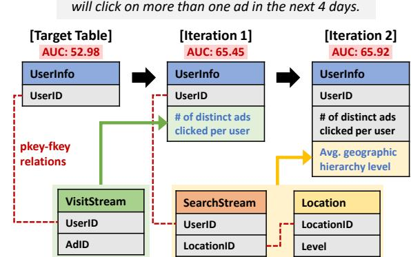
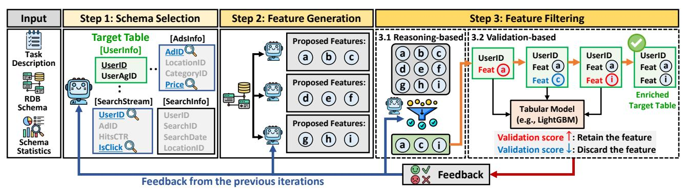
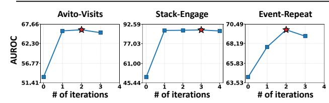
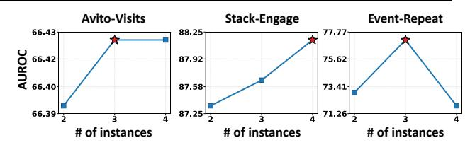

# ReFuGe: Feature Generation for Prediction Tasks on Relational Databases with LLM Agents

[Kyungho Kim](https://orcid.org/0009-0008-8304-9585) KAIST Seoul, Republic of Korea kkyungho@kaist.ac.kr

[Geon Lee](https://orcid.org/0000-0001-6339-9758) KAIST Seoul, Republic of Korea geonlee0325@kaist.ac.kr

[Juyeon Kim](https://orcid.org/0009-0003-6102-6589) KAIST Seoul, Republic of Korea juyeonkim@kaist.ac.kr

[Dongwon Choi](https://orcid.org/0009-0004-6693-6845) KAIST Seoul, Republic of Korea cookie000215@kaist.ac.kr

[Shinhwan Kang](https://orcid.org/0000-0001-6434-1347) KAIST Seoul, Republic of Korea shinhwan.kang@kaist.ac.kr

[Kijung Shin](https://orcid.org/0000-0002-2872-1526) KAIST Seoul, Republic of Korea kijungs@kaist.ac.kr

#### Abstract

Relational databases (RDBs) play a crucial role in many real-world web applications, supporting data management across multiple interconnected tables. Beyond typical retrieval-oriented tasks, prediction tasks on RDBs have recently gained attention. In this work, we address this problem by generating informative relational features that enhance predictive performance. However, generating such features is challenging: it requires reasoning over complex schemas and exploring a combinatorially large feature space, all without explicit supervision. To address these challenges, we propose ReFuGe, an agentic framework that leverages specialized large language model agents: (1) a schema selection agent identifies the tables and columns relevant to the task, (2) a feature generation agent produces diverse candidate features from the selected schema, and (3) a feature filtering agent evaluates and retains promising features through reasoning-based and validation-based filtering. It operates within an iterative feedback loop until performance converges. Experiments on RDB benchmarks demonstrate that ReFuGe substantially improves performance on various RDB prediction tasks. Our code and datasets are available at [https://github.com/K-Kyungho/REFUGE.](https://github.com/K-Kyungho/REFUGE)

## CCS Concepts

• Information systems → Relational database model.

## Keywords

Relational Database, Feature Generation, Large Language Models

#### ACM Reference Format:

Kyungho Kim, Geon Lee, Juyeon Kim, Dongwon Choi, Shinhwan Kang, and Kijung Shin. 2026. ReFuGe: Feature Generation for Prediction Tasks on Relational Databases with LLM Agents. In Proceedings of the ACM Web Conference 2026 (WWW '26), April 13–17, 2026, Dubai, United Arab Emirates. ACM, New York, NY, USA, [4](#page-3-0) pages.<https://doi.org/10.1145/3774904.3792895>

### 1 Introduction & Related Works

Relational databases (RDBs) are widely used across various web applications, such as online retail platforms, social networking

[This work is licensed under a Creative Commons Attribution 4.0 International License.](https://creativecommons.org/licenses/by/4.0)

WWW '26, Dubai, United Arab Emirates © 2026 Copyright held by the owner/author(s). ACM ISBN 979-8-4007-2307-0/2026/04 <https://doi.org/10.1145/3774904.3792895>

**Prediction Task:** *Predict whether each customer* 

Figure 1: An example of feature generation by ReFuGe across iterations. ReFuGe iteratively generates and appends relational features to the target table.

services, and forum platforms. Over the years, research on RDBs has made significant progress in retrieval-oriented tasks, whose goal is to generate queries that extract relevant information [\[10,](#page-3-1) [11,](#page-3-2) [15\]](#page-3-3). More recently, this scope has expanded to prediction tasks (e.g., classification), aiming to exploit the relational structure of the RDB to improve downstream predictive performance [\[5–](#page-3-4)[8,](#page-3-5) [17,](#page-3-6) [18\]](#page-3-7).

A practical and effective approach for enabling prediction on RDBs is to generate features that capture predictive signals distributed across related tables [\[14\]](#page-3-8). For example, a customer table can be enriched with aggregated purchase statistics, recent transaction counts, or attributes of associated accounts obtained from other tables. With this enriched table containing generated features, standard tabular learning methods [\[4,](#page-3-9) [12\]](#page-3-10) can be applied directly.

However, automating effective feature generation in RDBs presents several challenges. First, it requires understanding and extracting predictive signals from the relational structure (C1). Second, the space of potential features is extremely large, due to the many ways in which tables can be transformed or combined (C2). Third, feature generation lacks ground-truth supervision, making direct supervised learning infeasible, unlike retrieval tasks (e.g., text-to-SQL) where ground-truth queries are available (C3).

To address these challenges, we propose ReFuGe (RElational FeatUre GEneration), an agentic framework that leverages the reasoning capabilities of LLMs. To address (C1), we introduce a

Figure 2: Overview of ReFuGe. Through (1) schema selection, (2) feature generation, and (3) feature filtering, each performed by a specialized LLM agent. ReFuGe iteratively generates relational features that enrich the target table and improve performance on RDB prediction tasks. At each iteration, feedback is generated and passed to the agents to guide their next rounds.

schema selection agent that identifies the tables and columns in the RDB that provide the relational information most relevant to the prediction task. For (C2), we employ multiple feature generation agents that produce meaningful candidate features for the prediction table by leveraging domain knowledge and an understanding of the relational context. The resulting candidate features are then selectively added to the table through reasoning-based and validation-based filtering steps. Finally, to address (C3), we adopt an iterative self-improvement mechanism that allows agents to refine schema selection and generate features without the ground-truth supervision. As shown in Figure [1,](#page-0-0) ReFuGe progressively generates new features by leveraging information from multiple tables, leading to consistent improvements in validation AUROC over iterations. Experiments on multiple RDBs demonstrate the effectiveness of ReFuGe in improving predictive performance.

Our key contributions are summarized as follows:

- New Problem. We introduce a new problem of generating features for prediction tasks on RDBs.
- Agentic Framework. We propose ReFuGe, an effective LLMbased agentic framework for feature generation in RDBs.
- Empirical Validation. We show that ReFuGe outperforms stateof-the-art competitors across seven datasets and eleven tasks.

#### 2 Task Formulation

We are given a relational database R = {T1, T2, . . . , T| R | }, where each table T�� ∈ R contains a set of entities (i.e., rows) and is connected to other tables through primary–foreign key relationships. Informally, we assume that each table is a heterogeneous feature matrix T�� ∈ F ���� ×���� , where ���� and ���� denote the numbers of entities and features, respectively, and F denotes the space of admissible data types (e.g., numerical, categorical).

We consider a prediction task (e.g., classification) defined on the target entities of a designated target entity table T★ ∈ R. Our goal is to generate additional features of T★ by leveraging its relational context within the full relational database R. The generated features are then concatenated with the original attributes of T★ and used to train a tabular model (e.g., LightGBM [\[12\]](#page-3-10)).

# 3 Proposed Framework

We propose ReFuGe, an agentic framework that generates relational features for prediction tasks on RDB (Figure [2\)](#page-1-0). ReFuGe is composed of three specialized LLM agents: (1) a schema selection agent, (2) a feature generation agent, and (3) a feature filtering agent. These agents operate within an iterative feedback loop, progressively generating and refining features over iterations. Detailed input prompts for every step are provided in Appendix [\[1\]](#page-3-11).

Step 1: Schema Selection. As an initial step, the schema selection agent determines where features should be generated from. The agent receives the RDB schema information, including tables, their column names, column types, and primary-foreign key relationships, along with the task description. Using this information, it leverages its reasoning capabilities to identify the subset of tables and columns that are relevant to the prediction task, while filtering out those that are not. This step effectively reduces the search space from which features are generated in subsequent steps.

Step 2: Feature Generation. Next, the feature generation agent produces candidate features over the selected schema. Even after reducing the schema, the number of possible relational features remains exponentially large, with only a few of them likely to be useful. To address this, the agent leverages its reasoning capabilities to propose features that are potentially informative and likely to improve predictive performance. To encourage diversity in the generated features, the agent employs multiple LLM instances,[1](#page-1-1) each of which generates a potentially distinct set of candidate features. These features are then aggregated into a unified feature pool.

Step 3: Feature Filtering. Given the set of candidate features generated in Step 2, the feature filtering agent applies a two-stage filtering process to retain only the most promising ones.

- Step 3.1. Reasoning-based Feature Filtering. The agent reviews the candidate features and, based on the task description and schema context, selects a smaller subset that is likely to be beneficial for the task. Importantly, in the first iteration, the agent relies solely on its semantic reasoning over the provided information, whereas from the second iteration, it additionally considers the performance of previously generated features.
- Step 3.2. Validation-based Feature Filtering. Each selected feature is then (temporarily) added to the target table and used to train the tabular learning model (e.g., LightGBM).[2](#page-1-2) If incorporating a feature improves validation performance, it is retained and appended to the target table; otherwise, it is discarded.

1We use the same model, with randomness ensured by a positive temperature. In practice, we sample a subset of the training set rather than the full data for efficiency.

Table 1: (RQ1) Entity classification performance. All metrics are reported in AUROC. The best results are highlighted in bold, and the second-best results are underlined.

| Data Method     | & Task ↓ | → visits | rel-avito clicks | engage | rel-stack badge | dnf   | rel-f1 top3 | repeat | rel-event ignore | rel-trial outcome | rel-hm churn | rel-amazon churn | AUROC | Average Rank |
|-----------------|----------|----------|------------------|--------|-----------------|-------|-------------|--------|------------------|-------------------|--------------|------------------|-------|--------------|
| LightGBM Single | [12]     | 53.05    | 53.60            | 63.39  | 63.43           | 68.56 | 73.92       | 68.04  | 79.93            | 70.09             | 55.21        | 52.22            | 63.77 | 6.8          |
| XGBoost Table   | [4]      | 53.67    | 54.59            | 54.78  | 61.98           | 65.32 | 70.08       | 56.85  | 74.25            | 71.21             | 55.46        | 59.06            | 61.57 | 7.5          |
| FeatLLM         | [9]      | 51.15    | 48.69            | 42.56  |                 | 70.43 | 52.72       | 46.67  | 47.88            | 57.35             |              | 55.11            | 52.51 | 8.7          |
| ICL [20]        |          | 60.28    | 61.32            | 81.01  | 71.13           | 65.81 | 88.47       | 76.38  | 78.55            | 55.72             | 64.34        | 60.56            | 69.42 | 4.7          |
| Rel-LLM         | [19]     | 56.17    | 62.28            | 69.46  | 62.12           | 71.84 | 70.64       | 68.12  | 61.32            | 59.02             | 55.95        | 60.07            | 63.36 | 6.0          |
| RT-Gemma        | [16]     | 62.70    | 59.80            | 78.00  | 80.00           | 75.80 | 91.40       |        |                  | 57.20             | 48.70        | 50.50            | 67.12 | 5.9          |
| GPT RDB         | [2]      | 65.21    | 58.04            | 83.82  | 80.21           | 65.16 | 77.04       | 71.26  | 76.41            | 72.94             | 55.50        | 63.72            | 69.94 | 4.3          |
| Claude          | [3]      | 64.90    | 60.90            | 80.36  | 80.37           | 54.99 | 79.74       | 66.39  | 76.20            | 68.27             | 67.64        | 64.66            | 69.49 | 4.7          |
| LLM-CoT         | [13]     | 64.89    | 60.19            | 82.30  | 80.97           | 61.41 | 75.92       | 70.13  | 82.58            | 68.03             | 68.06        | 64.42            | 70.81 | 4.2          |
| ReFuGe          | (Ours)   | 66.43    | 63.20            | 87.66  | 83.80           | 76.26 | 83.04       | 77.14  | 83.40            | 72.22             | 68.10        | 67.00            | 75.30 | 1.3          |

Notably, the two filtering stages complement each other. Reasoningbased filtering narrows the search space based on semantic reasoning, while validation-based filtering evaluates the empirical utility of each feature. Together, they ensure that the final features are both semantically meaningful and empirically effective.

Iterative Feedback Loop. ReFuGe iteratively repeats Steps 1 - 3 until no additional features are selected. During this iterative loop, ReFuGe is designed to self-improve based on the outcomes of previous iterations. Specifically, at the end of the filtering step, it generates natural language feedback summarizing how each evaluated feature affected performance, e.g., "[Ad View Diversity] increased validation AUROC from 65.06 to 66.30". or "[Direct Search Ratio] caused validation AUROC to drop from 66.68 to 66.40". This feedback is then provided as input to each agent as a reference for guiding decisions in the subsequent iterations. Feedback is accumulated across iterations, enabling the agents to self-learn which directions are promising and which should be avoided.

### 4 Experiments

In this section, we examine the following five research questions:

- RQ1. Performance comparison. How accurate is ReFuGe compared to existing baseline methods on RDB prediction tasks?
- RQ2. Ablation study. Do key components of ReFuGe contribute to its overall performance?
- RQ3. Effect of iteration with feedback. Does ReFuGe's performance improve through its feedback-driven iterative loop?
- RQ4. Case study. What features does ReFuGe generate?
- RQ5. Parameter analysis. How does the number of LLM instances in the feature generation agent impact performance?

## 4.1 Experimental Settings

We provide full details regarding the experimental settings in [\[1\]](#page-3-11). Datasets. We conduct experiments on seven real-world RDB benchmark datasets [\[17\]](#page-3-6), spanning diverse domains.

Baselines. We compare ReFuGe against both single-table and RDB methods. Single-table methods include (i) machine learning models [\[4,](#page-3-9) [12\]](#page-3-10) and (ii) an LLM-based model [\[9\]](#page-3-12). These methods rely solely on the attributes of the target table and do not incorporate relational information. RDB methods include (iii) LLM-as-predictor approaches, where the LLM directly makes predictions using data

joined from the RDB [\[16,](#page-3-15) [19,](#page-3-14) [20\]](#page-3-13) and (iv) LLM-as-generator approaches, where a single LLM instance directly generates relational features using the same inputs as ReFuGe, but without schema selection, feature filtering, or a feedback loop [\[2,](#page-3-16) [3,](#page-3-17) [13\]](#page-3-18). These methods leverage information from the RDBs.

### 4.2 Experimental Results

(RQ1) Performance comparison. As shown in Table [1,](#page-2-0) ReFuGe outperforms all baselines in 9 out of 11 tasks and achieves the best average performance and average rank overall. These results suggest that LLMs can effectively understand the relational structure of RDBs and generate informative features for prediction tasks. Notably, ReFuGe performs best not only on RDBs with simple schemas (e.g., rel-amazon and rel-hm with 3 tables and 2 primary–foreign key relations) but also on those with more complex schemas (e.g., rel-stack with 7 tables with 12 primary–foreign key relations), demonstrating its applicability across varying schema complexities. (RQ2) Ablation study. To examine the effectiveness of the key components of ReFuGe, we consider three variants:

- ReFuGe-SS: Skips the schema selection step (step 2) and generates features directly from the full RDB schema.
- ReFuGe-FF: Replaces the reasoning-based feature filtering (step 3.1) with random selection of candidate features.
- ReFuGe-FB: Does not incorporate feedback during iterations.

As shown in Table [2,](#page-3-19) ReFuGe outperforms all of its variants in 7 out of 11 cases, and achieves the best average rank. Notably, ReFuGe-FF causes the largest performance drop, indicating the importance of reasoning over generated features and selecting the most promising ones. ReFuGe-FB results in the second-largest drop, indicating that performance signals from earlier iterations provide meaningful guidance for subsequent feature generation.

(RQ3) Effect of iteration with feedback. As shown in Figure [3,](#page-3-20) the evaluation performance of ReFuGe generally improves over iterations, demonstrating the effectiveness of its feedback-driven iterative loop. Iteration stops when no additional feature is selected, and ReFuGe performs an average of 2.4 iterations across all tasks. (RQ4) Case study. In Figure [1,](#page-0-0) we present a case study on the rel-avito dataset for the user-clicks task, which predicts whether each user in the target table will click on more than one advertisement in the next 4 days. ReFuGe first derives a feature capturing

Table 2: (RQ2) Effectiveness of the key components of ReFuGe. The best performance is highlighted in bold, and the second-best performance is underlined.

| Data & Method ↓ | Task → visits | rel-avito clicks | engage | rel-stack badge | dnf   | rel-f1 top3 | repeat | rel-event ignore | rel-trial outcome | rel-hm churn | rel-amazon churn | AUROC | Average Rank |
|-----------------|---------------|------------------|--------|-----------------|-------|-------------|--------|------------------|-------------------|--------------|------------------|-------|--------------|
| ReFuGe-SS       | 66.61         | 60.15            | 82.70  | 83.89           | 73.37 | 79.46       | 73.34  | 88.36            | 72.19             | 68.04        | 63.40            | 73.77 | 2.3          |
| ReFuGe-FF       | 66.56         | 58.25            | 88.51  | 82.17           | 62.42 | 62.20       | 70.62  | 82.47            | 71.00             | 68.04        | 63.94            | 70.56 | 3.0          |
| ReFuGe-FB       | 66.43         | 61.21            | 87.61  | 63.41           | 62.40 | 81.32       | 68.00  | 83.35            | 71.65             | 67.92        | 66.39            | 70.88 | 3.1          |
| ReFuGe          | 66.43         | 63.20            | 87.66  | 83.80           | 76.26 | 83.04       | 77.14  | 83.40            | 72.22             | 68.10        | 67.00            | 75.30 | 1.5          |

Figure 3: (RQ3) Evaluation performance tends to improve over iterations across all three tasks. The ★ indicates the best validation performance over the iterations.

the number of distinct ads clicked per user by using the VisitStream table, yielding a substantial performance gain. In the next iteration, it adds a feature capturing the average geographic hierarchy level of users' search locations, obtained by joining the SearchStream and Location tables, which further improves performance.

(RQ5) Parameter analysis. As shown in Figure [4,](#page-3-21) we observe that using more LLM instances as the feature generation agent tends to improve performance across three tasks, with few exceptions. It indicates that increasing the diversity of generated candidate features is generally beneficial. In our experiments, we fix the number of instances to three for simplicity and efficiency. Additional parameter analyses are provided in [\[1\]](#page-3-11).

#### 5 Conclusions

In this work, we address prediction on RDBs through the lens of feature generation. We introduce a new problem of generating features for prediction tasks on RDBs (Section [2\)](#page-1-3) and propose ReFuGe, an agentic framework that leverages LLM agents to iteratively generate and refine relational features based on feedback (Section [3\)](#page-1-4). We conduct extensive experiments across multiple RDB benchmark datasets to demonstrate the effectiveness of ReFuGe (Section [4\)](#page-2-1). For future work, we aim to extend our framework to additional downstream tasks, such as regression and link prediction.

Acknowledgements. This work was supported by Institute of Information & Communications Technology Planning & Evaluation (IITP) grant funded by the Korea government (MSIT) (No. RS-2024- 00438638, EntireDB2AI: Foundations and Software for Comprehensive Deep Representation Learning and Prediction on Entire Relational Databases, 60%) (No. RS-2022-II220157, Robust, Fair, Extensible Data-Centric Continual Learning, 30%) (No. RS-2019-II190075, Artificial Intelligence Graduate School Program (KAIST), 10%).

#### References

[1] 2026. Code, Datasets, and Appendix for ReFuGe. [https://github.com/K-Kyungho/](https://github.com/K-Kyungho/REFUGE) [REFUGE.](https://github.com/K-Kyungho/REFUGE) [2] Josh Achiam, Steven Adler, Sandhini Agarwal, Lama Ahmad, Ilge Akkaya, Florencia Leoni Aleman, Diogo Almeida, Janko Altenschmidt, Sam Altman, Shyamal Anadkat, et al. 2023. Gpt-4 technical report. arXiv:2303.08774 (2023).

Figure 4: (RQ5) Evaluation performance tends to increase as more LLM instances are used as feature-generation agents. The ★ indicates the best test performance.

[3] Anthropic. 2025. Claude 4 Model Card. [https://www.anthropic.com.](https://www.anthropic.com) [4] Tianqi Chen and Carlos Guestrin. 2016. Xgboost: A scalable tree boosting system. In KDD. [5] Tianlang Chen, Charilaos Kanatsoulis, and Jure Leskovec. 2025. RelGNN: Composite Message Passing for Relational Deep Learning. arXiv:2502.06784 (2025). [6] Dongwon Choi, Sunwoo Kim, Juyeon Kim, Kyungho Kim, Geon Lee, Shinhwan Kang, Myunghwan Kim, and Kijung Shin. 2025. RDB2G-Bench: A Comprehensive Benchmark for Automatic Graph Modeling of Relational Databases. In NeurIPS. [7] Vijay Prakash Dwivedi, Charilaos Kanatsoulis, Shenyang Huang, and Jure Leskovec. 2025. Relational Deep Learning: Challenges, Foundations and Next-Generation Architectures. In KDD. [8] Matthias Fey, Weihua Hu, Kexin Huang, Jan Eric Lenssen, Rishabh Ranjan, Joshua Robinson, Rex Ying, Jiaxuan You, and Jure Leskovec. 2024. Relational Deep Learning: Graph Representation Learning on Relational Databases. In ICML. [9] Sungwon Han, Jinsung Yoon, Secran O Arik, and Tomas Pfister. 2024. Large Language Models Can Automatically Engineer Features for Few-Shot Tabular Learning. In ICML. [10] Zijin Hong, Zheng Yuan, Qinggang Zhang, Hao Chen, Junnan Dong, Feiran Huang, and Xiao Huang. 2024. Next-generation database interfaces: A survey of llm-based text-to-sql. arXiv:2406.08426 (2024). [11] George Katsogiannis-Meimarakis and Georgia Koutrika. 2023. A survey on deep learning approaches for text-to-SQL. The VLDB Journal 32, 4 (2023), 905–936. [12] Guolin Ke, Qi Meng, Thomas Finley, Taifeng Wang, Wei Chen, Weidong Ma, Qiwei Ye, and Tie-Yan Liu. 2017. Lightgbm: A highly efficient gradient boosting decision tree. In NeurIPS. [13] Takeshi Kojima, Shixiang Shane Gu, Machel Reid, Yutaka Matsuo, and Yusuke Iwasawa. 2022. Large Language Models are Zero-Shot Reasoners. In NeurIPS. [14] Jiaming Liang, Chuan Lei, Xiao Qin, Jiani Zhang, Asterios Katsifodimos, Christos Faloutsos, and Huzefa Rangwala. 2024. Featnavigator: Automatic feature augmentation on tabular data. arXiv:2406.09534 (2024). [15] Xinyu Liu, Shuyu Shen, Boyan Li, Peixian Ma, Runzhi Jiang, Yuxin Zhang, Ju Fan, Guoliang Li, Nan Tang, and Yuyu Luo. 2024. A Survey of NL2SQL with Large Language Models: Where are we, and where are we going? arXiv:2408.05109 (2024). [16] Rishabh Ranjan, Valter Hudovernik, Mark Znidar, Charilaos Kanatsoulis, Roshan Upendra, Mahmoud Mohammadi, Joe Meyer, Tom Palczewski, Carlos Guestrin, and Jure Leskovec. 2025. Relational Transformer: Toward Zero-Shot Foundation Models for Relational Data. arXiv:2510.06377 (2025). [17] Joshua Robinson, Rishabh Ranjan, Weihua Hu, Kexin Huang, Jiaqi Han, Alejandro Dobles, Matthias Fey, Jan Eric Lenssen, Yiwen Yuan, Zecheng Zhang, et al. 2024. Relbench: A benchmark for deep learning on relational databases. In NeurIPS. [18] Minjie Wang, Quan Gan, David Wipf, Zheng Zhang, Christos Faloutsos, Weinan Zhang, Muhan Zhang, Zhenkun Cai, Jiahang Li, Zunyao Mao, et al. 2024. 4DBInfer: A 4d benchmarking toolbox for graph-centric predictive modeling on RDBs. In NeurIPS. [19] Fang Wu, Vijay Prakash Dwivedi, and Jure Leskovec. 2025. Large Language Models are Good Relational Learners. In ACL. [20] Marek Wydmuch, Lukasz Borchmann, and Filip Gralinski. 2024. Tackling prediction tasks in relational databases with LLMs. arXiv:2411.11829 (2024).