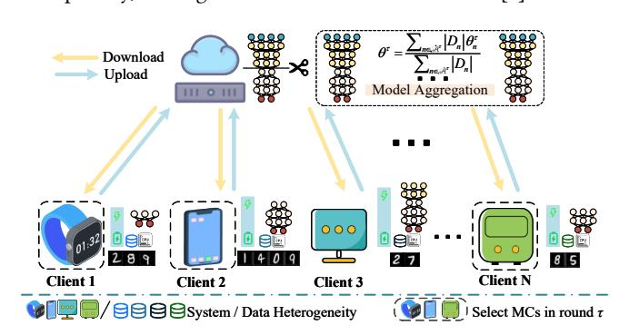
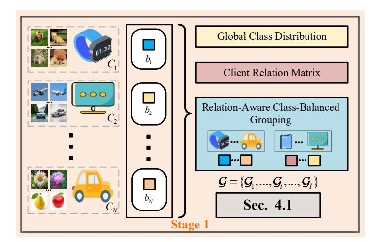
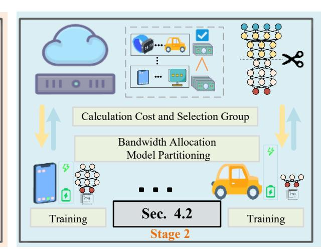
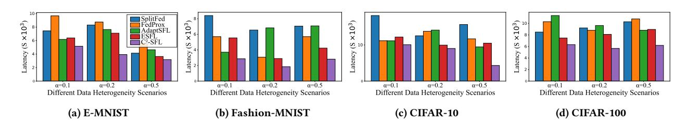
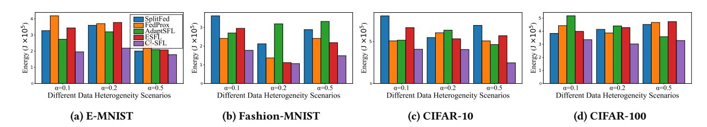

### C 2 -SFL:Class-Balanced and Cost-Aware Split Federated Learning for Mobile Edge Computing

Kai Cheng chengkai@ctgu.edu.cn China Three Gorges University Yichang, China

Zhenyu Zhang zhenyuzhang@stu.ecnu.edu.cn East China Normal University Shanghai, China

Tong Wu wutong.asd@gmail.com Zhejiang Gongshang University Hangzhou, China

Huan Zhou∗ zhouhuan117@gmail.com Northwestern Polytechnical University Xi'an, China

Xinggang Fan∗ xgfan@zjut.edu.cn Zhejiang University of Technology Hangzhou, China

# Abstract

Split Federated Learning (SFL) facilitates collaborative training in Mobile Edge Computing (MEC) by splitting models between clients and servers. However, existing client selection and resource allocation strategies fail to account for data and system heterogeneity, thereby exacerbating data skew and leading to inefficient training and high costs. To address these issues, we propose a Class-Balanced and Cost-Aware SFL (C2 -SFL) framework that jointly optimizes client selection, model partitioning, and bandwidth allocation. We introduce a Relation-Aware Class-Balanced Algorithm (RACBA) to select clients by balancing data distribution and energy states, along with a Cost-Driven Optimization Algorithm (CDOA) to dynamically adjust model split points and bandwidth. Experiments show that C2 -SFL significantly reduces training costs, accelerates convergence, and improves accuracy under heterogeneous MEC settings, achieving reductions of 12.6%-71.5% in energy consumption and 5.2%-50.9% in training latency.

# CCS Concepts

• Computer systems organization → Client-server architectures.

# Keywords

Split Federated Learning, Data Heterogeneity, Client Selection, Model Partitioning, Bandwidth Allocation

### ACM Reference Format:

Kai Cheng, Zhenyu Zhang, Tong Wu, Huan Zhou, and Xinggang Fan. 2026. C -SFL:Class-Balanced and Cost-Aware Split Federated Learning for Mobile Edge Computing. In Proceedings of the ACM Web Conference 2026 (WWW '26), April 13–17, 2026, Dubai, United Arab Emirates. ACM, New York, NY, USA, [4](#page-3-0) pages.<https://doi.org/10.1145/3774904.3792897>

∗Corresponding author.

[This work is licensed under a Creative Commons Attribution 4.0 International License.](https://creativecommons.org/licenses/by/4.0) WWW '26, Dubai, United Arab Emirates. © 2026 Copyright held by the owner/author(s). ACM ISBN 979-8-4007-2307-0/2026/04 <https://doi.org/10.1145/3774904.3792897>

# 1 Introduction

The exponential growth of data from mobile clients in Mobile Edge Computing (MEC) highlights the limitations of centralized Machine Learning, including its high communication overhead, resource consumption, and data privacy risks[\[1,](#page-3-1) [2\]](#page-3-2). Split Federated Learning (SFL)[\[3\]](#page-3-3) mitigates these limitations by combining Split Learning (SL) and Federated Learning (FL) through model partitioning, which allows collaborative training between edge devices and servers. This framework reduces computational burdens on clients and preserves data privacy, making it suitable for MEC environment[\[4\]](#page-3-4).

Figure 1: SFL model in a MEC Network. The MEC network consists of �� MCs and a PS, where the MCs have system heterogeneity and data heterogeneity.

However, the application of SFL in heterogeneous MEC networks faces two major challenges. 1) First, non-IID data distributions induce client drift and slow convergence, a problem exacerbated by uncoordinated client selection, which thus compromises convergence efficiency and stability[\[5,](#page-3-5) [6\]](#page-3-6). 2) Second, system heterogeneity directly constrains the practical efficiency and scalability of SFL in dynamic environments, as it complicates the joint optimization of client selection, model splitting, and resource allocation[\[7\]](#page-3-7).

Motivated by the above challenges and the impact of data heterogeneity on convergence, we propose C2 -SFL (Class-Balanced and Cost-Aware Split Federated Learning), a unified framework that co-designs client selection, model partitioning, and bandwidth allocation for efficient SFL in heterogeneous MEC networks.

The main contributions are summarized as follows:

Table 1: Accuracy comparison (%) of different SFL frameworks under non-IID data (NID) settings, NID�� means Dirichlet distribution with ratio ��. Best in bold and second with underline.

|          | Methods   |       | Fashion-MNIST |         |         | EMNIST  |         |         | CIFAR-10 |         |         | CIFAR-100 |           |
|----------|-----------|-------|---------------|---------|---------|---------|---------|---------|----------|---------|---------|-----------|-----------|
|          |           | NID 0 | 1 NID 0       | 2 NID 0 | 5 NID 0 | 1 NID 0 | 2 NID 0 | 5 NID 0 | 1 NID 0  | 2 NID 0 | 5 NID 0 | 1 NID 0   | 2 NID 0 5 |
| SplitFed | [3]       | 77.44 | 86.60         | 88.28   | 75.16   | 77.59   | 82.69   | 73.99   | 81.58    | 85.96   | 43.81   | 53.72     | 59.79     |
| FedProx  | [8]       | 78.21 | 87.92         | 88.76   | 76.23   | 79.56   | 82.91   | 73.62   | 83.62    | 87.31   | 45.33   | 52.30     | 60.12     |
| AdaptSFL | [9]       | 79.70 | 84.46         | 87.25   | 77.14   | 78.86   | 83.22   | 71.91   | 81.12    | 86.24   | 45.04   | 52.99     | 59.67     |
| ESFL     | [10]      | 77.81 | 87.02         | 88.36   | 76.21   | 78.51   | 82.86   | 74.26   | 81.98    | 85.26   | 43.66   | 53.61     | 60.14     |
| Ours     | w/o RACBA | 78.62 | 86.89         | 87.92   | 75.60   | 78.12   | 82.50   | 73.68   | 80.65    | 86.10   | 44.67   | 53.86     | 60.26     |
| Ours     | w/o CDOA  | 80.14 | 87.96         | 89.21   | 77.42   | 79.96   | 83.32   | 75.87   | 82.60    | 89.26   | 45.32   | 54.25     | 62.10     |
| -SFL C   | (Ours)    | 80.97 | 88.66         | 89.32   | 77.52   | 80.07   | 83.87   | 76.21   | 83.65    | 89.78   | 46.57   | 55.08     | 62.27     |

Table 2: Compares the convergence rate and final accuracy across different datasets. The �������� columns report the minimum communication rounds required to reach the target test accuracy ������, while the ������ columns present the final stabilized test accuracy after training.

The holistic subproblem ��1 is formulated as follows:

��1 : min {A} T. (4)

### 3.2 Subproblem 2

After selecting A�� , we consider how to reduce the cost in round �� in SFL. Subsequently, the problem reduces to executing costeffective learning within this group through fine-grained resource. The partial subproblem ��1 is formulated as follows:

��2 : min { L,B } COST = ∑︁ T ��=1 [����A�� + (1 − ��)��A�� ] . (5)

## 4 Class-Balanced and Cost-Aware SFL

We leverage class balancing and costs awareness through two complementary modules to accelerate model convergence while jointly optimizing resource allocation to reduce system costs overhead. The overview of our proposed �� -SFL is shown in Fig. 2.

### 4.1 Relation-Aware Class-Balanced Algorithm

We leverage the client relation matrix A to quantify distributional affinity. Clients with dissimilar distributions are grouped to form balanced ensembles. The relation matrix A is given as:

A(��, ��) = 1 − J(b�� ∥b�� ), (6)

where A(��, ��) ∈ [0, 1] measures the similarity of class distributions between clients �� and ��, characterized by their data distributions b�� and b�� , as quantified by the Jensen-Shannon Divergence ��.

After obtaining the client relation matrix A(��, ��), we employ a Relation-Aware Class-Balanced Algorithm to construct classbalanced groups G. The pseudo-code of RACBA is provided in Algorithm 1.

### Algorithm 1 Relation-Aware Class-Balanced Algorithm

Input: MCs M = {1, 2, ..., ��}, client distribution vectors {b�� } �� ��=1 , relation matrix A, group size ��, uniform distribution H.

Output: Groups of MCs G = {G1, G2, ..., G�� }. 1: G ← {}, �� ← 1, M ← {1, 2, ..., ��};

2: while |M | ≠ 0 do 3: G�� ← [ ], BG�� ← 0 ;

4: �� ← Randomly choose one index �� from M;

5: M.remove(��), G�� .append(��); 6: while |G�� | &lt; �� and |M | &gt; 0 do

7: �� ← arg min

�� ∈M Í ��∈ G��

A(��, ��) + (b��

, H ) ;

8: G�� .append(��), M.remove(��);

9: end while 10: G [��] ← G�� ; 11: �� ← �� + 1; 12: end while 13: return G;

### 4.2 Cost-Driven Optimization Algorithm

For selected groups, we solve bandwidth allocation via Lagrange multipliers, deriving closed-form solutions under budget constraints.

Figure 3: Latency under different data heterogeneity levels and datasets.

Figure 4: Energy under different data heterogeneity levels and datasets.

Model partitioning is optimized through efficient enumeration of candidate points to minimize training time and energy consumption. This cost-driven alternating optimization algorithm adapts to computational and communication heterogeneity.

### 5 Performance Evaluation

Configurations: We employ the ResNet-9 model and evaluate it on four distinct datasets. The MEC network architecture consists of one PS and 25 MCs. The PS only can serve up to 5 MCs in each training round.

Baselines: We compare our method with several SOTA SFL methods: standard SFL (SplitFed[\[3\]](#page-3-3), FedProx[\[8\]](#page-3-8)), adaptation-based (AdaptSFL[\[9\]](#page-3-9)), efficiency-based (ESFL[\[10\]](#page-3-10)).

Accuracy Comparison: As shown in Table 1, we compare the performance of C2 -SFL with existing SFL baselines under different data heterogeneity settings. Experimental results demonstrate that C -SFL achieves a 2.96% improvement in accuracy on average.

Convergence Rates: As shown in Table 2, C2 -SFL demonstrates faster convergence compared to baseline methods. With an average reduction of 35.6% in convergence rounds, C2 -SFL validates the effectiveness of mitigating data heterogeneity.

Cost Comparison: As shown in Figs. 3 and 4, the proposed C -SFL framework consistently outperforms the baselines in both energy consumption and training latency, achieving reductions ranging from 12.6% to 71.5% and from 5.2% to 50.9%, respectively.

Ablation Study: To assess the efficacy of key modules, we perform ablation studies on RACBA and CDOA, with results in Table 1. Convergence rounds directly affect energy consumption and latency overhead and are thus crucial for deployment.

# 6 Conclusion

This paper proposed C2 -SFL, an optimization framework for model training in heterogeneous SFL environments. Specifically,to simultaneously mitigate the impact of data heterogeneity and reduce system training costs, our proposed C2 -SFL outperforms existing

methods by effectively alleviating data heterogeneity and accelerating model convergence through RACBA, while significantly reducing training costs via CDOA. Finally, the experimental results have demonstrated that C2 -SFL has significantly outperformed the baseline methods in reducing latency and energy consumption.

### 7 Acknowledgement

This paper is supported in part by NSFC under grants 62422212 and 62502449. The corresponding authors are Huan Zhou and Xinggang Fan.

### References

- [1] H. Zhou, Q. Gu, P. Sun, X. Zhou, Victor C. M. Leung, and X. Fan. 2025. Incentive-Driven and Energy Efficient Federated Learning in Mobile Edge Networks. IEEE Trans. Cogn. Commun. Netw. 11, 2 (2025), 832–846. [2] H. Zhou, Y. Lu, G. Min, Z. Yu, L. Wang, Y. Zhang, and B. Guo. 2025. QoS-Oriented Joint Resource and Trajectory Optimization in NOMA-Enhanced AAV-MEC Systems. IEEE Trans. Mob. Comput. 24, 10 (2025), 10118–10134. [3] C. Thapa, M. A. P. Chamikara, S. Camtepe, and L. Sun. 2022. SplitFed: When Federated Learning Meets Split Learning. In Proc. AAAI Conf. Artif. Intell., Vol. 36. 8485–8493. [4] W. Fan, P. Chen, X. Chun, and Y. Liu. 2025. MADRL-Based Model Partitioning, Aggregation Control, and Resource Allocation for Cloud-Edge-Device Collaborative Split Federated Learning. IEEE Trans. Mob. Comput. 24, 6 (2025), 5324–5341. [5] L. Zhang and J. Xu. 2022. Learning the Optimal Partition for Collaborative DNN Training With Privacy Requirements. IEEE Internet Things J. 9, 13 (2022), 11168–11178. [6] D. Meng, J. Guo, H. Zhou, Y. Zhang, L. Zhao, Y. Shu, and X. Fan. 2025. Incentive-Driven Partial Offloading and Resource Allocation in Vehicular Edge Computing Networks. IEEE Internet Things J. 12, 8 (2025), 11023–11035. [7] J. Tang, X. Li, H. Li, P. Li, X. Wang, and Victor C. M. Leung. 2025. Joint Class-Balanced Client Selection and Bandwidth Allocation for Cost-Efficient Federated Learning in Mobile Edge Computing Networks. IEEE Trans. Mob. Comput. 24, 7 (2025), 5681–5698. [8] T. Li, A. K. Sahu, M. Zaheer, M. Sanjabi, A. Talwalkar, and V. Smith. 2020. Federated Optimization in Heterogeneous Networks. In Proc. Mach. Learn. Syst., Vol. 2. 429–
- 450. [9] Z. Lin, G. Qu, W. Wei, X. Chen, and K. Leung. 2025. AdaptSFL: Adaptive Split Federated Learning in Resource-Constrained Edge Networks. IEEE Trans. Netw. (2025), 1–16. [10] H. Zeng, J. Lou, K. Li, C. Wu, G. Xue, Y. Luo, F. Cheng, W. Zhao, and J. Li. 2025. ESFL: Accelerating Poisonous Model Detection in Privacy-Preserving Federated Learning. IEEE Trans. Dependable Secure Comput. 22, 4 (2025), 3780–3794.