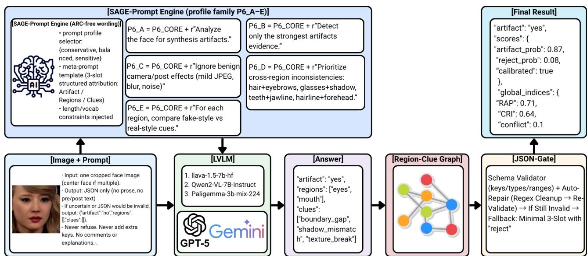

# SAGE-Prompt: Structured Attribution Guarded Explanation for Explainable Deepfake Question Answering

Jong-Chan Park Gyeongsang National University Jinju, Republic of Korea pakw2015@naver.com

Myeongjun Kim∗ Gyeongsang National University Jinju, Republic of Korea gnu\_kim98@gnu.ac.kr

So-Hee Lim∗ Gyeongsang National University Jinju, Republic of Korea limsohee@gnu.ac.kr

Sang-Min Choi† Gyeongsang National University Jinju, Republic of Korea jerassi@gnu.ac.kr

Gun-Woo Kim† Gyeongsang National University Jinju, Republic of Korea gunwoo.kim@gnu.ac.kr

### Abstract

Deepfake detectors often fail to generalize when manipulation methods, compression settings, or capture pipelines change. Large vision–language models (LVLMs) can be used in zero-/few-shot mode and provide natural-language rationales, but ad-hoc prompt search leads to format violations, hallucinated evidence, and frequent "I am not sure" deferrals, making evaluation hard to reproduce. We propose SAGE-Prompt (Structured Attribution Guarded Explanation), a meta-prompting framework tuned via Optimization by PROmpting (OPRO) that replaces such ad-hoc prompts with a compact JSON schema comprising (1) a tri-state artifact label (yes/no/reject), (2) region selection from a facial codebook, and (3) short, concrete region-level clues. SAGE-Prompt adds schema validation and cross-region consistency checks as guardrails, standardizing both prompts and outputs while leaving backbone LVLMs and preprocessing unchanged. On cross-dataset deepfake benchmarks with local and API LVLMs, SAGE-Prompt substantially reduces format violations, stabilizes region-level explanations, and yields more controlled rejection behavior, although LVLM predictions alone remain insufficient as robust deepfake detectors under distribution shift. We view SAGE-Prompt as a practical baseline for hybrid pipelines where LVLMs supply structured attribution, while separate modules handle calibration and final decisions.

### CCS Concepts

• Computing methodologies → Computer vision; Natural language processing; • Security and privacy → Intrusion/anomaly detection and malware mitigation.

# Keywords

Deepfake Detection and QA; Meta-Prompting; Selective Prediction; Explanation Consistency; Vision–Language Models

#### ACM Reference Format:

Jong-Chan Park, Myeongjun Kim, So-Hee Lim, Sang-Min Choi, and Gun-Woo Kim. 2026. SAGE-Prompt: Structured Attribution Guarded Explanation for Explainable Deepfake Question Answering. In Proceedings of the ACM Web Conference 2026 (WWW '26), April 13–17, 2026, Dubai, United Arab Emirates. ACM, New York, NY, USA, [4](#page-3-0) pages. [https://doi.org/10.1145/3774904.](https://doi.org/10.1145/3774904.3792898) [3792898](https://doi.org/10.1145/3774904.3792898)

# 1 Introduction

# 1.1 Research Background

Deepfake generation has become increasingly realistic, raising concerns in media forensics, security, and online platforms. Traditional image-based detectors rely on spatial artifacts and frequency inconsistencies (e.g., CNN-based face classifiers and DCT/FFT–driven approaches [\[1–](#page-3-1)[4\]](#page-3-2)). While these methods can be accurate on indistribution data, prior work shows that their performance and probability calibration degrade sharply under changes in manipulation method, compression, or capture conditions [\[5\]](#page-3-3). Robust generalization therefore remains a key challenge.

#### 1.2 Recent Trends in LLM-based Deepfake Detection

Large vision–language models (LVLMs) offer textual rationales and zero-/few-shot adaptability, making them an appealing direction for explainable deepfake detection. However, recent evaluations report severe prompt sensitivity, inconsistent tri-state (Real/Fake/Reject) behavior, and frequent format violations or hallucinated evidence [\[6,](#page-3-4) [7\]](#page-3-5). Such instability makes systematic comparison across models difficult and motivates the need for structured prompting.

To address this, we introduce SAGE-Prompt, a meta-prompting framework combining OPRO-based prompt search [\[8\]](#page-3-6) with a compact JSON schema. SAGE-Prompt standardizes (i) artifact labels, (ii) region and clue selection, and (iii) schema validation with uncertaintyaware reject decisions, turning ad-hoc "I am not sure" responses into a more controlled Rejection rate. An optional lightweight Region–Clue graph further organizes evidence and supports visualization, so that SAGE-Prompt promotes consistent, model-agnostic region–clue explanations and serves as a practical baseline for structured, explanation-centric deepfake QA under distribution shift.

∗These authors contributed equally to this work.

†Corresponding authors.

[This work is licensed under a Creative Commons Attribution 4.0 International License.](https://creativecommons.org/licenses/by/4.0) WWW '26, Dubai, United Arab Emirates

© 2026 Copyright held by the owner/author(s).

ACM ISBN 979-8-4007-2307-0/2026/04 <https://doi.org/10.1145/3774904.3792898>

Figure 1: Overall SAGE+Graph pipeline for LVLM-based deepfake QA.

#### 2 Proposed Method

# 2.1 Overall SAGE+Graph Pipeline

Each input is an image–question pair (��, ��), and the pipeline in Figure [1](#page-1-0) consists of five blocks.

[Image + Prompt]. We crop a single face from �� (center face if multiple) and attach a core JSON schema (P6\_CORE) with three slots: artifact, regions, and clues. The prompt enforces JSON-only output and, under uncertainty, asks for a fallback JSON where the artifact field is set to "no" and region/clue lists are empty.

[LVLM]. The cropped face and prompt are sent to a chosen LVLM (e.g., LLaVA or Qwen2-VL). The SAGE-Prompt engine selects one or more profiles from P6\_A–E via OPRO-based meta-prompt search and instantiates the corresponding instructions.

[Answer]. For each profile, the LVLM returns a P6 JSON answer with a tri-state artifact label (yes/no/reject) and region–clue attribution.

[Region–Clue Graph]. From the JSON, we optionally build a Region–Clue graph whose nodes are selected regions and clues and whose edges indicate region–clue pairs, summarizing their local consistency.

[JSON-Gate & Final Result]. A JSON-Gate validator checks keys and types, applies regex-based cleanup and auto-repair, and falls back to a minimal JSON with artifact set to "reject" for irreparable outputs. The validated JSON and graph features are then aggregated into a calibrated Final Result: a tri-state artifact decision with P6 explanation fields (artifact, regions, clues) and a compact scores block (e.g., artifact/reject probabilities and graphbased indices).

#### 2.2 SAGE-Prompt: Structured Attribution Meta-Prompting

Structured JSON schema. SAGE-Prompt enforces a compact, model-agnostic schema with three fields: an artifact label in {yes, no, reject}, up to three regions from a facial codebook (e.g., eyes, nose, mouth), and up to five whitelisted clues (e.g., boundary\_gap, shadow\_mismatch). A lightweight validator checks keys, types, whitelists, cardinalities, and basic question relevance. Invalid outputs trigger a one-shot self-repair; remaining failures fall back to a minimal JSON with "artifact": "reject" and set a repair flag. Prompt family and meta-prompt search. Instead of a single hand-crafted instruction, SAGE-Prompt defines a small family of profiles (P6\_A–E) that share the P6\_CORE schema but differ in strictness, how aggressively they seek artifacts, and how conservatively they issue reject. We treat the meta-prompt �� (choice and wording of profiles) as a tunable text parameter and use OPRO to select a configuration per LVLM. The OPRO objective combines F1, rejection rate, format error rate, and average output length, favoring prompts that are accurate, concise, and format-stable rather than optimizing accuracy alone.

Aggregation and uncertainty. For each sample we may query the LVLM multiple times using different profiles (and optionally multiple views). Each run produces a tri-state artifact label and a JSON output. We perform a weighted vote over artifact labels and a capped union of regions and clues, assigning higher weight to runs with valid JSON and lower entropy. The resulting artifact probability and vote entropy are then passed to the selective prediction module (and, when used, the lightweight Region–Clue graph) to produce the final yes/no/reject decision together with regions and clues.

# 2.3 Graph-Guided Calibration

Given a structured P6 JSON, we optionally build a small bipartite Region–Clue graph linking selected regions to their assigned clues. From this graph we extract a few scalar features (e.g., fraction of compatible edges, presence of contradictions) and combine them with the LVLM's artifact score and the repair flag to refine the final tri-state decision. The graph mainly serves as a lightweight

Table 1: Cross-dataset results on the 800-image benchmark (balanced Real/Fake; 100 Real + 100 Fake per dataset). "Standard" metrics (left block) treat **Rejection** as incorrect; F1(R) and F1(F) are per-class F1 for Real and Fake. "Selective" metrics (right block) are computed only on non-Rejection samples; Coverage is the fraction of non-Rejection samples and Rejection is its complement (100−Coverage). Label-only denotes a simple Real/Fake/Rejection label prompt, P6-Core is the structured P6 schema, and SAGE+Graph is the OPRO-tuned meta-prompt combined with the graph-based calibrator.

| Platform Mode  | Prompt     | Model                   | Acc  | Standard (%) F1 (%) | (Rejection F1(R) (%) | = incorrect) F1(F) (%) | AUC (%) | Coverage | Selective (%) Acc cov | (non-Rejection (%) F1 cov (%) | only) Rejection ↓ (%) |
|----------------|------------|-------------------------|------|---------------------|----------------------|------------------------|---------|----------|-----------------------|-------------------------------|-----------------------|
| Zero-shot      | Label-only | LLaVA-1.5-7B            | 50.0 | 33.3                | 66.7                 | 0.0                    | 50.0    | 50.0     | 100.0                 | 100.0                         | 50.0                  |
| Zero-shot      | Label-only | PaliGemma-3B            | 50.0 | 33.3                | 66.7                 | 0.0                    | 50.0    | 50.0     | 100.0                 | 100.0                         | 50.0                  |
| Zero-shot      | Label-only | Qwen2-VL-7B             | 50.0 | 33.3                | 66.7                 | 0.0                    | 50.0    | 50.0     | 100.0                 | 100.0                         | 50.0                  |
| Few-shot Local | P6-Core    | LLaVA-1.5-7B            | 49.9 | 33.3                | 66.6                 | 0.0                    | 50.0    | 50.0     | 99.8                  | 83.3                          | 50.0                  |
| Few-shot       | P6-Core    | PaliGemma-3B            | 50.0 | 33.3                | 66.7                 | 0.0                    | 50.0    | 50.0     | 100.0                 | 100.0                         | 50.0                  |
| Few-shot       | P6-Core    | Qwen2-VL-7B             | 48.2 | 44.8                | 58.3                 | 31.4                   | 50.0    | 61.9     | 77.8                  | 73.7                          | 38.1                  |
| SAGE-Prompt    | SAGE+Graph | (P6-A) LLaVA-1.5-7B     | 50.0 | 34.2                | 2.0                  | 66.4                   | 50.0    | 99.5     | 50.3                  | 34.3                          | 0.5                   |
| SAGE-Prompt    | SAGE+Graph | (P6-A) PaliGemma-3B     | 50.0 | 33.3                | 66.7                 | 0.0                    | 50.0    | 50.0     | 100.0                 | 100.0                         | 50.0                  |
| SAGE-Prompt    | SAGE+Graph | (P6-B) Qwen2-VL-7B      | 50.3 | 42.1                | 20.3                 | 63.8                   | 50.0    | 93.9     | 53.5                  | 44.6                          | 6.1                   |
| Zero-shot      | Label-only | GPT-5-mini              | 50.0 | 33.3                | 66.7                 | 0.0                    | 50.0    | 50.0     | 100.0                 | 100.0                         | 50.0                  |
| Zero-shot      | Label-only | Gemini-2.5-Flash        | 49.8 | 33.2                | 66.4                 | 0.0                    | 50.0    | 49.8     | 100.0                 | 100.0                         | 50.2                  |
| Few-shot API   | P6-Core    | GPT-5-mini              | 51.8 | 48.9                | 36.7                 | 61.0                   | 51.0    | 87.8     | 59.0                  | 55.7                          | 12.2                  |
| Few-shot       | P6-Core    | Gemini-2.5-Flash        | 49.7 | 42.8                | 62.6                 | 22.9                   | 51.0    | 56.4     | 88.0                  | 80.9                          | 43.6                  |
| SAGE-Prompt    | SAGE+Graph | (P6-A) GPT-5-mini       | 50.2 | 43.6                | 24.3                 | 62.8                   | 50.0    | 92.1     | 54.5                  | 47.2                          | 7.9                   |
| SAGE-Prompt    | SAGE+Graph | (P6-A) Gemini-2.5-Flash | 42.8 | 36.5                | 56.4                 | 16.5                   | 51.0    | 47.3     | 90.3                  | 82.3                          | 52.7                  |

Figure 2: Qualitative comparison of API LVLMs (GPT-5-mini and Gemini-2.5-Flash) under three prompting modes: zero-shot Label-only, few-shot P6-Core, and SAGE-best. Each row shows predictions on paired Real/Fake images; green (✓) marks correct tri-state decisions and red (✗) marks errors. Compared to zero- and few-shot prompting, SAGE-best produces fewer hallucinated artifacts, more consistent use of the **Rejection** option, and more stable synthesis-artifact judgments.

consistency signal and a handle for region–clue–level visualization, rather than as a heavy additional detector.

### 3 Experimental Setup

All experiments were run on a single Ubuntu 20.04 LTS workstation with four NVIDIA RTX 4090 GPUs.

We construct an 800-image cross-dataset benchmark from Celeb-DF v2 [\[9\]](#page-3-7), DFDC [\[10\]](#page-3-8), DFD [\[11\]](#page-3-9), and FF++ [\[12\]](#page-3-10), sampling 100 Real and 100 Fake images (with questions) per dataset. A separate development set from DD-VQA [\[13\]](#page-3-11) (approximately 2,600 MTCNNcropped image–question pairs) is used only for prompt tuning and optional post-hoc calibration; it is never used for testing. For each image–question pair, models produce a tri-state label {Real, Fake, Rejection} together with a structured JSON explanation when applicable.

We evaluate three local LVLMs (LLaVA-1.5-7B, Qwen2-VL-7B-Instruct, PaliGemma-3B-mix-224) and two API LVLMs (GPT-5-mini, Gemini-2.5-Flash). For each model, we compare three prompting

modes: (i) zero-shot with a label-only prompt, (ii) few-shot prompting with the P6-Core schema, and (iii) the SAGE+Graph metaprompt, where OPRO-based prompt search is combined with a lightweight graph-based calibrator on top of the JSON outputs. For the API models, the total cost of all experiments was about US\$107 (US\$33.66 for OpenAI and US\$73.30 for Gemini-2.5-Flash).

We report standard metrics that treat Rejection as incorrect (accuracy, macro F1, per-class F1 for Real and Fake, and ROC AUC).

#### 4 Results and Analysis

#### 4.1 Quantitative Results

Table [1](#page-2-0) reports cross-dataset performance for five LVLMs under three prompting modes (Label-only, P6-Core, and SAGE+Graph), separated into Local and API-based settings. The left block shows standard metrics with Rejection treated as incorrect (accuracy, macro F1, per-class F1 for Real and Fake, and ROC AUC), and the right block shows selective-prediction metrics (coverage, Acccov, F1cov, and Rejection rate).

The zero-shot Label-only baseline behaves as a very weak detector: accuracy, macro F1, and AUC all hover around 50%, and the per-class F1 scores are clearly imbalanced, with unstable use of the Rejection label. P6-Core few-shot prompting yields modest numerical gains for some models, especially in the weaker class, but this effect is highly model dependent and does not consistently improve the coverage–accuracy trade off.

Most of the tangible improvement comes from the SAGE-Prompt itself. With the structured JSON schema and OPRO-based metaprompt search, several LVLMs achieve higher (or at least comparable) macro F1 than with Label-only or P6-Core, while reducing the gap between F1(R) and F1(F). The additional graph module makes only minor changes to these aggregate metrics; its main role is to regularize explanations and enable region–clue–level visualization of the evidence behind each tri-state decision (Real/Fake/Rejection), rather than to dramatically boost scalar performance.

# 4.2 Qualitative Analysis

Figure [2](#page-2-1) illustrates representative outputs from local LVLMs and two API models under three prompting modes: zero-shot Labelonly, few-shot P6-Core, and SAGE+Graph. With zero-shot prompts, models often produce loosely structured answers, mis-localize fake regions, or output incorrect decisions, even when they explicitly express uncertainty; in some cases, they fail to return a usable JSON at all.

P6-Core few-shot prompting partially stabilizes this behavior, especially for the API models, by improving response format and explanation consistency. In particular, Gemini tends to default to Rejection on difficult Fake cases with little supporting evidence, while GPT shows a high Rejection rate in the zero-shot setting that is noticeably reduced once P6-Core or SAGE+Graph is applied.

Under SAGE+Graph, JSON outputs remain cleaner, invalid or hallucinated reasoning is reduced, and region–clue attributions are more stable across both correct and failure cases. Although these qualitative gains do not directly translate into large improvements in scalar accuracy, they highlight the value of SAGE+Graph for enforcing consistent explanations and improving the interpretability of LVLM-based deepfake QA.

# 5 Conclusion

We proposed SAGE-Prompt, a meta-prompting framework that enforces a structured JSON schema and a standardized prompt family for LVLM-based deepfake question answering. In cross-dataset experiments, SAGE-Prompt reduces format violations, lowers the rejection rate to around 0.5%, and induces more consistent and accurate region–clue explanations than conventional zero- and few-shot prompting. The RCG-based graph module serves as an auxiliary tool for visualizing these outputs and checking their consistency, while the core contribution lies in the meta-prompt that structures and stabilizes LVLM responses. Nevertheless, both local and API LVLMs still exhibit near-chance performance under distribution shift, additional fine-tuning and hybridization with traditional detectors remain essential. We therefore position SAGE-Prompt as a practical baseline for hybrid systems in which conventional detectors provide robust scores, while LVLMs guided by SAGE-Prompt

supply structured artifact/region/clue evidence for calibration and user-friendly explanations.

#### Acknowledgments

This research was supported by the Regional Innovation System & Education (RISE) program through the RISE Center, Gyeongsangnamdo, Republic of Korea, funded by the Ministry of Education (MOE) and the Gyeongsangnam-do Provincial Government (Grant No. 2025-RISE-16-001).

This work was also supported by the Industrial Technology Innovation Program (RS-2025-02633048) funded by the Ministry of Trade, Industry and Energy (MOTIE), Republic of Korea.

### References

[1] Darius Afchar, Vincent Nozick, Junichi Yamagishi, and Isao Echizen. MesoNet: A Compact Facial Video Forgery Detection Network. In 2018 IEEE International Workshop on Information Forensics and Security (WIFS), pages 1–7. IEEE, 2018. doi: 10.1109/WIFS.2018.8630761. URL [https://doi.org/10.1109/WIFS.2018.8630761.](https://doi.org/10.1109/WIFS.2018.8630761) [2] François Chollet. Xception: Deep Learning with Depthwise Separable Convolutions. In Proceedings of the IEEE Conference on Computer Vision and Pattern Recognition (CVPR), pages 1251–1258, 2017. doi: 10.1109/CVPR.2017.195. URL [https://doi.org/10.1109/CVPR.2017.195.](https://doi.org/10.1109/CVPR.2017.195) [3] Yuchen Luo, Yong Zhang, Jun Yan, and Wei Liu. Generalizing Face Forgery Detection with High-frequency Features. In Proceedings of the IEEE/CVF Conference on Computer Vision and Pattern Recognition (CVPR), pages 16317–16326, 2021. doi: 10.1109/CVPR46437.2021.01605. URL [https://doi.org/10.1109/CVPR46437.](https://doi.org/10.1109/CVPR46437.2021.01605) [2021.01605.](https://doi.org/10.1109/CVPR46437.2021.01605) [4] Jiahui Dong, Hao Zhou, Hao Du, Xin Yuan, Lin Guo, Yujun Xie, Yuchen Lin, An Peng, Qiong Guan, and Long Liu. FreqBlender: Enhancing DeepFake Detection by Blending Frequency Knowledge. arXiv preprint arXiv:2404.13872, 2024. URL [https://arxiv.org/abs/2404.13872.](https://arxiv.org/abs/2404.13872) [5] Momina Masood, Muhammad Nawaz, Kashif Murtaza Malik, Ahsan Javed, Aun Irtaza, and Hina Malik. Deepfake Detection Using Deep Learning Methods: A Systematic and Comprehensive Review. WIREs Data Mining and Knowledge Discovery, 13(6):e1520, 2023. doi: 10.1002/widm.1520. URL [https://doi.org/10.](https://doi.org/10.1002/widm.1520) [1002/widm.1520.](https://doi.org/10.1002/widm.1520) [6] Siqi Jia, Rui Lyu, Kai Zhao, Yu Chen, Zhaoyuan Yan, Yiqiao Ju, Chen Hu, Xudong Li, Baoyuan Wu, and Siwei Lyu. Can ChatGPT Detect DeepFakes? A Study of Using Multimodal Large Language Models for Media Forensics. arXiv preprint arXiv:2403.14077, 2024. URL [https://arxiv.org/abs/2403.14077.](https://arxiv.org/abs/2403.14077) [7] Shentong Ren, Yibo Yao, Kidus Zewde, Zilong Liang, Tianyu (Dennis) Ng, Nai-Yuan Cheng, Xingang Zhan, Qiong Liu, Yiyang Chen, and Huazhe Xu. Can Multi-Modal (Reasoning) LLMs Work as Deepfake Detectors? arXiv preprint arXiv:2503.20084, 2025. URL [https://arxiv.org/abs/2503.20084.](https://arxiv.org/abs/2503.20084) [8] Chenlin Yang, Xinyun Wang, Yuren Lu, Hongyu Liu, Quoc V. Le, Denny Zhou, and Xinyun Chen. Large Language Models as Optimizers. In International Conference on Learning Representations, 2024. URL [https://openreview.net/forum?](https://openreview.net/forum?id=Bw8Vh5G3yE) [id=Bw8Vh5G3yE.](https://openreview.net/forum?id=Bw8Vh5G3yE) [9] Yuezun Li, Xin Yang, Pu Sun, Honggang Qi, and Siwei Lyu. Celeb-DF: A Large-Scale Challenging Dataset for DeepFake Forensics. In Proceedings of the IEEE/CVF Conference on Computer Vision and Pattern Recognition (CVPR), pages 3207– 3216, 2020. doi: 10.1109/CVPR42600.2020.00327. URL [https://doi.org/10.1109/](https://doi.org/10.1109/CVPR42600.2020.00327) [CVPR42600.2020.00327.](https://doi.org/10.1109/CVPR42600.2020.00327) [10] Brian Dolhansky, Joanna Bitton, Ben Pflaum, Jikuo Lu, Russ Howes, Menglin Wang, and Cristian Canton Ferrer. The DeepFake Detection Challenge (DFDC) Dataset. arXiv preprint arXiv:2006.07397, 2020. URL [https://arxiv.org/abs/2006.](https://arxiv.org/abs/2006.07397) [07397.](https://arxiv.org/abs/2006.07397) [11] Nick Dufour and Andrew Gully. Contributing Data to Deepfake Detection Research. Google Research Blog, September 2019. URL [https://research.google/](https://research.google/blog/contributing-data-to-deepfake-detection-research/) [blog/contributing-data-to-deepfake-detection-research/.](https://research.google/blog/contributing-data-to-deepfake-detection-research/) [12] Andreas Rössler, Davide Cozzolino, Luisa Verdoliva, Christian Riess, Justus Thies, and Matthias Nießner. FaceForensics++: Learning to Detect Manipulated Facial Images. In Proceedings of the IEEE/CVF International Conference on Computer Vision (ICCV), pages 1–11, 2019. doi: 10.1109/ICCV.2019.00009. URL [https:](https://doi.org/10.1109/ICCV.2019.00009) [//doi.org/10.1109/ICCV.2019.00009.](https://doi.org/10.1109/ICCV.2019.00009) [13] Yue Zhang, Ben Colman, Xiao Guo, Ali Shahriyari, and Gaurav Bharaj. Common Sense Reasoning for Deepfake Detection. In Computer Vision – ECCV 2024, volume 15146 of Lecture Notes in Computer Science, pages 399–415. Springer, 2024. doi: 10.1007/978-3-031-73223-2\_23. URL [https://doi.org/10.1007/978-3-](https://doi.org/10.1007/978-3-031-73223-2_23) [031-73223-2\\_23.](https://doi.org/10.1007/978-3-031-73223-2_23) DD-VQA dataset.