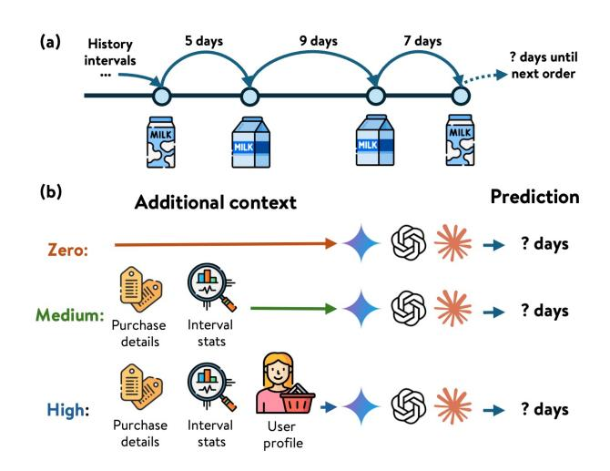
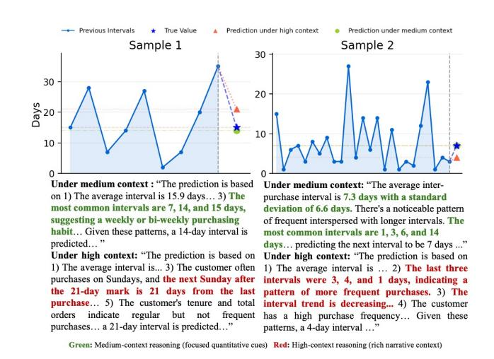

# Is More Context Always Better? Examining LLM Reasoning Capability for Time Interval Prediction

Yanan Cao∗ Walmart Global Tech Sunnyvale, CA, USA yanan.cao@walmart.com

Farnaz Fallahi∗ Walmart Global Tech Sunnyvale, CA, USA farnaz.fallahi@walmart.com Murali Mohana Krishna Dandu∗ Walmart Global Tech Sunnyvale, CA, USA murali.dandu@walmart.com

Lalitesh Morishetti∗ Walmart Global Tech Sunnyvale, CA, USA lalitesh.morishetti@walmart.com

Kai Zhao† Walmart Global Tech Sunnyvale, CA, USA kaizhaofrank@gmail.com

Luyi Ma Walmart Global Tech Sunnyvale, CA, USA luyi.ma@walmart.com

Sinduja Subramaniam Walmart Global Tech Sunnyvale, CA, USA sinduja.subramaniam@walmart.com

Jianpeng Xu Walmart Global Tech Sunnyvale, CA, USA jianpeng.xu@walmart.com

Evren Korpeoglu Walmart Global Tech Sunnyvale, CA, USA ekorpeoglu@walmart.com

Kaushiki Nag Walmart Global Tech Sunnyvale, CA, USA kaushiki.nag@walmart.com

Sushant Kumar Walmart Global Tech Sunnyvale, CA, USA sushant.kumar@walmart.com

Kannan Achan Walmart Global Tech Sunnyvale, CA, USA kannan.achan@walmart.com

#### Abstract

Large Language Models (LLMs) have demonstrated impressive capabilities in reasoning and prediction across different domains. Yet, their ability to infer temporal regularities from structured behavioral data remains underexplored. This paper presents a systematic study investigating whether LLMs can predict time intervals between recurring user actions, such as repeated purchases, and how different levels of contextual information shape their predictive behavior. Using a simple but representative repurchase scenario, we benchmark state-of-the-art LLMs in zero-shot settings against both statistical and machine-learning models. Two key findings emerge. First, while LLMs surpass lightweight statistical baselines, they consistently underperform dedicated machine-learning models, showing their limited ability to capture quantitative temporal structure. Second, although moderate context can improve LLM accuracy, adding further user-level detail degrades performance. These results challenge the assumption that "more context leads to better reasoning." Our study highlights fundamental limitations of today's LLMs in structured temporal inference and offers guidance for designing future context-aware hybrid models that integrate statistical precision with linguistic flexibility.

© 2026 Copyright held by the owner/author(s). ACM ISBN 979-8-4007-2307-0/2026/04 <https://doi.org/10.1145/3774904.3792900>

#### CCS Concepts

• Computing methodologies → Artificial intelligence; Machine learning; Temporal reasoning.

#### Keywords

Large Language Models, Temporal Reasoning, Sequence Modeling

#### ACM Reference Format:

Yanan Cao, Farnaz Fallahi, Murali Mohana Krishna Dandu, Lalitesh Morishetti, Kai Zhao, Luyi Ma, Sinduja Subramaniam, Jianpeng Xu, Evren Korpeoglu, Kaushiki Nag, Sushant Kumar, and Kannan Achan. 2026. Is More Context Always Better? Examining LLM Reasoning Capability for Time Interval Prediction. In Proceedings of the ACM Web Conference 2026 (WWW '26), April 13–17, 2026, Dubai, United Arab Emirates. ACM, New York, NY, USA, [4](#page-3-0) pages.<https://doi.org/10.1145/3774904.3792900>

# 1 Introduction

Predicting the time until a user's next action is a fundamental yet often overlooked dimension of sequential behavioral modeling on the Web [\[3,](#page-3-1) [11\]](#page-3-2). This interval, whether for replenishing groceries or renewing a subscription, tells us about users' habits and needs. Accurately forecasting this interval is therefore a key component of creating personalized experiences. Traditional machine learning (ML) and statistical approaches have long been used to estimate these intervals with structured data. However, the recent emergence of LLMs raises a question: can an LLM reason about time intervals as effectively as specialized predictive models?

Though LLMs show strong capability in language understanding, mathematical reasoning and multi-step logical inference their ability in structured temporal reasoning remains largely unexamined. Most studies focus on what LLMs can infer from text [\[13\]](#page-3-3),

∗Highlighted authors contributed equally to this research.

†Work done while at Walmart Global Tech.

[This work is licensed under a Creative Commons Attribution 4.0 International License.](https://creativecommons.org/licenses/by/4.0) WWW '26, Dubai, United Arab Emirates

not on whether they can capture quantitative regularities hidden in behavioral data.

Figure 1: Illustration of the interval-prediction task and the three prompting conditions. The example is about repeated milk purchases with varying intervals (5 days → 9 days → 7 days → 6 days). The model observes historical intervals for a product category and predicts the next interval under zero, medium, and high context settings.

Recent work applies LLMs to temporal forecasting by converting time series into textual sequences. Models such as LLMTime [\[7\]](#page-3-4) treats numerical time series as digit string tokens, enabling zero-shot forecasting without model modifications. TIME-LLM [\[8\]](#page-3-5) reprograms LLM by learning an alignment layer that translates time series values into its lexical space. Methods like LSTPrompt [\[9\]](#page-3-6) prompt LLMs to reason separately about long and short range patterns. Despite these advances, their benefits over classical models remain uncertain. [\[12\]](#page-3-7) shows that LLMs can handle periodic patterns but struggle with irregular ones, although external context can help. In user modeling, [\[6\]](#page-3-8)[\[5\]](#page-3-9) incorporate irregular time intervals into LLMs for sequential recommendation, yet the task remains focused on what to recommend rather than when the event occurs.

In contrast to prior work on continuous time-series forecasting, our study focuses on discrete, event-based inter-purchase intervals in web behavior modeling. The prevailing literature often assumes that richer contextual data will inherently improve LLM reasoning, yet this has rarely been tested for quantitative, time-dependent tasks. We directly examine whether supplying LLMs with semantic cues (e.g., product attributes, quantities, day-of-week patterns) enables better timing predictions than relying on numerical histories alone. To our knowledge, this hypothesis has not yet been systematically validated in this specific domain. A simple example in Figure [1](#page-1-0) illustrates the task: a household repeatedly purchases milk with gaps of 5, 7, and 9 days, and the model must infer the next interval. This small-scale scenario captures a broad challenge central to web intelligence: inferring behavioral rhythms from sparse, event-driven user interactions.

In this work, we conduct the first systematic study comparing ChatGPT [\[1\]](#page-3-10), Claude [\[2\]](#page-3-11), and Gemini [\[4\]](#page-3-12) with both statistical and ML baselines on this time-interval prediction tasks. We design progressively richer prompts (in zero-shot settings), from zero-context to medium and high-context scenarios incorporating behavioral summaries and average consumption patterns. Our work addresses two questions:

RQ1: Can LLMs outperform traditional machine learning models in inter-purchase interval prediction?

RQ2: Does providing richer contextual information improve LLM performance on temporal interval reasoning tasks?

Across all configurations, LLMs outperform simple statistical estimators yet fall short of traditional machine-learning models such as XGBoost on quantitative accuracy metrics. Although mediumlevel context can yield small gains, additional high-level narrative or behavioral context often reduces accuracy, suggesting that richer prompts may introduce noise that distracts LLMs from core numerical patterns. These findings provide new empirical evidence on the limits of LLM reasoning in structured temporal tasks and motivates deeper investigation into how LLMs internalize temporal signals.

# 2 Experimental Setting

# 2.1 Datasets

We evaluate our approach on two real-world e-commerce datasets: proprietary grocery data and the public Instacart dataset [\[10\]](#page-3-13). In both datasets, user-category pairs with fewer than five purchases are excluded, and intervals longer than 20 days are removed. The proprietary dataset contains 5,780 users across 12 product types (1.03 types/user average) with over 110,000 purchase records. The Instacart dataset includes 2,661 users across 10 categories (1.87 categories/user average) with roughly 194,000 orders. Both datasets span diverse categories (Fresh Produce, Dairy, Packaged Goods, Snacks) capturing variability in purchase periodicity and seasonality for temporal reasoning comparison.

# 2.2 Models

We evaluate three categories of models for temporal interval prediction: LLMs, ML models, and statistical estimator baselines.

LLM Models. We evaluate several state-of-the-art LLMs to examine their ability to predict temporal purchase intervals from structured behavioral data. Specifically, we consider GPT-4o, Gemini-2.5 Pro, and Claude 3.5 Sonnet, prompted under systematically varied context levels to study how contextual richness influences temporal reasoning. As illustrated in Figure 2, each model receives a textual description of a user's past purchase events and is asked to predict the next inter-purchase interval in days. To control the amount of information provided, we design three prompting levels, allowing us to test how much information an LLM needs for accurate timing predictions. Zero-context isolates pure numeric reasoning from intervals alone. Medium-context adds product descriptions and basic statistics to see whether product metadata or simple statistics help. High-context includes richer behavioral signals to evaluate whether LLMs benefit from features commonly used in traditional forecasting. This progression provides a controlled way to assess the impact of different information levels. All model outputs are parsed into numeric predictions and evaluated under a unified

scoring framework. We focused on zero-shot (instead of few-shot) evaluation as our is goal is to mainly assess LLM's inherent temporal reasoning capabilities without task-specific guidance, leaving advanced prompt tuning strategies to future work.

Figure 2: Prompt designs for three context levels: Zero (historical intervals only), Medium (product metadata, summary statistics), and High (recency features, user lifecycle information).

ML Models. To establish structured-data baselines, we implement classical ML models that learn temporal dependencies from numerical features, such as historical inter-purchase intervals, user recency and category-level purchase frequency. We trained three representative machine learning models in industry that are commonly used (RandomForest regression, XGBoost regression, and Multi-layer deep neural network), optimized using median quantile loss to better accommodate the discrete distribution of the target variable and align with business metrics for next-purchase prediction in practice. Our experiments demonstrate that models trained with quantile loss achieves superior performance across both datasets. This structured setup reflects the dominant paradigm in tabular and demand-forecasting systems, providing a grounded benchmark for comparison against LLM-based interval reasoning.

Statistical Models. We further include lightweight statistical estimators that capture baseline temporal regularities without learning. These include the mean, median, and exponential-movingaverage (EMA) of previous intervals, each computed at user and product type level. Such models are widely used in retail analytics and serve as interpretable lower-bound baselines that reveal how much improvement more sophisticated learners or reasoning-based systems can realistically achieve.

# 3 Experimental Results

The results of our experiments provide a clear empirical view of how different modeling paradigms perform on structured temporal reasoning. We compare multiple metrics across all models, examine the effects of varying context on LLM prediction behavior, and analyze representative cases where LLM reasoning diverges from data-driven estimates.

#### 3.1 Main Results

Table 1: Accuracy and error metrics across context levels, with best ML and statistical baselines. Bold values indicate the overall best performance across all models. Underlined values indicate the best among LLMs.

| Model        | TA@0 | Accuracy TA@1 Proprietary | Metrics TA@2 | ↑ RMSE data | Error MAE | Metrics ↓ MAPE |
|--------------|------|---------------------------|--------------|-------------|-----------|----------------|
| GPT-4o-Z     | 5.75 | 12.72                     | 18.65        | 23.66       | 15.50     | 73.03          |
| GPT-4o-M     | 6.13 | 13.83                     | 19.92        | 22.95       | 14.76     | 66.78          |
| GPT-4o-H     | 5.32 | 12.72                     | 18.48        | 24.83       | 16.39     | 76.59          |
| Gemini-2.5-Z | 6.38 | 13.57                     | 19.68        | 23.44       | 15.17     | 63.79          |
| Gemini-2.5-M | 6.15 | 13.95                     | 19.72        | 23.91       | 15.39     | 67.79          |
| Gemini-2.5-H | 6.20 | 13.42                     | 19.25        | 24.20       | 15.66     | 71.38          |
| Claude-3.5-Z | 5.98 | 13.50                     | 19.72        | 22.26       | 14.17     | 64.27          |
| Claude-3.5-M | 6.55 | 14.58                     | 20.97        | 21.93       | 13.85     | 57.45          |
| Claude-3.5-H | 6.75 | 14.63                     | 20.95        | 22.11       | 14.11     | 59.61          |
| ML Best      | 9.48 | 22.98                     | 33.93        | 9.97        | 7.18      | 29.92          |
| Stat Best    | 4.42 | 13.15                     | 20.32        | 22.46       | 14.25     | 55.41          |
|              |      | Instacart                 | data         |             |           |                |
| GPT-4o-Z     | 6.54 | 15.46                     | 22.16        | 30.11       | 16.13     | 77.39          |
| GPT-4o-M     | 7.32 | 16.04                     | 22.98        | 28.56       | 15.09     | 66.80          |
| GPT-4o-H     | 6.00 | 14.12                     | 20.12        | 31.05       | 17.01     | 84.03          |
| Gemini-2.5-Z | 7.30 | 15.76                     | 22.82        | 28.85       | 15.27     | 64.13          |
| Gemini-2.5-M | 7.28 | 16.64                     | 23.06        | 28.36       | 15.05     | 59.43          |
| Gemini-2.5-H | 6.26 | 14.80                     | 21.36        | 29.46       | 16.17     | 74.38          |
| Claude-3.5-Z | 6.22 | 14.48                     | 22.20        | 26.88       | 14.18     | 67.71          |
| Claude-3.5-M | 6.02 | 14.24                     | 21.82        | 26.92       | 13.93     | 62.29          |
| Claude-3.5-H | 6.92 | 15.10                     | 22.44        | 27.50       | 14.42     | 64.31          |
| ML Best      | 8.46 | 22.62                     | 33.42        | 9.17        | 6.55      | 35.04          |
| Stat Best    | 5.90 | 15.34                     | 23.00        | 27.97       | 14.52     | 56.34          |

We assess model performance using three categories of metrics: (1) standard regression metrics including Root Mean Squared Error (RMSE), Mean Absolute Error (MAE), and Mean Absolute Percentage Error (MAPE). (2) business-oriented accuracy metrics, defined as Tolerance Accuracy (TA@k) which is the proportion of predictions where the absolute error is �� days or less (i.e., |�� − ��ˆ| ≤ ��). This metric directly measures the model's utility in a real-world setting where exact precision is not always required. We report TA@0 (exact-day accuracy), TA@1 (±1-day accuracy), and TA@2 (±2-day accuracy). (3) Deployment performance is measured by the cost and latency required to generate a prediction.

RQ1: LLMs vs. Traditional ML A primary finding from [1,](#page-2-0) consistent across both the proprietary and Instacart datasets, is the ML model's dominant performance. It achieves over 50% improvement on most key metrics compared to the best-performing LLM.

For instance, on the proprietary dataset, the ML model's MAPE of 29.92% is 92.0% better than the best-performing LLM (Claude-3.5 Medium at 57.45%). On the business-critical "TA@1" metric, the ML model scores 22.98%, beating the best LLM's 14.63% (Claude-3.5 High) by 57.1%. This performance gap is likely due to a fundamental "impedance mismatch" for the LLM. The ML model directly operates on structured numerical features, whereas the LLM must first translate qualitative linguistic descriptions into an internal representation before performing regression, introducing significant error. Notably, the disparity in performance is significantly larger for error metrics than for accuracy metrics, as LLMs' performance on TA@k is competitive. This suggests that while LLMs fail at quantitative precision (i.e. pinpointing the exact day), they are better at approximate temporal classification. This aligns with the business goal for replenishment, where knowing a user will buy "in the next 48 hours" is often sufficient.

Another notable observation is that LLMs outperform the "stat best" median baseline across both datasets and metrics, indicating that they extract additional signal from contextual descriptions beyond simple historical central tendency. This suggests that LLMs incorporate contextual cues rather than merely reproducing medians, yielding more informative estimates, especially for approximation rather than exact-day prediction. These results indicate that LLMs have useful but limited temporal reasoning capabilities.

RQ2: The Impact of Context on LLM Performance Our second research question examines how different levels of context affect LLM performance. Across both datasets, medium-level context, including basic product attributes, simple statistics, and concise user history, consistently improves both model metrics and business-oriented accuracy. In contrast, high-level narrative context often degrades performance, sometimes matching the zero-context baseline. This suggests a context-as-noise effect: focused, decisionrelevant information aids temporal reasoning, whereas semantically rich but temporally irrelevant details distract the model. As illustrated in Figure [3,](#page-3-14) green highlights show that medium-context prompts encourage the model to rely on stable quantitative cues, producing correct or near-correct predictions, while red highlights show that high-context prompts surface narrative details that models overweight, diverting attention from the underlying temporal structure and leading to erroneous predictions.

Across LLM families, Claude-3.5 performs most consistently and achieves the best results on the internal dataset. On the Instacart dataset, Claude-3.5 and Gemini-2.5 achieve top performance on different metrics. In terms of efficiency, GPT-4o is the fastest and cheapest (around 1.2–1.4s latency, >\$0.003 per call), while Claude-3.5 is moderately slower (around 2–4s) and 3× more expensive, and Gemini-2.5 has the highest latency (around 15–19s) with lower overall accuracy.

Our study presents a framework for time-interval prediction, establishes strong baselines, and positions LLMs between statistical and machine-learning models. We show that targeted and compact context can aid LLM reasoning, while excessive narrative detail can obscure the temporal signal. These findings highlight both the potential and limitations of LLMs for structured temporal inference and point toward hybrid models combining statistical precision with linguistic flexibility.

Figure 3: Examples of Claude-3.5-Sonnet prediction and reasoning with different levels of context.

#### References

- [1] Josh Achiam, Steven Adler, Sandhini Agarwal, Lama Ahmad, Ilge Akkaya, Florencia Leoni Aleman, Diogo Almeida, Janko Altenschmidt, Sam Altman, Shyamal Anadkat, et al. 2023. Gpt-4 technical report. arXiv preprint arXiv:2303.08774 (2023). [2] Anthropic. 2024. Claude 3.5 Sonnet. (2024). [https://www.anthropic.com/news/](https://www.anthropic.com/news/claude-3-5-sonnet) [claude-3-5-sonnet](https://www.anthropic.com/news/claude-3-5-sonnet) Technical Report. [3] Yanan Cao, Omid Memarrast, Shiqin Cai, Sinduja Subramaniam, Evren Korpeoglu, and Kannan Achan. 2025. S2SRec2: Set-to-Set Recommendation for Basket Completion with Recipe. arXiv preprint arXiv:2507.09101 (2025). [4] Gheorghe Comanici, Eric Bieber, Mike Schaekermann, Ice Pasupat, Noveen Sachdeva, Inderjit Dhillon, Marcel Blistein, Ori Ram, Dan Zhang, Evan Rosen, et al. 2025. Gemini 2.5: Pushing the frontier with advanced reasoning, multimodality, long context, and next generation agentic capabilities. arXiv preprint arXiv:2507.06261 (2025). [5] Tianning Dong, Luyi Ma, Varun Vasudevan, Jason Cho, Sushant Kumar, and Kannan Achan. [n. d.]. To See or To Read: User Behavior Reasoning in Multimodal LLMs. In NeurIPS 2025 Workshop on Efficient Reasoning. [6] Wei-Wei Du, Takuma Udagawa, and Kei Tateno. 2025. Not Just What, But When: Integrating Irregular Intervals to LLM for Sequential Recommendation. arXiv[:2507.23209](https://arxiv.org/abs/2507.23209) [cs.IR]<https://arxiv.org/abs/2507.23209> [7] Nate Gruver, Marc Finzi, Shikai Qiu, and Andrew Gordon Wilson. 2024. Large Language Models Are Zero-Shot Time Series Forecasters. arXiv[:2310.07820](https://arxiv.org/abs/2310.07820) [cs.LG] <https://arxiv.org/abs/2310.07820> [8] Ming Jin, Shiyu Wang, Lintao Ma, Zhixuan Chu, James Y. Zhang, Xiaoming Shi, Pin-Yu Chen, Yuxuan Liang, Yuan-Fang Li, Shirui Pan, and Qingsong Wen. 2024. Time-LLM: Time Series Forecasting by Reprogramming Large Language Models. arXiv[:2310.01728](https://arxiv.org/abs/2310.01728) [cs.LG]<https://arxiv.org/abs/2310.01728> [9] Haoxin Liu, Zhiyuan Zhao, Jindong Wang, Harshavardhan Kamarthi, and
- B. Aditya Prakash. 2024. LSTPrompt: Large Language Models as Zero-Shot Time Series Forecasters by Long-Short-Term Prompting. arXiv[:2402.16132](https://arxiv.org/abs/2402.16132) [cs.CL] <https://arxiv.org/abs/2402.16132> [10] M Yasser H. 2017. InstaCart Online Grocery Basket Analysis Dataset. [https://www.](https://www.kaggle.com/datasets/yasserh/instacart-online-grocery-basket-analysis-dataset) [kaggle.com/datasets/yasserh/instacart-online-grocery-basket-analysis-dataset.](https://www.kaggle.com/datasets/yasserh/instacart-online-grocery-basket-analysis-dataset) [11] Luyi Ma, Wanjia Zhang, Kai Zhao, Abhishek Kulkarni, Lalitesh Morishetti, Anjana Ganesh, Ashish Ranjan, Aashika Padmanabhan, Jianpeng Xu, Jason HD Cho, et al. 2025. Grace: Generative recommendation via journey-aware sparse attention on chain-of-thought tokenization. In Proceedings of the Nineteenth ACM Conference on Recommender Systems. 135–144. [12] Hua Tang, Chong Zhang, Mingyu Jin, Qinkai Yu, Zhenting Wang, Xiaobo Jin, Yongfeng Zhang, and Mengnan Du. 2024. Time Series Forecasting with LLMs: Understanding and Enhancing Model Capabilities. arXiv[:2402.10835](https://arxiv.org/abs/2402.10835) [cs.CL] <https://arxiv.org/abs/2402.10835> [13] Tao Zhang, Kehui Yao, Luyi Ma, Reza Yousefi Maragheh, Jiao Chen, Kai Zhao, Jianpeng Xu, Evren Korpeoglu, Sushant Kumar, and Kannan Achan. [n. d.]. No-Human in the Loop: Agentic Evaluation at Scale for Recommendation. In NeurIPS 2025 Workshop on Evaluating the Evolving LLM Lifecycle: Benchmarks, Emergent Abilities, and Scaling.