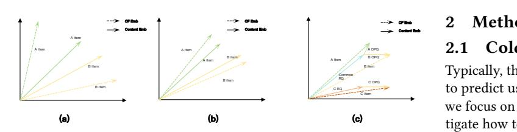
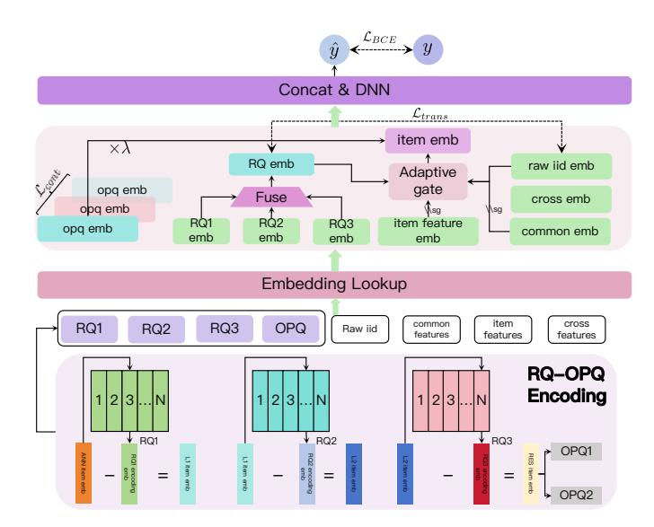

# COINS: SeMantiC Ids Enhanced COld Item RepresentatioN for Click-through Rate Prediction in E-commerce Search

Qihang Zhao zhaoqh75@mail.ustc.edu.cn Kuaishou Inc. Hangzhou, Zhejiang, China

Zhongbo Sun Kuaishou Technology Hangzhou, China sunzb17@gmail.com

Xiaoyang Zheng Kuaishou Technology Hangzhou, China zhengxiaoyang@kuaishou.com

Xian Guo Kuaishou Technology Beijing, China guoxian@kuaishou.com

Siyuan Wang Kuaishou Technology Beijing, China wangsiyuan@kuaishou.com

Zihan Liang Kuaishou Technology Hangzhou, China liangzihan@kuaishou.com

Mingcan Peng Kuaishou Technology Beijing, China pengmingcan@kuaishou.com

Ben Chen∗ Kuaishou Technology Hangzhou, China chenben03@kuaishou.com

Chenyi Lei Kuaishou Technology Hangzhou, China leichy@mail.ustc.edu.cn

### Abstract

With the rise of modern search and recommendation platforms, insufficient collaborative information of cold-start items exacerbates the Matthew effect of existing platform items, challenging platform diversity and becoming a longstanding issue. Existing methods align items' side content with collaborative information to transfer collaborative signals from high-popularity items to cold-start items. However, these methods fail to account for the asymmetry between collaboration and content, nor the fine-grained differences among items. To address these issues, we propose COINS, an item representation enhancement approach based on fused alignment of semantic IDs. Specifically, we use RQ-OPQ encoding to quantize item content and collaborative information, followed by a two-step alignment: RQ encoding transfers shared collaborative signals across items, while OPQ encoding learns items' differentiated information. Comprehensive offline experiments on large-scale industrial datasets demonstrate COINS's superiority, and rigorous online A/B tests confirm statistically significant improvements: item CTR +1.66%, buyers +1.57%, and order volume +2.17%.

# CCS Concepts

• Information systems → Content ranking.

# Keywords

Semantic Ids; Cold Start

∗ \*corresponding author

<https://doi.org/XXXXXXX.XXXXXXX>

#### ACM Reference Format:

Qihang Zhao, Zhongbo Sun, Xiaoyang Zheng, Xian Guo, Siyuan Wang, Zihan Liang, Mingcan Peng, Ben Chen, and Chenyi Lei. 2018. COINS: Se-MantiC Ids Enhanced COld Item RepresentatioN for Click-through Rate Prediction in E-commerce Search. In Proceedings of Make sure to enter the correct conference title from your rights confirmation email (Conference acronym 'XX). ACM, New York, NY, USA, [5](#page-4-0) pages.<https://doi.org/XXXXXXX.XXXXXXX>

# 1 Introduction

E-commerce search recommendation systems have become core channels for connecting users and commodities, with continuous optimization in representation learning and matching efficiency to adapt to the rapid growth of platform scale. However, the item cold-start challenge has become increasingly prominent—newly added commodities (accounting for approximately 30% of monthly updates on our platforms) often face extreme sparsity of user interaction data. Over 60% of these cold-start items receive fewer than 5 clicks in their first week, lacking critical collaborative signals (e.g., user click preferences, purchase tendencies) that traditional recommendation methods rely on. This directly degrades search recommendation accuracy for cold items, making it an urgent need to develop efficient cold-start solutions compatible with existing industrial systems.

Existing cold-start solutions fall into two paradigms. Generatorbased methods [\[2](#page-4-1)[–4,](#page-4-2) [6\]](#page-4-3) synthesize cold-item representations via warm-item signals: meta-learning [\[4\]](#page-4-2) pre-trains transferable generators for few-sample adaptation, GANs [\[2\]](#page-4-1) align cold embeddings with warm signal distributions, and VAEs [\[3\]](#page-4-4) sample from learned warm-data distributions. Knowledge alignment-based methods [\[7–](#page-4-5) [9,](#page-4-6) [12\]](#page-4-7) bridge content and collaborative signals: contrastive learning optimizes [\[7\]](#page-4-5) content encoders to match warm collaborative representations, while knowledge distillation [\[12\]](#page-4-7) uses content features as a medium to transfer teacher-model (warm-item) knowledge to student models (cold-item).

Despite the partial success of existing approaches, two critical limitations persist. First, for generative models: few-shot-based generators independently generate representations for cold-start items,

Permission to make digital or hard copies of all or part of this work for personal or classroom use is granted without fee provided that copies are not made or distributed for profit or commercial advantage and that copies bear this notice and the full citation on the first page. Copyrights for components of this work owned by others than the author(s) must be honored. Abstracting with credit is permitted. To copy otherwise, or republish, to post on servers or to redistribute to lists, requires prior specific permission and/or a fee. Request permissions from permissions@acm.org.

Conference acronym 'XX, Woodstock, NY © 2018 Copyright held by the owner/author(s). Publication rights licensed to ACM. ACM ISBN 978-1-4503-XXXX-X/2018/06

B item C OPQ Typically, the core of the cold-start problem lies in exploring how to predict user interaction behaviors for new items. In this work, we focus on the click-through rate (CTR) prediction task and investigate how to improve the performance of cold-start tasks through the synergy between Semantic IDs generated by large search models and collaborative signals. In this section, we first formally define the cold-start problem, then elaborate on the proposed COINS framework in detail. Formally, given a user U (user profile ���� ), the user's current search query Q, and the user's historical behavior sequence ���� , cross features ��, each sample in the CTR prediction task can be represented as �� = (����, ��), which includes a label �� ∈ {0, 1} (indicating whether the sample is clicked by the user): id denotes the random hash ID of the item, and �� represents the multi-dimensional feature set of the item (including content features, metadata features, etc.). The goal of cold-start CTR estimation is to learn a discriminative model �� to output the click probability of the sample:

Figure 1: Types of Knowledge alignment-based methods.

yet they overlook temporal dynamics and temporal variations during feature transfer—this flaw readily induces distribution drift in the generated cold-start item embeddings. Second, for knowledge alignment-based methods: such approaches generally rely on the core assumption that item's side content information and collaborative signals are consistent in the embedding space. Even though some improved variants attempt to learn the consistency between these two components prior to alignment, they still do not deviate from the knowledge alignment framework. Their core limitation remains in neglecting the unique fine-grained discriminative information of individual items, ultimately confining recommendation performance to a suboptimal level while failing to address the asymmetry between side information and collaborative signals that frequently arises in real-world scenarios, as illustrate in Figure [1](#page-1-0) (a) and (b).

To alleviate these issues, this paper proposes a novel item representation fusion and enhancement method based on semantic IDs, termed COINS. Specifically, inspired by OneSearch [\[1\]](#page-4-8): a recently deployed end-to-end generative framework that has achieved successful application in e-commerce search. We leverage its proposed RQ-OPQ encoding (endowed with rich hierarchical semantic and collaborative signals) to enhance cold-start item representations. First, for the coarser-grained RQ encoding, we design an adaptive transfer mechanism to enable bidirectional transfer between highfrequency collaborative signals embedded in item IDs and dense semantic information within RQ encodings. Second, for the residual vectors of items obtained via RQ hierarchical quantization (i.e., OPQ encodings), which encapsulate the discriminative information of different items, we integrate such discriminative information into item representations through contrastive learning. Ultimately, the resulting item representations not only incorporate abundant content and collaborative information but also accurately capture the uniqueness of individual items, as illustrate in Figure [1](#page-1-0) (c). The main contributions are as follows:

- We propose an innovative adaptive transfer mechanism to achieve adaptive bidirectional alignment between the collaborative information embedded in item IDs and the semantic information within RQ encodings;
- We are the first to propose an OPQ encoding-based learning strategy for item discriminative information, enabling coldstart item representations to accurately capture their unique attributes;
- We conduct comprehensive offline experiments and rigorous online A/B test, whose results fully validate the superiority of our proposed COINS method.

#### 2 Methodology

#### 2.1 Cold Start for Search

��ˆ = �� (����, ��, ��, ���� ,����,��; ��) (1)

where �� denotes the parameters of model f. The above model is optimized via the binary cross-entropy (BCE) loss:

L������ = − 1 �� ∑︁�� ��=1 [���� log��ˆ�� + (1 − ����) log(1 − ��ˆ��)] (2)

Specifically, compared with warm items (items with sufficient interaction data), cold-start items suffer from scarce user interaction records, leading to the absence of statistical features (e.g., click frequency, conversion rate) and partial ID-related representations. This further results in difficulties in model convergence during training.

# 2.2 RQ-OPQ Encodings

RQ-OPQ encoding is a core technical innovation proposed in Kuaishou's end-to-end generative framework OneSearch for e-commerce search. This encoding method combines the advantages of Residual Quantization (RQ) and Optimized Product Quantization (OPQ), modeling item features from two dimensions: vertically (hierarchical semantics) and horizontally (unique features). Specifically, its implementation process is as follows: First, a two-tower vector retrieval model optimized for content features and conversion signals is trained to generate the initial embedding of each item. Second, based on this initial embedding, the RQ-Kmeans algorithm is applied to perform three-layer hierarchical encoding, which primarily focuses on capturing the core attributes and shared semantic information of items. Third, for the residual information remaining after RQ encoding, the OPQ algorithm is used to conduct two-layer quantization encoding—this step is specifically designed to capture and quantize the differentiated fine-grained features of items. Finally, each item is represented by a five-layer semantic ID (sid): �������� = (����1, ����2, ����3,������1,������2).

# 2.3 Semantic Ids Enhanced Item Representation

In this section, we elaborate in detail on COINS, a cold-start item representation enhancement framework based on semantic IDs.

Table 1: The offline performance of COINS.

|           | AUC    | All GAUC | AUC    | Warm GAUC | AUC    | Cold GAUC |
|-----------|--------|----------|--------|-----------|--------|-----------|
| SPM_SID   | 0.8663 | 0.6322   | 0.8649 | 0.6319    | 0.8400 | 0.6203    |
| DAS       | 0.8679 | 0.6352   | 0.8689 | 0.6357    | 0.8426 | 0.6237    |
| SaviorRec | 0.8687 | 0.6360   | 0.8695 | 0.6377    | 0.8435 | 0.6249    |
| COINS     | 0.8725 | 0.6394   | 0.8741 | 0.6405    | 0.8528 | 0.6301    |

distribution aligns with the Pareto Principle — 20% of items account for 80% of the traffic.

#### 3.2 Experiment Setup

3.2.1 Metrics. We use AUC and GAUC to evaluate the performance of CTR ranking models.

3.2.2 Implementation Details. To ensure experimental reproducibility, the hyperparameter settings mentioned in the method section are listed below: Hyperparameters��1 = 0.01 and ��2 = 0.05 are set to control the consistency of the numerical magnitudes of the three loss functions; the temperature coefficient �� = 0.1 is used to ensure distribution smoothness; the OPQ representation fusion coefficient �� is set to 0.5.

3.2.3 Baselines. Since our proposed COINS framework is based on semantic ids to enhance the representation of cold start items, we have selected some models that are also based on semantic ids or cold start as our baseline:

SPM\_SID [\[5\]](#page-4-9): hashing sub fragments of semantic ids sequences to adaptively obtain the semantics of different items.

DAS [\[11\]](#page-4-10): Through joint training of semantic collaborative models, use contrastive learning to synchronously optimize the quantization and alignment process of semantic ids and item id.

SaviorRec [\[10\]](#page-4-11): A cold start model based on multimodal information and semantic ids collaborative training to enhance item representation.

### 3.3 Offline Performance

To verify the effectiveness of COINS in the click-through rate (CTR) prediction task, this section compares the performance of COINS with existing state-of-the-art methods (SPM\_SID, DAS, SaviorRec) through offline experiments, as shown in Table [1.](#page-3-0) In the full-sample (All) scenario, COINS achieves the best performance in both AUC (+0.38pp) and GAUC (+0.34pp). This proves that COINS's overall ranking ability and resistance to user bias are significantly superior to baselines. In the warm item scenario, COINS still maintains a leading advantage, which indicates that even in scenarios with sufficient user interaction data, COINS can still optimize the representation quality of warm items and further improve prediction accuracy through the fusion of collaborative signals and semantic information in RQ-OPQ encodings. The cold-start item scenario is the core advantage area of COINS, The improvement margin is much higher than that in the full-sample and warm item scenarios. This result verifies the effectiveness of COINS's design—by leveraging the discriminative information learning of OPQ encoding and the adaptive transfer of RQ encoding, COINS effectively solves the problem of scarce collaborative signals for cold-start items, making

Table 2: The ablation study resluts of COINS.

|          | AUC    | All GAUC | AUC    | Warm GAUC | AUC    | Cold GAUC |
|----------|--------|----------|--------|-----------|--------|-----------|
| only sid | 0.8650 | 0.6312   | 0.8642 | 0.6305    | 0.8391 | 0.6192    |
| iid+sid  | 0.8671 | 0.6331   | 0.8681 | 0.6335    | 0.8401 | 0.6215    |
| iid+RQ   | 0.8702 | 0.6371   | 0.8725 | 0.6378    | 0.8479 | 0.6277    |
| iid+OPQ  | 0.8683 | 0.6345   | 0.8706 | 0.6368    | 0.8455 | 0.6257    |
| COINS    | 0.8725 | 0.6394   | 0.8741 | 0.6405    | 0.8528 | 0.6301    |

Table 3: The Online A/B testing resluts of COINS.

|       |         | All          |         | Cold         |
|-------|---------|--------------|---------|--------------|
|       | Buyer   | Order Volume | Buyer   | Order Volume |
| COINS | +1.720% | +2.230%      | +3.512% | +9.639%      |

it the current State-of-the-Art (SOTA) method for cold-start CTR prediction tasks.

#### 3.4 Ablation Study

To verify the function of each module in COINS, we conducted sufficient ablation experiments, and the experimental results are shown in the Table [2.](#page-3-1) Firstly, we directly replace the original random ID in base model by RQ-OPQ encodings (short for only sid). Although it achieves comparable overall performance to the base model, it exhibits inferior performance on warm items compared to the original model due to collaborative signal misalignment. Secondly, we attempted to preserve random IDs and treat SIDs as a type of ID feature (short for iid+SID). This variant has a slight improvement compared to the base model, as the introduction of SID brings additional information increment, but it is still far inferior to the COINS model. Finally, we ablated the two modules of COINS (short for iid+RQ, iid+OPQ). Both variants can achieve significant benefits compared to the base model. By integrating the advantages of these two variants, COINS simultaneously learns the discriminative information and convergent semantic information of items, ultimately achieving the optimal performance.

## 3.5 Online A/B Testing

To verify the efficiency of COINS's online platform, we compared it with an online ranking model in the e-commerce mall search scenario through rigorous A/B testing. We conducted a 14 day experiment under real online traffic, with 5 days being the AA period and the remaining 9 days being the AB period. The base group and exp group were randomly assigned 7% of the overall real online traffic. The experimental results are shown in the Table [3.](#page-3-2) Our experimental focus indicators are the buyers and order volume, and we also report the relevant indicators in the cold start scenario in the Table [3.](#page-3-2) Experiments have shown that COINS can increase the overall number of buyers by 1.72% and the order volume by 2.23%. Simultaneously, COINS significantly improves the cold start scenario (buyer number +3.512% and order volume +9.639%) in mall ecommerce search.

4 Conclusion To address cold-start challenges in e-commerce, we propose COINS: it fuses item ID collaboration and semantics RQ via adaptive transfer, and enhances item differentiation with OPQ contrastive learning. Offline experiments and online A/B testing confirm its effectiveness (improving buyer +1.72%, order volume +2.23%). In future work, we will explore the fusion of multimodal semantics and collaborative signals to adapt to more complex cold-start scenarios. References [1] Ben Chen, Xian Guo, Siyuan Wang, Zihan Liang, Yue Lv, Yufei Ma, Xinlong Xiao, Bowen Xue, Xuxin Zhang, Ying Yang, Huangyu Dai, Xing Xu, Tong Zhao, Mingcan Peng, Xiaoyang Zheng, Chao Wang, Qihang Zhao, Zhixin Zhai, Yang Zhao, Bochao Liu, Jingshan Lv, Xiao Liang, Yuqing Ding, Jing Chen, Chenyi Lei, Wenwu Ou, Han Li, and Kun Gai. 2025. OneSearch: A Preliminary Exploration of the Unified End-to-End Generative Framework for E-commerce Search. arXiv[:2509.03236](https://arxiv.org/abs/2509.03236) [cs.IR]<https://arxiv.org/abs/2509.03236> [2] Hao Chen, Zefan Wang, Feiran Huang, Xiao Huang, Yue Xu, Yishi Lin, Peng He, and Zhoujun Li. 2022. Generative Adversarial Framework for Cold-Start Item Recommendation. In Proceedings of the 45th International ACM SIGIR Conference on Research and Development in Information Retrieval (Madrid, Spain) (SIGIR '22). Association for Computing Machinery, New York, NY, USA, 2565–2571. [doi:10.1145/3477495.3531897](https://doi.org/10.1145/3477495.3531897) [3] Menglin Kong, Li Fan, Shengze Xu, Xingquan Li, Muzhou Hou, and Cong Cao. 2024. Collaborative Filtering in Latent Space: A Bayesian Approach for Cold-Start Music Recommendation. In Advances in Knowledge Discovery and Data Mining: 28th Pacific-Asia Conference on Knowledge Discovery and Data Mining, PAKDD 2024, Taipei, Taiwan, May 7–10, 2024, Proceedings, Part V (Taipei, Taiwan). Springer-Verlag, Berlin, Heidelberg, 105–117. [doi:10.1007/978-981-97-2262-4\\_9](https://doi.org/10.1007/978-981-97-2262-4_9) [4] Yunze Luo, Yuezihan Jiang, Yinjie Jiang, Gaode Chen, Jingchi Wang, Kaigui Bian, Peiyi Li, and Qi Zhang. 2025. Online Item Cold-Start Recommendation with Popularity-Aware Meta-Learning. In Proceedings of the 31st ACM SIGKDD Conference on Knowledge Discovery and Data Mining V.1 (Toronto ON, Canada) (KDD '25). Association for Computing Machinery, New York, NY, USA, 927–937. [doi:10.1145/3690624.3709336](https://doi.org/10.1145/3690624.3709336) [5] Anima Singh, Trung Vu, Nikhil Mehta, Raghunandan H. Keshavan, Maheswaran Sathiamoorthy, Yilin Zheng, Lichan Hong, Lukasz Heldt, Li Wei, Devansh Tandon, Ed H. Chi, and Xinyang Yi. 2024. Better Generalization with Semantic IDs: A Case Study in Ranking for Recommendations. In Proceedings of the 18th ACM Conference on Recommender Systems, RecSys 2024, Bari, Italy, October 14-18, 2024. ACM, 1039–1044. [doi:10.1145/3640457.3688190](https://doi.org/10.1145/3640457.3688190) [6] Manasi Vartak, Arvind Thiagarajan, Conrado Miranda, Jeshua Bratman, and Hugo Larochelle. 2017. A meta-learning perspective on cold-start recommendations for items. In Proceedings of the 31st International Conference on Neural Information Processing Systems (Long Beach, California, USA) (NIPS'17). Curran Associates Inc., Red Hook, NY, USA, 6907–6917. [7] Yinwei Wei, Xiang Wang, Qi Li, Liqiang Nie, Yan Li, Xuanping Li, and Tat-Seng Chua. 2021. Contrastive Learning for Cold-Start Recommendation. In Proceedings of the 29th ACM International Conference on Multimedia (Virtual Event, China) (MM '21). Association for Computing Machinery, New York, NY, USA, 5382–5390. [doi:10.1145/3474085.3475665](https://doi.org/10.1145/3474085.3475665) [8] Xiaolong Xu, Hongsheng Dong, Lianyong Qi, Xuyun Zhang, Haolong Xiang, Xiaoyu Xia, Yanwei Xu, and Wanchun Dou. 2024. CMCLRec: Cross-modal Contrastive Learning for User Cold-start Sequential Recommendation. In Proceedings of the 47th International ACM SIGIR Conference on Research and Development in Information Retrieval (Washington DC, USA) (SIGIR '24). Association for Computing Machinery, New York, NY, USA, 1589–1598. [doi:10.1145/3626772.3657839](https://doi.org/10.1145/3626772.3657839) [9] Xiaolong Xu, Hongsheng Dong, Haolong Xiang, Xiyuan Hu, Xiaoyong Li, Xiaoyu Xia, Xuyun Zhang, Lianyong Qi, and Wanchun Dou. 2025. C2lRec: Causal Contrastive Learning for User Cold-start Recommendation with Social Variables. ACM Trans. Inf. Syst. 43, 6, Article 143 (Sept. 2025), 28 pages. [doi:10.1145/3711858](https://doi.org/10.1145/3711858) [10] Yining Yao, Ziwei Li, Shuwen Xiao, Boya Du, Jialin Zhu, Junjun Zheng, Xiangheng Kong, and Yuning Jiang. 2025. SaviorRec: Semantic-Behavior Alignment for Cold-Start Recommendation. arXiv preprint arXiv:2508.01375 (2025). [11] Wencai Ye, Mingjie Sun, Shaoyun Shi, Wang Peng, Wenjin Wu, and Peng Jiang. 2025. DAS: Dual-Aligned Semantic IDs Empowered Industrial Recommender System. CoRR abs/2508.10584 (2025). arXiv[:2508.10584](https://arxiv.org/abs/2508.10584) [doi:10.48550/ARXIV.2508.](https://doi.org/10.48550/ARXIV.2508.10584) [10584](https://doi.org/10.48550/ARXIV.2508.10584) [12] Ziyi Zhuang, Hanwen Du, Hui Han, Youhua Li, Junchen Fu, Joemon M. Jose, and Yongxin Ni. 2025. Bridging the Gap: Teacher-Assisted Wasserstein Knowledge Distillation for Efficient Multi-Modal Recommendation. In Proceedings of the ACM on Web Conference 2025 (Sydney NSW, Australia) (WWW '25). Association for Computing Machinery, New York, NY, USA, 2464–2475. [doi:10.1145/3696410.](https://doi.org/10.1145/3696410.3714852) [3714852](https://doi.org/10.1145/3696410.3714852) Received 29 September 2025

