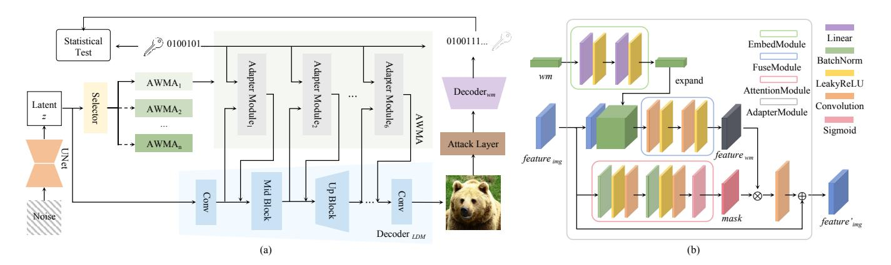
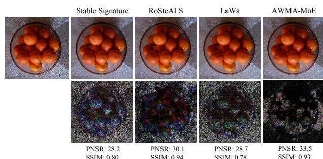
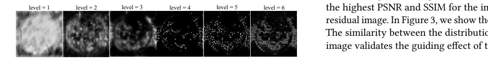

# AWMA-MoE: Attention-Guided Watermark Adapter with MoE for Latent Diffusion Models

Yicheng Huang 23s151015@stu.hit.edu.cn Harbin Institute of Technology, Shenzhen Shenzhen, China

Xinyu Xiao 23b951021@stu.hit.edu.cn Harbin Institute of Technology, Shenzhen Shenzhen, China

Jian Zhang zhangjian.sz@pku.edu.cn Peking University Beijing, China

Shuhan Qi∗ shuhanqi@cs.hitsz.edu.cn Harbin Institute of Technology, Shenzhen Shenzhen, China

Yulin Wu yulinwu@cs.hitsz.edu.cn Harbin Institute of Technology, Shenzhen Shenzhen, China

Xuan Wang wangxuan@cs.hitsz.edu.cn Harbin Institute of Technology, Shenzhen Shenzhen, China

### Abstract

With the evolving generative models, generated images are closer to reality, raising concerns about information authenticity and malicious misuse. Invisible watermarks offer a practical approach to detecting and tracing them. However, while image watermarking inevitably introduces quality degradation, most existing methods primarily focus on improving watermark robustness. To address this limitation, we propose AWMA-MoE, a framework that enhances the quality of generated images while preserving strong watermark robustness. Specifically, we design an attention-based adapter that adaptively embeds watermarks with spatially varying strengths across image regions. Building upon this, we introduce an MoE architecture that leverages diverse experts to further improve image quality while retaining watermark robustness. Experiments demonstrate that AWMA-MoE can reduce the distortion of generated images and exhibit competitive watermark performance, thus striking an improved balance for watermarking generated image tasks and better linking post-hoc and in-generation methods.

## CCS Concepts

- Security and privacy → Human and societal aspects of security and privacy.

## Keywords

Latent Diffusion Model; Image Generation; Watermarking

### ACM Reference Format:

Yicheng Huang, Xinyu Xiao, Jian Zhang, Shuhan Qi, Yulin Wu, and Xuan Wang. 2026. AWMA-MoE: Attention-Guided Watermark Adapter with MoE for Latent Diffusion Models. In Proceedings of the ACM Web Conference 2026 (WWW '26), April 13–17, 2026, Dubai, United Arab Emirates. ACM, New York, NY, USA, [4](#page-3-0) pages.<https://doi.org/10.1145/3774904.3792903>

© 2026 Copyright held by the owner/author(s). ACM ISBN 979-8-4007-2307-0/2026/04 <https://doi.org/10.1145/3774904.3792903>

### 1 Introduction

With the rapid advancement and widespread accessibility of generative models, a substantial amount of AI-generated content (AIGC) has emerged. Among these, text-to-image diffusion models are capable of generating high-resolution images, which may raise several concerns. Generative models may produce similar outputs for different prompts, leading to user copyright disputes. In addition, malicious actors might create and disseminate realistic fake images, posing a threat to public safety. Digital watermarking offers a solution to these problems.

For AIGC images, existing watermarking methods primarily consist of post-hoc and in-generation methods. Post-hoc methods add watermarks to the images after generation, while in-generation ones integrate watermarking into the generation pipeline — making them more suitable for generating scenes. Stable Signature introduced a paradigm that fine-tunes the decoder of the Latent Diffusion Model (LDM) using a pre-trained watermark decoder, rapidly incorporating the watermark into the model.

Subsequently, a range of more comprehensive watermarking methods has emerged, many of which opt to train a new watermark decoder to extract watermarks [\[8\]](#page-3-1). However, there are still unique advantages to using pre-trained watermark decoders. It enables the generation system to share one watermark decoder with traditional watermarking systems, eliminating the need to develop decoders for new frameworks. It should also be noted that watermarking will degrade image quality, introducing artifacts or altering the distribution. However, previous methods predominantly emphasized robustness, downplaying the significance of image quality.

In this paper, we propose the Attention-Guided Watermark Adapter with Mixture of Experts (AWMA-MoE), a method trained with a pre-trained watermark decoder for embedding watermarks in images generated by LDM. We insert several watermark adapters equipped with ������������������������������s into the LDM decoder. These adapters can fuse the image and watermark features during generation and are used as experts to construct a Mixture of Experts (MoE) system with a selector. Specifically, ������������������������������ computes a mask based on image features, which regulates the intensity of watermarks in different regions to impose less impact on image quality. The selector chooses an optimal expert based on image features for watermarking, thereby enhancing both image quality

∗Corresponding Author.

[This work is licensed under a Creative Commons Attribution 4.0 International License.](https://creativecommons.org/licenses/by/4.0) WWW '26, Dubai, United Arab Emirates.

Table 2: Ablation study on ������������������������������ and MoE.

Figure 3: Visualization of multilevel masks.

train all models on the MS-COCO 2017 [\[7\]](#page-3-6) training set and derive test results from its validation set and the CLIC 2020 [\[11\]](#page-3-7) test set.

Concerning image quality, we report PSNR, SSIM, LPIPS, and SIFID between images before and after watermarking. Regarding watermark robustness, we report the average bit accuracy rate. The watermark embedding time is also presented to reflect efficiency.

We compare AWMA-MoE with prior in-generation (Stable Signature [\[4\]](#page-3-8), RoSteALS [\[1\]](#page-3-9), LaWa [\[9\]](#page-3-10)) and post-hoc baselines (frequencybased: dctDwtSvd [\[2\]](#page-3-11); encoder-decoder-based: HiDDeN [\[13\]](#page-3-12), MBRS; optimization-based: SSL [\[5\]](#page-3-13)). All methods embed 48-bit binary strings into 256 × 256 generated images.

### 3.2 Main Results

The quantitative results are shown in Table [1.](#page-2-0) The left section of Table [1](#page-2-0) presents image quality indicators. Among in-generation methods, AWMA-MoE achieves the highest PSNR of 34.6 and the lowest LPIPS of 0.009 on the COCO dataset. Compared to Stable Signature with the same watermark decoder, the PSNR and SSIM of AWMA-MoE increase by 4.9 and 0.07, whereas the LPIPS and SIFID decrease by 0.025 and 0.042. The right section of Table [1](#page-2-0) shows the robustness of the methods. Compared to other methods, AWMA-MoE achieves the highest bit accuracy of around 0.93 for cropping, 0.98 for resizing, and about 0.93 for combined attacks. AWMA-MoE shows competitive performance against other attacks, while its resistance to JPEG compression is slightly weaker. This superior balance of image quality and robustness stems from the ������������������������������'s adaptive watermark strength allocation and MoE's expert-specific adapter selection, which jointly minimize image distortion while preserving watermark integrity.

In addition, we report the time for watermarking to reflect the efficiency of the methods. Post-hoc methods tend to take more time, especially optimization-based methods such as SSL. For AWMA-MoE, even with MoE, there is no obvious increase in embedding time, thus preserving the efficiency of in-generation methods.

## 3.3 Ablation Study

To verify the effect of ������������������������������ and MoE, we examine four combinations, with or without the two modules, under identical experimental conditions. The results presented in Table [2](#page-3-14) show that both modules have positive impacts. The inclusion of

������������������������������ has significantly improved image quality at the cost of a slight degradation in robustness. The MoE module, which selects better adapters from diverse experts for watermarking, can further promote image quality while maintaining bit accuracy.

### 3.4 Visualization

Figure [2](#page-2-1) provides a visual comparison of the watermarked and residual images from in-generation methods. AWMA-MoE achieves the highest PSNR and SSIM for the image, and it has the cleanest residual image. In Figure [3,](#page-3-15) we show the generated multilevel masks. The similarity between the distribution of masks and the residual image validates the guiding effect of the ������������������������������s.

### 4 Conclusion

In this paper, we present AWMA-MoE, a method for embedding flexible watermarks during image generation. AWMA-MoE serves as a plugin for the LDM decoder and utilizes a pre-trained watermark decoder. With the designed attention module and MoE, it can significantly enhance the quality of the generated watermarked images while preserving comparable watermark robustness.

### Acknowledgments

This work is supported by NSFC (No. 62372139), NSF of Guangdong (No. 2024A1515030024), Research Projects of Shenzhen (No. ZDCY20250901100302003), part of idea is inspired by perspectives shared at the CCF YOCSEF Shenzhen "Large Model Inference" series forum (No. CCF-Yo-25-111).

### References

[1] Tu Bui, Shruti Agarwal, Ning Yu, et al. 2023. Rosteals: Robust Steganography Using Autoencoder Latent Space. In Proceedings of the IEEE/CVF Conference on Computer Vision and Pattern Recognition. 933–942. [2] Ingemar Cox, Matthew Miller, Jeffrey Bloom, et al. 2008. Digital watermarking. Morgan Kaufmann Publishers 54 (2008), 56–59. [3] Steffen Czolbe, Oswin Krause, Ingemar Cox, et al. 2020. A Loss Function for Generative Neural Networks Based on Watson's Perceptual Model. Advances in Neural Information Processing Systems 33 (2020), 2051–2061. [4] Pierre Fernandez, Guillaume Couairon, Hervé Jégou, et al. 2023. The Stable Signature: Rooting Watermarks in Latent Diffusion Models. In Proceedings of the IEEE/CVF International Conference on Computer Vision. 22466–22477. [5] Pierre Fernandez, Alexandre Sablayrolles, Teddy Furon, et al. 2022. Watermarking Images in Self-Supervised Latent Spaces. In Proceedings of the IEEE International Conference on Acoustics, Speech and Signal Processing. IEEE, 3054–3058. [6] Jiangtao Huang, Ting Luo, Li Li, et al. 2023. ARWGAN: Attention-Guided Robust Image Watermarking Model Based on GAN. IEEE Transactions on Instrumentation and Measurement 72 (2023), 1–17. [7] Tsung-Yi Lin, Michael Maire, Serge Belongie, et al. 2014. Microsoft COCO: Common Objects in Context. In Proceedings of the European Conference on Computer Vision. Springer, 740–755. [8] Zheling Meng, Bo Peng, and Jing Dong. 2025. Latent Watermark: Inject and Detect Watermarks in Latent Diffusion Space. IEEE Transactions on Multimedia (2025), 3399–3410. [9] Ahmad Rezaei, Mohammad Akbari, Saeed Ranjbar Alvar, et al. 2024. Lawa: Using Latent Space for In-Generation Image Watermarking. In Proceedings of European Conference on Computer Vision. Springer, 118–136. [10] Robin Rombach, Andreas Blattmann, et al. 2022. High-Resolution Image Synthesis with Latent Siffusion Models. In Proceedings of the IEEE/CVF conference on computer vision and pattern recognition. 10684–10695. [11] George Toderici, Wenzhe Shi, Radu Timofte, et al. 2020. Workshop and Challenge on Learned Image Compression (CLIC2020). [12] Richard Zhang, Phillip Isola, Alexei A Efros, et al. 2018. The Unreasonable Effectiveness of Deep Features as a Perceptual Metric. In Proceedings of the IEEE Conference on Computer Vision and Pattern Recognition. 586–595. [13] Jiren Zhu, Russell Kaplan, Justin Johnson, et al. 2018. Hidden: Hiding Data with Deep Networks. In Proceedings of the European Conference on Computer Vision. 657–672.