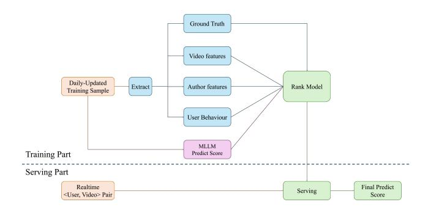
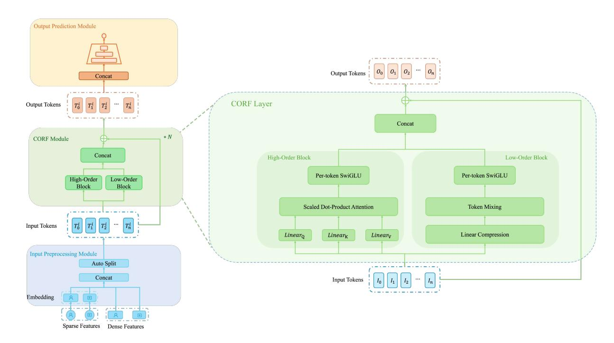

# Towards Responsible Recommendations: A Daily Updated Ranking Model for Content Issue Detection

Haoze Wu wuhaoze@tiktok.com TikTok, Inc. Shanghai, China

Chenghui Yu yuchenghui@tiktok.com TikTok, Inc. San Jose, CA, United States

Bingfeng Deng∗ dengbingfeng@tiktok.com TikTok, Inc. Singapore, Singapore

Daniel Chen daniel.chen28@tiktok.com TikTok, Inc. San Jose, CA, United States

# Abstract

Most existing content issue detection models are built upon Multimodal Large Language Models (MLLMs). Although such approaches achieve high accuracy, they often suffer from poor timeliness, limited feature richness, and high serving costs: MLLM-based models are typically updated only monthly or quarterly and rely mainly on intrinsic video features (e.g., sampled frames and captions), underutilizing post-hoc user feedback and aggregated video and authorside signals. To address these challenges, we propose a daily updated ranking model for Content Issue Detection based on a Cross-Order Representation Fusion (CORF) architecture. The model supports day-level updates and integrates user behavior features, video- and author-side information, and MLLM-generated scores as inputs. Compared with MLLM-based approaches, our model is significantly smaller and can efficiently score all videos on a daily basis. Experiments on the Adult-Content category show higher recall at the same level of precision, and online A/B tests further demonstrate reduced user exposure to such content issues, contributing to a safer and more positive viewing experience.

#### CCS Concepts

• Computing methodologies → Artificial intelligence; Ranking; • Information systems → Recommender systems.

# Keywords

Responsible Recommendation, Content Issue Detection, Daily Updated Model, Ranking Model

#### ACM Reference Format:

Haoze Wu, Chenghui Yu, Bingfeng Deng, and Daniel Chen. 2026. Towards Responsible Recommendations: A Daily Updated Ranking Model for Content Issue Detection. In Proceedings of the ACM Web Conference 2026 (WWW '26), April 13–17, 2026, Dubai, United Arab Emirates. ACM, New York, NY, USA, [4](#page-3-0) pages.<https://doi.org/10.1145/3774904.3792904>

∗Authors corresponded for this research.

[This work is licensed under a Creative Commons Attribution 4.0 International License.](https://creativecommons.org/licenses/by/4.0) WWW '26, Dubai, United Arab Emirates

© 2026 Copyright held by the owner/author(s). ACM ISBN 979-8-4007-2307-0/2026/04 <https://doi.org/10.1145/3774904.3792904>

#### 1 Introduction

In recent years, Multimodal Large Language Models (MLLMs)[\[1,](#page-3-1) [4\]](#page-3-2) have achieved remarkable progress in unifying vision and language understanding. By combining visual encoders with largescale language models and leveraging instruction tuning and chainof-thought (CoT) reasoning[\[16\]](#page-3-3), MLLMs demonstrate strong generalization, superior accuracy, and enhanced interpretability across a wide range of multimodal tasks. Their ability to jointly model textual and visual semantics has also driven substantial progress in content understanding and moderation, enabling automatic identification of inappropriate or policy-violating videos in recommendation feeds. As a result, MLLM-based methods[\[9,](#page-3-4) [14,](#page-3-5) [15\]](#page-3-6) have become the dominant paradigm for content issue detection in large-scale recommendation systems.

Despite these strengths, MLLM-based methods face key challenges in real-world moderation. First, large-scale fine-tuning and infrequent update cycles (often monthly or quarterly) hinder adaptation to emerging issues and adversarial behaviors. Second, inputs are typically limited to intrinsic video features (e.g., frames and captions), underutilizing valuable user feedback signals—such as likes, dislikes, reports, and survey responses[\[17\]](#page-3-7)—as well as authorlevel attributes that provide strong post-hoc cues. Third, the high computational cost constrains serving capacity: real-time scoring at scale is infeasible, so only a subset of high-traffic videos is evaluated, delaying the detection of newly uploaded harmful content.

To overcome these limitations, we propose a Daily Updated Ranking Model for content issue detection, which enables lightweight, timely, and comprehensive detection across all videos. The model supports day-level updates using newly collected user feedback and integrates multiple sources of information, including user behavior features, author attributes, and MLLM generated scores, into a unified ranking framework. As illustrated in Figure [1,](#page-1-0) the system comprises two main components: (1) a training part that constructs daily updated human-labeled samples, subsequently extracts video, author, and user-behavior features, and uses them together with the MLLM prediction score as inputs to the ranking model; and (2) a Serving Part that performs real-time scoring on every user–video pair to produce the final predict score. This design effectively addresses the issues of timeliness, feature richness, and serving scalability, offering a practical and responsible solution for large-scale content issue detection in recommendation systems.

To fully leverage the model's input information and enable effective feature interactions, we propose a novel Cross-Order Representation Fusion (CORF) architecture, which captures and integrates both high-order and low-order feature interactions. We first validate our approach on the governance of Adult-Content, as defined in the TikTok Community Guidelines [1](#page-1-1) . In offline evaluations, our CORF-based daily updated ranking model achieves higher recall at the same precision level. Online A/B tests further show that the model improves the detection of Adult-Content issues, contributing to a safer and more positive viewing experience without negatively affecting overall engagement. Although our primary results focus on Adult-Content issues, additional evaluations indicate that the proposed framework generalizes well to other issue types, including Clickbait and Promotional Content.

#### 2 Related Works

#### 2.1 Multimodal Large Language Models

Multimodal Large Language Models (MLLMs) combine visual encoders with large language models for unified vision–language understanding. LLaVA [\[4,](#page-3-2) [7\]](#page-3-8) introduces visual instruction tuning to align LLMs with vision encoders, showing strong generalization and reasoning across multimodal tasks. Building on this paradigm, the Qwen-VL series [\[1,](#page-3-1) [11\]](#page-3-9) employs a multilingual LLM backbone and multi-stage training to unify visual grounding, instruction following, and conversational reasoning, achieving high efficiency and adaptability in real-world applications. Meanwhile, lightweight designs such as BLIP-2[\[5\]](#page-3-10) and LLaMA-Adapter[\[19\]](#page-3-11) use parameter-efficient fine-tuning and adapter-based integration to reduce serving costs while maintaining competitive performance.

#### 2.2 Recommendation Models

Recommendation models have evolved significantly to capture complex feature interactions. Pioneering approaches like DeepFM [\[3\]](#page-3-12) and xDeepFM [\[6\]](#page-3-13) combine Factorization Machines for low-order interactions with DNNs for high-order patterns. Similarly, DCN [\[12\]](#page-3-14) focuses on explicitly modeling bounded-degree feature crosses, while AutoInt [\[8\]](#page-3-15) utilizes multi-head attention for high-order combinations. More recently, Mixture-of-Experts (MoE) architectures, such as HoME [\[13,](#page-3-16) [18\]](#page-3-17), have emerged to enhance expressiveness and adaptability by dynamically routing inputs to specialized experts. However, despite these advancements, effectively fusing representations of different orders to fully exploit their complementary strengths remains an open challenge.

#### 3 Daily Updated Ranking Model Structure

We propose a novel Cross-Order Representation Fusion (CORF) architecture to effectively capture and integrate both high-order and low-order feature interactions. The overall CORF architecture is illustrated in Figure [2.](#page-2-0) We first divide the input embedding into a sequence of �� tokens, {��0, ��1, . . . , ����−1}, which form the input matrix I ∈ R ��×�� , where �� is the sequence length and �� is the dimension of each token. The core CORF module consists of a stack of CORF layers. Each layer is designed to extract and fuse feature interactions of varying complexity. Specifically, in each layer, the input

Figure 1: The framework of our proposed Daily Updated Ranking Model.

tokens I are processed in parallel by two distinct components: a High-Order Block that captures complex, high-order feature interactions, and a Low-Order Block that models simpler, low-order relationships. The resulting representations are then concatenated to produce the layer's output tokens, O. This architecture allows the model to progressively build richer representations by combining complementary feature information at each layer.

#### 3.1 High-Order Block

Specifically, the High-Order Block first employs a scaled dot-product attention mechanism [\[10\]](#page-3-18) to capture complex, high-order relationships among the input tokens. In this mechanism, the input tokens I are projected into queries (Q), keys (K), and values (V). The output is a weighted sum of the values, where the weight for each value is determined by the dot-product similarity of its query and key. The operations of the High-Order Block for layer �� are formally defined as:

H = Attention(IW�� �� , IW�� �� , IW�� �� ) (1)

Here, H denotes the resulting high-order token representations. The matrices W�� ∈ R ��×���� , W�� ∈ R ��×���� , and W�� ∈ R ��×���� are learnable projection parameters for the query, key, and value in the attention head. The input token dimension is ��, while ����, ���� , and ���� denote the dimensionalities of the queries, keys, and values, respectively. Following standard practice in attention mechanisms, we set ���� = ���� .

Subsequently, the high-order token representations are passed through a parameter-efficient, per-token SwiGLU layer. The PerTokenSwiGLU module applies an independent SwiGLU function with unshared weights to each token position, enhancing the model's capacity to learn token-specific transformations. To further reduce the number of parameters, each PerTokenSwiGLU adopts a bottleneck architecture. The operation for the ��-th token T�� is defined as:

PerTokenSwiGLU(T��) = Swish1 (T��W1,�� + b1,��)W2,�� + b2,�� (2)

where the weights W1,�� ∈ R ��×�� and W2,�� ∈ R ��×�� are specific to token position ��, with the intermediate dimension �� being smaller than �� to create a parameter-efficient bottleneck.

The final high-order block output, denoted as H proc, is computed as:

H proc �� = PerTokenSwiGLU(H��), �� = 1, . . . , �� (3)

1<https://www.tiktok.com/community-guidelines/en-GB>

Figure 2: An overview of our proposed CORF architecture. It consists of an Input Preprocessing module, a stack of �� CORF layers, and an Output Prediction module. Each CORF layer contains parallel High-Order and Low-Order blocks capturing interactions of different complexities. Their outputs are concatenated and fused with the input through a residual connection.

#### 3.2 Low-Order Block

In contrast, the Low-Order Block is designed to model simpler, low-order feature interactions with high efficiency. As illustrated in Figure [2,](#page-2-0) it operates through a three-step process: Linear Compression, Token Mixing, and Per-token SwiGLU.

First, to reduce computational cost, a linear compression layer projects the input tokens I ∈ R ��×�� to a shorter sequence of tokens Icomp ∈ R ′×�� , where �� ′ &lt; ��. This is achieved by multiplying the input tokens with a learnable projection matrix P ∈ R ′×�� . The compressed tokens are then processed by a Token Mixing mechanism, a technique adapted from RankMixer [\[20\]](#page-3-19), to facilitate information exchange across tokens in a computationally efficient manner while enhancing inter-token diversity. The operations are formally defined as:

L = TokenMixing(Icomp) (4)

Here, L represents the resulting low-order token representations.

Similar to the high-order block, the low-order token representations are passed through a per-token SwiGLU layer to obtain the final low-order block output L proc, as defined by the following equation:

L proc �� = PerTokenSwiGLU( (Li)) �� = 1, . . . , ��′ (5)

The final step within each CORF layer is to concatenate the computed high-order H proc and low-order L proc representations along the token dimension, followed by integrating integrating the result with the layer's original input through a residual connection.

#### 4 Experiment

#### 4.1 Experimental Setup

4.1.1 Training&Test Datasets. We first apply this method to Adult-Content issue governance. We use 4 million videos with humanreviewed labels to fine-tune the MLLM and obtain its predicted scores. These data are then used to train our Daily Updated Rank Model. Following initialization, the Rank Model is updated daily with approximately 200K new samples added each day. For evaluation, we construct a test set by re-sampling 20K videos, ensuring no overlap with the training data.

4.1.2 Evaluation Metrics. We comprehensively evaluate our model through both offline and online experiments. In the offline evaluation, we examine recall at different precision levels alongside model size to assess the balance between performance and efficiency. In the online A/B testing, we further validate the model's real-world effectiveness using core metrics such as user Stay Duration (SD) and Ecosystem Negative View Rate (ENVR), which respectively measure user engagement and the proportion of views associated with undesirable or low-quality content.

4.1.3 Implementation Details. Our proposed model is implemented in TensorFlow with two CORF layers to balance effectiveness and real-time serving requirements for user–video pairs in TikTok's For You feed. We use RMSProp with a learning rate of 0.01 and a batch size of 256, training on 8 NVIDIA A100 GPUs. In production, the model is updated daily and deployed on approximately 150 NVIDIA A100 GPUs to maintain freshness at scale.

Table 1: Comparison of our CORF-based daily updated rank model with MLLM-based models in terms of recall rate at different precision levels.

|              | Params (M) | @P30   | Recall Rate @P40 | @P50   |
|--------------|------------|--------|------------------|--------|
| VLMo-Base    | 175        | 22.82% | 13.64%           | 10.82% |
| Qwen2.5-0.5B | 500        | 26.12% | 19.53%           | 14.59% |
| CORF (ours)  | 1.8        | 29.41% | 22.35%           | 17.17% |

Table 2: Online A/B test results comparing our CORF-based daily updated rank model with the MLLM-based baseline on Adult-Content issue governance.

#### 4.2 Comparisons with MLLM-based Models

We compare our proposed CORF-based daily updated rank model with two lightweight MLLM-based backbones, VLMo-Base [\[2\]](#page-3-20) and Qwen2.5-0.5B [\[1\]](#page-3-1), on the Adult-Content issue category. Both were among the highest-performing open-source models available for this use case at the time. As shown in Table [1,](#page-3-21) our CORF-based model achieves the best overall performance while being orders of magnitude smaller. With only 1.8M parameters, it consistently surpasses the MLLM-based baselines across all precision levels, demonstrating strong representational capability, computational efficiency, and scalability for real-time, large-scale deployment. Moreover, its daily update mechanism enables rapid adaptation to emerging content patterns, ensuring sustained relevance and robustness in dynamic online environments.

# 4.3 Online AB Test Results

Table [2](#page-3-22) presents the online A/B test results for Adult-Content issue governance, comparing our CORF-based daily updated rank model with the MLLM-based baseline Qwen2.5-0.5B. Our model achieves a lower SD loss (–0.047% vs. –0.051%), indicating a smaller impact on user watch time while maintaining ranking effectiveness. More importantly, it delivers substantially larger reductions in ENVR (–0.402% vs. –0.253%) and ENVR@Adult-Content (–3.593% vs. –2.873%). These improvements demonstrate the model's enhanced ability to surface Adult-Content issue while minimizing negative effects on user engagement. Overall, the results highlight the effectiveness of the CORF architecture and the daily update mechanism for real-time, large-scale content quality governance.

# 5 Fairness Discussion

By incorporating posterior user behavior, our approach reduces inadvertent misclassification compared to MLLM-based models. Recognizing that content perception is inherently subjective, future iterations will incorporate user-level demographics (e.g., age, gender, and region) and integrate survey-based labels to further enhance user-centric fairness.

#### References

[1] Shuai Bai, Keqin Chen, Xuejing Liu, Jialin Wang, Wenbin Ge, Sibo Song, Kai Dang, Peng Wang, Shijie Wang, Jun Tang, et al. 2025. Qwen2. 5-vl technical report. arXiv preprint arXiv:2502.13923 (2025). [2] Hangbo Bao, Wenhui Wang, Li Dong, Qiang Liu, Owais Khan Mohammed, Kriti Aggarwal, Subhojit Som, Songhao Piao, and Furu Wei. 2022. Vlmo: Unified vision-language pre-training with mixture-of-modality-experts. Advances in neural information processing systems 35 (2022), 32897–32912. [3] Huifeng Guo, Ruiming Tang, Yunming Ye, Zhenguo Li, and Xiuqiang He. 2017. DeepFM: a factorization-machine based neural network for CTR prediction. arXiv preprint arXiv:1703.04247 (2017). [4] Bo Li, Yuanhan Zhang, Dong Guo, Renrui Zhang, Feng Li, Hao Zhang, Kaichen Zhang, Peiyuan Zhang, Yanwei Li, Ziwei Liu, et al. 2024. Llava-onevision: Easy visual task transfer. arXiv preprint arXiv:2408.03326 (2024). [5] Junnan Li, Dongxu Li, Silvio Savarese, and Steven Hoi. 2023. Blip-2: Bootstrapping language-image pre-training with frozen image encoders and large language models. In International conference on machine learning. PMLR, 19730–19742. [6] Jianxun Lian, Xiaohuan Zhou, Fuzheng Zhang, Zhongxia Chen, Xing Xie, and Guangzhong Sun. 2018. xdeepfm: Combining explicit and implicit feature interactions for recommender systems. In Proceedings of the 24th ACM SIGKDD international conference on knowledge discovery & data mining. 1754–1763. [7] Haotian Liu, Chunyuan Li, Qingyang Wu, and Yong Jae Lee. 2023. Visual instruction tuning. Advances in neural information processing systems 36 (2023), 34892–34916. [8] Weiping Song, Chence Shi, Zhiping Xiao, Zhijian Duan, Yewen Xu, Ming Zhang, and Jian Tang. 2019. Autoint: Automatic feature interaction learning via selfattentive neural networks. In Proceedings of the 28th ACM international conference on information and knowledge management. 1161–1170. [9] Yu Sun, Yin Li, Ruixiao Sun, Chunhui Liu, Fangming Zhou, Ze Jin, Linjie Wang, Xiang Shen, Zhuolin Hao, and Hongyu Xiong. 2025. Audio-Enhanced Vision-Language Modeling with Latent Space Broadening for High Quality Data Expansion. In Proceedings of the 31st ACM SIGKDD Conference on Knowledge Discovery and Data Mining V. 2. 4872–4881. [10] Ashish Vaswani, Noam Shazeer, Niki Parmar, Jakob Uszkoreit, Llion Jones, Aidan N Gomez, Łukasz Kaiser, and Illia Polosukhin. 2017. Attention is all you need. Advances in neural information processing systems 30 (2017). [11] Peng Wang, Shuai Bai, Sinan Tan, Shijie Wang, Zhihao Fan, Jinze Bai, Keqin Chen, Xuejing Liu, Jialin Wang, Wenbin Ge, et al. 2024. Qwen2-vl: Enhancing vision-language model's perception of the world at any resolution. arXiv preprint arXiv:2409.12191 (2024). [12] Ruoxi Wang, Bin Fu, Gang Fu, and Mingliang Wang. 2017. Deep & cross network for ad click predictions. In Proceedings of the ADKDD'17. 1–7. [13] Xu Wang, Jiangxia Cao, Zhiyi Fu, Kun Gai, and Guorui Zhou. 2024. HoME: Hierarchy of Multi-Gate Experts for Multi-Task Learning at Kuaishou. arXiv preprint arXiv:2408.05430 (2024). [14] Zixuan Wang, Jinghao Shi, Hanzhong Liang, Xiang Shen, Vera Wen, Zhiqian Chen, Yifan Wu, Zhixin Zhang, and Hongyu Xiong. 2025. Filter-And-Refine: A MLLM Based Cascade System for Industrial-Scale Video Content Moderation. In Proceedings of the 63rd Annual Meeting of the Association for Computational Linguistics (Volume 6: Industry Track). 873–880. [15] Zixuan Wang, Yu Sun, Hongwei Wang, Baoyu Jing, Xiang Shen, Xin Luna Dong, Zhuolin Hao, Hongyu Xiong, and Yang Song. 2025. Reasoning-Enhanced Domain-Adaptive Pretraining of Multimodal Large Language Models for Short Video Content Governance. In Proceedings of the 2025 Conference on Empirical Methods in Natural Language Processing: Industry Track. 1104–1112. [16] Jason Wei, Xuezhi Wang, Dale Schuurmans, Maarten Bosma, Fei Xia, Ed Chi, Quoc V Le, Denny Zhou, et al. 2022. Chain-of-thought prompting elicits reasoning in large language models. Advances in neural information processing systems 35 (2022), 24824–24837. [17] Chenghui Yu, Peiyi Li, Haoze Wu, Yiri Wen, Bingfeng Deng, and Hongyu Xiong. 2024. USM: Unbiased Survey Modeling for Limiting Negative User Experiences in Recommendation Systems. arXiv preprint arXiv:2412.10674 (2024). [18] Chenghui Yu, Haoze Wu, Jian Ding, Bingfeng Deng, and Hongyu Xiong. 2025. Unified Survey Modeling to Limit Negative User Experiences in Recommendation Systems. In Proceedings of the Nineteenth ACM Conference on Recommender Systems. 1104–1107. [19] Renrui Zhang, Jiaming Han, Chris Liu, Peng Gao, Aojun Zhou, Xiangfei Hu, Shilin Yan, Pan Lu, Hongsheng Li, and Yu Qiao. 2023. Llama-adapter: Efficient fine-tuning of language models with zero-init attention. arXiv preprint arXiv:2303.16199 (2023). [20] Jie Zhu, Zhifang Fan, Xiaoxie Zhu, Yuchen Jiang, Hangyu Wang, Xintian Han, Haoran Ding, Xinmin Wang, Wenlin Zhao, Zhen Gong, et al. 2025. Rankmixer: Scaling up ranking models in industrial recommenders. In Proceedings of the 34th ACM International Conference on Information and Knowledge Management. 6309–6316.