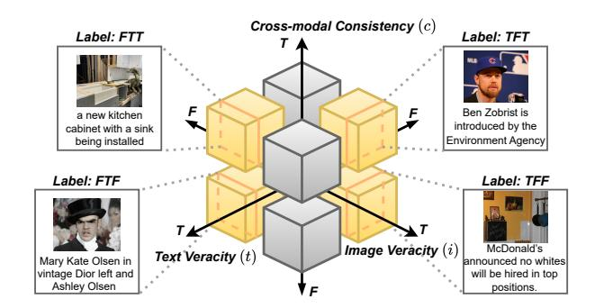
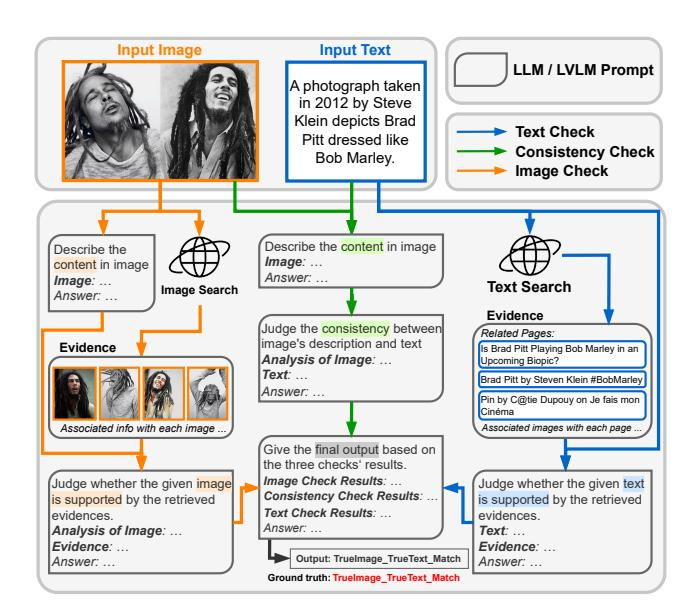

# An 8-Way Taxonomy for Multimodal Disinformation and Detection Benchmark

[Shuhan Cui](https://orcid.org/0009-0007-1245-5431) The University of Tokyo Tokyo, Japan syokan@g.ecc.u-tokyo.ac.jp

[Ruimin Chu](https://orcid.org/0009-0007-1738-6148) AI inside Inc. Tokyo, Japan ruimin.chu@inside.ai

[Hanrui Wang](https://orcid.org/0009-0005-0498-2712) National Institute of Informatics Tokyo, Japan hanrui\_wang@nii.ac.jp

[Patrick H. Chen](https://orcid.org/0000-0002-6247-6317) Binghamton University Binghamton, NY, United States patrickchen@binghamton.edu

[Ching-Chun Chang](https://orcid.org/0000-0001-7723-4591) National Institute of Informatics Tokyo, Japan ccchang@nii.ac.jp

[Isao Echizen](https://orcid.org/0000-0003-4908-1860) National Institute of Informatics Tokyo, Japan iechizen@nii.ac.jp

### Abstract

Multimodal disinformation may arise from the image, the text, or their cross-modal consistency, and these aspects can mislead either alone or in combination. However, existing research has not considered the full range of such combinations, leaving current methods vulnerable to unseen combinations. To address this gap, we propose a tri-axis formulation that explicitly separates image veracity, text veracity, and cross-modal consistency, yielding an 8-way space that fully enumerates all cases and turns multimodal disinformation detection, formerly a coarse, multi-label problem, into a well-defined, mutually exclusive classification task. To support this formulation, we construct OctantFake, an 8-way dataset sourced from 16 datasets with complete label coverage and broad class diversity. Experiments show that existing methods struggle on this challenging dataset. Building on this dataset, we introduce OctantAgent, an LVLM-based parallel framework with three modules, image check, text check, and consistency check, whose predictions are fused into an 8-way decision, achieving clear improvements over existing LVLM-based methods. Together, these contributions introduce an interpretable and exhaustive 8-way perspective that provides a solid foundation for analyzing multimodal disinformation.

### CCS Concepts

- Information systems → Multimedia information systems; Computing methodologies → Artificial intelligence.

## Keywords

Multimodal Disinformation, Dataset Benchmark, Fake News Detection, Taxonomy, Large Vision-Language Models (LVLMs)

#### ACM Reference Format:

Shuhan Cui, Ruimin Chu, Hanrui Wang, Patrick H. Chen, Ching-Chun Chang, and Isao Echizen. 2026. An 8-Way Taxonomy for Multimodal Disinformation and Detection Benchmark. In Proceedings of the ACM Web Conference 2026 (WWW '26), April 13–17, 2026, Dubai, United Arab Emirates. ACM, New York, NY, USA, [4](#page-3-0) pages.<https://doi.org/10.1145/3774904.3792906>

[This work is licensed under a Creative Commons Attribution 4.0 International License.](https://creativecommons.org/licenses/by/4.0) WWW '26, Dubai, United Arab Emirates © 2026 Copyright held by the owner/author(s). ACM ISBN 979-8-4007-2307-0/2026/04 <https://doi.org/10.1145/3774904.3792906>

### 1 Introduction

In recent years, the spread of disinformation has led to significant social issues in various fields [\[9\]](#page-3-1). In particular, with the advancement of generative AI, disinformation becomes multimodal, making it more persuasive, as humans tend to perceive multimodal content as more credible. To address this challenge, various datasets have been proposed to support the development of multimodal disinformation detection systems. Despite this progress, prevailing datasets still have several limitations. First, most datasets focus on a single application domain, despite prior work showing that detection accuracy degrades sharply when instances from unseen domains are present [\[3\]](#page-3-2). This limitation calls for a more diverse dataset that consolidates multiple domains for fair evaluations. However, existing datasets adopt different definitions of disinformation and typically provide only coarse-grained labels, making straightforward combination difficult. Second, forgery in prior multimodal datasets generally arises from a single modality at a time [\[10\]](#page-3-3), whereas in practice, both modalities may be forged. This single-source view of veracity fails to capture the complexity of real-world multimodal disinformation, potentially leading to biased evaluation.

To address these limitations, we contribute the following efforts: (i) An 8-way tri-axis formulation: We introduce a tri-axis formulation that separates image veracity, text veracity, and crossmodal consistency. Enumerating all combinations defines an 8-way label space that fully characterizes how multimodal disinformation can arise. This closed, mutually exclusive label space recasts multimodal disinformation detection as a single-label classification task, making errors explicitly attributable along the three axes, thereby enabling controlled diagnostics and principled comparisons.

(ii) A benchmark dataset, OctantFake: Building on the 8-way formulation, we construct a novel dataset, OctantFake, by consolidating widely used multimodal datasets via deterministic mapping and conservative filtering. We construct a diverse and compositionally complete dataset for evaluating fact-checking systems.

(iii) A novel pipeline OctantAgent: Existing approaches struggle to disentangle error sources and break down on multi-aspect disinformation, so we propose OctantAgent, a modular LVLM-based pipeline that runs three evidence-guided checks in parallel. We evaluate existing LVLM baselines and OctantAgent under a unified zero-shot setting with scale-matched backbones. Empirical results show that OctantAgent consistently outperforms other baselines, which experience dramatic drops on our challenging benchmark.

Figure 1: Illustration of the tri-axis veracity space and representative examples from OctantFake. The three axes correspond to image veracity (��), text veracity (��), and cross-modal consistency (��), each taking binary values in {�� (�� ������), �� (����������)}. Here, we display four representative examples; the full taxonomy contains eight combinations.

#### 2 OctantFake Dataset

#### 2.1 Tri-Axis Formulation and 8-Way Label Space

The core idea of our tri-axis formulation is to model the variability of text ��, image ��, and cross-modal consistency �� as three independent axes, as multimodal disinformation may arise from any combination of these factors. For the text �� and image �� veracity axes, we define ��, �� ∈ {�� , �� }, where �� (False) indicates a verifiable factual violation and�� (True) means that no violation is detected under a fixed verification budget. For the consistency axis, we define �� ∈ {�� , �� }, where �� and �� indicate cross-modal match and mismatch, respectively, independent of either modality's standalone veracity. With these three axes, each sample is labeled as (��, ��, ��) ∈ {�� , �� } 3 . These eight categories form an exhaustive enumeration of image, text, and consistency veracity. Thus, any text-image multimodal disinformation sample can be assigned a label under this framework, allowing us to easily consolidate different existing datasets (as illustrated in Figure [1\)](#page-1-0). The detailed veracity definition is as follows:

Image veracity (��): We set �� = �� when an image presented as evidence about real entities, events, or states contradicts verifiable facts (e.g., incorrect identity, location, time, quantity, causality, or manipulations like face swaps or attribute edits). Cosmetic adjustments (e.g., brightness or contrast) do not constitute disinformation. For AI-generated images, �� = �� applies only when the modification introduces a verifiable factual violation; otherwise �� =�� .

Text veracity (��): We set �� = �� when the text asserts a verifiable falsehood (e.g., fabricated or incorrect claims); otherwise �� =�� .

Cross-modal consistency (��): We set�� =�� when the image and text describe the same situation, and �� = �� when salient anchors, such as entity, event, time, or place, differ between them. Note that consistency evaluates only semantic alignment between modalities, independent of their standalone factuality. Thus, a text–image mismatch sets �� = �� but does not imply �� = �� or �� = �� .

#### 2.2 Dataset Construction

We adopt a quality-first construction strategy, prioritizing label accuracy, naturally occurring multimodal pairs, and broad source diversity. Following this strategy, we build OctantFake in two stages: (i) mapping existing multimodal datasets into the 8-way label space with consistency filtering, and (ii) filling missing labels by pairing samples from single-modality sources.

Multimodal sources and 8-way mapping: We begin by drawing directly from existing multimodal datasets, as they provide naturally occurring image–text pairs with reliable human annotations. To ensure label trustworthiness, we select datasets that contain objectively verifiable information regarding the veracity of images and text. After filtering, we retain six datasets: MEIR [\[16\]](#page-3-4), NewsClippings [\[11\]](#page-3-5), COSMOS [\[1\]](#page-3-6), DGM4 [\[17\]](#page-3-7), VERITE [\[13\]](#page-3-8), and MMFakeBench [\[10\]](#page-3-3). Their annotations are then mapped into our (��, ��, ��) label space using deterministic rules. However, since most datasets do not provide cross-modal consistency labels, we apply a CLIP-based auxiliary filter [\[15\]](#page-3-9): we compute image–text cosine similarity (CLIP ViT-B/32) and retain high-confidence pairs (similarity higher than 0.32) as matched, and low-confidence pairs (similarity lower than 0.22) as unmatched, with thresholds estimated from the similarity distributions of NewsClippings [\[11\]](#page-3-5) and COSMOS [\[1\]](#page-3-6).

Pair-based construction of missing classes: After mapping the six multimodal datasets, two classes�� �� �� and �� �� �� remain empty. To construct the missing classes, we create four single-modality pools following the veracity definitions in Section [2.1:](#page-1-1) a disinformative and a non-disinformative text pool (���� , ���� ), and a disinformative and a non-disinformative image pool (���� , ���� ). Text pools (���� and ���� ) are drawn from LIAR [\[21\]](#page-3-10), FakeNewsNet [\[18\]](#page-3-11), PolitiFact [\[5\]](#page-3-12), and WELFake [\[20\]](#page-3-13), and image pools (���� and ���� ) come from realimage datasets (MS-COCO [\[8\]](#page-3-14), OpenImages v7 [\[6\]](#page-3-15), FACTIFY [\[19\]](#page-3-16)) and fake-image datasets (PS-Battles [\[7\]](#page-3-17), Fakeddit [\[12\]](#page-3-18), DF2023 [\[4\]](#page-3-19), DGM4 [\[17\]](#page-3-7)). Then, we randomly pair images and texts from the corresponding pools and filter each candidate pair using the same CLIP-based auxiliary filter described above. Only pairs whose crossmodal consistency satisfies the required mismatch condition are retained. Throughout the construction process, we continuously remove duplicate images and texts to avoid repetition across sources.

Data Split Design: Finally, we obtain a balanced 8-way dataset with 1,100 pairs per class, yielding 800 calibration and 8,000 test examples. We intentionally provide no training split, as multimodal disinformation detection in realistic settings is inherently a zeroshot problem: manipulation styles and content evolve quickly, and training-based methods often degrade on truly unseen cases. Accordingly, our benchmark targets unseen evaluation rather than training or fine-tuning. Instead, we include a small calibration set (i.e., a "dev set") solely to verify pipeline correctness, adjust prompt formats, and stabilize inference before testing.

#### 3 OctantAgent for Disinformation Detection

We present OctantAgent, a modular LVLM-based pipeline (Figure [2\)](#page-2-0) that follows a separation-of-concerns principle: image veracity, text veracity, and cross-modal consistency are evaluated independently, keeping error sources disentangled and decisions interpretable. Given an image–text pair, the agent runs three parallel checks, and each check produces a tuple (��(· ), ��(· ), ��(· )) denoting the decision, confidence score, and explanation.

Image check: Given the input image, we utilize the LVLM to produce a description summarizing the image's salient objects, scene cues, and any manipulation artifacts. We also perform a

Figure 2: The OctantAgent TriLine pipeline, combining image, text, and consistency checks with evidence retrieval.

Google Image Search to retrieve pages containing exact or nearexact copies of the image, and collect their captions, titles, and surrounding text as evidence. Finally, given the image description and evidence, the LVLM determines whether any objective fact contradicts the image and outputs (���� , ���� , ����).

Text check: Given the input text, we first perform a Google Search, retrieve the top–�� pages (empirically �� = 3), and extract their titles, captions, and texts as evidence. The text and the organized evidence are then fed to the LLM, which determines whether any objective fact contradicts the text and outputs (���� , ���� , ���� ).

Consistency check: Given the input image and text, we also use the LVLM to generate an image description. Using the image description and text, the LLM then determines whether the image and text are aligned and outputs (���� , ���� , ���� ).

After obtaining the three tuples (��(· ), ��(· ), ��(· )), the aggregator LLM consumes these summaries and produces the final 8-way label.

#### 4 Evaluation

Configuration: We compare OctantAgent against representative LLM/LVLM-based multimodal disinformation detection methods, including SNIFFER [\[14\]](#page-3-20), FKA-Owl [\[9\]](#page-3-1), DEFAME [\[2\]](#page-3-21), and MMD-Agent [\[10\]](#page-3-3). To ensure a fair comparison, all methods are evaluated using matched backbone scales (7B and 34B), thereby isolating pipeline design from raw LVLM capacity. We further include GPT-4V as a practical proprietary reference to reflect real-world deployment scenarios. All methods are evaluated in a strictly zero-shot setting on unseen samples, without any task-specific fine-tuning. We formulate the task as an 8-way classification problem. Macro-F1 is the primary metric; macro-precision and macro-recall are also reported. All values are rounded to one decimal place.

Results: First, we examine the limitations of existing disinformation detection methods on our OctantFake dataset. As shown in Table [1,](#page-3-22) even when equipped with the powerful GPT-4V backbone, prior approaches [\[2,](#page-3-21) [9,](#page-3-1) [10,](#page-3-3) [14\]](#page-3-20) achieve only 45.5% macro-F1 and 49.1% precision on OctantFake, which is dramatically lower than their performance on individual datasets (e.g., DEFAME reaches 83.9% F1 on VERITE [\[2\]](#page-3-21), and FKA-Owl obtains 78.5% accuracy on DGM4 [\[10\]](#page-3-3)). This sharp drop highlights the increased difficulty of OctantFake, which (i) integrates heterogeneous domains from multiple sources and (ii) provides an exhaustive enumeration of multimodal disinformation types, thereby constituting a substantially more challenging and diagnostic benchmark than prior works.

To tackle the challenges posed by the OctantFake dataset, we further propose OctantAgent. As shown in Table [1,](#page-3-22) OctantAgent consistently achieves the best performance among all baselines across all reported metrics and model scales on OctantFake, with the largest gains of +3.7% in macro-F1 and +5.2% in macro-precision observed on the test set under the proprietary setting. In addition, we observe that increasing backbone capacity consistently boosts detection performance across all methods. This trend suggests that, as LLM and LVLM capabilities continue to advance, the effectiveness of our approach will further improve accordingly.

#### 5 Related Work

Multimodal Disinformation Datasets: Text-image disinformation datasets have evolved from coarse binary labels to fine-grained labels. Early datasets such as NewsCLIPpings [\[11\]](#page-3-5) and COSMOS [\[1\]](#page-3-6) focus solely on binary OOC detection without considering factual veracity. Later work expands the space of manipulations, including caption replacement, entity swapping [\[16\]](#page-3-4), and Photoshop editing [\[7\]](#page-3-17), but still provides binary labels centered on single-source manipulation. Early fine-grained datasets emphasize the diversity of disinformation instead of the number of sources. For example, VERITE [\[13\]](#page-3-8) distinguishes categories such as miscaption and out-ofcontext, but both arise purely from textual manipulation. Fakeddit [\[12\]](#page-3-18) defines fine-grained labels; however, an instance may have multiple labels, making comparison difficult. MMFakeBench [\[10\]](#page-3-3) is the first to consider three manipulation sources—text, image, and consistency. However, each instance still contains corruption from only one source at a time, and the benchmark does not cover all 8 combinations defined in our work.

Multimodal Disinformation Detection: Prior multimodal disinformation detectors typically follow a pipeline of: (1) checking image–text consistency, (2) retrieving external evidence, and (3) making a final prediction [\[2\]](#page-3-21). Many methods rely on vision–language encoders like CLIP to perform internal checks and use Web APIs to enrich contextual information [\[14\]](#page-3-20). With the rise of large vision–language models (LVLMs), recent disinformation approaches increasingly adopt LVLMs (e.g., LLaVA, ChatGPT) [\[2\]](#page-3-21). For example, SNIFFER [\[14\]](#page-3-20) fine-tunes an LVLM for both detection and explanation; FKA-Owl injects forgery-specific knowledge to improve crossdomain robustness; MMD-Agent designs a three-stage prompting pipeline; and DEFAME [\[2\]](#page-3-21) decomposes claim check into a six-stage tool-using procedure. These methods demonstrate strong capabilities and therefore serve as reasonable baselines for our benchmark.

#### 6 Conclusion

We presented an 8-way formulation for multimodal disinformation analysis, capturing the veracity of image, text, and their consistency.

Table 1: Zero-shot multimodal disinformation classification results on the 8-way OctantFake dataset. Macro-averaged F1 / Precision / Recall (%) are reported (1 decimal). The calibration and test sets contain 800 and 8,000 samples, respectively.

| Size               | Detection Approach | Model Name  | Language            | Model F1 | Calibration Precision | (800) Recall | F1   | Test (8,000) Precision | Recall |
|--------------------|--------------------|-------------|---------------------|----------|-----------------------|--------------|------|------------------------|--------|
| 7B Models          |                    |             |                     |          |                       |              |      |                        |        |
| SNIFFER            | [14]               | VILA        | LLaMA2-7B           | 20.8     | 26.0                  | 18.2         | 19.1 | 24.5                   | 17.4   |
| FKA-Owl            | [9]                | ImageBind + | Vicuna Vicuna-7B    | 17.2     | 22.8                  | 15.1         | 16.5 | 22.0                   | 14.3   |
| DEFAME             | [2]                | LLaVA       | llava-onevision-7B  | 16.8     | 21.0                  | 15.6         | 17.4 | 21.5                   | 16.3   |
| MMD-AGENT          | [10]               | LLaVA-1.6   | Vicuna-7B           | 15.3     | 18.4                  | 14.0         | 15.1 | 20.4                   | 12.2   |
| OctantAgent        | (Ours)             | LLaVA-1.6   | Vicuna-7B           | 21.7     | 26.8                  | 20.6         | 20.4 | 25.5                   | 19.6   |
| 34B Models         |                    |             |                     |          |                       |              |      |                        |        |
| SNIFFER            | [14]               | VILA        | LLaMA2-34B          | 28.7     | 33.1                  | 27.0         | 27.9 | 32.0                   | 26.2   |
| FKA-Owl            | [9]                | ImageBind + | Vicuna Vicuna-34B   | 26.1     | 31.3                  | 24.5         | 26.9 | 31.1                   | 25.5   |
| DEFAME             | [2]                | LLaVA       | llava-onevision-34B | 24.4     | 29.4                  | 23.1         | 24.1 | 28.5                   | 22.4   |
| MMD-AGENT          | [10]               | LLaVA-1.6   | Vicuna-34B          | 23.2     | 27.1                  | 21.4         | 22.2 | 26.1                   | 20.6   |
| OctantAgent        | (Ours)             | LLaVA-1.6   | Vicuna-34B          | 31.6     | 36.9                  | 30.4         | 30.1 | 35.2                   | 28.7   |
| Proprietary Models |                    |             |                     |          |                       |              |      |                        |        |
| SNIFFER            | [14]               | GPT-4V      | ChatGPT             | 45.9     | 50.3                  | 44.0         | 44.1 | 48.9                   | 42.1   |
| FKA-Owl            | [9]                | GPT-4V      | ChatGPT             | 47.8     | 51.1                  | 46.2         | 45.5 | 49.1                   | 44.0   |
| DEFAME             | [2]                | GPT-4V      | ChatGPT             | 43.8     | 49.0                  | 41.1         | 42.9 | 47.5                   | 40.6   |
| MMD-AGENT          | [10]               | GPT-4V      | ChatGPT             | 41.5     | 47.4                  | 39.3         | 40.6 | 44.8                   | 38.2   |
| OctantAgent        | (Ours)             | GPT-4V      | ChatGPT             | 50.7     | 55.9                  | 49.7         | 49.2 | 54.3                   | 47.6   |

To support this formulation, we introduced OctantFake, a compositionally complete dataset built by mapping and filtering existing datasets into a substantially more challenging benchmark. We further proposed OctantAgent, an LVLM-based pipeline that separates text, image, and consistency checks into independent, evidenceguided modules. Experiments show that existing approaches suffer a sharp performance drop on OctantFake, while OctantAgent consistently outperforms strong baselines, validating the difficulty of our dataset and the effectiveness of our method. Future work includes expanding OctantFake to broader domains and developing

more adaptive approaches for robust multimodal fact-checking. Acknowledgments This work was partially supported by JSPS KAKENHI Grants JP21H04907 and JP24H00732, by JST CREST Grants JPMJCR20D3 and JPMJCR2562 including AIP challenge program, by JST AIP Acceleration Grant JPMJCR24U3, and by JST K Program Grant JPMJKP24C2 Japan. References [1] Shivangi Aneja, Chris Bregler, and Matthias Nießner. 2023. COSMOS: catching out-of-context image misuse using self-supervised learning. In Proceedings of the AAAI Conference on Artificial Intelligence. 14084–14092. [2] Tobias Braun, Mark Rothermel, Marcus Rohrbach, and Anna Rohrbach. 2025. DEFAME: Dynamic Evidence-based FAct-checking with Multimodal Experts. In Proceedings of the 42nd International Conference on Machine Learning (ICML), Vol. 267. 5383–5417. [3] Shuhan Cui, Hanrui Wang, Ching-Chun Chang, Huy H. Nguyen, and Isao Echizen. 2025. A Multilingual, Multimodal Dataset for Disinformation and Out-of-Context Analysis with Rich Supportive Information. In Proceedings of the 27th International Conference on Multimodal Interaction (ICMI). 643–651. [4] David Fischinger and Martin Boyer. 2023. DF-Net: The Digital Forensics Network for Image Forgery Detection. In 25th Irish Machine Vision and Image Processing Conference (IMVIP). 120–127. [5] Sonal Garg and Dilip Kumar Sharma. 2020. New Politifact: A Dataset for Counterfeit News. In 2020 9th International Conference on System Modeling and Advancement in Research Trends (SMART). 17–22. [6] Google. 2022. Open Images Dataset V7. [https://storage.googleapis.com/](https://storage.googleapis.com/openimages/web/download_v7.html) [openimages/web/download\\_v7.html.](https://storage.googleapis.com/openimages/web/download_v7.html) Accessed: 2025-11-16. [7] Silvan Heller, Luca Rossetto, and Heiko Schuldt. 2018. The PS-Battles Dataset – an Image Collection for Image Manipulation Detection. CoRR abs/1804.04866 (2018), 10 pages. arXiv[:1804.04866](https://arxiv.org/abs/1804.04866)<http://arxiv.org/abs/1804.04866> [8] Tsung-Yi Lin, Michael Maire, Serge Belongie, James Hays, Pietro Perona, Deva Ramanan, Piotr Dollár, and C. Lawrence Zitnick. 2014. Microsoft COCO: Common Objects in Context. In European Conference on Computer Vision (ECCV). 740–755. [9] Xuannan Liu, Peipei Li, Huaibo Huang, Zekun Li, Xing Cui, Jiahao Liang, Lixiong Qin, Weihong Deng, and Zhaofeng He. 2024. FKA-Owl: Advancing Multimodal Fake News Detection through Knowledge-Augmented LVLMs. In Proceedings of the 32nd ACM International Conference on Multimedia (ACM MM). 10154–10163. [10] Xuannan Liu, Zekun Li, Pei Pei Li, Huaibo Huang, Shuhan Xia, Xing Cui, Linzhi Huang, Weihong Deng, and Zhaofeng He. 2025. MMFakeBench: A Mixed-Source Multimodal Misinformation Detection Benchmark for LVLMs. In The Thirteenth International Conference on Learning Representations (ICLR 2025). 10 pages. [11] Grace Luo, Trevor Darrell, and Anna Rohrbach. 2021. NewsCLIPpings: Automatic Generation of Out-of-Context Multimodal Media. In Proceedings of the 2021 Conference on Empirical Methods in Natural Language Processing (EMNLP). 6801– 6817. [12] Kai Nakamura, Sharon Levy, and William Yang Wang. 2020. Fakeddit: A New Multimodal Benchmark Dataset for Fine-grained Fake News Detection. In Proceedings of the Twelfth Language Resources and Evaluation Conference (LREC). 6149–6157. [13] Stefanos-Iordanis Papadopoulos, Christos Koutlis, Symeon Papadopoulos, and Panagiotis C Petrantonakis. 2024. Verite: a robust benchmark for multimodal misinformation detection accounting for unimodal bias. International Journal of Multimedia Information Retrieval 13, 1 (2024), 4. [14] Peng Qi, Zehong Yan, Wynne Hsu, and Mong Li Lee. 2024. Sniffer: Multimodal Large Language Model for Explainable Out-of-Context Misinformation Detection. In Proceedings of the IEEE/CVF Conference on Computer Vision and Pattern Recognition (CVPR). 13052–13062. [15] Alec Radford, Jong Wook Kim, Chris Hallacy, Aditya Ramesh, Gabriel Goh, Sandhini Agarwal, Girish Sastry, Amanda Askell, Pamela Mishkin, Jack Clark, et al. 2021. Learning Transferable Visual Models from Natural Language Supervision. In International Conference on Machine Learning (ICML). 8748–8763. [16] Ekraam Sabir, Wael AbdAlmageed, Yue Wu, and Prem Natarajan. 2018. Deep Multimodal Image-Repurposing Detection. In Proceedings of the 26th ACM International Conference on Multimedia (ACM MM). 1337–1345. [17] Rui Shao, Tianxing Wu, and Ziwei Liu. 2023. Detecting and Grounding Multi-Modal Media Manipulation. In Proceedings of the IEEE/CVF Conference on Computer Vision and Pattern Recognition (CVPR). 6904–6913. [18] Kai Shu, Deepak Mahudeswaran, Suhang Wang, Dongwon Lee, and Huan Liu. 2020. Fakenewsnet: A data repository with news content, social context, and spatiotemporal information for studying fake news on social media. Big data 8, 3 (2020), 171–188. [19] S. Suryavardan, Shreyash Mishra, Parth Patwa, Megha Chakraborty, Anku Rani, Aishwarya Naresh Reganti, Aman Chadha, Amitava Das, Amit P. Sheth, Manoj Chinnakotla, Asif Ekbal, and Srijan Kumar. 2023. Factify 2: A Multimodal Fake News and Satire News Dataset. In Proceedings of the 2nd Workshop on Multimodal Fact Checking and Hate Speech Detection (DeFactify2) at AAAI 2023. 8 pages. [20] Pawan Kumar Verma, Prateek Agrawal, Ivone Amorim, and Radu Prodan. 2021. WELFake: word embedding over linguistic features for fake news detection. IEEE Transactions on Computational Social Systems 8, 4 (2021), 881–893. [21] William Yang Wang. 2017. "Liar, Liar Pants on Fire": A New Benchmark Dataset for Fake News Detection. In Proceedings of the 55th Annual Meeting of the Association for Computational Linguistics (Volume 2: Short Papers). 422–426.

