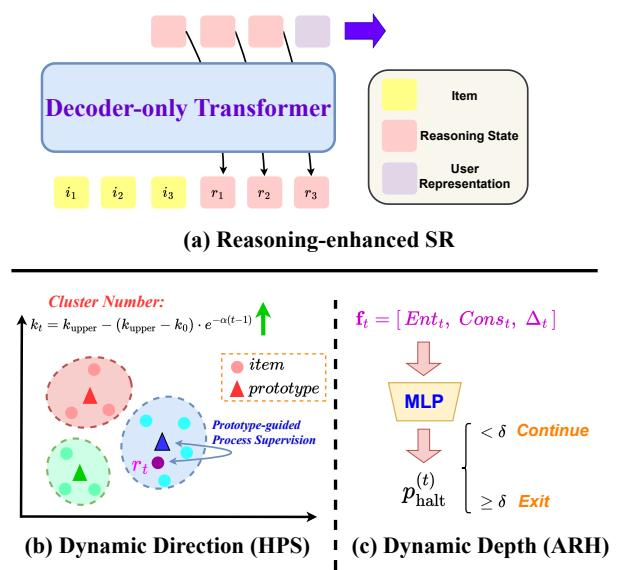
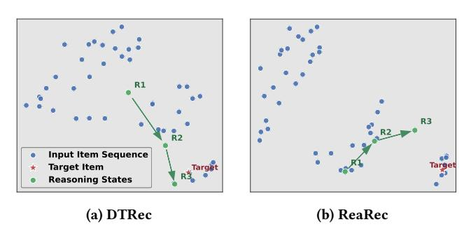
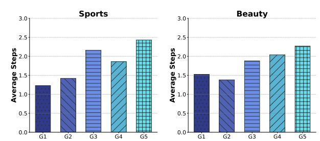

# DTRec: Learning Dynamic Reasoning Trajectories for Sequential Recommendation

Yifan Shao∗ The Chinese University of Hong Kong Hong Kong, China yifashao209@gmail.com

Peilin Zhou∗ Hong Kong University of Science and Technology (Guangzhou) Guangzhou, China zhoupalin@gmail.com

Shoujin Wang University of Technology Sydney Sydney, Australia shoujin.wang@uts.edu.au

Weizhi Zhang University of Illinois Chicago Chicago, Illinois, USA wzhan42@uic.edu

Xu Cai Jilin University Changchun, China caixu5522@mails.jlu.edu.cn

Sunghun Kim Hong Kong University of Science and Technology Hong Kong, China hunkim@ust.hk

### Abstract

Inspired by advances in LLMs, reasoning-enhanced sequential recommendation performs multi-step deliberation before making final predictions, unlocking greater potential for capturing user preferences. However, current methods are constrained by static reasoning trajectories that are ill-suited for the diverse complexity of user behaviors. They suffer from two key limitations: (1) a static reasoning direction, which uses flat supervision signals misaligned with human-like hierarchical reasoning, and (2) a fixed reasoning depth, which inefficiently applies the same computational effort to all users, regardless of pattern complexity. These rigidity lead to suboptimal performance and significant computational waste.

To overcome these challenges, we propose DTRec, a novel and effective framework that explores the Dynamic reasoning Trajectory for Sequential Recommendation along both direction and depth. To guide the direction, we develop Hierarchical Process Supervision (HPS), which provides coarse-to-fine supervisory signals to emulate the natural, progressive refinement of human cognitive processes. To optimize the depth, we introduce the Adaptive Reasoning Halting (ARH) mechanism that dynamically adjusts the number of reasoning steps by jointly monitoring three indicators. Extensive experiments on three real-world datasets demonstrate the superiority of our approach, achieving up to a 24.5% performance improvement over strong baselines while simultaneously reducing computational cost by up to 41.6%.

# CCS Concepts

• Information systems → Recommender systems.

# Keywords

Sequential Recommendation, Inference-time Reasoning

### ACM Reference Format:

Yifan Shao, Peilin Zhou, Shoujin Wang, Weizhi Zhang, Xu Cai, and Sunghun Kim. 2018. DTRec: Learning Dynamic Reasoning Trajectories for Sequential Recommendation. In Proceedings of Make sure to enter the correct conference

∗Both authors contributed equally to this research.

Conference acronym 'XX, Woodstock, NY 2018. ACM ISBN 978-1-4503-XXXX-X/2018/06 <https://doi.org/XXXXXXX.XXXXXXX>

title from your rights confirmation email (Conference acronym 'XX). ACM, New York, NY, USA, [4](#page-3-0) pages.<https://doi.org/XXXXXXX.XXXXXXX>

# 1 Introduction

Sequential recommendation aims to predict the next item which a user will interact with based on their historical behavior sequence. In recent years, neural sequential recommenders such as SASRec [\[3\]](#page-3-1) and BERT4Rec [\[6\]](#page-3-2) have achieved remarkable progress by leveraging Transformer-based architecture to model sequential dependencies. However, these approaches lack a deliberate reasoning process, limiting the ability to understand the complex evolving nature of user preferences.

Motivated by chain-of-thought (CoT) prompting in large language models (LLMs), recent studies have explored reasoningenhanced sequential recommendation [\[4,](#page-3-3) [7\]](#page-3-4) to perform multi-step reasoning before generating the final prediction. By introducing intermediate reasoning steps, these methods iteratively refine the understanding of user intent, thereby enhancing both the accuracy and interpretability of recommendations. Despite promising results, existing approaches still learn static reasoning trajectories, which lack the adaptability to the diverse and complex patterns found in real-world user behavior[\[1\]](#page-3-5). Specifically, this static nature appears in two aspects: (1) static reasoning direction: by supervising all intermediate steps with the final target item, they create a "flat" process supervision signal. This approach fundamentally misaligns with the hierarchical, coarse-to-fine nature of human cognition[\[5\]](#page-3-6), which progresses from broad overviews (e.g., product category) to specific details (e.g., item's attributes like brand or color). (2) static reasoning depth: the number of reasoning steps is fixed for all samples, regardless of their varying complexity (e.g., a simple, predictable pattern versus a sequence with abrupt shifts in interest). This leads to misallocation of computational resources, where simple cases are over-processed while complex ones are under-reasoned.

To address these limitations, we propose DTRec, a framework that explores the Dynamic reasoning Trajectory for Sequential Recommendation along two complementary dimensions: direction and depth. For dynamic reasoning direction, we introduce Hierarchical Process Supervision (HPS), which aligns the supervision signal with the abstraction level of each reasoning step. Specifically,

| Datasets | #Users | #Items | #Interactions | Sparsity |
|----------|--------|--------|---------------|----------|
| Sports   | 355,98 | 18,357 | 296,337       | 99.95%   |
| Beauty   | 22,363 | 12,101 | 198,502       | 99.93%   |
| Yelp     | 30,499 | 20,068 | 317,182       | 99.95%   |

Table 2: Performance comparison of different models on three datasets. The best and second-best results are indicated in bold and underlined font. ∗ indicates the statistical significance for �� <0.01 compared to the best baseline.

| Backbone Model  | Recall@10 | NDCG@10  | Sports Recall@20 | NDCG@20  | Recall@10 | NDCG@10  | Beauty Recall@20 | NDCG@20  | Recall@10 | NDCG@10  | Yelp Recall@20 | NDCG@20    |
|-----------------|-----------|----------|------------------|----------|-----------|----------|------------------|----------|-----------|----------|----------------|------------|
| Base            | 0.0445    | 0.0212   | 0.0692           | 0.0274   | 0.0664    | 0.0316   | 0.1044           | 0.0411   | 0.0605    | 0.0381   | 0.0868         | 0.0448     |
| ReaRec SASRec   | 0.0475    | 0.0224   | 0.0742           | 0.0293   | 0.0686    | 0.0328   | 0.1071           | 0.0416   | 0.0621    | 0.0385   | 0.0895         | 0.0455     |
| LARES           | 0.0481    | 0.0230   | 0.0728           | 0.0292   | 0.0707    | 0.0332   | 0.1100           | 0.0432   | 0.0627    | 0.0390   | 0.0903         | 0.0459     |
| DTRec           | 0.0553    | * 0.0277 | * 0.0855         | * 0.0354 | * 0.0828  | * 0.0409 | * 0.1294         | * 0.0527 | * 0.0682  | * 0.0407 | * 0.0992       | * 0.0476 * |
| Base            | 0.0342    | 0.0175   | 0.0549           | 0.0227   | 0.0569    | 0.0281   | 0.0871           | 0.0357   | 0.0397    | 0.0200   | 0.0651         | 0.0264     |
| ReaRec GRU4Rec  | 0.0365    | 0.0181   | 0.0573           | 0.0237   | 0.0582    | 0.0286   | 0.0901           | 0.0366   | 0.0410    | 0.0211   | 0.0669         | 0.0273     |
| LARES           | 0.0351    | 0.0180   | 0.0569           | 0.0231   | 0.0605    | 0.0308   | 0.0965           | 0.0399   | 0.0404    | 0.0212   | 0.0675         | 0.0280     |
| DTRec           | 0.0402    | * 0.0208 | * 0.0642         | * 0.0265 | * 0.0677  | * 0.0338 | * 0.1037         | * 0.0432 | * 0.0451  | * 0.0232 | * 0.0733       | * 0.0296 * |
| Base            | 0.0244    | 0.0124   | 0.0394           | 0.0162   | 0.0394    | 0.0188   | 0.0651           | 0.0253   | 0.0274    | 0.0136   | 0.0470         | 0.0185     |
| ReaRec BERT4Rec | 0.0301    | 0.0151   | 0.0459           | 0.0175   | 0.0427    | 0.0194   | 0.0678           | 0.0271   | 0.0306    | 0.0151   | 0.0509         | 0.0197     |
| LARES           | 0.0274    | 0.0131   | 0.0432           | 0.0172   | 0.0481    | 0.0213   | 0.0772           | 0.0277   | 0.0294    | 0.0144   | 0.0528         | 0.0201     |
| DTRec           | 0.0357    | * 0.0173 | * 0.0552         | * 0.0232 | * 0.0554  | * 0.0272 | * 0.0874         | * 0.0352 | * 0.0406  | * 0.0207 | * 0.0665       | * 0.0226 * |

Table 3: Ablation study of DTRec. "N@10" denotes NDCG@10, and "Cons." indicates the relative computational cost, which is calculated as the quotient of average reasoning steps with and without early exit.

| Model             | Sports N@10 | Cons.  | Beauty N@10 | Cons. |
|-------------------|-------------|--------|-------------|-------|
| Base              | 0.0212      | 100%   | 0.0316      | 100%  |
| +HPS (k=const)    | 0.0248      | 100%   | 0.0362      | 100%  |
| +HPS (w/o warmup) | 0.0258      | 100%   | 0.0392      | 100%  |
| +HPS              | 0.0265      | 100%   | 0.0398      | 100%  |
| +HPS+REE          | 0.0269      | 85.6%  | 0.0407      | 67.1% |
| +HPS+ARH ( ours ) | 0.0277      | 69.2 % | 0.0409      | 58.4% |

Figure 3: Average reasoning steps for users of different levels of interactive length. G1 denotes the group of users with the lowest average number of interactions.

## 4.4 Further Analysis

4.4.1 Case Study on Reasoning Trajectory. To intuitively understand how HPS guides the reasoning process, we visualize the reasoning trajectories of DTRec and ReaRec using t-SNE in Figure [2.](#page-2-1) DTRec's trajectory progressively advances toward the target item, while ReaRec's trajectory is confined near the target from the outset. This is because ReaRec adopts overly strong process supervision, which forces each step to predict the final target directly, traping the reasoning process in a local optimum.

4.4.2 Analysis of Adaptive Reasoning Depth. We investigate how the ARH adapts to sequence complexity. Figure [3](#page-3-11) shows the average reasoning steps for sequences of varying lengths. The results indicate that the number of reasoning steps generally increases with sequence length. As longer sequences generally represent more complex user interests, the proposed ARH efficiently allocates more computational resources to complex patterns.

## 5 Conclusion

In this paper, we introduce DTRec, a framework that addresses the limitations of static reasoning in sequential recommendation. By incorporating Hierarchical Process Supervision for coarse-to-fine direction guidance and Adaptive Reasoning Halting for dynamic depth control, DTRec learns more effective and efficient reasoning trajectories.

# References

[1] Yukuo Cen, Jianwei Zhang, Xu Zou, Chang Zhou, Hongxia Yang, and Jie Tang. 2020. Controllable multi-interest framework for recommendation. In Proceedings of the 26th ACM SIGKDD international conference on knowledge discovery & data mining. 2942–2951. [2] Balázs Hidasi, Alexandros Karatzoglou, Linas Baltrunas, and Domonkos Tikk. 2015. Session-based recommendations with recurrent neural networks. arXiv preprint arXiv:1511.06939 (2015). [3] Wang-Cheng Kang and Julian McAuley. 2018. Self-attentive sequential recommendation. In 2018 IEEE international conference on data mining (ICDM). IEEE, 197–206. [4] Enze Liu, Bowen Zheng, Xiaolei Wang, Wayne Xin Zhao, Jinpeng Wang, Sheng Chen, and Ji-Rong Wen. 2025. LARES: Latent Reasoning for Sequential Recommendation. arXiv[:2505.16865](https://arxiv.org/abs/2505.16865) [cs.IR]<https://arxiv.org/abs/2505.16865> [5] David Navon. 1977. Forest before trees: The precedence of global features in visual perception. Cognitive psychology 9, 3 (1977), 353–383. [6] Fei Sun, Jun Liu, Jian Wu, Changhua Pei, Xiao Lin, Wenwu Ou, and Peng Jiang. 2019. BERT4Rec: Sequential recommendation with bidirectional encoder representations from transformer. In Proceedings of the 28th ACM international conference on information and knowledge management. 1441–1450. [7] Jiakai Tang, Sunhao Dai, Teng Shi, Jun Xu, Xu Chen, Wen Chen, Wu Jian, and Yuning Jiang. 2025. Think Before Recommend: Unleashing the Latent Reasoning Power for Sequential Recommendation. arXiv[:2503.22675](https://arxiv.org/abs/2503.22675) [cs.IR] [https://arxiv.](https://arxiv.org/abs/2503.22675) [org/abs/2503.22675](https://arxiv.org/abs/2503.22675) [8] Peilin Zhou, Jingqi Gao, Yueqi Xie, Qichen Ye, Yining Hua, Jae Boum Kim, Shoujin Wang, and Sunghun Kim. 2024. Equivariant Contrastive Learning for Sequential Recommendation. arXiv[:2211.05290](https://arxiv.org/abs/2211.05290) [cs.IR]<https://arxiv.org/abs/2211.05290>