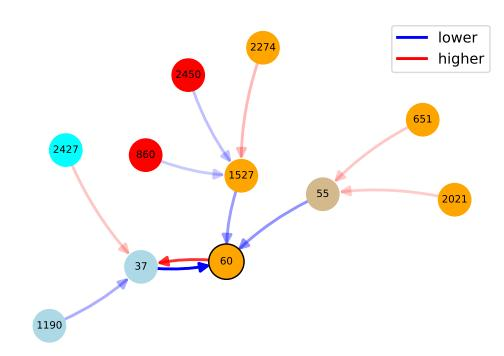
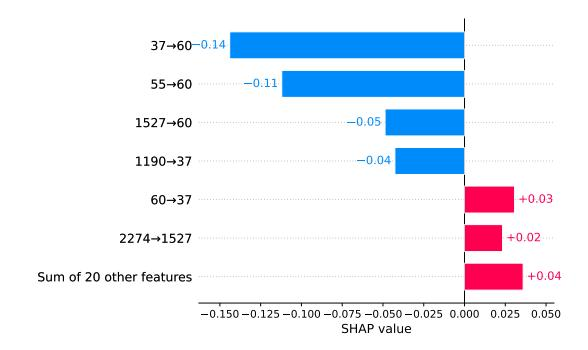
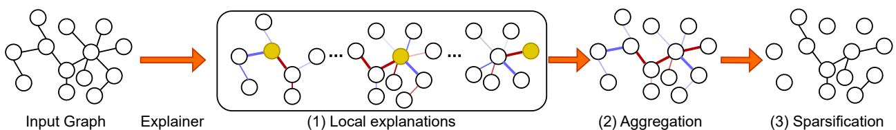
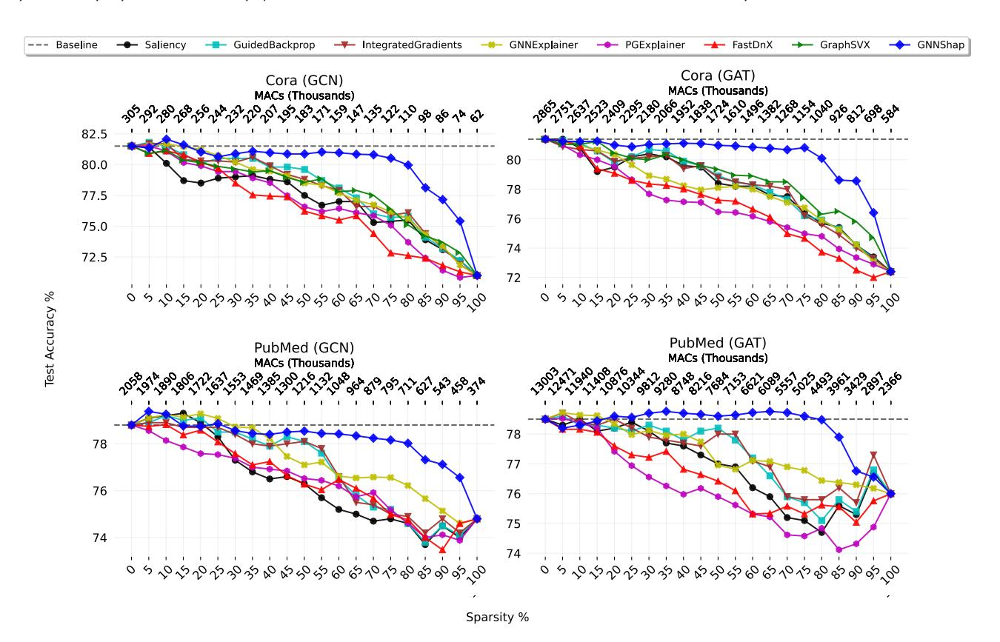
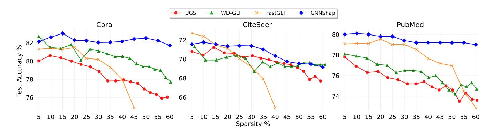

# Explainable Graph Sparsification with Shapley Values

[Selahattin Akkas](https://orcid.org/0000-0001-8121-9300)

Department of Intelligent Systems Engineering Indiana University Bloomington Bloomington, Indiana, USA sakkas@iu.edu

[Ariful Azad](https://orcid.org/0000-0003-1332-8630)

Department of Computer Science & Engineering Texas A&M University College Station, Texas, USA ariful@tamu.edu

### Abstract

We consider the problem of graph sparsification while preserving the test accuracy of Graph Neural Networks (GNNs). Prior work in this area is often motivated by the Lottery Ticket Hypothesis, which aims to prune redundant edges. However, these sparsification approaches typically operate as black boxes and provide no justification for which edges are removed. In contrast, edge importance scores obtained from GNN explanation methods provide a principled and interpretable basis for sparsification. In particular, we show that Shapley value–based explainers such as GNNShap enable effective sparsification, allowing up to 80% of edges to be removed without degrading model accuracy. We show that Shapley values are well-suited for this task due to their robustness in identifying less influential edges, resulting in sparse yet faithful subgraphs that are efficient for downstream applications.

# CCS Concepts

• Computing methodologies → Neural networks.

# Keywords

GNN explainability, graph sparsification, Shapley value

#### ACM Reference Format:

Selahattin Akkas and Ariful Azad. 2026. Explainable Graph Sparsification with Shapley Values. In Proceedings of the ACM Web Conference 2026 (WWW '26), April 13–17, 2026, Dubai, United Arab Emirates. ACM, New York, NY, USA, [4](#page-3-0) pages.<https://doi.org/10.1145/3774904.3792909>

## 1 Introduction

Graph Neural Networks (GNNs) have advanced rapidly in recent years [\[7,](#page-3-1) [18\]](#page-3-2). Since GNN weight matrices are relatively small, inference cost is largely dominated by graph size. To reduce computational and memory overhead, various graph sparsification methods have been proposed [\[4,](#page-3-3) [22\]](#page-3-4), many inspired by the Lottery Ticket Hypothesis, which prunes redundant edges to accelerate inference. In parallel, GNN explanation methods rank edges by their importance to predictions [\[9,](#page-3-5) [21\]](#page-3-6), motivating sparsification approaches that remove low-importance edges based on explanation scores.

We show that explanation-based sparsification can outperform Graph Lottery Ticket (GLT) methods while requiring no retraining or repeated scoring across sparsity levels. Unlike GLT, explanationbased approaches yield interpretable graphs where sparsity directly

[This work is licensed under a Creative Commons Attribution 4.0 International License.](https://creativecommons.org/licenses/by/4.0) WWW '26, Dubai, United Arab Emirates

© 2026 Copyright held by the owner/author(s). ACM ISBN 979-8-4007-2307-0/2026/04 <https://doi.org/10.1145/3774904.3792909>

reflects edge importance. Methods that assign both positive and negative importance scores are particularly effective, as they identify and remove edges that actively harm predictions.

Motivated by this, we adopt Shapley values for graph sparsification. Shapley-based GNN explainers [\[1,](#page-3-7) [2,](#page-3-8) [5\]](#page-3-9) provide both positive and negative scores along with high-quality explanations. Figure [1](#page-1-0) illustrates an example where removing an edge with a negative score (from node 37 to 60) improves model performance. This ability to identify and prune negatively contributing edges enables higher sparsity and faster inference without loss of accuracy.

We develop a Shapley value–based graph sparsification approach for node classification that reduces inference cost without sacrificing accuracy. Extensive experiments across datasets and models show that it is robust, generalizable, and consistently outperforms existing explanation and lottery ticket–based methods by achieving higher sparsity while preserving model performance.

# 2 Background & Related Work

We denote a graph as �� = {�� , ��}, where �� is the set of �� nodes, �� is the set of edges, and ��∈R �� ×�� is the node feature matrix. ��∈{0, 1} �� ×�� is the binary adjacency of the graph, where ������ = 1 if ���� , ���� ∈ ��, and ������ = 0 otherwise. Let �� = {��1, ��2, ..., ���� } denote the labels of the nodes, where each label ���� belongs to one of C classes. An ��-layer GNN model �� takes �� and �� as input and generates predictions for the ��th node: ��ˆ�� = �� (��, ��), where ��ˆ��∈C.

Computational graph. The prediction of a node �� with an ��-layer GNN only depends on ��'s ��-hop neighbors. This ��-hop subgraph is referred to as the computational graph ���� (��).

# 2.1 GNN Explanations

A GNN explanation method Φ generates explanations for a given node �� with respect to a target class �� ∈ C. Popular GNN explanation methods aim to explain the prediction for node �� by taking as input a trained GNN model �� and the node's computational graph ���� (��). The explanation typically consists of a small subgraph ���� (��) ⊆ ���� (��) and/or a subset of node features that most significantly influence the prediction. In this work, we focus exclusively on subgraph-based explanations, as our goal is to sparsify graphs by pruning edges. The explanation model assigns an importance score �� (��, ��) to each edge (���� , ����), indicating its contribution to node ��'s prediction for the target class ��.

# 2.2 Related Work

Existing methods fall into three main categories. Denoising methods such as NeuralSparse [\[23\]](#page-3-10) enhance generalization by reducing noisy edges. Graph lottery ticket methods (e.g., UGS [\[4\]](#page-3-3), WD-GLT [\[6\]](#page-3-11), FastGLT [\[22\]](#page-3-4), SparseGCN [\[13\]](#page-3-12)) seek sparse "winning tickets" that match the performance of dense models. These methods are limited

Figure 1: Example Shapley value explanation on Cora node 60. Node colors denote classes. The bar chart on the right shows important edges and their Shapley values. While red colors show a positive contribution, blue colors show a negative contribution.

Figure 2: Overview of the Shapley-based graph sparsification algorithm. (1) Explanation scores are computed for each node. (2) The scores are aggregated for each edge. (3) Edges are pruned using the aggregated scores

by shallow architectures (2–4 layers) and often require retraining for each sparsity level, making them less practical for deeper models.

Explainability-based methods use edge-importance scores to guide pruning. EEGL [\[10\]](#page-3-13) mines frequent subgraphs with GNNExplainer to improve accuracy, while xAI-Drop [\[8\]](#page-3-14) iteratively drop unimportant edges or nodes using explanation scores, focusing primarily on training accuracy rather than inference efficiency. The most relevant work, by Shin et al. [\[15\]](#page-3-15), introduces a fidelity-based pruning approach that aggregates non-negative edge scores to remove edges with minimal impact on predictions.

### 3 Method

Shapley Values. Shapley value [\[14\]](#page-3-16) is a game-theoretic method that fairly distributes gains to collaborating players. A Shapley value GNN explanation method considers nodes or edges as players and fairly distributes the model output to players. The exact Shapley value of a player is computed by Eq. [1,](#page-1-1) where �� denotes the number of players, S a coalition (a subset of players), and �� (�� ∪ {��}) − �� (��) is player ��'s marginal contribution to coalition ��. Shapley values can be positive and negative; while positive values increase model prediction probability, negative values decrease.

���� = 2∑︁��−1 ��⊆ {1,...,��}\{�� } |�� |!(�� − |�� | − 1)! ��! [�� (�� ∪ {��}) − �� (��)] (1)

Computing exact Shapley values is impractical when the number of players is large, as it requires evaluating 2 coalitions. [\[1,](#page-3-7) [5\]](#page-3-9) use a simple surrogate model to compute the approximation of Shapley values using a much smaller subset of coalitions (�� ≪ 2 ). The surrogate model �� is defined in Eq. [2,](#page-1-2) where �� ∈ {0, 1} 1���� denotes a binary coalition mask, ��, and �� are model parameters: the approximation of the Shapley values.

�� (��) ≈ ��(��) = ��0 + ∑︁�� ��=1 �������� , (2)

Graph Sparsification by Shapley Values. Like most GNN explanation methods, Shapley-based approaches such as GNNShap provide local explanations for individual node predictions. Since an edge may appear in multiple nodes'��-hop neighborhoods, it receives multiple importance scores. To obtain a global edge importance, we aggregate these scores using the mean across all occurrences. Figure [2](#page-1-3) illustrates this process where we aggregate edge scores and prune the graph based on the aggregated values. This aggregation strategy is general and can be applied to other explanation-based sparsification methods as well.

#### 4 Experiments

In our experiments, we compare GNNShap [\[1\]](#page-3-7), a Shapley-based GNN explanation method, with other explanation and sparsification methods. In each experiment, we apply different sparsification methods to the graph, perform GNN inference on the test nodes, and report the resulting test accuracy. A sparsification method is considered more effective if it maintains high test accuracy despite sparsification of the graph. We repeat each experiment five times and provide the average results.

Figure 3: Test accuracies when edges sparsified using mean aggregated explanation scores. GNNShap gives competitive or even better accuracies for high sparsification percentages.

Table 1: Dataset used in our experiments.

| Dataset  | Nodes | Edges | Features | Classes |
|----------|-------|-------|----------|---------|
| Cora     | 2708  | 10556 | 1433     | 7       |
| CiteSeer | 3327  | 9104  | 3703     | 6       |
| PubMed   | 19717 | 88648 | 500      | 3       |

Datasets: Table [1](#page-2-0) summarizes three well-known real-world citation datasets: Cora, CiteSeer, and PubMed [\[20\]](#page-3-17).

GNN Models: We use a two-layer GCN [\[7\]](#page-3-1) and GAT [\[18\]](#page-3-2) models with 16 hidden layer sizes for Cora, CiteSeer, and PubMed, and 64 for Coauthor-CS. GAT models use eight attention heads. We use 0.5 dropout and the ReLU activation. We train the model for 200 epochs using a learning rate of 0.01. For GLT experiments, we follow UGS, using the same parameters with a 512 hidden layer size.

### 4.1 Baselines

GNN explanation methods: We used three gradient-based explanation methods Saliency [\[3,](#page-3-18) [12\]](#page-3-19), Guided Backpropagation [\[16\]](#page-3-20), and Integrated Gradients [\[17\]](#page-3-21). GNNExplainer [\[21\]](#page-3-6) learns a mask to maximize mutual information using gradients, and PGExplainer [\[9\]](#page-3-5) trains a neural network to predict edge scores based on mutual information. FastDnX [\[11\]](#page-3-22) uses a linear surrogate model based on

SGC [\[19\]](#page-3-23). GraphSVX [\[5\]](#page-3-9) also uses a linear surrogate to approximate Shapley values, while GNNShap [\[1\]](#page-3-7) is a GPU-accelerated Shapley method that produces edge-level explanations and is an order of magnitude faster than GraphSVX. FastDnX and GraphSVX generate node scores, which we convert to edge scores by averaging connected node values. Graph lottery ticket (GLT) baselines: We compared with three GLT-based approaches: Unified GNN Sparsification (UGS) [\[4\]](#page-3-3), WD-GLT [\[6\]](#page-3-11), and FastGLT [\[22\]](#page-3-4).

#### 5 Results

### 5.1 Performance of Explanation Methods

Sparsification vs test accuracy: Figure [3](#page-2-1) (showing two example graphs for space limitation) compares various explanation-based sparsification methods. The Shapley value approach, GNNShap, consistently maintains higher test accuracy at high sparsification levels. Specifically, GNNShap can prune up to 80% of edges with less than a 2% accuracy drop. GNNShap achieves superior pruning efficiency by effectively distinguishing important from unimportant edges and by leveraging both positive and negative attribution scores for more informed pruning decisions.

Sparsification vs computational efficiency: To assess the computational efficiency of Shapley-based sparsification, we measure the number of Multiply–Accumulate (MAC) operations during GNN message passing. For instance, on the Cora dataset with a

Figure 4: Test accuracy comparison of two-layer GCN model with 512 hidden layer size. Shapley value-based sparsification achieves higher accuracy with significantly less loss in accuracy.

GCN, inference requires 305K MACs on the original graph, which drops to 110K (a 64% reduction) after 80% edge pruning. For GAT on Cora, MACs decrease from 2.86M to 1.04M (64% reduction). On PubMed, GNNShap reduces MACs from 2.06M to 0.71M (GCN) and from 13.0M to 4.49M (GAT), both around 65% fewer computations. These results highlight that Shapley-based sparsification significantly lowers computation while preserving high test accuracy. 5.2 Comparison with GLT Methods We compare GNNShap with GLT methods in Figure [4.](#page-3-24) UGS relies only on training nodes for gradient updates, limiting its pruning power, while WD-GLT improves by incorporating non-training edges. Fast-GLT performs well on PubMed but degrades at higher sparsity levels. In contrast, GNNShap achieves substantially higher sparsity with minimal accuracy loss. Shapley-based explanations outperform GLT methods because they require no retraining across sparsity levels, are label-free, and allow edge scores to be reused once computed. 6 Conclusion This paper explored Shapley value–based graph sparsification, which utilizes both positive and negative importance scores to enable effective pruning. This approach improves GNN efficiency and scalability while maintaining accuracy, consistently outperforming other GNN explanation and lottery ticket–based methods. Its effectiveness depends on the quality of the underlying model, as inaccurate models may yield unreliable explanations. 7 Acknowledgements This research is supported by the DOE Office of Advanced Scientific Computing Research under contracts numbered DE-SC0022098 and DE-SC0023349 and by NSF grants CCF-2316234 and OAC-2339607. References [1] Akkas, S., Azad, A., 2024. GNNShap: Scalable and accurate gnn explanation using shapley values, in: Proceedings of the ACM Web Conference 2024, pp. 827–838. [2] Akkas, S., Devarakonda, A., Azad, A., 2025. DistShap: Scalable gnn explanations with distributed shapley values. arXiv preprint arXiv:2506.22668 . [3] Baldassarre, F., Azizpour, H., 2019. Explainability techniques for graph convolutional networks. arXiv e-prints URL: [https://arxiv.org/abs/1905.13686,](https://arxiv.org/abs/1905.13686) [arXiv:1905.13686](http://arxiv.org/abs/1905.13686). [4] Chen, T., Sui, Y., Chen, X., Zhang, A., Wang, Z., 2021. A unified lottery ticket hypothesis for graph neural networks, in: Meila, M., Zhang, T. (Eds.), Proceedings of the 38th International Conference on Machine Learning, PMLR. pp. 1695–1706. [5] Duval, A., Malliaros, F.D., 2021. Graphsvx: Shapley value explanations for graph neural networks, in: Machine Learning and Knowledge Discovery in Databases. Research Track: European Conference, ECML PKDD 2021, Bilbao, Spain, September 13–17, 2021, Proceedings, Part II 21, Springer. pp. 302–318. [6] Hui, B., Yan, D., Ma, X., Ku, W.S., 2023. Rethinking graph lottery tickets: Graph sparsity matters, in: The Eleventh International Conference on Learning Representations. URL: [https://openreview.net/forum?id=fjh7UGQgOB.](https://openreview.net/forum?id=fjh7UGQgOB) [7] Kipf, T.N., Welling, M., 2017. Semi-supervised classification with graph convolutional networks, in: International Conference on Learning Representations. [8] Luca, V.M.D., Longa, A., Lio, P., Passerini, A., 2024. xAI-drop: Don't use what you cannot explain, in: The Third Learning on Graphs Conference. [9] Luo, D., Cheng, W., Xu, D., Yu, W., Zong, B., Chen, H., Zhang, X., 2020. Parameterized explainer for graph neural network. Advances in neural information processing systems 33, 19620–19631. [10] Naik, H.G., Polster, J., Shekhar, R., Horváth, T., Turán, G., 2024. Iterative graph neural network enhancement via frequent subgraph mining of explanations. arXiv preprint arXiv:2403.07849 . [11] Pereira, T., Nascimento, E., Resck, L.E., Mesquita, D., Souza, A., 2023. Distill n'explain: explaining graph neural networks using simple surrogates, in: International Conference on Artificial Intelligence and Statistics, PMLR. pp. 6199–6214. [12] Pope, P.E., Kolouri, S., Rostami, M., Martin, C.E., Hoffmann, H., 2019. Explainability methods for graph convolutional neural networks, in: Proceedings of the IEEE/CVF conference on computer vision and pattern recognition, pp. 10772– 10781. [13] Rahman, M.K., Azad, A., 2022. Triple sparsification of graph convolutional networks without sacrificing the accuracy. arXiv preprint arXiv:2208.03559 . [14] Shapley, L.S., 1951. Notes on the N-Person Game – II: The Value of an N-Person Game. RAND Corporation. doi:[10.7249/RM0670](http://dx.doi.org/10.7249/RM0670). [15] Shin, Y.M., Shin, W.Y., 2024. On the feasibility of fidelity- for graph pruning, in: IJCAI Workshop on Explainable AI (XAI). URL: [https://arxiv.org/abs/2406.11504.](https://arxiv.org/abs/2406.11504) [16] Springenberg, J.T., Dosovitskiy, A., Brox, T., Riedmiller, M., 2015. Striving for simplicity: The all convolutional net, in: International Conference on Learning Representations (ICLR) Workshop Track. URL: [https://arxiv.org/abs/1412.6806.](https://arxiv.org/abs/1412.6806) [17] Sundararajan, M., Taly, A., Yan, Q., 2017. Axiomatic attribution for deep networks, in: International conference on machine learning, PMLR. pp. 3319–3328. [18] Veličković, P., Cucurull, G., Casanova, A., Romero, A., Liò, P., Bengio, Y., 2018. Graph attention networks, in: International Conference on Learning Representations. [19] Wu, F., Souza, A., Zhang, T., Fifty, C., Yu, T., Weinberger, K., 2019. Simplifying graph convolutional networks, in: International conference on machine learning, Pmlr. pp. 6861–6871. [20] Yang, Z., Cohen, W., Salakhudinov, R., 2016. Revisiting semi-supervised learning with graph embeddings, in: International conference on machine learning, PMLR. pp. 40–48. [21] Ying, Z., Bourgeois, D., You, J., Zitnik, M., Leskovec, J., 2019. Gnnexplainer: Generating explanations for graph neural networks. Advances in neural information processing systems 32. [22] Yue, Y., Zhang, G., Yang, H., Cheng, D., 2025. Fast track to winning tickets: Repowering one-shot pruning for graph neural networks. Proceedings of the AAAI Conference on Artificial Intelligence 39, 13152–13160. [23] Zheng, C., Zong, B., Cheng, W., Song, D., Ni, J., Yu, W., Chen, H., Wang, W., 2020. Robust graph representation learning via neural sparsification, in: Proceedings of the 37th International Conference on Machine Learning, PMLR. pp. 11458–11468.

