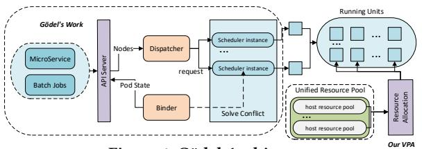
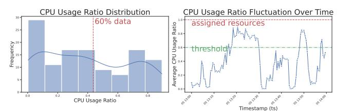
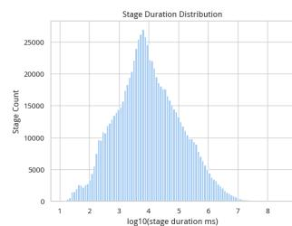
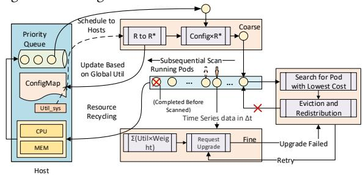
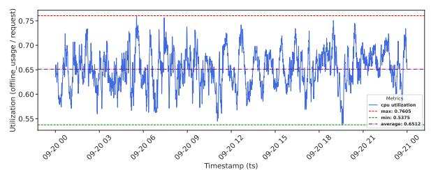
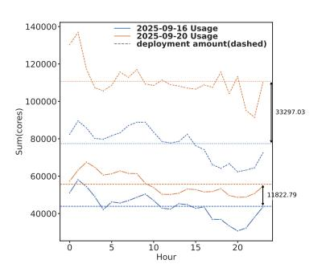
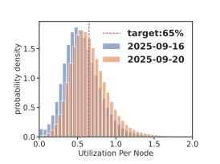
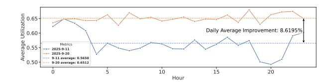

# Coarse-Fine: A Novel VPA Strategy for Boosting Resource Utilization of Transient Offline Tasks

Yingying Wen∗ ByteDance Beijing, China wenyingying.wing@bytedance.com

Yingzhi Chu Zhejiang University Hangzhou, China 22551128@zju.edu.cn

Zhongyu Wang ByteDance Beijing, China wangzy.17@bytedance.com

Zhecheng Lin ByteDance Beijing, China linzhecheng@bytedance.com

Fan Jiang ByteDance Beijing, China jiangfan.2017@bytedance.com

Wu Xiang ByteDance Beijing, China xiangwu@bytedance.com

Rui Shi ByteDance Beijing, China shirui@bytedance.com

# Abstract

To improve resource utilization in Cloud clusters and reduce operational costs, this paper proposes a two-level collaborative Vertical Pod Autoscaler (VPA) strategy for offline tasks in hybrid deployment environments. Offline tasks feature significant runtime variation and low periodicity—characteristics that make existing VPA strategies ineffective. The proposed approach combines coarsegrained adjustments (dynamically recommending resource settings based on cluster-wide utilization trends) with fine-grained adjustments (performing instance-level resource recalibration via sliding windows). It addresses the averaging perspective limitation of coarse-grained methods without requiring predictive models or prior knowledge, ensuring interpretability and operational simplicity. Production deployment verifies that the strategy elevates offline resource utilization to near-target levels, achieving an 8.62% improvement in offline resource utilization and a 41.5% increase in offline task deployment volume under Out-of-Memory (OOM) and computational constraints.

# Keywords

Vertical Pod Autoscaling, Resource Cost Saving, Utilization Improvement

#### ACM Reference Format:

Yingying Wen, Yingzhi Chu, Zhongyu Wang, Zhecheng Lin, Fan Jiang, Wu Xiang, and Rui Shi. 2026. Coarse-Fine: A Novel VPA Strategy for Boosting Resource Utilization of Transient Offline Tasks. In Proceedings of the ACM Web Conference 2026 (WWW '26), April 13–17, 2026, Dubai, United Arab Emirates. ACM, New York, NY, USA, [4](#page-3-0) pages.<https://doi.org/10.1145/3774904.3792910>

∗Corresponding author.

[This work is licensed under a Creative Commons Attribution-NonCommercial-](https://creativecommons.org/licenses/by-nc-nd/4.0)[NoDerivatives 4.0 International License.](https://creativecommons.org/licenses/by-nc-nd/4.0) WWW '26, Dubai, United Arab Emirates © 2026 Copyright held by the owner/author(s). ACM ISBN 979-8-4007-2307-0/2026/04 <https://doi.org/10.1145/3774904.3792910>

# 1 Introduction

Hybrid cloud deployment improves resource utilization but introduces dynamic resource allocation for offline workloads, posing challenges in fully using these variable resources. Although offline tasks are extensively deployed, many resource demands remain unmet, and utilization of allocated resources remains suboptimal. VPA is a cloud-native capability widely supported by schedulers [\[1\]](#page-3-1). It automatically adjusts the Pod specifications of tasks based on their resource utilization. Currently, extensive research has been conducted on VPA strategies for long-running services[\[4,](#page-3-2) [6\]](#page-3-3), particularly in microservice scenarios. However, less attention has been paid to VPA strategies for offline tasks, which have different running characteristics from long-running online services. The VPA strategies applicable to microservice scenarios cannot be directly migrated to offline tasks. Based on the data characteristics collected from production environments, we have identified the following reasons for this incompatibility: 1) Due to the scale of large clusters, the VPA update mechanism has an interval between updates and does not provide real-time adjustment capabilities. 2) The runtime duration of offline tasks varies significantly. Some tasks run for several hours, while most short-duration tasks are completed within 5 minutes. Based on the characteristics of production environments, we propose a two-level collaborative VPA strategy for offline tasks that combines fine-grained and coarse-grained adjustments. This strategy aims to address the issue where the hybrid resources allocated to offline workloads are insufficient to meet their current resource demands, and it consists of two mutually collaborative components: 1) Coarse-grained adjustment capability. Based on the overall offline resource utilization performance of the cluster, dynamic recommendation settings are implemented to adapt to daily utilization fluctuations and utilization differences between different cluster queues. 2) Fine-grained adjustment capability. From the perspective of each running instance, this capability compensates for the limitations of the coarse-grained adjustment's large-scale average perspective and provides instance-level readjustment capability based on a sliding window.

Through this design, we have obtained a VPA mechanism adapted to the operational characteristics of offline tasks. From the effect of its deployment in the production environment, the average offline resource utilization can be raised to near the specified utilization target. Under the constraints of OOM (Out of Memory) and computing power, this strategy achieves an improvement of 8.62% in offline resource utilization and a daily average increase of 41.5% in the overall offline deployment volume.

#### 2 Background and Motivation

#### 2.1 Managing Cloud Resources with Godel

Gödel's scheduling mechanism[\[7\]](#page-3-4), shown in Fig. [1,](#page-1-0) provides the foundation for subsequent offline VPA analysis. Its scheduler prioritizes critical online jobs and backfills offline tasks into resource gaps, performing evictions or preemption only when necessary to maintain SLAs and minimize cascading effects. The dispatcher employs two key queues: a priority queue for sorting heterogeneous tasks, and a resource queue to enforce per-business-group resource limits. The Binder uses optimistic concurrency control to resolve scheduling conflicts, supports preemption and co-scheduling, and finally binds a pod to the scheduler-selected node, enabling instances to make decisions based on the global state.

Figure 1: Gödel Architecture

After scheduling, Gödel leverages Kubernetes' VPA mechanism for dynamic resource allocation. Kubernetes employs requests and limits to define guaranteed and burstable resources, respectively. A pluggable algorithm dynamically adjusts these values—controlling allocated resources via requests and constraining usage via limits – to address issues such as low utilization from over-provisioning or throttling/OOM errors from under-provisioning.

#### 2.2 Challenges from Production Environment

Although Kubernetes' default Vertical Pod Autoscaler (VPA) enables dynamic resource adjustment[\[1\]](#page-3-1), we observed that its strategy fails to allocate resources to offline tasks fairly and reasonably in practice. This study therefore examines the resource deployment and usage patterns of offline tasks, identifying key challenges in the current VPA algorithm for production environments.

2.2.1 Low Utilization. In mixed deployment environments, high utilization of tasks can cause significant variance fluctuations, leading to system Out-of-Memory (OOM) errors, resource throttling, and fine-grained overuse that violate SLAs for online tasks. To prevent severe under-provisioning issues, cluster typically control utilization within a safe range by adjusting the deployment amount of resources of nodes. However, as shown in Fig. [2,](#page-1-1) which illustrates the utilization fluctuation amplitude and distribution of a node over one hour, offline tasks exhibit strong heterogeneity,

Figure 2: Offline Utilization Analysis of a Single Node

resulting in more dramatic and irregular resource consumption fluctuations. Consequently, traditional schemes relying on utilization predictions always require surplus resources in most cases for these hard-to-predict tasks to ensure system safety-such as the safety margin in the Autopilot paper[\[4\]](#page-3-2). While this approach mitigates risks, redundant resources leads to low utilization rates most of the time.

2.2.2 Running Time Variation. The Fig[.3](#page-1-2) statistics the sole runtime characteristics of offline tasks, namely high diversity, low duplications, and short duration. Specifically, offline task execution times span from 10 ms to 108 ms . Moreover, the figure shows that 53.4% of stage runtime is within 10 seconds, and 90% is within 5 minutes, since most offline tasks have short runtimes, sluggish VPA resource allocation can even impact normal cluster performance.

Figure 3: Stage Duration Distribution in Log Scale

2.2.3 Periodically-Scanned VPA Mechanism. The feasible size of our Kubernetes cluster is constrained by a trade-off: avoiding scheduler degradation in overly large single clusters versus managing the configuration overhead of multiple clusters. For dynamic resource adjustment, an in-place VPA mechanism is employed. However, resource updates are not instantaneous from an individual instance's perspective, as the scheduler operates on a periodic scanning cycle. Consequently, the time for a update to take effect across the entire cluster depends on its size, typically requiring 3 to 4 minutes in our production setup.

#### 2.3 Related Work

To enhance resource utilization in large-scale central clusters, customized resource scaling schemes have been developed atop schedulers like Kubernetes and YARN. Google's Autopilot[\[4\]](#page-3-2) implements a VPA recommender that adjusts resource targets based on historical data. Beyond reactive models, various proactive scaling solutions have emerged. Tencent's Oceanus[\[2\]](#page-3-5) employs an ML predictor to forecast resource demands 5–10 minutes ahead for streaming data, overcoming the limitations of system metrics. Wang et al. utilized HW and LSTM models to predict CPU usage, reducing resource slack and throttling[\[5\]](#page-3-6). However, these ML-based predictors require long-running tasks with stable load patterns, making them

less effective for heterogeneous offline tasks. Microsoft's CaaSPER algorithm[\[3\]](#page-3-7), designed for DBaaS, uses a multi-level collaborative VPA that does not rely on long historical data. Yet, as its reactive component depends on price-performance curves—which are infeasible for offline tasks with unpredictable features and runtimes—it remains unsuitable for such scenarios.

#### 3 Coarse-Fine VPA

#### 3.1 Two-level Collaborative Architecture

Based on production environment challenges and offline task characteristics, this study proposes a two-level parallel resource configuration architecture—integrating system-level coarse tuning and pod-granularity fine tuning—to realize rapid and rational resource allocation for offline tasks, as shown in Fig. [4.](#page-2-0) Given the inability of traditional methods to quickly respond to resource utilization fluctuations, a coarse-tuning phase is designed: it reads the system's current state, updates the configuration file according to the ratio of current to target resource utilization, and initializes node resource configurations using this file.

Figure 4: Two-level allocation

However, sole reliance on coarse tuning causes pod-level resource allocation issues during long-task execution. As shown in the histogram: short jobs (101–104 ms) account for over 53% of total jobs, and their over/under-allocation has minimal impact on cluster performance; in contrast, long offline tasks suffer from low resource utilization (prolonged over-provisioning) or slow execution (prolonged under-provisioning), with excessive deployment density potentially triggering OOM. Meanwhile, time-series data generated during execution supports accurate load prediction for long tasks. Thus, fine tuning is implemented on top of coarse tuning via periodic cluster-level scans (similar to node polling on individual machines): short jobs completed within the cycle after coarse tuning are rarely scanned, while jobs exceeding the fine-tuning cycle are guaranteed to be fine-tuned to avoid unreasonable resource allocation.

This two-level collaborative architecture optimizes the instantaneous and rational allocation of CPU and memory resources, improving offline task deployment density, resolving the conflict between resource shortage and low utilization, and ensuring no task resource exhaustion. Sections 3.2 and 3.3 elaborate on the coarse and fine-tuning processes after offline tasks are assigned to specific hosts.

### 3.2 Coarse VPA Tuning

After tasks are scheduled by Gödel and assigned to the resource configuration queue of specific hosts, coarse tuning is executed during

task startup. The system calculates the updated oversubscription value using the current oversubscription ratio and cluster-wide offline resource utilization, based on the following formulas:

�������� = �������������� ������0 ���������� �������������� ������0 �������������� (1)

�������� = ���������������� ∗ �������������������� ���������������������� (2)

Here, �� denotes the oversubscription rate (ratio of resource limits to requests). The host computes the current system utilization (����������������������) by aggregating the total resources consumed by existing pods and comparing it to the sum of requested resources, while cluster administrators configure the target utilization(��������������������) based on hardware performance and SLAs. Coarse tuning updates the configuration file periodically, with the period aligned to that of fine tuning. In practice, requests act as soft constraints (affecting deployment density but not burst handling), while limits restrict application resource usage. To improve system utilization without compromising performance, only requests are adjusted during oversubscription modification.

Notably, coarse tuning uses cluster-average resource utilization instead of per-pod utilization, due to offline pod heterogeneity. Frequent short-term exits/redeployments of offline pods cause volatile pod-level utilization (no stable patterns), whereas cluster-wide offline utilization fluctuates more smoothly—enabling oversubscription ratio regulation via the current utilization to target utilization ratio.

#### 3.3 Fine VPA Tuning

To avoid resource over/under-provisioning during long-task execution, we implement dynamic scaling for long tasks via a unified recommender—this process (precisely adjusting pod request settings based on the pod's historical data) is defined as fine tuning. The VPA recommender cyclically scans all cluster pod objects, while each pod periodically pulls its resource usage data from the API server (e.g., recording 3-minute window average usage). The pod's target Request is set based on the target utilization rate. The scheduler then monitors the VPA recommender status: request downgrades require no consideration of remaining pod resources, while request upgrades (which impose mandatory resource requirements) may block task deployment on the original pod. To resolve this, the eviction logic is integrated during specification upgrades: if fine tuning causes a pod's resources to fail meeting task needs, the scheduler evicts the offline pod with the shortest runtime on the node. This approach gradually converges the utilization rate of long-running pods to near the target.

### 4 Application Effects

To date, this novel VPA has been deployed across dozens of largescale clusters of ByteDance, influencing the execution performance of offline tasks deployed on millions of cores. Leveraging authentic business data traces, we randomly choose a representative production cluster to demonstrate the application effects-this cluster

exhibits significant utilization span and a high offline task deployment rate-enabling rigorous comparisons that highlight gains in utilization control precision and holistic system performance.

#### 4.1 Precision Utilization Control Table 1: Key Metrics Summary

Figure 5: Precise Control of Utilization

Figure 6: Cluster Resource Allocation

Figure 7: Distribution of Node Utilization

Fig[.5](#page-3-8) demonstrates the precise control capability of our novel VPA over utilization rate. By applying Coarse-Fine, the maximum fluctuation between the cluster's utilization and the threshold is constrained within 11.25%. Meanwhile, the error between the average utilization and the threshold (target utilization) is only 0.12%, and Tab[.1](#page-3-9) records a cluster-level utilization variance as low as 0.0015. For cluster resource scheduling, this strict and precise threshold control enables the cluster to fully utilize offline resources while ensuring burst handling, which is critical for appropriately increasing our target utilization.

# 4.2 Progress of Holistic System Performance

On the one hand, as shown in Fig[.7,](#page-3-10) we raised the utilization target for offline tasks relative to that in Fig[.2,](#page-1-1) which elevated offline task utilization as well as the resource deployment volume and density of offline tasks in the cluster, as depicted in Fig[.8.](#page-3-11) On the

Figure 8: Improved Utilization in Cluster

other hand, in Fig[.6,](#page-3-10) during peak and valley periods of online task requests—where offline task deployment inversely tracks online demand—Coarse-Fine detects shifts in overall cluster utilization, refines the configuration of oversubscription values and increases deployment depending on fine-tuning guaranteeing cluster safety, and enhances the usage configuration for offline tasks. Tab[.1](#page-3-9) records significant performance improvements across the overall system.

### 5 Conclusion

This paper tackles the underutilization of offline task resources in hybrid clouds, where conventional microservice-oriented VPA methods perform poorly due to offline tasks' unique update constraints, runtime variation, and low periodicity. The proposed twolevel collaborative VPA strategy attains near-target resource utilization, improving overall efficiency and daily task throughput. Nevertheless, the gains in cluster-level utilization highlight the need for more refined single-machine control, which remains a direction for future work.

# Acknowledgments

This work was supported by the industry-university cooperation project between ByteDance and Zhejiang University.

#### References

[1] [n. d.]. Autoscaler/Vertical-Pod-Autoscaler at Master · Kubernetes/Autoscaler. https://github.com/kubernetes/autoscaler/tree/master/vertical-pod-autoscaler. [2] Zihao Chen, Jiazhi Jiang, Jiangang Liu, Chao Zhang, Yuqi Diao, Yang Li, Hanmei Luo, and Peng Chen. 2025. Oceanus: Enable SLO-Aware Vertical Autoscaling for Cloud-Native Streaming Services in Tencent. In Companion of the 2025 International Conference on Management of Data. ACM, Berlin Germany, 323–335. [doi:10.1145/](https://doi.org/10.1145/3722212.3724445) [3722212.3724445](https://doi.org/10.1145/3722212.3724445) [3] Anna Pavlenko, Joyce Cahoon, Yiwen Zhu, Brian Kroth, Michael Nelson, Andrew Carter, David Liao, Travis Wright, Jesús Camacho-Rodríguez, and Karla Saur. 2024. Vertically Autoscaling Monolithic Applications with CaaSPER: Scalable C Ontainer- a s- a - S Ervice P Erformance E Nhanced R Esizing Algorithm for the Cloud. In Companion of the 2024 International Conference on Management of Data. ACM, Santiago AA Chile, 241–254. [doi:10.1145/3626246.3653378](https://doi.org/10.1145/3626246.3653378) [4] Krzysztof Rzadca, Pawel Findeisen, Jacek Swiderski, Przemyslaw Zych, Przemyslaw Broniek, Jarek Kusmierek, Pawel Nowak, Beata Strack, Piotr Witusowski, Steven Hand, and John Wilkes. 2020. Autopilot: Workload Autoscaling at Google. In Proceedings of the Fifteenth European Conference on Computer Systems. ACM, Heraklion Greece, 1–16. [doi:10.1145/3342195.3387524](https://doi.org/10.1145/3342195.3387524) [5] Thomas Wang, Simone Ferlin, and Marco Chiesa. 2021. Predicting CPU Usage for Proactive Autoscaling. In Proceedings of the 1st Workshop on Machine Learning and Systems. ACM, Online United Kingdom, 31–38. [doi:10.1145/3437984.3458831](https://doi.org/10.1145/3437984.3458831) [6] Ziliang Wang, Shiyi Zhu, Jianguo Li, Wei Jiang, K. K. Ramakrishnan, Meng Yan, Xiaohong Zhang, and Alex X. Liu. 2024. DeepScaling: Autoscaling Microservices With Stable CPU Utilization for Large Scale Production Cloud Systems. IEEE/ACM Transactions on Networking 32, 5 (Oct. 2024), 3961–3976. [doi:10.1109/TNET.2024.](https://doi.org/10.1109/TNET.2024.3400953) [3400953](https://doi.org/10.1109/TNET.2024.3400953) [7] Wu Xiang, Yakun Li, Yuquan Ren, Fan Jiang, Chaohui Xin, Varun Gupta, Chao Xiang, Xinyi Song, Meng Liu, Bing Li, Kaiyang Shao, Chen Xu, Wei Shao, Yuqi Fu, Wilson Wang, Cong Xu, Wei Xu, Caixue Lin, Rui Shi, and Yuming Liang. 2023. Gödel: Unified Large-Scale Resource Management and Scheduling at ByteDance. In Proceedings of the 2023 ACM Symposium on Cloud Computing. ACM, Santa Cruz CA USA, 308–323. [doi:10.1145/3620678.3624663](https://doi.org/10.1145/3620678.3624663)