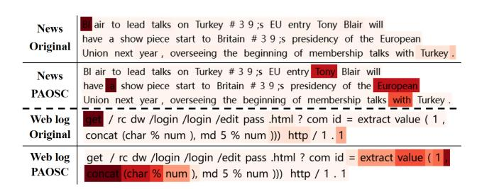
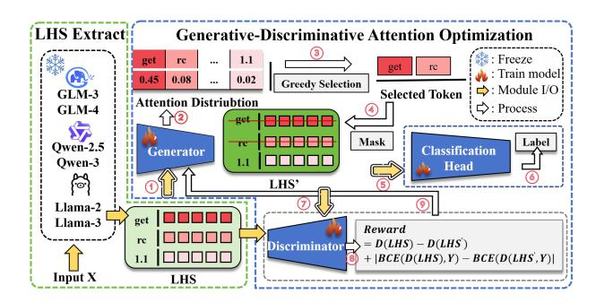

# PAOSC: Plug-and-play Attention Optimization for Semantic Consistency in LLMs

Chang Li Computer Network Information Center, Chinese Academy of Sciences Beijing, China cli@cnic.cn

Yawei Liu Computer Network Information Center, Chinese Academy of Sciences Beijing, China ywliu@cnic.cn

Chun Long∗ Computer Network Information Center, Chinese Academy of Sciences Beijing, China anquanip@cnic.cn

Jing Zhao Computer Network Information Center, Chinese Academy of Sciences Beijing, China jingzhao@cnic.cn

Guanyao Du Computer Network Information Center, Chinese Academy of Sciences Beijing, China duguanyao@cstnet.cn

## Abstract

Attention mechanisms are essential to the success of Large Language Models (LLMs). In practice, models often overemphasize semantically low-value tokens, forming attention sinks while failing to capture truly informative tokens. Existing inference-time optimization methods mainly rely on static adjustments or attention redistribution, which often disrupt the correspondence between attention distribution and the actual semantics of the input, leading to a loss of semantic consistency and degraded performance. To address this problem, we propose PAOSC, a plug-and-play attention optimization model designed to maintain semantic consistency by dynamically adjusting attention. PAOSC employs a generator to identify informative tokens and a discriminator to optimize the generator via policy gradients based on confidence changes and loss fluctuations. Experiments on eight LLMs show up to a 9.68% improvement in the F1 score. On the constructed HTTP-RL dataset, PAOSC eliminates 18% of low-value tokens, improving inference efficiency while maintaining semantic consistency. Our code is available at https://github.com/ChangLi000/PAOSC.

### CCS Concepts

• Computing methodologies → Natural language generation; Lexical semantics.

# Keywords

Large Language Models, Attention Sink, Plug-and-Play, Semantic Consistency

#### ACM Reference Format:

Chang Li, Yawei Liu, Chun Long, Jing Zhao, and Guanyao Du. 2026. PAOSC: Plug-and-play Attention Optimization for Semantic Consistency in LLMs. In Proceedings of the ACM Web Conference 2026 (WWW '26), April 13–17,

\*Corresponding author.

© 2026 Copyright held by the owner/author(s). ACM ISBN 979-8-4007-2307-0/2026/04 <https://doi.org/10.1145/3774904.3792911>

Figure 1: Attention heatmaps on AGnews (News) and HTTP-RL (Web log) before and after PAOSC.

2026, Dubai, United Arab Emirates. ACM, New York, NY, USA, [4](#page-3-0) pages. <https://doi.org/10.1145/3774904.3792911>

# 1 Introduction

LLMs have achieved strong performance across diverse tasks, largely attributed to attention mechanisms that model contextual dependencies [\[4\]](#page-3-1). However, attention sinks arise when models assign excessive weight to semantically low-value tokens while overlooking informative ones. As shown in Figure [1,](#page-0-0) the original attention distribution (News Original and Web log Original) places disproportionate emphasis on the first token [\[12\]](#page-3-2), which carries little meaning. This bias originates from autoregressive decoding, where the first token is visible to all subsequent positions and thus accumulates attention. Such behavior disrupts semantic consistency, which refers to the alignment between the semantics of model outputs or intermediate representations and the intended meaning of the input [\[13\]](#page-3-3).

Most existing studies mitigate attention sinks through fine-tuning in the training-stage [\[8\]](#page-3-4), which is impractical in deployment. Inference time approaches mainly include static adjustment and attention redistribution. Static adjustment methods directly modify attention scores to mitigate attention sinks, typically by heuristically rescaling or masking attention based on confidence-related signals [\[6\]](#page-3-5). Attention redistribution methods mitigate attention sinks by sparsifying or reallocating attention weights according to token-level importance [\[11\]](#page-3-6). In parallel, recent inference-time steering methods, such as contrastive decoding[\[7\]](#page-3-7), logit scaling[\[5\]](#page-3-8),

[This work is licensed under a Creative Commons Attribution 4.0 International License.](https://creativecommons.org/licenses/by/4.0) WWW '26, Dubai, United Arab Emirates

Figure 2: PAOSC Model.

and prompt-based control[\[16\]](#page-3-9), aim to guide model outputs without parameter updates. However, existing static adjustment and attention redistribution methods, as well as inference-time output steering approaches, lack dynamic adaptability and explicit regulation of internal attention behaviors, often failing to maintain semantic consistency, which motivates the design of PAOSC.

To address these issues, we propose PAOSC, a plug-and-play method that performs dynamic attention optimization to preserve semantic consistency. PAOSC adopts a generative–discriminative mechanism. The generator ranks attention scores and uses greedy masking to suppress low-value but high-weight tokens while amplifying semantically important ones, and the discriminator provides reward signals from confidence changes and loss fluctuations to reinforce effective masking. Building on this mechanism, PAOSC produces attention patterns that more faithfully reflect the input semantics. As shown in Figure [1,](#page-0-0) attention shifts from spurious tokens to meaningful cues: in news classification, it focuses on informative words such as "European" and "Tony," enabling correct political-topic inference, while in web logs, it highlights payload fragments such as "extract value(1, concat(char% num," which are essential for detecting web attacks. This improved semantic alignment is consistent with our experimental results, where PAOSC achieves its highest F1 gain of 9.68% on the HTTP-RL dataset using ChatGLM3-6B. To support evaluation of semantic consistency in web attack detection, we additionally construct the HTTP-RL dataset with manually annotated payload fields, enabling direct assessment of whether optimized attention correctly shifts toward key payload semantics.

Our main contributions are as follows: 1) We propose PAOSC, a plug-and-play method that mitigates attention sinks in LLMs through a generative–discriminative optimization strategy, which dynamically adjusts attention using confidence change and loss fluctuation and improves semantic consistency. 2) We construct the HTTP-RL dataset with 21,996 HTTP request lines and manually annotated payload fields, providing a verifiable benchmark for evaluating semantic consistency in web attack anomaly detection.

#### 2 Methodology

The proposed PAOSC model includes an LHS extraction module and a generative–discriminative attention optimization module. As shown in Figure [2,](#page-1-0) the input �� is processed by the frozen LLM to obtain the last hidden state (LHS), which is fed into the generator and discriminator. The generator sorts attention scores, applies greedy masking to select �� high-weight tokens, and produces the masked representation ������′ . The classifier uses ������′ for downstream prediction, while the discriminator compares ������′ with the LHS to compute a policy-gradient reward based on confidence change and loss fluctuation. Training alternates between updating the generator and the discriminator. The following content details how PAOSC performs dynamic attention optimization to maintain semantic consistency in LLMs.

#### 2.1 Generator Module

The PAOSC generator selects informative tokens via a greedy masking strategy. Given input ��, we obtain its last hidden state LHS ∈ R ��×�� from the frozen LLM, providing contextual embeddings for all tokens. A softmax linear layer produces attention scores A ∈ R that reflect token importance. To balance exploitation and exploration, we adopt an ��-greedy masking strategy that masks the Top-�� highest-scoring tokens with probability 1 − �� and randomly samples �� tokens for masking with probability ��.

Imask = ( Top-��, with probability 1 − ��, Random K, with probability ��. (1)

Based on the selected indices Imask, we construct a binary mask M ∈ {0, 1} , where M�� = 0 if token �� is masked and M�� = 1 otherwise. The masked representation is computed via element-wise multiplication, given by LHS′ = LHS ⊙ M, where LHS′ ∈ R ��×�� denotes the masked hidden states of all tokens.

The masked representation LHS′ is used for downstream classification, and the generator is optimized by a joint loss that balances attention optimization Lmask and task performance LC:

L�� = Lmask + LC = − log �� (�� | LHS′ ; ���� ) · FinalReward − ∑︁�� ��=1 ���� log(��ˆ��) (2)

In Eq. [\(2\)](#page-1-1), where �� (�� | LHS′ ; ���� ) denotes the probability of selecting a masking action �� given the input LHS′ , parameterized by ���� . The FinalReward is computed by the discriminator and measures the quality of the masking, encouraging the generator to preserve semantically important tokens and suppress uninformative ones. The cross-entropy term LC ensures that classification performance is maintained while optimizing attention. Through attention-guided greedy masking, the generator focuses on tokens that contribute more to prediction results, mitigating attention sinks and improving the semantic consistency of attention distribution.

#### 2.2 Discriminator Module

The discriminator in PAOSC evaluates the impact of masked tokens and provides reward feedback to guide generator training. Unlike conventional adversarial models that distinguish between real and fake data, the discriminator transforms the discrete masking behavior into a continuous feedback process. To achieve this, a policy gradient method is adopted to design a reward function that quantifies the variation in confidence and prediction error before and after masking, thereby assessing the contribution of masked tokens to model predictions. To ensure reliable feedback, the discriminator is trained to maintain consistent prediction confidence

for the true label �� ∈ {0, 1} before and after masking. Specifically, let ��(·) denote the discriminator score. The discriminator loss L�� is computed using binary cross-entropy (BCE), which measures the distance between the predicted probability and the true label, and is defined as:

L�� = BCE(��(LHS), ��) + BCE(��(LHS′ ), ��) (3)

Beyond its own loss L�� , the discriminator also computes the reward signal required for generator optimization. To handle the non-differentiability of discrete masking, we use a policy gradient with a differentiable reward, enabling the discriminator to guide generator optimization. The reward for each masked token is defined as follows, where LHS�� and LHS′ denote the original and masked representations of the ��th token:

Reward�� = ��(LHS��) − ��(LHS′ �� ) | {z } Confidence Change + BCE(��(LHS��), ��) − BCE(��(LHS′ �� ), ��) Loss Fluctuation (4)

| {z } Confidence change: Measures the variation in discriminator confidence before and after masking. A larger change indicates that the masked token is critical and should receive a higher reward, whereas a smaller change implies limited impact and a penalty.

Loss fluctuation: Measures the change in prediction loss relative to the true label. An increased loss after masking suggests missing key information and thus yields a reward, while a decreased loss implies irrelevance and leads to a penalty.

To stabilize optimization and prevent reward explosion, we compute the average reward ��¯ = �� Í�� ��=1 Reward�� across the �� masked tokens and define the final reward for each token as FinalReward�� = Reward�� − ��. ¯ Tokens with above-average reward receive positive reinforcement, while less informative ones are penalized.

#### 3 HTTP-RL Dataset

The HTTP-RL dataset was collected from real institutional network traffic on March 18, 2025, at 10:09 AM, using Wireshark to capture packets. An Intrusion Detection System (IDS) was used to flag potential malicious HTTP requests, after which false positives were manually removed, yielding 10,998 malicious and 10,998 normal samples. From all 21,996 samples, we extracted the HTTP request line (method, URI, protocol version) and manually identified the payload as the key attack field. The final dataset contains three features: request line, payload, and label (1 for anomaly, 0 for normal). Annotation followed a two-stage expert verification process. First, two experts labeled samples based on IDS alerts and professional judgment, reaching consensus after discussion, and independently extracted payloads with a Jaccard similarity above 90%. Then, three additional experts independently reviewed labels and payloads, using majority voting to confirm correctness. Only samples passing both verification stages were retained.

To justify the need for a new dataset, we compare HTTP-RL with existing benchmarks CSIC2010 [\[10\]](#page-3-10), IDS2012 [\[9\]](#page-3-11), and Open-Stack2023 [\[15\]](#page-3-12). HTTP-RL is collected from real network traffic and contains diverse, complex attack patterns, providing a more realistic

| Model        | Acc   | Spam F1 | Acc   | AGnews F1 | Acc   | HTTP-RL F1 | Acc   | HttpParam F1 |
|--------------|-------|---------|-------|-----------|-------|------------|-------|--------------|
| Llama2-7B-B  | 95.61 | 90.68   | 87.00 | 87.31     | 96.10 | 96.22      | 97.70 | 97.72        |
| Llama2-7B-P  | 99.30 | 98.64   | 88.80 | 88.93     | 99.40 | 99.40      | 99.40 | 99.41        |
| Llama3-8B-B  | 92.74 | 93.84   | 82.90 | 82.64     | 93.30 | 93.63      | 96.90 | 96.99        |
| Llama3-8B-P  | 99.10 | 98.11   | 86.70 | 87.26     | 99.75 | 99.75      | 99.60 | 99.60        |
| GLM3-6B-B    | 98.03 | 95.61   | 87.20 | 87.46     | 89.20 | 90.07      | 97.10 | 97.20        |
| GLM3-6B-P    | 98.50 | 98.52   | 87.70 | 88.02     | 99.75 | 99.75      | 99.70 | 99.80        |
| GLM4-9B-B    | 98.57 | 98.58   | 81.70 | 82.45     | 91.00 | 91.71      | 97.10 | 97.30        |
| GLM4-9B-P    | 98.80 | 98.79   | 90.80 | 90.45     | 99.50 | 99.50      | 99.70 | 99.80        |
| Qwen2.5-7B-B | 97.76 | 94.58   | 80.90 | 81.00     | 94.50 | 94.62      | 97.50 | 97.55        |
| Qwen2.5-7B-P | 99.60 | 98.97   | 90.10 | 90.00     | 99.40 | 99.40      | 99.70 | 99.70        |
| Qwen3-1.7B-B | 96.23 | 96.19   | 79.80 | 80.80     | 93.60 | 93.64      | 92.10 | 92.66        |
| Qwen3-1.7B-P | 98.20 | 98.19   | 85.70 | 85.98     | 99.40 | 99.40      | 97.10 | 97.14        |
| Qwen3-4B-B   | 98.50 | 97.61   | 83.40 | 84.42     | 95.00 | 95.22      | 97.58 | 97.59        |
| Qwen3-4B-P   | 98.83 | 98.49   | 86.60 | 86.76     | 98.20 | 98.21      | 98.60 | 98.61        |
| Qwen3-8B-B   | 98.48 | 98.47   | 83.90 | 84.98     | 97.92 | 97.93      | 97.60 | 97.60        |
| Qwen3-8B-P   | 98.57 | 98.49   | 86.20 | 86.21     | 99.60 | 98.97      | 99.80 | 99.80        |

Table 1: Comparison of baseline (B) and PAOSC (P). Gray rows show PAOSC improvements over the baseline; bold values indicate the best performance in each dataset.

evaluation setting than CSIC2010 and IDS2012 for studying attention behavior and validating PAOSC. Payloads are essential for identifying web attacks [\[2\]](#page-3-13), yet although CSIC2010 and IDS2012 include payload fields, none offers explicit annotations, and OpenStack2023 lacks them entirely. HTTP-RL manually annotates payloads for every request, enabling direct assessment of whether optimized attention aligns with key attack semantics. Pearson correlation analysis further shows that CSIC2010 and IDS2012 contain redundant fields, whereas HTTP-RL retains only the HTTP request line, reducing noise and improving attention learning.

#### 4 Experiments

Settings. We conduct experiments on four datasets: AGnews [\[14\]](#page-3-14), Spam [\[1\]](#page-3-15), HTTP-RL and HttpParam [\[3\]](#page-3-16). Eight LLMs are evaluated, including Llama2-7B, Llama3-8B, Qwen2.5-7B, Qwen3-1.6B, Qwen3-3B, Qwen3-8B, GLM3-6B, and GLM4-9B. The generator contains three Transformer blocks, the discriminator two, and the classifier is a multilayer perceptron. Training uses a learning rate of 1 × 10−4 , batch size 4, and Top-�� = 3 masking with �� = 0.3. Open-source LLMs follow default HuggingFace and Github settings. Experiments are run on four H20-NVLink GPUs (96 GB), and we report average accuracy and F1 across three runs. Despite its generative–discriminative structure, PAOSC remains lightweight, activating 0.46B parameters at inference and 0.95B during training, with all datasets converging within 1.5K steps and incurring minimal time or memory overhead.

Main Results. We evaluate PAOSC on eight LLM backbones, where each model consists of an LLM followed by the PAOSC module and a classification head. As shown in Table [1,](#page-2-0) PAOSC consistently improves performance across all datasets. On Spam, Llama2-7B gains 7.96% F1; on AGnews, Llama2.5-7B gains 9.00%; on HTTP-RL, ChatGLM3-6B gains 9.68%; and on HttpParam, Llama3- 8B gains 2.61%. HTTP-RL shows the highest average improvement

of 5.36%, indicating that PAOSC effectively captures key semantic cues across various text types, such as messages, news, and web logs. Except for the Qwen family, higher-version models generally show larger relative gains under PAOSC. Specifically, newer LLaMA and GLM models achieve average F1 improvements of 4.41% and 4.63%, respectively. Moreover, ChatGLM4-9B with PAOSC attains the highest overall F1 score, reaching 97.14%.

Findings and Analysis. We evaluate the effect of model size on attention optimization across four datasets using Qwen3 as the base model. Baseline F1 scores rise with scale, whereas PAOSC plateaus beyond a certain size. As shown in Table [1,](#page-2-0) the Qwen3-4B model achieves the highest F1 scores of 98.49% on Spam and 86.76% on AGnews, while the largest relative gain appears on smaller models, with a 5.76% improvement on HTTP-RL. Using Qwen3- 8B, removing the bottom 18% low-attention tokens in HTTP-RL reduces F1 by only 0.94%, indicating that PAOSC filters redundant tokens while maintaining robustness. Attention entropy decreases by 2.04%, 13.51%, 2.06%, and 18.36% across the four datasets, confirming effective mitigation of attention sinks. We also analyze the Top-�� hyperparameter on AGnews: F1 peaks at �� = 3 (86.21%), drops at �� = 10, and slightly recovers at �� = 20, suggesting that moderate masking best balances semantic preservation and feedback quality.

Ablation Study. We evaluate the effect of model size on attention optimization using the Qwen3 family. Baseline F1 scores increase with larger model sizes, while PAOSC gradually saturates, with Qwen3-4B achieving the highest F1 scores on Spam (98.49%) and AGnews (86.76%). The largest relative gain occurs on smaller models, such as the 5.76% improvement on HTTP-RL. To verify that PAOSC retains informative tokens, we remove the bottom 18% low-attention tokens on HTTP-RL using Qwen3-8B; the F1 score drops by only 0.94%, showing that tokens suppressed by PAOSC are largely redundant. Further analysis of attention entropy shows decreases of 2.04%, 13.51%, 2.06%, and 18.36% across the four datasets, indicating reduced attention sinks and more semantically aligned attention distributions. Finally, the Top-�� study on AGnews shows that F1 peaks at ��=3, drops at ��=10, and partially recovers at ��=20, suggesting that moderate masking best balances semantic preservation and training feedback.

#### 5 Conclusion

We present PAOSC, a plug-and-play method for dynamic attention optimization that addresses the problem of attention sinks and enhances semantic consistency in LLMs. PAOSC combines greedy masking with policy-gradient-based feedback to suppress redundant high-weight tokens and emphasize semantically informative ones, enabling effective attention refinement without modifying model parameters. Extensive experiments across eight LLMs and four datasets demonstrate consistent gains, with improvements up to 9.68% in F1 and only a 0.94% drop after removing 18% lowattention tokens, confirming that PAOSC preserves essential semantics while filtering redundancy. Overall, PAOSC offers an efficient and generalizable solution for improving inference-time attention behavior in LLMs.

|       | Variant | Acc   | Spam F1 | Acc   | AGnews F1 | Acc   | HTTP-RL F1 | Acc   | HttpParam F1 |
|-------|---------|-------|---------|-------|-----------|-------|------------|-------|--------------|
| w/o   | CC      | 95.70 | 95.81   | 86.70 | 86.84     | 97.80 | 97.81      | 96.80 | 96.88        |
| w/o   | LF      | 96.50 | 96.55   | 85.50 | 85.80     | 92.70 | 93.17      | 99.10 | 99.10        |
| w/o   | GM      | 96.10 | 96.10   | 85.60 | 85.83     | 98.50 | 92.87      | 98.70 | 98.70        |
| w/o   | DR      | 97.90 | 97.90   | 83.50 | 83.19     | 99.40 | 93.14      | 99.20 | 97.13        |
| PAOSC |         | 98.80 | 98.79   | 90.80 | 90.45     | 99.50 | 99.50      | 99.70 | 99.80        |

Table 2: Ablation study of PAOSC with ChatGLM4-9B. CC: confidence change, LF: loss fluctuation, GM: greedy masking, DR: dynamic reward. Bold is the worst.

### Acknowledgments

This research was supported by the National Key Research and Development Program of China (Grant No. 2023YFC3304704) and the Youth Innovation Promotion Association of the Chinese Academy of Sciences (No. 2023181).

# References

[1] Tiago Almeida, José María Gómez Hidalgo, and Akebo Yamakami. 2017. SMS Spam Collection Dataset. [https://www.kaggle.com/datasets/uciml/sms-spam](https://www.kaggle.com/datasets/uciml/sms-spam-collection-dataset)[collection-dataset.](https://www.kaggle.com/datasets/uciml/sms-spam-collection-dataset) Accessed: 2025-08-01. [2] JI Christy Eunaicy and S Suguna. 2022. Web attack detection using deep learning models. Materials Today: Proceedings 62 (2022), 4806–4813. [3] Evg3n1j. 2023. HTTP Parameters Dataset. [https://www.kaggle.com/datasets/](https://www.kaggle.com/datasets/evg3n1j/httpparamsdataset) [evg3n1j/httpparamsdataset.](https://www.kaggle.com/datasets/evg3n1j/httpparamsdataset) Accessed: 2025-08-01. [4] Chi Han, Qifan Wang, Hao Peng, Wenhan Xiong, Yu Chen, Heng Ji, and Sinong Wang. 2023. Lm-infinite: Zero-shot extreme length generalization for large language models. arXiv preprint arXiv:2308.16137 (2023). [5] Jerry Zhi-Yang He, Sashrika Pandey, Mariah L Schrum, and Anca Dragan. 2024. Context steering: Controllable personalization at inference time. arXiv preprint arXiv:2405.01768 (2024). [6] Feng Lin, Marco Chen, Haokui Zhang, Xiaotian Yu, Guangming Lu, and Rong Xiao. 2025. Not All Attention Heads Are What You Need: Refining CLIP's Image Representation with Attention Ablation. arXiv preprint arXiv:2507.00537 (2025). [7] Tianlin Liu, Shangmin Guo, Leonardo Bianco, Daniele Calandriello, Quentin Berthet, Felipe Llinares, Jessica Hoffmann, Lucas Dixon, Michal Valko, and Mathieu Blondel. 2024. Decoding-time realignment of language models. arXiv preprint arXiv:2402.02992 (2024). [8] Pedro Sandoval-Segura, Xijun Wang, Ashwinee Panda, Micah Goldblum, Ronen Basri, Tom Goldstein, and David Jacobs. 2025. Using Attention Sinks to Identify and Evaluate Dormant Heads in Pretrained LLMs. arXiv preprint arXiv:2504.03889 (2025). [9] Ali Shiravi, Hadi Shiravi, Mahbod Tavallaee, and Ali A Ghorbani. 2012. Toward developing a systematic approach to generate benchmark datasets for intrusion detection. computers & security 31, 3 (2012), 357–374. [10] Pedro Torres, Carlos Catania, Sebastian Garcia, and Claudio Garcia Garino. 2011. Anomaly-based network intrusion detection: Techniques, systems and challenges. computers & security 30, 1 (2011), 18–28. [11] Pavlo Vasylenko, Marcos Treviso, and André FT Martins. 2025. Long-Context Generalization with Sparse Attention. arXiv preprint arXiv:2506.16640 (2025). [12] Guangxuan Xiao, Yuandong Tian, Beidi Chen, Song Han, and Mike Lewis. 2024. Efficient streaming language models with attention sinks, 2024. URL https://arxiv. org/abs/2309.17453 1 (2024). [13] Zhongzhi Yu, Zheng Wang, Yonggan Fu, Huihong Shi, Khalid Shaikh, and Yingyan Celine Lin. 2024. Unveiling and harnessing hidden attention sinks: Enhancing large language models without training through attention calibration. arXiv preprint arXiv:2406.15765 (2024). [14] Xiang Zhang, Junbo Zhao, and Yann LeCun. 2015. Character-level convolutional networks for text classification. Advances in neural information processing systems 28 (2015), 649–657. [15] Jieming Zhu, Shilin He, Pinjia He, Jinyang Liu, and Michael R Lyu. 2023. Loghub: A large collection of system log datasets for ai-driven log analytics. In 2023 IEEE 34th International Symposium on Software Reliability Engineering (ISSRE). IEEE, 355–366. [16] Andy Zou, Zifan Wang, Nicholas Carlini, Milad Nasr, J Zico Kolter, and Matt Fredrikson. 2023. Universal and transferable adversarial attacks on aligned language models. arXiv preprint arXiv:2307.15043 (2023).