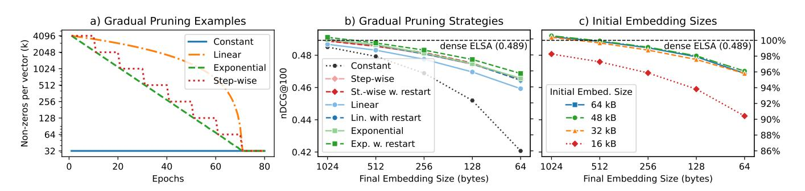
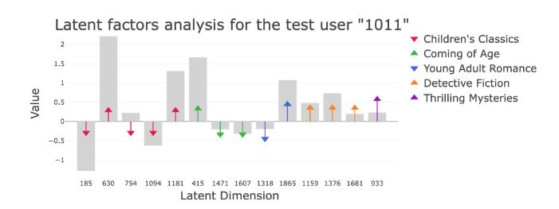

# Efficient Learning of Sparse Representations from Interactions

[Vojtěch Vančura](https://orcid.org/0000-0003-2638-9969)∗ vojtech.vancura@recombee.com Recombee Prague, Czech Republic

[Martin Spišák](https://orcid.org/0009-0006-7763-5575)†∗ martin@topk.io TopK San Francisco, CA, USA

[Rodrigo Alves](https://orcid.org/0000-0001-7458-5281) rodrigo.alves@fit.cvut.cz Czech Technical University in Prague Prague, Czech Republic

[Ladislav Peška](https://orcid.org/0000-0001-8082-4509)

ladislav.peska@matfyz.cuni.cz Faculty of Mathematics and Physics, Charles University Prague, Czech Republic

### Abstract

Behavioral patterns captured in embeddings learned from interaction data are pivotal across various stages of production recommender systems. However, in the initial retrieval stage, practitioners face an inherent tradeoff between embedding expressiveness and the scalability and latency of serving components, resulting in the need for representations that are both compact and expressive.

To address this challenge, we propose a training strategy for learning high-dimensional sparse embedding layers in place of conventional dense ones, balancing efficiency, representational expressiveness, and interpretability. To demonstrate our approach, we modified the production-grade collaborative filtering autoencoder ELSA, achieving up to 10× reduction in embedding size with no loss of recommendation accuracy, and up to 100× reduction with only a 2.5% loss. Moreover, the active embedding dimensions reveal an interpretable inverted-index structure that segments items in a way directly aligned with the model's latent space, thereby enabling integration of segment-level recommendation functionality (e.g., 2D homepage layouts) within the candidate retrieval model itself. Source codes, additional results, as well as a live demo are available at [https://github.com/zombak79/compressed\\_elsa.](https://github.com/zombak79/compressed_elsa)

### CCS Concepts

• Information systems → Recommender systems.

### Keywords

Collaborative Filtering, Linear Autoencoder, Sparse Representation

### ACM Reference Format:

Vojtěch Vančura, Martin Spišák, Rodrigo Alves, and Ladislav Peška. 2026. Efficient Learning of Sparse Representations from Interactions. In Proceedings of the ACM Web Conference 2026 (WWW '26), April 13–17, 2026, Dubai, United Arab Emirates. ACM, New York, NY, USA, [4](#page-3-0) pages. [https:](https://doi.org/10.1145/3774904.3792914) [//doi.org/10.1145/3774904.3792914](https://doi.org/10.1145/3774904.3792914)

## 1 Introduction

From pure collaborative filtering [\[11,](#page-3-1) [15\]](#page-3-2) to sophisticated sequential approaches [\[9,](#page-3-3) [19\]](#page-3-4) , a large body of recommender systems (RSs) research aims to design effective algorithms for learning representations from user–item interactions. This sustained interest stems from the fact that such representations play a central role in production-scale RSs. First, they are crucial in early-stage retrieval, where their quality directly determines which items are surfaced for subsequent ranking stages. Second, these representations are often reused across downstream tasks (e.g., user or item clustering), making their structure and expressiveness broadly impactful. However, in large-scale retrieval scenarios, these representations introduce significant practical challenges. Modern RSs must handle massive item catalogs, yet embedding dimensionality is tightly constrained by serving latency, memory footprint, and compute budgets. As a result, practitioners face a persistent tension: while larger and more expressive embeddings typically improve accuracy, production constraints necessitate compact representations, motivating techniques that balance expressiveness, efficiency, and scalability.

Related Work. Recent advances in document retrieval highlight sparse representations as a powerful alternative to dense embeddings. A prominent example is SPLADE [\[5\]](#page-3-5), which learns sparse representations of text as lexical expansions aligned with vocabulary terms, enabling inverted–index retrieval while achieving accuracy comparable to state-of-the-art dense methods [\[13\]](#page-3-6).

A complementary line of work explores sparse high-dimensional projections of dense embeddings [\[10,](#page-3-7) [22\]](#page-3-8). By constraining only the number of active dimensions, these approaches achieve strong compression with minimal quality loss and have been shown to outperform Matryoshka-style low-dimensional embeddings [\[12\]](#page-3-9) of equal size. The advantage is supported by theoretical results showing that sparse codes in large latent spaces can represent exponentially more distinct patterns than dense vectors at comparable storage budget [\[1\]](#page-3-10), which can be viewed as providing greater effective dynamic range. Moreover, the resulting activation patterns

naturally support efficient inverted-index retrieval algorithms [\[4\]](#page-3-11). RSs face a challenge distinct from document retrieval: rather than operating over a fixed vocabulary of tokens, they maintain embeddings for millions of users and items that evolve over time. Unsurprisingly, these embedding tables dominate model size in modern deep recommenders [\[14\]](#page-3-12), resulting in a memory bottleneck for downstream model inference. As a result, RSs stand to benefit substantially from compact yet expressive representations.

∗Also with Faculty of Mathematics and Physics, Charles University. †Work completed while at Recombee.

[This work is licensed under a Creative Commons Attribution 4.0 International License.](https://creativecommons.org/licenses/by/4.0) WWW '26, Dubai, United Arab Emirates © 2026 Copyright held by the owner/author(s). ACM ISBN 979-8-4007-2307-0/2026/04 <https://doi.org/10.1145/3774904.3792914>

Table 1: Experimental results. We report nDCG@100 for all methods across five embedding sizes (expressed in bytes (B) for ease of comparison). We assume single-precision (float32) storage for all embeddings: dense embeddings store one 4-byte value per latent factor (e.g., 256 factors → 1024 B), while sparse embeddings store each value and its index, totaling 4+4 bytes per nonzero (e.g., 128 nonzeros → 1024 B; in practice, the index would use fewer bytes). Across all datasets and compression budgets, the standard errors were at most around 0.001.

| EASE ELSA |          |       | 0.482, 0.489, | Goodbooks-10k embedding embedding | size size | 40000 B 13000 B |       | 0.425, 0.429, | MovieLens-20M embedding embedding | size size | 82880 B 3200 B |       | 0.394, 0.395, | Netflix embedding embedding | Prize size 71076 size 9800 | B B   |
|-----------|----------|-------|---------------|-----------------------------------|-----------|-----------------|-------|---------------|-----------------------------------|-----------|----------------|-------|---------------|-----------------------------|----------------------------|-------|
| Emb.      | size (B) | 1024  | 512           | 256                               | 128       | 64              | 1024  | 512           | 256                               | 128       | 64             | 1024  | 512           | 256                         | 128                        | 64    |
| Pruned    | EASE     | 0.478 | 0.475         | 0.473                             | 0.469     | 0.458           | 0.419 | 0.414         | 0.404                             | 0.391     | 0.368          | 0.389 | 0.384         | 0.377                       | 0.365                      | 0.343 |
| Low-Dim.  | ELSA     | 0.433 | 0.397         | 0.357                             | 0.316     | 0.270           | 0.420 | 0.410         | 0.394                             | 0.371     | 0.339          | 0.376 | 0.364         | 0.349                       | 0.330                      | 0.307 |
| ELSA      | + SAE    | 0.436 | 0.428         | 0.420                             | 0.413     | 0.408           | 0.391 | 0.383         | 0.378                             | 0.368     | 0.353          | 0.341 | 0.331         | 0.326                       | 0.320                      | 0.314 |
| Compr.    | ELSA     | 0.491 | 0.488         | 0.483                             | 0.477     | 0.469           | 0.427 | 0.421         | 0.412                             | 0.399     | 0.379          | 0.393 | 0.389         | 0.382                       | 0.373                      | 0.357 |

Figure 1: Ablation study: (a) Comparison of gradual pruning strategies; (b) Performance under different pruning strategies with and without training restarts; (c) Effect of initial embedding dimensionality. All results report nDCG@100 on the Goodbooks-10k dataset.

### 3 Experiments

Experimental Setup. We evaluated our model on three widely used recommendation datasets: Goodbooks-10k [\[23\]](#page-3-18), MovieLens-20M [\[8\]](#page-3-19), and Netflix Prize [\[3\]](#page-3-20), following the evaluation setup of [\[21\]](#page-3-14), i.e., feedback binarization and strong generalization with disjoint train, validation, and test set users. Detailed setup description and reproducibility instructions are available from the project repository.

Baselines. The proposed Compressed ELSA was compared against (i) dense, uncompressed models EASE [\[18\]](#page-3-15) and ELSA [\[21\]](#page-3-14), (ii) Low-Dimensional ELSA, i.e., standard ELSA trained with fewer latent factors, and (iii) sparse compression approaches. The last category contained Pruned EASE [\[17\]](#page-3-21), which prunes each row of the weight matrix to retain only the �� largest values in absolute magnitude and ELSA+SAE) [\[10\]](#page-3-7), which uses a sparse autoencoder (SAE) to project learned ELSA embeddings into a sparsely activated latent space.

Accuracy vs. Compression. Table [1](#page-2-1) presents recommendation accuracy results w.r.t. nDCG@100. Across all datasets and compression budgets, Compressed ELSA achieves the best accuracy–size trade-off. Our approach outperforms (i) Low-Dimensional ELSA, which suffers substantial accuracy degradation (especially at higher compression levels); (ii) post-hoc sparse compression (ELSA+SAE); and even (iii) Pruned EASE, which is known to represent a strong parameter-efficient baseline [\[16,](#page-3-22) [17\]](#page-3-21). Ultimately, Compressed ELSA attains accuracy close to uncompressed (dense) ELSA despite being up to two orders of magnitude smaller.

Pruning Schedules and Embedding Width. We tested several configurations of Compressed ELSA's training procedure. For pruning schedules, we used ���� = �� (Constant) as a baseline, and experimented with Linear and Exponential decays of ���� after each epoch, as well as a Step-wise schedule, where ���� was reduced after 10 epochs. The step-wise schedule resembles the approach in the Lottery-Ticket Hypothesis (LTH) paper [\[6\]](#page-3-23) which proposes training networks to convergence before increasing sparsity. We also compared two ways of proceeding after each pruning step: (a) restarting training from the original initialization of the remaining parameters (as in [\[6\]](#page-3-23)), or (b) continuing training from the pruned network.

We found that decreasing �� after each epoch performs better than waiting for full convergence, contrary to the LTH recommendation [\[6\]](#page-3-23) (see Figure [1b](#page-2-0) and extended results in our demo). On the other hand, restarting from the original initialization yields slightly better results than continuing from the pruned network, consistent with prior findings [\[6\]](#page-3-23).

Finally, we evaluated the effect of initial embedding dimensionality ��. Figure [1c](#page-2-0) shows results for the Exponential pruning strategy with restarts, varying �� ∈ {2048, 4096, 6144, 8192}. We find that starting from larger embeddings generally yields higher-quality compressed representations for the same final embedding size, and in some configurations even surpasses the performance of full dense ELSA. However, we observe diminishing returns as �� increases, suggesting that an optimal training cost–performance setting may be close to the one selected for our initial experiments (�� = 4096).

Figure 2: Agreement between user activations and segmentspecific latent dimensions. Gray bars show the user's sparse latent-factor values, and colored arrows mark dimensions linked to semantic segments recommended to this user. The arrows consistently align with the user's activation values, indicating a match in segment-level preferences. (Figure extracted from our online demo.)

Segment Interpretability in Practice. To evaluate whether the sparse latent structure learned by Compressed ELSA produces meaningful and coherent segments, we apply the segmentation procedure described in Section [2](#page-1-2) to the Goodbooks-10k dataset. We observe that items sharing dominant latent factors with the same polarity form semantically coherent groups such as Children's Classics, Detective Fiction, or Thrilling Mysteries. Note that these item segments emerge purely from user interactions, i.e., no metadata used during training. To verify that the segments align with user preferences, we inspect the latent activation patterns of test users. By construction, the activation vector x ⊤ ��¯ �� assigns positive mass to those latent dimensions associated with the user's interacted segments which we observe generally align well with their recommended segments (see Figure [2\)](#page-3-24), and items from those segments consistently appear among the user's top �� recommendations. This reveals a coherent chain of explanation from latent activations through segment relevance to item-level recommendations.

This is further illustrated in our interactive demo [\(http://bit.ly/](http://bit.ly/4oSi5Pj) [4oSi5Pj\)](http://bit.ly/4oSi5Pj), where one can inspect latent activations for different users and their corresponding segment recommendations produced by x ⊤ ��¯ �� ��¯ ⊤ �� . Qualitative inspection confirms that the sparse latent space learned by Compressed ELSA produces interpretable, semantically coherent segments aligned with real user behavior.

## 4 Conclusions and Limitations

We introduced Compressed ELSA, a sparse and scalable variant of ELSA that matches the accuracy of the original model while achieving orders-of-magnitude compression. Our results show that posthoc sparsification (e.g., CompresSAE) degrades quality, whereas gradual pruning schedules preserve accuracy even at high compression levels. The resulting sparse activations also uncover coherent, interpretable item segments aligned with user behavior.

A limitation of our approach is that segment descriptors rely on an external semantic model for labeling latent factors, introducing a dependency on a language model (even though this step is lightweight). In addition, our interpretability evaluation is qualitative and centered on Goodbooks-10k; assessing segment coherence at larger scale is an important direction for future work.

Future work will explore whether the proposed gradual sparsification strategies generalize to non-linear architectures such as

transformer-based models, whose greater sensitivity to gradient updates may necessitate further methodological refinement.

### Acknowledgments

This paper has been supported by the Czech Science Foundation (GAČR) project 25-16785S.

### References

[1] Pierre Baldi and Roman Vershynin. 2021. A theory of capacity and sparse neural encoding. arXiv[:2102.10148](https://arxiv.org/abs/2102.10148) [cs.LG] [2] Nathan Bell and Michael Garland. 2008. Efficient sparse matrix-vector multiplication on CUDA. Technical Report. Nvidia Technical Report NVR-2008-004. [3] James Bennett and Stan Lanning. 2007. The Netflix Prize. KDD Cup and Workshop (2007). [4] Sebastian Bruch, Franco Maria Nardini, Cosimo Rulli, and Rossano Venturini. 2024. Efficient Inverted Indexes for Approximate Retrieval over Learned Sparse Representations. In 47th Int. ACM SIGIR Conference on Research and Development in Information Retrieval (SIGIR '24). ACM, New York, NY, USA, 152–162. [5] Thibault Formal, Benjamin Piwowarski, and Stéphane Clinchant. 2021. SPLADE: Sparse Lexical and Expansion Model for First Stage Ranking. In 44th Int. ACM SIGIR Conference on Research and Development in Information Retrieval. ACM, New York, NY, USA, 2288–2292. [6] Jonathan Frankle and Michael Carbin. 2019. The Lottery Ticket Hypothesis: Finding Sparse, Trainable Neural Networks. arXiv[:1803.03635](https://arxiv.org/abs/1803.03635) [cs.LG] [7] Leo Gao, Tom Dupré la Tour, Henk Tillman, Gabriel Goh, Rajan Troll, Alec Radford, Ilya Sutskever, Jan Leike, and Jeffrey Wu. 2024. Scaling and evaluating sparse autoencoders. arXiv[:2406.04093](https://arxiv.org/abs/2406.04093) [cs.LG] [8] F. Maxwell Harper and Joseph A. Konstan. 2015. The MovieLens Datasets: History and Context. ACM Trans. Interact. Intell. Syst. 5, 4, Article 19 (Dec. 2015), 19 pages. [9] Wang-Cheng Kang and Julian McAuley. 2018. Self-Attentive Sequential Recommendation. In 2018 IEEE Int. Conf. on Data Mining (ICDM). 197–206. [10] Petr Kasalický, Martin Spišák, Vojtěch Vančura, Daniel Bohuněk, Rodrigo Alves, and Pavel Kordík. 2025. The Future is Sparse: Embedding Compression for Scalable Retrieval in Recommender Systems. In Nineteenth ACM Conference on Recommender Systems (RecSys '25). ACM, New York, NY, USA, 1099–1103. [11] Yehuda Koren, Robert Bell, and Chris Volinsky. 2009. Matrix Factorization Techniques for Recommender Systems. Computer 42, 8 (2009), 30–37. [12] Aditya Kusupati, Gantavya Bhatt, Aniket Rege, Matthew Wallingford, Aditya Sinha, Vivek Ramanujan, William Howard-Snyder, Kaifeng Chen, Sham Kakade, Prateek Jain, and Ali Farhadi. 2022. Matryoshka representation learning. In 36th Int. Conf. on Neural Information Processing Systems (NIPS '22). Curran Associates Inc., Red Hook, NY, USA, Article 2192, 17 pages. [13] Carlos Lassance, Hervé Déjean, Thibault Formal, and Stéphane Clinchant. 2024. SPLADE-v3: New baselines for SPLADE. arXiv[:2403.06789](https://arxiv.org/abs/2403.06789) [cs.IR] [14] Shiwei Li, Huifeng Guo, Xing Tang, Ruiming Tang, Lu Hou, Ruixuan Li, and Rui Zhang. 2024. Embedding Compression in Recommender Systems: A Survey. ACM Comput. Surv. 56, 5, Article 130 (Jan. 2024), 21 pages. [15] Dawen Liang, Rahul G. Krishnan, Matthew D. Hoffman, and Tony Jebara. 2018. Variational Autoencoders for Collaborative Filtering. In 2018 World Wide Web Conference (WWW '18). International World Wide Web Conferences Steering Committee, Republic and Canton of Geneva, CHE, 689–698. [16] Martin Spišák, Radek Bartyzal, Antonín Hoskovec, and Ladislav Peška. 2024. On Interpretability of Linear Autoencoders. In 18th ACM Conference on Recommender Systems (RecSys '24). ACM, New York, NY, USA, 975–980. [17] Harald Steck. 2019. Collaborative filtering via high-dimensional regression. arXiv preprint arXiv:1904.13033 (2019). [18] Harald Steck. 2019. Embarrassingly shallow autoencoders for sparse data. In The Web Conference 2019, WWW 2019. arXiv[:1905.03375](https://arxiv.org/abs/1905.03375) [19] Fei Sun, Jun Liu, Jian Wu, Changhua Pei, Xiao Lin, Wenwu Ou, and Peng Jiang. 2019. BERT4Rec: Sequential Recommendation with Bidirectional Encoder Representations from Transformer. In 28th ACM Int. Conf. on Information and Knowledge Management (CIKM '19). ACM, New York, NY, USA, 1441–1450. [20] Vojtěch Vančura, Rodrigo Alves, Petr Kasalický, and Pavel Kordík. 2022. Scalable Linear Shallow Autoencoder for Collaborative Filtering. In 16th ACM Conference on Recommender Systems (RecSys '22). ACM, New York, NY, USA, 604–609. [21] Vojtěch Vančura, Petr Kasalický, Rodrigo Alves, and Pavel Kordík. 2025. Evaluating Linear Shallow Autoencoders on Large Scale Datasets. ACM Trans. Recomm. Syst. (July 2025). Just Accepted. [22] Tiansheng Wen, Yifei Wang, Zequn Zeng, Zhong Peng, Yudi Su, Xinyang Liu, Bo Chen, Hongwei Liu, Stefanie Jegelka, and Chenyu You. 2025. Beyond Matryoshka: Revisiting Sparse Coding for Adaptive Representation. In Int. Conf. on Machine Learning. [23] Zygmunt Zajac. 2017. Goodbooks-10k: a new dataset for book recommendations. [http://fastml.com/goodbooks-10k.](http://fastml.com/goodbooks-10k) FastML (2017).