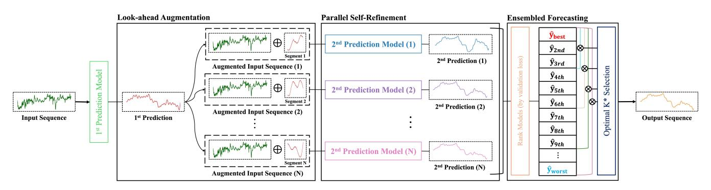

# Back to the Future: Look-ahead Augmentation and Parallel Self-Refinement for Time Series Forecasting

Sunho Kim

Korea University

Computer Science and Engineering Seoul, Republic of Korea sunho\_kim@korea.ac.kr

Susik Yoon

Korea University

Computer Science and Engineering Seoul, Republic of Korea susik@korea.ac.kr

# Abstract

Long-term time series forecasting (LTSF) remains challenging due to the trade-off between parallel efficiency and sequential modeling of temporal coherence. Direct multi-step forecasting (DMS) methods enable fast, parallel prediction of all future horizons but often lose temporal consistency across steps, while iterative multi-step forecasting (IMS) preserves temporal dependencies at the cost of error accumulation and slow inference. To bridge this gap, we propose Back to the Future (BTTF), a simple yet effective framework that enhances forecasting stability through look-ahead augmentation and self-corrective refinement. Rather than relying on complex model architectures, BTTF revisits the fundamental forecasting process and refines a base model by ensembling the second-stage models augmented with their initial predictions. Despite its simplicity, our approach consistently improves long-horizon accuracy and mitigates the instability of linear forecasting models, achieving accuracy gains of up to 58% and demonstrating stable improvements even when the first-stage model is trained under suboptimal conditions. These results suggest that leveraging model-generated forecasts as augmentation can be a simple yet powerful way to enhance long-term prediction, even without complex architectures.

# CCS Concepts

• Computing methodologies → Time series analysis.

# Keywords

Time Series Forecasting, Augmentation, Ensemble

### ACM Reference Format:

Sunho Kim and Susik Yoon. 2026. Back to the Future: Look-ahead Augmentation and Parallel Self-Refinement for Time Series Forecasting. In Proceedings of the ACM Web Conference 2026 (WWW '26), April 13–17, 2026, Dubai, United Arab Emirates. ACM, New York, NY, USA, [4](#page-3-0) pages. <https://doi.org/10.1145/3774904.3792915>

# 1 Introduction

Time series forecasting is essential in various domains, including finance, transportation, and Web-scale services. As Internet systems continue to scale over time, accurate long-term time series forecasting (LTSF) has become crucial for reliability and adaptive decision-making in real-world applications [\[2,](#page-3-1) [6,](#page-3-2) [9\]](#page-3-3). There are two

[This work is licensed under a Creative Commons Attribution 4.0 International License.](https://creativecommons.org/licenses/by/4.0) WWW '26, Dubai, United Arab Emirates

© 2026 Copyright held by the owner/author(s). ACM ISBN 979-8-4007-2307-0/2026/04 <https://doi.org/10.1145/3774904.3792915>

Figure 1: BTTF effectively leverages the strengths of both DMS and IMS for long-term time series forecasting.

predominant strategies for LTSF: direct multi-step forecasting (DMS), which predicts all future steps in parallel but may struggle to capture temporal dependencies, and iterative multi-step forecasting (IMS), which preserves temporal causality via autoregressive prediction at the cost of higher computation and error accumulation.

Most existing methods attempt to mitigate these limitations and better exploit historical inputs mainly through architectural enhancements, such as hierarchical recurrent units [\[3\]](#page-3-4) and selfattention mechanisms [\[4\]](#page-3-5). However, a recent study has shown that a lightweight linear model can be sufficient for modeling historical inputs, outperforming advanced methods with complex architectures [\[10\]](#page-3-6). Inspired by this insight, we aim to leverage both DMS and IMS strategies, while exploiting the simplicity of linear models.

Specifically, we propose Back to the Future (BTTF) for LTSF, a simple yet effective approach based on look-ahead augmentation and parallel self-refinement. As illustrated in Figure [1,](#page-0-0) BTTF leverages segments of initial future predictions together with the historical inputs to ensemble refined forecasts. Consequently, it benefits from DMS-style parallel efficiency while implicitly maintaining the intertemporal dependencies enabled by IMS. The merits of BTTF lie in its systematic capability to quantitatively diagnose and selectively exploit base models across diverse time horizons, thereby mitigating potentially noisy and unstable first-stage forecasts.

Our contributions are summarized as: (i) To the best of our knowledge, this is the first work to simultaneously combine IMS-like leverage of future predictions with DMS-like parallelism for LTSF; (ii) We instantiate the proposed idea on simple linear models through a systematic two-stage training scheme with look-ahead augmentation and parallel self-refinement; (iii) Experimental results demonstrate that the proposed strategy achieves up to 58% performance improvement for linear models on the benchmark datasets, notably not only when they already outperform advanced baselines but also in cases where their first-stage training was unstable.

Figure 2: Overall procedure of BTTF: (i) Look-ahead Augmentation, where the initial predictions are split into segments and appended to inputs to form augmented sequences; (ii) Parallel Self-Refinement, where �� second prediction models are trained on these augmented inputs to refine first predictions; and (iii) Ensembled Forecasting, which ranks models by validation performance, aggregates them via a step-wise top �� ensemble, and selects the optimal �� ∗ to generate the final output sequence.

### 4.4 Ensembled Forecasting

To obtain a stable final forecast, we aggregate the �� second-stage predictions using a step-wise top-�� ensemble. Let the second-stage predictions be ranked by their validation performances as

xˆ (2) 1���� , xˆ (2) 2����, . . . , xˆ (2) �� ��ℎ, (6)

where 1���� denotes the best-performing model. For each candidate ensemble size �� ∈ {��, 2��, . . . , ��} with a step increment ��, we compute the ensemble prediction by averaging the top-�� models:

xˆ (��) = 1 �� ∑︁�� ��=1 xˆ (2) ��-��ℎ. (7)

This step-wise expansion allows us to explore ensembles of increasing diversity without an exhaustive combination search.

However, including diverse models in a top-�� ensemble does not always improve accuracy; a large �� may introduce unstable or redundant predictors, whereas a small �� provides limited variance reduction. Thus, to select an optimal ensemble size �� ∗ , we revisit the ensemble error decomposition by Ueda and Nakano [\[5\]](#page-3-10):

(�� − ��ˆens) 2 = Bias2 + 1 �� Var + 2 �� (�� − 1) ∑︁ ��<�� Cov(���� , ���� ) +�� 2 noise. (8)

This indicates that a good ensemble requires low prediction variance and low inter-model covariance. As both the variance and covariance terms depend on the error values ���� , which are unavailable at inference time, we approximate them using observable statistics of predictions:

�� (��) = Var xˆ (2) 1 , . . . , xˆ �� and ��(��) = MeanCorr xˆ (2) 1 , . . . , xˆ (2) �� . (9)

These statistics serve as practical surrogates for the variance and covariance terms in the decomposition. They also help detect outlier predictors (high �� (��)) and redundant predictors (high ��(��)). Alternatively, we adopt a min–max normalized formulation:

�� (��) = �� (��) −��min ��max −��min + �� + ��(��) − ��min ��max − ��min + �� , (10)

which provides scale-invariant normalization and prevents degeneracy via a small �� &gt; 0. The optimal �� is then chosen as

�� ∗ = arg min �� �� (��). (11)

### 5 Experiments

### 5.1 Experiment Settings

We evaluate BTTF on four real-world benchmarks (ETTh1, ETTm2, Exchange Rate, and ILI) under the univariate forecasting setting. We adopt linear-based models, Linear and DLinear, as base models using the official implementation provided by the LTSF-Linear repository [\[10\]](#page-3-6). We choose two recent methods, iTransformer and SegRNN, from the Time-Series-Library benchmark [\[7\]](#page-3-11) for comparison with advanced architectures. We vary the forecasting horizons for each dataset and measure accuracy in terms of MSE (mean squared error) and MAE (mean absolute error).

For fair comparison, all first- and second-stage models in BTTF utilize identical hyperparameters and are trained using either early stopping or a single-epoch setting. The window size for segmentation is fixed to one-third of the prediction horizon, with a stride of 1 for ILI and {1, 2, 4, 8} for the other datasets. In the step-wise ensemble, the step size is fixed to �� = 5. The implementation details and source codes are provided at [https://github.com/OSsunNO/BTTF.](https://github.com/OSsunNO/BTTF)

### 5.2 Overall Performance

The key findings of the evaluation results in Table [1](#page-3-12) are:

- Applying BTTF to simple Linear and DLinear consistently improves accuracy in most settings, and in many cases achieves competitive or even superior performance compared to strong baselines such as iTransformer and SegRNN.
- Even when the first-stage model is poorly optimized due to unstable or insufficient training, the second-stage models often surpass the best performance reported for the base model, achieving improvements of up to 35%.
- The simplest 1E–1E setting still yields strong results, highlighting that the step-wise ensemble efficiently leverages diverse models.

On ETTm2, however, where the first-stage model is sufficiently fitted, BTTF yields a slight performance drop (around 2% on average). This suggests that our framework can also serve as a practical diagnostic tool to identify whether a base model is fully optimized and has little room for further improvement. Alternatively, a more advanced ensemble strategy could further enhance performance as our strategy conservatively excludes worst-case predictors.

Table 1: Forecasting accuracy results in MSE and MAE over different horizons. Training strategies of BTTF applied for the firstor second-stage model are denoted as ES (early stopping) or 1E (1 epoch), respectively (e.g., ES-1E means early stopping for the first stage and 1 epoch for the second stage). Performance gain over the base model by BTTF is given in parentheses (%). Best results are in bold, and second-best results are underlined.

| Dataset Horizon  | Linear |        |        | Linear+BTTF |     | (ES-1E)  |       |     | Linear+BTTF |       |     | (1E-1E) |       |     | DLinear |        | DLinear+BTTF |       |     | (ES-1E) |       |     | DLinear+BTTF |       |     | (1E-1E) |       |     | iTransformer |        | SegRNN |        |
|------------------|--------|--------|--------|-------------|-----|----------|-------|-----|-------------|-------|-----|---------|-------|-----|---------|--------|--------------|-------|-----|---------|-------|-----|--------------|-------|-----|---------|-------|-----|--------------|--------|--------|--------|
|                  | MSE    | MAE    | MSE    | (%)         |     | MAE      | (%)   |     | MSE         | (%)   |     | MAE     | (%)   |     | MSE     | MAE    | MSE          | (%)   |     | MAE     | (%)   |     | MSE          | (%)   |     | MAE     | (%)   |     | MSE          | MAE    | MSE    | MAE    |
| ILI 24           | 1.6197 | 1.1315 | 0.7097 | (56.2       | ▲   | ) 0.6703 | (40.8 | ▲ ) | 0.6682      | (58.7 | ▲ ) | 0.6547  | (42.1 | ▲ ) | 0.7035  | 0.6638 | 0.6598       | (6.2  | ▲ ) | 0.6124  | (7.8  | ▲ ) | 0.6475       | (8.0  | ▲ ) | 0.6189  | (6.8  | ▲ ) | 0.6797       | 0.6439 | 0.7244 | 0.6280 |
| 36               | 0.8632 | 0.8048 | 0.6837 | (20.8       | ▲   | ) 0.6669 | (17.1 | ▲ ) | 0.6902      | (20.1 | ▲ ) | 0.6725  | (16.4 | ▲ ) | 0.7943  | 0.7403 | 0.7019       | (11.6 | ▲ ) | 0.6505  | (12.1 | ▲ ) | 0.7588       | (4.5  | ▲ ) | 0.7070  | (4.5  | ▲ ) | 0.7492       | 0.7009 | 0.8678 | 0.7119 |
| 48               | 0.8469 | 0.8011 | 0.7180 | (15.2       | ▲   | ) 0.6895 | (13.9 | ▲ ) | 0.7233      | (14.6 | ▲ ) | 0.6970  | (13.0 | ▲ ) | 0.8615  | 0.7931 | 0.7861       | (8.8  | ▲ ) | 0.7174  | (9.6  | ▲ ) | 0.7686       | (10.8 | ▲ ) | 0.7266  | (8.4  | ▲ ) | 0.8123       | 0.7450 | 0.9421 | 0.7596 |
| 60               | 0.8783 | 0.7901 | 0.7464 | (15.0       | ▲   | ) 0.7124 | (9.8  | ▲ ) | 0.8246      | (6.1  | ▲ ) | 0.7601  | (3.8  | ▲ ) | 0.9693  | 0.8668 | 0.7956       | (17.9 | ▲ ) | 0.7405  | (14.6 | ▲ ) | 0.8826       | (9.0  | ▲ ) | 0.8046  | (7.2  | ▲ ) | 0.9494       | 0.8205 | 0.9268 | 0.7768 |
| Exchange Rate 96 | 0.1118 | 0.2555 | 0.1043 | (6.8        | ▲   | ) 0.2455 | (3.9  | ▲ ) | 0.1021      | (8.7  | ▲ ) | 0.2458  | (3.8  | ▲ ) | 0.1053  | 0.2495 | 0.1020       | (3.2  | ▲ ) | 0.2401  | (3.8  | ▲ ) | 0.0991       | (5.9  | ▲ ) | 0.2415  | (3.2  | ▲ ) | 0.1024       | 0.2372 | 0.0966 | 0.2279 |
| 192              | 0.2473 | 0.3811 | 0.2079 | (16.0       | ▲   | ) 0.3539 | (7.1  | ▲ ) | 0.2333      | (5.7  | ▲ ) | 0.3827  | (0.4  | ▼ ) | 0.3080  | 0.4067 | 0.2159       | (29.9 | ▲ ) | 0.3552  | (12.7 | ▲ ) | 0.2001       | (35.0 | ▲ ) | 0.3535  | (13.1 | ▲ ) | 0.2075       | 0.3416 | 0.2034 | 0.3353 |
| 336              | 0.4276 | 0.5129 | 0.3091 | (27.7       | ▲   | ) 0.4571 | (10.9 | ▲ ) | 0.4158      | (2.8  | ▲ ) | 0.5071  | (1.1  | ▲ ) | 0.3339  | 0.4766 | 0.3339       | (-)   |     | 0.4668  | (2.6  | ▲ ) | 0.3083       | (7.7  | ▲ ) | 0.4544  | (4.7  | ▲ ) | 0.4190       | 0.4832 | 0.4311 | 0.5001 |
| 720              | 1.1591 | 0.8464 | 0.8698 | (25.0       | ▲   | ) 0.7370 | (12.9 | ▲ ) | 0.9278      | (20.0 | ▲ ) | 0.7596  | (10.3 | ▲ ) | 1.2503  | 0.8795 | 0.8760       | (29.9 | ▲ ) | 0.7281  | (17.7 | ▲ ) | 0.8589       | (31.3 | ▲ ) | 0.7232  | (17.8 | ▲ ) | 1.1050       | 0.8060 | 1.2795 | 0.8724 |
| ETTh1 96         | 0.0586 | 0.1833 | 0.0559 | (4.6        | ▲   | ) 0.1798 | (1.9  | ▲ ) | 0.0554      | (5.5  | ▲ ) | 0.1797  | (2.0  | ▲ ) | 0.0580  | 0.1805 | 0.0543       | (6.3  | ▲ ) | 0.1778  | (1.5  | ▲ ) | 0.0553       | (4.6  | ▲ ) | 0.1781  | (1.4  | ▲ ) | 0.0576       | 0.1845 | 0.0555 | 0.1838 |
| 192              | 0.0768 | 0.2112 | 0.0737 | (4.0        | ▲   | ) 0.2103 | (0.4  | ▲ ) | 0.0763      | (0.7  | ▲ ) | 0.2094  | (0.9  | ▲ ) | 0.0727  | 0.2126 | 0.0717       | (1.4  | ▲ ) | 0.2061  | (3.1  | ▲ ) | 0.0729       | (0.3  | ▼ ) | 0.2066  | (2.8  | ▲ ) | 0.0727       | 0.2059 | 0.0757 | 0.2182 |
| 336              | 0.0976 | 0.2443 | 0.0867 | (11.3       | ▲   | ) 0.2337 | (4.4  | ▲ ) | 0.0921      | (5.7  | ▲ ) | 0.2383  | (2.5  | ▲ ) | 0.0997  | 0.2464 | 0.0934       | (6.3  | ▲ ) | 0.2393  | (2.9  | ▲ ) | 0.0924       | (7.3  | ▲ ) | 0.2391  | (3.0  | ▲ ) | 0.0829       | 0.2217 | 0.0905 | 0.2399 |
| 720              | 0.1598 | 0.3257 | 0.1535 | (4.0        | ▲   | ) 0.3175 | (2.5  | ▲ ) | 0.1665      | (4.1  | ▼ ) | 0.3322  | (2.0  | ▼ ) | 0.1866  | 0.3570 | 0.1669       | (10.6 | ▲ ) | 0.3304  | (7.5  | ▲ ) | 0.1749       | (6.3  | ▲ ) | 0.3444  | (3.5  | ▲ ) | 0.0807       | 0.2247 | 0.0781 | 0.2257 |
| ETTm2 96         | 0.0662 | 0.1894 | 0.0662 |             | (-) | 0.1898   | (0.2  | ▼ ) | 0.0674      | (1.7  | ▼ ) | 0.1917  | (1.2  | ▼ ) | 0.0638  | 0.1841 | 0.0639       | (0.2  | ▼ ) | 0.1845  | (0.2  | ▼ ) | 0.0640       | (0.3  | ▼ ) | 0.1843  | (0.1  | ▼ ) | 0.0684       | 0.1883 | 0.0686 | 0.1891 |
| 192              | 0.0935 | 0.2299 | 0.0945 | (1.0        | ▼   | ) 0.2299 | (0.6  | ▼ ) | 0.0941      | (0.6  | ▼ ) | 0.2299  | (0.5  | ▼ ) | 0.0914  | 0.2259 | 0.0921       | (0.8  | ▼ ) | 0.2271  | (0.5  | ▼ ) | 0.0924       | (1.2  | ▼ ) | 0.2275  | (0.7  | ▼ ) | 0.1090       | 0.2465 | 0.1027 | 0.2377 |
| 336              | 0.1233 | 0.2658 | 0.1335 | (8.3        | ▼   | ) 0.2808 | (5.6  | ▼ ) | 0.1211      | (1.8  | ▲ ) | 0.2642  | (0.6  | ▲ ) | 0.1189  | 0.2613 | 0.1225       | (3.0  | ▼ ) | 0.2666  | (2.0  | ▼ ) | 0.1243       | (4.5  | ▼ ) | 0.2673  | (2.3  | ▼ ) | 0.1425       | 0.2869 | 0.1335 | 0.2783 |
| 720              | 0.1771 | 0.3225 | 0.1819 | (2.8        | ▼   | ) 0.3276 | (1.6  | ▼ ) | 0.1798      | (1.6  | ▼ ) | 0.3274  | (1.5  | ▼ ) | 0.1740  | 0.3201 | 0.1856       | (6.7  | ▼ ) | 0.3360  | (5.0  | ▼ ) | 0.1866       | (7.2  | ▼ ) | 0.3321  | (3.8  | ▼ ) | 0.1850       | 0.3370 | 0.1858 | 0.3347 |

# 5.3 Computational Efficiency

Although BTTF employs multiple augmented models, the additional computational cost remains manageable. Because the first-stage model is identical to the base model, its training time is unchanged. The second stage introduces extra overhead, requiring approximately 8.3× training time on average; however, this gap is reduced relative to advanced baselines, yielding an average of 2.6× processing time compared to iTransformer and SegRNN, or even a 21% decrease on the ILI dataset. Furthermore, as the second-stage models are independent, this overhead can be substantially reduced by distributing them across multiple processing units for parallel training. The second-stage models also share the same historical input sequence and differ only in the appended augmentation segment, contributing to a compact memory footprint during training.

# 6 Conclusion and Future Work

This work introduced BTTF, a simple framework that leverages forecasting-based augmentation and self-refinement for LTSF. While existing studies mainly focus on architectural innovations to model input-level interactions, our approach shows that prediction performance can be further enhanced by using a model's own future predictions as augmentation signals. Experimental results demonstrate that even lightweight linear models benefit substantially from BTTF, achieving up to 58% performance improvement. These results suggest that the future context of an initial prediction can serve as an effective additional feature. Overall, our framework adopts the benefits of both DMS and IMS by using forecasts not only as outputs but also as informative context for refining predictions, opening new perspectives for LTSF.

For future work, we will extend BTTF to multivariate forecasting by leveraging future predictions as both temporal context and crossvariable signals, while also incorporating predictions from heterogeneous model architectures to enable refinement based on diverse inductive biases. We further plan to explore adaptive segment selection and refinement strategies to better align the framework with dataset-specific temporal characteristics.

### Acknowledgments

This work was partly supported by the Institute of Information & Communications Technology Planning & Evaluation (IITP)-ICT Creative Consilience Program (IITP-2026-RS-2020-II201819), Information Technology Research Center (ITRC) (IITP-2026-RS-2024- 00436857), Artificial Intelligence Star Fellowship Program (IITP-2026-RS-2025-02304828) funded by the Korea government(MSIT), and the Korea Institutes of Police Technology (KIPoT) (RS-2025- 02218280) funded by the Korean National Police Agency.

### References

[1] Berken Utku Demirel and Christian Holz. 2023. Finding order in chaos: A novel data augmentation method for time series in contrastive learning. Advances in Neural Information Processing Systems. [2] Christos Faloutsos, Valentin Flunkert, Jan Gasthaus, Tim Januschowski, and Yuyang Wang. 2019. Forecasting big time series: Theory and practice. In Proceedings of the 25th ACM SIGKDD International Conference on Knowledge Discovery & Data Mining. [3] Shengsheng Lin, Weiwei Lin, Wentai Wu, Feiyu Zhao, Ruichao Mo, and Haotong Zhang. 2025. SegRNN: Segment recurrent neural network for long-term time series forecasting. IEEE Internet of Things Journal (2025). [4] Yong Liu, Tengge Hu, Haoran Zhang, Haixu Wu, Shiyu Wang, Lintao Ma, and Mingsheng Long. 2024. iTransformer: Inverted transformers are effective for time series forecasting. In The Twelfth International Conference on Learning Representations. [5] Naonori Ueda and Ryohei Nakano. 1996. Generalization error of ensemble estimators. In Proceedings of International Conference on Neural Networks. [6] Xiaoyang Wang, Yao Ma, Yiqi Wang, Wei Jin, Xin Wang, Jiliang Tang, Caiyan Jia, and Jian Yu. 2020. Traffic flow prediction via spatial temporal graph neural network. In Proceedings of the Web conference 2020. [7] Yuxuan Wang, Haixu Wu, Jiaxiang Dong, Yong Liu, Mingsheng Long, and Jianmin Wang. 2024. Deep time series models: a comprehensive survey and benchmark. In arXiv preprint arXiv:2407.13278. [8] Qingsong Wen, Liang Sun, Fan Yang, Xiaomin Song, Jingkun Gao, Xue Wang, and Huan Xu. 2021. Time series data augmentation for deep learning: a survey. In Proceedings of the Thirtieth International Joint Conference on Artificial Intelligence. [9] Wentao Xu, Weiqing Liu, Chang Xu, Jiang Bian, Jian Yin, and Tie-Yan Liu. 2021. Rest: Relational event-driven stock trend forecasting. In Proceedings of the Web conference 2021. [10] Ailing Zeng, Muxi Chen, Lei Zhang, and Qiang Xu. 2023. Are transformers effective for time series forecasting?. In Proceedings of the AAAI conference on artificial intelligence. [11] Xiyuan Zhang, Ranak Roy Chowdhury, Jingbo Shang, Rajesh Gupta, and Dezhi Hong. 2023. Towards diverse and coherent augmentation for time-series forecasting. In IEEE International Conference on Acoustics, Speech and Signal Processing.