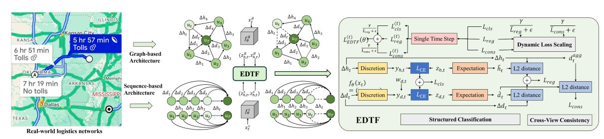
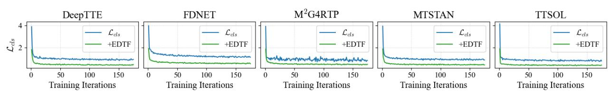

# EDTF: A Plug-and-Play Learning Framework for Estimated Delivery Time Task

Yichen Song Zhejiang University Hangzhou, China syc\_1203@zju.edu.cn

Jianfeng Zhou ByteDance Hangzhou, China zhoujianfeng.zjf@bytedance.com

Renhao Cao ByteDance Hangzhou, China mokaikai@bytedance.com

Jian-Ya Ding∗ ByteDance Hangzhou, China dingjianya@bytedance.com

# Abstract

Accurate estimation of delivery time (EDT) is a critical factor in web e-commerce user experience. The pursuit of higher EDT accuracy has predominantly centered on designing increasingly complex model architectures. While valuable, this architecture-centric paradigm creates a tension between its high iteration costs and the industrial demand for agile deployment. This work, therefore, explores a complementary dimension: enhancing model performance by optimizing the learning process itself. We propose EDTF, a novel, plug-and-play composite learning framework that empowers existing models by augmenting their learning objective. EDTF first transforms the traditional regression problem into a structured ordinal classification task to address the training difficulties inherent in direct regression and preserve temporal order. It then introduces a cross-view consistency paradigm, decomposing the prediction task into two related views: the macroscopic end-to-end delivery time and the microscopic next-hop duration. By enforcing a selfsupervised signal that aligns the sum of future next-hop durations with the overall EDT, our framework enables models to learn more robust temporal representations without extra features. Extensive experiments on a large-scale industrial dataset show that EDTF, as a plugin, consistently enhances performance and accelerates convergence across five diverse architectures. Critically, an EDTFoptimized model has been successfully deployed in a live production environment, demonstrating significant improvements over its predecessor. This work thus presents a validated and valuable new paradigm for the economical and efficient application of web services reliant on trajectory-based forecasting, from e-commerce to ride-hailing and food delivery.

### CCS Concepts

• Applied computing → Online shopping; • Information systems → Data mining.

[This work is licensed under a Creative Commons Attribution 4.0 International License.](https://creativecommons.org/licenses/by/4.0/legalcode)

WWW '26, April 13–17, 2026, Dubai, United Arab Emirates © 2026 Copyright held by the owner/author(s). ACM ISBN 979-8-4007-2307-0/2026/04 <https://doi.org/10.1145/3774904.3792917>

### Keywords

Estimated Delivery Time, Plug-and-Play, Composite Learning Framework, Web E-commerce

#### ACM Reference Format:

Yichen Song, Jianfeng Zhou, Renhao Cao, and Jian-Ya Ding. 2026. EDTF: A Plug-and-Play Learning Framework for Estimated Delivery Time Task. In Proceedings of the ACM Web Conference 2026 (WWW '26), April 13–17, 2026, Dubai, United Arab Emirates. ACM, New York, NY, USA, [4](#page-3-0) pages. <https://doi.org/10.1145/3774904.3792917>

# 1 Introduction

In modern e-commerce, an accurate Estimated Delivery Time (EDT) is a critical factor that directly influences consumer purchasing decisions, enhances user experience, and generates significant economic value [\[3,](#page-3-1) [9\]](#page-3-2). Consequently, the pursuit of higher accuracy has spurred a major and fruitful line of research focused on designing increasingly complex model architectures, from early spatiotemporal networks like DeepTTE [\[6\]](#page-3-3), to attention-based models such as FDNET [\[2\]](#page-3-4) and MTSTAN [\[10\]](#page-3-5), and sophisticated graph-based architectures including M2G4RTP [\[1\]](#page-3-6) and I2RTP [\[4\]](#page-3-7).

However, this architecture-centric approach faces two fundamental challenges. First, its performance gains eventually plateau, as they are ultimately capped by the expressive power of a given architecture and its features. Our work provides strong empirical evidence that this performance ceiling is not absolute and can be significantly raised by optimizing the learning process itself, without altering the model or introducing new features. Second, beyond this performance limitation, the practical challenges of this approach become apparent in fast-paced, web-scale industrial deployments. Pursuing performance gains by adopting a new architecture is a heavyweight operation, often incurring substantial costs from re-engineering data pipelines and implementing new models from scratch. This conflict between the high cost of architectural innovation and the need for agile deployment has become a critical bottleneck. In response, we argue that the focus of innovation should shift from designing more complex architectures to shaping more efficient learning processes. Adhering to this principle, we propose a novel, plug-and-play composite learning framework, termed EDTF (Efficient Estimated Delivery Time Framework). The core idea of EDTF is to reformulate the learning objective itself, thereby empowering any existing model to automatically learn

∗Corresponding author.

Figure 1: An overview of the EDTF framework. �� and �� denote different architecture approaches

training step, this value is updated based on the loss computed over the current mini-batch B:

L¯ �� ← �� · L¯ �� + (1 − ��) · 1 |B| ∑︁ ���� ∈ B L�� ! (7)

where �� is the momentum coefficient. The dynamic weight for this component is then defined as �� L¯ ��+�� , where �� is a scaling hyperparameter and �� is a stability term.

#### 2.3 The Complete EDTF Formulation

Integrating all components, the EDTF framework is guided by a unified, adaptively weighted objective. The complete loss function, LEDTF, is the average loss over all valid time steps M in a sequence:

LEDTF (��) = 1 |M | ∑︁ �� ∈M " L (��) cls + ��cons · �� L¯ cons + �� · L(��) cons + ��reg · �� L¯ reg + �� · L(��) reg # (8)

where the superscript (��) denotes a loss term computed at a single time step ��. The terms L (��) cls , L (��) cons, and L (��) reg correspond to the classification, consistency, and regression losses defined in [§2.2.1](#page-1-0) and [§2.2.2.](#page-1-1) Finally, ���� represents the base weight for each component.

#### 3 Experiment

#### 3.1 Experimental Setup

Dataset.[1](#page-2-1) We construct a large-scale dataset from the real online shop platform, containing over 10 million logistics trajectories from Country A. To ensure a realistic evaluation that accounts for temporal effects, we partition the data chronologically. The training set consists of 22 weeks of data (Jul.–Dec. 2024), followed by a 2 week validation set (late Jan.–early Feb. 2025) and a 1-week test set (mid-Feb. 2025). The final dataset comprises over 200 million EDT events. Key statistics include an average next-hop duration (Δℎ�� ) of 36.79 hours, an average EDT (Δ���� ) of 4.99 days, and an average sequence length (�� ) of 19.77. Preprocessing and Metrics. We first remove duplicate events. To handle outliers, we then apply two distinct clipping strategies based on the 95th percentile. For ultralong sequences, we truncate their length �� by keeping only the first 35 events. For extreme durations and delivery time, we cap the values using the transformations Δℎ ′ �� = min(Δℎ�� , 80 hours) and Δ�� ′ �� = min(Δ���� , 40 days). We evaluate performance using Mean Absolute Error (MAE) and Root Mean Square Error (RMSE).

Implementation Details. Models are trained using the Adam optimizer with an early stopping patience of 5 epochs. Unless otherwise specified, the hyperparameters for our EDTF framework are set as follows: ��reg = 1.0, ��cons = 0.2, �� = 10.0, ����,1 = 5.0, �� = 0.9, �� = 1.0, and �� = 3.0.

### 3.2 General Effectiveness of Plug-in EDTF

We evaluate EDTF's effectiveness as a plug-and-play framework. We replace the native loss functions of five diverse baseline models with EDTF and present the results in Table [1.](#page-3-8) The data shows that EDTF consistently yields significant performance gains across all architectures, confirming the viability of EDTF. The improvements are particularly pronounced for sequence-based models. For instance, EDTF reduces the RMSE for DeepTTE by 2.42%. Most notably, when applied to TTSOL-V1 (the production model at the real online shop), it achieves a remarkable 8.28% reduction in RMSE. On a web-scale dataset, performance gains of this magnitude, validated by tight confidence intervals, are of substantial business value and provide strong evidence for the universality of our framework.

#### 3.3 Ablation Study and Comparative Analysis

To evaluate the contribution of each component, we conduct an ablation study on the TTSOL-V1 backbone (see Table [2\)](#page-3-9). First, the results confirm that every component is essential: transitioning from a standard regression baseline to our classification approach yields significant performance gains, while incorporating ordinal and consistency losses further optimizes metrics to achieve the full EDTF model's peak performance. Second, EDTF outperforms related SOTA methods in accuracy; the tight confidence intervals in Table [2](#page-3-9) confirm the statistical significance of these gains. Specifically, EDTF achieves lower MAE and RMSE than specialized ordinal (Coral [\[5\]](#page-3-10)) and multi-task alignment (PCGrad [\[7\]](#page-3-11), OT [\[8\]](#page-3-12)) techniques. Third, EDTF is substantially more efficient for industrial deployment, with the "Time" column indicating significantly lower training time per epoch than all compared methods. This combination of superior accuracy and high efficiency directly supports agile, low-cost model iteration in dynamic web environments.

#### 3.4 Convergence Acceleration

We also validate our claim that EDTF's auxiliary losses provide richer gradients to accelerate training. We compare the convergence of the primary Lcls on all five backbones within a single training epoch, using a batch size of 512. Fig. [2](#page-3-13) clearly demonstrates that for every model, EDTF leads to a faster initial drop in loss and converges to a significantly lower final value. This provides strong

1Due to company policy, specific details cannot be disclosed at this time.

Table 1: Performance comparison of baseline models with and without the EDTF framework. "w/o EDTF" denotes the model trained with its original loss. "Improve" indicates the percentage reduction in the metric. CI is the 95% confidence interval.

| Model Note w/o DeepTTE [6] A spatiotemporal network for | Framework EDTF | Params 2.24B | MAE 0.661 | ↓ 1 | CI 07e-3 | Improv. — | RMSE 1.811 | ↓ 5 | CI 45e-3 | Improv. — |
|---------------------------------------------------------|----------------|--------------|-----------|-----|----------|-----------|------------|-----|----------|-----------|
| urban vehicle EDT.                                      |                |              |           |     |          |           |            |     |          |           |
| +                                                       | EDTF           | 2.45B        | 0.641     | 1   | 05e-3    | 3.03%     | 1.768      | 5   | 46e-3    | 2.42%     |
| FDNET [2] An attention-based model for EDT              |                |              |           |     |          |           |            |     |          |           |
| in end-stage food delivery.                             |                |              |           |     |          |           |            |     |          |           |
| w/o                                                     | EDTF           | 0.84B        | 0.835     | 1   | 11e-3    | —         | 1.937      | 5   | 25e-3    | —         |
| +                                                       | EDTF           | 0.97B        | 0.820     | 1   | 09e-3    | 1.77%     | 1.895      | 5   | 27e-3    | 2.15%     |
| M 2 G4RTP [1] A graph-based model for                   |                |              |           |     |          |           |            |     |          |           |
| inter-station parcel EDT.                               |                |              |           |     |          |           |            |     |          |           |
| w/o                                                     | EDTF           | 1.00B        | 0.667     | 1   | 08e-3    | —         | 1.828      | 5   | 42e-3    | —         |
| +                                                       | EDTF           | 1.05B        | 0.657     | 1   | 06e-3    | 1.51%     | 1.798      | 5   | 43e-3    | 1.66%     |
| MTSTAN [10] An attention-based model for                |                |              |           |     |          |           |            |     |          |           |
| vehicle route EDT.                                      |                |              |           |     |          |           |            |     |          |           |
| w/o                                                     | EDTF           | 3.05B        | 0.724     | 1   | 09e-3    | —         | 1.867      | 5   | 34e-3    | —         |
| +                                                       | EDTF           | 3.45B        | 0.721     | 1   | 08e-3    | 0.35%     | 1.850      | 5   | 32e-3    | 0.93%     |
| TTSOL-V1 An attention-based model for                   |                |              |           |     |          |           |            |     |          |           |
| parcel EDT in a e-commerce platform.                    |                |              |           |     |          |           |            |     |          |           |
| w/o                                                     | EDTF           | 1.99B        | 0.641     | 1   | 13e-3    | —         | 1.885      | 5   | 99e-3    | —         |
| TTSOL-V2 +                                              | EDTF           | 2.20B        | 0.610     | 1   | 04e-3    | 4.93%     | 1.729      | 5   | 49e-3    | 8.28%     |

Figure 2: Convergence of the classification loss (Lcls) within the first epoch. "+EDTF" denotes the model trained with EDTF.

Table 2: Ablation and comparative analysis on the TTSOL-V1 backbone. Time is reported as hours per epoch (with mixedprecision training). CI is the 95% confidence interval.

empirical evidence that EDTF enhances training efficiency, a key requirement for agile deployment in industrial web applications.

# 3.5 Real-world Impact

The ultimate validation of our framework is its deployment in a live production environment1 . An EDTF-enhanced model, TTSOL-V2, demonstrated significant performance gains over its predecessor in online tests on the real online shop platform. Consequently, the new model has been fully deployed, validating the industrial feasibility and practical value of EDTF.

### 4 Conclusion

We introduced EDTF, a plug-and-play framework that improves EDT performance and deployment efficiency via a reformulated learning objective. Extensive offline and online results confirm its ability to achieve faster convergence and higher accuracy. Our approach serves as a scalable paradigm for various industrial web service applications.

### References

[1] Tianyue Cai, Huaiyu Wan, Fan Wu, Haomin Wen, Shengnan Guo, Lixia Wu, Haoyuan Hu, and Youfang Lin. 2023. M 2 g4rtp: A multi-level and multi-task graph model for instant-logistics route and time joint prediction. In 2023 IEEE 39th International Conference on Data Engineering (ICDE). IEEE, 3296–3308. [2] Chengliang Gao, Fan Zhang, Guanqun Wu, Qiwan Hu, Qiang Ru, Jinghua Hao, Renqing He, and Zhizhao Sun. 2021. A deep learning method for route and time prediction in food delivery service. In Proceedings of the 27th ACM SIGKDD Conference on Knowledge Discovery & Data Mining. 2879–2889. [3] Xiucheng Li, Gao Cong, Aixin Sun, and Yun Cheng. 2019. Learning travel time distributions with deep generative model. In The World Wide Web Conference. 1017–1027. [4] Yuting Qiang, Haomin Wen, Lixia Wu, Xiaowei Mao, Fan Wu, Huaiyu Wan, and Haoyuan Hu. 2023. Modeling intra-and inter-community information for route and time prediction in last-mile delivery. In 2023 IEEE 39th International Conference on Data Engineering (ICDE). IEEE, 3106–3112. [5] Xintong Shi, Wenzhi Cao, and Sebastian Raschka. 2023. Deep neural networks for rank-consistent ordinal regression based on conditional probabilities. Pattern Analysis and Applications 26, 3 (2023), 941–955. [6] Dong Wang, Junbo Zhang, Wei Cao, Jian Li, and Yu Zheng. 2018. When will you arrive? Estimating travel time based on deep neural networks. In Proceedings of the AAAI conference on artificial intelligence, Vol. 32. [7] Tianhe Yu, Saurabh Kumar, Abhishek Gupta, Sergey Levine, Karol Hausman, and Chelsea Finn. 2020. Gradient surgery for multi-task learning. Advances in neural information processing systems 33 (2020), 5824–5836. [8] Zhichen Zeng, Si Zhang, Yinglong Xia, and Hanghang Tong. 2023. Parrot: Position-aware regularized optimal transport for network alignment. In Proceedings of the ACM web conference 2023. 372–382. [9] Xin Zhou, Jinglong Wang, Yong Liu, Xingyu Wu, Zhiqi Shen, and Cyril Leung. 2023. Inductive graph transformer for delivery time estimation. In Proceedings of the Sixteenth ACM International Conference on Web Search and Data Mining. 679–687. [10] Guojian Zou, Ziliang Lai, Changxi Ma, Meiting Tu, Jing Fan, and Ye Li. 2023. When will we arrive? A novel multi-task spatio-temporal attention network based on individual preference for estimating travel time. IEEE Transactions on Intelligent Transportation Systems 24, 10 (2023), 11438–11452.