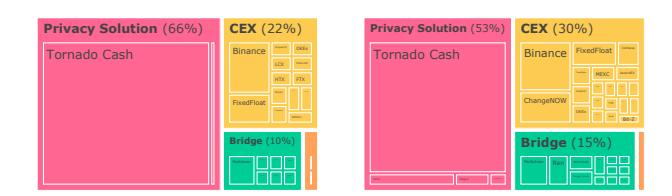
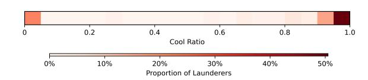
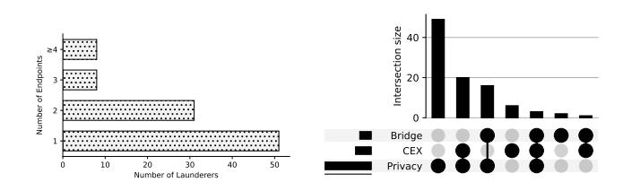
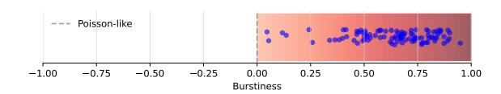
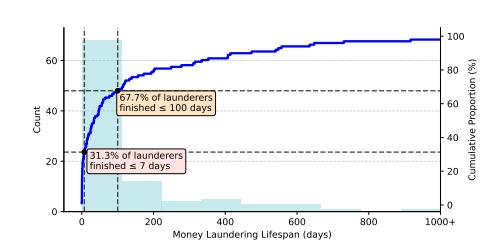
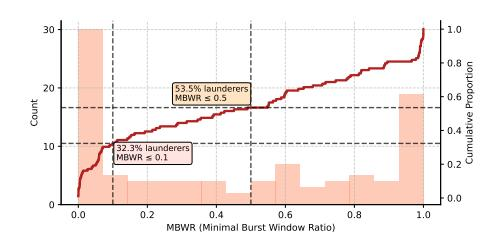
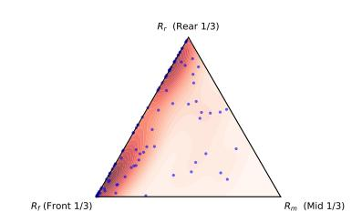
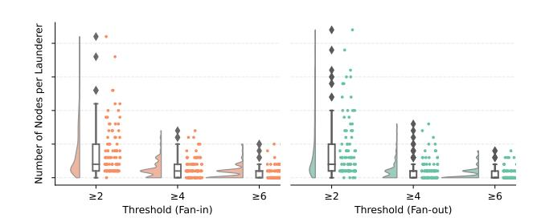
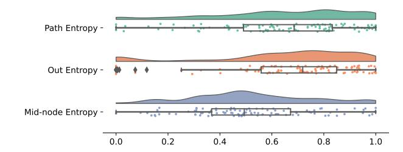

# Understanding Post-Exploit Laundering Behavior on Ethereum

Xihan Xiong xihan.xiong20@imperial.ac.uk Imperial College London London, United Kingdom

Junliang Luo junliang.luo@mail.mcgill.ca McGill University Montreal, Canada

### Abstract

Money laundering enables malicious actors to integrate illegal profits into the legitimate economy and has long been a central concern in financial regulation. Blockchain systems introduce new channels for laundering through decentralized, pseudonymous, and crossborder asset transfers. In this context, blockchain exploiters often rely on laundering to conceal fund origins and enable cash-out.

While prior work has focused on detecting suspicious accounts or transactions, the behavioral patterns underlying laundering practices remain underexplored. This paper provides a behavioral perspective on post-exploit laundering on Ethereum. We use onchain tracing to reconstruct token flows originating from exploitercontrolled addresses. We then define a set of behavioral metrics covering financial trajectories, temporal dynamics, structural topology, and value dispersion. Our empirical study reveals recurring patterns, including rapid fund movement, shallow transfer structures, and broad dispersion. These patterns exhibit measurable regularities, suggesting that behavioral dynamics could be leveraged to enhance existing laundering detection frameworks.

# CCS Concepts

- Security and privacy → Distributed systems security; Social and professional topics → Financial crime.

# Keywords

Money Laundering, Behavioral Analysis, Blockchain, Ethereum

### ACM Reference Format:

Xihan Xiong and Junliang Luo. 2026. Understanding Post-Exploit Laundering Behavior on Ethereum. In Proceedings of the ACM Web Conference 2026 (WWW '26), April 13–17, 2026, Dubai, United Arab Emirates. ACM, New York, NY, USA, [4](#page-3-0) pages.<https://doi.org/10.1145/3774904.3792918>

# 1 Introduction

Money laundering facilitates organized crime by obscuring the origin of illicit funds and enabling them to enter the legitimate financial system. As cryptocurrencies gain wider adoption, money laundering has become increasingly prevalent on blockchains. This trend reflects the structural challenges that blockchain systems pose to anti-money laundering (AML). Transactions are public, but users are pseudonymous; transfers are fast, borderless, and decentralized. These properties complicate efforts to trace illicit activities.

[This work is licensed under a Creative Commons Attribution 4.0 International License.](https://creativecommons.org/licenses/by/4.0) WWW '26, Dubai, United Arab Emirates © 2026 Copyright held by the owner/author(s). ACM ISBN 979-8-4007-2307-0/2026/04 <https://doi.org/10.1145/3774904.3792918>

Blockchain-based exploits often yield substantial financial gains, prompting exploiters to extract large volumes of tokens into controlled addresses. However, these stolen assets cannot be used directly. If left unlaundered, they risk being traced, frozen, or blacklisted by exchanges and compliance systems. To avoid this, money laundering becomes a critical step in post-exploit fund movement.

Related Work: Prior studies on money laundering focus on detecting suspicious accounts [\[3,](#page-3-1) [6\]](#page-3-2) and transactions [\[1,](#page-3-3) [4,](#page-3-4) [5\]](#page-3-5) using machine learning [\[1,](#page-3-3) [4\]](#page-3-4), reinforcement learning [\[2,](#page-3-6) [5\]](#page-3-5), and graph methods [\[3,](#page-3-1) [6\]](#page-3-2). However, most studies treat money laundering as an anomaly to be detected rather than a process to be understood.

This study approaches the problem from a behavioral perspective, analyzing laundering activities through metric-driven characterization. We summarize our contributions as follows:

- We propose a lightweight tracing framework that reconstructs token flow graphs for exploiter-controlled addresses on Ethereum.
- We analyze money laundering behaviors by introducing a set of metrics across four analytical dimensions: financial trajectories, temporal dynamics, structural topology, and value dispersion.
- We conduct an empirical study of 102 post-exploit laundering cases on Ethereum. Our analysis reveals recurring patterns across cases. Most launderers move funds rapidly, use shallow transfer structures, and broadly disperse value across addresses.

### 2 On-chain Tracing

# 2.1 Tracing Method

We propose a light tracing method using [Etherscan](https://docs.etherscan.io/api-endpoints/) APIs, as shown in Algorithm [1.](#page-1-0) Starting from a target Externally Owned Account (EOA) address, we iteratively trace outgoing ETH and ERC-20 token transfer flows within a specified block range. We first collect normal transactions to capture direct ETH transfers, then include internal transactions to trace ETH transfers via smart contracts. We further crawl token transfer events to follow ERC-20 flows, and when we encounter exchange contract addresses, we parse their logs to capture token swaps. At each hop, we expand to new recipient addresses if the transferred value exceeds a minimum threshold while pruning expansion at high-degree EOAs to avoid hub-induced graph explosion. By repeating this process until the hop limit is reached, we construct a directed graph that shows how coins propagate outward from the target address. We also use a similar backward-tracing method to capture incoming ETH and ERC-20 token flows within the same block range.

# 2.2 Data and Graph Construction

We compiled a dataset of candidate incidents from public reports between January 2020 and January 2024, focusing on Ethereum-native exploits and cross-chain exploits whose proceeds were laundered

weights. The normalized entropy is:

��ˆ out(��0) = − 1 log2 �� ∑︁ �� ��=1 ���� log2 ���� (7)

- Mid-node Entropy: Extends outflow entropy to all internal nodes ��mid = {�� | deg+ (��) ≥ 1 ∧ deg− (��) ≥ 1}. For each �� ∈ ��mid, compute normalized entropy ��ˆ out(��) as above. The mean is:

��ˆmid = 1 |��mid | ∑︁ ��∈��mid ��ˆ out(��) (8)

- Path Entropy: Measures global fund dispersion across all �� paths from the exploiter node ��0 in the transaction graph �� = (�� , ��) with ETH-valued edge weights. We enumerate acyclic forward paths ���� via depth-first search (up to a hop limit), and define path weights as ���� = Î (��,��) ∈���� Í ������ (��,��′ ) ∈�� ������′ . Then:

��ˆ path = − 1 log2 �� ∑︁ �� ���� log2 ���� (9)

### 3.2 Metrics-Based Behavior Analysis

3.2.1 Financial Trajectory Analysis. Fig. [1](#page-2-0) and Fig. [2](#page-2-0) illustrate the distributions of unique ESPs at the sources and destinations of money laundering trajectories. On the source side, 66% of the startpoints involve privacy tools, with Tornado Cash being the most common. Similarly, privacy tools dominate the endpoints at 53%. Meanwhile, CEXs and bridges were used occasionally, while payment gateways and mining pools were rarely observed.

Figure 1: Source ESPs. Figure 2: Destination ESPs.

Figure 3: Endpoints counts. Figure 4: ESP combinations.

Number of Endpoints. Most launderers use only one or two destination ESPs (mean = 1.79), though a long tail reaches up to eight (Fig. [3\)](#page-2-1). This distribution indicates that while most consolidate outflows, some engage more endpoints to increase obfuscation.

Endpoint Category Diversity. Fig. [4](#page-2-1) shows the overlap of ESP categories used as fund destinations. The most common pattern is exclusive use of privacy services (50.5%), followed by combinations with CEXs (20.6%) and bridges (16.5%). A small fraction (3.1%) uses all three, suggesting more sophisticated strategies.

Findings. Privacy tools dominate both sources and destinations of fund flows. About half of the cases rely solely on privacy services, while others combine them with CEXs or bridges. Most launderers use only one or two endpoints overall.

3.2.2 Temporal Dynamics Analysis. This section investigates the temporal dynamics of money laundering behaviors and analyzes how the timing and rhythm of activities reflect behavioral patterns.

Lifespan. Fig. [5](#page-3-7) shows that most laundering activities are shortlived. 31.3% conclude within 7 days, and 67.7% within 100 days. A small subset adopts prolonged strategies that last beyond 200 days, possibly to evade detection by spreading their activity over time.

MBWR. Fig. [6](#page-3-7) shows that laundering activity is often temporally concentrated. 32.3% of launderers have MBWR ≤ 0.1, meaning 80% of transactions occur within 10% of lifespan; 53.5% stay within 0.5. This indicates that laundering is often executed in short bursts.

Burstiness. The metric ranges from -1 (regular) to 1 (highly bursty). Fig. [10](#page-2-2) further shows that most launderers exhibit clustered activity because burstiness values are centered between 0.5 and 0.9.

Figure 10: Distribution of transaction burstiness.

Cool Ratio. Fig. [11](#page-2-3) shows the distribution of the proportion of inactivity periods within laundering lifespans. The distribution is polarized: 66.7% of launderers lie near 1, 21.2% near 0, with few in between. This suggests two dominant strategies: either rapid execution or highly intermittent bursts separated by long delays.

Figure 11: Distribution of cool ratio.

Temporal Segment Ratios. Fig. [7](#page-3-7) shows that most launderers concentrate activity in the front or rear third of their lifespan, with few mid-dominant or balanced cases. This suggests laundering is typically front- or rear-loaded, while mid-loaded patterns are rare.

Findings. Laundering activity often unfolds over short durations. Many launderers carry out most transactions within brief and concentrated phases, while others follow highly intermittent patterns, pausing for long periods between bursts. In terms of timing, activity tends to occur near the beginning or end of the process, with mid-phase activity being relatively rare.

Figure 5: Empirical CDF of lifespan.

Figure 6: Empirical CDF of MBWR.

Figure 7: Temporal segment ratios.

Figure 8: Fan-in and fan-out node counts across thresholds.

Figure 9: Distribution of flow dispersion metrics.

3.2.3 Flow Topology Analysis. This section investigates the structural topology of laundering transaction graphs. We focus on how launderers shape the connectivity and layout of their fund flows.

Path Length to Endpoints. Our data show that most launderers route funds through short transfer chains, with an average path length of 1.8 hops. Destinations are typically reached within 1–3 hops. While some cases involve longer paths of up to 6 hops for added obfuscation, such depth is rare and selectively used.

Graph Density. All laundering graphs exhibit low density (with a median of 0.18). This indicates sparse structures. Rather than forming dense clusters, these graphs resemble chains, trees, or lightly branched flows. Most addresses act as transient intermediaries with limited connections and little reciprocal interaction.

Fan-In and Fan-Out Counts. Fig. [8](#page-3-8) shows that fan-in and fan-out node counts drop sharply as the degree threshold rises, indicating most graphs use low-degree connections. Across thresholds, fan-in and fan-out show similar distributions, suggesting both splitting and merging behaviors are common but neither dominates.

Findings. Laundering flow topologies exhibit shallow path depth and sparse transaction graphs, with splitting and merging behaviors co-occurring at a balanced rate.

3.2.4 Flow Dispersion Analysis. This section analyzes the dispersion characteristics of money laundering fund flows.

Dispersion Metrics. Figure [9](#page-3-8) shows the distributions of path, outflow, and mid-node entropy. Path entropy is strongly rightskewed, with most values above 0.6, suggesting launderers often construct structurally complex or branching paths to increase ambiguity. Outflow entropy follows a similar trend, indicating that direct fund splitting from the exploiter address is common. Mid-node entropy is more centered, mostly between 0.3 and 0.6, implying that intermediate redistribution is less frequent.

Findings. Most laundering flows exhibit high path and outflow entropy, reflecting early and broad fund dispersion. In contrast, mid-node entropy is more moderate, indicating that intermediate redistribution is less common.

### 4 Conclusion

This study presents a metrics-driven behavioral analysis of postexploit money laundering on the Ethereum blockchain. By tracing token flows and introducing behavioral metrics across temporal, structural, and value dimensions, we reveal common laundering patterns such as rapid movement, shallow transfer structures, and broad value dispersion. These suggest that laundering behavior is not ad hoc, but follows repeatable structures that can be measured.

These measurable regularities point to the potential of behavioral patterns as a complementary feature set for blockchain money laundering detection. Future detection systems may benefit from incorporating behavioral signals and flow structures.

### References

[1] AA Badawi and Q Abu Al-Haija. 2021. Detection of money laundering in bitcoin transactions. In 4th Smart Cities Symposium (SCS 2021), Vol. 2021. IET, 458–464. [2] Arvind Dagur, S Kakharov Shukrullo, and Nuritdinov Jalolxon. 2024. Improving cryptocurrency money laundering detection through reinforcement learning techniques. In Intelligent Computing and Communication Techniques. CRC Press. [3] Dan Lin, Jiajing Wu, Yunmei Yu, Qishuang Fu, Zibin Zheng, and Changlin Yang. 2024. DenseFlow: Spotting cryptocurrency money laundering in ethereum transaction graphs. In Proceedings of the ACM Web Conference 2024. 4429–4438. [4] Algimantas Venčkauskas, Šarunas Grigali ¯ unas, Linas Pocius, Rasa Br ¯ uzgien ¯ e, and ˙ Andrejs Romanovs. 2024. Machine learning in money laundering detection over blockchain technology. IEEE Access (2024). [5] Qianyu Wang, Wei-Tek Tsai, and Tianyu Shi. 2025. GraphALM: Active Learning for Detecting Money Laundering Transactions on Blockchain Networks. IEEE Network 39, 2 (2025), 294–303. [6] Jiajing Wu, Dan Lin, Qishuang Fu, Shuo Yang, Ting Chen, Zibin Zheng, and Bowen Song. 2023. Toward understanding asset flows in crypto money laundering through the lenses of Ethereum heists. IEEE Transactions on Information Forensics and Security 19 (2023), 1994–2009.