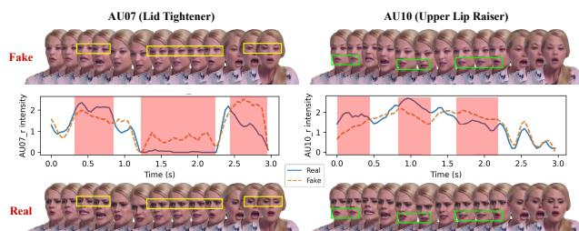
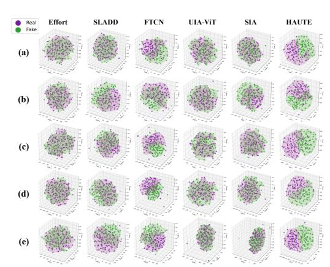

# HAUTE: Harmonizing Action Units with Temporal-contextual Embeddings for Deepfake Detection

[Chaewon Kang](https://orcid.org/0009-0008-5255-540X) Sungkyunkwan University Seoul, Republic of Korea codnjs3@g.skku.edu

Youjin Lee Sungkyunkwan University Seoul, Republic of Korea ujina123@g.skku.edu

Jinyoung Han∗ Sungkyunkwan University Seoul, Republic of Korea jinyounghan@skku.edu

# Abstract

The proliferation of highly realistic deepfake videos threatens public trust and the integrity of digital information. However, detecting sophisticated deepfakes requires analysis beyond surface-level visual artifacts. We propose Harmonizing Action Units with Temporalcontextual Embeddings (HAUTE), integrating physiological muscle dynamics with holistic semantic context through adaptive attention mechanisms. HAUTE captures temporal Action Unit coordination patterns and high-level contextual embeddings, enabling the model to reveal synthesis-induced inconsistencies imperceptible to isolated modalities. Extensive experiments demonstrate state-of-the-art performance with strong cross-dataset adaptability, particularly on commercial tool-based high-quality deepfakes, advancing trustworthy content verification for web ecosystems.

### CCS Concepts

• Computing methodologies → Computer vision; Artificial intelligence; Computer vision tasks; Image representations.

### Keywords

Deepfake Detection, Action Unit, Feature Fusion, Temporal Dynamics

### ACM Reference Format:

Chaewon Kang, Youjin Lee, and Jinyoung Han. 2026. HAUTE: Harmonizing Action Units with Temporal-contextual Embeddings for Deepfake Detection. In Proceedings of the ACM Web Conference 2026 (WWW '26), April 13–17, 2026, Dubai, United Arab Emirates. ACM, New York, NY, USA, [4](#page-3-0) pages. <https://doi.org/10.1145/3774904.3792919>

# 1 Introduction

The rapid advancement of generative AI technologies has enabled even non-technical users to create and disseminate highly realistic deepfake videos easily. As massive volumes of sophisticated deepfake videos proliferate across social media and online platforms, such content poses serious social harms, including misinformation propagation, political manipulation, and the production of non-consensual pornography. This accelerates the erosion of trust in web-based content, fundamentally threatening the verifiability of digital media authenticity and the credibility of online information ecosystems. In response to these threats, extensive research has been conducted on deepfake detection, such as global

∗Corresponding author

© 2026 Copyright held by the owner/author(s). ACM ISBN 979-8-4007-2307-0/2026/04 <https://doi.org/10.1145/3774904.3792919>

Figure 1: Physiological coordination anomalies in deepfake facial expressions. AU intensity trajectories for AU07 (Lid Tightener) and AU10 (Upper Lip Raiser) extracted from real and deepfake videos. Colored boxes indicate tracked facial regions. Red-shaded intervals highlight temporal asynchronies and intensity discrepancies in deepfakes.

appearance-based approaches [\[14\]](#page-3-1) and frequency-domain methods [\[18\]](#page-3-2). However, recent deepfake generation models effectively suppress low-level visual artifacts, posing fundamental limitations for artifact-based detection approaches [\[16\]](#page-3-3).

We shift focus to a more fundamental cue that is resistant to forgery: the physiological dynamics of facial musculature. In authentic human facial expressions, specific muscle units, i.e., Action Unit (AU) as defined in the Facial Action Coding System (FACS), activate in physiologically coordinated patterns during expression transitions [\[4\]](#page-3-4). For example, AU07 (Lid Tightener) and AU10 (Upper Lip Raiser) activate in temporal synchrony when expressing disgust. However, such inter-muscle coordination is difficult to replicate accurately during deepfake synthesis, resulting in subtle asynchronies such as delayed activation or intensity mismatches in AU07 (see Figure [1\)](#page-0-0) [\[8\]](#page-3-5). Thus, synthesized faces exhibit physiologically unnatural patterns across both temporal AU dynamics and holistic facial movement coordination.

Motivated by this observation, several AU-based deepfake detection methods have been proposed [\[1,](#page-3-6) [13\]](#page-3-7). However, key limitations remain unaddressed: (1) relying solely on AU intensity signals may overlook the broader semantic context of the face, and (2) modeling only static inter-AU relationships may insufficiently capture dynamic changes over time.

To address these limitations, we propose Harmonizing Action Units with Temporal-contextual Embeddings (HAUTE), which integrates physiological muscle dynamics with global contextual information through three specialized components. The Temporal Physiological Encoding Stream models bidirectional temporal patterns of muscle activation, while the Holistic Semantic Encoding Stream captures high-level facial semantics via pretrained vision encoders. The Attentive Feature Harmonization Module adaptively

[This work is licensed under a Creative Commons Attribution 4.0 International License.](https://creativecommons.org/licenses/by/4.0) WWW '26, Dubai, United Arab Emirates

Table 1: Deepfake detection performance on benchmark datasets. Best and second-best results are in bold and underlined, respectively.

|            | Method | F1 ↑  | FF++ AUC | ↑ F1 ↑ | DFDC AUC | ↑ F1 ↑ | DFGC AUC | ↑ F1 ↑ | FakeAVCeleb AUC | ↑ F1 ↑ | HiDF AUC ↑ |
|------------|--------|-------|----------|--------|----------|--------|----------|--------|-----------------|--------|------------|
| Effort     | [15]   | 0.808 | 0.887    | 0.772  | 0.748    | 0.922  | 0.968    | 0.956  | 0.895           | 0.874  | 0.944      |
| TALL       | [14]   | 0.367 | 0.656    | 0.581  | 0.784    | 0.780  | 0.647    | 0.932  | 0.970           | 0.889  | 0.953      |
| SBI        | [11]   | 0.813 | 0.939    | 0.237  | 0.661    | 0.255  | 0.785    | 0.814  | 0.942           | 0.221  | 0.662      |
| SLADD      | [2]    | 0.668 | 0.782    | 0.829  | 0.916    | 0.683  | 0.958    | 0.818  | 0.940           | 0.677  | 0.942      |
| FTCN       | [17]   | 0.828 | 0.956    | 0.437  | 0.809    | 0.915  | 0.978    | 0.877  | 0.889           | 0.851  | 0.941      |
| UIA_ViT    | [19]   | 0.726 | 0.805    | 0.779  | 0.910    | 0.965  | 0.994    | 0.942  | 0.977           | 0.859  | 0.924      |
| SIA        | [12]   | 0.795 | 0.872    | 0.800  | 0.891    | 0.739  | 0.840    | 0.871  | 0.908           | 0.803  | 0.873      |
| HAUTE(w/o  | Phys.) | 0.875 | 0.898    | 0.847  | 0.887    | 0.778  | 0.679    | 0.927  | 0.832           | 0.720  | 0.843      |
| HAUTE(w/o  | Sem.)  | 0.723 | 0.785    | 0.664  | 0.657    | 0.791  | 0.709    | 0.927  | 0.604           | 0.652  | 0.675      |
| HAUTE(all) |        | 0.896 | 0.963    | 0.923  | 0.953    | 0.973  | 0.995    | 0.991  | 0.992           | 0.897  | 0.960      |

H fused = LN H ���� + Drop (Concat(head1, . . . , headℎ)W�� ) (6)

where LN and Drop denote layer normalization and dropout, respectively, W�� ∈ R ℎ���� ×�� projects the concatenated outputs from ℎ heads (each of dimension ���� ) to dimension ��, with residual connections and layer normalization for training stability.

Video-Level Prediction. The fused sequence H fused ∈ R �� ×�� is aggregated via temporal mean pooling to obtain a video-level representation:

h = 1 �� ∑︁ �� ��=1 ℎ fused �� ∈ R �� (7)

ℎ is passed through a non-linear classification module with ReLU activations and dropout regularization to produce the final detection logit. HAUTE is optimized end-to-end using binary cross-entropy loss with label smoothing:

L = − 1 �� ∑︁ �� ��=1 [��˜�� log ���� + (1 − ��˜��) log(1 − ����)] (8)

where ��, ���� , and ��˜�� denote the batch size, predicted probability, and smoothed label, respectively.

### 3 Experimental Results

### 3.1 Experimental Settings

Datasets. We evaluate HAUTE on five widely-used deepfake benchmarks. FaceForensics++ (FF++) [\[10\]](#page-3-15) contains 4,000 fake videos generated by applying four manipulation methods to YouTube videos. Deepfake Detection Challenge (DFDC)[\[3\]](#page-3-16) provides 104,500 fake videos as a large-scale challenge dataset created using eight face swap techniques. FakeAVCeleb [\[6\]](#page-3-17) is an audio-visual deepfake dataset comprising 500 celebrities selected with consideration for racial and gender balance. To assess detection performance against deepfakes generated in real-world scenarios, we additionally employ DeepFake Game Competition (DFGC) [\[9\]](#page-3-18) and Human-Indistinguishable DeepFake (HiDF) [\[5\]](#page-3-19), which include data produced using commercial tools.

Implementation Details. The sequence length is set to ��max = 32 frames across all experiments. The Temporal Physiological Encoding Stream is configured with hidden size 64 to generate representations of shared embedding dimension �� = 128. The Holistic Semantic Encoding Stream utilizes CLIP ViT-Large/14 with frozen weights as a pretrained vision encoder. The Attentive Feature Harmonization Module employs ℎ = 4 attention heads with dropout rate 0.1, while the classification head uses dropout rate 0.3. The model is trained for 50 epochs using the AdamW optimizer with

Table 2: Cross-dataset evaluation results. FF++/FF++ denotes training, validation, and testing on FF++, while FF++/HiDF denotes training and validation on FF++ and HiDF in a 9:1 ratio and testing on HiDF. Best and second-best results are in bold and underlined, respectively.

| Metrics     |       | Effort | TALL  | SBI   | SLADD | FTCN  | UIA_ViT | SIA   | HAUTE |
|-------------|-------|--------|-------|-------|-------|-------|---------|-------|-------|
| FF++ / FF++ | F1 ↑  | 0.808  | 0.367 | 0.813 | 0.668 | 0.828 | 0.726   | 0.795 | 0.896 |
|             | AUC ↑ | 0.887  | 0.656 | 0.939 | 0.782 | 0.956 | 0.805   | 0.872 | 0.963 |
| FF++ / HiDF | F1 ↑  | 0.798  | 0.608 | 0.124 | 0.701 | 0.653 | 0.388   | 0.604 | 0.782 |
|             | AUC ↑ | 0.878  | 0.517 | 0.642 | 0.827 | 0.748 | 0.532   | 0.750 | 0.881 |

learning rate �� = 1×10−4 , batch size 32, and label smoothing �� = 0.1. All frames are resized to 256 × 256 resolution. The classification threshold is set to �� = 0.5.

Baselines and Evaluation Protocol. To validate HAUTE's performance, we compare against seven state-of-the-art deepfake detection methods: Effort [\[15\]](#page-3-9), TALL [\[14\]](#page-3-1), SBI [\[11\]](#page-3-10), SLADD [\[2\]](#page-3-11), FTCN [\[17\]](#page-3-12), UIA-ViT [\[19\]](#page-3-13), SIA [\[12\]](#page-3-14). We further conduct ablation studies to analyze the contribution of each component: (1) HAUTE (w/o AU) removes the Temporal Physiological Encoding Stream, (2) HAUTE (w/o Cont.) removes the Holistic Semantic Encoding Stream, (3) HAUTE (all) represents the complete proposed framework. We report F1-score (F1) and Area Under the ROC Curve (AUC) across all experiments.

### 3.2 Deepfake Detection Performance

Overall Performance. Table [1](#page-2-0) compares the proposed method with baseline deepfake detection methods. HAUTE outperforms baseline methods across five benchmarks, achieving high F1-scores and AUC. Notably, strong performance on FakeAVCeleb, which comprises diverse racial and gender groups, demonstrates robustness to demographic variation. The proposed method also excels on commercial tool-based datasets, DFGC and HiDF, highlighting its ability to address deepfakes generated and disseminated in real-world web ecosystems. Furthermore, HAUTE achieves an F1-score of 0.897 and an AUC of 0.960 on HiDF, a high-quality dataset of deepfakes, demonstrating robust detection performance against sophisticated synthetic video.

Ablation Study. Performance changes upon removing each stream clearly demonstrate that the components play distinct yet complementary roles. Removing the Temporal Physiological Encoding Stream degrades performance across all datasets, with DFGC showing a particularly significant drop to 0.679 AUC, a decrease of 0.316 compared to the HAUTE (all). This result indicates that AU dynamics are essential for detecting physiological coordination anomalies in deepfakes, while emphasizing the importance of considering such patterns for detecting deepfakes in real-world web environments. Removing the Holistic Semantic Encoding Stream also results in substantial performance degradation, demonstrating that global contextual information is vital for detecting inconsistencies that cannot be captured solely by local physiological analysis. The consistently superior performance of HAUTE (all) validates the importance of integrating fine-grained physiological patterns with holistic semantic context for robust deepfake detection.

Cross-dataset Evaluation. Table [2](#page-2-1) evaluates adaptability to limited target domain data by training and validating on FF++ and HiDF in a 9:1 ratio and testing solely on HiDF. This configuration assesses whether models trained on traditional synthesis methods

Figure 2: t-SNE visualization of learned representations from HAUTE and top 5-performing baselines across five datasets. (a) FF++, (b) DFDC, (c) DFGC, (d) FakeAVCeleb, (e) HiDF. Purple: real samples, green: fake samples.

can effectively detect sophisticated deepfakes in real-world web environments with minimal high-quality samples. HAUTE achieves 0.881 AUC and 0.782 F1-score, demonstrating competitive performance with Effort at 0.878 AUC while significantly outperforming remaining baselines, validating superior adaptability with limited target domain data. Such performance indicates that HAUTE can effectively adapt to emerging deepfake techniques in web environments where acquiring large-scale labeled data remains a practical challenge.

### 3.3 Qualitative Analysis

Figure [2](#page-3-20) shows t-SNE visualizations of learned representations from HAUTE and the top 5-performing baseline methods projected into three-dimensional space. HAUTE exhibits distinct clusters between real and fake samples across all five datasets. Notably, HAUTE maintains sharp boundaries between the two classes even on commercial tool-based high-quality deepfakes such as HiDF, whereas most baseline methods exhibit substantial overlap and mixed distributions. These results demonstrate that HAUTE learns highly discriminative representations by integrating physiological dynamics and semantic context, possessing robust properties that effectively distinguish real from fake across diverse synthesis methods and quality levels.

# 4 Concluding Discussion

In this paper, we propose Harmonizing Action Units with Temporalcontextual Embeddings (HAUTE), which integrates physiological dynamics with global semantic context through adaptive attention mechanisms to achieve robust deepfake detection across diverse synthesis methods and quality levels. Extensive experiments demonstrate that HAUTE achieves superior performance and strong adaptability compared to existing methods. Specifically, robust detection performance on commercial tool-based high-quality deepfakes underscores HAUTE's ability to address sophisticated synthetic content disseminated in real-world web environments. Moreover, the encoder-agnostic design of the Holistic Semantic Encoding Stream enables seamless integration with emerging vision models, ensuring scalability and adaptability to the proliferation of new manipulation methods across web environments.

### Acknowledgments

This work was supported by the Cyber Investigation Support Technology Development Program(No.RS-2025-02304983) of the Korea Institute of Police Technology (KIPoT), funded by the Korean National Police Agency, and by the Ministry of Science and ICT (MSIT), Korea, under the Global Scholars Invitation Program(RS-2024-00459638) supervised by the Institute for Information Communications Technology Planning Evaluation (IITP).

### References

[1] Weiming Bai, Yufan Liu, Zhipeng Zhang, Bing Li, and Weiming Hu. 2023. Aunet: Learning relations between action units for face forgery detection. In Proceedings of the IEEE/CVF conference on computer vision and pattern recognition. 24709– 24719. [2] Liang Chen, Yong Zhang, Yibing Song, Lingqiao Liu, and Jue Wang. 2022. Selfsupervised learning of adversarial example: Towards good generalizations for deepfake detection. In Proceedings of the IEEE/CVF conference on computer vision and pattern recognition. 18710–18719. [3] Brian Dolhansky, Joanna Bitton, Ben Pflaum, Jikuo Lu, Russ Howes, Menglin Wang, and Cristian Canton Ferrer. 2020. The deepfake detection challenge (dfdc) dataset. arXiv preprint arXiv:2006.07397 (2020). [4] E Friesen and Paul Ekman. 1978. Facial action coding system: a technique for the measurement of facial movement. Palo Alto 3, 2 (1978), 5. [5] Chaewon Kang, Seoyoon Jeong, Jonghyun Lee, Daejin Choi, Simon S Woo, and Jinyoung Han. 2025. HiDF: A Human-Indistinguishable Deepfake Dataset. In Proceedings of the 31st ACM SIGKDD Conference on Knowledge Discovery and Data Mining V. 2. 5527–5538. [6] Hasam Khalid, Shahroz Tariq, Minha Kim, and Simon S Woo. 2021. FakeAVCeleb: A novel audio-video multimodal deepfake dataset. arXiv preprint arXiv:2108.05080 (2021). [7] Yong Li and Shiguang Shan. 2021. Meta auxiliary learning for facial action unit detection. IEEE Transactions on Affective Computing 14, 3 (2021), 2526–2538. [8] Juan-Miguel López-Gil, Rosa Gil, and Roberto García. 2022. Do deepfakes adequately display emotions? a study on deepfake facial emotion expression. Computational intelligence and neuroscience 2022, 1 (2022), 1332122. [9] Bo Peng, Hongxing Fan, Wei Wang, Jing Dong, Yuezun Li, Siwei Lyu, Qi Li, Zhenan Sun, Han Chen, Baoying Chen, et al. 2021. Dfgc 2021: A deepfake game competition. In 2021 IEEE International Joint Conference on Biometrics (IJCB). IEEE, 1–8. [10] Andreas Rossler, Davide Cozzolino, Luisa Verdoliva, Christian Riess, Justus Thies, and Matthias Nießner. 2019. Faceforensics++: Learning to detect manipulated facial images. In Proceedings of the IEEE/CVF international conference on computer vision. 1–11. [11] Kaede Shiohara and Toshihiko Yamasaki. 2022. Detecting deepfakes with selfblended images. In Proceedings of the IEEE/CVF conference on computer vision and pattern recognition. 18720–18729. [12] Ke Sun, Hong Liu, Taiping Yao, Xiaoshuai Sun, Shen Chen, Shouhong Ding, and Rongrong Ji. 2022. An information theoretic approach for attention-driven face forgery detection. In European conference on computer vision. Springer, 111–127. [13] Lingfeng Tan, Yunhong Wang, Junfu Wang, Liang Yang, Xunxun Chen, and Yuanfang Guo. 2023. Deepfake video detection via facial action dependencies estimation. In Proceedings of the AAAI Conference on Artificial Intelligence, Vol. 37. 5276–5284. [14] Yuting Xu, Jian Liang, Gengyun Jia, Ziming Yang, Yanhao Zhang, and Ran He. 2023. Tall: Thumbnail layout for deepfake video detection. In Proceedings of the IEEE/CVF international conference on computer vision. 22658–22668. [15] Zhiyuan Yan, Jiangming Wang, Peng Jin, Ke-Yue Zhang, Chengchun Liu, Shen Chen, Taiping Yao, Shouhong Ding, Baoyuan Wu, and Li Yuan. 2024. Orthogonal Subspace Decomposition for Generalizable AI-Generated Image Detection. arXiv preprint arXiv:2411.15633 (2024). [16] Zhiyuan Yan, Yong Zhang, Yanbo Fan, and Baoyuan Wu. 2023. Ucf: Uncovering common features for generalizable deepfake detection. In Proceedings of the IEEE/CVF international conference on computer vision. 22412–22423. [17] Yinglin Zheng, Jianmin Bao, Dong Chen, Ming Zeng, and Fang Wen. 2021. Exploring temporal coherence for more general video face forgery detection. In Proceedings of the IEEE/CVF international conference on computer vision. 15044– 15054. [18] Jiaran Zhou, Yuezun Li, Baoyuan Wu, Bin Li, Junyu Dong, et al. 2024. Freqblender: Enhancing deepfake detection by blending frequency knowledge. Advances in Neural Information Processing Systems 37 (2024), 44965–44988. [19] Wanyi Zhuang, Qi Chu, Zhentao Tan, Qiankun Liu, Haojie Yuan, Changtao Miao, Zixiang Luo, and Nenghai Yu. 2022. UIA-ViT: Unsupervised inconsistency-aware method based on vision transformer for face forgery detection. In European conference on computer vision. Springer, 391–407.