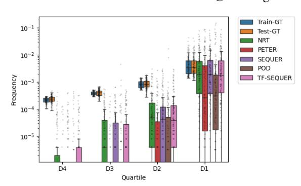
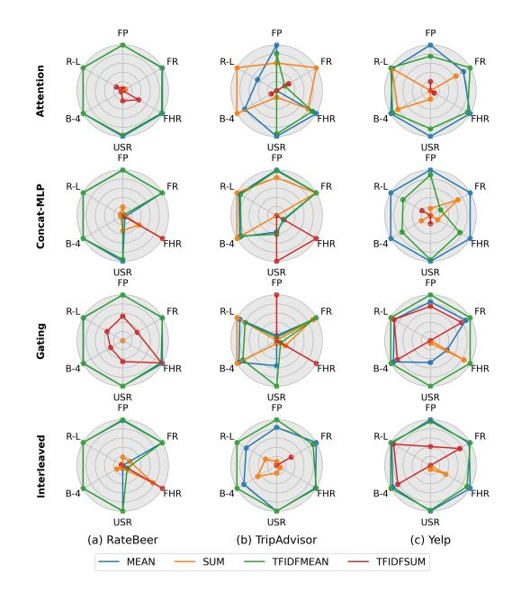

# Auditing Textual Context in Sequence-Aware Explainable Recommendation

[Alejandro Ariza-Casabona](https://orcid.org/0000-0002-3388-2316) University of Barcelona, CLiC-UBICS Barcelona, Spain alejandro.ariza14@ub.edu

[Maria Salamó](https://orcid.org/0000-0003-1939-8963) University of Barcelona, CLiC-UBICS Barcelona, Spain maria.salamo@ub.edu

[Ludovico Boratto](https://orcid.org/0000-0002-6053-3015) University of Cagliari Cagliari, Italy ludovico.boratto@acm.org

# Abstract

Self-explaining recommenders enhance user trust by providing justifications for their suggestions. Sequence-aware models have advanced the field by leveraging user interaction history to personalize recommendations and explanations. However, generative models often struggle with sparse data, producing repetitive or irrelevant explanations. This paper explores the optimal methods for infusing rich textual information from past user interactions directly into the item embeddings to feed a user reasoning path leading to personalized explanations. We conduct a comprehensive analysis of various techniques, including: (1) multiple text aggregation strategies to pool fine-grained attributed item opinions into user-aggregated item text representations; (2) several fusion mechanisms to combine text and collaborative modalities, from early fusion to a late fusion approach within the Transformer architecture; and (3) different training regimes for explanation generation. Experiments on three real-world datasets demonstrate which steps to follow in order to successfully leverage textual information into a sequence-aware explainable recommendation model and boost recommendation performance as well as explanation quality.

# CCS Concepts

• Information systems → Recommender systems; • Computing methodologies → Natural language generation; Information extraction.

#### Keywords

Explainable Recommendation; Natural Language Explanations; Sequential Recommendation

#### ACM Reference Format:

Alejandro Ariza-Casabona, Maria Salamó, and Ludovico Boratto. 2026. Auditing Textual Context in Sequence-Aware Explainable Recommendation. In Proceedings of the ACM Web Conference 2026 (WWW '26), April 13–17, 2026, Dubai, United Arab Emirates. ACM, New York, NY, USA, [4](#page-3-0) pages. <https://doi.org/10.1145/3774904.3792920>

# 1 Introduction

Recommender systems help users navigate large item catalogs by leveraging black-boxes, which undermines trust and adoption. Explainable models address this issue by generating textual rationales,

[This work is licensed under a Creative Commons Attribution 4.0 International License.](https://creativecommons.org/licenses/by/4.0)

WWW '26, Dubai, United Arab Emirates © 2026 Copyright held by the owner/author(s). ACM ISBN 979-8-4007-2307-0/2026/04 <https://doi.org/10.1145/3774904.3792920>

Figure 1: Item Aspect Frequency Distribution by Quartile in Training/Test/Predicted Explanation Sentences. D1 (Quartile with the most frequent item aspects) is well represented within most of the predicted explanations, as opposed to D4 (quartile composed of the less frequent aspects).

typically derived from user reviews, to clarify why an item is suggested. Rationales typically take the form of aspect-based sentences, such as 'The IPA has a distinct citrusy aroma' or 'The crust is thin and crispy', grounding the recommendation in specific attributes.

Sequence-aware models condition explanation generation on a user's interaction history, enabling personalized and contextsensitive reasons. However, sparsity often leads these generative models to fall back on generic, high-frequency phrases that do not capture user preferences or fine-grained item characteristics (e.g. 'it is a good product'). Rich semantic information is actually present in reviews, but current models like PETER [\[4\]](#page-3-1) and SEQUER [\[3\]](#page-3-2) mostly treat text as a target to be generated instead of as a core signal that shapes item representations and their evolution over time.

This work investigates how to effectively infuse review text into a state-of-the-art sequence-aware explainable recommender system, to handle sparsity better and improve explanation quality. Inspired by the Information Theory–based Compositional Distributional Semantics framework [\[1\]](#page-3-3), we study how different textual units and aggregation operators affect the information content of item embeddings, and how these embeddings should be fused with collaborative representations inside a Transformer architecture. Our contributions are: (i) a systematic study of text representation and aggregation strategies for explanation-based item embeddings, (ii) an evaluation of several early and late fusion mechanisms, including a novel interleaving strategy, and (iii) extensive experiments on three real-world datasets showing that our text-infusion methods significantly boost both recommendation accuracy and explanation quality over a strong SEQUER baseline.

#### 2 Related Work

Generative Self-Explainable Recommenders. Early neural models such as NRT jointly learn rating prediction and abstractive tip generation, but often produce generic explanations under sparse conditions [\[6\]](#page-3-4). PETER replaces RNNs with a Transformer Decoder and applies multi-task objectives, conditioning explanations on user and item embeddings to improve BLEU/ROUGE scores, yet still suffers from repetitive, shallow text when data is limited [\[4\]](#page-3-1). SEQUER further incorporates user interaction sequences and a next-item prediction task, yielding more diverse and personalized explanations while outperforming PETER and even T5-based POD on several benchmarks [\[2,](#page-3-5) [3,](#page-3-2) [5\]](#page-3-6). However, these models rely primarily on collaborative item embeddings, which leads to hallucinated or missing attributes in low-data scenarios; extraction-based approaches remain more robust but lack generative flexibility. Our work targets this gap by grounding generation in text-derived item representations rather than collaborative signals alone.

Compositional Distributional Semantics and Sentence Encoders. Compositional distributional semantics studies how to combine word or sentence embeddings into representations of longer texts while preserving semantic properties such as additivity and information content [\[1\]](#page-3-3). These insights motivate simple but effective aggregation functions (e.g., weighted sums) for constructing itemlevel vectors from review sentences. Modern Transformer-based sentence encoders provide compact, semantically rich embeddings and have shown strong performance on semantic similarity tasks, making them well suited for encoding opinionated review snippets. In this work, we use such encoders and compare several aggregation schemes to compose explanation sentences into text-based item representations that can be fused with collaborative embeddings.

#### 3 Methodology

## 3.1 Item–Level Text Initialization

Evidence sources. Let �� ∈ I be an item reviewed by a set of users U�� . Each review �� ∈ R�� is split into sentences �� ∈ S�� and filtered such that each sentence contains at least a pre-extracted item attribute. Item attributes are obtained by using an unsupervised sentiment-analysis tool [\[9\]](#page-3-7) that extracts aspect-opinion-sentiment triplets and is often used in the text-based explainable recommendation literature to preprocess the reviews and determine valid sentence explanations as the ground truth text. Our item-level text initialization approach then starts by encoding each text in the corpus with a pre–trained sentence encoder ��(·) : text → R �� . The result of this encoding process is a multiset of text evidence vectors T�� = {t1, . . . , t���� } with t �� = ��(��).

Text Composition Operator. Each item receives multiple reviews from different users, and each review can contain an arbitrary number of sentences. Therefore, an aggregation operator �� (·) is required to obtain a single ��–dimensional vector i �� ∈ R �� per item. Depending on the selected evidence source granularity, we require to perform a pre-aggregation (sentence-level) that gives us the interaction-level text representation. Then, in a hierarchical fashion, the aggregated item text representation can be calculated. The aggregation operator that we consider for both stages is instantiated

Figure 2: Radar plots comparing aggregation operators under each fusion strategy (rows) across three recommendation datasets (columns). Each subplot reports min-max normalized performance on six representative evaluation metrics.

by either one of four alternatives: Mean, Sum, TF-IDF weighted Mean, and TF-IDF weighted Sum.

TF–IDF weights are pre–computed over the training corpus[1](#page-1-0) . The two–step scheme adopted for the sentence-level evidence source prevents reviews with many sentences from dominating the item vector in the mean alternatives, and markedly differs from a naïve average over all sentences of all reviews. Note that TF-IDF variants will be applied to the first aggregation step in this two-step scheme and the second step will rely on the respective mean or sum aggregation. The resulting matrix I ∈ R | I |×�� is used to initialise the pretrained item text embedding layer. In order to map the text embeddings to a shared representation space, a linear projection ��(·) : R �� → R ���� adapts the ��-dimensional text embeddings to the model dimension ����.

#### 3.2 Cross-Modal Fusion of Text and Collaborative Signals

Let i ���� ∈ R ���� be the collaborative item embedding learned by SEQUER and i ∈ R ���� its text-based counterpart. For a user sequence ⟨��1, . . . ,����⟩, let i ���� 1:�� and i 1:�� be the stacked item embeddings and u the user vector. We consider three early-fusion schemes that output a single item embedding f�� per timestep, and one late-fusion variant.

#### Gating.

g�� = �� W�� [u∥i ���� ∥i ] , f�� = g�� ⊙ i ���� �� + (1 − g�� ) ⊙ i .

1The test corpus contains only items that appear in the training corpus

#### Concatenation + MLP.

f�� = MLP [i ���� ∥i , MLP(��) = ��2 ��(��1��).

Cross-attention.

f�� = W�� softmax q�� K ⊤ √ �� ���� V�� ,

with K�� = [W�� i ���� ; W�� i ] and V�� defined analogously.

In all early-fusion cases, SEQUER receives the sequence f1:�� followed by u and explanation tokens [������, ��1:��]. As previously mentioned, we also propose a late-fusion alternative, that interleaves modalities at the Transformer's input:

#### Interleaved.

[i ���� 1 , i 1 , . . . , i ���� , i , u, BOS, e1:��],

Therefore, under causal masking, collaborative tokens can attend to past text and collaborative tokens while keeping modality-specific representations disentangled. In addition, despite quadratically increasing the complexity of the model, this input sequence construction allows to decouple forecasting and predictive modeling capabilities into different tokens per item, resulting in cleaner taskspecific training signals.

# 4 Experiments

To rigorously evaluate our approach, we designed a comprehensive experimental framework grounded in established benchmarks and metrics[2](#page-2-0) . Our setup is organized as follows:

Datasets: Our evaluation is conducted on three widely-used datasets from the review-based recommendation literature: TripAdvisor [\[8\]](#page-3-8), Yelp[3](#page-2-1) , and RateBeer [\[7\]](#page-3-9). To ensure a fair and reproducible comparison, we use the same preprocessed versions and data splits as a recent, extensive study on text-based explainability [\[2\]](#page-3-5).

Baseline Models: We compare our proposed model, TF-SEQUER, against a strong set of state-of-the-art generative explanation models. This includes foundational methods like NRT and PETER, as well as the sequence-aware SEQUER model, which forms the backbone of our approach. We also include the more recent POD model, which utilizes a pre-trained T5 language model as backbone. However, as we will show, its reliance on general LLM knowledge, even with soft prompt tuning, struggles to achieve the deep user-item personalization necessary for generating high-quality, specific explanations. This observation reinforces our choice to build upon the specialized SEQUER architecture for our audit of textual context.

Evaluation Metrics: To provide a holistic assessment, we evaluate the generated explanations across two dimensions. For explanation quality, we measure the Feature Coverage Ratio (FCR), Feature Precision/Recall (FP/FR), Feature Diversity (DIV), and Feature Hallucination Ratio (FHR). For textual quality, we use the standard BLEU (B-4) and ROUGE (R-1, R-2, R-L) metrics as well as Unique Sentence Ratio (USR) and Word-IDF (������ �� ). Our evaluation protocol and metric implementations are consistent with recent benchmarking studies to ensure comparability [\[2\]](#page-3-5). We report average scores of 4 independent runs.

Discussion: Our analysis considers five aspects to uncover the role of textual context in sequence-aware explainable recommendation. Figure [1](#page-0-0) presents how affected models are under item aspect sparsity conditions in the explanation sentences. Additionally, Figure [2](#page-1-1) allows us to clearly determine the most effective fusion and aggregation methods for creating and integrating textual item representations. Last, Table [1](#page-3-10) contains the results of TF-SEQUER (TF-IDF Mean, Interleaved) against generation-based baselines, thus positioning our cross-modal proposal in the current state-of-the-art within sequence-aware text-based explainable recommendation.

RQ1 - Impact of Item Aspect Sparsity: It is important to consider that many users tend to post generic review sentences and attribute explanations to global item aspects lacking personalized feedback e.g. food, service, location, etc. Therefore, specific item aspects that are underrepresented but could lead to better personalization are ignored by the explainer models. We hypothesized that text infusion would partially mitigate this issue, since relevant aspects from the user would be encoded into the input sequence. Figure [1](#page-0-0) provides compelling evidence to support this hypothesis, as TF-SEQUER is able to keep an item aspect frequency distribution more similar to the actual distribution than any of the baselines.

RQ2 - What is the most effective strategy for aggregating multiple review sentences into a single, coherent textual representation for an item? A clear pattern emerges across datasets and fusion methods in Figure [2:](#page-1-1) Mean and TF-IDF Mean strategies (green and blue lines) consistently yield the most balanced and superior performance. They achieve the largest area in the radar plots, indicating strong results across a range of metrics, especially FP, FCR, and USR. This suggests that normalizing text representations before feeding them to the Transformer is beneficial, despite losing the information measurability property [\[1\]](#page-3-3). Furthermore, weighting sentences by their TF-IDF scores before averaging seems advantageous when there is no early fusion to increase the model capacity.

RQ3 - What is the optimal fusion mechanism to integrate sequential collaborative and textual signals for explanation generation? In Figure 2, the interleaved fusion approach provides the most consistent performance over all three datasets when paired with either TF-IDF Mean or Mean aggregators. Following Interleaved, we find Gating and Attention also providing consistently good results. In particular, the Gating mechanism on the TripAdvisor and Yelp datasets produces a large, well-rounded polygon, signifying high performance across all key explanation metrics. This indicates that these methods are highly effective at dynamically blending the collaborative information from the user's sequence with the rich textual context of the item across different scenarios.

RQ4 - How does our proposed model, TF-SEQUER, perform against state-of-the-art generative explanation models in terms of explanation quality? Table [1](#page-3-10) demonstrates that TF-SEQUER consistently outperforms all baseline models across the three datasets in terms of both explainability and text quality metrics. Comparing TF-SEQUER against its backbone (SEQUER), we obtain substantial relative improvements on every metric with a single exception in terms of feature diversity at the TripAdvisor dataset. Another good indicator is the USR score paired with high FCR/FP/FR and FHR, suggesting good personalization with relevant item aspects and high feature

Source code is available at: https://github.com/alarca94/tf-sequer 3https://www.yelp.com/dataset

Table 1: Explanation generation results. For each dataset, bold numbers indicate leading results, while underlining highlights second-best scores. Statistical significance between the leading and second-best scores is indicated by \* for a ��-���������� &lt; 0.05.

| Methods               | DIV ↓  | FCR ↑   | FP ↑   | FR ↑   | FHR ↓  | USR ↑   | �� ���� �� ↑ | B-4 ↑   | R-1 ↑   | R-2 ↑   | R-L ↑  |
|-----------------------|--------|---------|--------|--------|--------|---------|--------------|---------|---------|---------|--------|
| NRT Ratebeer          | 0.399  | 0.582   | 0.377  | 0.108  | 0.013  | 0.379   | 3.214        | 7.888   | 39.407  | 11.955  | 33.116 |
| PETER                 | 0.560  | 0.364   | 0.360  | 0.103  | 0.008  | 0.101   | 3.109        | 6.916   | 38.747  | 11.282  | 32.414 |
| SEQUER                | 0.397  | 0.616   | 0.402  | 0.118  | 0.011  | 0.393   | 3.240        | 9.195   | 40.800  | 13.272  | 34.363 |
| POD                   | 1.284  | 0.454   | 0.333  | 0.109  | 0.042  | 0.118   | 3.629*       | 10.802* | 38.376  | 14.757* | 34.336 |
| TF-SEQUER             | 0.391  | 0.617   | 0.410* | 0.119  | 0.010  | 0.396   | 3.246        | 9.382   | 40.939  | 13.450  | 34.511 |
| Improv. vs SEQUER     | 1.62%  | 0.14%   | 1.99%  | 0.50%  | 10.22% | 0.81%   | 0.18%        | 2.04%   | 0.34%   | 1.34%   | 0.43%  |
| TF-SEQUER-AltMultiple | 0.440  | 0.626   | 0.419* | 0.129* | 0.010  | 0.460*  | 3.259        | 9.885   | 41.331* | 13.922  | 34.024 |
| NRT Tripadvisor       | 0.826  | 0.229   | 0.321  | 0.098  | 0.046  | 0.062   | 2.616        | 6.078   | 37.101  | 8.795   | 28.745 |
| PETER                 | 0.828  | 0.213   | 0.326  | 0.103  | 0.051  | 0.049   | 2.598        | 6.246   | 37.656  | 9.232   | 29.009 |
| SEQUER                | 0.769  | 0.239   | 0.313  | 0.097  | 0.060  | 0.068   | 2.621        | 6.125   | 37.276  | 8.867   | 28.982 |
| POD                   | 1.589  | 0.046   | 0.314  | 0.079  | 0.101  | 0.001   | 3.041*       | 4.793   | 31.851  | 6.348   | 24.505 |
| TF-SEQUER             | 0.778  | 0.266*  | 0.326  | 0.101  | 0.048  | 0.082*  | 2.625        | 6.333   | 37.545  | 9.112   | 29.099 |
| Improv. vs SEQUER     | -1.16% | 11.46%  | 4.18%  | 3.68%  | 20.93% | 20.57%  | 0.15%        | 3.39%   | 0.72%   | 2.76%   | 0.40%  |
| TF-SEQUER-AltMultiple | 0.968  | 0.277   | 0.321  | 0.114* | 0.049  | 0.239*  | 2.640        | 4.676   | 37.599  | 9.424*  | 25.928 |
| NRT                   | 1.158  | 0.101   | 0.294  | 0.159  | 0.113  | 0.054   | 2.542        | 3.774   | 33.214  | 6.497   | 26.179 |
| PETER Yelp            | 1.192  | 0.163   | 0.311  | 0.176  | 0.088  | 0.039   | 2.522        | 4.195   | 34.015  | 6.929   | 26.628 |
| SEQUER                | 1.289  | 0.132   | 0.292  | 0.163  | 0.120  | 0.033   | 2.488        | 3.942   | 33.772  | 6.576   | 26.730 |
| POD                   | 0.921  | 0.006   | 0.246  | 0.095  | 0.109  | 0.000   | 3.312        | 2.117   | 24.254  | 3.951   | 18.500 |
| TF-SEQUER             | 0.974  | 0.265*  | 0.321  | 0.176  | 0.080  | 0.086*  | 2.579        | 4.202   | 34.152  | 6.965   | 26.818 |
| Improv. vs SEQUER     | 24.45% | 100.76% | 9.78%  | 7.99%  | 32.97% | 164.73% | 3.67%        | 6.58%   | 1.13%   | 5.93%   | 0.33%  |
| TF-SEQUER-MULTIPLE    | 0.983  | 0.251   | 0.335* | 0.181  | 0.064* | 0.081   | 2.574        | 4.289   | 34.265  | 7.153*  | 26.911 |

coverage, while mitigating feature hallucinations on the generated explanations. The improvements are even more pronounced on the most sparse dataset (Yelp), where TF-SEQUER achieves a remarkable +100.76% in FCR and +164.73% in USR over SEQUER. The infusion of rich textual context via our proposed aggregation and fusion strategy provides a substantial boost in performance.

RQ5 - How optimal is the current training regime of text-based explainable recommenders? The current approach consists in fixing a single explanation sentence per interaction as the groundtruth, thus limiting the generalization capabilities of the model and forcing generations to be incomplete explanations. Table [1](#page-3-10) shows an alternative approach in which the model is shown varying-length permutations of explanation sentences per interaction during training, thus boosting model performance on almost every metric.

# 5 Conclusions and Open Issues

In this paper, we audited textual context in sequence-aware textbased explainable recommendation. Our proposal, TF-SEQUER, by combining simple normalized (TF-IDF) text aggregation with an interleaved fusion strategy, generates explanations that are demonstrably more relevant, diverse, and faithful than those produced by previous state-of-the-art models, validating the effectiveness of our approach. Its performance is further boosted by switching to our proposed training regime.

Future work could explore closer alignment between collaborative and textual spaces, e.g., via joint/contrastive training, or the adaptation of semantic IDs to account for user textual opinions.

# Acknowledgments

The work of Alejandro Ariza-Casabona and Maria Salamó was supported by the ANNOTATE-SenSIT (PID2024-156022OB-C33) Project funded by MICIU/AEI/10.13039/501100011033 and the European Social Fund Plus (ESF+).

#### References

[1] Enrique Amigó, Alejandro Ariza-Casabona, Víctor Fresno-Fernández, and M. Antònia Martí. 2022. Information Theory-based Compositional Distributional Semantics. Comput. Linguistics 48, 4 (2022), 907–948. [doi:10.1162/COLI\\_A\\_00454](https://doi.org/10.1162/COLI_A_00454) [2] Alejandro Ariza-Casabona, Ludovico Boratto, and Maria Salamó. 2024. A Comparative Analysis of Text-Based Explainable Recommender Systems. In Proceedings of the 18th ACM Conference on Recommender Systems, RecSys 2024, Bari, Italy, October 14-18, 2024. ACM, 105–115. [doi:10.1145/3640457.3688069](https://doi.org/10.1145/3640457.3688069) [3] Alejandro Ariza-Casabona, Maria Salamó, Ludovico Boratto, and Gianni Fenu. 2023. Towards Self-Explaining Sequence-Aware Recommendation. In Proceedings of the 17th ACM Conference on Recommender Systems, RecSys 2023, Singapore, Singapore, September 18-22, 2023. ACM, 904–911. [doi:10.1145/3604915.3608847](https://doi.org/10.1145/3604915.3608847) [4] Lei Li, Yongfeng Zhang, and Li Chen. 2021. Personalized Transformer for Explainable Recommendation. In Proceedings of the 59th Annual Meeting of the Association for Computational Linguistics and the 11th International Joint Conference on Natural Language Processing, ACL/IJCNLP 2021, (Volume 1: Long Papers), Virtual Event, August 1-6, 2021. Association for Computational Linguistics, 4947–4957. [doi:10.18653/v1/2021.acl-long.383](https://doi.org/10.18653/v1/2021.acl-long.383) [5] Lei Li, Yongfeng Zhang, and Li Chen. 2023. Prompt Distillation for Efficient LLMbased Recommendation. In Proceedings of the 32nd ACM International Conference on Information and Knowledge Management, CIKM 2023, Birmingham, United Kingdom, October 21-25, 2023. ACM, 1348–1357. [doi:10.1145/3583780.3615017](https://doi.org/10.1145/3583780.3615017) [6] Piji Li, Zihao Wang, Zhaochun Ren, Lidong Bing, and Wai Lam. 2017. Neural Rating Regression with Abstractive Tips Generation for Recommendation. In Proceedings of the 40th International ACM SIGIR Conference on Research and Development in Information Retrieval, Shinjuku, Tokyo, Japan, August 7-11, 2017. ACM, 345–354. [doi:10.1145/3077136.3080822](https://doi.org/10.1145/3077136.3080822) [7] Julian J. McAuley, Jure Leskovec, and Dan Jurafsky. 2012. Learning Attitudes and Attributes from Multi-aspect Reviews. In 12th IEEE International Conference on Data Mining, ICDM 2012, Brussels, Belgium, December 10-13, 2012. IEEE Computer Society, 1020–1025. [doi:10.1109/ICDM.2012.110](https://doi.org/10.1109/ICDM.2012.110) [8] Hongning Wang, Yue Lu, and Chengxiang Zhai. 2010. Latent aspect rating analysis on review text data: a rating regression approach. In Proceedings of the 16th ACM SIGKDD International Conference on Knowledge Discovery and Data Mining, Washington, DC, USA, July 25-28, 2010. ACM, 783–792. [doi:10.1145/1835804.1835903](https://doi.org/10.1145/1835804.1835903) [9] Yongfeng Zhang, Haochen Zhang, Min Zhang, Yiqun Liu, and Shaoping Ma. 2014. Do users rate or review?: boost phrase-level sentiment labeling with reviewlevel sentiment classification. In The 37th International ACM SIGIR Conference on Research and Development in Information Retrieval, SIGIR '14, Gold Coast , QLD, Australia - July 06 - 11, 2014. ACM, 1027–1030. [doi:10.1145/2600428.2609501](https://doi.org/10.1145/2600428.2609501)