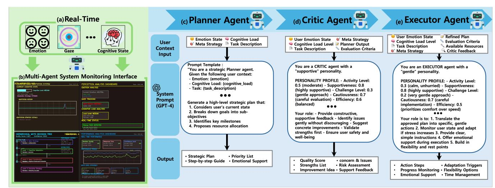

# MACA: A Multi-Agent Cognitive Adaptation Framework for Human–Agent Collaborative Decision Making

Youn Jun Seong Sungkyunkwan University Department of Artificial Intelligence Convergence Seoul, Republic of Korea tjdduswns@skku.edu

Ha Young Oh∗

Sungkyunkwan University Department of Artificial Intelligence Convergence Seoul, Republic of Korea hyoh79@skku.edu

Figure 1: Overview of the Multi-Adaptive framework. (a) The user-state module integrates facial expression and gaze cues to infer users' emotional and attentional states in real time. (b) The multi-agent monitoring interface visualizes cognitive load and the MCTS decision flow, adjusting feedback intensity and search depth accordingly. (c) The Planner generates strategies, (d) the Critic evaluates them, and (e) the Executor translates them into concrete actions.

# Abstract

Modern web interfaces increasingly support complex decision workflows—such as travel planning and multi-criteria selection—yet remain largely static and insensitive to users' moment-to-moment cognitive states during interaction. Travel planning, in particular, requires users to synthesize dispersed information under multiple constraints, making it a representative high-load interactive decision task. This study presents MACA (Multi-Agent Cognitive Adaptation), a framework that enables real-time cognitive adaptation in web-based decision environments by integrating hierarchical Monte Carlo Tree Search (MCTS) with a Planner–Critic– Executor multi-agent architecture. MACA continuously estimates users' emotional and attentional states using facial expression analysis (ResEmoteNet) and gaze stability tracking (MediaPipe), and uses these signals to regulate agent collaboration, reasoning depth, and feedback pacing during interaction. We evaluated MACA in

∗Corresponding author

© 2026 Copyright held by the owner/author(s). ACM ISBN 979-8-4007-2307-0/2026/04 <https://doi.org/10.1145/3774904.3792921>

a 2×2 within-subject study (�� = 30) comparing Single vs. Multiagent and Fixed vs. Adaptive configurations. Results show that the Multi-Adaptive condition significantly improved Decision Quality (�� (3, 116) = 2.96, �� = 0.035) while reducing Mental Effort (�� (3, 116) = 2.82, �� = 0.042), yielding a 10.7% gain in decision efficiency without increasing cognitive burden. These findings demonstrate that multimodal user-state sensing combined with cooperative multi-agent reasoning can enhance interactive web-based decision making while maintaining user well-being.

# CCS Concepts

- Computing methodologies→Multi-agent systems;• Humancentered computing → Human computer interaction (HCI).

# Keywords

Multi-Agent Systems; Cognitive Adaptation; Real-Time User State Sensing; Human–Agent Interaction

#### ACM Reference Format:

Youn Jun Seong and Ha Young Oh. 2026. MACA: A Multi-Agent Cognitive Adaptation Framework for Human–Agent Collaborative Decision Making. In Proceedings of the ACM Web Conference 2026 (WWW '26), April 13–17, 2026, Dubai, United Arab Emirates. ACM, New York, NY, USA, [4](#page-3-0) pages. <https://doi.org/10.1145/3774904.3792921>

[This work is licensed under a Creative Commons Attribution 4.0 International License.](https://creativecommons.org/licenses/by/4.0) WWW '26, Dubai, United Arab Emirates

# 1 Introduction & Related Work

Modern web interfaces increasingly require users to compare alternatives, integrate multiple constraints, and make complex, multicriteria decisions. However, most systems remain largely static and insensitive to users' moment-to-moment cognitive fluctuations [\[3\]](#page-3-1). As emotional and attentional states shift during demanding tasks, this mismatch between system behavior and user cognition often increases mental effort and leads to suboptimal outcomes [\[9\]](#page-3-2). This gap is particularly salient in interactive web-based decisionsupport scenarios, where users remain engaged with the interface and must continuously interpret intermediate recommendations and trade-offs. Recent advances in multimodal sensing, including real-time emotion recognition [\[4\]](#page-3-3) and gaze-based attention estimation [\[1\]](#page-3-4), have enabled fine-grained inference of user states, yet such signals are often applied in isolation and rarely integrated into structured decision-making processes. In parallel, multi-agent reasoning frameworks—such as the Planner–Critic–Executor paradigm and cooperative Monte Carlo Tree Search (MCTS) [\[10\]](#page-3-5)—have shown promise for managing complex reasoning, but remain largely detached from user-state sensing. As a result, existing adaptive interfaces lack mechanisms to regulate reasoning depth, agent collaboration, or feedback pacing in response to users' real-time cognitive states [\[2\]](#page-3-6). To address this gap, we introduce MACA (Multi-Agent Cognitive Adaptation), a framework that integrates multimodal user-state sensing—facial emotion recognition (ResEmoteNet) and gaze stability estimation (MediaPipe)—with hierarchical MCTS and a distributed Planner–Critic–Executor architecture. Rather than modifying task knowledge or semantic correctness, MACA uses real-time cognitive signals to regulate the reasoning process itself by dynamically adjusting exploration depth, agent roles, and feedback pacing. We evaluate MACA through a 2×2 within-subject study using a complex travel-planning task. Results show that the Multi-Adaptive condition improves decision quality while reducing mental effort, demonstrating a dual benefit in decision efficiency without increasing cognitive burden. Unlike unattended or resultonly agent workflows, MACA targets interactive decision-support scenarios in which users continuously interpret intermediate recommendations and revise constraints. In such settings, momentto-moment cognitive overload directly alters decision trajectories, making real-time user-state sensing essential for timely intervention during the decision process.

This work contributes: (1) a cognitively adaptive multi-agent framework for interactive web-based decision making; (2) a multimodal user-state model integrating facial emotion and gaze signals to regulate reasoning processes; (3) empirical evidence that adaptive multi-agent reasoning improves decision efficiency while maintaining cognitive well-being.

# 2 Method

We developed a web-based adaptive decision-support system that integrates multimodal user-state sensing with a structured multiagent reasoning workflow. The system dynamically adjusts agent collaboration, reasoning depth, and feedback pacing based on users' real-time emotional and attentional states (Figure 1).

#### 2.1 System Architecture

MACA adopts a multi-agent architecture composed of three cooperative agents—Planner, Critic, and Executor. All agents share the same large language model (LLM) backbone but operate with distinct roles and structured prompt designs. In this study, GPT-4omini was used consistently across all agents to isolate the effects of multi-agent collaboration and cognitive adaptation, rather than differences between language models. The Planner generates highlevel decision strategies based on user goals, task constraints, and estimated cognitive load. The Critic evaluates candidate strategies in terms of feasibility, potential risks, and alignment with the user's cognitive state, while the Executor translates the selected strategy into step-by-step actionable guidance, dynamically adjusting feedback pacing and support levels during interaction. All agents communicate through a shared context buffer that stores intermediate reasoning traces and outputs. This shared memory mechanism maintains role consistency across agents and supports interpretability of the overall decision-making process.

# 2.2 Multimodal User-State Sensing

Webcam input is processed through two parallel modules:

Facial Emotion Recognition. We employ ResEmoteNet [\[6\]](#page-3-7) to estimate a probability distribution across seven basic emotions. We used the pretrained ResEmoteNet model without further fine-tuning, relying on its original training on the FER2013 dataset. The model runs continuously in the browser and outputs an emotional stability score reflecting temporal consistency of inferred affect.

Gaze Stability and Attention. MediaPipe Face Mesh [\[8\]](#page-3-8) extracts iris coordinates and computes a fixation-stability coefficient using eigenvalue-based variance estimation:

Stability = 1 1 + �� √ ��1��2 .

Rapid variance increases signal attention lapses, detected using a median–MAD adaptive threshold. The two signals are normalized and fused into a continuous cognitive-load index. Higher load values correspond to unstable gaze, inconsistent affect, or large short-term fluctuations.

# 2.3 Adaptive Multi-Agent Reasoning

To manage decision complexity, MACA employs a four-level hierarchical Monte Carlo Tree Search (MCTS) framework [\[5,](#page-3-9) [7\]](#page-3-10) that progressively refines reasoning from meta-strategy selection and cognitive adaptation control to agent-role configuration and execution planning. At each expansion step, candidate branches are evaluated by the Critic agent using a multimodal reward function:

�� ∗ = ��1�������� + ��2���� �� �� + ��3�������� + ��4������ �� �� .

The reward integrates emotional stability (�������� ), attention and efficiency (���� �� �� ), reasoning consistency (�������� ), and safety constraints (������ �� �� ), guiding whether the system deepens exploration, revises strategies, or simplifies execution. The estimated cognitive load directly modulates the MCTS configuration, favoring shallower search and supportive feedback under high load, and deeper exploration with faster iteration under low load.

Table 1: Descriptive statistics and ANOVA summary across conditions (N=30). Values represent Mean ± SD.

| Condition        | Decision   | Quality | (M ±  | SD) Confidence |       | (M ± SD) | Fixation | Stability | (M ±  | SD) Mental | Effort | (M ± SD) |
|------------------|------------|---------|-------|----------------|-------|----------|----------|-----------|-------|------------|--------|----------|
| Single-Fixed     | 0.670      | ±       | 0.104 | 0.727          | ±     | 0.087    | 0.814    | ±         | 0.085 | 47.14      | ±      | 9.47     |
| Single-Adaptive  | 0.693      | ±       | 0.126 | 0.736          | ±     | 0.115    | 0.832    | ±         | 0.075 | 44.22      | ±      | 11.52    |
| Multi-Fixed      | 0.674      | ±       | 0.076 | 0.736          | ±     | 0.079    | 0.819    | ±         | 0.078 | 46.62      | ±      | 9.56     |
| Multi-Adaptive   | 0.742      | ±       | 0.108 | 0.763          | ±     | 0.082    | 0.855    | ±         | 0.091 | 40.48      | ±      | 8.82     |
| ANOVA (F(3,116), | �� ) 2.96, | 0.035*  |       | 0.89,          | 0.450 |          | 1.53,    | 0.212     |       | 2.82,      | 0.042* |          |

#### 2.4 Interaction Flow

Each decision cycle follows a structured Sense–Plan–Critique– Execute loop. First, the system acquires webcam input and updates the cognitive-load index based on the user's current emotional and attentional state. Next, the Planner generates a high-level strategic outline conditioned on the estimated cognitive state and task constraints. The Critic then evaluates candidate strategies and selects the most appropriate one. Finally, the Executor translates the selected strategy into actionable, step-by-step recommendations while dynamically adjusting feedback intensity to match the user's cognitive capacity. This loop iterates until the system converges on an optimal itinerary solution or the task time limit is reached.

### 3 Experiment Design

We conducted a within-subject study with 30 participants to examine how cognitive adaptivity and agent collaboration influence decision efficiency and quality. The experiment was implemented as a web-based interface that continuously captured facial expressions and gaze trajectories via webcam. All procedures were approved by the institutional review board, and participants provided informed online consent prior to participation. Each participant completed four counterbalanced conditions: Single-Fixed, Single-Adaptive, Multi-Fixed, and Multi-Adaptive. These conditions form a 2×2 within-subject design manipulating the number of agents involved in decision support (Single vs. Multi) and whether agent behavior was cognitively adaptive (Fixed vs. Adaptive). In the Single conditions, a single agent provided decision support with either fixed or adaptive reasoning behavior. In the Multi conditions, multiple cooperative agents (Planner, Critic, and Executor) jointly supported decision making. Fixed conditions used a constant reasoning depth and feedback strategy, whereas Adaptive conditions dynamically adjusted reasoning depth, collaboration patterns, and feedback pacing based on estimated user cognitive load. Each session lasted approximately 30 minutes. After task instructions and consent, participants completed a gaze calibration procedure, followed by a brief visual baseline task to capture individual attention characteristics. Participants then performed a constrained travelplanning task requiring them to construct an optimal itinerary under budget, distance, and preference constraints. During this phase, the Multi-Adaptive system processed user-state signals and executed a four-level MCTS in real time.

# 3.1 Measures

Decision Quality. Decision quality was operationalized as a continuous score (0–1) reflecting the optimality of participants' itinerary decisions under the given constraints. The score aggregates four

components: (1) meta-strategy alignment with cognitive load (weight = 0.2), (2) appropriateness of adaptive adjustments (0.15), (3) coherence among agent roles (0.1), and (4) overall reasoning consistency (0.1). Scores were clipped to the [0,1] range to ensure comparability across conditions.These components reflect task-level constraints (e.g., budget, distance, and preference satisfaction), ensuring objective performance measurement.

Mental Effort. Mental effort was estimated from normalized pupil dilation, where lower values indicate lower cognitive load. A 30 second resting baseline was collected from pupil measurements. We computed a pupil-size ratio and normalized it to a 0–1 scale using:

ME = min(1, max(0, (ratio − 0.8)/0.6)). (1)

Confidence and Fixation Stability. Decision confidence (0–1) was sampled at the moment of action finalization. Fixation stability was computed using the eigenvalue-based metric defined in Eq. 3 (range 0–1), providing a complementary indicator of sustained attention and alignment between system guidance and user behavior.

Statistical Approach. We pre-registered the primary comparison as Multi-Adaptive versus Single-Fixed (�� = 0.05). All other contrasts were treated as exploratory. Normality was assessed using the Shapiro–Wilk test. Main effects were analyzed using one-way repeated-measures ANOVA with Greenhouse–Geisser correction (df = 3, 116). Exploratory pairwise comparisons were conducted via paired ��-tests (uncorrected), and effect sizes were reported using Hedges' �� with small-sample correction. We additionally computed the Performance-to-Effort Ratio (��/��) as an aggregate measure of decision efficiency.

#### 3.2 Results

Main Effects. The repeated-measures ANOVA revealed significant main effects of condition on both Decision Quality (�� (3, 116) = 2.96, �� = 0.035) and Mental Effort (�� (3, 116) = 2.82, �� = 0.042). We found no significant differences for Confidence or Fixation Stability at the omnibus level.

Table 2: Relative improvements of Multi-Adaptive compared to other conditions.

Primary Comparison (Multi-Adaptive vs. Single-Fixed). The Multi-Adaptive condition achieved significantly higher decision quality (+10.7%, �� = 0.70, �� &lt; 0.05) while simultaneously reducing mental effort (14.1%, �� = 0.57, �� &lt; 0.05). Post-hoc pairwise comparisons confirmed this pattern across other condition pairs (Table [2\)](#page-2-0). Effect sizes (�� = 0.38–0.70) corresponded to smallto-medium magnitudes, indicating practical significance beyond statistical thresholds. Key Finding. The Multi-Adaptive framework demonstrated a dual benefit—improving decision efficiency (+10.7% quality) without increasing cognitive burden (14.1% effort)—which demonstrates efficient cognitive resource allocation through real-time agent adaptation and user-state sensing. These performance gains occurred without elevating subjective mental effort, suggesting that our adaptive framework promotes efficient cognitive resource allocation.

# 4 Discussion and Limitations

This study demonstrates that grounding a multi-agent collaborative structure in real-time user-state sensing can enhance performance in complex decision-making contexts. The observed improvements in Decision Quality alongside reduced Mental Effort under the Multi-Adaptive condition indicate that the Planner–Critic–Executor architecture manages the search space efficiently while delivering adaptive feedback without cognitively overloading users, suggesting targeted adaptation under high cognitive demand. Importantly, cognitive analysis in MACA does not modify task knowledge or the semantic correctness of agent outputs, but instead improves decision quality indirectly by regulating the reasoning process itself—specifically when to explore alternatives, when to simplify reasoning, and how much explanation or guidance to provide. By constraining exploration depth and feedback verbosity during periods of cognitive instability, MACA reduces premature commitments and heuristic-driven choices that commonly arise under overload, thereby supporting more consistent and deliberate decision strategies. Aligning reasoning depth, agent collaboration, and feedback pacing with users' moment-tomoment cognitive capacity enables higher-quality decisions under identical task constraints. The within-subject evaluation (�� = 30) yielded stable effects with small-to-medium effect sizes (Hedges' g = 0.38–0.70), supporting the practical relevance of the observed dual benefit: improved decision quality with reduced cognitive effort. These findings highlight an efficiency-oriented adaptation mechanism driven by real-time modulation of agent collaboration and MCTS exploration depth. Several limitations should be considered. Although sufficient for within-subject analysis, the sample size limits generalizability across populations. Moreover, MACA is explicitly designed for interactive decision-support scenarios in which users remain engaged with the interface; in unattended or batchstyle agent use, the reliability and utility of real-time cognitive signals may diminish. Future work should incorporate engagement detection to gate adaptation when users are not actively attending. Finally, while travel planning is a representative high-load web decision task, extending MACA to other domains such as collaborative learning or healthcare decision support would clarify its transferability. User-state estimation relied on facial expression and gaze cues; additional physiological signals may further strengthen cognitive-state modeling.

# 5 Conclusion

This study presented a multi-agent web system that adaptively responds to users' real-time cognitive and affective states, demonstrating improved decision quality and efficiency without increasing mental effort. A within-subject evaluation with 30 participants showed that the proposed Multi-Adaptive framework effectively regulates agent collaboration under cognitive load. By integrating multimodal user-state sensing based on facial expression and gaze stability, this work positions multi-agent adaptivity as a promising foundation for human-centered, cognitively responsive web interfaces in decision support and digital well-being.

## Acknowledgments

This research was supported by the Ministry of Science and ICT (MSIT), Republic of Korea, under the Global Scholars Invitation Program (Grant No. RS-2024-00459638), supervised by the Institute of Information & Communications Technology Planning & Evaluation (IITP), and by the Sports and Tourism R&D Program through the Korea Creative Content Agency (KOCCA), funded by the Ministry of Culture, Sports and Tourism, Republic of Korea, under the project "Development of Game-Based Digital Therapeutics Technology for Adolescent Mental Health (Psychological and Behavioral Control) Management" (Grant No. RS-2024-00344893). This work was also supported by an IITP grant funded by the Korea government (MSIT) under the AI Star Fellowship Support Program (Sungkyunkwan University) (Grant No. RS-2025-25442569).

# References

[1] Yihua Cheng, Haofei Wang, Yiwei Bao, and Feng Lu. 2024. Appearance-Based Gaze Estimation With Deep Learning: A Review and Benchmark . IEEE Transactions on Pattern Analysis & Machine Intelligence 46, 12 (Dec. 2024), 7509–7528. [doi:10.1109/TPAMI.2024.3393571](https://doi.org/10.1109/TPAMI.2024.3393571) [2] Harshita Chopra and Chirag Shah. 2025. Feedback-Aware Monte Carlo Tree Search for Efficient Information Seeking in Goal-Oriented Conversations. arXiv[:2501.15056](https://arxiv.org/abs/2501.15056) [cs.AI]<https://arxiv.org/abs/2501.15056> [3] Ali Darejeh, Nadine Marcusa, Gelareh Mohammadi, and John Sweller. 2024. A critical analysis of cognitive load measurement methods for evaluating the usability of different types of interfaces: guidelines and framework for Human-Computer Interaction. arXiv[:2402.11820](https://arxiv.org/abs/2402.11820) [cs.HC]<https://arxiv.org/abs/2402.11820> [4] Hailun Lian, Cheng Lu, Sunan Li, Yan Zhao, Chuangao Tang, and Yuan Zong. 2023. A Survey of Deep Learning-Based Multimodal Emotion Recognition: Speech, Text, and Face. Entropy 25, 10 (October 2023), 1440. [doi:10.3390/e25101440](https://doi.org/10.3390/e25101440) [5] Yue Pei. 2023. Hierarchical Monte Carlo Tree Search for Latent Skill Planning. In Proceedings of the 2023 2nd Asia Conference on Algorithms, Computing and Machine Learning (Shanghai, China) (CACML '23). Association for Computing Machinery, New York, NY, USA, 6–12. [doi:10.1145/3590003.3590005](https://doi.org/10.1145/3590003.3590005) [6] Arnab Kumar Roy, Hemant Kumar Kathania, Adhitiya Sharma, Abhishek Dey, and Md. Sarfaraj Alam Ansari. 2024. ResEmoteNet: Bridging Accuracy and Loss Reduction in Facial Emotion Recognition. arXiv[:2409.10545](https://arxiv.org/abs/2409.10545) [cs.CV] [https:](https://arxiv.org/abs/2409.10545) [//arxiv.org/abs/2409.10545](https://arxiv.org/abs/2409.10545) [7] Tianhao Shao, Ke Zhang, Kai Cheng, and Hongjun Zhang. 2025. A Decision-Making Framework Using MCTS as a Hierarchical Task Network and Deep Learning Connector. Science Progress 108, 4 (October–December 2025), 368504251386308. [doi:10.1177/00368504251386308](https://doi.org/10.1177/00368504251386308) [8] Benjamin Voloh, Marcus R. Watson, Seth König, and Thilo Womelsdorf. 2020. MAD saccade: statistically robust saccade threshold estimation via the median absolute deviation. Journal of Eye Movement Research 12, 8 (May 2020), 3. [doi:10.](https://doi.org/10.16910/jemr.12.8.3) [16910/jemr.12.8.3](https://doi.org/10.16910/jemr.12.8.3) [9] Qiuzhen Wang, Sa Yang, Manlu Liu, Zike Cao, and Qingguo Ma. 2014. An eyetracking study of website complexity from cognitive load perspective. Decision Support Systems 62 (2014), 1–10. [doi:10.1016/j.dss.2014.02.007](https://doi.org/10.1016/j.dss.2014.02.007) [10] Nicholas Zerbel and Logan Yliniemi. 2019. Multiagent Monte Carlo Tree Search. In Proceedings of the 18th International Conference on Autonomous Agents and MultiAgent Systems (Montreal QC, Canada) (AAMAS '19). International Foundation for Autonomous Agents and Multiagent Systems, Richland, SC, 2309–2311.