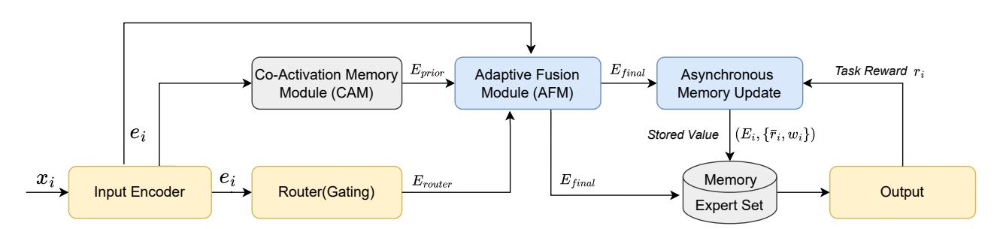
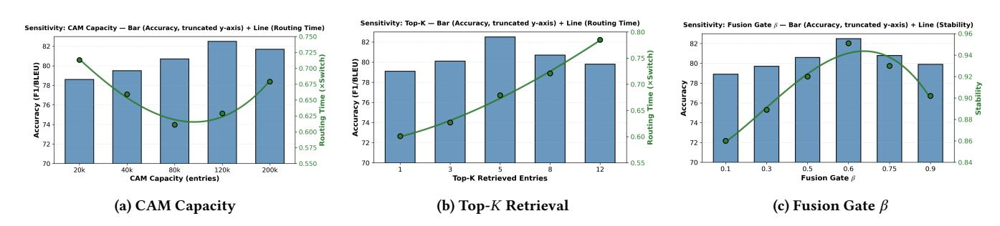

# Rethinking MoE with Retrieval-Memory Synergy: Towards Efficient Expert Coordination

Wanjie Tao Mashang Consumer Finance Co., Ltd Hangzhou, China wanjietao@gmail.com

Qun Dai Nanjing University of Aeronautics and Astronautics Nanjing, China daiqun@nuaa.edu.cn

Yantong Lv Mashang Consumer Finance Co., Ltd Hangzhou, China yantong.lv@msxf.com

Quan Lu Mashang Consumer Finance Co., Ltd Chongqing, China quan.lu@msxf.com

Ning Jiang Mashang Consumer Finance Co., Ltd Chongqing, China ning.jiang02@msxf.com

Zulong Chen Alibaba Group Hangzhou, China zulong.czl@alibaba-inc.com

#### Abstract

Mixture-of-Experts (MoE) models are central to scaling Large Language Models (LLMs), but stateless and compute-intensive routing repeatedly re-explores expert assignments for similar inputs, causing computational redundancy and unstable behavior in web-scale applications like search and dialogue. We reframe expert routing as a retrieval-augmented process and propose the Retrieval-Memory Synergy Mixture-of-Experts (RMS-MoE), which integrates a Co-Activation Memory (CAM) to store and retrieve effective expert teams and a learnable, input-dependent gate to fuse retrieved priors with live routing predictions, enabling consistent expert coordination for semantically related inputs. Extensive experiments on webscale QA and dialogue tasks show that RMS-MoE achieves a 26% latency reduction, a 2.7-point accuracy gain, and a 3.3% improvement in routing stability, demonstrating architectural memory as a principled path toward more efficient, stable, and scalable LLMs.

# CCS Concepts

- Computing methodologies → Natural language processing;
- Information systems → Information retrieval.

#### Keywords

Mixture-of-Experts (MoE), Large Language Models (LLMs), Retrieval-Memory Synergy, Adaptive Expert Coordination

#### ACM Reference Format:

Wanjie Tao, Qun Dai, Yantong Lv, Quan Lu, Ning Jiang, and Zulong Chen. 2026. Rethinking MoE with Retrieval-Memory Synergy: Towards Efficient Expert Coordination. In Proceedings of the ACM Web Conference 2026 (WWW '26), April 13–17, 2026, Dubai, United Arab Emirates. ACM, New York, NY, USA, [4](#page-3-0) pages.<https://doi.org/10.1145/3774904.3792922>

#### 1 Introduction

Mixture-of-Experts (MoE) architectures are a cornerstone for scaling Large Language Models (LLMs) to trillions of parameters with

[This work is licensed under a Creative Commons Attribution 4.0 International License.](https://creativecommons.org/licenses/by/4.0) WWW '26, Dubai, United Arab Emirates © 2026 Copyright held by the owner/author(s). ACM ISBN 979-8-4007-2307-0/2026/04 <https://doi.org/10.1145/3774904.3792922>

a constant computational budget [\[1,](#page-3-1) [3\]](#page-3-2). However, their promise is undermined by a fundamental limitation: the routing mechanism is typically stateless and short-sighted. Each input is processed in isolation, forcing the router to repeatedly re-explore expert assignments from scratch. This statelessness leads to computational redundancy and unstable predictions, a critical inefficiency for web-scale interactive systems with high semantic redundancy, such as search, QA, and dialogue services [\[13\]](#page-3-3). This conventional design fosters three persistent challenges: 1) computational redundancy, as the model wastes cycles re-discovering optimal expert configurations; 2) routing instability, where minor input perturbations trigger drastically different expert selections; and 3) overlooked expert synergy, as routers typically evaluate experts individually, failing to reuse effective collaborative 'teams'.

To overcome these limitations, we reframe expert routing not as a stateless classification problem, but as a dynamic retrieval and synthesis process. We introduce the Retrieval-Memory Synergy Mixture-of-Experts (RMS-MoE), a framework that endows MoE models with a long-term memory of their own routing decisions. At its heart is the Co-Activation Memory (CAM), a datastore that records historically successful expert 'teams' and the input patterns that activated them. When a new input arrives, RMS-MoE retrieves the most relevant expert team from CAM and adaptively fuses this historical prior with the live routing prediction. This allows the model to fall back on proven, efficient configurations for familiar inputs while retaining the flexibility to explore novel tasks.

Our work is situated within a broader context of research, yet carves out a distinct niche. Efforts to improve MoE routing have explored alternative assignment strategies, such as hashing [\[9\]](#page-3-4), soft assignments [\[4,](#page-3-5) [8\]](#page-3-6), or reversing the routing decision with expert choice [\[14\]](#page-3-7). While effective, these methods still largely operate within a stateless paradigm. Concurrently, the field of retrievalaugmented models has demonstrated the power of leveraging external knowledge. Methods like RAG [\[7\]](#page-3-8), kNN-LM [\[6\]](#page-3-9), and Memorizing Transformers [\[12\]](#page-3-10) retrieve context-token pairs or hidden states to directly improve next-token prediction. Similarly, Memory Networks [\[10,](#page-3-11) [11\]](#page-3-12) use external memory to reason over facts. Our approach is fundamentally different: we operate at the architectural level, retrieving the model's own internal configurations (expert co-activation patterns) to optimize the routing decision itself, rather than retrieving content to predict the final output. This makes our

Figure 1: The overall architecture of RMS-MoE.

architectural memory approach orthogonal and potentially complementary to content-based retrieval methods.

Experiments on web-scale QA and dialogue benchmarks demonstrate that RMS-MoE significantly outperforms a comprehensive suite of strong baselines, achieving a 26% reduction in end-to-end latency, a 2.7-point accuracy improvement, and a 3.3% relative improvement in routing stability. In summary, our contributions are:

- We propose a new paradigm for MoE routing that explicitly models and reuses expert team compositions through a retrieval-augmented process.
- We design and implement RMS-MoE, a framework featuring a Co-Activation Memory (CAM) and a dynamic fusion gate that improves efficiency and stability.
- We provide rigorous empirical validation on web-scale tasks, demonstrating significant improvements in accuracy, latency, and stability, paving the way for more cost-efficient and reliable LLM deployment.

#### 2 Methodology

To address the statelessness of conventional MoE routing, we propose the Retrieval-Memory Synergy MoE (RMS-MoE). Our framework integrates three core components: a Co-Activation Memory (CAM) to retrieve and reuse successful expert teams, an adaptive fusion gate to balance memory priors with live routing, and a reinforcement-guided update mechanism to maintain memory quality. The overall architecture is depicted in Figure 1.

#### 2.1 Co-Activation Memory for Expert Retrieval

Our first goal is to augment the router with long-term memory. To this end, we introduce the Co-Activation Memory (CAM), a dynamic key-value store designed to capture and reuse historically effective expert co-activation patterns.

CAM Structure and Retrieval. We implement CAM as a key-value store with a fixed capacity. Each entry stores an input embedding ���� ∈ R �� (produced by the same InputEncoder used by the router) as the key, and a tuple (���� , ����) as the value, where ���� ∈ R �� is the expert activation pattern and ���� contains its utility metadata (e.g., average reward, recency). For efficient retrieval, we use FAISS [\[5\]](#page-3-13) to index the keys, enabling sub-linear time complexity.

Prior Formulation. For each new input token ��, we first compute its embedding �� = InputEncoder(��), then retrieve the top-�� most similar entries from CAM based on cosine similarity between �� and the stored keys ���� . Each retrieved entry �� provides an expert pattern ���� and its metadata ���� . We compute an aggregated score ���� for each retrieved pattern, which is a linear combination of similarity and utility metadata (e.g., ���� = ��1sim(��, ����) +��2��¯�� + . . .). The final expert prior, ��prior, is computed as the weighted average of the retrieved expert patterns, where the weights ���� = softmax(����):

��prior = ∑︁�� ��=1 �������� . (1)

#### 2.2 Adaptive Fusion for Contextual Flexibility

To prevent over-reliance on memory and preserve contextual flexibility, we introduce an adaptive fusion mechanism that dynamically balances the memory-retrieved prior (��prior) with a live routing decision (��router) from a standard MoE router.

First, we define ��max as the maximum similarity score obtained from the top-��cam retrieved entries from CAM:

��max = max{sim(��, ����)}��cam ��=1 , (2)

where �� is the embedding of the current input token and ���� are the keys of the retrieved memory entries.

Next, we design a learnable, input-dependent gate �� ∈ (0, 1) that acts as a confidence score in the retrieved memory. A small gating network computes �� from the input embedding �� and the maximum similarity score ��max:

�� = ��(���� [��;��max] + ����), (3)

where [·; ·] denotes concatenation. High similarity increases ��, favoring the memory prior; low similarity reduces it, favoring the live router.

The final expert activation ��final combines both sources via the dynamic gate:

��final = ����prior + (1 − ��)��router. (4)

# 2.3 Reinforcement-Guided Memory Update

To keep the Co-Activation Memory (CAM) adaptive, we design a reinforcement-guided mechanism that transforms it from a passive cache into a self-optimizing memory. This is framed as an online learning problem where successful expert combinations are reinforced and ineffective ones decay based on performance feedback.

Update Mechanism. After each training step, we obtain a taskspecific reward ��new, instantiated as the negative training loss in all experiments. For each retrieved memory entry ��, we update its

#### Algorithm 1 RMS-MoE Algorithm

Require: Input token ��, model Θ, CAM M, mode ∈ {train, infer} 1: �� ← InputEncoder(��) {Get token embedding} 2: ��router ← Router(��) {Standard MoE routing} 3: {— Memory Retrieval and Fusion —} 4: {(���� , ����)}��cam ��=1 ← CAM.retrieve(��, ��cam = 5) {Retrieve CAM} 5: ���� ← softmax({���� }) {Compute retrieval weights} 6: ��prior ← Í��cam ��=1 �������� {Aggregate memory prior} 7: ��max ← max({���� }) {Max similarity for gate} 8: �� ← ��(���� [��;��max] + ����) {Adaptive fusion gate} 9: ��final ← ����prior + (1 − ��)��router {Fuse memory and routing} 10: ��pred ← MoE-Layer(��, ��final, ��moe = 4) {Top-4 MoE forward} 11: 12: if mode = train then 13: L ← ComputeLoss(��pred, ��true) 14: ∇ΘL {Backpropagate} 15: �� ← ComputeReward(L) {Task feedback} 16: M.update\_async({(���� , ��)}) {Memory async-update} 17: end if 18: 19: return ��pred

average reward ��¯�� asynchronously using an Exponential Moving Average (EMA):

��¯�� ← (1 − ��)��¯�� + ����new, (5)

where �� ∈ (0, 1) is the learning rate. We update the recency score ���� based on the current training step to track its age. If an input's expert activation pattern is not in memory and its reward ��new surpasses a threshold ���� , we create a new entry.

We update CAM asynchronously rather than within the forward pass. Specifically, we buffer (entry\_id, reward) pairs and apply batched EMA updates every �� steps (�� = 4 in our experiments). This design decouples memory updates from gradient computation, avoiding backpropagation through the retrieval index and reducing index modification overhead.

Memory Pruning. To maintain a bounded memory size, we evict the entry with the lowest utility-recency score, ���� = ��¯�� × ���� , when capacity is exceeded. This hybrid strategy preserves valuable, less frequent expert patterns better than a simple LRU policy.

#### 2.4 End-to-End Optimization and Inference

We train the RMS-MoE framework end-to-end. The unified procedure for both training and inference is detailed in Algorithm [1.](#page-2-0) During training (i.e., 'mode = train'), we jointly optimize the network parameters and the fusion gate, while the CAM is updated asynchronously based on task feedback (Lines 13-16). During inference, these steps are skipped, and the model performs a forward pass using the read-only CAM.

#### 3 Experiments

#### 3.1 Experimental Setup

Datasets. We conduct our primary evaluation on WebQA [\[13\]](#page-3-3), a large-scale benchmark with 1.2M QA pairs and approximately 30% query redundancy, making it ideal for testing memory-based

efficiency improvements. To validate the generalizability of our approach, we also use MultiWOZ [\[2\]](#page-3-14), a standard task-oriented dialogue dataset with 10K multi-turn dialogues.

Baselines. We compare against strong MoE baselines: Switch Transformer [\[3\]](#page-3-2), Expert-Choice [\[14\]](#page-3-7), Hash-MoE [\[9\]](#page-3-4), Soft MoE [\[8\]](#page-3-6), and DeepSeekMoE [\[1\]](#page-3-1).

Evaluation Metrics. We evaluate on: (1) Accuracy: F1 for WebQA, BLEU-4 for MultiWOZ; (2) Latency: end-to-end inference time normalized to Switch Transformer; (3) Stability: Jaccard similarity of activated expert sets under input perturbation.

Implementation Details. All models use the same MoE architecture: 32 experts, hidden dimension 1024, and top-��moe = 4 (i.e., each token activates 4 experts). For RMS-MoE, we additionally set the CAM capacity to 105 entries and the memory retrieval size to ��cam = 5 based on sensitivity analysis (Section 3.3). All experiments are run on 8 NVIDIA A100 GPUs, and results are reported as mean ± std. dev. over 10 runs.

#### 3.2 Main Results and Analysis

Our main experimental results on the primary WebQA dataset are presented in Table [1.](#page-3-15) RMS-MoE significantly outperforms all baselines, achieving a 2.7-point F1 improvement and a 26% latency reduction over the standard Switch Transformer. Notably, it surpasses the strongest baseline, DeepSeekMoE, with statistically significant gains (�� &lt; 0.01). To validate these findings, we confirmed a similar trend on MultiWOZ, where RMS-MoE achieved a 2.5-point BLEU score improvement and a 34% latency reduction. The memory overhead from CAM is negligible, adding only 128 MB (∼1% of the baseline model size).

Analysis of Results. The superior performance of RMS-MoE stems from its retrieval-augmented routing that reuses effective expert coordination patterns. The 30% query redundancy in WebQA provides a fertile ground for CAM, illustrating the regime where RMS-MoE is most effective and serving as the primary driver of the latency reduction. More importantly, the adaptive fusion gate �� gracefully handles inputs that are not well-represented in memory by falling back to live routing, ensuring stable expert specialization rather than erratic switches. This improved routing stability contributes directly to the observed accuracy gains. A similar effect is qualitatively observed on MultiWOZ, where topic shifts in multi-turn dialogues lead to gradual routing transitions instead of the abrupt changes seen in stateless models.

#### 3.3 Ablation and Sensitivity Analysis

To dissect the contribution of each component, we conducted ablation and sensitivity analyses on the primary WebQA dataset for a controlled comparison.

Ablation Studies. Table [2](#page-3-16) shows that all components of RMS-MoE contribute to its performance. Removing CAM ('w/o CAM') leads to the largest degradation (-5.2 F1, -0.09 stability), confirming the central role of memory-based retrieval. Disabling the fusion gate ('w/o Fusion') also causes a substantial drop (-4.3 F1), highlighting the importance of adaptively balancing memory priors and live routing. Removing the reinforcement-guided update ('w/o RG Update')

Figure 2: Sensitivity analyses of RMS-MoE across key hyperparameters on the WebQA dataset.

Table 1: Main results on WebQA. Latency is normalized to Switch Transformer. ∗ : �� &lt; 0.01 vs. best baseline.

| Model Switch | Transformer Expert-Choice MoE | Accuracy 77.1 78.0 | ± ± (F1) 0.3 0.2 | ↑ Latency | ↓ 1.00 × 0.92 × 0.84 0.86 | Stability ± ± ↑ 0.02 0.02 |
|--------------|-------------------------------|--------------------|------------------|-----------|---------------------------|---------------------------|
| Hash-MoE     |                               | 79.2               | ± 0.3            | 0.76      | × 0.89                    | ± 0.01                    |
| SOTA         | Baselines                     |                    |                  |           |                           |                           |
| Soft-MoE     | [8]                           | 79.5               | ± 0.4            | 1.15      | × 0.91                    | ± 0.01                    |
| DeepSeekMoE  | [1]                           | 79.8               | ± 0.2            | 0.72      | × 0.90                    | ± 0.01                    |
| RMS-MoE      | (ours)                        | 82.5               | ± 0.2            | 0.53      | × 0.94                    | ± 0.01                    |

Table 2: Ablation results on WebQA.

| Variant |           | Accuracy | ↑     | Latency | ↓ Stability | ↑      |
|---------|-----------|----------|-------|---------|-------------|--------|
| Full    | RMS-MoE   | 82.5     | ± 0.2 | 0.53    | × 0.94      | ± 0.01 |
| w/o     | CAM       | 77.3     | ± 0.3 | 0.98    | × 0.85      | ± 0.02 |
| w/o     | Fusion    | 78.2     | ± 0.4 | 0.52    | × 0.87      | ± 0.02 |
| w/o     | RL Update | 79.8     | ± 0.3 | 0.53    | × 0.88      | ± 0.01 |

results in a moderate decline (-2.7 F1, -0.06 stability), indicating the benefit of maintaining memory quality through task feedback.

Sensitivity Analyses. As shown in Figure [2,](#page-3-17) RMS-MoE is robust to hyperparameter choices. Accuracy saturates near a CAM capacity of 105 , indicating sufficient coverage of core semantic clusters in WebQA without overfitting. The concave accuracy–latency tradeoff over retrieval size �� peaks around �� = 5; larger, less relevant retrievals introduce noise, so we set �� = 5 for all main experiments in Table 1. Finally, �� is robust to initialization and consistently converges to ∼0.6, indicating a stable policy that relies on memory priors for a substantial fraction of decisions.

# 4 Conclusion

We introduced RMS-MoE, a framework that reframes MoE expert routing as a retrieval-augmented process. By integrating a Co-Activation Memory to store and reuse effective expert teams and an adaptive fusion gate to balance memory priors with live routing, RMS-MoE mitigates the limitations of stateless routing in web-scale inference. Our evaluation, primarily on WebQA with generalization validated on MultiWOZ, shows clear gains over strong baselines, including a 2.7-point F1 improvement and a 26% latency reduction over DeepSeekMoE. While effective, RMS-MoE exploits

recurring routing patterns and gracefully falls back to the underlying router for novel or low-redundancy inputs, with a 128 MB memory overhead in constrained settings. We believe architectural memory offers a promising path toward more efficient and stable web-scale inference systems beyond task-specific modeling choices, and our implementation will be released upon publication.

#### Acknowledgments

This work is supported by the National Natural Science Foundation of China under grant no 62476126.

#### References

[1] Damai Dai, Chengqi Deng, Chenggang Zhao, R.X. Xu, Huazuo Gao, Deli Chen, Jiashi Li, Wangding Zeng, Xingkai Yu, Y. Wu, et al. 2024. DeepSeekMoE: Towards Ultimate Expert Specialization in Mixture-of-Experts Language Models. arXiv preprint arXiv:2401.06066 (2024). [2] Mihail Eric, Rahul Goel, Shachi Paul, Adarsh Kumar, Abhishek Sethi, Peter Ku, Anuj Kumar Goyal, Sanchit Agarwal, et al. 2020. A Consolidated Multi-Domain Dialogue Dataset with State Corrections and State Tracking Baselines. In Proceedings of the 12th Language Resources and Evaluation Conference. 422–428. [3] William Fedus, Barret Zoph, and Noam Shazeer. 2022. Switch Transformers: Scaling to Trillion Parameter Models with Simple and Efficient Sparsity. Journal of Machine Learning Research 23, 120 (2022), 1–39. [4] Quzhe Huang, Zhenwei An, Nan Zhuang, Minghan Chen, Yang Wang, Xihui Liu, and Lin Song. 2024. Harder Tasks Need More Experts: Dynamic Routing in MoE Models. In Findings of the Association for Computational Linguistics: ACL 2024. Association for Computational Linguistics, 9155–9170. [5] Jeff Johnson, Matthijs Douze, and Hervé Jégou. 2021. Billion-Scale Similarity Search with GPUs. IEEE Transactions on Big Data 7, 3 (2021), 535–547. Published online 2019, print 2021. [6] Urvashi Khandelwal, Omer Levy, Dan Jurafsky, Luke Zettlemoyer, and Mike Lewis. 2020. Generalization through Memorization: Nearest Neighbor Language Models. In Proceedings of the International Conference on Learning Representations. [7] Patrick Lewis, Ethan Perez, Aleksandra Piktus, Petroni, et al. 2020. Retrieval-Augmented Generation for Knowledge-Intensive NLP Tasks. In Advances in Neural Information Processing Systems (NeurIPS), Vol. 33. 9459–9474. [8] Joan Puigcerver, Carlos Riquelme, Basil Mustafa, and Neil Houlsby. 2024. From Sparse to Soft Mixtures of Experts. In Proceedings of the International Conference on Learning Representations (ICLR). [9] Stephen Roller, Sainbayar Sukhbaatar, and Jason Weston. 2021. Hash Layers For Large Sparse Models. In Advances in Neural Information Processing Systems (NeurIPS), Vol. 34. 17555–17566. [10] Sainbayar Sukhbaatar, Jason Weston, and Rob Fergus. 2015. End-To-End Memory Networks. In Advances in Neural Information Processing Systems (NeurIPS), Vol. 28. [11] Jason Weston, Sumit Chopra, and Antoine Bordes. 2015. Memory Networks. In Proceedings of the International Conference on Learning Representations (ICLR). [12] Yuhuai Wu, Markus N Rabe, DeLesley Hutchins, and Christian Szegedy. 2022. Memorizing Transformers. In Proceedings of the International Conference on Learning Representations (ICLR). [13] Zihan Zhang, Mengqi Li, Hayes Ma, Siru Ouyang, Zhiyuan Liu, and Meng Jiang. 2024. Assessing Adaptive Retrieval-Augmented Generation for Open-Domain Question Answering. arXiv preprint arXiv:2402.16457 (2024). [14] Yanqi Zhou, Tao Lei, Hanxiao Liu, Nan Du, Yanping Huang, Vincent Zhao, Andrew M Dai, Quoc V Le, James Laudon, et al. 2022. Mixture-of-Experts with Expert Choice Routing. In Advances in Neural Information Processing Systems (NeurIPS), Vol. 35. 7103–7114.