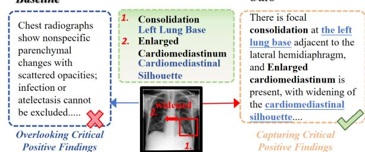
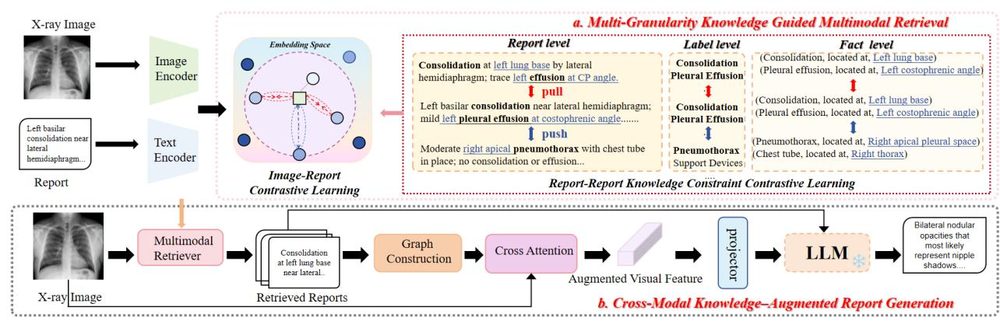
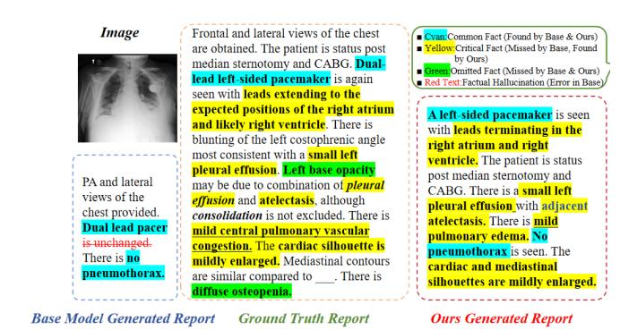

# MGK-RAG: Multi-Granularity Knowledge Guided Retrieval-Augmented Generation for Radiology Report

Jiaqing Ma Artificial Intelligence Institute, Shanghai University Shanghai, China jiaqing\_ma@shu.edu.cn

Xiaodong Yue ∗ Artificial Intelligence Institute, Shanghai University Shanghai, China yswantfly@shu.edu.cn

Yufei Chen School of Computer Science and Technology, Tongii University Shanghai, China yufeichen@tongji.edu.cn

Jie Shi School of Computer Engineering and Science, Shanghai University Shanghai, China jieshi@shu.edu.cn

Zhipeng Wei School of Computer Engineering and Science, Shanghai University Shanghai, China weizhipeng@shu.edu.cn

Zeyu Jia Shanghai Yingtai Purun Medical Device Co., Ltd. Shanghai, China jiazeyu@int-medical.com

# Abstract

Retrieval-augmented generation (RAG) is an effective approach to enhancing the factual accuracy of radiology reports. However, existing methods primarily model coarse-grained image–report correspondences, ignoring semantic relations among reports that capture hierarchical and fine-grained pathological knowledge. As a result, the learned representations fail to reflect detailed clinical semantics, causing factual inconsistencies in generated reports. Therefore, we propose a multi-granularity knowledge-integrated RAG framework for radiology reports. Specifically, we utilize multigranularity semantic similarities, derived from the text modality, to adjust the original cross-modal contrastive learning loss. This guides the multimodal retriever to learn a finer-grained clinical semantic alignment. Then, we utilize cross attention to obtain enhanced visual features by integrating the retrieved reports with the original images, thus enhancing the factual accuracy of report generation. The effectiveness of our method was verified on two widely used benchmarks, achieving superior performance in both language generation and key clinical metrics.

### CCS Concepts

- Computing methodologies → Natural language generation;
- Applied computing → Health informatics.

# Keywords

Radiology Report Generation, Large Language Model, Multi-Granularity Knowledge Guided

### ACM Reference Format:

Jiaqing Ma, Xiaodong Yue, Yufei Chen, Jie Shi, Zhipeng Wei, and Zeyu Jia. 2026. MGK-RAG: Multi-Granularity Knowledge Guided Retrieval-Augmented Generation for Radiology Report. In Proceedings of the ACM Web Conference

∗Corresponding author.

[This work is licensed under a Creative Commons Attribution-NonCommercial-](https://creativecommons.org/licenses/by-nc-nd/4.0)[NoDerivatives 4.0 International License.](https://creativecommons.org/licenses/by-nc-nd/4.0) WWW '26, Dubai, United Arab Emirates © 2026 Copyright held by the owner/author(s). ACM ISBN 979-8-4007-2307-0/2026/04 <https://doi.org/10.1145/3774904.3792924>

2026 (WWW '26), April 13–17, 2026, Dubai, United Arab Emirates. ACM, New York, NY, USA, [4](#page-3-0) pages.<https://doi.org/10.1145/3774904.3792924>

Figure 1: Challenges of existing RAG- and LLM methods: they often produce factually inaccurate or vague outputs.

### 1 Introduction

Automatically generating factually accurate, coherent radiology reports is a core challenge in multimodal medical artificial intelligence, with the potential to reduce radiologist workload and improve interpretation.

Early end-to-end generative models, from CNN-RNN [\[8\]](#page-3-1) and R2Gen [\[3\]](#page-3-2) to recent LLM-based architecture [\[17\]](#page-3-3), have improved report fluency but still produce factually inaccurate reports, which are unacceptable in clinical settings [\[11,](#page-3-4) [12\]](#page-3-5). CXR-RePaiR-Gen [\[13\]](#page-3-6) first applied RAG to radiology report generation by retrieving similar reports to constrain generation and reduce factual hallucinations. LaB-RAG [\[14\]](#page-3-7) then introduced a label-boosted retrieval method using predicted pathological labels to guide the process. However, these labels are coarse-grained and cannot effectively distinguish reports that share the same labels but differ in factual details. Subsequently, CBM-RAG [\[1\]](#page-3-8) introduced a concept bottleneck model to extract finer-grained concepts to guide retrieval, but it neglected the critical, fine-grained entity relationships. Furthermore, while FactMM-RAG [\[15\]](#page-3-9) leveraged RadGraph to mine factual report pairs for its fact-aware retriever, it does not exploit information at multiple semantic granularities to more precisely guide the alignment process.

| Type Model           |      | F1CheXbert | F1RadGraph | ROUGE-L | BERTScore |
|----------------------|------|------------|------------|---------|-----------|
| Generation LLaVA-Med | [10] | 0.166      | 0.048      | 0.170   | 0.261     |
| MiniGPT-Med          | [2]  | 0.214      | 0.147      | 0.271   | 0.361     |
| XrayGPT              | [16] | 0.291      | 0.165      | 0.285   | 0.368     |
| R2GenGPT             | [17] | 0.389      | 0.187      | 0.297   | 0.415     |
| META-CXR             | [6]  | 0.428      | 0.224      | 0.280   | 0.426     |
| Retrieval LaB-RAG    | [14] | 0.466      | 0.183      | 0.204   | 0.861     |
| FactMM-RAG           | [15] | 0.602      | 0.257      | 0.307   | 0.561     |
| Ours                 |      | 0.614      | 0.262      | 0.299   | 0.557     |

Table 2: Comparison results on IU X-Ray.

| Type       | Model           | F1CheXbert | F1RadGraph | ROUGE-L | BERTScore |
|------------|-----------------|------------|------------|---------|-----------|
| Generation | LLaVA-Med [10]  | 0.140      | 0.075      | 0.160   | 0.261     |
|            | MiniGPT-Med [2] | 0.489      | 0.310      | 0.345   | 0.472     |
| Retrieval  | LaB-RAG [14]    | 0.536      | 0.228      | 0.219   | 0.865     |
|            | Ours            | 0.543      | 0.314      | 0.273   | 0.524     |

Table 3: Model performance with different designed modules.

| R L | F | E F1CheXbert | F1RadGraph | ROUGE-L | BERTScore |
|-----|---|--------------|------------|---------|-----------|
|     |   | 0.505        | 0.239      | 0.297   | 0.551     |
| ✓   |   | ✓ 0.547      | 0.245      | 0.297   | 0.555     |
| ✓ ✓ |   | ✓ 0.599      | 0.259      | 0.297   | 0.556     |
| ✓ ✓ | ✓ | ✓ 0.614      | 0.262      | 0.299   | 0.557     |

Figure 3: Qualitative examples on MIMIC-CXR.

Introducing the report-level constraint R, training a retriever and using module E to inject retrieved knowledge into the visual representation improves the clinical metrics to 0.547/0.245 with comparable NLG scores; adding the label-level constraint L further raises them to 0.599/0.259. The full model, which additionally leverages the fact-level constraint F, achieves 0.614/0.262 and the best ROUGE-L and BERTScore, demonstrating that each component of MGK-RAG contributes to generating more factually accurate radiology reports.

# 3.4 Case Study

Fig. [3](#page-3-22) presents an example of our qualitative comparison results. The baseline report on the left is factually poor: it identifies only common facts, such as Dual lead pacer and no pneumothorax, suffers from the factual hallucination is unchanged, and critically omits all key positive findings, such as small left pleural effusion, atelectasis, and cardiac silhouette is mildly enlarged. In contrast, our model on the right demonstrates superior factual completeness.

### 4 Conclusion

We propose a Multi-Granularity Knowledge Guided RAG framework to mitigate factual inconsistencies in radiology report generation. Our framework guides contrastive learning via report, label, and fact-level semantic similarities to enhance factual retrieval, and fuses retrieved reports with images to obtain knowledge-augmented visual representations. The method achieves leading performance on the MIMIC-CXR and IU X-Ray benchmarks, generating clinically accurate and reliable reports.

### Acknowledgments

This work was supported by the National Natural Science Foundation of China (No. 62476165, 62472315, 62406182), and Fundamental Research Program of Shanxi Province(Serial No. 202403021212176), and Science and Technology Innovation Project for Higher Education Institutions of Shanxi Province(Serial No. 2024L004).

### References

[1] Hasan Md Tusfiqur Alam, Devansh Srivastav, Md Abdul Kadir, and Daniel Sonntag. 2025. Towards interpretable radiology report generation via concept bottlenecks using a multi-agentic rag. In European Conference on Information Retrieval. Springer, 201–209. [2] Asma Alkhaldi, Raneem Alnajim, Layan Alabdullatef, Rawan Alyahya, Jun Chen, Deyao Zhu, Ahmed Alsinan, and Mohamed Elhoseiny. 2024. Minigpt-med: Large language model as a general interface for radiology diagnosis. arXiv preprint arXiv:2407.04106 (2024). [3] Zhihong Chen, Yan Song, Tsung-Hui Chang, and Xiang Wan. 2020. Generating radiology reports via memory-driven transformer. arXiv preprint arXiv:2010.16056 (2020). [4] Lin Chin-Yew. 2004. Rouge: A package for automatic evaluation of summaries. In Proceedings of the Workshop on Text Summarization Branches Out, 2004. [5] Dina Demner-Fushman, Marc D Kohli, Marc B Rosenman, Sonya E Shooshan, Laritza Rodriguez, Sameer Antani, George R Thoma, and Clement J McDonald. 2015. Preparing a collection of radiology examinations for distribution and retrieval. Journal of the American Medical Informatics Association 23, 2 (2015), 304–310. [6] Dasith Edirisinghe, Wimukthi Nimalsiri, Mahela Hennayake, Dulani Meedeniya, and Gilbert Lim. 2025. Chest X-Ray Report Generation Using Abnormality Guided Vision Language Model. IEEE Access (2025). [7] Saahil Jain, Ashwin Agrawal, Adriel Saporta, Steven QH Truong, Du Nguyen Duong, Tan Bui, Pierre Chambon, Yuhao Zhang, Matthew P Lungren, Andrew Y Ng, et al. 2021. Radgraph: Extracting clinical entities and relations from radiology reports. arXiv preprint arXiv:2106.14463 (2021). [8] Baoyu Jing, Pengtao Xie, and Eric Xing. 2018. On the automatic generation of medical imaging reports. In Proceedings of the 56th annual meeting of the association for computational linguistics (volume 1: long papers). 2577–2586. [9] Alistair EW Johnson, Tom J Pollard, Nathaniel R Greenbaum, Matthew P Lungren, Chih-ying Deng, Yifan Peng, Zhiyong Lu, Roger G Mark, Seth J Berkowitz, and Steven Horng. 2019. MIMIC-CXR-JPG, a large publicly available database of labeled chest radiographs. arXiv preprint arXiv:1901.07042 (2019). [10] Chunyuan Li, Cliff Wong, Sheng Zhang, Naoto Usuyama, Haotian Liu, Jianwei Yang, Tristan Naumann, Hoifung Poon, and Jianfeng Gao. 2023. Llava-med: Training a large language-and-vision assistant for biomedicine in one day. Advances in Neural Information Processing Systems 36 (2023), 28541–28564. [11] Wei Liu, Yufei Chen, Xiaodong Yue, Changqing Zhang, and Shaorong Xie. 2025. Enhancing reliability in medical image classification of imperfect views. IEEE Transactions on Circuits and Systems for Video Technology (2025). [12] Wei Liu, Xiaodong Yue, Yufei Chen, and Thierry Denoeux. 2022. Trusted multiview deep learning with opinion aggregation. In Proceedings of the AAAI Conference on Artificial Intelligence, Vol. 36. 7585–7593. [13] Mercy Ranjit, Gopinath Ganapathy, Ranjit Manuel, and Tanuja Ganu. 2023. Retrieval augmented chest x-ray report generation using openai gpt models. In Machine Learning for Healthcare Conference. PMLR, 650–666. [14] Steven Song, Anirudh Subramanyam, Irene Madejski, and Robert L Grossman. 2024. Lab-rag: Label boosted retrieval augmented generation for radiology report generation. arXiv preprint arXiv:2411.16523 (2024). [15] Liwen Sun, James Jialun Zhao, Wenjing Han, and Chenyan Xiong. 2025. Factaware multimodal retrieval augmentation for accurate medical radiology report generation. In Proceedings of the 2025 Conference of the Nations of the Americas Chapter of the Association for Computational Linguistics: Human Language Technologies (Volume 1: Long Papers). 643–655. [16] Omkar Chakradhar Thawakar, Abdelrahman M Shaker, Sahal Shaji Mullappilly, Hisham Cholakkal, Rao Muhammad Anwer, Salman Khan, Jorma Laaksonen, and Fahad Khan. 2024. XrayGPT: Chest radiographs summarization using large medical vision-language models. In Proceedings of the 23rd workshop on biomedical natural language processing. 440–448. [17] Zhanyu Wang, Lingqiao Liu, Lei Wang, and Luping Zhou. 2023. R2gengpt: Radiology report generation with frozen llms. Meta-Radiology 1, 3 (2023), 100033. [18] Tianyi Zhang, Varsha Kishore, Felix Wu, Kilian Q Weinberger, and Yoav Artzi. 2019. Bertscore: Evaluating text generation with bert. arXiv preprint arXiv:1904.09675 (2019). [19] Yuhao Zhang, Derek Merck, Emily Tsai, Christopher D Manning, and Curtis Langlotz. 2020. Optimizing the factual correctness of a summary: A study of summarizing radiology reports. In Proceedings of the 58th annual meeting of the association for computational linguistics. 5108–5120.