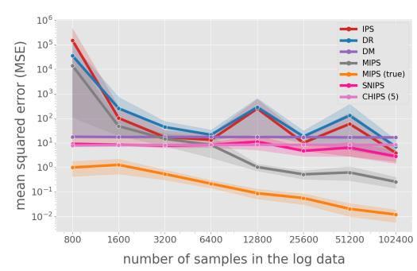
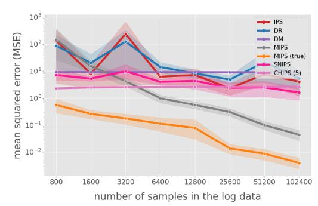
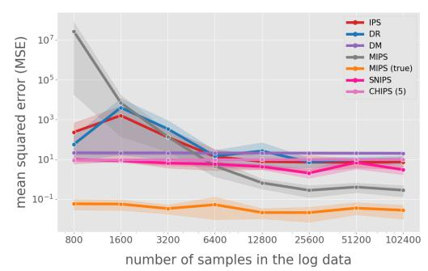
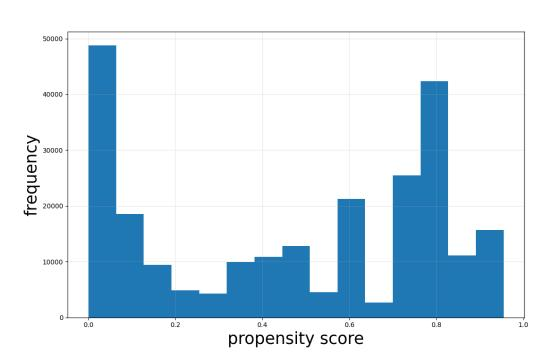

Figure 2: MSE of various OPE methods, random\_state = 12345.

Table 1: Spearman's rank correlation for OPE estimators.

|           | IPS    | DM     | DR     | MIPS   | CHIPS (5) | SNIPS  |
|-----------|--------|--------|--------|--------|-----------|--------|
| IPS       | 1.000  | -0.264 | 0.851  | 0.019  | -0.140    | 0.668  |
| DM        | -0.264 | 1.000  | -0.155 | 0.127  | 0.025     | -0.074 |
| DR        | 0.851  | -0.155 | 1.000  | 0.033  | -0.031    | 0.496  |
| MIPS      | 0.019  | 0.127  | 0.033  | 1.000  | 0.030     | -0.039 |
| CHIPS (5) | -0.140 | 0.025  | -0.031 | 0.030  | 1.000     | -0.044 |
| SNIPS     | 0.668  | -0.074 | 0.496  | -0.039 | -0.044    | 1.000  |

These results suggest that making conclusions from synthetic experiments may strongly depend on the particular data realization and the chosen sample size. While huge variance of OPE estimates was already described in literature, available methodology for robust OPE evaluation [\[13\]](#page-3-8) suggests to use some statistics inferred from multiple run of OPE methods (such as respective CDFs) in a fixed particular environment.

Varying the sample size and random state. For every fixed sample size, we consider 25 different configurations of the synthetic environment with 500 actions. For each of them we create a test dataset to obtain ground-truth policy value and a validation dataset, on which we perform OPE to then calculate MSE for all methods using the corresponding ground-truth. Final MSE for each estimator is calculated via averaging over 25 configurations results. The results are reported in Figure [3,](#page-2-2) showing potentially more stable behavior compared to the plots reported for a fixed environments in Figures [1](#page-1-0) and [2.](#page-2-0)

Figure 3: MSE of various OPE methods for varying numbers of sample sizes over 25 different environments.

In one of the rare attempts to mitigate the issues described above, [\[3\]](#page-3-12) proposed AutoOPE: an ML-based method, which aims to predict the MSE of the particular estimator on the particular data, thus accounting for the sensitivity to the particular log. However, considering the variety of different environments and estimators, reliability of such estimator selection or estimator robustness evaluation approaches is highly questionable.

To sum up, the synthetic experiments outlined in this section show that the relative performance rankings of OPE estimators are highly sensitive to the particular generated log and to the sample size, even when the underlying environment is fixed. Thus the conclusions drawn from a particular synthetic benchmark may be misleading, which motivates a closer study of OPE estimators on the real data in the next section.

### 3 Real data evaluation

Real-world open datasets for OPE research are limited, and existing alternatives often require substantial modifications that make them less representative compared to the real-world data. To the best of our knowledge, the Open Bandit Dataset [\[11\]](#page-3-0) is the only dataset collected with a logged policy. Many recent OPE studies [\[3,](#page-3-12) [5,](#page-3-9) [12,](#page-3-4) [13\]](#page-3-8) rely on this particular dataset.

Open Bandit Dataset (OBD, [\[11\]](#page-3-0)). The OBD is a large-scale logged contextual bandit dataset collected from the ZOZOTOWN e-commerce platform. It contains two logging policies: Random, with approximately 1.3×106 interactions, and Bernoulli Thompson Sampling (BTS), with 1.2×107 interactions. Each interaction records the user context, item context, the chosen item from 1 to 80 and its position from 1 to 3 (together forming 240 actions), the probability of an item being recommended at the given position (propensity score), and the observed reward (click).

Policy and environment consistency. A careful inspection of the Open Bandit Dataset with BTS policy shows that the logging policy changed during the experiment. We illustrate this in Figure [4,](#page-3-13) where we plot the histogram of propensity scores for (action,position) pair with the largest standard deviation across the logged propensity scores. Moreover, [\[11\]](#page-3-0) does not provide information about the frequency or timing of these updates. As a result, advanced OPE methods such as MIPS and CHIPS cannot be reliably applied to the dataset with BTS policy. This is the reason why, as logged data, researchers typically use the part of the Open Bandit Dataset collected under the Random policy. At the same time, this pipeline still contains several inaccuracies.

Biased ground-truth computations. In many studies (see e.g. [\[3,](#page-3-12) [12\]](#page-3-4)), off-policy evaluation is conducted in the following pipeline: the dataset with Random policy is used as logged data, while the BTS policy, with the prior corresponding to the beginning of the ZOZOTOWN experiment, is treated as the target policy. The ground-truth value of this target policy is then estimated using the dataset with BTS policy. At the same time, given the time-varying behavior policy logged in the BTS dataset, it can not be used for the ground-truth evaluations without introducing an additional bias, which is hard to quantify. We are not aware of any estimates of this bias in the literature.

Figure 4: Propensity scores distribution for (item, position) with the highest standard deviation from OBD BTS ALL log.

Inconsistencies in the Random part of the OBD. There are two common ways of using the Random-policy part of the Open Bandit Dataset as logged data.

Several papers [\[4,](#page-3-14) [13\]](#page-3-8) treat the logged policy as a uniform one over 80 actions, ignoring item's position. In this case, off-policy evaluation is performed with target policy �� (��) and logged policy ��0 (��|position) and then averaged over all interactions. This hypothesis implies, in particular, that the ��0 (��|position) distribution of action probabilities given position is uniform with probability of each action choice 1/80. To verify this assumption, we conducted a simple Pearson X2 test based on the data, collected from the Random subset of OBD. As shown in Table [2,](#page-3-15) this hypothesis is rejected. This raises the question, if the logged probability value 1/80 can be used for computing propensity scores.

Second group of papers [\[1,](#page-3-16) [5,](#page-3-9) [12\]](#page-3-4) treat the logged policy as a uniform one over 240 actions, identifying an action with a pair (item, position). We conducted a X2 test for the hypothesis that the distribution over (item, position) pairs is uniform. As shown again in Table [2,](#page-3-15) the test rejects this hypothesis, too. Thus, neither of the commonly used assumptions about logged probabilities are supported by statistical evidence and can potentially lead to misspecified propensity scores.

Table 2: Results of chi-square tests on OBD UR ALL log. Item conditional distribution considered for position 1.

|                             | 2         |     |          |
|-----------------------------|-----------|-----|----------|
| Test                        | ��        |     |          |
|                             | statistic | DoF | p-value  |
| Item-Position uniformity    | 2186.15   | 239 | < 10 − 8 |
| Item uniformity             | 752.18    | 79  | < 10 − 8 |
| Item conditional uniformity | 749.38    | 79  | < 10 − 8 |

Absence of user id. The OBD does not include user identifiers, which limits the types of politics and off-policy methods that can be used. Many methods in contextual bandits and recommender systems [\[6\]](#page-3-17) require distinguishing individual users or constructing user-level representations, which is not possible in this setting. Indeed, the OBD dataset contains only 4 user features, resulting in few unique feature combinations in the "all" campaign. As a result, multiple users share the same feature vector.

# 4 Conclusion

We have shown several issues related with OPE evaluation protocols. First, choice of the "best" estimator based on synthetic dataset

can be extremely unstable, depending strongly on the specific log realization and sample size. On the only widely used real-world benchmark, the OBD, we further documented several peculiarities (non-stationarity of the BTS logging policy, deviations of the Random log from commonly assumed uniform propensities over actions), which complicate fair evaluation and make it impossible to apply many novel variance-reduced OPE methods. Together, these findings call for more careful reporting and scrutiny of experimental setups. They also highlight the need for evaluation pipelines that explicitly account for non-stationary logging and uncertainty in logged propensities. In addition, they emphasize the importance of more clearly documented OPE datasets in order to support reliable benchmarking of OPE methods.

## Acknowledgement

The work was supported by the grant for research centers in the field of AI provided by the Ministry of Economic Development of the Russian Federation in accordance with the agreement 000000C313925P4E0002 and the agreement with HSE University № 139-15-2025-009.

## References

[1] Matej Cief, Jacek Golebiowski, Philipp Schmidt, Ziawasch Abedjan, and Artur Bekasov. 2024. Learning action embeddings for off-policy evaluation. In European Conference on Information Retrieval. Springer, 108–122. [2] Miroslav Dudík, Dumitru Erhan, John Langford, and Lihong Li. 2014. Doubly Robust Policy Evaluation and Optimization. Statist. Sci. 29, 4 (2014), 485 – 511. [doi:10.1214/14-STS500](https://doi.org/10.1214/14-STS500) [3] Nicolò Felicioni, Michael Benigni, and Maurizio Ferrari Dacrema. 2024. Automated Off-Policy Estimator Selection via Supervised Learning. arXiv preprint arXiv:2406.18022 (2024). [4] Nicolò Felicioni, Maurizio Ferrari Dacrema, Marcello Restelli, and Paolo Cremonesi. 2022. Off-policy evaluation with deficient support using side information. Advances in Neural Information Processing Systems 35 (2022), 30250–30264. [5] Daniel Guzman-Olivares, Philipp Schmidt, Jacek Golebiowski, and Artur Bekasov. 2025. Clustering context in off-policy evaluation. In Proceedings of the 25th International Conference on Artificial Intelligence and Statistics, Vol. 258. [6] Lizi He, Xiangnan andf Liao, Hanwang Zhang, Liqiang Nie, Xia Hu, and Tat-Seng Chua. 2017. Neural collaborative filtering. In Proceedings of the 26th international conference on world wide web. 173–182. [7] Nathan Kallus and Masatoshi Uehara. 2019. Intrinsically efficient, stable, and bounded off-policy evaluation for reinforcement learning. Advances in neural information processing systems 32 (2019). [8] Ilja Kuzborskij, Claire Vernade, Andras Gyorgy, and Csaba Szepesvári. 2021. Confident off-policy evaluation and selection through self-normalized importance weighting. In International Conference on Artificial Intelligence and Statistics. PMLR, 640–648. [9] Gilles Pagès. 2018. Numerical probability. Universitext, Springer (2018). [10] Paul R Rosenbaum and Donald B Rubin. 1983. The central role of the propensity score in observational studies for causal effects. Biometrika 70, 1 (1983), 41–55. [11] Yuta Saito, Shunsuke Aihara, Megumi Matsutani, and Yusuke Narita. 2020. Open bandit dataset and pipeline: Towards realistic and reproducible off-policy evaluation. arXiv preprint arXiv:2008.07146 (2020). [12] Yuta Saito and Thorsten Joachims. 2022. Off-policy evaluation for large action spaces via embeddings. In Proceedings of the 39th International Conference on Machine Learning, Vol. 162. 19089–19122. [13] Yuta Saito, Takuma Udagawa, Haruka Kiyohara, Kazuki Mogi, Yusuke Narita, and Kei Tateno. 2021. Evaluating the Robustness of Off-Policy Evaluation. In Proceedings of the 15th ACM Conference on Recommender Systems (Amsterdam, Netherlands) (RecSys '21). Association for Computing Machinery, New York, NY, USA, 114–123. [doi:10.1145/3460231.3474245](https://doi.org/10.1145/3460231.3474245) [14] Alex Strehl, John Langford, Lihong Li, and Sham M Kakade. 2010. Learning from logged implicit exploration data. Advances in neural information processing systems 23 (2010). [15] Adith Swaminathan and Thorsten Joachims. 2015. The Self-Normalized Estimator for Counterfactual Learning. In Advances in Neural Information Processing Systems, Vol. 28. Curran Associates, Inc.