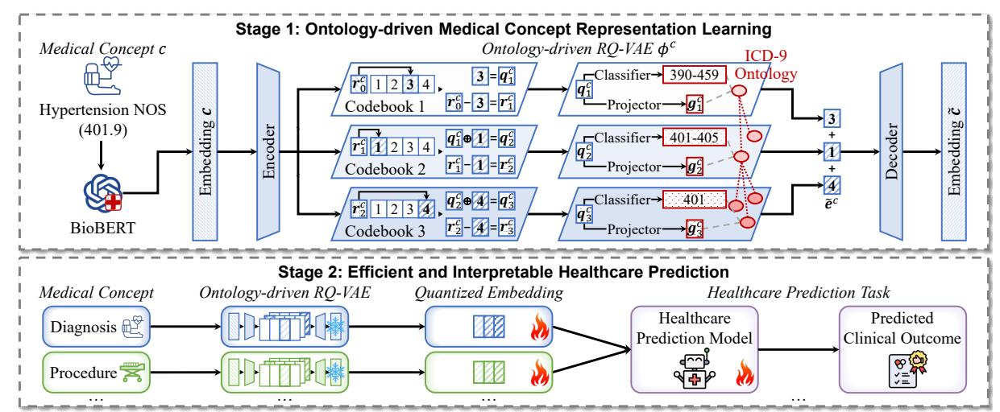
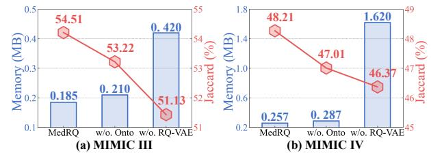
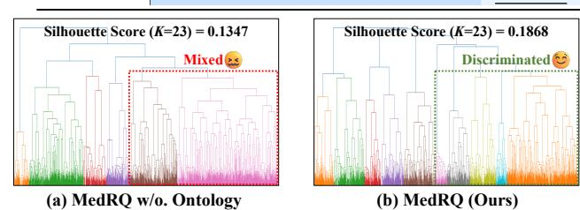

# Towards Efficient and Interpretable Medical Concept Representation via Ontology-driven Residual VectorQuantization

Hang Lv Fuzhou University Fuzhou, China lvhangkenn@gmail.com

Kaisong Zhang Fuzhou University Fuzhou, China 832403326@fzu.edu.cn

Yanchao Tan† Fuzhou University Fuzhou, China yctan@fzu.edu.cn

Xing Chen† Fuzhou University Fuzhou, China chenxing@fzu.edu.cn

### Abstract

Medical concepts, the core entities in Electronic Health Records (EHRs), provide essential inputs for clinical decision-making systems. However, most existing healthcare models still rely on massive concept-specific embedding tables, resulting in substantial memory overhead. Recent studies compress medical concepts into discrete code sequences for memory efficiency, but their flat semantic quantization fails to explicitly encode the hierarchical structure of medical ontologies, thereby limiting clinical interpretability. To this end, we propose MedRQ, an ontology-driven residual vector quantization framework that aligns discrete codes with multi-level clinical ontologies. By incorporating hierarchical supervision into the quantization process, MedRQ generates compact and ontology-consistent concept representations that generalize seamlessly across healthcare prediction tasks. Experiments on two real-world EHR datasets demonstrate that MedRQ significantly outperforms state-of-the-art baselines while reducing memory usage.

### CCS Concepts

- Applied computing → Health informatics.

# Keywords

Representation Learning, Medical Concept Ontology, Residual Vector Quantization

### ACM Reference Format:

Hang Lv, Kaisong Zhang, Yanchao Tan† , and Xing Chen† . 2026. Towards Efficient and Interpretable Medical Concept Representation via Ontologydriven Residual Vector Quantization. In Proceedings of the ACM Web Conference 2026 (WWW '26), April 13–17, 2026, Dubai, United Arab Emirates. ACM, New York, NY, USA, [4](#page-3-0) pages.<https://doi.org/10.1145/3774904.3792930>

## 1 Introduction

Electronic Health Records (EHRs), as a central data foundation for modern healthcare prediction, provide rich information for patient condition assessment and clinical decision-making [\[9,](#page-3-1) [11,](#page-3-2) [12,](#page-3-3) [15\]](#page-3-4). The cornerstone of EHRs is medical concepts (e.g., diagnoses, procedures, and medication), which originate from standardized

© 2026 Copyright held by the owner/author(s). ACM ISBN 979-8-4007-2307-0/2026/04 <https://doi.org/10.1145/3774904.3792930>

clinical classification systems (e.g., ICD-9[1](#page-0-0) and ATC[2](#page-0-1) ) that structure medical knowledge into multi-level ontologies.

Although learning effective representations of these medical concepts is essential for reliable prediction, the massive number of concepts incorporated into clinical models poses a major challenge. For example, the ICD-9 system alone contains over 14,000 diagnosis codes and 3,900 procedure codes. Treating each concept as an independent embedding results in substantial memory overhead, hindering their practicality in real-world clinical settings.

Recent studies try to compress medical concepts into discrete code sequences, replacing the large embedding tables required by traditional models [\[1,](#page-3-5) [11\]](#page-3-2) and improving computational efficiency. For example, UDC [\[14\]](#page-3-6) maps diagnosis embeddings to a set of discrete codes through a Residual-Quantized Variational AutoEncoder (RQ-VAE) [\[4\]](#page-3-7). Despite their effectiveness in reducing memory cost, these methods typically learn flat codes driven solely by semantic similarity. Such unsupervised quantization cannot guarantee that the learned codes reflect the multi-level organization of medical ontologies. For instance, ICD-9 codes 401 Essential Hypertension and 405 Secondary Hypertension share textual similarities, but they differ in etiology and treatment pathways. Without explicit ontology guidance, the learned discrete medical concept representations may lose discriminability and lead to inaccurate clinical predictions [\[7\]](#page-3-8).

In this paper, we propose MedRQ, an efficient and interpretable medical concept representation learning framework, which directly integrates hierarchical ontology supervision into quantized concept codes for enhanced healthcare prediction. Specifically, Stage 1 designs an Ontology-driven RQ-VAE to align discrete code sequences with multi-level ontology structures, yielding compact and ontology-consistent representations. Stage 2 leverages these concept embeddings for healthcare prediction, consistently outperforming state-of-the-art baselines. Notably, the learned quantized codes explicitly encode ontology structure, making them task-agnostic and potentially applicable to a variety of clinical prediction tasks.

# 2 Methodology

# 2.1 Notation and Problem Formulation

Medical Concept Ontology. A medical concept ontology provides a hierarchical organization of clinically related concepts, ranging from general to specific entities. Each concept type (e.g., diagnosis) is associated with its own ontology (e.g., ICD-9). We denote the ontology as G = {G�� } �� ��=1 ∪ C, where �� + 1 is the total depth of the hierarchy, �� �� ∈ G�� is the ��-th level (higher-level) concept, and �� ∈ C = G��+1 is the leaf-level concept typically recorded in EHRs.

† Yanchao Tan and Xing Chen are the corresponding authors.

[This work is licensed under a Creative Commons Attribution 4.0 International License.](https://creativecommons.org/licenses/by/4.0) WWW '26, Dubai, United Arab Emirates

1https://www.cdc.gov/nchs/icd/icd9cm.htm

2https://www.who.int/tools/atc-ddd-toolkit/atc-classification

|      | Dataset  |     |     |        |        |       |         | MIMIC-III |       |        | MIMIC-IV |        |
|------|----------|-----|-----|--------|--------|-------|---------|-----------|-------|--------|----------|--------|
| #    | patients |     | / # |        | visits |       | 6350    | /         | 15031 | 61264  | /        | 163877 |
| #    | diag.    | /   | #   | proc.  | / #    | med.  | 1903 /  | 1409      | /131  | 2000 / | 11056    | / 131  |
| Avg. | /        | Max | #   | visits |        |       | 2.3671  | /         | 29    | 2.6749 | /        | 70     |
| Avg. | /        | Max | #   | diag.  | per    | visit | 10.2266 | /         | 127   | 8.2343 | /        | 270    |
| Avg. | /        | Max | #   | proc.  | per    | visit | 3.8244  | /         | 50    | 2.3579 | /        | 95     |
| Avg. | /        | Max | #   | med.   | per    | visit | 11.4361 |           | / 65  | 6.5055 | /        | 72     |

Table 2: Experimental results (%) on two EHR datasets. The best performances are highlighted in boldface and the second-best results are underlined. Ground-truth # of Med. on the test sets is 19.79 for MIMIC-III and 11.98 for MIMIC-IV, respectively.

|          |    |    |     | ↑  |    | F1 | ↑   |    |    |    |     | ↑  |   |    | DDI | ↓  | #  | Med. |    |    |     | ↑  |    | F1 | ↑   |    |    |    |     | ↑  |   |    | DDI | ↓  | #  | Med. |
|----------|----|----|-----|----|----|----|-----|----|----|----|-----|----|---|----|-----|----|----|------|----|----|-----|----|----|----|-----|----|----|----|-----|----|---|----|-----|----|----|------|
| LR       | 46 | 47 | ± 0 | 12 | 62 | 65 | ± 0 | 18 | 74 | 72 | ± 0 | 13 | 8 | 09 | ± 0 | 09 | 15 | 85   | 41 | 01 | ± 0 | 13 | 55 | 89 | ± 0 | 15 | 67 | 17 | ± 0 | 19 | 7 | 76 | ± 0 | 07 | 10 | 03   |
| ECC      | 45 | 56 | ± 0 | 16 | 61 | 67 | ± 0 | 14 | 71 | 92 | ± 0 | 19 | 8 | 18 | ± 0 | 12 | 15 | 48   | 39 | 27 | ± 0 | 18 | 53 | 74 | ± 0 | 13 | 66 | 91 | ± 0 | 18 | 7 | 83 | ± 0 | 07 | 7  | 89   |
| RETAIN   | 45 | 37 | ± 0 | 13 | 61 | 74 | ± 0 | 16 | 72 | 19 | ± 0 | 12 | 8 | 46 | ± 0 | 07 | 19 | 96   | 41 | 64 | ± 0 | 12 | 56 | 87 | ± 0 | 20 | 67 | 12 | ± 0 | 13 | 8 | 09 | ± 0 | 09 | 10 | 53   |
| LEAP     | 43 | 28 | ± 0 | 13 | 59 | 86 | ± 0 | 18 | 64 | 65 | ± 0 | 13 | 7 | 61 | ± 0 | 06 | 17 | 82   | 38 | 98 | ± 0 | 17 | 54 | 05 | ± 0 | 13 | 54 | 36 | ± 0 | 18 | 7 | 28 | ± 0 | 07 | 9  | 78   |
| MICRON   | 48 | 19 | ± 0 | 12 | 64 | 03 | ± 0 | 18 | 72 | 97 | ± 0 | 14 | 7 | 54 | ± 0 | 10 | 18 | 71   | 42 | 77 | ± 0 | 13 | 57 | 68 | ± 0 | 19 | 67 | 33 | ± 0 | 13 | 7 | 19 | ± 0 | 09 | 11 | 70   |
| GAMENet  | 47 | 83 | ± 0 | 15 | 63 | 79 | ± 0 | 17 | 72 | 48 | ± 0 | 13 | 8 | 52 | ± 0 | 06 | 24 | 25   | 42 | 19 | ± 0 | 19 | 57 | 45 | ± 0 | 14 | 66 | 29 | ± 0 | 18 | 8 | 17 | ± 0 | 08 | 15 | 54   |
| SafeDrug | 48 | 32 | ± 0 | 18 | 64 | 34 | ± 0 | 12 | 72 | 61 | ± 0 | 19 | 6 | 91 | ± 0 | 04 | 18 | 01   | 43 | 57 | ± 0 | 19 | 58 | 73 | ± 0 | 14 | 65 | 43 | ± 0 | 19 | 6 | 63 | ± 0 | 04 | 10 | 85   |
| MoleRec  | 53 | 03 | ± 0 | 13 | 68 | 47 | ± 0 | 20 | 77 | 75 | ± 0 | 14 | 7 | 34 | ± 0 | 04 | 20 | 93   | 46 | 74 | ± 0 | 13 | 61 | 94 | ± 0 | 17 | 70 | 67 | ± 0 | 19 | 6 | 94 | ± 0 | 02 | 11 | 85   |
| DEPOT    | 53 | 31 | ± 0 | 15 | 68 | 68 | ± 0 | 13 | 78 | 20 | ± 0 | 18 | 7 | 22 | ± 0 | 04 | 20 | 37   | 47 | 09 | ± 0 | 12 | 62 | 23 | ± 0 | 19 | 71 | 11 | ± 0 | 11 | 7 | 02 | ± 0 | 09 | 12 | 07   |
| UDC      | 52 | 21 | ± 0 | 21 | 67 | 74 | ± 0 | 14 | 78 | 24 | ± 0 | 11 | 7 | 29 | ± 0 | 05 | 20 | 05   | 47 | 81 | ± 0 | 16 | 63 | 11 | ± 0 | 12 | 71 | 45 | ± 0 | 15 | 7 | 12 | ± 0 | 07 | 12 | 15   |
| MedRQ    | 54 | 51 | ± 0 | 12 | 69 | 73 | ± 0 | 16 | 78 | 86 | ± 0 | 18 | 7 | 00 | ± 0 | 07 | 21 | 16   | 48 | 21 | ± 0 | 19 | 64 | 41 | ± 0 | 11 | 72 | 31 | ± 0 | 15 | 6 | 74 | ± 0 | 03 | 12 | 67   |

Figure 3: ICD-9 diagnosis ontology visualization learned by different models on MIMIC-III. Best viewed in color.

diagnosis representations on MIMIC-III using the Ward-linkage hierarchical clustering algorithm [\[6\]](#page-3-16). Figure [3](#page-3-17) compares the resulting dendrograms for MedRQ and its variant that removes ontologydriven supervision (MedRQ w/o. Ontology). Additionally, we report the Silhouette score with �� = 23, where �� denotes the number of top-level concepts in the ICD-9 diagnosis ontology. A higher Silhouette score indicates better cluster compactness and separation, suggesting more semantically consistent groupings. As shown in Figure [3,](#page-3-17) without explicit guidance from the ontology, the clusters generated by MedRQ w/o. Ontology are mixed and loosely separated. This indicates that flat semantic quantization in the base RQ-VAE fails to preserve clinically meaningful hierarchical relationships. In contrast, MedRQ yields clearer and more coherent groupings that align with the multi-level ICD-9 diagnosis ontology structure, achieving a higher Silhouette score (i.e., 0.1868 vs. 0.1347). These results confirm that ontology-driven supervision enables the learned representations to capture more discriminative hierarchical structures and provide stronger interpretability.

### 4 Conclusion

In this paper, we present MedRQ, a novel framework that learns efficient and interpretable medical concept representations through ontology-driven residual vector quantization. The resulting quantized embeddings capture multi-level clinical hierarchies while reducing memory consumption, enabling more effective healthcare prediction. Extensive experiments demonstrate that MedRQ consistently outperforms state-of-the-art methods, highlighting its potential applicability to various healthcare prediction tasks.

### Acknowledgements

This work was supported in part by the Fujian Provincial Artificial Intelligence Industry Development Technology Project under Grants (2025H0042), Fujian Provincial Natural Science Foundation of China under Grants (2025J01540), and National Natural Science Foundation of China under Grants (62302098).

### References

[1] Edward Choi, Mohammad Taha Bahadori, Jimeng Sun, Joshua Kulas, Andy Schuetz, and Walter Stewart. 2016. Retain: An interpretable predictive model for healthcare using reverse time attention mechanism. NeurIPS 29. [2] Alistair EW Johnson, Tom J Pollard, Lu Shen, Li-wei H Lehman, Mengling Feng, Mohammad Ghassemi, Benjamin Moody, Peter Szolovits, Leo Anthony Celi, and Roger G Mark. 2016. MIMIC-III, a freely accessible critical care database. Scientific Data 3, 1 (2016). [3] Alistair EW Johnson, David J Stone, Leo A Celi, and Tom J Pollard. 2018. The MIMIC Code Repository: enabling reproducibility in critical care research. JAMIA 25, 1 (2018). [4] Doyup Lee, Chiheon Kim, Saehoon Kim, Minsu Cho, and Wook-Shin Han. 2022. Autoregressive image generation using residual quantization. In CVPR. [5] Jinhyuk Lee, Wonjin Yoon, Sungdong Kim, Donghyeon Kim, Sunkyu Kim, Chan Ho So, and Jaewoo Kang. 2020. BioBERT: a pre-trained biomedical language representation model for biomedical text mining. Bioinformatics 36, 4 (2020). [6] Daniel Müllner. 2011. Modern hierarchical, agglomerative clustering algorithms. arXiv (2011). [7] Mohsen Nayebi Kerdabadi, Arya Hadizadeh Moghaddam, Dongjie Wang, and Zijun Yao. 2025. Multi-Ontology Integration with Dual-Axis Propagation for Medical Concept Representation. In CIKM. [8] Jesse Read, Bernhard Pfahringer, Geoff Holmes, and Eibe Frank. 2011. Classifier chains for multi-label classification. Machine Learning 85 (2011). [9] Junyuan Shang, Cao Xiao, Tengfei Ma, Hongyan Li, and Jimeng Sun. 2019. Gamenet: Graph augmented memory networks for recommending medication combination. In AAAI, Vol. 33. [10] Chaoqi Yang, Cao Xiao, Lucas Glass, and Jimeng Sun. 2021. Change Matters: Medication Change Prediction with Recurrent Residual Networks. In IJCAI. [11] Chaoqi Yang, Cao Xiao, Fenglong Ma, Lucas Glass, and Jimeng Sun. 2021. Safe-Drug: Dual Molecular Graph Encoders for Recommending Effective and Safe Drug Combinations. In IJCAI. [12] Nianzu Yang, Kaipeng Zeng, Qitian Wu, and Junchi Yan. 2023. Molerec: Combinatorial drug recommendation with substructure-aware molecular representation learning. In WWW. [13] Yutao Zhang, Robert Chen, Jie Tang, Walter F Stewart, and Jimeng Sun. 2017. LEAP: learning to prescribe effective and safe treatment combinations for multimorbidity. In KDD. [14] Chuang Zhao, Hui Tang, Jiheng Zhang, and Xiaomeng Li. 2025. Unveiling Discrete Clues: Superior Healthcare Predictions for Rare Diseases. In WWW. [15] Chuang Zhao, Hongke Zhao, Xiaofang Zhou, and Xiaomeng Li. 2024. Enhancing Precision Drug Recommendations via In-depth Exploration of Motif Relationships. TKDE (2024).