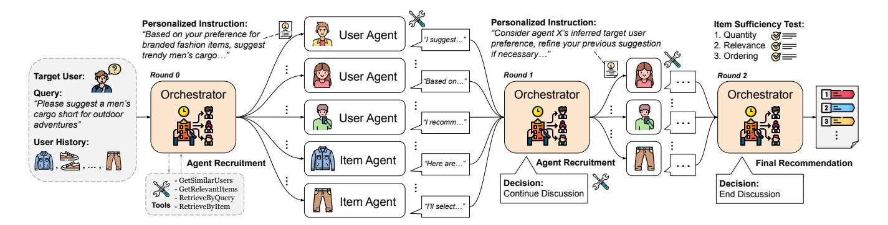
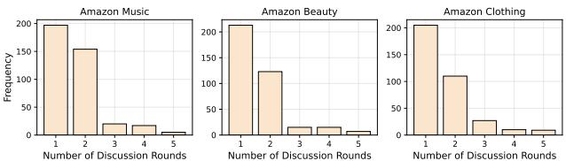
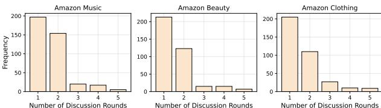

# Multi-Agent Collaborative Filtering: Orchestrating Users and Items for Agentic Recommendations

Yu Xia University of California, San Diego La Jolla, CA, USA yux078@ucsd.edu

Sungchul Kim Adobe Research San Jose, CA, USA sukim@adobe.com

Tong Yu Adobe Research San Jose, CA, USA tyu@adobe.com

Ryan A. Rossi Adobe Research San Jose, CA, USA ryrossi@adobe.com

Julian McAuley University of California, San Diego La Jolla, CA, USA jmcauley@ucsd.edu

# Abstract

Agentic recommendations cast recommenders as large language model (LLM) agents that can plan, reason, use tools, and interact with users of varying preferences in web applications. However, most existing agentic recommender systems focus on generic singleagent plan-execute workflows or multi-agent task decomposition pipelines. Without recommendation-oriented design, they often underuse the collaborative signals in the user–item interaction history, leading to unsatisfying recommendation results. To address this, we propose the Multi-Agent Collaborative Filtering (MACF) framework for agentic recommendations, drawing an analogy between traditional collaborative filtering algorithms and LLM-based multiagent collaboration. Specifically, given a target user and query, we instantiate similar users and relevant items as LLM agents with unique profiles. Each agent is able to call retrieval tools, suggest candidate items, and interact with other agents. Different from the static preference aggregation in traditional collaborative filtering, MACF employs a central orchestrator agent to adaptively manage the collaboration between user and item agents via dynamic agent recruitment and personalized collaboration instruction. Experimental results on datasets from three different domains show the advantages of our MACF framework compared to strong agentic recommendation baselines.

# CCS Concepts

• Information systems → Recommender systems.

# Keywords

Agentic Recommendation, LLM-based Multi-Agent System

#### ACM Reference Format:

Yu Xia, Sungchul Kim, Tong Yu, Ryan A. Rossi, and Julian McAuley. 2026. Multi-Agent Collaborative Filtering: Orchestrating Users and Items for Agentic Recommendations. In Proceedings of the ACM Web Conference 2026 (WWW '26), April 13–17, 2026, Dubai, United Arab Emirates. ACM, New York, NY, USA, [4](#page-3-0) pages.<https://doi.org/10.1145/3774904.3792931>

[This work is licensed under a Creative Commons Attribution 4.0 International License.](https://creativecommons.org/licenses/by/4.0) WWW '26, Dubai, United Arab Emirates © 2026 Copyright held by the owner/author(s). ACM ISBN 979-8-4007-2307-0/2026/04 <https://doi.org/10.1145/3774904.3792931>

# 1 Introduction

Recommender systems are shifting from static predictors toward interactive agents. Recent agentic recommenders in web applications, such as online shopping assistants and movie finders, cast the system as a large language model (LLM) agent that can plan, reason, call tools, and interact with users [\[2,](#page-3-1) [11\]](#page-3-2). These systems usually follow one of two patterns. The first uses a single LLM agent in a plan–and–execute loop [\[3,](#page-3-3) [12\]](#page-3-4) that reasons step-wise and calls retrieval or recommendation tools but still acts as a single decisionmaker, making it hard to draw on diverse preference signals [\[8\]](#page-3-5). The second organizes multiple LLM agents into task-decomposition pipelines with generic dialogue or planning roles [\[1,](#page-3-6) [10,](#page-3-7) [15\]](#page-3-8). These multi-agent designs introduce role specialization and coordination, but their roles are loosely tied to preference signal sources such as similar users or relevant items. Thus, while these approaches improve interactivity and tool use, they lack an effective way to bring collaborative signals into the agentic recommendation process.

As the foundation for many modern recommender systems, collaborative filtering (CF) has long shown that similar users and relevant items hold strong predictive value [\[6,](#page-3-9) [7,](#page-3-10) [13\]](#page-3-11). Recent AgentCF [\[16\]](#page-3-12) extends this idea by modeling users and items as LLM agents that interact under logged user–item histories for behavior simulation. Despite these advances, most LLM-based agentic recommenders still treat user–item histories only as context in prompts and do not structure or combine neighborhood evidence as CF does. As a result, they struggle to take advantage of the collaborative signals during recommendation, especially when similar users and correlated items provide complementary information.

To address this, we propose Multi-Agent Collaborative Filtering (MACF), which draws an analogy between traditional CF and LLMbased multi-agent collaboration. Instead of using a single agent or generic multi-agent roles, MACF instantiates user agents and item agents that correspond to similar users and relevant items in the target user's history. Each agent is initialized with a profile containing user information or item attributes, and can call retrieval tools, suggest candidate items, and exchange messages with other agents. A central orchestrator is employed to manage a multi-round discussion between user and item agents. It dynamically selects which agents should participate in each round and issuing personalized instructions for each agent that shape how they contribute to the discussion. This setup allows the system to draw on complementary evidence from neighborhoods on both the user and item side, refine

Figure 1: Overview of our MACF workflow illustrated with a product recommendation example from Amazon Clothing.

candidates through agent communication, and surface agreements or conflicts that would be missed by fixed aggregation rules. In this way, MACF leverages collaborative signals from user–item history in a structured way and produces recommendations with clear reasoning. We evaluate MACF on three datasets from different domains, where it shows consistent improvements over strong agentic recommendation baselines, validating the advantages of our agentic collaborative filtering framework. In summary, we make the following contributions:

- We propose MACF, an agentic recommendation framework that draws an analogy between traditional collaborative filtering and LLM-based multi-agent collaboration.
- We develop a dynamic orchestration mechanism that manages user and item agents across multiple rounds with personalized instructions, allowing MACF to aggregate collaborative signals in a structured and adaptive manner.
- Experimental results demonstrate the advantage of our proposed MACF with consistent improvements over strong baselines on three datasets from different domains.

### 2 Methodology

In this section, we introduce our MACF framework as illustrated in Figure [1,](#page-1-0) which bridges traditional collaborative filtering and LLM-based multi-agent collaboration for agentic recommendation.

# 2.1 Problem Definition

Let U and I denote the sets of users and items. Each user�� ∈ U has an interaction history ���� = ⟨��1, . . . ,����⟩, represented as an ordered list of items. Given a natural-language user query ��, the task is to produce a ranked list ��ˆ ��,�� = ⟨��1, . . . ,���� ⟩ that reflects both the shortterm user intent in �� and the long-term user preferences expressed in ����. We assume access to the following retrieval utilities:

- GetSimilarUsers(��, ��) returns a set N�� of �� users whose preferences are most similar to the target user ��;
- GetRelevantItems(��, ��, ��) returns a subset H��,�� containing up to �� items from ���� that are most relevant to the user query ��;
- RetrieveByQuery(��, ��) retrieves �� items whose embeddings are most similar to the user query ��;
- RetrieveByItem(��, ��) retrieves �� items whose embeddings are most similar to a given item ��.

These utilities are exposed to all MACF agents as callable tools T.

## 2.2 Agents Instantiation

MACF instantiates two types of recommendation agents, user agents and item agents, that mirror the collaborative filtering structure, together with an orchestrator agent that coordinates their interaction for a given target user ��, query ��, and user history ����.

User Agents. A user agent �� user is instantiated for each selected similar user �� ∈ N��. Each agent is initialized with a compact profile summarizing the user's preference pattern and interaction history, along with the target user information. From its own perspective, the user agent reasons about how the target user �� may align with itself, identifies which aspects of the target user's preference are most informative for the query ��, and prepares to suggest or critique items. When needed, it calls retrieval tools in T to search for items that match the inferred preferences or a strong anchor item.

Item Agents. An item agent �� item �� is instantiated for each selected query-relevant history item �� ∈ H��,�� from target user history. Each agent is initialized with a compact profile of the item attributes and metadata. Given the target user information, the item agent reasons about why the target user �� previously interacted with item �� and how this evidence relates to the current user intent expressed in the query ��. It can optionally call retrieval tools in T to retrieve items closely related to itself or to broaden the search using the query when it provides more informative guidance.

Orchestrator Agent. The orchestrator agent �� orc controls how user and item agents are instantiated and coordinated across a multi-round discussion. Given the target user information, the orchestrator agent first calls tools T to select which similar users and relevant items to be instantiated as user agents �� user and item agents �� item. It then issues concise, personalized instructions for each agent that define their task in the current round. Across rounds, the orchestrator continues to decide whether to continue the discussion, which agents remain active, how they are instructed, and how their suggestions and messages are aggregated into an evolving ranked list for the final recommendation. We describe the detailed orchestration mechanism in Section [2.3.](#page-2-0)

#### 2.3 Multi-Agent Collaborative Filtering

MACF runs a coordinated multi-agent discussion over rounds �� = 0, 1, . . . ,��max. Each round produces agent messages and item candidates with rationales, together with a draft ranked list ��ˆ . The design mirrors collaborative filtering in language form: user agents bring preference evidence from similar users, item agents expand around history items, and the orchestrator adapts the mix to the target query �� through targeted coordination decisions.

Dynamic Agent Recruitment. At the beginning of the discussion �� = 0, the orchestrator agent �� orc calls the retrieval tools in T to select a set of similar users and query-relevant history items given target user ��, query ��, and user history ����:

N�� = GetSimilarUsers(��, ��), H��,�� = GetRelevantItems(��, ��, ��).

It further filters these sets by relevance to the query �� and instantiates user agents �� user and item agents �� item from the selected elements. This step grounds MACF's agent population directly in collaborative signals rather than in generic role templates.

Personalized Collaboration Instruction. Once the agent set A = �� user ∪ �� item is chosen, the orchestrator issues personalized instructions to each agent �� ∈ A. These instructions describe the agent's task in the current round ��, such as proposing new candidates, refining earlier suggestions, resolving conflicts, or examining low-relevance items in the current draft of ranked list ��ˆ . Instructions depend on each agent's unique profile, target user information, and the state of the draft ranked list, which ensures that different agents contribute complementary forms of evidence. For example, user agents highlight neighborhood preference patterns from N��, while item agents trace relevance paths from the user history H��.

User–Item Collaboration Orchestration. For each discussion round �� ≥ 1, the orchestrator agent �� orc begins by drafting a ranked list ��ˆ �� of size �� from currently accumulated candidates and rationales from all agents. It then applies a sufficiency test on ��ˆ �� that requires: (i) at least �� unique items with clear relevance to the query �� and the inferred preference; (ii) item-level alignment with the rationales provided by agents; and (iii) a clear ordering by relevance. If all conditions are met or �� =��max, the discussion terminates and ��ˆ �� becomes the final ranked list.

If the sufficiency test is not satisfied and �� &lt; ��max, the discussion continues. The orchestrator agent �� orc then selects a subset of agents A�� ⊆ A whose perspectives are most useful for improving ��ˆ , and issues updated collaboration instructions for each agent tailored to the sources of remaining uncertainty, such as resolving ties and conflicts or replacing low-relevance items. Given these instructions, user agents �� user refine or contest items using preference evidence drawn from their similar-user viewpoint in N�� as well as optional additional tool calling. Item agents likewise expand around strong anchors in H�� using RetrieveByItem(��, ��) or adjust off-topic entries by invoking RetrieveByQuery(��, ��) to find more query-aligned alternatives. Each agent also observes the full multi-agent discussion history and can use this shared context to support, critique, or counter earlier arguments, which allows MACF to combine the strengths of user-based CF and item-based CF in a single coordinated process through language-guided interaction.

Table 1: Main results of all compared methods across datasets.

| Methods         | Amazon H@10 | Clothing N@10 | Amazon H@10 | Beauty N@10 | Amazon H@10 | Music N@10 |
|-----------------|-------------|---------------|-------------|-------------|-------------|------------|
| BM25            | 0.0801      | 0.2543        | 0.2171      | 0.4546      | 0.1628      | 0.3336     |
| BGE-M3          | 0.3103      | 0.4356        | 0.2694      | 0.4889      | 0.1187      | 0.2947     |
| BGE-Reranker    | 0.2970      | 0.5031        | 0.2980      | 0.4946      | 0.1763      | 0.3516     |
| ItemCF          | 0.3804      | 0.6258        | 0.3199      | 0.5141      | 0.3106      | 0.5105     |
| UserCF          | 0.3687      | 0.5926        | 0.3037      | 0.4998      | 0.2988      | 0.4780     |
| ReAct           | 0.4217      | 0.6912        | 0.3921      | 0.6012      | 0.2323      | 0.4012     |
| Reflexion       | 0.4218      | 0.7002        | 0.4001      | 0.6203      | 0.3234      | 0.4900     |
| InteRecAgent    | 0.4207      | 0.7035        | 0.3919      | 0.6136      | 0.2919      | 0.4585     |
| MACRec          | 0.4205      | 0.6846        | 0.3834      | 0.5999      | 0.2634      | 0.4876     |
| MACRS           | 0.3871      | 0.6441        | 0.3156      | 0.5399      | 0.2348      | 0.4769     |
| TAIRA           | 0.4447      | 0.7182        | 0.4655      | 0.7520      | 0.3519      | 0.5540     |
| MACF item-based | 0.4363      | 0.7963        | 0.5027      | 0.8179      | 0.5088      | 0.7614     |
| MACF user-based | 0.5134      | 0.7927        | 0.5368      | 0.8244      | 0.5134      | 0.7574     |
| MACF            | 0.5238      | 0.7942        | 0.5421      | 0.8215      | 0.5450      | 0.7668     |

Final Recommendation. When the sufficiency test is satisfied or the round limit ��max is reached, the discussion terminates and the most recent draft list ��ˆ �� becomes the final recommendation ��ˆ ��,��. This list is generated directly by the orchestrator agent �� orc , which consolidates all item candidates and rationales collected across rounds from all user and item agents and produces the final ordering through its drafting and re-ranking steps.

# 3 Experiments

# 3.1 Experimental Setup

Datasets and Metrics. We evaluate our method on the three Amazon datasets: Clothing, Beauty, and Music [\[5\]](#page-3-13). We adopt the same user simulator-driven evaluation protocol as in [\[15\]](#page-3-8) to measure the recommendation quality. H@10 (HitRatio@10) measures how often relevant items appear in the top-10 positions of the recommendation list. N@10 (NDCG@10) evaluates the ranking quality of top-10 items in the recommendation list. We adopt the same data splits and natural language query sets as in Yu et al. [\[15\]](#page-3-8).

Baselines and Variants. We compare MACF against three types of baselines. Retrieval-based recommenders include BM25, BGE-M3, and BGE-Reranker [\[4\]](#page-3-14). Traditional collaborative filtering baselines include ItemCF [\[7\]](#page-3-10) and UserCF [\[6\]](#page-3-9) which are slightly adapted to consider user query via embedding-based reranking of CF results. We also compare recent single-agent and multi-agent agentic recommenders including ReAct [\[14\]](#page-3-15), Reflexion [\[9\]](#page-3-16), InteRecAgent [\[3\]](#page-3-3), MACRec [\[10\]](#page-3-7), MACRS [\[1\]](#page-3-6), and TAIRA [\[15\]](#page-3-8). For our method, besides MACF with user-item collaboration as described in Section [2.3,](#page-2-0) we also report the results of two variants: MACFuser-based instantiating only user agents for multi-agent collaboration and similarly MACFitem-based with only item agents.

Implementation Details. We implement the orchestrator agent, user agents, and item agents as MCP services using asynchronous HTTP stream transport with all retrieval utilities in T provided as MCP tools. All agents share the backbone LLM of gpt-4o with temperature 0.3. The input arguments for retrieval tools are defaulted to �� = 5 and �� = 15, but agents may adaptively override them when calling the tools. All embeddings as required by tools are computed with BGE-M3 model [\[4\]](#page-3-14) for fair comparison of all

Table 2: Ablation studies of different modules in MACF

Figure 2: Distributions of MACF discussion rounds.

methods. The maximum number of discussion rounds ��max is set to 5. The number of items in the targeted ranked list �� is set to 10.

### 3.2 Results

Main Results. As presented in Table [1,](#page-2-1) across all three domains, MACF delivers clear gains over retrieval, CF-based, and agentic baselines. On Clothing, MACF achieves the best hit rate while maintaining strong ranking quality. On Beauty, it again reaches the highest hit rate and stays competitive at the top for NDCG@10. On Music, MACF leads on both metrics, reflecting its ability to combine neighborhood signals and history-based reasoning across different domains. The user-only and item-only variants also perform strongly. MACFuser-based shows competitive hit rates across domains, while MACFitem-based produces high NDCG@10 scores, especially on Clothing and Beauty. These results highlight that grounding agents in collaborative filtering signals and guiding their interaction through the orchestrator consistently improves relevance and ranking accuracy.

Ablation Studies. We report in Table [2](#page-3-17) performances of MACF after removing each key module. From the results, we observe that disabling personalized collaboration instruction (PCI) or dynamic agent recruitment (DAR) reduces both HR@10 and NDCG@10 across datasets, verifying the value of structured agent selection and targeted guidance in our orchestrator agent design. Turning off adaptive tool use (ATU), where each agent only call tools once at the beginning, also leads significant degradation, especially on Music, where relevant anchors vary more across user histories. These results further confirm the validity of our agent designs and dynamic orchestration mechanism for MACF.

Additional Analysis. To further understand the behavior of MACF during multi-agent discussion, we show in Figure [2](#page-3-18) the distribution of discussion rounds across three datasets. We observe that most queries finish before the third round, with very few cases reaching the set maximum of five rounds. This indicates that our designed sufficiency test in collaboration orchestration is effective at identifying when the ranked list is ready to be recommended to the user, preventing unnecessary interaction and reducing extra cost.

#### 4 Conclusion

In this paper, we present Multi-Agent Collaborative Filtering (MACF), an agentic recommendation framework that grounds LLM-based multi-agent collaboration in collaborative filtering signals. By instantiating similar users and relevant items as LLM agents and coordinating them with a central orchestrator, MACF turns user–item evidence into an interactive, query-aware multi-agent discussion that yields stronger recommendations. Experiments on three datasets show consistent gains over traditional recommenders and strong agentic recommendation baselines, highlighting the potential of agentic modeling for future recommender systems.

#### Acknowledgement

This work is partially supported by NSF IIS-2432486.

### References

[1] Jiabao Fang, Shen Gao, Pengjie Ren, Xiuying Chen, Suzan Verberne, and Zhaochun Ren. 2024. A multi-agent conversational recommender system. arXiv:2402.01135 (2024). [2] Chengkai Huang, Junda Wu, Yu Xia, Zixu Yu, Ruhan Wang, Tong Yu, Ruiyi Zhang, Ryan A Rossi, Branislav Kveton, et al. 2025. Towards agentic recommender systems in the era of multimodal large language models. arXiv:2503.16734 (2025). [3] Xu Huang, Jianxun Lian, Yuxuan Lei, Jing Yao, Defu Lian, and Xing Xie. 2025. Recommender ai agent: Integrating large language models for interactive recommendations. ACM Transactions on Information Systems 43, 4 (2025), 1–33. [4] Chaofan Li, Zheng Liu, Shitao Xiao, and Yingxia Shao. 2023. Making large language models a better foundation for dense retrieval. arXiv:2312.15503 (2023). [5] Julian McAuley, Christopher Targett, Qinfeng Shi, and Anton Van Den Hengel. 2015. Image-based recommendations on styles and substitutes. In Proceedings of the 38th international ACM SIGIR conference on research and development in information retrieval. 43–52. [6] Paul Resnick, Neophytos Iacovou, Mitesh Suchak, Peter Bergstrom, and John Riedl. 1994. Grouplens: An open architecture for collaborative filtering of netnews. In Proceedings of the 1994 ACM conference on Computer supported cooperative work. 175–186. [7] Badrul Sarwar, George Karypis, Joseph Konstan, and John Riedl. 2001. Item-based collaborative filtering recommendation algorithms. In Proceedings of the 10th international conference on World Wide Web. 285–295. [8] Yiran Shen, Yu Xia, Jonathan Chang, and Prithviraj Ammanabrolu. 2025. Simultaneous Multi-objective Alignment Across Verifiable and Non-verifiable Rewards. arXiv:2510.01167 (2025). [9] Noah Shinn, Federico Cassano, Ashwin Gopinath, Karthik Narasimhan, and Shunyu Yao. 2023. Reflexion: Language agents with verbal reinforcement learning. Advances in Neural Information Processing Systems 36 (2023), 8634–8652. [10] Zhefan Wang, Yuanqing Yu, Wendi Zheng, Weizhi Ma, and Min Zhang. 2024. Macrec: A multi-agent collaboration framework for recommendation. In Proceedings of the 47th International ACM SIGIR Conference on Research and Development in Information Retrieval. 2760–2764. [11] Yu Xia, Subhojyoti Mukherjee, Zhouhang Xie, Junda Wu, Xintong Li, Ryan Aponte, Hanjia Lyu, et al. 2025. From selection to generation: A survey of llmbased active learning. In Proceedings of the 63rd Annual Meeting of the Association for Computational Linguistics (Volume 1: Long Papers). 14552–14569. [12] Yu Xia, Yiran Shen, Junda Wu, Tong Yu, Sungchul Kim, Ryan A Rossi, Lina Yao, and Julian McAuley. 2025. Sand: Boosting llm agents with self-taught action deliberation. In Proceedings of the 2025 Conference on Empirical Methods in Natural Language Processing. 3062–3077. [13] Yu Xia, Junda Wu, Tong Yu, Sungchul Kim, Ryan A Rossi, and Shuai Li. 2023. User-regulation deconfounded conversational recommender system with bandit feedback. In Proceedings of the 29th ACM SIGKDD conference on knowledge discovery and data mining. 2694–2704. [14] Shunyu Yao, Jeffrey Zhao, Dian Yu, Nan Du, Izhak Shafran, Karthik R Narasimhan, and Yuan Cao. 2023. ReAct: Synergizing Reasoning and Acting in Language Models. In The Eleventh International Conference on Learning Representations. [https://openreview.net/forum?id=WE\\_vluYUL-X](https://openreview.net/forum?id=WE_vluYUL-X) [15] Haocheng Yu, Yaxiong Wu, Hao Wang, Wei Guo, Yong Liu, Yawen Li, Yuyang Ye, Junping Du, and Enhong Chen. 2025. Thought-Augmented Planning for LLM-Powered Interactive Recommender Agent. arXiv:2506.23485 (2025). [16] Junjie Zhang, Yupeng Hou, Ruobing Xie, Wenqi Sun, Julian McAuley, Wayne Xin Zhao, Leyu Lin, and Ji-Rong Wen. 2024. Agentcf: Collaborative learning with autonomous language agents for recommender systems. In Proceedings of the ACM Web Conference 2024. 3679–3689.