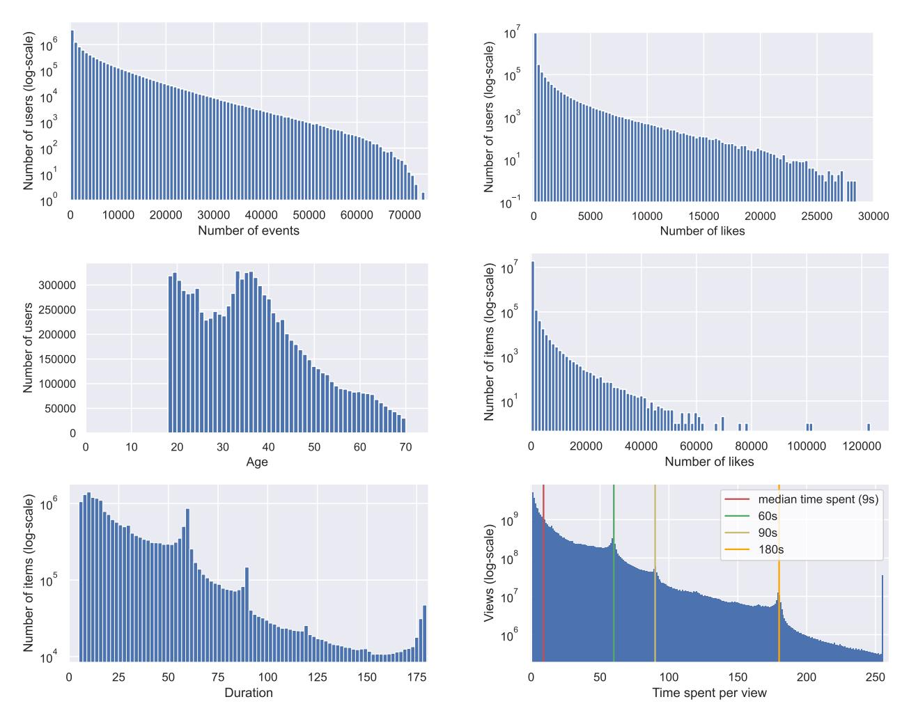
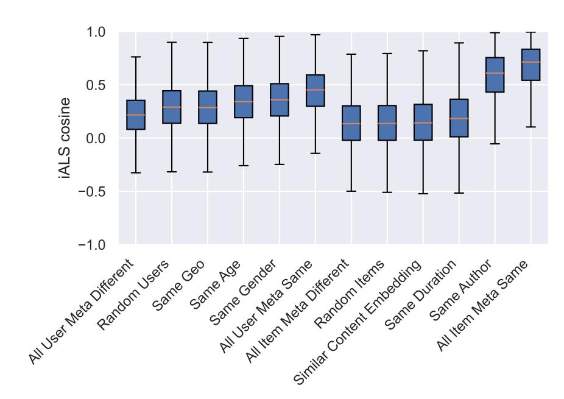

# VK-LSVD: A LARGE-SCALE INDUSTRIAL DATASET FOR SHORT-VIDEO RECOMMENDATION

[Aleksandr Poslavsky](https://orcid.org/0009-0009-5271-6696) B VK AI VK Moscow, Russia dr.slink@vk.com

[Alexander D'yakonov](https://orcid.org/0000-0001-7934-6538) VK AI VK Moscow, Russia djakonov@mail.ru [Andrey Zimovnov](https://orcid.org/0000-0001-6763-5797) VK AI VK Moscow, Russia a.zimovnov@vkteam.ru

[Yuriy Dorn](https://orcid.org/0000-0003-0533-3018) AI Center & IAI MSU Lomonosov Moscow State University Moscow, Russia dornyv@my.msu.ru

### ABSTRACT

Short-video recommendation presents unique challenges, such as modeling rapid user interest shifts from implicit feedback, but progress is constrained by a lack of large-scale open datasets that reflect real-world platform dynamics. To bridge this gap, we introduce the VK Large Short-Video Dataset (VK-LSVD), the largest publicly available industrial dataset of its kind. VK-LSVD offers an unprecedented scale of over 40 billion interactions from 10 million users and almost 20 million videos over six months, alongside rich features including content embeddings, diverse feedback signals, and contextual metadata. Our analysis supports the dataset's quality and diversity. The dataset's immediate impact is confirmed by its central role in the live VK RecSys Challenge 2025. VK-LSVD provides a vital, open dataset to use in building realistic benchmarks to accelerate research in sequential recommendation, cold-start scenarios, and next-generation recommender systems.[1](#page-0-0)

*K*eywords Recommender Systems · Industrial Dataset · Short-Video

# 1 Introduction

The rapid expansion of short-video platforms has fundamentally transformed digital content consumption, characterized by frequent, session-based user interactions. Designing effective recommender systems for this domain presents unique challenges, including a reliance on *implicit feedback* (e.g., watch time) as primary signals of user preference and the need to model complex, rapidly evolving user behaviors in conjunction with multi-modal content. Progress is further limited by the scarcity of large-scale, open datasets that faithfully reflect the dynamics and complexity of real-world platforms. Existing public datasets are typically constrained by limited scale, temporal coverage, or feedback diversity, impeding the transfer of academic advances to industrial settings.

To address this gap, we introduce the VK Large Short-Video Dataset (VK-LSVD) [\[1\]](#page-5-0), the largest publicly available industrial dataset for short-video recommendation. VK-LSVD is distinguished by its comprehensive feature set, encompassing content-based video embeddings, user socio-demographics, and a wide range of implicit (e.g., watch time), explicit (e.g., likes, dislikes), viral (e.g., shares), and deeper engagement (e.g., comment opens) feedback signals, thus enabling holistic analysis of user behavior. VK-LSVD provides key contextual metadata for each interaction, including consumption context (e.g., feed or search), user platform (e.g., Android, Web), and client agent. Its longitudinal structure and strict global temporal split facilitate robust research on the evolution of user preferences

1Accepted to The ACM Web Conference 2026 (WWW '26). This is a pre-print version; the final version will appear in the conference proceedings.

Table 1: Comparison of Modern Short-Video Recommendation Datasets

| Dataset   |         | Platform,     | Year            | Users |   | Items |       | Interactions |         | Temporal | Scope  |
|-----------|---------|---------------|-----------------|-------|---|-------|-------|--------------|---------|----------|--------|
| VK-LSVD   | (Ours)  | VK,           | 2025            | 10    | M | 20    | M     | 40           | B       | 6        | months |
| Tsinghua  | U [4]   | Kuaishou,     | 2025            | 10    | K | 153.6 | K     | 1            | M       | 6        | months |
| RecFlow   | [5]     | Kuaishou,     | 2024            | 42    | K | 82 M  | + 9 M | 38 M         | + 1.9 B | 37       | days   |
| NineRec   | [6]     | Bili, KU, QB, | TN, DY, 2024    | 2     | M | 144   | K     | 24.5         | M       | 10       | months |
| MovieLens | 32M [3] | MovieLens,    | 2024            | 200.9 | K | 87.5  | K     | 32 M         | + 2 M   | 28       | years  |
| MicroLens | [7]     | Micro-video   | platform, 2023  | 34.5  | M | 1.14  | M     | 1            | B       |          | 1 year |
| KuaiSAR   | [8]     | Kuaishou,     | 2023            | 25.9  | K | 6.9   | M     | 19.7         | M       | 19       | days   |
| REASONER  | [9]     | Custom,       | 2023            | 3     | K | 4.7   | K     | 58.5         | K       |          |        |
| KuaiRand  | [10]    | Kuaishou,     | 2022            | 27    | K | 32    | M     | 322.3        | M       | 2+2      | weeks  |
| KuaiRec   | [11]    | Kuaishou,     | 2022            | 7.2   | K | 10.7  | K     | 12.5         | M       | 2        | months |
| Tenrec    | [12]    | 2 anonymized  | platforms, 2022 | 5     | M | 3.75  | M     | 142.3        | M       | 3        | months |

and item popularity. Additionally, VK-LSVD allows researchers to generate custom subsets based on user activity or item popularity, tailored to specific computational or research requirements.

Through data analysis, we validate the dataset's quality and diversity. Unlike audio content, short videos require active user attention, making every interaction – whether a full watch or a skip – a valuable signal for user modeling. VK-LSVD enables the study of these behaviors at an unprecedented scale.

In summary, our contributions are: (1) the introduction of VK-LSVD, (2) a statistical analysis and technical validation of the dataset, (3) a demonstration of its real-world impact as the core dataset for a major recommendation competition.

# 2 Related Work

Public datasets are crucial for recommender systems research, and classics like Netflix Prize [\[2\]](#page-5-10) and MovieLens [\[3\]](#page-5-4) are widely used. However, they offer interactions with limited side information, lacking the sequential nature, high interaction frequency, and multi-modality of modern short-video platforms.

#### 2.1 Emerging Short-Video Datasets

Several Kuaishou-derived datasets address specific needs: KuaiRand [\[10\]](#page-5-8) enables unbiased evaluation; KuaiRec [\[11\]](#page-5-9) offers a near-complete matrix (99.6% density) with rich side information; KuaiSAR [\[8\]](#page-5-6) integrates search and recommendation behaviors. However, all have limited user scale (up to tens of thousands, see Tab. [1\)](#page-1-0) and short observation periods (weeks to months), restricting long-term analysis.

The large-scale MicroLens [\[7\]](#page-5-5) offers raw multi-modal content for end-to-end training but lacks feedback diversity (only comments), global timeline, and uses web-scraped data. The dataset from a Tsinghua University team [\[4\]](#page-5-1) integrates user behavior, attributes, and raw video content but at small scale (~1M interactions).

#### 2.2 Large-Scale and Multi-Purpose Datasets

Beyond short-video specifics, Tenrec [\[12\]](#page-6-0) supports cross-domain learning with diverse feedback and true negatives, but lacks raw content. NineRec [\[6\]](#page-5-3) enables transfer learning via multimodal content across domains, yet has moderate scale, lacks watch time signals, and contains potential biases.

Recent datasets target specialized aspects like interpretation or pipeline consistency. REASONER [\[9\]](#page-5-7) provides labeled explanations but is small-scale. RecFlow [\[5\]](#page-5-2) supports full-pipeline research with unexposed items, yet has limited users (∼42K), short duration (37 days), and no multi-modal content.

The emergence of large-scale datasets in different domains over the past year highlights the need for more valuable data. The large-scale Yambda-5B [\[13\]](#page-6-1) with 4.79 billion interactions focuses on music recommendation with audio embeddings. The largest T-ECD [\[14\]](#page-6-2) dataset (135 billion cross-domain interactions) offers synthetic e-commerce data for cross-domain learning, but its artificial nature limits real-world applicability, and it does not encompass the short-video format.

Table [1](#page-1-0) reveals a concentration of existing datasets on the Kuaishou platform. To address this lack of platform diversity, we present a novel large-scale dataset from a new ecosystem.

## 3 Dataset Description

This section provides a comprehensive technical description of VK-LSVD's structure, schema, and key statistics to facilitate its use in recommender systems research.

#### 3.1 Data Collection and Ethics

VK-LSVD is constructed from anonymized interaction logs of the short-video service within VK (the largest social media ecosystems in Russia) – a high-concurrency environment where users typically engage with dozens of clips per session.

Anonymization. All identifiers ( user\_id, item\_id, author\_id) and categorical context features (place, platform, agent, geo) - are irreversibly anonymized into stable integer IDs. No mapping to the original entities is provided, and all personally identifiable information (PII) has been removed.

Ethical Considerations. The collection and anonymization processes were designed in compliance with the platform's privacy policy and relevant data protection regulations. No raw video, audio, or text content is included. The provided embeddings are generated via proprietary models, ensuring that the original raw content cannot be reconstructed.

#### 3.2 Dataset Structure and Key Statistics

VK-LSVD comprises four core components, with complete data and no missing values across all tables:

Interaction Records (interactions/): A directory of weekly Parquet files (e.g., week\_XX.parquet) containing over 40B user-item exposure events, ordered chronologically, both across files and within each file. Each row represents a unique short-video exposure to a user, encompassing contextual metadata, user feedback signals (watch time, likes, etc.). The dataset employs a Global Temporal Split (GTS): the train (first 25 weeks, each stored as an individual file), validation (1 week), and test (1 week) subsets represent consecutive time periods. Each user-item pair in the dataset is unique, recording the parameters of the first interaction; however, the watch time is cumulative across all views, meaning watch time can exceed video duration due to rewatching, despite both being capped (Fig. [1\)](#page-4-0).

User Metadata (users\_metadata.parquet): Static demographic and behavioral features (age, gender and most frequent geographic location – 80 unique values) for 10M users, with activity-based sampling support.

Item Metadata (items\_metadata.parquet): Information for 20M videos including author ID and duration, with popularity-based sampling support.

Embeddings (item\_embeddings.npz): This file provides 64-dimensional content-based embeddings for each item. They were initially generated using a local model and subsequently compressed via truncated SVD. Components are ordered by importance to allow for flexible dimensionality trade-offs.

#### 3.3 Data Availability and Usage

The VK-LSVD dataset is publicly available on the Hugging Face Hub [\[1\]](#page-5-0) under the Apache License 2.0, permitting free use for academic and commercial research. To improve accessibility, we provide pre-configured subsets (e.g., ur0.01 for 1% of random users, ip0.01 for 1% of popular items) and utility scripts to create custom samples that match specific computational resources and research questions. For example, we evaluate simple recommendation methods on the ur0.01\_ir0.01-subset (Tab. [4\)](#page-3-0): Random baseline (high coverage but no predictive power), Global Popularity model (recommends the most frequently interacted-with items to all users), the Conversion-based model (optimized specifically for predicting click-through rates) and iALS (Implicit Alternating Least Squares – using watch time > 10 s as positive signal, [\[15\]](#page-6-3)).

The ongoing VK RecSys Challenge 2025, based on this dataset, [\[16\]](#page-6-4) demonstrates VK-LSVD's practical impact. With nearly 800 participants, it tackles a non-standard task: ranking users for new items rather than items for users. Participants are required to predict the top 100 most relevant users for each new, cold-start video, with real-world constraints (max 100 recommendations per user). Evaluation uses NDCG@100 per clip. Results, expected in January 2026, will advance cold-start methods and establish a robust benchmark for sequential and content-based models.

Table 2: Schema of VK-LSVD

| Field                   | Type                      | Description |               |                   |
|-------------------------|---------------------------|-------------|---------------|-------------------|
| user_id, item_id        | uint32                    | Anonymous   |               | IDs               |
| place, platform,        | agent uint8               | Context     | (feed/search, | OS, client)       |
| timespent               | uint8                     | Watch       | time          | (capped at 255s)  |
| like, dislike,          | share, bookmark bool      | Feedbacks   |               |                   |
| click_on_author         | bool                      | Author      | profile       | clicked           |
| open_comments           | bool                      | Comments    |               | opened            |
| Users Metadata          |                           | (user_id    | as            | above)            |
| age                     | uint8                     | Age         | (18-70)       |                   |
| gender, geo             | uint8                     | Gender      | and           | location          |
| train_interactions_rank | uint32                    | Popularity  |               | rank for sampling |
| Items Metadata          | (train_interactions_rank, | item and    | user ids      | as above)         |
| duration                | uint8                     | Duration    | (seconds)     |                   |
| Embeddings              |                           | (item_id    | as            | above)            |
| embedding               | float16[64]               | Content     | embedding     | vector            |

Table 3: Core Statistics of VK-LSVD

| Statistic |            |              | Value             |
|-----------|------------|--------------|-------------------|
| Data      | Collection | Period       | 6 months          |
| Number    | of         | Users        | 10,000,000        |
| Number    | of         | Items        | 19,627,601        |
| Number    | of         | Interactions | 40,774,024,903    |
| Total     | Watch      | Time         | 858,160,100,084 s |
| Dataset   | Density    |              | 0.0208%           |
| Feedback  |            | Type         |                   |
| Number    | of         | Likes        | 1,171,423,458     |
| Number    | of         | Dislikes     | 11,860,138        |
| Number    | of         | Shares       | 262,734,328       |
| Number    | of         | Bookmarks    | 40,124,463        |
| Clicks    | on Author  |              | 84,632,666        |
| Comment   |            | Opens        | 481,251,593       |

Table 4: Benchmark of Simple Recommendation Algorithms

| Metrics  | Random      | Popular Global Temporal | Conversion Split | iALS    |
|----------|-------------|-------------------------|------------------|---------|
| Coverage | 0.96449     | 0.00010                 | 0.00010          | 0.00501 |
| ROC      | AUC 0.50003 | 0.57383                 | 0.60341          | 0.58126 |
| NDCG@20  | 0.00006     | 0.00244                 | 0.00000          | 0.02623 |
|          |             | Random                  | Split            |         |
| Coverage | 0.97551     | 0.00010                 | 0.00010          | 0.00511 |
| ROC      | AUC 0.50216 | 0.58999                 | 0.68107          | 0.61649 |
| NDCG@20  | 0.00003     | 0.02183                 | 0.00000          | 0.06554 |

#### 3.4 Data Analysis

The distribution of user activity exhibits a highly skewed, heavy-tailed pattern typical of real-world online platforms (Fig. [1\)](#page-4-0): most users generate few viewing events and likes, while a small fraction of "power users" accounts for most engagement. Item popularity shows a similar heavy-tailed pattern: a small fraction of items receives the majority of user interactions.

To assess VK-LSVD's utility, we conducted a pairwise similarity analysis using iALS representations [\[15\]](#page-6-3), trained with a positive target defined as the presence of any positive interaction (like, comment open) and the absence of negative feedback (dislike). User pairs were grouped by demographics (age, gender, location), and item pairs by content features (author, duration, content clusters derived via k-means clustering on the provided 64-D embeddings). For each group, 10,000 pairs were sampled, and their cosine similarity was computed; random and dissimilar pairs served as

Figure 1: Distributions of Key User and Item Statistics.

baselines. Results (Fig. [2\)](#page-5-11) show demographic factors (gender, age) strongly influence user similarity, while the author drives item similarity (0.58). The high similarity for items sharing all metadata (0.66) confirms the dataset captures rich content relationships. VK-LSVD enables models to discover meaningful user and content patterns from implicit behavior alone, validating its utility for real-world recommender systems.

# 4 Conclusion

We believe that VK-LSVD will serve as a valuable community resource and accelerate innovation in recommender systems. VK-LSVD is ideally suited for research in: sequential and session-based recommendation, next-item prediction, context-aware and hybrid recommendation, and the exploration of cold-start and long-tail scenarios.

The expected results of VK RecSys Challenge 2025 will provide an independent and robust evaluation of new approaches developed on VK-LSVD. Technical validation confirms the dataset's value, interaction patterns follow realistic powerlaw distributions. Furthermore, the provided subsets of the original dataset make it feasible to conduct initial experiments and prototyping on personal workstations, significantly lowering the computational barrier.

While offering demographic attributes, we acknowledge that these features may introduce algorithmic bias. We encourage researchers to use them not only to enhance model performance but also to investigate fairness-aware recommender systems and to mitigate potential disparate impacts across different user groups.[2](#page-4-1)

We thank VK platform users for their anonymized interaction data, and reaffirm our commitment to privacy protection. We acknowledge our colleagues, with special thanks to Dmitry Kondrashkin, Head of VK AI, for his guidance. This work was supported

Figure 2: Cosine Similarity Analysis of ALS Latent Factors Across User and Content Attributes

## References

[1] VK Team. VK-LSVD: Large Short-Video Dataset, 2025. URL [https://huggingface.co/datasets/deepvk/](https://huggingface.co/datasets/deepvk/VK-LSVD) [VK-LSVD](https://huggingface.co/datasets/deepvk/VK-LSVD). [2] James Bennett, Stan Lanning, et al. The netflix prize. In *Proceedings of KDD cup and workshop*, volume 2007, page 35. New York, 2007. [3] F. Maxwell Harper and Joseph A. Konstan. The movielens datasets: History and context. *ACM Transactions on Interactive Intelligent Systems*, 5(4):19:1–19:19, 2015. [4] Yu Shang, Chen Gao, Nian Li, and Yong Li. A large-scale dataset with behavior, attributes, and content of mobile short-video platform. *Proceedings of the ACM Web Conference*, pages 793–796, 2025. doi: 10.1145/3701716. 3715296. [5] Qi Liu, Kai Zheng, Rui Huang, Wuchao Li, Kuo Cai, Yuan Chai, Yanan Niu, Yiqun Hui, Bing Han, Na Mou, et al. Recflow: An industrial full flow recommendation dataset. *arXiv preprint arXiv:2410.20868*, 2024. [6] Jiaqi Zhang, Yu Cheng, Yongxin Ni, Yunzhu Pan, Zheng Yuan, Junchen Fu, Youhua Li, Jie Wang, and Fajie Yuan. Ninerec: A benchmark dataset suite for evaluating transferable recommendation. *IEEE Transactions on Pattern Analysis and Machine Intelligence*, 2024. [7] Yongxin Ni, Yu Cheng, Xiangyan Liu, Junchen Fu, Youhua Li, Xiangnan He, Yongfeng Zhang, and Fajie Yuan. A content-driven micro-video recommendation dataset at scale. *arXiv preprint arXiv:2309.15379*, 2023. [8] Zhongxiang Sun, Zihua Si, Xiaoxue Zang, Dewei Leng, Yanan Niu, Yang Song, Xiao Zhang, and Jun Xu. Kuaisar: A unified search and recommendation dataset. In *Proceedings of the 32nd ACM international conference on information and knowledge management*, pages 5407–5411, 2023. [9] Xu Chen, Jingsen Zhang, Lei Wang, Quanyu Dai, Zhenhua Dong, Ruiming Tang, Rui Zhang, Li Chen, and Ji-Rong Wen. REASONER: An explainable recommendation dataset with multi-aspect real user labeled ground truths toward more measurable explainable recommendation. *arXiv preprint arXiv:2303.00168*, 2023. [10] Chongming Gao, Shijun Li, Yuan Zhang, Jiawei Chen, Biao Li, Wenqiang Lei, Peng Jiang, and Xiangnan He. Kuairand: An unbiased sequential recommendation dataset with randomly exposed videos. In *Proceedings of the 31st ACM international conference on information & knowledge management*, pages 3953–3957, 2022. [11] Chongming Gao, Shijun Li, Wenqiang Lei, Jiawei Chen, Biao Li, Peng Jiang, Xiangnan He, Jiaxin Mao, and Tat-Seng Chua. Kuairec: A fully-observed dataset and insights for evaluating recommender systems. In *Proceedings of the 31st ACM International Conference on Information & Knowledge Management*, pages 540–550, 2022.

by The Ministry of Economic Development of the Russian Federation in accordance with the subsidy agreement (agreement identifier 000000C313925P4H0002; grant No 139-15-2025-012).

[12] Guanghu Yuan, Fajie Yuan, Yudong Li, Beibei Kong, Shujie Li, Lei Chen, Min Yang, Chenyun Yu, Bo Hu, Zang Li, et al. Tenrec: A large-scale multipurpose benchmark dataset for recommender systems. *Advances in Neural Information Processing Systems*, 35:11480–11493, 2022. [13] Alexander Ploshkin, Vladislav Tytskiy, Alexey Pismenny, Vladimir Baikalov, Evgeny Taychinov, Artem Permiakov, Daniil Burlakov, and Eugene Krofto. Yambda-5B—A Large-Scale Multi-Modal Dataset for Ranking and Retrieval. In *Proceedings of the Nineteenth ACM Conference on Recommender Systems*, pages 894–901, 2025. [14] T-Tech. T-ECD: T-Tech E-commerce Cross-Domain Dataset, 2025. URL [https://huggingface.co/](https://huggingface.co/datasets/t-tech/T-ECD) [datasets/t-tech/T-ECD](https://huggingface.co/datasets/t-tech/T-ECD). [15] Steffen Rendle, Walid Krichene, Li Zhang, and Yehuda Koren. Revisiting the performance of ials on item recommendation benchmarks. In *Proceedings of the 16th ACM Conference on Recommender Systems*, pages 427–435, 2022. [16] ODS Team. VK RecSys Challenge LSVD 2025, 2025. URL [https://ods.ai/competitions/](https://ods.ai/competitions/vkrecsyschallengelsvd) [vkrecsyschallengelsvd](https://ods.ai/competitions/vkrecsyschallengelsvd).