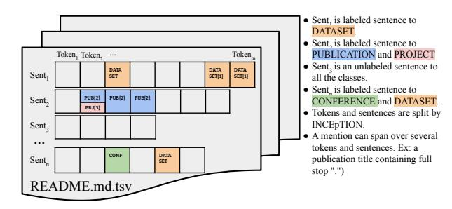
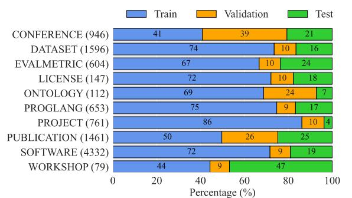

# NERdME: a Named Entity Recognition Dataset for Indexing Research Artifacts in Code Repositories

[Genet Asefa Gesese](https://orcid.org/0000-0003-3807-7145)∗ FIZ Karlsruhe Eggenstein-Leopoldshafen, Germany Karlsruhe Institute of Technology Karlsruhe, Germany

[Zongxiong Chen](https://orcid.org/0000-0003-2452-0572)∗ Fraunhofer FOKUS Berlin, Germany

[Shufan Jiang](https://orcid.org/0000-0002-8486-3158)∗ IRIT, UT, CNRS, Toulouse INP Toulouse, France Université de Toulouse Jean Jaurès Toulouse, France

[Mary Ann Tan](https://orcid.org/0000-0003-3634-3550) FIZ Karlsruhe Eggenstein-Leopoldshafen, Germany

[Zhaotai Liu](https://orcid.org/0009-0004-4740-5790) FIZ Karlsruhe Eggenstein-Leopoldshafen, Germany

[Sonja Schimmler](https://orcid.org/0000-0002-8786-7250) Fraunhofer FOKUS & Technische Universität Berlin Berlin, Germany

[Harald Sack](https://orcid.org/0000-0001-7069-9804) FIZ Karlsruhe Eggenstein-Leopoldshafen, Germany Karlsruhe Institute of Technology Karlsruhe, Germany

#### Abstract

Existing scholarly information extraction (SIE) datasets focus on scientific papers and overlook implementation-level details in code repositories. README files describe datasets, source code, and other implementation-level artifacts, however, their free-form Markdown offers little semantic structure, making automatic information extraction difficult. To address this gap, NERdME is introduced: 200 manually annotated README files with over 10,000 labeled spans and 10 entity types. Baseline results using large language models and fine-tuned transformers show clear differences between paperlevel and implementation-level entities, indicating the value of extending SIE benchmarks with entity types available in README files. A downstream entity-linking experiment was conducted to demonstrate that entities derived from READMEs can support artifact discovery and metadata integration.

### CCS Concepts

• Computing methodologies → Information extraction; • Applied computing → Annotation.

#### Keywords

GitHub README files, Named Entity Recognition, Scholarly Information Extraction

#### ACM Reference Format:

Genet Asefa Gesese, Zongxiong Chen, Shufan Jiang, Mary Ann Tan, Zhaotai Liu, Sonja Schimmler, and Harald Sack. 2026. NERdME: a Named Entity

© 2026 Copyright held by the owner/author(s). ACM ISBN 979-8-4007-2307-0/2026/04 <https://doi.org/10.1145/3774904.3792934>

Recognition Dataset for Indexing Research Artifacts in Code Repositories . In Proceedings of the ACM Web Conference 2026 (WWW '26), April 13– 17, 2026, Dubai, United Arab Emirates. ACM, New York, NY, USA, [4](#page-3-0) pages. <https://doi.org/10.1145/3774904.3792934>

#### 1 Introduction

Recently, scholarly information extraction (SIE) has gained increasing attention as scientific knowledge broadly spreads across webbased platforms, including digital libraries, data repositories, and open-source code hosting services. While datasets such as Sci-ERC [\[7\]](#page-3-1), SciREX [\[4\]](#page-3-2), SciDMT [\[10\]](#page-3-3) and GSAP-NER [\[9\]](#page-3-4) have advanced the extraction of entities from scientific articles, these paper-centric datasets overlook a major component of the research ecosystem on the Web: research software repositories. Platforms, such as GitHub, host implementation-level metadata essential for reproducibility, e.g., datasets, dependencies, licenses, and usage details, yet such information rarely appear in the corresponding publications and are instead in README files written in free-form Markdown that provides high-level document structure rather than explicit semantic cues. As a result, the scholarly metadata encoded in READMEs remains inaccessible to automated SIE systems and unlinked within the broader Web of research artifacts.

As shown in Table [1,](#page-1-0) existing SIE datasets therefore capture either only paper-level research entities such as tasks, methods, and metrics, or implementation-level information such as software, programming languages, or licenses, none cover entities in both levels comprehensively, which is common in READMEs. Additionally, different document types may refer to the same research entity in different ways: e.g., a scholarly paper might reference a dataset by citing its datasheet, whereas a technical document might refer to the same dataset by linking to its download page. Although Hidden Entity [\[2\]](#page-3-5) targets README content, it focuses on URL recognition and classification; without providing span boundaries or annotating entity identifiers inside the URLs, it would not enable the connection of conceptual entities in scientific writing and

∗These authors contributed equally to this work.

[This work is licensed under a Creative Commons Attribution 4.0 International License.](https://creativecommons.org/licenses/by/4.0) WWW '26, Dubai, United Arab Emirates

Table 1. Comparison of NERdME with existing SIE datasets.

| Dataset  |        | Source     |          | #ET | #Doc | #Mention  | Manual ILE | PLE Span |
|----------|--------|------------|----------|-----|------|-----------|------------|----------|
| SciERC   | [7]    | Paper      | abstract | 6   | 500  | 8,089     | ✓ ✗        | ✓ ✓      |
| SciREX   | [4]    | Full       | papers   | 4   | 438  | 156,931   | ✓ ✗        | ✓ ✓      |
| SciDMT   | [10]   | Full       | papers   | 3   | 48k  | 1,830,886 | ✗ ✗        | ✓ ✓      |
| GSAP-NER | [9]    | Full       | papers   | 10  | 100  | 54,598    | ✓ ✗        | ✓ ✓      |
| SoMeSci  | [11]   | Full       | papers   | 9   | 1367 | 7,237     | ✓ ✓        | ✗ ✓      |
| Hidden   | Entity | [2] GitHub | READMEs  | 4   | 811  | 1,439     | ✓ ✓        | ✗ ✗      |
| NERdME   | (Ours) | GitHub     | READMEs  | 10  | 200  | 10,691    | ✓ ✓        | ✓ ✓      |

ET: Entity Types; Manual: Manual Annotation; ILE: Implementation-Level Entities; PLE: Paper-Level Entities. ILE/PLE = presence of at least one entity type in that category (not necessarily full coverage)

implementation-related entities in software repositories. To the best of our knowledge, no existing resource provides span-level annotations in README files with the implementation-oriented entities in software repositories.

To address this gap, NERdME is introduced as a new named entity recognition (NER) dataset built from GitHub README files, with three main contributions: 1) NERdME. A manually curated dataset of 200 README files annotated with 10 scholarly and technical entity types. To the best of our knowledge, NERdME is the first resource to jointly capture paper-level entities (e.g., CONFERENCE) and implementation-level entities (e.g., SOFTWARE) in README documentation. The dataset and annotation guidelines are publicly available on Zenodo[1](#page-1-1) . 2) Benchmarking. A state-of-the-art (SOTA) evaluation using zero-shot LLMs and fine-tuned transformers. NERdME extends existing SIE benchmarks with additional entity types, and the results highlight limitations of SOTA approaches in recognizing rare and fine-grained entities such as WORKSHOP and ONTOLOGY. 3) Downstream Applicability. The dataset's downstream use is demonstrated through an entity-linking experiment that aligns extracted dataset mentions with Zenodo records, showing its value for artifact discovery and metadata integration.

#### 2 Dataset Construction

Dataset Collection & Annotation Tag Selection. We compiled 200 GitHub README files accompanying data science papers from Papers with Code (PwC) , selected from an intial pool of over 2,600 candidate repositories for rich scholarly context (e.g., references to papers, datasets, software) and coverage of our target entity categories . The dataset size reflects the cost of high-quality manual annotation: each README was annotated by three annotators and curated by an expert, requiring approximately one hour of human effort per file, making 200 READMEs a practical balance between scale and reliability. The annotation tag set comprises ten entity types from the NFDI4DS ontology [\[3\]](#page-3-7): CONFERENCE, DATASET, EVALUATION METRIC, LICENSE, ONTOLOGY, PRO-GRAMMING LANGUAGE, PROJECT, PUBLICATION, SOFTWARE, and WORKSHOP. These types cover both paper-level concepts (CONFERENCE, DATASET, WORKSHOP, PUBLICATION, EVALU-ATION METRIC) and implementation-level concepts (SOFTWARE, PROGRAMMING LANGUAGE, LICENSE), which were studied only separately [\[4,](#page-3-2) [11\]](#page-3-6). Definitions of these entity types can be found in the official NFDI4DS documentation [2](#page-1-2) , and illustrative examples are provided in the annotation guidelines. To avoid missing rare

Figure 1. Illustration of an annotated README file in the dataset. Note that unlabeled sentences are NOT negative samples.

entity types during annotation, a two-stage selection strategy was employed. First, 150 README files were manually selected, ensuring that each file contained at least one of the target entity types and that all entity types were represented in a minimum of 15 files. Second, the remaining 50 README files were randomly chosen from the rest of the repositories to ensure diversity and minimize selection bias.

Annotation and Curation. Each selected README was annotated by three independent annotators with a background in computer science, using INCEpTION [3](#page-1-3) . All annotators received training and followed detailed annotation guidelines to ensure consistent interpretation of entity definitions. Entity mentions are considered across the entire README file, including descriptive paragraphs, embedded code snippets, citation blocks, and URLs. Entity spans can be nested (e.g., a SOFTWARE name within a PUBLICATION title), and may not always be separated by spaces or punctuation (e.g., a DATASET name embedded in a URL). To ensure consistency and unambiguous evaluation, two curation rules were applied. First, only spans annotated by at least two annotators were retained, ensuring high-confidence labels. Second, sentence-level consistency was enforced for each entity type: if a sentence contained both valid (agreed-upon) and filtered (disagreed) spans for the same entity type, all spans of that type in the sentence were removed. For example, consider the following illustrative sentence: "The experiments conducted to evaluate the NERdME dataset are based on Python." Two annotators agreed on the DATASET span but disagreed on whether "Python" should be labeled as SOFTWARE or PROGRAMMING LANGUAGE. In this case, both SOFTWARE and PROGRAMMING LANGUAGE spans would be removed, while the DATASET span is retained. This conservative strategy enforces type-level consistency within each sentence while retaining as many labeled sentences as possible. Figure [1](#page-1-4) illustrates an example of an annotated README segment, where both labeled and unlabeled sentences are present.

Inter-Annotator Agreement. Annotation consistency was measured using Krippendorff's alpha [\[5\]](#page-3-8), yielding a score of 0.70 ± 0.19 across all README files. This indicates substantial agreement among annotators and supports the reliability of the dataset for training and evaluating entity extraction models.

Dataset Statistics. The NERdME stored in WebAnno TSV format consists of 200 README files with 10,691 annotated entity spans, of which 4,328 are unique spans. The dataset is divided by document into training (70%), validation (10%), and test (20%) splits. Since

1<https://zenodo.org/records/17571420>

2<https://ise-fizkarlsruhe.github.io/NFDI4DS-Ontology/>

3<https://inception-project.github.io/>

Figure 2. Span statistics in NERdME. Bars show the proportion of spans across train, validation, and test splits for each entity type; numbers in parentheses indicate total spans per type.

Table 2. Linguistic comparison of entity groups.

\*All values are medians computed per group, covering uniqueness, form length, language-model perplexity, and edit distance, to reduce the influence of outliers.

entity types are not uniformly distributed across files, the proportion of each entity type within a split differ from the overall ratio (cf. Figure [2\)](#page-2-0). For example, CONFERENCE spans account for 41%, 39%, and 21% of the training, validation, and test sets, respectively. Labeled span counts vary considerably across entity types; common entities such as SOFTWARE and DATASET appear frequently in READMEs, whereas more specialized categories like WORKSHOP and ONTOLOGY occur far less often, reflecting their naturally limited presence in project documentation. We preserve this natural distribution to allow models to learn from the imbalances encountered in real-world settings.

Linguistic Statistics of Entity Groups. We follow the paper and implementation level concepts introduced previously, and analyze four intrinsic linguistic properties, i.e., uniqueness (ratio of unique mentions) [\[8\]](#page-3-9), length (characters per mention) [\[1\]](#page-3-10), fluency (language-model perplexity from DistilGPT-2) , variability (normalized edit distance by Levenshtein) [\[6\]](#page-3-11), reporting median values to mitigate the impact of long-tailed span lengths and irregular surface-form distributions. As shown in Table [2,](#page-2-1) paper-level entities show substantially higher lexical uniqueness (UniqueRatio: 0.56 vs 0.29) and longer surface forms (FormLength: 10.00 vs 6.00), reflecting more descriptive naming conventions such as publication titles or dataset names. In contrast, implementation-level entities are shorter and more standardized, frequently reusing common labels for software, programming language, and licenses. Their symbolheavy structure leads to noticeably higher language-model perplexity (PPL: 2,509 vs 1,326), and they also exhibit slightly greater surface-form variation (EditDist: 0.94 vs 0.92) due to versioned and noncanonical naming patterns. These differences highlight the distinct expression styles of paper- and implementation-level entities, underscoring the need for a dataset that spans both.

#### 3 Experiments

#### 3.1 NER Task

Experimental Setup. The NER task on the NERdME dataset is evaluated using 1) zero-shot LLMs (e.g., Mistral-7B-Instruct-v0.3, LLaMA3.1-8B, GPT-4o-mini, DeepSeek-Chat, and Gemini-2.0-Flash) and 2) fine-tuned transformers for token classification (e.g., SciB-ERT and RoBERTa-base) as baselines [4](#page-2-2) . For zero-shot LLMs, we annotate each sentence once and filter predicted spans by entity type during evaluation to obtain type-specific scores. LLMs are prompted with temperature equal to 0 for deterministic decoding. For fine-tuned transformers, we train a token classifier per entity type using only its corresponding labeled sentences, and each model predicts only that target type at test time. Out-of-box transformers are fine-tuned using a standard BIO tagging scheme with a learning rate 5�� −5 , batch size 16, and 10 epochs. This setup allows us to examine NERdME's capacity to reveal performance gaps between general-purpose and task-adapted models, assess bias in LLMs, and validate the dataset's applicability for training effective domain-specific NER systems.

Evaluation Setup. Since NERdME provides type-selective annotations, jointly scoring all labels would incorrectly treat unlabeled spans as negatives, producing unreliable precision/recall. We therefore evaluate each entity type independently to ensure valid, typespecific comparison between filtered zero-shot LLM predictions and single-type fine-tuned models. This design avoids cross-type interference and isolates the intrinsic extractability of each entity type. Extraction quality is measured at the character level to avoid tokenization mismatches, and F1 scores are reported under two criteria: Exact Match (boundaries must match exactly) and Partial Match (any character overlap counts as correct).

Results. Table [3](#page-3-12) reports the best partial and exact match F1-scores. The results show consistent trends across both zero-shot LLMs and fine-tuned transformers, revealing the following insights.

NERdME provides strong supervision signals that enable effective learning accross entity types. Entity types with substantial annotated spans show large improvements in exact match F1 when trained in a supervised setting compared to zero-shot LLMs, such as SOFTWARE (4,332 spans, 23.12%→72.46%), DATASET (1,596 spans, 45.30% → 63.94%), PUBLICATION (1,461 spans, 64.95% → 82.12%), and EVALMETRIC (604 spans, 33.94% → 44.78%). These gains arise because fine-tuned models directly learn from NERdME's span-level annotations, whereas zero-shot LLMs have no exposure to the dataset's domain-specific naming patterns or boundary structures. Fine-tuned models, however, substantially improves performance for most entity types in both groups, highlighting that NERdME provides coherent and learnable supervision for spanlevel generalization.

Long-tailed entity distribution shapes extractability across entity types. Common entity classes such as SOFTWARE (4,332 spans) and DATASET (1,596 spans) achieve consistently higher F1 scores, while long-tail classes such as WORKSHOP (79 spans) and ONTOLOGY (112 spans) show lower performance. This long-tailed distribution reflects the imbalance of README documentation and

4All prompts, model configurations, and training details are included in the [https:](https://github.com/chenzongxiong/nerdme) [//github.com/chenzongxiong/nerdme.](https://github.com/chenzongxiong/nerdme)

Table 3. Best results of various language models for individual entity type on NERdME under partial and exact match F1 score. F1-P. and F1-E. represent partial and exact match F1 score, respectively. The complete scores for all models and entity types are available in GitHub repository.

|       | Approach      | CONFERENCE | DATASET | EVALMETRIC | LICENSE | ONTOLOGY | PROGLANG | PROJECT | PUBLICATION | SOFTWARE | WORKSHOP |
|-------|---------------|------------|---------|------------|---------|----------|----------|---------|-------------|----------|----------|
| F1-P. | Zero-shot LLM | 77.38      | 50.98   | 37.07      | 87.34   | 45.98    | 34.41    | 56.23   | 70.42       | 29.96    | 20.68    |
|       | Fine-tuned    | 82.29      | 69.94   | 60.18      | 86.62   | 79.43    | 82.72    | 47.36   | 90.16       | 77.25    | 13.27    |
| F1-E. | Zero-shot LLM | 47.63      | 45.30   | 33.94      | 86.15   | 18.52    | 31.69    | 53.72   | 64.95       | 23.12    | 20.68    |
|       | Fine-tuned    | 58.38      | 63.94   | 44.78      | 78.38   | 73.13    | 79.96    | 34.22   | 82.12       | 72.46    | 0.00     |

demonstrates that NERdME provides a realistic testbed for assessing model behavior across both common and long-tail entities.

Span-level complexity exposes boundary alignment challenges. Across almost all entity types, models exhibit large drops from partial to exact match F1 score, for example, CONFERENCE decreases from 77.38% to 47.63% and 82.29% to 58.38% in zero-shot LLMs and fine-tuned models, respectively. Since evaluation is conducted per entity type independently, this gap reflects the difficulty in precise span boundaries rather than type confusion. This indicates that NERdME includes many entities with flexible or contextdependent boundaries, making it a strong benchmark for assessing fine-grained span localization, which is essential for SIE tasks.

## 3.2 Downstream Task: Entity Linking (EL)

While NERdME is designed for NER, its annotated entities also support downstream tasks such as linking to external scholarly resources. To illustrate this, an EL experiment was conducted to align DATASET mentions in NERdME to their corresponding canonical records in Zenodo, demonstrating that the annotated spans can support tasks such as artifact discovery and metadata integration.

Experimental setup. To ensure realistic candidate overlap, Zenodo was queried using the surface form each DATASET mention in NERdME, yielding 1,115 candidate records. Two lightweight linking strategies were evaluated: 1) fuzzy matching, using token-set ratio scoring, captures surface-level lexical overlap between NERdME and Zenodo titles. 2) semantic similarity matching based on the pretrained all-MiniLM-L6-v2 encoder [\[12\]](#page-3-13).

Evaluation setup. Linking performance was measured with ranking and classification metrics. For ranking, we report mean reciprocal rank (MRR), which measures how high the correct Zenodo record appears in the ranked list, and Hits@1/3, capturing the proportion of mentions whose correct match is ranked in the top 1 or top 3 position(s). For classification, we treat linking as a binary decision using the top-ranked candidate and compute Precision (P), Recall (R), and F1 based on whether that candidate matches the gold record.

Table 4. Entity linking performance on NERdME entities under different linking methods. Best results are marked in bold.

Results. The results show that NERdME's entity spans are semantically rich enough to support reliable alignment with external scholarly resources, with semantic similarity outperforming fuzzy matching across all metrics (Table [4\)](#page-3-14). It achieves substantially higher F1 (47.75% vs 17.67%), Precision (P), and Recall (R), indicating that NERdME mentions contain semantic cues strong enough

for accurate linking. Ranking quality also improves, with higher MRR (37.69% vs 15.27%) and Hit@1/3 (37.68% and 37.72% vs 15.24% and 15.29%). These results show that NERdME spans carry lexical and contextual information sufficient for reliable alignment with external scholarly resources, supporting downstream tasks such as artifact discovery, resource indexing, and metadata enrichment.

#### 4 Conclusion

This paper introduces NERdME, the first NER dataset with over 10,000 labeled spans covering both paper-level and implementationlevel scholarly entities from software README files. Extensive evaluations on NER and EL tasks show how NERdME's diverse entity types and span characteristics affect extraction performance and enable metadata enrichment. Beyond benchmarking, NERdME opens up potential research directions, including scholarly entity coreference resolution, SIE from heterogeneous research artifacts, benchmarking with incomplete data, and structure-aware adaptation of LLMs for domain-specific information extraction.

#### Acknowledgments

This work was funded by the Federal Ministry of Research, Technology and Space (BMFTR; M532701) / (DFG - NFDI4DS 460234259).

#### References

[1] R Harald Baayen. 2001. Word frequency distributions. Vol. 18. Springer Science & Business Media. [2] Lu Gan, Martin Blum, Danilo Dessi, Brigitte Mathiak, Ralf Schenkel, and Stefan Dietze. 2025. Hidden Entity Detection from GitHub Leveraging Large Language Models. In Proceedings of the Workshop DL4KG'24. [3] Genet Asefa Gesese, Jörg Waitelonis, Zongxiong Chen, Sonja Schimmler, and Harald Sack. 2024. NFDI4DSO: Towards a BFO Compliant Ontology for Data Science. In Joint Proceedings of Posters, Demos, Workshops, and Tutorials of SEMANTiCS 2024. [4] Sarthak Jain, Madeleine van Zuylen, Hannaneh Hajishirzi, and Iz Beltagy. 2020. SciREX: A Challenge Dataset for Document-Level Information Extraction. In Proceedings ACL (2020). [5] Klaus Krippendorff. 2011. Computing Krippendorff's Alpha-Reliability. [https:](https://api.semanticscholar.org/CorpusID:59901023) [//api.semanticscholar.org/CorpusID:59901023](https://api.semanticscholar.org/CorpusID:59901023) [6] VI Lcvenshtcin. 1966. Binary coors capable or 'correcting deletions, insertions, and reversals. In Soviet physics-doklady, Vol. 10. [7] Yi Luan, Luheng He, Mari Ostendorf, and Hannaneh Hajishirzi. 2018. Multi-Task Identification of Entities, Relations, and Coreference for Scientific Knowledge Graph Construction. In Proceedings of EMNLP (2018). [8] David Malvern and Brian Richards. 2012. Measures of lexical richness. The encyclopedia of applied linguistics (2012). [9] Wolfgang Otto, Matthäus Zloch, Lu Gan, Saurav Karmakar, and Stefan Dietze. 2023. GSAP-NER: A Novel Task, Corpus, and Baseline for Scholarly Entity Extraction Focused on Machine Learning Models and Datasets. In EMNLP 2023. [10] Huitong Pan, Qi Zhang, Cornelia Caragea, Eduard Dragut, and Longin Jan Latecki. 2024. SciDMT: A Large-Scale Corpus for Detecting Scientific Mentions. In Proceedings of LREC-COLING 2024. [11] David Schindler, Felix Bensmann, Stefan Dietze, and Frank Krüger. 2021. Somescia 5 star open data gold standard knowledge graph of software mentions in scientific articles. In Proceedings of CIKM 2021. [12] Wenhui Wang, Furu Wei, Li Dong, Hangbo Bao, Nan Yang, and Ming Zhou. 2020. Minilm: Deep self-attention distillation for task-agnostic compression of pre-trained transformers. NeurIPS (2020).