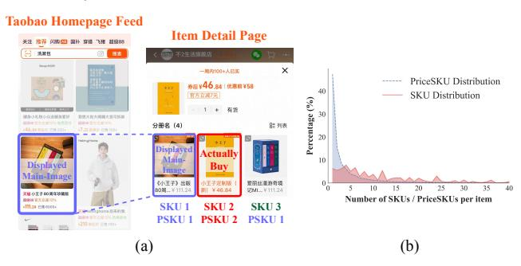
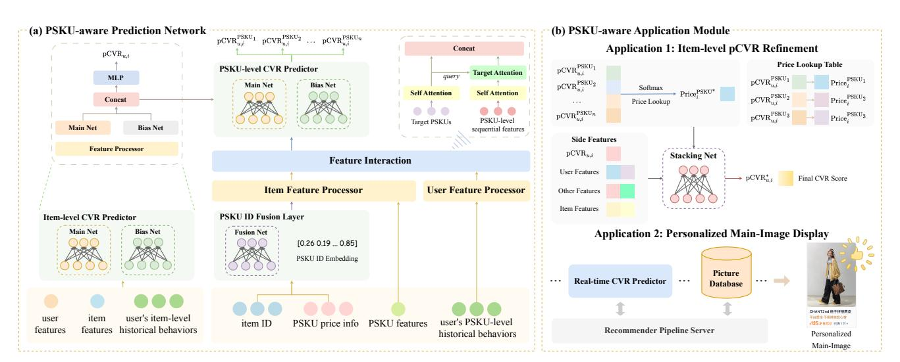
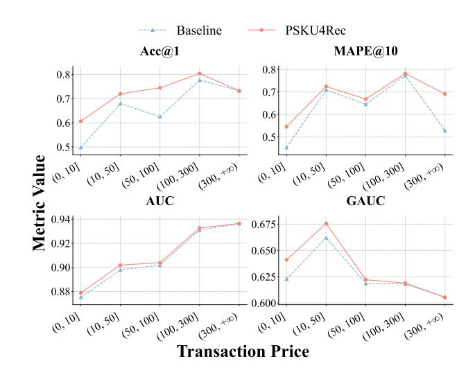

# Beyond Item-Level Prediction: Fine-Grained CVR Modeling with Price SKU in E-commerce Recommendation

Huiling Wu∗ 24210690115@m.fudan.edu.cn Fudan University Shanghai, China

Ao Zhang∗ huaizhe.za@taobao.com Taobao & Tmall Group of Alibaba Hangzhou, China

Junwei Xu∗ xjw23@mails.tsinghua.edu.cn SIGS, Tsinghua University Shenzhen, China

Boya Du∗ Jialin Zhu Boya.dby@alibaba-inc.com xiafei.zjl@alibaba-inc.com Taobao & Tmall Group of Alibaba Hangzhou, China

Yuning Jiang† Dakai Zhai mengzhu.jyn@alibaba-inc.com zhaidakai.zdk@alibaba-inc.com Taobao & Tmall Group of Alibaba Hangzhou, China

# Abstract

In large-scale e-commerce platforms, Conversion Rate (CVR) prediction is crucial for recommender system, yet existing approach face a fundamental granularity mismatch: models operate at the item level while users purchase at the fine-grained Stock Keeping Unit (SKU) level. This mismatch causes loss of fine-grained user intent signals. Moreover, it also introduces price inconsistency bias due to the gap between static exposure prices and actual transaction prices. While direct SKU-level modeling would resolve these issues, it is impractical for industrial deployment due to the extreme data sparsity and prohibitive inference costs.

To address these challenges, we propose PSKU4Rec, a novel framework that operates at the Price SKU (PSKU) granularity by aggregating SKUs by price to retain critical price signals while reducing sparsity by 6 times. PSKU4Rec consists of: (1) a PSKUaware prediction network that models intra-item PSKU contextual information and captures user PSKU preferences; and (2) a PSKUaware application module that generates personalized estimated transaction prices for pCVR refinement and enables personalized main-image display. Offline experiments based on the dataset collected from Taobao App show substantial improvements in CVR prediction accuracy and price consistency. Online A/B testing further validates the effectiveness of our approach.

# CCS Concepts

• Information systems → Recommender systems; • Computing methodologies → Neural networks.

# Keywords

Recommender System, CVR Prediction, Price SKU

#### ACM Reference Format:

Huiling Wu, Ao Zhang, Junwei Xu, Boya Du, Jialin Zhu, Yuning Jiang, and Dakai Zhai. 2026. Beyond Item-Level Prediction: Fine-Grained CVR Modeling with Price SKU in E-commerce Recommendation. In Proceedings of the ACM Web Conference 2026 (WWW '26), April 13–17, 2026, Dubai, United Arab Emirates. ACM, New York, NY, USA, [4](#page-3-0) pages. [https://doi.org/10.1145/](https://doi.org/10.1145/3774904.3792935) [3774904.3792935](https://doi.org/10.1145/3774904.3792935)

# 1 Introduction

In modern e-commerce platforms, accurately predicting Conversion Rate (CVR) is fundamental to recommender systems and directly impacts business revenue. Despite progress in CVR modeling, existing approaches face a critical granularity mismatch: models operate at the item level [\[2,](#page-3-1) [5,](#page-3-2) [6\]](#page-3-3), while users make purchase decisions at the fine-grained Stock Keeping Unit (SKU) level [\[7\]](#page-3-4), where SKUs differ in attributes such as size and price. To understand this mismatch, analysis was conducted in Taobao's homepage feed. Nearly 50% of items have multiple price-SKUs, averaging 4.3 distinct price points per item, and 70% of total orders originate from such multiprice-SKU items. Moreover, in approximately 60% of these orders, the purchased SKU differs from the exposed one. These statistics demonstrate that the granularity gap is not a corner case but a pervasive challenge affecting the majority of transactions.

Despite the prevalence of multi-SKU items, most industrial CVR models operate at the item level, ignoring the underlying SKU structure. Critical limitations are introduced by the traditional paradigm. First, item-level modeling aggregates heterogeneous SKU preferences into a single prediction, discarding crucial signals about which specific price point or attribute combination a user prefers. This information loss fundamentally limits model expressiveness and prediction accuracy. Second, current models treat price as a static feature derived from the exposed SKU (e.g., the main-image SKU displayed to users) [\[3\]](#page-3-5). When users purchase a different SKU, the exposure price becomes a biased signal that misleads the CVR prediction. We term this the price inconsistency problem.

A naive solution is to model CVR directly at the SKU level [\[7,](#page-3-4) [9\]](#page-3-6). However, moving from item-level to SKU-level modeling increases negative sample space by over 35 times. And SKU-level prediction would require scoring all SKUs for all candidate items, increasing

∗Equal contributions.

†Corresponding author.

[This work is licensed under a Creative Commons Attribution 4.0 International License.](https://creativecommons.org/licenses/by/4.0) WWW '26, Dubai, United Arab Emirates © 2026 Copyright held by the owner/author(s). ACM ISBN 979-8-4007-2307-0/2026/04 <https://doi.org/10.1145/3774904.3792935>

Figure 1: (a) Example of price inconsistency problem. (b) Distribution of SKU/PSKU counts per item.

inference volume by 25 times, which is an impractical burden for real-time recommender systems serving billions of requests daily.

Since price is the most critical factor influencing user purchase among SKUs of the same item, price aggregation naturally reduces the prediction space while retaining the most discriminative signal. To balance modeling granularity and computational feasibility, we thus introduce the concept of Price SKU (PSKU). As shown in Figure 1, PSKU aggregates SKUs sharing the same price into a single unit, and PSKU-level modeling reduces negative samples by over 6 times, making it practical for industrial deployment.

Based on the PSKU concept, we propose PSKU4Rec, a framework for fine-grained CVR modeling at the PSKU granularity. In prediction stage, a PSKU-aware prediction network is responsible for providing accurate PSKU-level CVR. In application stage, a PSKUaware application module leverages the predictions for practical downstream tasks, including the refinement of item-level predicted CVR (pCVR) and personalized main-image display. Specifically, for item-level pCVR refinement, we derive a personalized estimated transaction price from the top-predicted PSKU and feed it into a stacking CVR model to reduce price inconsistency bias. For personalized main-image display, we dynamically select the main-image SKU based on the top-predicted PSKU, further aligning visual presentation with user intent.

Our main contributions are summarized as follows:

- To our knowledge, this is the first work to address finegrained PSKU selection at scale. We identify and systematically analyze the granularity mismatch problem in CVR prediction, revealing the price inconsistency problem.
- We propose the PSKU4Rec framework, which achieves finegrained modeling while maintaining computational efficiency through PSKU aggregation.
- We conduct extensive experiments on Taobao's production dataset. Both offline and online experiments demonstrate the effectiveness and business impact of our approach.

### 2 Problem Formulation

Let an item �� ∈ I be composed of a set of Price SKUs (PSKUs) P�� = {PSKU1, PSKU2, ..., PSKU���� }, where each PSKU�� is a group of SKUs sharing the same price ���� . Given a user �� ∈ U click on item ��, our primary goal is to predict the probability that the user will purchase each PSKU�� . Formally, we aim to learn a function �� (��,��, P��) that predicts the PSKU-level conversion rate:

pCVR�� ��,�� = �� (pay �� |click��) = �� (��,��, P �� ), ∀�� ∈ P�� (1)

#### 3 Methodology

### 3.1 PSKU-aware Prediction Network

The PSKU-aware prediction network takes as input a user, an item, and its associated PSKUs, and outputs a conversion probability distribution over all PSKUs. The network consists of three key components: (i) PSKU representation, (ii) PSKU sequence modeling, and (iii) the PSKU CVR prediction head.

3.1.1 PSKU Representation. Various ways can be used to represent a PSKU. For simplicity, we construct a PSKU ID from its parent item ID and its price rank within the item. The PSKU ID Fusion Layer is adopted to generate the PSKU ID embedding, where the embedding is derived by fusing these two signals through an MLP layer. Such design alleviates raw PSKU ID sparsity and enhances generalization by inheriting semantic knowledge from the well-trained item representation while incorporating price-specific signals.

3.1.2 PSKU Sequence Modeling. Each PSKU contains rich features beyond its ID, including textual features ( e.g., title, tags, and configuration), statistical attributes ( e.g., historical GMV, pay amount, pay UV), inventory status ( e.g., stock quantity, out-of-stock rate), and price-related features ( e.g., price, intra-item price rank, price gap from the cheapest). For the item-side features, a self-attention layer [\[4\]](#page-3-7) is adopted to capture the intra-item competition and contextual information among PSKUs. For the user-side features, we refine the users' historical behaviors from item granularity to PSKU granularity. Then the self-attention mechanism is also applied to the user's historical PSKU interaction sequence to capture fine-grained interests. We further use target attention [\[8\]](#page-3-8) to dynamically model user PSKU preferences conditioned on the target PSKU.

3.1.3 PSKU CVR Prediction Head. The final prediction is performed at the user–PSKU level. We construct the final representation by concatenating three components: (1) the context-aware PSKU representation, (2) the user's PSKU-level interest representation, and (3) the hidden states from the second-to-last layer of the base itemlevel CVR model. The combined vector is fed into the PSKU-level CVR prediction network with sigmoid activation function to obtain the predicted CVR score for each PSKU.

3.1.4 Training Objective. We jointly train the base item-level CVR model and the PSKU-aware prediction network. In the click space, we apply binary cross-entropy loss to each PSKU to model its individual conversion probability:

L PSKU point-wise = − ∑︁ �� ∈ P�� -����,�� log ��(����,�� ) + (1 − ����,�� ) log(1 − ��(����,�� )) , (2)

where P�� is the PSKUs in the ��-th item, ����,�� ∈ {0, 1} indicates whether the user purchased ��-th PSKU of item ��, and �� are the logits before the sigmoid activation function.

In the conversion space, we employ a softmax cross-entropy loss to encourage the model to rank the actually purchased PSKU highest among all PSKUs of the item:

L PSKU list-wise = − ∑︁ �� ∈ P∗ log exp(����,�� ) Í �� ∈ P�� exp(����,��) , (3)

Figure 2: Overview of the PSKU4Rec framework.

The base CVR model is trained with standard binary crossentropy loss Litem point-wise over all clicked samples. And the total training loss is the weighted sum of the above losses:

L = L item point-wise + ��1L PSKU point-wise + ��2L PSKU list-wise, (4)

where ��1, ��2 are hyper-parameters.

# 3.2 PSKU-aware Application Module

3.2.1 Estimated Transaction Price for pCVR Refinement. We derive an estimated transaction price ��ˆ as the price of the PSKU with the highest predicted conversion probability:

��ˆ = ����, �� = arg max �� ∈ P�� pCVR�� ��,�� . (5)

This ��ˆ serves as a user-aware proxy for the final payment amount, replacing the static exposure price used in conventional CVR models. To integrate this signal into the ranking system, we feed ��ˆ into the downstream stacking CVR network to enhance the final item-level CVR prediction:

pCVR��ˆ ��,�� = ��Stacking (��,��, pCVRbase ��,�� , ��ˆ). (6)

To enhance robustness, ��ˆ is bucketized, and some additional features (e.g., the relative discount ratio compared to the original price original\_price−��ˆ original\_price ) are also incorporated.

3.2.2 Personalized Main-Image Display. To better align the item's visual and pricing presentation with the user intents, we dynamically replace both the main image and the displayed price in the recommendation feed. Specifically, we first identify the PSKU with the highest predicted conversion probability (PSKU�� ). If this PSKU corresponds to multiple SKUs (i.e., several SKUs share the same price), our selection strategy is to choose the best-selling SKU.

# 4 Experiments

In this section, we conduct extensive offline and online experiments to demonstrate the effectiveness of PSKU4Rec.

#### 4.1 Experimental Setup

4.1.1 Dataset. Our work requires fine-grained SKU-level interaction data, which is not available in public datasets. Thus, we conduct experiments on a large-scale industrial dataset from Taobao's "Guess You Like" feed. The dataset is constructed from 29 days of click logs in August 2025. The first 28 days are used for training and the last day for testing. It contains over 2 billion clicks and 10 million items per day, with 48% being multi-price-SKU (averaging 4.3 distinct prices per item).

4.1.2 Evaluation Metrics & Baseline. We employ three groups of metrics to comprehensively evaluate our approach.

- Item-level pCVR Performance: we use common metrics like AUC and GAUC [\[8\]](#page-3-8), with Taobao's online production model (a well-optimized item-level CVR model widely deployed in practice) as the baseline.
- PSKU Prediction Accuracy: we use Acc@1, defined as the ratio of samples where the PSKU with the highest predicted pCVR matches the ground-truth purchased PSKU.
- Price Consistency: we adopt MAPE@10, defined as the ratio of samples where the relative error between the estimated and true transaction price is within 10%.

For both Acc@1 and MAPE@10, we use the displayed PSKU as the baseline, which is selected with the highest sales or recent views and represents the current system's performance without PSKU-level modeling.

4.1.3 Implementation Details. We truncate the PSKU sequence to a maximum length of 20 per item to balance performance and efficiency. For items with more than 20 PSKUs, we retain the top-20 based on historical transactions. The model is trained with a batch size of 1024 using the AdagradV2 optimizer [\[1\]](#page-3-9), with the learning rate decaying linearly from 0.01 to 0.001 over the training period. We employ 8-head self-attention and target-attention modules with a hidden dimension of 256. The prediction head uses a 3-layer MLP and LeakyReLU activation after each hidden layer.

Table 1: Overall performance comparison on Taobao dataset.

| Metric  | Baseline | PSKU4Rec | (Ours) Rel. Impr. |
|---------|----------|----------|-------------------|
| Acc@1   | 0.6153   | 0.7221   | +17.36%           |
| MAPE@10 | 0.5801   | 0.6524   | +12.46%           |
| AUC     | 0.9322   | 0.9337   | +0.161%           |
| GAUC    | 0.6959   | 0.7024   | +0.934%           |

Table 2: Relative improvements (%) in online metrics from the online A/B test comparing PSKU4Rec with the Base Model.

### 4.2 Offline Experiments

As shown in Table [1,](#page-3-10) PSKU4Rec outperforms the baselines across all evaluation metrics. Specifically, our method improves Acc@1 from 0.6153 to 0.7221 and MAPE@10 from 0.5801 to 0.6524, confirming its ability to capture fine-grained user intent at the PSKU level. The significant improvement in price accuracy demonstrates that our model can effectively predict which price point a user is most likely to choose, alleviating the price inconsistency problem. By feeding the PSKU-predicted transaction price into the stacking CVR model, PSKU4Rec achieves a relative improvement of +0.161% in AUC and +0.934% in GAUC over the base model. These results all demonstrate the effectiveness of our proposed framework.

We further conduct in-depth analysis to understand the contributions on items with different transaction price levels, as shown in Figure [3.](#page-3-11) PSKU4Rec significantly improves the performance of low-price items, indicating that low-price items usually have more SKU options and more complex user selection behavior. PSKU4Rec better captures these complexities through fine-grained PSKU-level modeling, thereby significantly enhancing the overall performance.

# 4.3 Online A/B Testing

We perform online A/B testing of PSKU4Rec on Taobao's "Guess You Like" homepage feed. As summarized in Table [2,](#page-3-12) PSKU4Rec consistently lifts core business metrics: +6.90% GMV, +1.94% orders, +2.37% converting UV, +0.67% CTR, and +2.25% CVR. Significant improvements on the transaction-related metrics further validate the superiority of PSKU4Rec.

# 5 Conclusion

In this paper, we address the critical granularity mismatch between item-level CVR modeling and SKU-level user purchase decisions in e-commerce. We propose PSKU4Rec, a novel framework that operates at the Price SKU granularity to balance modeling precision with computational efficiency. Extensive offline and online experiments on Taobao demonstrate significant improvements in PSKU prediction accuracy, price consistency, and CVR ranking performance, validating PSKU4Rec as an effective solution for finegrained conversion modeling in large-scale e-commerce platforms.

Figure 3: Performance improvements of PSKU4Rec over the baseline on items with different transaction price levels.

### References

[1] John Duchi, Elad Hazan, and Yoram Singer. 2011. Adaptive Subgradient Methods for Online Learning and Stochastic Optimization. J. Mach. Learn. Res. 12, null (July 2011), 2121–2159. [2] Siyuan Guo, Lixin Zou, Yiding Liu, Wenwen Ye, Suqi Cheng, Shuaiqiang Wang, Hechang Chen, Dawei Yin, and Yi Chang. 2021. Enhanced Doubly Robust Learning for Debiasing Post-Click Conversion Rate Estimation. In Proceedings of the 44th International ACM SIGIR Conference on Research and Development in Information Retrieval (Virtual Event, Canada) (SIGIR '21). Association for Computing Machinery, New York, NY, USA, 275–284. [doi:10.1145/3404835.3462917](https://doi.org/10.1145/3404835.3462917) [3] Changhua Pei, Xinru Yang, Qing Cui, Xiao Lin, Fei Sun, Peng Jiang, Wenwu Ou, and Yongfeng Zhang. 2019. Value-aware Recommendation based on Reinforcement Profit Maximization. In The World Wide Web Conference (San Francisco, CA, USA) (WWW '19). Association for Computing Machinery, New York, NY, USA, 3123–3129. [doi:10.1145/3308558.3313404](https://doi.org/10.1145/3308558.3313404) [4] Ashish Vaswani, Noam Shazeer, Niki Parmar, Jakob Uszkoreit, Llion Jones, Aidan N. Gomez, Łukasz Kaiser, and Illia Polosukhin. 2017. Attention is all you need. In Proceedings of the 31st International Conference on Neural Information Processing Systems (Long Beach, California, USA) (NIPS'17). Curran Associates Inc., Red Hook, NY, USA, 6000–6010. [5] Hong Wen, Jing Zhang, Yuan Wang, Fuyu Lv, Wentian Bao, Quan Lin, and Keping Yang. 2020. Entire Space Multi-Task Modeling via Post-Click Behavior Decomposition for Conversion Rate Prediction. In Proceedings of the 43rd International ACM SIGIR Conference on Research and Development in Information Retrieval (Virtual Event, China) (SIGIR '20). Association for Computing Machinery, New York, NY, USA, 2377–2386. [doi:10.1145/3397271.3401443](https://doi.org/10.1145/3397271.3401443) [6] Chen Xu, Quan Li, Junfeng Ge, Jinyang Gao, Xiaoyong Yang, Changhua Pei, Fei Sun, Jian Wu, Hanxiao Sun, and Wenwu Ou. 2020. Privileged Features Distillation at Taobao Recommendations. In Proceedings of the 26th ACM SIGKDD International Conference on Knowledge Discovery & Data Mining (Virtual Event, CA, USA) (KDD '20). Association for Computing Machinery, New York, NY, USA, 2590–2598. [doi:10.1145/3394486.3403309](https://doi.org/10.1145/3394486.3403309) [7] Yang Zhang. 2025. Customer Segmentation: Data-Driven Research on Transaction-Level Data of JD.com. In Proceedings of the 2024 5th International Conference on Computer Science and Management Technology (ICCSMT '24). Association for Computing Machinery, New York, NY, USA, 1203–1209. [doi:10.1145/3708036.](https://doi.org/10.1145/3708036.3708235) [3708235](https://doi.org/10.1145/3708036.3708235) [8] Guorui Zhou, Xiaoqiang Zhu, Chenru Song, Ying Fan, Han Zhu, Xiao Ma, Yanghui Yan, Junqi Jin, Han Li, and Kun Gai. 2018. Deep Interest Network for Click-Through Rate Prediction. In Proceedings of the 24th ACM SIGKDD International Conference on Knowledge Discovery & Data Mining (London, United Kingdom) (KDD '18). Association for Computing Machinery, New York, NY, USA, 1059–1068. [doi:10.1145/3219819.3219823](https://doi.org/10.1145/3219819.3219823) [9] Yixuan Zhou, Yulu Tian, Wenliang Zhong, Xingbin Yu, Heng Tao Shen, and Xing Xu. 2025. SaP-Bot: A Multimodal Large-Language Model for End-to-End Same-Product Identification. In Proceedings of the 33rd ACM International Conference on Multimedia (Dublin, Ireland) (MM '25). Association for Computing Machinery, New York, NY, USA, 5951–5960. [doi:10.1145/3746027.3754835](https://doi.org/10.1145/3746027.3754835)