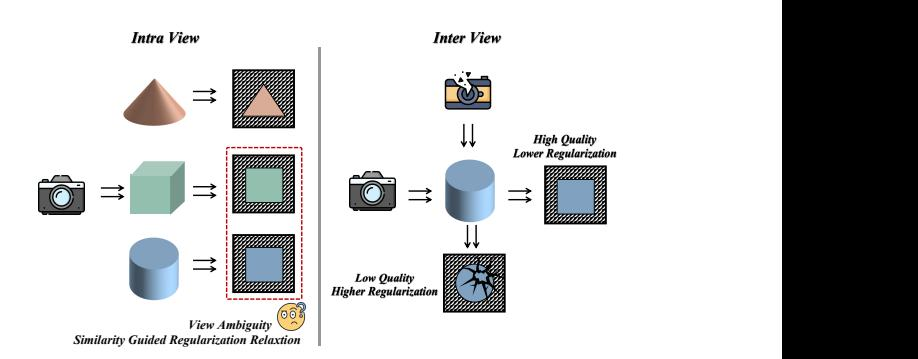
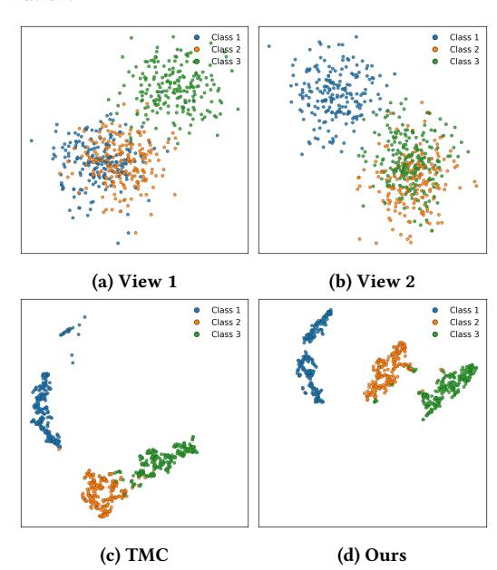

# Enhancing Trusted Multi-View Classification via Adaptive Regularization Guided by View-Specific Biases

Zhiyuan Liu nebula@shu.edu.cn School of Computer Engineering and Science, Shanghai University Shanghai, China

Xiaodong Yue∗ yswantfly@shu.edu.cn Artificial Intelligence Institute, Shanghai University Shanghai, China

Yufei Chen yufeichen@tongji.edu.cn School of Computer Science and Technology, Tongji University Shanghai, China

Shijie Ding dingshijie@shu.edu.cn School of Computer Engineering and Science, Shanghai University Shanghai, China

Jie Shi jieshi@shu.edu.cn School of Computer Engineering and Science, Shanghai University Shanghai, China

# Abstract

Trusted multi-view classification (TMC) aims to improve prediction reliability by integrating evidence from multiple views. Existing TMC methods extract evidence from single view and use a regularization term to shape the evidence distribution. However, existing methods typically enforce a uniform regularization objective across all views, overlooking critical view-specific biases: intraview class ambiguity caused by confusable features and inter-view quality disparities reflected in evidence uncertainty. To address these issues, we propose an adaptive regularization strategy that enhances robustness on two levels. At the intra-view level, it quantifies feature ambiguity to apply targeted relaxation to confusable classes, preventing over-penalization of inherent uncertainty. At the inter-view level, it evaluates relative view quality to impose stronger constraints on unreliable views and suppress noise from low-quality ones. Extensive experiments across multiple benchmarks demonstrate the superiority and reliability of the proposed method.

## CCS Concepts

- Computing methodologies → Supervised learning by classification; Neural networks.

# Keywords

Trusted Multi-View Classification, Adaptive Regularization, View-Specific Biases

### ACM Reference Format:

Zhiyuan Liu, Xiaodong Yue, Yufei Chen, Shijie Ding, and Jie Shi. 2026. Enhancing Trusted Multi-View Classification via Adaptive Regularization Guided by View-Specific Biases. In Proceedings of the ACM Web Conference

∗Corresponding author.

[This work is licensed under a Creative Commons Attribution-NonCommercial-](https://creativecommons.org/licenses/by-nc-nd/4.0)[NoDerivatives 4.0 International License.](https://creativecommons.org/licenses/by-nc-nd/4.0) WWW '26, Dubai, United Arab Emirates © 2026 Copyright held by the owner/author(s). ACM ISBN 979-8-4007-2307-0/2026/04 <https://doi.org/10.1145/3774904.3792936>

Figure 1: Multi-view challenges: (Left) intra-view ambiguity where certain views induce class confusion; (Right) interview quality disparity where views vary in reliability.

2026 (WWW '26), April 13–17, 2026, Dubai, United Arab Emirates. ACM, New York, NY, USA, [4](#page-3-0) pages.<https://doi.org/10.1145/3774904.3792936>

# 1 Introduction

Multi-view perception is central to risk-sensitive applications like autonomous driving and medical imaging [\[3,](#page-3-1) [11,](#page-3-2) [18\]](#page-3-3), where systems fuse complementary cues (e.g., RGB, depth, LiDAR) for decision making. In these scenarios, communicating why a system is uncertain—due to noisy views, missing data, or intrinsic class ambiguity [\[21\]](#page-3-4)—is as critical as predictive accuracy.

Evidential deep learning (EDL) within the Trusted Multi-View Classification (TMC) framework is a primary tool for this, as it allows networks to output "evidence" parameterizing a Dirichlet distribution. The training objective in TMC is typically twofold: an evidential classification loss serves to maximize evidence for the correct (target) class, while a Kullback–Leibler (KL) regularizer is used to constrain and penalize the evidence assigned to nontarget classes. This KL term is central to the framework's goal of quantifying uncertainty, and as prior work confirms, its specific design is a critical factor in model robustness and calibration [\[2\]](#page-3-5).

However, representative TMC methods universally adopt a uniform KL design, which introduces two fundamental limitations, as shown in Figure [1:](#page-0-0)

| Method   | Handwritten | CUB   | Caltech101 | PIE   | Scene15 | Animal |
|----------|-------------|-------|------------|-------|---------|--------|
| DCCAE    | 97.27       | 85.44 | 77.33      | 82.43 | 55.76   | 86.30  |
| CPM-Nets | 95.74       | 89.73 | 83.70      | 81.60 | 68.32   | 84.12  |
| DUA-Nets | 97.52       | 71.65 | 84.27      | 81.76 | 65.01   | 78.65  |
| TMC      | 98.03       | 91.47 | 89.19      | 88.26 | 68.13   | 87.20  |
| ETMC     | 98.50       | 92.34 | 88.66      | 91.60 | 72.86   | 88.21  |
| SMDC     | 97.05       | 88.50 | 87.20      | 89.11 | 70.42   | 87.59  |
| ECML     | 98.72       | 94.27 | 88.84      | 92.32 | 73.84   | 87.25  |
| RMVC     | 98.51       | 93.18 | 88.73      | 91.18 | 73.05   | 87.67  |
| Ours     | 99.05       | 93.72 | 90.78      | 94.07 | 75.35   | 89.43  |

Table 2: Ablation study on Scene15 Dataset.

### 3.4 Analysis on Synthetic Data

We first construct a 2D toy dataset with three classes and two views to highlight view-specific ambiguity and complementarity. In view 1, classes 1 and 2 are strongly overlapped while class 3 is more separated; in view 2, the ambiguity shifts to classes 2 and 3, so each single view is highly confusing. On this toy example, TMC achieves 95.84% accuracy after fusion, whereas our adaptive regularization improves the fused accuracy to 97.50%. For visualization, we extract the model's evidence representations and apply t-SNE to project them into 2D. As shown in Figure [2,](#page-3-23) our method produces more compact and better separated clusters, indicating that it can down-weight ambiguous views while preserving complementary information.

Figure 2: Visualization on the synthetic toy dataset.

### 4 Conclusion

In this paper, we proposed an adaptive KL regularization scheme for trusted multi-view classification. Instead of a uniform KL objective, our method introduces a view-specific similarity-relaxed KL that softens penalties on semantically related non-target classes, and an uncertainty-scaled KL that scales regularization by view reliability. Experiments show consistent gains over strong baselines, and ablations verify that the two components are complementary. Additional toy visualizations provide qualitative support. Future work

will extend this adaptive regularization to scenarios with missing views and more challenging uncertainty settings.

### Acknowledgments

This work was supported by the National Natural Science Foundation of China (No. 62476165, 62472315, 62406182), and Fundamental Research Program of Shanxi Province(Serial No. 202403021212176), and Science and Technology Innovation Project for Higher Education Institutions of Shanxi Province(Serial No. 2024L004).

### References

[1] Defang Chen, Jian-Ping Mei, Hailin Zhang, Can Wang, Yan Feng, and Chun Chen. 2022. Knowledge distillation with the reused teacher classifier. In Proceedings of the IEEE/CVF conference on computer vision and pattern recognition. 11933–11942. [2] Mengyuan Chen, Junyu Gao, and Changsheng Xu. 2025. Revisiting essential and nonessential settings of evidential deep learning. IEEE Transactions on Pattern Analysis and Machine Intelligence (2025). [3] Zhicheng Dong, Xiaodong Yue, Yufei Chen, Xujing Zhou, and Jiye Liang. 2024. Uncertainty-aware multi-view learning for prostate cancer grading with dwi. In International Conference on Medical Image Computing and Computer-Assisted Intervention. Springer, 739–748. [4] Li Fei-Fei, Rob Fergus, and Pietro Perona. 2004. Learning generative visual models from few training examples: An incremental bayesian approach tested on 101 object categories. In 2004 conference on computer vision and pattern recognition workshop. IEEE, 178–178. [5] Li Fei-Fei and Pietro Perona. 2005. A bayesian hierarchical model for learning natural scene categories. In 2005 IEEE computer society conference on computer vision and pattern recognition (CVPR'05), Vol. 2. IEEE, 524–531. [6] Yu Geng, Zongbo Han, Changqing Zhang, and Qinghua Hu. 2021. Uncertaintyaware multi-view representation learning. In Proceedings of the AAAI Conference on Artificial Intelligence, Vol. 35. 7545–7553. [7] Zongbo Han, Changqing Zhang, Huazhu Fu, and Joey Tianyi Zhou. 2021. Trusted Multi-View Classification. In International Conference on Learning Representations. <https://openreview.net/forum?id=OOsR8BzCnl5> [8] Zongbo Han, Changqing Zhang, Huazhu Fu, and Joey Tianyi Zhou. 2022. Trusted multi-view classification with dynamic evidential fusion. IEEE transactions on pattern analysis and machine intelligence 45, 2 (2022), 2551–2566. [9] Audun Jøsang. 2016. Subjective logic. Vol. 3. Springer. [10] Christoph H Lampert, Hannes Nickisch, and Stefan Harmeling. 2013. Attributebased classification for zero-shot visual object categorization. IEEE transactions on pattern analysis and machine intelligence 36, 3 (2013), 453–465. [11] Wei Liu, Yufei Chen, and Xiaodong Yue. 2024. Building trust in decision with conformalized multi-view deep classification. In Proceedings of the 32nd ACM International Conference on Multimedia. 7278–7287. [12] Wei Liu, Yufei Chen, Xiaodong Yue, Changqing Zhang, and Shaorong Xie. 2023. Safe multi-view deep classification. In Proceedings of the AAAI Conference on Artificial Intelligence, Vol. 37. 8870–8878. [13] Mary Phuong and Christoph Lampert. 2019. Towards understanding knowledge distillation. In International conference on machine learning. PMLR, 5142–5151. [14] Martijn van Breukelen, Robert PW Duin, David MJ Tax, and JE Den Hartog. 1998. Handwritten digit recognition by combined classifiers. Kybernetika 34, 4 (1998), 381–386. [15] Catherine Wah, Steve Branson, Peter Welinder, Pietro Perona, and Serge Belongie. 2011. The caltech-ucsd birds-200-2011 dataset. (2011). [16] Weiran Wang, Raman Arora, Karen Livescu, and Jeff Bilmes. 2015. On deep multiview representation learning. In International conference on machine learning. PMLR, 1083–1092. [17] Cai Xu, Jiajun Si, Ziyu Guan, Wei Zhao, Yue Wu, and Xiyue Gao. 2024. Reliable conflictive multi-view learning. In Proceedings of the AAAI conference on artificial intelligence, Vol. 38. 16129–16137. [18] Zhikang Xu, Xiaodong Yue, Ying Lv, Wei Liu, and Zihao Li. 2023. Trusted finegrained image classification through hierarchical evidence fusion. In Proceedings of the AAAI Conference on Artificial Intelligence, Vol. 37. 10657–10665. [19] Xiaodong Yue, Zhicheng Dong, Yufei Chen, and Shaorong Xie. 2025. Evidential dissonance measure in robust multi-view classification to resist adversarial attack. Information Fusion 113 (2025), 102605. [20] Changqing Zhang, Zongbo Han, Huazhu Fu, Joey Tianyi Zhou, Qinghua Hu, et al. 2019. CPM-Nets: Cross partial multi-view networks. Advances in Neural Information Processing Systems 32 (2019). [21] Qingyang Zhang, Yake Wei, Zongbo Han, Huazhu Fu, Xi Peng, Cheng Deng, Qinghua Hu, Cai Xu, Jie Wen, Di Hu, et al. 2024. Multimodal fusion on low-quality data: A comprehensive survey. arXiv preprint arXiv:2404.18947 (2024).