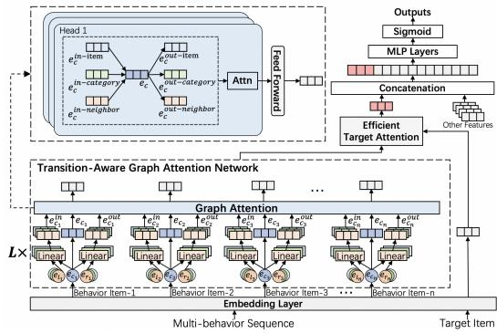
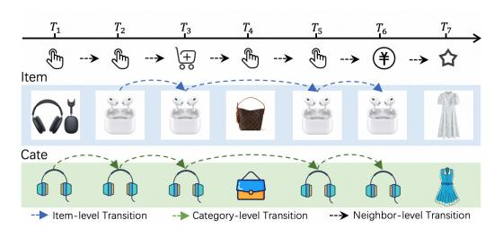
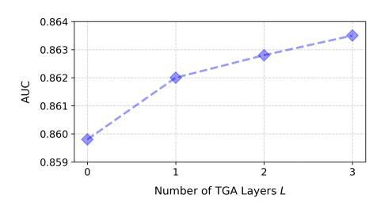

# Multi-Behavior Sequential Modeling with Transition-Aware Graph Attention Network for E-Commerce Recommendation

Hanqi Jin∗ Taobao & Tmall Group of Alibaba Beijing, China jinhanqi.jhq@alibaba-inc.com

Gaoming Yang∗ Zhangming Chan∗ Taobao & Tmall Group of Alibaba Beijing, China yanggaoming.ygm@taobao.com zhangming.czm@taobao.com

Yapeng Yuan Longbin Li Taobao & Tmall Group of Alibaba Beijing, China yuanyapeng.yyp@taobao.com lilongbin.llb@taobao.com

Fei Sun University of Chinese Academy of Sciences Beijing, China ofey.sunfei@gmail.com

Yeqiu Yang Jian Wu Taobao & Tmall Group of Alibaba Beijing, China yangyeqiu.yyq@taobao.com joshuawu.wujian@taobao.com

Yuning Jiang Bo Zheng Taobao & Tmall Group of Alibaba Beijing, China mengzhu.jyn@taobao.com bozheng@alibaba-inc.com

### Abstract

User interactions on e-commerce platforms are inherently diverse, involving behaviors such as clicking, favoriting, adding to cart, and purchasing. The transitions between these behaviors offer valuable insights into user-item interactions, serving as a key signal for understanding evolving preferences. Consequently, there is growing interest in leveraging multi-behavior data to better capture user intent. Recent studies have explored sequential modeling of multibehavior data, many relying on transformer-based architectures with polynomial time complexity. While effective, these approaches often incur high computational costs, limiting their applicability in large-scale industrial systems with long user sequences.

To address this challenge, we propose the Transition-Aware Graph Attention Network (TGA), a linear-complexity approach for modeling multi-behavior transitions. Unlike traditional transformers that treat all behavior pairs equally, TGA constructs a structured sparse graph by identifying informative transitions from three perspectives: (a) item-level transitions, (b) category-level transitions, and (c) neighbor-level transitions. Built upon the structured graph, TGA employs a transition-aware graph Attention mechanism that jointly models user-item interactions and behavior transition types, enabling more accurate capture of sequential patterns while maintaining computational efficiency. Experiments show that TGA outperforms all state-of-the-art models while significantly reducing computational cost. Notably, TGA has been deployed in a large-scale industrial production environment, where it leads to impressive improvements in key business metrics.

# Keywords

Multi-Behavior Sequential Modeling, Graph Attention Network, Recommender Systems

∗Equal contribution.

# 1 Introduction

Personalized recommender systems aim to infer users' preferences from their historical interactions and provide relevant item recommendations [\[2,](#page-4-0) [6,](#page-4-1) [10,](#page-4-2) [12,](#page-4-3) [17,](#page-4-4) [18,](#page-4-5) [22\]](#page-4-6). In e-commerce platforms, users engage with items through a variety of behavior types including clicks, add-to-cart actions, favorites, and purchases each reflecting different aspects of user intent and interest. These multi-behavior interactions offer rich signals for modeling evolving user preferences, where certain behaviors (e.g., purchases) indicate strong preference, while others (e.g., clicks) may reflect more exploratory or casual engagement.

Crucially, the transitions between these behaviors over time provide valuable insights into how users interact with items, offering a key signal for understanding dynamic user preferences. For instance, a user's progression from clicking an item to adding it to the cart and eventually purchasing it reveals a clear decision-making trajectory. This motivates recent efforts in incorporating such sequential behavioral transitions to gain deeper insights into user behavior and improve the accuracy of preference prediction.

A number of pioneering studies have explored various approaches for multi-behavior sequential modeling. Some works [\[3,](#page-4-7) [4,](#page-4-8) [11,](#page-4-9) [16\]](#page-4-10) divide multi-behavior sequences by behavior type and extract coinfluence across behavior-specific sub-sequences. Others model item and behavior sequences independently, using behavior knowledge as auxiliary information to enhance representation learning [\[9,](#page-4-11) [13,](#page-4-12) [19,](#page-4-13) [23\]](#page-4-14). Recently, several studies [\[20,](#page-4-15) [21\]](#page-4-16) have introduced behavior-aware mechanisms that integrate contextual signals into item transitions to better capture evolving user interests.

However, most of these approaches rely on transformer-based architectures or other methods with polynomial time complexity, which often suffer from high computational costs — particularly when applied to long user behavior sequences. While these approaches achieve promising performance, their practical deployment in large-scale industrial systems remains challenging due to resource constraints. This creates a fundamental trade-off between model expressiveness and computational efficiency, especially in real-world scenarios where both accuracy and efficiency are critical.

Conference'17, Washington, DC, USA 2026. ACM ISBN 978-x-xxxx-xxxx-x/YYYY/MM <https://doi.org/10.1145/nnnnnnn.nnnnnnn>

Figure 1: Item-level, category-level, and neighbor-level transitions in multi-behavior sequential modeling.

To address this challenge, we propose Transition-Aware Graph Attention Network (TGA), an efficient framework designed to explicitly model key behavioral transition patterns with linear time complexity. Unlike transformer-based approaches that rely on fully connected attention graphs with quadratic complexity, TGA constructs a structured sparse graph that identifies the most informative transitions across multiple relational views as shown in Figure [1:](#page-1-0) a.) Item-level transitions, capturing how users interact with the same item through multiple behavior types; b.) Category-level transitions, modeling cross-item exploration within the same category; c.) Neighbor-level transitions, representing local behavioral dependencies through temporal order. Based on this structured graph, TGA introduces a novel Transition-Aware Graph Attention mechanism that jointly models user interactions and behavior transition types. By stacking multiple layers, TGA can capture high-order dependencies across multiple behavior dimensions. We summarize our main contributions as follows:

- We propose TGA, an efficient framework that captures multibehavior transitions with linear complexity, enabling its application to long user sequences in real-world scenarios.
- We design a novel graph structure that captures informative behavior transitions from item-, category-, and neighbor-level perspectives, enabling fine-grained preference modeling.
- Experiments show that TGA achieves state-of-the-art performance with significantly lower resource cost, and it has been successfully deployed in a large-scale industrial environment.

### 2 METHODOLOGY

As most multi-behavior sequential modeling approaches rely on transformer-based architectures with polynomial time complexity [\[9,](#page-4-11) [11\]](#page-4-9), they often incur high computational costs, limiting their applicability in large-scale industrial systems with long user sequences. To address this limitation, we propose the Transition-Aware Graph Attention Network (TGA), a computationally efficient framework that explicitly models key behavioral transition patterns through a structured sparse graph. As illustrated in Figure [2,](#page-1-1) we first apply the proposed TGA to the user behavior sequence S, which effectively captures long-range dependencies and high-order interaction patterns. The transformed sequence is then fed into the Efficient Target Attention to model interaction with the candidate item. The final prediction is obtained by feeding the user profile, the candidate item, and the attention output into a multi-layer perceptron with a sigmoid activation.

Before delving into the details of our proposed approach, we first formalize the problem setting. This work focuses on multibehavior sequence modeling, evaluated on the conversion rate

Figure 2: The overview of our proposed TGA approach.

(CVR) prediction task. Let D (����, S, ��, ��) denote the dataset, where ���� , S, ��, and �� represent the user profile, user behavior sequence, candidate item, and conversion label, respectively. Notably, each S contains long-term multi-type actions (e.g., click, buy, add-tocart, favorite). We design an effective and efficient multi-behavior sequence modeling method to S for better prediction performance.

### 2.1 Behavior Graph Construction

In this section, we describe the graph construction process for the proposed TGA model. We observe that user decision-making involves both fine-grained item-level interactions and broader categorylevel exploration patterns. For instance, high-cost items often trigger repeated interactions — such as multiple revisits — indicating a cautious evaluation process before purchase. At the category level, users frequently compare similar items within the same category (e.g., clothing), exhibiting behaviors such as repeated clicks and add-to-cart actions prior to final conversion.

Motivated by the above observation, we transform user multibehavior sequences into a structured graph representation. This graph explicitly encodes user-item interactions, behavior types, and their transition relationships. Our construction process primarily revolves around three complementary perspectives:

- Item-Level Transition Edges. These model user interactions on a specific item. If a user performs ���� followed by ���� on the same item ��, we create a directed edge (��, ���� ) → (��, ����).
- Category-Level Transition Edges. These capture cross-item exploration within the same category. If a user transitions from behavior ���� on item ���� to ���� on another item ���� in the same category, we create a directed edge (���� , ���� ) → (����, ����), modeling topical interest shifts (e.g., browsing different dresses).
- Neighbor-Level Transition Edges. These form the sequential backbone of the graph, connecting consecutive interactions in temporal order: (���� , ���� ) → (����+1, ����), regardless of item or category, capturing raw sequences and local behavioral dynamics.

To maintain a sparse and efficient graph, we constrain each node to only its nearest temporal neighbors — at most one predecessor and one successor within each relation view. Higher-order dependencies are modeled by the network architecture. The average number of edges per node is 0.56 for item-level, 1.19 for category-level, and 2.00 for neighbor-level transitions.

Table 1: Performance comparison with baselines ("–" = OOM); "\*" indicates TGA significantly better (p < 0.05).

| Model       |             | Taobao      | Dataset   | Industrial | Dataset   |
|-------------|-------------|-------------|-----------|------------|-----------|
|             |             | AUC         | T&I Speed | AUC        | T&I Speed |
| Transformer | [14]        | 0.7276*     | 1.0x      |            |           |
| MB-STR      | [21]        | 0.7334*     | 0.8x      |            |           |
| END4Rec     | [5]         | 0.7405*     | 1.8x      |            |           |
| Reformer    | [8]         | 0.7306*     | 1.7x      | 0.8623*    | 1.0x      |
| Linear      | Transformer | [7] 0.7348* | 1.9x      | 0.8619*    | 1.0x      |
| Longformer  | [1]         | 0.7244*     | 2.1x      | 0.8617*    | 1.2x      |
| TGA         |             | 0.7454      | 5.8x      | 0.8635     | 3.4x      |

Table 2: The results of ablation studies.

| Model |                |             | AUC    | Improv. |
|-------|----------------|-------------|--------|---------|
| TGA   |                |             | 0.8635 |         |
| w/o   | Item-Level     | Transitions | 0.8618 | -0.0017 |
| w/o   | Category-Level | Transitions | 0.8614 | -0.0021 |
| w/o   | Neighbor-Level | Transitions | 0.8625 | -0.0010 |

### 3 EXPERIMENTS

### 3.1 Experimental Details

3.1.1 Dataset. We evaluate our model on the post-click CVR prediction task on both public and real-world industrial datasets. For the public dataset, we use the Taobao dataset[\[24\]](#page-4-23), which is widely used in previous work. For the industrial dataset, we use real-world data collected from the Taobao recommendation platform.

We split the Taobao dataset into training set (80%), validation set (10%), and test set (10%) according to the timestep. The behavior sequence is truncated at length 256. The industrial dataset comes from 14 days of user logs on a major e-commerce platform, with the next day's logs as the test set. The dataset contains over 10 billion instances, averaging 1,536 behavioral records per user. We use the most recent 1,024 interactions involving four behavior types (click, add-to-cart, favorite, purchase) as the multi-behavior sequence.

3.1.2 Compared Methods. To evaluate the effectiveness and efficiency of our approach, we compare it with the standard Transformer [\[14\]](#page-4-18) and efficient variants, i.e., Reformer [\[8\]](#page-4-20), Linear Transformer [\[7\]](#page-4-21), and Longformer [\[1\]](#page-4-22). We also benchmark against stateof-the-art multi-behavior models, including END4Rec [\[5\]](#page-4-19) and MB-STR [\[21\]](#page-4-16). For fair comparison, all models use the same input features and share a common architecture, differing only in the user multi-behavior modeling module. We set the embedding size �� to 64, batch size to 512, and number of layers �� to 3.

3.1.3 Evaluation Metrics. For offline evaluation, we adopt the widely used Area Under the Curve (AUC) and include Training & Inference Speed (T&I Speed) as a supplementary metric to measure model efficiency.

### 3.2 Experimental Results

3.2.1 Overall performance. As shown in Table [1,](#page-3-0) TGA achieves an AUC of 0.7454 on Taobao Dataset, outperforming all baselines. More importantly, TGA is 5.8× faster in both training and inference than the standard Transformer, demonstrating the efficiency of our transition-aware graph attention mechanism.

On Industrial Dataset, most existing methods either fail (e.g., Transformer). On those that can run on long sequences–Reformer,

Figure 3: AUC Performance with Increasing TGA Layers.

Linear Transformer, and Longformer—TGA still outperforms them in both accuracy and speed.

3.2.2 Impact of TGA Transition Components. We examine the contribution of different components in the proposed TGA. Specifically, we remove each individual transition mechanism, i.e., item-level, category-level, and neighbor-level transitions within the structured graph, and evaluate their impact on model performance. As shown in Table [2,](#page-3-1) removing any of these transitions leads to a performance decline, confirming the necessity of all components. Among them, the item-level and category-level transitions have the most significant impact, i.e., -0.0017 and -0.0021, indicating that fine-grained item interactions and category-based user behaviors provide the most informative signals for modeling conversion patterns.

3.2.3 Impact of TGA Layer Depth. We investigate how the number of stacked TGA layers impacts model performance. As shown in Figure [3,](#page-3-2) with L layers, each node can aggregate information from its ��-hop neighbors within the behavior-aware graph. The results demonstrate that increasing the number of layers leads to consistent performance improvements, validating the effectiveness of deep stacking in capturing higher-order user behavior dependencies.

3.2.4 Online A/B Testing. We conduct online A/B testing in a realworld production environment to evaluate the effectiveness of TGA. The baseline model separately models individual behavior types (click, purchase, favorite, add-to-cart) without capturing crossbehavior patterns through multi-behavior sequence modeling. The experiment spans seven consecutive days and covers approximately 10% of the platform's traffic. TGA achieves a 1.29% improvement in CVR, along with an average increase of 1.79% in GMV. These results demonstrate that TGA significantly outperforms the existing production model and delivers substantial business impact, especially considering the platform's massive daily user volume.

### 4 CONCLUSIONS

In this paper, we proposed the TGA, an efficient multi-behavior sequential recommendation model tailored for long user interaction sequences in e-commerce. TGA models item-level, category-level, and neighbor-level transitions through a structured graph and a novel transition-aware graph attention mechanism, achieving linear time complexity with respect to sequence length. Experiments show that TGA achieves performance comparable to state-of-theart methods while offering significantly higher efficiency. It has been deployed in a large-scale industrial system, where it demonstrates measurable improvements in key business metrics, validating its effectiveness in real-world applications.

- References [1] Iz Beltagy, Matthew E. Peters, and Arman Cohan. [n. d.]. Longformer: The Long-Document Transformer. In EMNLP 2020. [2] Jianxin Chang, Chenbin Zhang, et al. [n. d.]. TWIN: TWo-stage interest network for lifelong user behavior modeling in CTR prediction at kuaishou. In KDD 2023. [3] Junsu Cho, Dongmin Hyun, Dong won Lim, Hyeon jae Cheon, Hyoung-iel Park, and Hwanjo Yu. 2023. Dynamic multi-behavior sequence modeling for next item recommendation. In Proceedings of the AAAI conference on artificial intelligence, Vol. 37. 4199–4207. [4] Yulong Gu, Zhuoye Ding, Shuaiqiang Wang, Lixin Zou, Yiding Liu, and Dawei Yin. 2020. Deep Multifaceted Transformers for Multi-objective Ranking in Large-Scale E-commerce Recommender Systems. In CIKM '20: The 29th ACM International Conference on Information and Knowledge Management, Virtual Event, Ireland, October 19-23, 2020, Mathieu d'Aquin, Stefan Dietze, Claudia Hauff, Edward Curry, and Philippe Cudré-Mauroux (Eds.). ACM, 2493–2500. [doi:10.1145/3340531.](https://doi.org/10.1145/3340531.3412697) [3412697](https://doi.org/10.1145/3340531.3412697) [5] Yongqiang Han, Hao Wang, Kefan Wang, Likang Wu, Zhi Li, Wei Guo, Yong Liu, Defu Lian, and Enhong Chen. 2024. Efficient Noise-Decoupling for Multi-Behavior Sequential Recommendation. In Proceedings of the ACM on Web Conference 2024, WWW 2024, Singapore, May 13-17, 2024, Tat-Seng Chua, Chong-Wah Ngo, Ravi Kumar, Hady W. Lauw, and Roy Ka-Wei Lee (Eds.). ACM, 3297–3306. [doi:10.1145/](https://doi.org/10.1145/3589334.3645380) [3589334.3645380](https://doi.org/10.1145/3589334.3645380) [6] Balázs Hidasi, Alexandros Karatzoglou, Linas Baltrunas, and Domonkos Tikk. 2016. Session-based Recommendations with Recurrent Neural Networks. In 4th International Conference on Learning Representations, ICLR 2016, San Juan, Puerto Rico, May 2-4, 2016, Conference Track Proceedings, Yoshua Bengio and Yann LeCun (Eds.).<http://arxiv.org/abs/1511.06939> [7] Angelos Katharopoulos, Apoorv Vyas, Nikolaos Pappas, and François Fleuret. 2020. Transformers are RNNs: Fast Autoregressive Transformers with Linear Attention. In Proceedings of the 37th International Conference on Machine Learning, ICML 2020, 13-18 July 2020, Virtual Event (Proceedings of Machine Learning Research, Vol. 119). PMLR, 5156–5165. [http://proceedings.mlr.press/v119/](http://proceedings.mlr.press/v119/katharopoulos20a.html) [katharopoulos20a.html](http://proceedings.mlr.press/v119/katharopoulos20a.html) [8] Nikita Kitaev, Lukasz Kaiser, and Anselm Levskaya. 2020. Reformer: The Efficient Transformer. In 8th International Conference on Learning Representations, ICLR 2020, Addis Ababa, Ethiopia, April 26-30, 2020. OpenReview.net. <https://openreview.net/forum?id=rkgNKkHtvB> [9] Zhi Li, Hongke Zhao, Qi Liu, Zhenya Huang, Tao Mei, and Enhong Chen. 2018. Learning from History and Present: Next-item Recommendation via Discriminatively Exploiting User Behaviors. In Proceedings of the 24th ACM SIGKDD International Conference on Knowledge Discovery & Data Mining, KDD 2018, London, UK, August 19-23, 2018, Yike Guo and Faisal Farooq (Eds.). ACM, 1734–1743. [doi:10.1145/3219819.3220014](https://doi.org/10.1145/3219819.3220014) [10] Zihua Si, Lin Guan, ZhongXiang Sun, Xiaoxue Zang, Jing Lu, Yiqun Hui, Xingchao Cao, Zeyu Yang, Yichen Zheng, Dewei Leng, et al. 2024. Twin v2: Scaling ultralong user behavior sequence modeling for enhanced ctr prediction at kuaishou. In Proceedings of the 33rd ACM International Conference on Information and Knowledge Management. 4890–4897. [11] Jiajie Su, Chaochao Chen, Zibin Lin, Xi Li, Weiming Liu, and Xiaolin Zheng. 2023. Personalized Behavior-Aware Transformer for Multi-Behavior Sequential Recommendation. In Proceedings of the 31st ACM International Conference on Multimedia, MM 2023, Ottawa, ON, Canada, 29 October 2023- 3 November 2023, Abdulmotaleb El-Saddik, Tao Mei, Rita Cucchiara, Marco Bertini, Diana Patricia Tobon Vallejo, Pradeep K. Atrey, and M. Shamim Hossain (Eds.). ACM, 6321–6331. [doi:10.1145/3581783.3611723](https://doi.org/10.1145/3581783.3611723) [12] Fei Sun, Jun Liu, Jian Wu, Changhua Pei, Xiao Lin, Wenwu Ou, and Peng Jiang. 2019. BERT4Rec: Sequential Recommendation with Bidirectional Encoder Representations from Transformer. In Proceedings of the 28th ACM International Conference on Information and Knowledge Management, CIKM 2019, Beijing, China, November 3-7, 2019, Wenwu Zhu, Dacheng Tao, Xueqi Cheng, Peng Cui, Elke A. Rundensteiner, David Carmel, Qi He, and Jeffrey Xu Yu (Eds.). ACM, 1441–1450. [doi:10.1145/3357384.3357895](https://doi.org/10.1145/3357384.3357895) [13] Md. Mehrab Tanjim, Congzhe Su, Ethan Benjamin, Diane Hu, Liangjie Hong, and Julian J. McAuley. 2020. Attentive Sequential Models of Latent Intent for Next Item Recommendation. In WWW '20: The Web Conference 2020, Taipei, Taiwan, April 20-24, 2020, Yennun Huang, Irwin King, Tie-Yan Liu, and Maarten van Steen (Eds.). ACM / IW3C2, 2528–2534. [doi:10.1145/3366423.3380002](https://doi.org/10.1145/3366423.3380002) [14] Ashish Vaswani, Noam Shazeer, Niki Parmar, Jakob Uszkoreit, Llion Jones, Aidan N. Gomez, Lukasz Kaiser, and Illia Polosukhin. 2017. Attention Is All You Need. In Advances in Neural Information Processing Systems 30: Annual Conference on Neural Information Processing Systems 2017, December 4-9, 2017, Long Beach, CA, USA. 5998–6008. [https://proceedings.neurips.cc/paper/2017/hash/](https://proceedings.neurips.cc/paper/2017/hash/3f5ee243547dee91fbd053c1c4a845aa-Abstract.html) [3f5ee243547dee91fbd053c1c4a845aa-Abstract.html](https://proceedings.neurips.cc/paper/2017/hash/3f5ee243547dee91fbd053c1c4a845aa-Abstract.html) [15] Petar Velickovic, Guillem Cucurull, Arantxa Casanova, Adriana Romero, Pietro Liò, and Yoshua Bengio. 2018. Graph Attention Networks. In ICLR. [16] Wen Wang, Wei Zhang, Shukai Liu, Qi Liu, Bo Zhang, Leyu Lin, and Hongyuan Zha. 2020. Beyond Clicks: Modeling Multi-Relational Item Graph for Session-Based Target Behavior Prediction. In WWW '20: The Web Conference 2020, Taipei, Taiwan, April 20-24, 2020, Yennun Huang, Irwin King, Tie-Yan Liu, and Maarten van Steen (Eds.). ACM / IW3C2, 3056–3062. [doi:10.1145/3366423.3380077](https://doi.org/10.1145/3366423.3380077) [17] Shu Wu, Yuyuan Tang, Yanqiao Zhu, Liang Wang, Xing Xie, and Tieniu Tan. 2019. Session-Based Recommendation with Graph Neural Networks. In The Thirty-Third AAAI Conference on Artificial Intelligence, AAAI 2019, The Thirty-First Innovative Applications of Artificial Intelligence Conference, IAAI 2019, The Ninth AAAI Symposium on Educational Advances in Artificial Intelligence, EAAI 2019, Honolulu, Hawaii, USA, January 27 - February 1, 2019. AAAI Press, 346–353. [doi:10.1609/AAAI.V33I01.3301346](https://doi.org/10.1609/AAAI.V33I01.3301346) [18] Xu Xie, Fei Sun, Zhaoyang Liu, Shiwen Wu, Jinyang Gao, Jiandong Zhang, Bolin Ding, and Bin Cui. 2022. Contrastive Learning for Sequential Recommendation. In 38th IEEE International Conference on Data Engineering, ICDE 2022, Kuala Lumpur, Malaysia, May 9-12, 2022. IEEE, 1259–1273. [doi:10.1109/ICDE53745.2022.00099](https://doi.org/10.1109/ICDE53745.2022.00099) [19] Mingshi Yan, Fan Liu, Jing Sun, Fuming Sun, Zhiyong Cheng, and Yahong Han. 2024. Behavior-contextualized item preference modeling for multi-behavior recommendation. In Proceedings of the 47th International ACM SIGIR Conference on Research and Development in Information Retrieval. 946–955. [20] Yuhao Yang, Chao Huang, Lianghao Xia, Yuxuan Liang, Yanwei Yu, and Chenliang
  - Li. 2022. Multi-Behavior Hypergraph-Enhanced Transformer for Sequential Recommendation. In KDD '22: The 28th ACM SIGKDD Conference on Knowledge Discovery and Data Mining, Washington, DC, USA, August 14 - 18, 2022, Aidong Zhang and Huzefa Rangwala (Eds.). ACM, 2263–2274. [doi:10.1145/3534678.3539342](https://doi.org/10.1145/3534678.3539342) [21] Enming Yuan, Wei Guo, Zhicheng He, Huifeng Guo, Chengkai Liu, and Ruiming Tang. 2022. Multi-Behavior Sequential Transformer Recommender. In SIGIR '22: The 45th International ACM SIGIR Conference on Research and Development in Information Retrieval, Madrid, Spain, July 11 - 15, 2022, Enrique Amigó, Pablo Castells, Julio Gonzalo, Ben Carterette, J. Shane Culpepper, and Gabriella Kazai (Eds.). ACM, 1642–1652. [doi:10.1145/3477495.3532023](https://doi.org/10.1145/3477495.3532023) [22] Guorui Zhou, Xiaoqiang Zhu, Chenru Song, Ying Fan, Han Zhu, Xiao Ma, Yanghui Yan, Junqi Jin, Han Li, and Kun Gai. 2018. Deep interest network for click-through rate prediction. In Proceedings of the 24th ACM SIGKDD international conference on knowledge discovery & data mining. 1059–1068. [23] Meizi Zhou, Zhuoye Ding, Jiliang Tang, and Dawei Yin. 2018. Micro Behaviors: A New Perspective in E-commerce Recommender Systems. In Proceedings of the Eleventh ACM International Conference on Web Search and Data Mining, WSDM 2018, Marina Del Rey, CA, USA, February 5-9, 2018, Yi Chang, Chengxiang Zhai, Yan Liu, and Yoelle Maarek (Eds.). ACM, 727–735. [doi:10.1145/3159652.3159671](https://doi.org/10.1145/3159652.3159671) [24] Han Zhu, Xiang Li, Pengye Zhang, Guozheng Li, Jie He, Han Li, and Kun Gai. 2018. Learning Tree-based Deep Model for Recommender Systems. In Proceedings of the 24th ACM SIGKDD International Conference on Knowledge Discovery & Data Mining, KDD 2018, London, UK, August 19-23, 2018, Yike Guo and Faisal Farooq (Eds.). ACM, 1079–1088. [doi:10.1145/3219819.3219826](https://doi.org/10.1145/3219819.3219826)