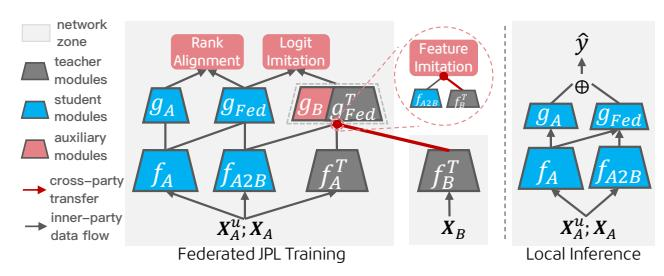
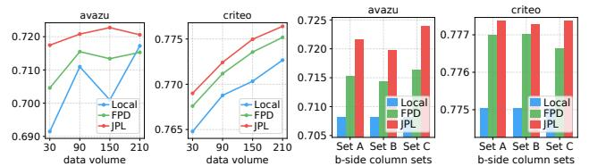

# Vertical Semi-Federated Learning for Efficient Online Advertising

Wenjie Li liwj20@mails.tsinghua.edu.cn Tsinghua Shenzhen International Graduate School, Tsinghua University Shenzhen, China Meituan Shanghai, China

Shu-Tao Xia∗ xiast@sz.tsinghua.edu.cn Tsinghua Shenzhen International Graduate School, Tsinghua University Shenzhen, China

Jiangke Fan Teng Zhang Xingxing Wang 811268232@qq.com zhangteng09@meituan.com wangxingxing04@meituan.com Meituan Shanghai, China

### Abstract

Traditional vertical federated learning schema suffers from two main issues: 1) restricted applicable scope to overlapped samples and 2) high system challenge of real-time federated serving, which limits its application to advertising systems. To this end, we advocate a new practical learning setting, Semi-VFL (Vertical Semi-Federated Learning), for real-world industrial applications, where the learned model retains sufficient advantages of federated learning while supporting independent local serving. To achieve this goal, we propose the carefully designed Joint Privileged Learning framework (JPL) to i) alleviate the absence of the passive party's feature with federated equivalence imitation and ii) adapt to the heterogeneous full sample space with cross-branch rank alignment. Extensive experiments conducted on real-world advertising datasets validate the effectiveness of our method over baseline methods.

## CCS Concepts

### • Information systems → Online advertising.

# Keywords

Advertising; Vertical Federated Learning; Knowledge Distillation

### ACM Reference Format:

Wenjie Li, Shu-Tao Xia, Jiangke Fan, Teng Zhang, and Xingxing Wang. 2026. Vertical Semi-Federated Learning for Efficient Online Advertising. In Proceedings of the ACM Web Conference 2026 (WWW '26), April 13–17, 2026, Dubai, United Arab Emirates. ACM, New York, NY, USA, [4](#page-3-0) pages. <https://doi.org/10.1145/3774904.3792940>

# 1 Introduction

Vertical Federated Learning (VFL) [\[6\]](#page-3-1) has emerged as a proactive solution [\[4,](#page-3-2) [7,](#page-3-3) [11\]](#page-3-4) for leveraging cross-platform user data to enhance recommendation and advertising performance, while preserving privacy and complying with regulations. Specifically, in a typical two-party VFL setting[\[1\]](#page-3-5), There is an active party A who holds labels and part of the features and a passive party B who provides additional features. They each privately hold a portion of the model

Table 1: The spectrum of different learning settings. Semi-VFL maximizes data usage while supporting local inference. (variables of unaligned samples are denoted by ��, ��/�� denotes for party field set.)

and jointly train a federated model by communicating only hidden features and the corresponding gradients. In this way, Party A can leverage additional data fields from the B-side to improve its own task performance while preserving privacy.

Despite its promise, two main drawbacks hinders its deployment in practical scenarios. (1) Restricted scope on overlapped data: Vanilla VFL trains and serves only overlapped users, who typically constitute a small portion of the population. This limits information richness during training and prevents non-overlapped users from benefiting at all. As a result, the active party has little incentive to deploy a high-cost distributed learning system that yields limited returns, especially when a simpler local model can already serve all users more cost-efficiently. (2) High-cost distributed serving: The distributed nature of VFL introduces extra latency from cross-party data transmission and poses engineering challenges due to heterogeneous network and computational conditions. While such overhead is tolerable during offline training, it becomes nearly infeasible for online inference, where advertising systems demand both high throughput and strict real-time latency (millions of QPS and 10–100 ms per request [\[9\]](#page-3-6)). These constraints make VFL deployment in production prohibitively expensive.

These limitations reveal the need for a practical learning framework that can leverage all labeled data while supporting local inference for all users. We term this paradigm Semi-VFL (Vertical Semi-Federated Learning) to highlight its partially federated nature. Since ideal VFL is often impractical to deploy, the goal of Semi-VFL is to outperform vanilla local models. Notably, An effective Semi-VFL solution must address two key challenges: (1) Alleviating field missing: preserving and generalizing passive-party field knowledge from federated training to local inference is essential for maintaining the advantages of VFL; (2) Adapting to the heterogeneous full sample space: effectively combining the imbalanced field information of overlapped and non-overlapped samples is crucial for achieving consistent gains across all users. Several recent studies explore integrating unaligned data or imputing B-side missing fields in the latent space [\[3,](#page-3-7) [7\]](#page-3-3), but they mainly aim to improve federated performance rather than support local inference. A few

∗Corresponding author.

[This work is licensed under a Creative Commons Attribution Inter](https://creativecommons.org/licenses/by/4.0/)[national 4.0 License.](https://creativecommons.org/licenses/by/4.0/)

WWW '26, Dubai, United Arab Emirates © 2026 Copyright held by the owner/author(s). ACM ISBN 979-8-4007-2307-0/2026/04 <https://doi.org/10.1145/3774904.3792940>

denotes the probability ��(��ˆ�� &gt; ��ˆ��) modeled by a logistic function ��(·). The POM is organized according to the label space:

R = R ++ R +− (R +−) ⊤ R −− , (6)

where the superscripts "+" and "–" indicate label categories of the compared pairs, e.g., R +− = {������ | �� ∈ Y+ , �� ∈ Y− }. The PRC loss for overlapped samples is formulated as:

L ��←�� �������� = ∥R ++ �� − ��(R ++ ������ ) ∥�� ∥��(R ++ ������ ) ∥�� + ∥R −− �� − ��(R −− ������ ) ∥�� ∥��(R −− ������ ) ∥�� − ∥R +− �� ∥�� ,

where ��(·) denotes the stop-gradient operation, and the subscripts "A" and "Fed" refer to the local and federated heads, respectively. The first two terms reduce intra-class ranking discrepancies between the heads (with frozen gradients on the federated head) and normalize by label scale, while the last term fits the fixed cross-class rank. For non-overlapped data, the PRC loss follows the same formulation but reverses the alignment direction as L��←�� �������� . Finally, the predictions from both heads are fused by averaging logits ��ˆ = ��(��ˆ��/2+��ˆ������ /2).

Putting all together, we get the overall learning objective:

L (X �� ) = L ��←�� �������� + �� · L���� �� �� + L���� ���� (7)

L (X��) = L ��←�� �������� + �� · L�� �� �� + L���� ���� + L���� ���� (8)

where �� is set to control the impact of feature imitation.

### 3 Experiments

### 3.1 Experimental Settings

3.1.1 Datasets. We evaluate our method on two widely used public CTR prediction datasets, Criteo and Avazu under a VFL data partition setting as in [\[5\]](#page-3-8). Specifically, for Avazu, both parties hold 11 feature fields, while for Criteo, the active and passive parties have 19 and 20 fields, respectively. We respectively construct 6, 1 and 1 million samples for training validation and testing. Following [\[3\]](#page-3-7), we select earlier half data to construct non-overlapped samples.

3.1.2 Baselines and Evaluation Setting. We compare our approach against four baselines: (1) Local. A local model is trained solely on the active party's features. A qualified Semi-VFL method is expected to outperform this baseline. (2) FPD [\[5,](#page-3-8) [8\]](#page-3-9). These pioneering works first train a federated model on overlapped samples and then distill logit knowledge into a local model, thus we collectively refer to them as FPD (federated privileged distillation) methods. In our implementation, the training objective is defined as L�� ���� = L�� ���� + (1−��)L�� ���� +��L�� ����, where �� denotes the distillation strength. (3) FedUD\* [\[7\]](#page-3-3). FedUD leverages unaligned samples by generating passive-side representations using a pre-trained crossparty feature transfer encoder. Since the original method does not support local inference, we modify it to employ the transfer encoder for both aligned and unaligned samples. (4) FedCVT\* [\[3\]](#page-3-7). This method leverages unaligned samples during training by imputing B-side hidden representations from aligned samples' B-side features using its similarity-based mechanism. It effectively learns implicit A-to-B transferable knowledge that can exploit unaligned samples. However, this imputation is not applicable under local inference. Although originally designed for the full VFL scenario, we modify it to use only classifier A's output, making it a comparable baseline for local inference. Following [\[11\]](#page-3-4), we implement an efficient, fast

version of this method. We report AUC and logloss results of all baselines evaluated on All sample group under the local inference mode, where only local fields are available during inference.

3.1.3 Implementation Details. For the model structure, as our method is orthogonal to architecture design, we use a two 512-unit dnn layer as bottom model and a single output layer as bootom model by default. We report extra results on other archetectures in Table [4.](#page-3-10) For training, we use the Adam optimizer with ��2 regularization. In all experiments, the default learning rate and L2 regularization strength are both 0.001, and the batch size is 10��. The distillation strength for FPD is chosen from �� ∈ 0.1, 0.5, 1. For FedCVT, the regularization strength of the feature imputation module is selected from 0.1, 0.5, 1, and the maximum auxiliary aligned data queue size is 20K. For FedUD, both the regularization ratio of the transfer encoder and the loss weight of unaligned samples are searched over 0.1, 0.5, 1. For JPL, the feature imitation loss ratios �� are set according to their magnitudes (e.g., {0.1, 0.5, 1} for L�� �� �� and {100, 500, 1000} for L���� �� �� ). The same teacher model is used for all distillation-based methods. We tune hyper-parameters for all methods and report the best result.

### 3.2 Results

3.2.1 Overall Performance. The main results in Table [2](#page-3-11) lead to three key observations. (1) JPL achieves the strongest overall performance on both Avazu and Criteo, across all settings (overall, unaligned, and aligned), it can improves the Local model up to +0.0110 ∼ 0.0025 on overall AUC respectively. on Avazu dataset, Its performance on aligned dataset can even outperform the federated teacher model, confirming its capability of integrating advantage from both sample space and field space. (2) Distillationbased methods (FPD and JPL) consistently outperform Local on all subsets, showing that directly transferring the teacher's knowledge into independent local model yields stable and reliable gains. (3) Adapted federated methods (FedUD and FedCVT) generally show unsatisfactory performance, with only occasional improvements (e.g., FedCVT on Avazu reaches the second-best overall AUC), indicating unstable adaptation to heterogeneous sample distributions. This is reasonable because these methods are not tailored for Semi-VFL. Although they consider transferring federated feature knowledge during training, they neither fully support cross-party knowledge transfer based solely on A-side features nor effectively combine information from the full sample space.

3.2.2 Ablation Study. To evaluate the contribution of each component in JPL, we conduct an ablation study reported in Table [3.](#page-3-12) The three rows present the performance after individually removing each module. (1) The results show that all components contribute positively, as removing any of them leads to a noticeable performance drop compared with the overall results in Table [2.](#page-3-11) (2) Removing the logit imitation loss produces the largest degradation, followed by rank alignment and then feature imitation. This is expected since logit imitation provides the most direct supervisory signal by aligning both labels and teacher logits, while feature imitation plays a more auxiliary, intermediate role. The clear benefit

Table 2: The overall results on all sample subsets. Typically, an AUC increase of 0.001 can be considered a significant in CTR Prediction[\[12\]](#page-3-13).

| Method Fed | AUC ↑ \ | overall Logloss ↓ \ | AUC ↑ \ | Avazu unaligned Logloss ↓ \ | AUC ↑ 0.7082 | aligned Logloss ↓ 0.3768 | AUC ↑ \ | overall Logloss ↓ \ | Criteo AUC ↑ \ | unaligned Logloss ↓ \ | AUC ↑ 0.7844 | aligned Logloss 0.4644 |
|------------|---------|---------------------|---------|-----------------------------|--------------|--------------------------|---------|---------------------|----------------|-----------------------|--------------|------------------------|
| Local      | 0.7082  | 0.3654              | 0.7172  | 0.3505                      | 0.6992       | 0.3803                   | 0.7750  | 0.4684              | 0.7768         | 0.2332                | 0.7734       | 0.2352                 |
| FPD        | 0.7103  | ✿✿✿✿                |         |                             |              |                          |         |                     |                |                       |              |                        |
|            |         | 0.3611              | 0.7166  | ✿✿✿✿                        |              |                          |         |                     |                |                       |              |                        |
|            |         |                     |         | 0.3476                      | 0.7037       | 0.3746                   | ✿✿✿✿✿   |                     |                |                       |              |                        |
|            |         |                     |         |                             |              |                          | 0.7764  | ✿✿✿✿                |                |                       |              |                        |
|            |         |                     |         |                             |              |                          |         | 0.4672              | ✿✿✿✿✿          |                       |              |                        |
|            |         |                     |         |                             |              |                          |         |                     | 0.7785         | ✿✿✿✿                  |              |                        |
|            |         |                     |         |                             |              |                          |         |                     |                | 0.2326                | ✿✿✿✿✿        |                        |
|            |         |                     |         |                             |              |                          |         |                     |                |                       | 0.7746       | ✿✿✿✿✿                  |
| FedUD*     | 0.7055  | 0.3708              | 0.7129  | 0.3587                      | 0.6982       | 0.3829                   | 0.7711  | 0.4712              | 0.7728         | 0.4695                | 0.7694       | 0.4729                 |
| FedCVT*    | ✿✿✿✿✿   |                     |         |                             |              |                          |         |                     |                |                       |              |                        |
|            | 0.7145  | 0.3616              | ✿✿✿✿✿   |                             |              |                          |         |                     |                |                       |              |                        |
|            |         |                     | 0.7195  | 0.3498                      | ✿✿✿✿✿        |                          |         |                     |                |                       |              |                        |
|            |         |                     |         |                             | 0.7089       | ✿✿✿✿                     |         |                     |                |                       |              |                        |
|            |         |                     |         |                             |              | 0.3735                   | 0.7653  | 0.4776              | 0.7674         | 0.4752                | 0.7634       | 0.4800                 |
| JPL        | 0.7207  | 0.3597              | 0.7279  | 0.3468                      | 0.7127       | 0.3725                   | 0.7775  | 0.4667              | 0.7794         | 0.2324                | 0.7758       | 0.2343                 |

Table 3: Component Ablation Study. Removing any component leads to a performance drop, indicating each module' necessity.

|     |       | Method | overall | Avazu unaligned | aligned | overall | Criteo unaligned | aligned |
|-----|-------|--------|---------|-----------------|---------|---------|------------------|---------|
| w/o | logit | imit.  | 0.6996  | 0.7149          | 0.6855  | 0.7659  | 0.7683           | 0.7637  |
| w/o | feat  | imit.  | 0.7149  | 0.7230          | 0.7067  | 0.7750  | 0.7772           | 0.7729  |
| w/o | rank  | align  | 0.7068  | 0.7161          | 0.6972  | 0.7757  | 0.7777           | 0.7737  |

Figure 2: Impact of non-overlapped data volume (left) and the passive party's field set (right). JPL maintains consistent advantage.

of rank alignment suggests that the two heads capture complementary information, allowing mutual ranking guidance and logit ensembling to enhance overall performance.

3.2.3 Impact of Data Volume and Field Amount. As shown in Figure [2\(](#page-3-14)left), we conducted experiments on datasets with decreasing proportions of unaligned samples: 70%, 50%, 30%, and 10%. It shows that incorporating more unaligned data generally leads to a performance increase, while the advantage of distillation remains consistent across different data volumes. While in Figure [2\(](#page-3-14)right), we vary the field sets by using 25%, 50%, and 75% of the fields (Sets A, B, and C) to assess robustness across field configurations. Note that due to differences in field importance and vocabulary distributions, more fields do not necessarily implies better input information. The results show that our method consistently outperforms both Local and FPD across all configurations. Since the Local model is unaffected by this operation, its performance bars remain identical.

3.2.4 Effectiveness across Different Architectures. To evaluate the generalizability of our framework to different backbone architectures, we design two variants of Local, FPD and JPL based on DeepFM [\[2\]](#page-3-15) and DCN [\[10\]](#page-3-16). These architectures are applied to the student's local bottom model, and new students are trained while keeping the teacher model unchanged. As shown in Table [4,](#page-3-10) JPL consistently demonstrates superior performance, validating the effectiveness of our framework under heterogeneous teacher–student setups and across various local model architectures.

# 4 Conclusion

This paper presents a Joint Privileged Learning (JPL) framework for vertical semi-federated advertising. JPL introduces federated equivalence imitation to mitigate field-missing issues and crosshead rank alignment to enable efficient knowledge fusion across

Table 4: Architectures Compatibility Study. The consistent advantage of JPL confirms its generalizability and effectiveness when integrated with diverse network architectures.

| Backbone Method | overall | Avazu unaligned | aligned | overall | Criteo unaligned | aligned |
|-----------------|---------|-----------------|---------|---------|------------------|---------|
| Local           | 0.7088  | 0.7168          | 0.7012  | 0.7748  | 0.7767           | 0.7731  |
| FPD DCN         | 0.7133  | 0.7218          | 0.7039  | 0.7772  | 0.7793           | 0.7752  |
| JPL             | 0.7190  | 0.7270          | 0.7105  | 0.7780  | 0.7800           | 0.7760  |
| Local           | 0.7118  | 0.7184          | 0.7057  | 0.7764  | 0.7784           | 0.7746  |
| FPD DeepFM      | 0.7126  | 0.7195          | 0.7054  | 0.7777  | 0.7795           | 0.7760  |
| JPL             | 0.7220  | 0.7296          | 0.7138  | 0.7782  | 0.7801           | 0.7765  |

full-sample and full-field spaces. Extensive experiments on two widely used CTR datasets validated its effectiveness and rationality.

### Acknowledgments

This work is supported in part by the National Natural Science Foundation of China under Grant 62571298. Thanks to Tencent Rhino-bird Elite Talent Program for the early start of this project.

### References

[1] Iker Ceballos, Vivek Sharma, Eduardo Mugica, Abhishek Singh, Alberto Roman, Praneeth Vepakomma, and Ramesh Raskar. 2020. SplitNN-driven Vertical Partitioning. CoRR abs/2008.04137 (2020). arXiv[:2008.04137](https://arxiv.org/abs/2008.04137) [2] Huifeng Guo, Ruiming Tang, Yunming Ye, Zhenguo Li, and Xiuqiang He. 2017. DeepFM: a factorization-machine based neural network for CTR prediction. In IJCAI 2017. [3] Yan Kang, Yang Liu, and Xinle Liang. 2022. FedCVT: Semi-supervised Vertical Federated Learning with Cross-view Training. ACM Transactions on Intelligent Systems and Technology (TIST) 13, 4 (2022), 1–16. [4] Wenjie Li, Zhongren Wang, Jinpeng Wang, Shu-Tao Xia, Jile Zhu, Mingjian Chen, Jiangke Fan, Jia Cheng, and Jun Lei. 2024. ReFer: retrieval-enhanced vertical federated recommendation for full set user benefit. In SIGIR 2024. [5] Wenjie Li, Qiaolin Xia, Junfeng Deng, Hao Cheng, Jiangming Liu, Kouying Xue, Yong Cheng, and Shu-Tao Xia. 2022. Semi-Supervised Cross-Silo Advertising with Partial Knowledge Transfer. arXiv preprint arXiv:2205.15987 (2022). [6] Yang Liu, Yan Kang, Tianyuan Zou, Yanhong Pu, Yuanqin He, Xiaozhou Ye, Ye Ouyang, Ya-Qin Zhang, and Qiang Yang. 2024. Vertical federated learning: Concepts, advances, and challenges. IEEE transactions on knowledge and data engineering 36, 7 (2024), 3615–3634. [7] Wentao Ouyang, Rui Dong, Ri Tao, and Xiangzheng Liu. 2024. FedUD: exploiting unaligned data for cross-platform federated click-through rate prediction. In SIGIR 2024. [8] Zhenghang Ren, Liu Yang, and Kai Chen. 2022. Improving Availability of Vertical Federated Learning: Relaxing Inference on Non-overlapping Data. ACM Transactions on Intelligent Systems and Technology (TIST) (2022). [9] Jianqiang Shen, Burkay Orten, Sahin Cem Geyik, Daniel Liu, Shahriar Shariat, Fang Bian, and Ali Dasdan. 2015. From 0.5 million to 2.5 million: Efficiently scaling up real-time bidding. In ICDM. IEEE, 973–978. [10] Ruoxi Wang, Bin Fu, Gang Fu, and Mingliang Wang. 2017. Deep & Cross Network for Ad Click Predictions. In Proceedings of ADKDD '17. [11] Penghui Wei, Hongjian Dou, Shaoguo Liu, Rongjun Tang, Li Liu, Liang Wang, and Bo Zheng. 2023. Fedads: A benchmark for privacy-preserving cvr estimation with vertical federated learning. In SIGIR 2023. [12] Guorui Zhou, Xiaoqiang Zhu, Chenru Song, Ying Fan, Han Zhu, Xiao Ma, Yanghui Yan, Junqi Jin, Han Li, and Kun Gai. 2018. Deep interest network for click-through rate prediction. In KDD 2018.