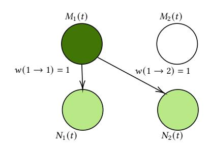
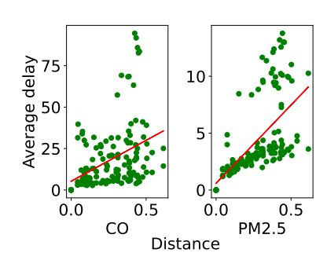
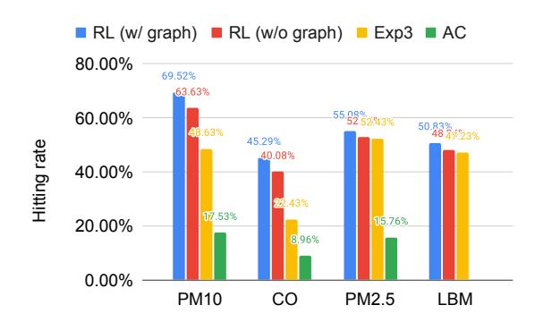

# How Graphs Can Help You Stay Informed in an Evolving World

MohammadHossein Bateni∗ Google New York, New York, USA bateni@google.com

Lin Chen Google New York, New York, USA linche@google.com

Hossein Esfandiari Google London, United Kingdom esfandiari@google.com

Sasan Tavakkol Google Los Angeles, California, USA tavakkol@google.com

### Abstract

This study investigates the problem of keeping information upto-date when crawling data sources that change over time (e.g., websites or location data). Traditional crawling methods often treat data sources independently, making it difficult to capture relationships and propagate updates efficiently. We propose using graph structures to model these relationships and show that, unfortunately, finding the theoretically optimal solution can be intractable. To address this, we introduce a specific graphical model (the latent Bernoulli process model) and demonstrate the complexity of even simple tasks within this framework. We tackle the crawling problem using a reinforcement learning-based algorithm and demonstrate its superiority over traditional baselines on both real and synthetic data. This work highlights the power of graph-structured crawling in helping users stay informed within a dynamic information landscape.

### CCS Concepts

- Information systems → Web crawling.

### Keywords

graph-structured crawling; web crawling; reinforcement learning; information freshness; latent bernoulli process

### ACM Reference Format:

MohammadHossein Bateni, Lin Chen, Hossein Esfandiari, and Sasan Tavakkol. 2026. How Graphs Can Help You Stay Informed in an Evolving World. In Proceedings of the ACM Web Conference 2026 (WWW '26), April 13–17, 2026, Dubai, United Arab Emirates. ACM, New York, NY, USA, [4](#page-3-0) pages. <https://doi.org/10.1145/3774904.3792942>

### 1 Introduction

In traditional supervised active learning [\[6,](#page-3-1) [12,](#page-3-2) [18,](#page-3-3) [19\]](#page-3-4), labels are static. However, in many real-world problems, information changes over time, requiring entities to be "crawled" to keep knowledge up-to-date [\[2](#page-3-5)[–5,](#page-3-6) [14,](#page-3-7) [15,](#page-3-8) [17\]](#page-3-9). This "crawling problem" is fundamental to web search engines caching the latest pages and to geographical

∗Authors are listed in alphabetical order.

© 2026 Copyright held by the owner/author(s). ACM ISBN 979-8-4007-2307-0/2026/04 <https://doi.org/10.1145/3774904.3792942>

Parks change hours

in winter

Restaurants do not change hours

Figure 1: An example of how parks, which are strongly connected to each other, may change their hours collectively during the winter season, while restaurants, which are not as strongly connected to parks but are strongly connected among themselves, may not change their hours during the winter.

platforms (e.g., Google Maps, Yelp, etc.) tracking the changing opening hours of locations like parks, which may change seasonally or due to unexpected events.

Previous studies often treat these objects as independent, but this is generally not true. For example, when breaking news occurs, the web pages of most mainstream media outlets report it, causing a group of news websites to update their pages at the same time. Similarly, during a pandemic, parks in a certain area are likely to change their hours together or at the beginning of winter, it is common for parks to change their hours. In Figure 1, we provide an example of how parks, which have strong connections with each other, may change their hours together during the winter season, while restaurants, which are not as strongly connected to parks but are strongly connected to each other, may not change their hours during the winter.

Intuitively, provided that an object updates, its neighbors on the graph have an increased probability of an update. In this work, we propose using a graph structure to model these interactions. Our main contributions are: We formally define the problem of graph-structured crawling and show that learning in the worst case is impossible in polynomial time. We then introduce the latent Bernoulli process model (LBM), show that selecting the best object is #P-complete, and analyze the exponential complexity of its dynamic programming solution. Finally, we propose a scalable reinforcement learning (RL) based algorithm that outperforms strong

[This work is licensed under a Creative Commons Attribution 4.0 International License.](https://creativecommons.org/licenses/by/4.0) WWW '26, Dubai, United Arab Emirates

maximizes the expected reward E [��(��,�� + 1) | ����−1] at the final step.

Theorem 2. The SBO problem is #P-complete, even when ��(�� → ��) ∈ {0, 1} for every pair of objects ��, �� and ��(���� , ��) = 1 for all �� ∈ [�� ].

A standard dynamic programming approach (Algorithm 1) to find the optimal policy for a finite horizon �� is intractable. The randomness is determined by ��(|�� | 2�� ) Bernoulli random variables. Computing the probability ���� (��) (Line 2) requires summing over all combinations of these variables, leading to an intractable exponential time complexity of ��(2 |�� | 2���� |�� |). This motivates our scalable, approximate solution.

### Algorithm 1 Dynamic Programming at the ��-th step (DP�� )

Input: ����−1 = {(���� , ����)}1≤��≤��−1 1: for all �� ∈ �� , �� ∈ {0, 1} do 2: ��1 (��) ← Pr(���� = 1 | ����−1, ���� = ��); ��0 (��) ← 1 − ��1 (��) 3: if �� &lt; �� then ���� (��) ← DP��+1 (����−1, ���� = ��, ���� = ��) 4: else���� (��) ← 0 5: end if 6: end for 7: �� ← arg max��∈�� ��1 (��) (1 + ��1 (��)) + ��0 (��) (0 + ��0 (��)) 8: return �� and the maximum value ����

### 4 Reinforcement Learning-Based Crawler

Given the intractability of the optimal DP solution, we propose a reinforcement learning-based (RL-based) algorithm. We define the state space as S = S �� node, the Cartesian product of the state spaces of all objects. We divide the state space Snode of a single object into two components Snode = Shistory × Sgraph where Shistory denotes the history-encoding state and Sgraph denotes the graph-encoding state. We present two versions of the RL-based algorithm: one using both history and graph states, and one (for comparison) using only history. We want to show that the graphical structure can improve performance by exploiting the intuition that neighboring objects update concurrently.

Designing graph-encoding state. The graph state Sgraph can be encoded in several ways, such as using graph embeddings, the object's row in the adjacency matrix, or a vector of distances to all other objects.

Designing history-encoding state. We design the historyencoding state Shistory = {0, 1} × N × N ×R×R. This 5-dimensional vector tracks: (1) whether the object has ever been queried; (2) the time elapsed since the last query that resulted in an update; (3) the time elapsed since the last query that resulted in no update; and (4, 5) two features representing recent query outcomes, which are set to a high value (e.g., 100) on a query and decay over time. In our proposed RL-based approach, we utilize the double Deep Q-Network (double DQN) algorithm [\[20\]](#page-3-13). The discount value is set to �� = 0.7, and we use a two-layer neural network with widths of 75 and 40 as our Q network and the target Q network.

## 5 Numerical Studies

Datasets. We evaluate our RL-based algorithm for graph-structured crawling on the Beijing air quality dataset [\[22\]](#page-3-14), visiting monitoring sites to track PM10, CO, and PM2.5 values. We also examine the proposed RL-based method on the latent Bernoulli model using a graph structure generated by an Erdős-Rényi model.

Verification of Intuition behind Graph-Structured Crawling. We aim to verify the intuition that updates in an object's neighbors are likely to occur following an update in the object. To test this, we use the Beijing Multi-Site Air-Quality Dataset. For each pair of monitoring sites �� and ��, we measure the delay in transferring an update from �� to �� by calculating the time difference between an update at �� and the next update at ��. We then compute the average delay for each pair of sites and plot a scatter plot in Figure [3,](#page-2-2) with the horizontal coordinate representing the distance between the sites and the vertical coordinate representing the average delay. A regression line is also plotted. The results show a positive correlation between distance and average delay, indicating that updates in closer sites are more likely to occur simultaneously.

Figure 3: A scatter plot illustrating the correlation between the average delay in transferring updates and the distance between monitoring sites in the Beijing Multi-Site Air-Quality Dataset. The left and right panels depict the results for updates of CO and PM2.5 respectively, when the threshold is exceeded. A regression line is also shown, which demonstrates a positive correlation between the distance and average delay, thus supporting the intuition behind graph-structured crawling.

Performance Evaluation of Crawling Algorithms. We compare the RL-based algorithm to two baseline algorithms: Exp3 [\[1,](#page-3-15) [16\]](#page-3-16), an adversarial bandit algorithm, and a variant of the active covering algorithm (AC) [\[12\]](#page-3-2). Since the original AC assumes static labels, our variant restarts the algorithm periodically once all objects have been queried. For the Beijing Multi-Site Air-Quality Dataset, the graph-encoding state is the site's distance from all other sites. We use the first 34000 records for training and evaluate on the following 1000 records. For the latent Bernoulli model, we use the corresponding row in the adjacency matrix. To evaluate performance, we calculated their hitting rates (the percentage of queries that find an update). We present the results in Figure [4](#page-3-17) and Table [1.](#page-3-18) The performance of our RL-based algorithm is dominant, consistently outperforming all baselines across all tasks. The advantage is particularly stark in the real-world PM10 and CO tasks, where our full model (RL w/ graph) achieves 69.5% and 45.3% hitting rates, respectively, eclipsing the strong Exp3 baseline (48.6% and

Figure 4: The chart illustrates the performance comparison of the RL-based algorithm with the baselines in terms of hitting rate. The LBM column represents the results for the latent Bernoulli model.

22.4%). To isolate the value of the graph structure, we also evaluated an ablation (RL w/o graph). This model, which uses our novel state representation without graph data, still significantly outperforms Exp3 (63.6% vs 48.6% on PM10). The further improvement to 69.5% when adding the graph confirms that both our state design and the graph structure contribute substantial value. All RL and Exp3 methods strongly outperformed the AC variant. Our method also achieved the highest performance on the synthetic LBM data, confirming its robustness.

| Task  | RL (w/ graph) | RL (w/o | graph) Exp3 | AC     |
|-------|---------------|---------|-------------|--------|
| PM10  | 69.52%        | 63.63%  | 48.63%      | 17.53% |
| CO    | 45.29%        | 40.08%  | 22.43%      | 8.96%  |
| PM2.5 | 55.08%        | 52.85%  | 52.43%      | 15.76% |
| LBM   | 50.83%        | 48.24%  | 47.23%      | –      |

Table 1: Hitting rate of the RL-based algorithms and the baselines. The LBM rows represent the results for the latent Bernoulli model.

### 6 Related Work

Cho and Garcia-Molina [\[7,](#page-3-19) [8\]](#page-3-20) proposed refresh policies, studying their effectiveness with two freshness metrics and a Poisson process change model. Cho and Garcia-Molina [\[9\]](#page-3-21) focused on estimating the Poisson rate within this model. Azar et al. [\[2\]](#page-3-5) formalized the optimization problem of finding a stationary policy under request rate and utility models, aiming for optimal freshness. Han et al. [\[11\]](#page-3-22) used five base crawling algorithms (including [\[2\]](#page-3-5)) and employed multi-armed bandit methods to select the best algorithm at each crawling step. Kolobov et al. [\[15\]](#page-3-8) extended the results of Azar et al. [\[2\]](#page-3-5)) by considering politeness constraints on request rates. For a web crawling survey, see Olston et al. [\[17\]](#page-3-9). While seemingly similar, [\[21\]](#page-3-23) focused on mirroring online social networks for data collection, not tracking online content updates. [\[10\]](#page-3-24) investigated agent movement within a growing web graph, a distinct problem.

### 7 Conclusion

We studied crawling in dynamic environments. We proposed a graph structure to model object relationships and capture influence. Learning the structure was intractable in polynomial time. We introduced the latent Bernoulli process model, but even selecting the best object was #P-complete. We analyzed a dynamic programming solution, highlighting its exponential complexity. This theoretical analysis motivated our proposed reinforcement learning-based algorithm, which we evaluated on real and synthetic data, showing it outperforms strong baselines. Real data analysis confirmed our intuition about graph-structured correlations.

### References

[1] Peter Auer, Nicolo Cesa-Bianchi, Yoav Freund, and Robert E Schapire. 1995. Gambling in a rigged casino: The adversarial multi-armed bandit problem. In Proceedings of IEEE 36th annual foundations of computer science. IEEE, 322–331. [2] Yossi Azar, Eric Horvitz, Eyal Lubetzky, Yuval Peres, and Dafna Shahaf. 2018. Tractable near-optimal policies for crawling. Proceedings of the National Academy of Sciences 115, 32 (2018), 8099–8103. [3] Melih Bastopcu and Sennur Ulukus. 2020. Information freshness in cache updating systems. IEEE Transactions on Wireless Communications 20, 3 (2020), 1861–1874. [4] Melih Bastopcu and Sennur Ulukus. 2020. Who should Google scholar update more often?. In IEEE INFOCOM 2020-IEEE Conference on Computer Communications Workshops (INFOCOM WKSHPS). IEEE, 696–701. [5] Melih Bastopcu and Sennur Ulukus. 2021. Age of information for updates with distortion: Constant and age-dependent distortion constraints. IEEE/ACM Transactions on Networking 29, 6 (2021), 2425–2438. [6] Lin Chen, Hamed Hassani, and Amin Karbasi. 2017. Near-optimal active learning of halfspaces via query synthesis in the noisy setting. In Thirty-First AAAI Conference on Artificial Intelligence. [7] Junghoo Cho and Hector Garcia-Molina. 2000. Synchronizing a database to improve freshness. ACM sigmod record 29, 2 (2000), 117–128. [8] Junghoo Cho and Hector Garcia-Molina. 2003. Effective page refresh policies for web crawlers. ACM Transactions on Database Systems (TODS) 28, 4 (2003), 390–426. [9] Junghoo Cho and Hector Garcia-Molina. 2003. Estimating frequency of change. ACM Transactions on Internet Technology (TOIT) 3, 3 (2003), 256–290. [10] Colin Cooper and Alan Frieze. 2002. Crawling on web graphs. In Proceedings of the thiry-fourth annual ACM symposium on Theory of computing. 419–427. [11] Shuguang Han, Michael Bendersky, Przemek Gajda, Sergey Novikov, Marc Najork, Bernhard Brodowsky, and Alexandrin Popescul. 2020. Adversarial Bandits Policy for Crawling Commercial Web Content. In Proceedings of The Web Conference 2020. 407–417. [12] Heinrich Jiang and Afshin Rostamizadeh. 2021. Active Covering. In International Conference on Machine Learning. PMLR, 5013–5022. [13] Daphne Koller and Nir Friedman. 2009. Probabilistic graphical models: principles and techniques. MIT press. [14] Andrey Kolobov, Sébastien Bubeck, and Julian Zimmert. 2020. Online learning for active cache synchronization. In International Conference on Machine Learning. PMLR, 5371–5380. [15] Andrey Kolobov, Yuval Peres, Eyal Lubetzky, and Eric Horvitz. 2019. Optimal freshness crawl under politeness constraints. In Proceedings of the 42nd International ACM SIGIR Conference on Research and Development in Information Retrieval. 495–504. [16] Tor Lattimore and Csaba Szepesvári. 2020. Bandit algorithms. Cambridge University Press. [17] Christopher Olston, Marc Najork, et al. 2010. Web crawling. Foundations and Trends® in Information Retrieval 4, 3 (2010), 175–246. [18] Burr Settles. 2012. Active learning. Synthesis lectures on artificial intelligence and machine learning 6, 1 (2012), 1–114. [19] Simon Tong. 2001. Active learning: theory and applications. Stanford University. [20] Hado Van Hasselt, Arthur Guez, and David Silver. 2016. Deep reinforcement learning with double q-learning. In Proceedings of the AAAI conference on artificial intelligence, Vol. 30. [21] Shaozhi Ye, Juan Lang, and Felix Wu. 2010. Crawling online social graphs. In 2010 12th International Asia-Pacific Web Conference. IEEE, 236–242. [22] Shuyi Zhang, Bin Guo, Anlan Dong, Jing He, Ziping Xu, and Song Xi Chen. 2017. Cautionary tales on air-quality improvement in Beijing. Proceedings of the Royal Society A: Mathematical, Physical and Engineering Sciences 473, 2205 (2017), 20170457.