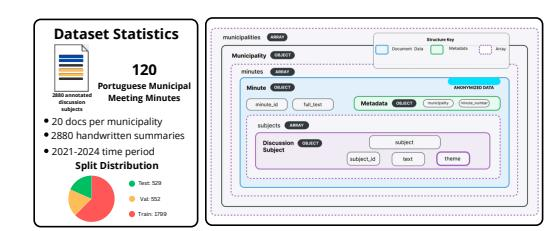
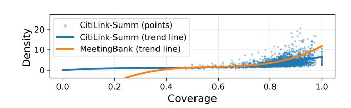

# CitiLink-Summ: A Dataset of Discussion Subjects Summaries in European Portuguese Municipal Meeting Minutes

[Miguel Marques](https://orcid.org/0009-0002-7934-0173)∗ INESC TEC Porto, Portugal miguel.alexandre.marques@ubi.pt

[Ana Luísa Fernandes](https://orcid.org/0009-0009-0552-3904)† INESC TEC Porto, Portugal ana.l.fernandes@inesctec.pt

[Ana Filipa Pacheco](https://orcid.org/0009-0003-6135-8479)† INESC TEC Porto, Portugal ana.f.pacheco@inesctec.pt

[Rute Rebouças](https://orcid.org/0000-0002-8213-1068)† INESC TEC Porto, Portugal rute.reboucas@inesctec.pt

[Inês Cantante](https://orcid.org/0009-0002-3866-4550)† INESC TEC Porto, Portugal ines.cantante@inesctec.pt

[José Isidro](https://orcid.org/0009-0000-6071-9138)† INESC TEC Porto, Portugal jose.m.isidro@inesctec.pt

[Luís Filipe Cunha](https://orcid.org/0000-0003-1365-0080)† INESC TEC Porto, Portugal luis.f.cunha@inesctec.pt

[Alípio Jorge](https://orcid.org/0000-0002-5475-1382)† INESC TEC Porto, Portugal alipio.jorge@inesctec.pt

[Nuno Guimarães](https://orcid.org/0000-0003-2854-2891)‡† INESC TEC Porto, Portugal nuno.r.guimaraes@inesctec.pt

[Sérgio Nunes](https://orcid.org/0000-0002-2693-988X)† INESC TEC Porto, Portugal sergio.nunes@inesctec.pt

[António Leal](https://orcid.org/0000-0002-6198-2496)† University of Macau Macau, China antonioleal@um.edu.mo

[Purificação Silvano](https://orcid.org/0000-0001-8057-5338)† INESC TEC Porto, Portugal purificacao.silvano@inesctec.pt

[Ricardo Campos](https://orcid.org/0000-0002-8767-8126)∗ INESC TEC Porto, Portugal ricardo.campos@ubi.pt

## Abstract

Municipal meeting minutes are formal records documenting the discussions and decisions of local government, yet their content is often lengthy, dense, and difficult for citizens to navigate. Automatic summarization can help address this challenge by producing concise summaries for each discussion subject. Despite its potential, research on summarizing discussion subjects in municipal meeting minutes remains largely unexplored, especially in low-resource languages, where the inherent complexity of these documents adds further challenges. A major bottleneck is the scarcity of datasets containing high-quality, manually crafted summaries, which limits the development and evaluation of effective summarization models for this domain. In this paper, we present CitiLink-Summ, a new corpus of European Portuguese municipal meeting minutes, comprising 120 documents and 2,880 manually hand-written summaries, each corresponding to a distinct discussion subject. Leveraging this

[This work is licensed under a Creative Commons Attribution 4.0 International License.](https://creativecommons.org/licenses/by/4.0) WWW '26, Dubai, United Arab Emirates © 2026 Copyright held by the owner/author(s). ACM ISBN 979-8-4007-2307-0/2026/04 <https://doi.org/10.1145/3774904.3792945>

dataset, we establish baseline results for automatic summarization in this domain, employing state-of-the-art generative models (e.g., BART, PRIMERA) as well as large language models (LLMs), evaluated with both lexical and semantic metrics such as ROUGE, BLEU, METEOR, and BERTScore. CitiLink-Summ provides the first benchmark for municipal-domain summarization in European Portuguese, offering a valuable resource for advancing NLP research on complex administrative texts.

#### CCS Concepts

•Information systems→Summarization;• Computing methodologies → Natural language processing; Language resources.

### Keywords

Text Summarization, Municipal Meeting Minutes, European Portuguese, Natural Language Processing, Language Resources

#### ACM Reference Format:

Miguel Marques, Ana Luísa Fernandes, Ana Filipa Pacheco, Rute Rebouças, Inês Cantante, José Isidro, Luís Filipe Cunha, Alípio Jorge, Nuno Guimarães, Sérgio Nunes, António Leal, Purificação Silvano, and Ricardo Campos. 2026. CitiLink-Summ: A Dataset of Discussion Subjects Summaries in European Portuguese Municipal Meeting Minutes. In Proceedings of the ACM Web Conference 2026 (WWW '26), April 13–17, 2026, Dubai, United Arab Emirates. ACM, New York, NY, USA, [4](#page-3-0) pages.<https://doi.org/10.1145/3774904.3792945>

∗Also with University of Beira Interior.

†Also with Universidade do Porto.

‡Corresponding author.

#### 1 Introduction

Municipalities produce large volumes of textual information through meeting minutes. Although these documents are essential for transparency and accountability, they are often lengthy, highly formal, and segmented into multiple discussion subjects, making them difficult for citizens to navigate. In this context, automatic text summarization (ATS) has become increasingly relevant for improving citizens' access to public information, enabling them to understand the main topics of the minutes without reading them in full. Despite progress in ATS, meeting summarization remains inherently challenging, as noted by Singh et al. [\[21\]](#page-3-1): models must detect key topics, interpret the intent behind discussions, and filter out irrelevant information, all within a highly domain-specific context. These challenges are amplified in under-resourced languages such as European Portuguese, where both datasets and high-quality summaries in texts of administrative nature are scarce [\[1\]](#page-3-2), limiting the development of effective summarization methods in this domain.

In this work, we present a new summarization corpus for European Portuguese, consisting of manually hand-written summaries of discussion subjects, from 120 municipal meeting minutes collected from six Portuguese Municipalities (Alandroal, Campo Maior, Covilhã, Fundão, Guimarães and Porto), covering the 2021-2024 administrative term. Each minute was first manually segmented into discussion subjects, and subsequently summarized by a team of four annotators with a linguistics background under the supervision of two expert linguists, following guidelines specifically developed for this project. The resulting corpus comprises 2,880 summaries, each corresponding to a discussion subject. The summarization process followed three phases (pre-writing, writing, and evaluation) to ensure the quality of the produced summaries. In addition, sensitive data was anonymized to preserve privacy.

The main contributions of this work are threefold: 1) the creation of a new, domain-specific dataset in European Portuguese, comprising manually written summaries of discussion subjects from municipal meeting minutes; 2) baseline results using state-of-theart encoder-decoder models (e.g., BART, PRIMERA) and LLMs (e.g., Gemini) evaluated with both lexical and semantic metrics; and 3) the release of all resources, including the corpus, the summarization guidelines, a dataset sample, and reproducibility code, publicly available on GitHub[1](#page-1-0) .

### 2 Related Work

Automatic text summarization (ATS) follows the fundamental principles of summary writing, aiming to produce a shorter text that preserves the essential information of the original. Approaches to ATS are generally classified as extractive, which selects salient sentences from the original text, or abstractive, which generate new text while maintaining the main ideas [\[11\]](#page-3-3), with some studies adopting hybrid strategies [\[19\]](#page-3-4). While summarization has been widely applied in domains such as medicine, law, journalism, and scientific literature [\[8\]](#page-3-5), meeting-related documents represent a particularly challenging domain due to their length, structured nature, and the need to capture multiple discussion topics. This has motivated the creation of specialized datasets to support research on meeting summarization, including MeetingBank [\[13\]](#page-3-6), ICSI [\[14\]](#page-3-7), and

Figure 1: Dataset Statistics and JSON Schema.

AMI [\[6\]](#page-3-8). MeetingBank is built from city-council meeting transcripts and provides professionally edited abstractive summaries aligned to shorter meeting segments, totaling 6,892 segment-level summarization instances. ICSI contains transcripts from 75 meetings, each approximately one hour long, while AMI comprises 100 hours of recorded meetings with detailed annotations, including speaker turns and both extractive and abstractive summaries [\[5\]](#page-3-9). Beyond English, Shirafuji et al. [\[20\]](#page-3-10) studied summarization of Japanese assembly minutes, and Nedoluzhko et al. [\[17\]](#page-3-11) introduced a Czech parliamentary meetings dataset with abstractive summaries aligned to entire sessions. These resources demonstrate the growing interest in meeting-related documents summarization and highlight the lack of comparable datasets in other languages and administrative contexts. While they focus primarily on transcripts, municipal meeting minutes differ in that they are lengthy, highly formal administrative documents that record the outcomes of complex meeting-subject discussions, mixing essential decisions with extended contextual material of varying relevance, rather than the interactions themselves. To the best of our knowledge, Citilink-Summ is the first dataset of discussion-subject summaries derived from municipal meeting minutes in European Portuguese. It also introduces the first benchmark for summarization in this domain, providing a solid foundation for future research in this under-resourced language variety.

## 3 The CitiLink-Summ Dataset

The CitiLink-Summ dataset was built from Portuguese municipal meeting minutes and is designed to support segment-level summarization, with each segment corresponding to a distinct discussion subject. The dataset comprises 120 municipal meeting minutes written in European Portuguese, covering the 2021–2024 administrative term. It includes minutes from six municipalities: Alandroal, Campo Maior, Covilhã, Fundão, Guimarães and Porto, for which authorized access to official records was obtained. All minutes were collected, manually segmented into discussion subjects, and subsequently annotated with handwritten summaries. Sensitive information was manually de-identified to ensure privacy. In total, the dataset contains 2,880 discussion-subject segments, which were divided into training (60%), validation (20%) and test (20%) sets using a random split within each municipality while preserving a proportional distribution across municipalities. An overview of dataset statistics and the JSON schema is shown in Figure [1.](#page-1-1) The dataset follows a hierarchical structure beginning with a collection of municipalities, each containing multiple municipal meeting minutes. Every minute includes the full document text along with metadata, such as the municipality identifier and meeting number. Within each minute,

1<https://github.com/INESCTEC/citilink-summ>

Figure 2: Overall relationship between coverage and density.

a list of discussion subjects is provided, where each segment is represented by an object containing a unique identifier, the subject text and theme, as it makes part of a bigger annotation schema [\[4\]](#page-3-12). To minimize subjectivity and ensure consistency across summaries, annotators followed strict guidelines and textual templates. The summarization workflow adopted builds on established practices [\[10\]](#page-3-13) and consists of several steps, which we briefly outline below.

Four annotators, PhD students in Linguistics with substantial annotation experience, supervised by two expert linguists, were responsible for manually handwriting the summaries[2](#page-2-0) . For each discussion-subject segment, annotators first read the full segment carefully, re-reading whenever necessary to ensure complete understanding, and then defined the theme of the discussion subject. Next, they identified the segment's main idea and expressed it concisely, preferably in their own words, while ensuring that the summary preserved the essential information without becoming vague or overly detailed. A draft summary was produced and subsequently revised by the annotator. In the final stage, annotators evaluated each summary according to five predefined parameters, including relevance, cohesion, coherence, and length. Summaries that did not achieve the maximum score in any parameter were revised and rewritten, returning to the previous stage. Once a summary reached the highest score across all parameters, it was deemed complete. This careful multi-stage annotation process not only ensured high-quality summaries but also intentionally shaped their level of abstraction, a key aspect given that higher abstraction generally increases the difficulty for models to generate accurate outputs. By enforcing multiple revisions, strict quality controls, and clear guidelines, annotators were encouraged to reformulate and condense information rather than simply extract text, thereby mitigating the challenges associated with high abstraction.

To quantify this effect, we analyzed the level of abstraction in the produced summaries, providing insights into the linguistic transformations required to generate high-quality summaries and highlighting the challenges posed by the dataset. Two commonly used metrics quantify abstraction by measuring reused text: Coverage and Density [\[12\]](#page-3-14). Coverage calculates the fraction of summary tokens that appear in the source text, while Density captures the extent to which a summary consists of contiguous extractive fragments [\[13\]](#page-3-6). As shown in Figure [2,](#page-2-1) CitiLink-Summ exhibits low Density and medium-to-high Coverage, similar to other meetingrelated datasets such as MeetingBank, whose trend line is shown in orange. This indicates that while summaries reuse vocabulary

from the source, they rarely rely on long extractive spans, remaining largely abstractive and requiring substantial reformulation to preserve key information.

### 4 Benchmark Evaluation

To establish reference benchmarks for CitiLink-Summ, we evaluated several state-of-the-art summarization models, fine-tuning them on our dataset to obtain comparative results. The summarization pipeline comprises three main stages: (i) chunking; (ii) model selection and fine-tuning; and (iii) evaluation of the generated summaries. In the first stage, lightweight chunking was applied. Due to the limited context window of the language models (256-2048 tokens), each discussion-subject was divided hierarchically using a sliding-window chunking approach. Each discussion subject was split into smaller chunks, summarized individually, and aggregated to form the final segment-level summary.

Formally, each instance in CitiLink-Summ consists of a discussion subject ��, and its associated theme ��. While the manually written summaries were produced with knowledge of the theme, the benchmark models are evaluated using only the discussion-subject text. It is important to note that, although this represents a conceptual limitation compared to the annotation process, it reflects the practical goal of generating summaries without dependencies beyond the text itself. Consequently, the reported results represent a lower-bound performance, and do not fully capture potential improvements achievable if models had access to the additional contextual information provided to the annotators.

For benchmark evaluation, we selected pre-trained encoderdecoder models commonly used in abstractive summarization, including BART and BART Large [\[15\]](#page-3-15), PTT5 [\[7\]](#page-3-16), LED [\[3\]](#page-3-17), and PRI-MERA [\[22\]](#page-3-18), which were fine-tuned to adapt to the terminology of our corpus, and are expected to internalize additional data-specific patterns that are not explicitly present in the reference summaries. In addition, we evaluated two large generative models, Qwen2.5- 1.5B-Instruct (open source) and Gemini-2.5-flash (closed source), using few-shot prompting, to compare the performance of traditional fine-tuned summarizers with modern foundation models. The models were evaluated using several metrics known to be reliable quality indicators for summarization tasks [\[9\]](#page-3-19). Particularly, to capture model performance comprehensively, we employed both lexical and semantic metrics. Lexical metrics, such as ROUGE [\[16\]](#page-3-20), BLEU [\[18\]](#page-3-21), and METEOR [\[2\]](#page-3-22), measure token and n-gram overlap with the reference summaries, with METEOR additionally accounting for stemming and synonymy to better align linguistically. Semantic metrics, such as BERTScore [\[23\]](#page-3-23), evaluate contextual similarities, complementing lexical metrics by assessing semantic preservation that purely word-level comparisons may miss.

Table [1](#page-3-24) reports the results of all selected models and evaluation metrics on CitiLink-Summ, providing a benchmark for future research on European Portuguese municipal meeting summarization. The results demonstrate that the chosen models are capable of producing abstractive summaries with coherent information, although their performance indicates that there is still considerable room for improvement. As expected, larger models, such as PRIMERA, BART large, and Gemini, achieved the highest scores across all metrics. Although the absolute scores remain moderate, the models

2The full summarization guidelines are available on our GitHub repository.

Table 1: Performance of summarization models on the CitiLink-Summ dataset using lexical and semantic metrics. Model ROUGE BLEU + METEOR BERTSCORE R-1 R-2 R-L BLEU METEOR F1 PREC RECALL BART 63.52 49.22 58.20 36.06 55.15 83.87 84.59 83.37 BART Large 68.96 54.78 63.64 42.43 61.65 86.28 86.57 86.15 PTT5 52.36 38.21 45.26 23.65 46.44 76.90 76.12 78.15 LED 63.63 50.50 58.59 29.82 54.88 84.16 85.70 82.91 PRIMERA 66.17 54.57 61.94 29.06 57.05 85.79 87.10 84.79 Qwen2.5-1.5B 44.24 31.06 38.80 07.16 31.79 74.49 77.75 71.83 Gemini-2.5-flash 64.16 48.94 55.97 28.40 54.34 83.09 82.99 83.19 exhibit consistent behavior across metrics, suggesting that they can serve as a solid foundation for future work aimed at improving summarization quality for municipal meeting minutes. 5 Conclusions In this paper, we introduce the first dataset benchmark for the abstractive text summarization of discussion subjects from municipal meeting minutes in European Portuguese, addressing the lack of resources for this under-explored task. In addition, we provide baseline models for this task, with the evaluation demonstrating the potential of current summarization techniques in this challenging context. Notably, larger models like PRIMERA achieved the best overall performance across most metrics, showing that state-of-the-art approaches can be effectively applied to municipal meeting minutes. These contributions establish a foundation for research on Portuguese municipal-domain summarization. Future work will focus on expanding the corpus, incorporating human evaluations to ensure the generated summaries meet standards of clarity and accuracy, and exploring approaches that leverage theme information to further improve performance. Additionally, we plan to release an English version of the dataset to increase accessibility and enable cross-lingual research. The dataset is publicly released to support the development of more advanced models and foster research in this under-resourced language. Ultimately, this resource is expected to facilitate the creation of practical summarization systems, improving the accessibility and transparency of municipal decision-making for the general public. Acknowledgments This work is funded by national funds through FCT – Fundação para a Ciência e a Tecnologia, I.P., under the support UID/50014/2025 [\(https://doi.org/10.54499/UID/50014/2025\)](https://doi.org/10.54499/UID/50014/2025). The authors would also like to acknowledge the project CitiLink, with reference 2024.07509 IACDC [\(https://doi.org/10.54499/2024.07509.IACDC\)](https://doi.org/10.54499/2024.07509.IACDC). References [1] Ruben Almeida and Evelin Amorim. 2024. A Legal Framework for Natural Language Model Training in Portugal. In Proceedings of the Workshop on Legal and Ethical Issues in Human Language Technologies @ LREC-COLING 2024, Ingo Siegert and Khalid Choukri (Eds.). ELRA and ICCL, Torino, Italia, 6–12. [https:](https://aclanthology.org/2024.legal-1.2/) [//aclanthology.org/2024.legal-1.2/](https://aclanthology.org/2024.legal-1.2/) [2] Satanjeev Banerjee and Alon Lavie. 2005. METEOR: An automatic metric for MT evaluation with improved correlation with human judgments. In Proceedings of the ACL Workshop on Intrinsic and Extrinsic Evaluation Measures for Machine Translation and/or Summarization. 65–72. [3] Iz Beltagy, Matthew E. Peters, and Arman Cohan. 2020. Longformer: The longdocument transformer. arXiv preprint arXiv:2004.05150 (2020). [4] Ricardo Campos, Ana Filipa Pacheco, Ana Luísa Fernandes, Inês Cantante, Rute Rebouças, Luís Filipe Cunha, José Isidro, José Evans, Miguel Marques, Rodrigo Batista, Evelin Amorim, Alípio Jorge, Nuno Guimarães, Sérgio Nunes, António Leal, and Purificação Silvano. 2025. CitiLink-Minutes: A Multilayer Annotated Dataset of Municipal Meeting Minutes. [doi:10.25747/7KG6-1K22](https://doi.org/10.25747/7KG6-1K22) [5] J. Carletta. 2006. Announcing the AMI Meeting Corpus. The ELRA Newsletter 11, 1 (January–March 2006), 3–5. [6] Jean Carletta, Mark Ashby, Jérémy Boudy, John Garofalo, Dafydd Gibbon, Stefan Götz, Thomas Hain, Jun He, John Hough, Bernhard Krenn, Lori Lamel, Johanna Moore, David O'Neill, Conor O'Riordan, Steve Renals, Shane Rickard, Peter Robinson, Stephanie Seneff, and Paul Taylor. 2006. The AMI Meeting Corpus. Retrieved September 17, 2025 from<https://groups.inf.ed.ac.uk/ami/corpus/> [7] Diedre Carmo, Marcos Piau, Israel Campiotti, Rodrigo Nogueira, and Roberto Lotufo. 2020. PTT5: Pretraining and validating the T5 model on Brazilian Portuguese data. arXiv e-prints, Article arXiv:2008.09144 (Aug. 2020), arXiv:2008.09144 pages. arXiv[:2008.09144](https://arxiv.org/abs/2008.09144) [cs.CL] [doi:10.48550/arXiv.2008.09144](https://doi.org/10.48550/arXiv.2008.09144) [8] Noam Dahan and Gabriel Stanovsky. 2025. The State and Fate of Summarization Datasets: A Survey. In Proceedings of the 2025 Conference of the Nations of the Americas Chapter of the Association for Computational Linguistics: Human Language Technologies (Volume 1: Long Papers), Luis Chiruzzo, Alan Ritter, and Lu Wang (Eds.). Association for Computational Linguistics, Albuquerque, New Mexico, 7259–7278. [doi:10.18653/v1/2025.naacl-long.372](https://doi.org/10.18653/v1/2025.naacl-long.372) [9] Alexander R. Fabbri, Wojciech Kryściński, Bryan McCann, Caiming Xiong, Richard Socher, and Dragomir Radev. 2021. SummEval: Re-evaluating Summarization Evaluation. Transactions of the Association for Computational Linguistics 9 (2021), 391–409. [doi:10.1162/tacl\\_a\\_00373](https://doi.org/10.1162/tacl_a_00373) [10] Rosalie Friend. 2002. Summing it up. The Science Teacher 69, 4 (2002), 40. [11] Nikolaos Giarelis, Charalampos Mastrokostas, and Nikos Karacapilidis. 2023. Abstractive vs. Extractive Summarization: An Experimental Review. Applied Sciences 13, 13 (2023), 7620. [doi:10.3390/app13137620](https://doi.org/10.3390/app13137620) [12] Max Grusky, Mor Naaman, and Yoav Artzi. 2018. Newsroom: A Dataset of 1.3 Million Summaries with Diverse Extractive Strategies. In Proceedings of the 2018 Conference of the North American Chapter of the Association for Computational Linguistics: Human Language Technologies, Volume 1 (Long Papers), Marilyn Walker, Heng Ji, and Amanda Stent (Eds.). Association for Computational Linguistics, New Orleans, Louisiana, 708–719. [doi:10.18653/v1/N18-1065](https://doi.org/10.18653/v1/N18-1065) [13] Yebowen Hu, Timothy Ganter, Hanieh Deilamsalehy, Franck Dernoncourt, Hassan Foroosh, and Fei Liu. 2023. MeetingBank: A Benchmark Dataset for Meeting Summarization. In Proceedings of the 61st Annual Meeting of the Association for Computational Linguistics (ACL). Association for Computational Linguistics, Toronto, Canada.<https://aclanthology.org/2023.acl-long.906/> [14] Adam Janin, Don Baron, Jane Edwards, Dan Ellis, David Gelbart, Nelson Morgan, Barbara Peskin, Thilo Pfau, Elizabeth Shriberg, Andreas Stolcke, and Chuck Wooters. 2003. The ICSI Meeting Corpus. Retrieved September 17, 2025 from <https://www.ee.columbia.edu/~dpwe/pubs/icassp03-janin.pdf> [15] Mike Lewis, Yinhan Liu, Naman Goyal, Marjan Ghazvininejad, Abdelrahman Mohamed, Omer Levy, Veselin Stoyanov, and Luke Zettlemoyer. 2019. BART: Denoising sequence-to-sequence pre-training for natural language generation, translation, and comprehension. arXiv preprint arXiv:1910.13461 (2019). [16] Chin-Yew Lin. 2004. ROUGE: A package for automatic evaluation of summaries. In Text Summarization Branches Out: Proceedings of the ACL-04 Workshop. 74–81. [17] Anna Nedoluzhko, Muskaan Singh, Marie Hledíková, Tirthankar Ghosal, and Ondřej Bojar. 2022. ELITR Minuting Corpus: A Novel Dataset for Automatic Minuting from Multi-Party Meetings in English and Czech. In Proceedings of the Thirteenth Language Resources and Evaluation Conference. European Language Resources Association, Marseille, France, 3174–3182. [https://aclanthology.org/](https://aclanthology.org/2022.lrec-1.340/) [2022.lrec-1.340/](https://aclanthology.org/2022.lrec-1.340/) [18] Kishore Papineni, Salim Roukos, Todd Ward, and Wei-Jing Zhu. 2002. BLEU: a method for automatic evaluation of machine translation. In Proceedings of the 40th Annual Meeting of the Association for Computational Linguistics. 311–318. [19] Rakshitha, Pushpa Mohan, M B Shanthi, D N Disha, and Sudesh Rao. 2023. Advances in Natural Language Processing and Deep Learning for Document Summarization. In 2023 International Conference on Integrated Intelligence and Communication Systems (ICIICS). 1–6. [doi:10.1109/ICIICS59993.2023.10421343](https://doi.org/10.1109/ICIICS59993.2023.10421343) [20] Daiki Shirafuji, Hiromichi Kameya, Rafal Rzepka, and Kenji Araki. 2020. Summarizing Utterances from Japanese Assembly Minutes using Political Sentence-BERTbased Method for QA Lab-PoliInfo-2 Task of NTCIR-15. [doi:10.48550/arXiv.2010.](https://doi.org/10.48550/arXiv.2010.12077) [12077](https://doi.org/10.48550/arXiv.2010.12077) [21] Manpreet Singh, Tirthankar Ghosal, and Ondřej Bojar. 2021. An Empirical Analysis of Text Summarization Approaches for Automatic Minuting. In Proceedings of the 35th Pacific Asia Conference on Language, Information and Computation. [22] Wen Xiao and Giuseppe Carenini. 2022. PRIMERA: Pyramid-based masked sentence pre-training for multi-document summarization. In Proceedings of the 60th Annual Meeting of the Association for Computational Linguistics (ACL). [23] Tianyi Zhang, Varsha Kishore, Felix Wu, Kilian Q. Weinberger, and Yoav Artzi. 2020. BERTScore: Evaluating text generation with BERT. In International Conference on Learning Representations (ICLR).

| Model            | R-1   | ROUGE R-2 | R-L   | BLEU BLEU | + METEOR METEOR | F1    | BERTSCORE PREC | RECALL |
|------------------|-------|-----------|-------|-----------|-----------------|-------|----------------|--------|
| BART             | 63.52 | 49.22     | 58.20 | 36.06     | 55.15           | 83.87 | 84.59          | 83.37  |
| BART Large       | 68.96 | 54.78     | 63.64 | 42.43     | 61.65           | 86.28 | 86.57          | 86.15  |
| PTT5             | 52.36 | 38.21     | 45.26 | 23.65     | 46.44           | 76.90 | 76.12          | 78.15  |
| LED              | 63.63 | 50.50     | 58.59 | 29.82     | 54.88           | 84.16 | 85.70          | 82.91  |
| PRIMERA          | 66.17 | 54.57     | 61.94 | 29.06     | 57.05           | 85.79 | 87.10          | 84.79  |
| Qwen2.5-1.5B     | 44.24 | 31.06     | 38.80 | 07.16     | 31.79           | 74.49 | 77.75          | 71.83  |
| Gemini-2.5-flash | 64.16 | 48.94     | 55.97 | 28.40     | 54.34           | 83.09 | 82.99          | 83.19  |

