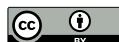

# Multi-Modal Enhanced Graph Transfer Learning for Digital Finance Fraud Detection

Yuxin Liu University of California, Riverside Riverside, USA

Stephen Chan American University of Sharjah Sharjah, UAE

Jeffrey Chu Renmin University of China Beijing, China

Yuanyuan Zhang University of Manchester Manchester, UK

Chenguang Yang University of California, Riverside Riverside, USA

Zihao Wang The University of Tennessee at Chattanooga Chattanooga, USA

Yulia R. Gel Virginia Tech Blacksburg, USA

Yuzhou Chen University of California, Riverside Riverside, USA

# Abstract

Fraudulent activities on blockchain networks threaten the integrity and reliability of decentralized finance ecosystems. Accurately identifying malicious nodes such as phishing or ransomware addresses, within large-scale blockchain transaction graphs remains a critical challenge due to their dynamic, sparse, and continuously evolving topologies. Transfer learning offers a powerful paradigm for fraud detection because many fraudulent schemes, including ransomware and phishing, are often orchestrated by overlapping actor groups that share behavioral and structural patterns across networks. Leveraging these shared representations enables knowledge transfer from previously observed fraud types to emerging ones. However, the complex and multi-modal nature of digital financial systems introduces substantial challenges for graph-based transfer learning. Fraudulent activities are shaped by diverse modalities including graph structure, transaction sequences, temporal price dynamics, and textual metadata, while distributional shifts frequently occur across time and platforms. Existing graph transfer learning methods struggle to model such multi-modal dependencies and to align divergent feature distributions. To tackle these challenges, we develop a Multi-mOdal Enhanced Graph Transfer Learning (MOE-GTL) framework which incorporates graph, temporal, and textual modalities for fraudulent node detection. We further introduce Temporal-aware Maximum Mean Discrepancy (TMMD), a regularization mechanism that explicitly aligns multimodal feature distributions between source and target graphs over time. Extensive experiments reveal that our MOE-GTL model notably improves the accuracy of fraudulent node classifications on Ethereum and Solana transaction graphs. Our codes are publicly available at [https://github.com/yl3564/MOE-GTL.](https://github.com/yl3564/MOE-GTL)

# CCS Concepts

### • Computing methodologies → Multi-modal learning.

[This work is licensed under a Creative Commons Attribution 4.0 International License.](https://creativecommons.org/licenses/by/4.0) WWW '26, Dubai, United Arab Emirates © 2026 Copyright held by the owner/author(s). ACM ISBN 979-8-4007-2307-0/2026/04 <https://doi.org/10.1145/3774904.3792946>

### Keywords

Multi-modal graph learning, blockchains, graph transfer learning

#### ACM Reference Format:

Yuxin Liu, Stephen Chan, Jeffrey Chu, Yuanyuan Zhang, Chenguang Yang, Zihao Wang, Yulia R. Gel, and Yuzhou Chen. 2026. Multi-Modal Enhanced Graph Transfer Learning for Digital Finance Fraud Detection. In Proceedings of the ACM Web Conference 2026 (WWW '26), April 13–17, 2026, Dubai, United Arab Emirates. ACM, New York, NY, USA, [4](#page-3-0) pages. [https://doi.org/10.1145/](https://doi.org/10.1145/3774904.3792946) [3774904.3792946](https://doi.org/10.1145/3774904.3792946)

# 1 Introduction

The rapid adoption of blockchains such as Ethereum and Solana has disrupted the digital finance landscape. Their unique infrastructures support a wide range of financial activities, including decentralized exchanges, automated market-making, and digital asset transfers. Despite this, the pseudonymous and immutable nature of blockchain transactions leaves users exposed to various digital frauds [\[5\]](#page-3-1), which undermine overall trust in decentralized finance (DeFi) [\[13\]](#page-3-2). In this setting, fraud detection is challenging due to the evolving structures of blockchain graphs [\[1,](#page-3-3) [14,](#page-3-4) [18\]](#page-3-5) and limited labeled data. Existing studies show satisfactory detection, but struggle to generalize when existing and new frauds lead to varying and unique structural and behavioral characteristics vary [\[2,](#page-3-6) [4,](#page-3-7) [6,](#page-3-8) [8\]](#page-3-9) such as Ethereum phishing and Solana rug-pull frauds. This highlights the need for approaches capable of accommodating heterogeneous graph structures and integrating information beyond raw transactional features. Recent progress in graph transfer learning and multi-modal representation learning has opened new opportunities for improving fraud detection performance in blockchain networks [\[4,](#page-3-7) [6\]](#page-3-8). Nevertheless, existing transfer learning frameworks often overlook the multi-modal nature of digital finance ecosystems, which include temporal price movements, evolving liquidity flows, and contextual signals embedded in blockchain-related news. Moreover, discrepancies in feature distributions between source and target graphs remain a major obstacle, especially when fraudulent behavior manifests differently across platforms. Addressing these gaps requires methods that can jointly model graph structure, temporal dynamics, and textual context while aligning heterogeneous node representations across networks. In this paper, we propose a Multi-mOdal Enhanced Graph Transfer Learning (MOE-GTL) framework that integrates structural, temporal, and textual modalities to improve cross-platform fraud detection in Ethereum and Solana transaction graphs. Our approach introduces a TMMD module to mitigate cross-domain distribution shifts and enhance knowledge transfer between heterogeneous blockchain environments. Using extensive experiments on phishing datasets from Ethereum and rug-pull datasets from Solana, we demonstrate that MOE-GTL significantly improves cross-graph classification accuracy compared with existing transfer learning baselines. These findings underscore the value of multi-modal fusion and distribution alignment for advancing fraud detection in dynamic digital finance systems.

### 2 Related Works

Graph Transfer Learning. In graph transfer learning, a model trained on a source graph is adapted for use on a target graph. By transferring knowledge across domains or tasks, this paradigm significantly reduces training cost and improves downstream task performance, and has been widely studied in advancing graph representation learning. Early works [\[9\]](#page-3-10) typically focused on multitask learning settings, using source-domain information to develop graph representations transferable to related tasks in target domains. Beyond single-graph transfer, these studies [\[10\]](#page-3-11) further investigate multi-network learning, aiming to derive node representations that are shared or transferable across multiple graphs or models. The recent focus has been transformed into the domain adaptation. Con-tuning [\[7\]](#page-3-12) fine-tune the pretrained GNNs by generating graph-level templates for each class and incorporating them into a supervised contrastive learning objective. However, these approaches lack integration with multi-modal information and overlook multi-modal interactions. Consequently, there is a pressing need to develop efficient methods for extracting and understanding diverse multi-modal information, thereby enhancing their capabilities in transfer learning.

Digital Financial Fraud Detection. Blockchains have increasingly been modeled and as address graphs (comprising addresses and transactions) [\[1\]](#page-3-3), but their decentralization and evolving structures mean fraud detection is not trivial. Recently, the introduction of non-fungible tokens (NFTs) and DeFi, has led to fraud detection being widely studied in the Ethereum blockchain using graph neural network (GNN) models. On Ethereum, [\[12\]](#page-3-13) proposes a graph embedding algorithm, GTN2Vec, that accounts for both behavioral patterns of money launderers and structural information from the transaction network. In contrast, few studies have extended beyond Ethereum to other blockchains such as Solana, which may be attributed to the limited datasets available. [\[16\]](#page-3-14) introduces a customized transformer for anomaly detection called BlockScan and shows that it can detect anomalous Solana transactions with high accuracy. However, most studies of Ethereum and Solana at most account for transactional and graph features, while few works incorporate multi-modal information beyond the address graphs.

# 3 Preliminaries

Consider a graph G = {V, E}, where V = {��1, ��2, . . . , ��N } is the set of N nodes and E ⊆ V × V is an edge set. Let N × N-matrix �� with entries ����,�� ≠ 0 for any ����,�� ∈ E and ����,�� = 0, otherwise, be an adjacency matrix of G. �� ∈ R N×�� denotes node features where �� is the number of features (in our study, each node is associated with a 4-dimensional feature vector (i.e., �� = 4), including transaction frequency as buyer and seller, and transaction amount as buyer and seller), and ���� denotes features of node ��. �� = [��1, . . . , ��N] is a one-hot embedding matrix denoting class labels. In blockchain transaction graph data, each blockchain address is labeled as either phishing or normal. In this paper, our main objective is to develop a graph transfer learning model for the month-to-month node classification from a source graph G to a target graph G .

#### 4 Methodology

We propose a multi-modal enhanced graph transfer learning framework that integrates multi-modal modeling with transaction graphs, participant-wise time-series data, and financial news and temporalaware maximum mean discrepancy (TMMD)-based approach for node (i.e., participant) representation learning. Specifically, our framework is composed of four core components: (i) Fine-grained Temporal Encoder (FTE), (ii) News-based Global-aware Encoder (NGE), (iii) Multi-modal Fusion Network (MMFN), and (iv) TMMD.

## 4.1 Fine-grained Temporal Encoder

The behavior of participants (whether acting as buyers or sellers) is strongly influenced by the historical price dynamics of blockchains, which serve as the foundation for their transactional decisions and network interactions. However, most existing models that characterize participant behavior primarily rely on transaction frequency and monetary volume, which overlook the underlying market dynamics and temporal dependencies. To address this, we introduce the finegrained temporal encoder (FTE), which facilitates comprehensive node-level temporal information capture. First, for each node (either a buyer or seller) ��, based on ��-th transaction (either purchase or sell; where �� ∈ [1, . . . , ����] and ���� denotes the total number of transactions of node ��), we extract the corresponding past �� daily closed price information, denoted as �� . Then we can obtain the temporal sequence set for node ��, i.e., T�� = [�� 1 , . . . , �� ���� �� ] ∈ R ���� ×��. However, the number of transactions varies across participants, to ensure temporal input information alignment across all nodes, we introduce a Multiple Fine-grained Temporal Adaptive Layer (MFTAL) for both data dimension shrinkage and jointly modeling multiple fine-grained temporal features, which is formulated as T˜ �� = MFTAL(T��) = �� T��, where �� denotes a trainable parameter and the output T˜ �� ∈ R ��. Then we divide the obtained temporal input T˜ = [T˜ 1, . . . , T˜N] ∈ R N×�� into overlapping patches of length ℓ with stride ��. Each patch is linearly projected into a ��-dimensional latent space, and positional embeddings are added to preserve temporal order. The final temporal embedding is formalized as follows:

������������������ = Attn(PositionEncoding(Patching(T˜ ))), (1)

whereAttn(·) is a multi-head self-attention mechanism and ������������������ ∈ N×���� ×�� where ���� = (�� − ℓ)/�� + 1 denotes the number of patches.

# 4.2 News-based Global-aware Encoder

To complement the transaction records, we extract blockchainrelated news data aggregated by Google News, utilizing the GNews

Table 1: Models performance comparison (accuracy in %) on Ethereum data from 2018/01 to 2019/01.

| Method         | 2018/01 | → 2018/02 | 2018/02 | → 2018/03 | 2018/03 | → 2018/04 | 2018/04 | → 2018/05 | 2018/05 | → 2018/06 | 2018/06 | → 2018/07 | 2018/07 | → 2018/08 | 2018/08 | → 2018/09 | 2018/09 | → 2018/10 | 2018/10 | → 2018/11 | 2018/11 | → 2018/12 | 2018/12 | → 2019/01 |
|----------------|---------|-----------|---------|-----------|---------|-----------|---------|-----------|---------|-----------|---------|-----------|---------|-----------|---------|-----------|---------|-----------|---------|-----------|---------|-----------|---------|-----------|
| GRACE ��       | 81.36   | ± 0.50    | 90.02   | ± 0.29    | 83.93   | ± 0.15    | 74.99   | ± 0.40    | 73.27   | ± 0.87    | 77.62   | ± 0.20    | 84.03   | ± 0.31    | 76.21   | ± 1.65    | 71.79   | ± 3.45    | 77.27   | ± 3.59    | 67.43   | ± 1.71    | 68.57   | ± 3.87    |
| AdapterGNN     | 71.00   | ± 2.60    | 83.70   | ± 1.50    | 73.40   | ± 1.30    | 70.20   | ± 0.80    | 69.50   | ± 0.90    | 68.30   | ± 0.90    | 73.60   | ± 2.90    | 60.70   | ± 4.90    | 66.80   | ± 2.80    | 62.30   | ± 8.90    | 41.10   | ± 5.50    | 40.50   | ± 10.50   |
| GTOT-Tuning    | 81.80   | ± 0.43    | 89.23   | ± 0.29    | 84.06   | ± 0.09    | 75.27   | ± 0.52    | 73.83   | ± 0.63    | 77.10   | ± 0.48    | 84.07   | ± 0.23    | 78.10   | ± 0.70    | 77.86   | ± 0.91    | 80.45   | ± 2.11    | 70.29   | ± 1.71    | 72.86   | ± 1.21    |
| GraphLoRA      | 81.10   | ± 0.40    | 89.10   | ± 0.46    | 83.91   | ± 0.29    | 74.48   | ± 1.04    | 73.30   | ± 0.18    | 77.09   | ± 1.07    | 83.94   | ± 0.69    | 77.93   | ± 1.49    | 75.71   | ± 3.24    | 75.91   | ± 8.29    | 65.14   | ± 5.11    | 73.33   | ± 3.91    |
| MOE-GTL (ours) | 82.25   | ± 1.38    | 89.42   | ± 0.38    | 84.14   | ± 0.62    | 75.92   | ± 0.35    | 74.37   | ± 0.90    | 77.95   | ± 1.28    | 84.39   | ± 0.53    | 79.31   | ± 1.49    | 78.21   | ± 0.80    | 84.09   | ± 2.27    | 70.86   | ± 3.73    | 74.76   | ± 3.61    |

Table 2: Models performance comparison (accuracy in %) on Solana data from 2022/10 to 2022/12.

| Method         | 2022/10 | → 2022/11 | 2022/11 | → 2022/12 | 2022/10 | → 2022/12 |
|----------------|---------|-----------|---------|-----------|---------|-----------|
| GRACE ��       | 62.80   | ± 1.10    | 61.55   | ± 3.56    | 64.22   | ± 1.08    |
| AdapterGNN     | 58.20   | ± 1.90    | 66.12   | ± 0.25    | 64.61   | ± 1.37    |
| GTOT-Tuning    | 71.20   | ± 1.10    | 64.85   | ± 0.46    | 65.10   | ± 0.21    |
| GraphLoRA      | 61.47   | ± 0.00    | 65.24   | ± 0.58    | 65.14   | ± 0.50    |
| MOE-GTL (ours) | 65.69   | ± 2.11    | 66.17   | ± 0.41    | 66.07   | ± 0.43    |

Table 3: Ablation studies (accuracy in %).

|         | Method |        | 2018/01 | → 2018/02 | 2018/05 | → 2018/06 | 2018/09 | → 2018/10 |
|---------|--------|--------|---------|-----------|---------|-----------|---------|-----------|
| MOE-GTL |        | (ours) | 82.25   | ± 1.38    | 74.37   | ± 0.90    | 78.21   | ± 0.80    |
| MOE-GTL | w/o    | FTE    | 81.67   | ± 0.96    | 74.31   | ± 0.82    | 77.14   | ± 3.43    |
| MOE-GTL | w/o    | NGE    | 81.62   | ± 0.99    | 74.30   | ± 0.89    | 74.64   | ± 4.45    |
| MOE-GTL | w/o    | MMFN   | 81.40   | ± 1.05    | 73.77   | ± 1.81    | 77.14   | ± 2.33    |
| MOE-GTL | w/o    | TMMD   | 81.51   | ± 0.95    | 74.27   | ± 0.72    | 76.07   | ± 3.70    |

The Ethereum dataset comprises fraudulent transaction records provided by XBlock in graph form, covering the period of 01/01/2018 to 01/19/2019, inclusive, which contains 2,058,528 unique addresses (nodes) and 8,541,503 transactions (edges). Of the total unique addresses, 1,165 (0.06%) are labeled as fraudulent, with the remaining 2,057,363 (99.94%) labeled as non-fraudulent. The Solana dataset comprises fraudulent transaction records from the SolRPDS database by [\[3\]](#page-3-16) derived from 3.69 billion Solana blockchain transactions, covering the period of 10/01/2022 to 01/01/2023, inclusive, which consists of 62,895 suspicious liquidity pools and 22,195 tokens that are indicative of fraud patterns. We adopt a two-layer GAT as the backbone encoder. The GNN is pretrained for 1,000 epochs on the source graph with the hidden dimension fixed to 256 and 512. We apply edge dropping with rate 0.4 and feature masking with rate 0.1. Fine-tuning is performed for 500 epochs on the target graph. For each month in the transfer learning setting, we randomly split the dataset into training (10%), validation (10%), and testing (80%) subsets. The news texts are encoded using a frozen BERT-largeuncased model. The multi-modal branch uses a dropout rate of 0.1. All experiments are conducted on 4 NVIDIA RTX A5000 GPUs with 24GB memory. We use the Adam optimizer, and the learning rate and weight decays are tuned within the range [1�� −5 , 1�� −1 ]. The scaling coefficients �� = [��0, ��1, ��2, ��3] are tuned within the range [0.1, 10.0]. The number of attention heads is set to 4. We compare our method with four state-of-the-art baselines: (i) GRACE�� [\[19\]](#page-3-17), (ii) AadpterGNN [\[11\]](#page-3-18), (iii) GTOT-Tuning [\[17\]](#page-3-19), and (iv) GraphLoRA [\[15\]](#page-3-15).

Findings Tables [1](#page-3-20) and [2](#page-3-21) show results of month-to-month transfer learning on Ethereum and Solana data. Overall, our MOE-GTL shows impressive results on both datasets. On Ethereum data (12 case studies), except 2018/02→2018/03 (but MOE-GTL is still the runner-up), MOE-GTL always outperforms all baselines with average relative gain of 1.12%. On Solana data, it is also clear that the proposed MOE-GTL achieves competitive results. Table [3](#page-3-22) shows the performance of MOE-GTL by removing one of four components we leveraged (i.e., w/o FTE/NGE/MMFN/TMMD). We observe that all lead to consistent drops in performance, indicating that these components are complementary.

#### 6 Conclusion

We have introduced the MOE-GTL framework that unifies transaction graph structures, fine-grained temporal features, and financial news via the multi-modal fusion network and temporal-aware maximum mean discrepancy. The MOE-GTL superior performance has been demonstrated via extensive experiments on two digital finance datasets. In future, we investigate whether the proposed framework can improve the graph-level anomaly detection in digital finance.

## 7 Acknowledgements

J.C. is supported by NSFC grant No. W2433186; S.C is supported by the Faculty Research Grant (FRG23-C) & the Startup Grant 2025 (FSU25-S23) from the Amer. Univ. of Sharjah; Y.G. is supported by U.S. NSF OAC 115094; Y.C. is supported by the WCGEC Seed Research Grant.

### References

- [1] C. G. Akcora, Y. R. Gel, and M. Kantarcioglu. 2022. Blockchain networks: Data structures of bitcoin, monero, zcash, ethereum, ripple, and iota. WIREs Data Min. Knowl. Discov. 12, 1 (2022), e1436. [2] C. G. Akcora, Y. Li, Y. R. Gel, and M. Kantarcioglu. 2020. Bitcoinheist: Topological data analysis for ransomware detection on the bitcoin blockchain. In IJCAI. [3] A. Alhaidari, B. Kalal, B. Palanisamy, and S. Sural. 2025. SolRPDS: A Dataset for Analyzing Rug Pulls in Solana Decentralized Finance. In CODASPY. 293–298. [4] G. Bandarupalli. 2025. The Evolution of Blockchain Security and Examining Machine Learning's Impact on Ethereum Fraud Detection. In ECAI. [5] S. Chan, D. Chandrashekhar, W. Almazloum, Y. Zhang, N. Lord, J. Osterrieder, and J. Chu. 2024. Stylized facts of metaverse non-fungible tokens. Physica A: Statistical Mechanics and its Applications 653 (2024), 130103. [6] Y. Chen, Y. Zhang, S. Chan, J. Chu, and N. Lord. 2025. Multilayer topologyaware graph contrastive learning for fraud detection in the Ethereum transaction network. JRSS-A (09 2025), qnaf135. [7] Y. Duan, J. Liu, S. Chen, and J. Wu. 2024. Contrastive fine-tuning for low-resource graph-level transfer learning. Information Sciences 659 (2024), 120066. [8] Y. Elmougy and L. Liu. 2023. Demystifying fraudulent transactions and illicit nodes in the bitcoin network for financial forensics. In KDD. 3979–3990. [9] X. Han, Z. Huang, B. An, and J. Bai. 2021. Adaptive Transfer Learning on Graph Neural Networks. In KDD. 565–574. [10] M. Jiang. 2021. Cross-Network Learning with Partially Aligned Graph Convolutional Networks. In KDD. 746–755. [11] S. Li, X. Han, and J. Bai. 2024. AdapterGNN: Parameter-efficient fine-tuning improves generalization in gnns. In AAAI, Vol. 38. 13600–13608. [12] J. Liu, C. Yin, H. Wang, X. Wu, D. Lan, L. Zhou, and C. Ge. 2023. Graph Embedding-Based Money Laundering Detection for Ethereum. Electronics 12, 14 (2023), 3180. [13] B. Luo, Z. Zhang, Q. Wang, et al. 2024. AI-powered fraud detection in decentralized finance: A project life cycle perspective. Comput. Surveys 57, 4 (2024), 1–38. [14] D. Ofori-Boateng, I. Segovia Dominguez, C. Akcora, M. Kantarcioglu, and Y. R. Gel. 2021. Topological anomaly detection in dynamic multilayer blockchain networks. In ECML. 788–804. [15] Z.-R. Yang, J. Han, C.-D. Wang, and H. Liu. 2025. GraphLoRA: Structure-Aware Contrastive Low-Rank Adaptation for Cross-Graph Transfer Learning. In KDD. [16] J. Yu, X. Wu, H. Liu, W. Guo, and X. Xing. 2025. BlockScan: Detecting Anomalies in Blockchain Transactions. In NeurIPS. [17] J. Zhang, X. Xiao, L.-K. Huang, Y. Rong, and Y. Bian. 2022. Fine-tuning graph neural networks via graph topology induced optimal transport. In IJCAI. [18] Y. Zhang, S. Chan, N. Lord, J. Chu, H. Yang, D. Chandrashekhar, X. Liao, and
- Q. Li. 2025. Network transitions in the cryptocurrency market: The impact of regional conflicts. Phys. A Stat. Mech. Appl. (2025), 131013. [19] Y. Zhu, Y. Xu, F. Yu, Q. Liu, S. Wu, and L. Wang. 2020. Deep graph contrastive representation learning. In ICML Workshop GRL+.