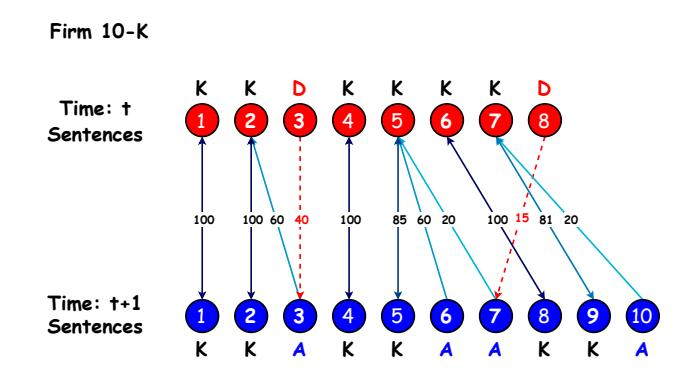
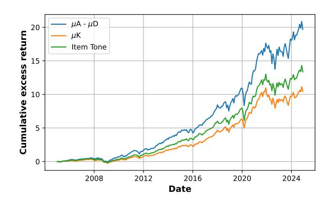

# Edit-Level Tracking of Narrative Changes in 10-K Filings

[Xiao Li](https://orcid.org/0009-0005-6418-2354) School of Computer Science University College Dublin Dublin, Ireland xiao.li@ucdconnect.ie

[Changhong Jin](https://orcid.org/0000-0003-2565-592X) School of Computer Science University College Dublin Dublin, Ireland changhong.jin@ucd.ie

[Yingjie Niu](https://orcid.org/0000-0001-9322-2726) School of Computer Science University College Dublin Dublin, Ireland yingjie.niu@ucdconnect.ie

[Jingyi Wang](https://orcid.org/0009-0007-6112-8373) College of Computer Science Beijing University of Technology Beijing, China jingyiwang@emails.bjut.edu.cn

[Ruihai Dong](https://orcid.org/0000-0002-2509-1370) School of Computer Science University College Dublin Dublin, Ireland ruihai.dong@ucd.ie

# Abstract

The Form 10-K provides a detailed overview of a company's operations, strategies, competitive environment, and future outlook. Investors meticulously analyse annual changes in these reports to identify subtle shifts in disclosed information. However, financial narratives often contain extensive boilerplate text, which dilutes the efficacy of traditional sentiment analysis. We propose a novel edit-level analysis framework to isolate meaningful changes in Management Discussion and Analysis (MD&A) sections of 10-K filings. Using sentence embeddings, we classify each sentence in the filings for years �� and �� + 1 as Kept (repeated boilerplate), Deleted (removed information), and Added (newly introduced information). We then construct a net sentiment change signal from the difference in average FinBERT-tone sentiment between Added and Deleted content. This Core Sentiment measure has been demonstrated to outperform conventional bag-of-words sentiment measures. Furthermore, based on cleaned and standardised 10-K corpora (e.g., EDGAR-CORPUS) and our Flex\_10K pre-processing pipeline, our approach provides a reproducible basis for quantifying changes between annual reports.

# CCS Concepts

- Information systems → Information extraction; Sentiment analysis.

# Keywords

Financial NLP, SEC 10-K filings, Text analysis, Sentence alignment

### ACM Reference Format:

Xiao Li, Changhong Jin, Yingjie Niu, Jingyi Wang, and Ruihai Dong. 2026. Edit-Level Tracking of Narrative Changes in 10-K Filings. In Proceedings of the ACM Web Conference 2026 (WWW '26), April 13–17, 2026, Dubai, United Arab Emirates. ACM, New York, NY, USA, [4](#page-3-0) pages. [https://doi.org/10.1145/](https://doi.org/10.1145/3774904.3792949) [3774904.3792949](https://doi.org/10.1145/3774904.3792949)

[This work is licensed under a Creative Commons Attribution 4.0 International License.](https://creativecommons.org/licenses/by/4.0) WWW '26, Dubai, United Arab Emirates © 2026 Copyright held by the owner/author(s). ACM ISBN 979-8-4007-2307-0/2026/04 <https://doi.org/10.1145/3774904.3792949>

# 1 Introduction

Publicly accessible web repositories, such as the SEC's EDGAR system, contain extensive collections of financial filings, offering a valuable opportunity for large-scale text mining in financial markets. Annual 10-K reports, in particular, are important disclosures that serve as "blueprints" of a company's progress and challenges [\[16\]](#page-3-1). Within each 10-K, the Management Discussion and Analysis (MD&A) section provides a rich narrative from the perspective of company managers, who discuss financial results, risks, and forward-looking plans. Financial analysts and investors are increasingly using textual analysis of MD&A to gain insights beyond the numerical data [\[5,](#page-3-2) [11\]](#page-3-3).

However, the majority of the text remains unchanged from previous years. Approximately 76% of MD&A sentences are repeated from the previous year and contribute little new information [\[4\]](#page-3-4), which obscures the value of new or revised statements [\[9\]](#page-3-5). Boilerplate contamination hinders the informative power of MD&A, and has resulted in two key limitations:

- (1) Dilution effect issue: the noise of stale, outdated, and uninformative 'platitudes' drowns out the actual changed signals, rendering traditional full-text sentiment scores exceedingly faint and ineffective.
- (2) Single score issue: Item-level sentiment scores reduce rich narratives to a single, coarse numerical value. Such scores are unable to track dynamic shifts in sentiment within the MD&A section.

In this study, our approach involves posing two key questions to address these gaps: firstly, "How did the text change?" and secondly, "Which parts of the text changed?" Our approach involves performing a semantic alignment of consecutive MD&A versions at the sentence level. By encoding each sentence with a sentence embedding model and employing bidirectional nearest-neighbour matching, it becomes possible to identify which sentences in the new report correspond to which sentences in last year's report, as well as those that have no counterpart. This process enables a precise classification of each sentence as either Kept (unchanged boilerplate), Deleted (present last year but removed now) or Added (newly added in the current year). Leveraging this granular decomposition, a novel Core Sentiment measure is constructed, defined as the difference in sentiment between the Added and Deleted

content. Intuitively, this measure captures the net change in management's tone: are the new disclosures this year more positive or negative relative to the information that was dropped or deemphasised since last year? In summary, as regulatory filings and corporate disclosures are made available online in ever-growing volume, investors face an information overload analogous to other web content streams. Our study demonstrates the efficacy of using web-scale text data combined with financial natural language processing (FinNLP) algorithms to enhance information extraction and decision-making processes.

# 2 Related Work

# 2.1 Financial Text Analysis and Sentiment

In the early stages of textual analysis in the field of finance, simple dictionary methods had been applied to measure tone and sentiment in company disclosures and news reports. Pioneering work by Tetlock [\[15\]](#page-3-6) showed that negative words in news media can predict stock price movements, spurring interest in text as a quantifiable data source. In the context of annual reports, researchers have observed that off-the-shelf sentiment lexicons are not well-suited to financial jargon. A domain-specific sentiment dictionary tailored for SEC filings has been introduced [\[12\]](#page-3-7), which identifies words that carry positive or negative connotations in finance. Subsequent studies [\[6,](#page-3-8) [8\]](#page-3-9) have demonstrated that the tone of MD&A can serve as a modest predictor of returns and risk, with firms employing more negative language tending to perform worse or face higher costs of capital. However, dictionary-based approaches have limitations in that the context and negation are ignored, and each word is treated independently, resulting in the potential misclassification of nuanced sentences. Recent advances have employed pre-trained language models to address these issues. FinBERT [\[1\]](#page-3-10) is a BERTbased model that has been further trained on financial corpora, achieving higher accuracy in financial sentiment classification than generic BERT or dictionary methods.

# 2.2 Analysing Changes in Financial Disclosures

Brown and Tucker [\[2\]](#page-3-11) propose a content modification score based on word-level changes and demonstrate that investors respond to MD&A alterations (stock returns around the filing date are more pronounced when the MD&A has changed significantly). Cohen et al. [\[3\]](#page-3-12) introduced an approach that involved the assessment of the similarity between a firm's filing and its previous year's version. This was achieved by applying the similarity metric to TF–IDF vectors. The methodological framework enabled the classification of firms into two distinct categories: "changers" and "non-changers". Furthermore, Kim et al. [\[7\]](#page-3-13) have identified a correlation between 10-K textual changes and tail risks, such as stock price crashes. While the significance of disclosure changes is acknowledged in these works, their methods address the document in its entirety or employ simplified metrics (e.g., word counts, similarity scores). Our study seeks to address this gap by introducing a sentencelevel alignment approach inspired by techniques in time-series data mining (the concept of matrix profiles [\[17\]](#page-3-14)).

Figure 1: Bidirectional Alignment Between �� and �� + 1 10-K Reports

## 3 Methodology

# 3.1 Data Collection

Our empirical analysis is based on annual 10-K filings for S&P 500 firms over the period 2005–2024. We use two structured, pre-cleaned corpora: EDGAR-CORPUS [\[13\]](#page-3-15) (2005–2020) and our Flex\_10K [\[10\]](#page-3-16) (2021–2024), from which we directly obtain the Management Discussion and Analysis (MD&A, Item 7) text. We then link each filing to monthly stock returns from Yahoo Finance[1](#page-1-0) and obtain the riskfree rate from the Kenneth R. French Data Library[2](#page-1-1) in order to compute excess returns for subsequent portfolio tests.

### 3.2 Bidirectional Alignment and Sentence-level Similarity

We split each Item 7 section into sentences using a rule-based splitter, and embed every sentence with Sentence-BERT (SBERT, all-mpnet-base-v2). For each firm and adjacent year pair (��, �� + 1), we compute cosine similarities between all sentences in year �� and all sentences in year �� + 1, and for every sentence in year ��, we store the index and similarity of its most similar counterpart in year �� + 1. We also perform the reverse matching from year�� +1 to year��. This bidirectional matching gives each sentence in both years a single best counterpart and an associated maximum similarity, which we later use to infer edit types (See Figure [1\)](#page-1-2).

# 3.3 KDA Edit Sets and Sentiment Aggregation

Using the bidirectional similarities from Section [3.2,](#page-1-3) we classify each sentence into three edit sets based on a cosine threshold ��:

- Kept (K): A pair of sentences (���� , ����+1) is marked as kept if they are mutual best matches across years and both similarities exceed ��.
- Deleted (D): Sentences in year �� that do not belong to any kept pair and have no match above �� in year��+1 are classified as deleted.
- Added (A): Sentences in year �� + 1 that do not belong to any kept pair and have no match above �� in year �� are classified as added.

1Yahoo Finance (via yfinance):<https://ranaroussi.github.io/yfinance/>

2[https://mba.tuck.dartmouth.edu/pages/faculty/ken.french/data\\_library.html](https://mba.tuck.dartmouth.edu/pages/faculty/ken.french/data_library.html)

| Type Year          | Sentence   |                |            |            |           |          |              |
|--------------------|------------|----------------|------------|------------|-----------|----------|--------------|
| Kept 2023 The      | Company    |                | is subject | to         | various   |          | legal pro   |
| ceedings           |            | and            | claims     | that       | arise in  | the      | ordinary     |
| course             | of         | business,      | the        |            | outcomes  | of       | which are    |
|                    | inherently |                | uncertain. |            |           |          |              |
| 2024 The           | Company    |                | is subject | to         | various   |          | legal pro   |
| ceedings           |            | and            | claims     | that       | arise in  | the      | ordinary     |
| course             | of         | business,      | the        |            | outcomes  | of       | which are    |
|                    | inherently |                | uncertain. |            |           |          |              |
| Added 2024 Apple   |            | Intelligence™, |            | a          | personal  |          | intelligence |
| system             | that       | uses           |            | generative |           | models.  |              |
| Deleted 2023 Apple | Vision     |                | Pro™,      | the        | Company’s |          | first spa   |
| tial               | computer   |                | featuring  | its        | new       |          | visionOS™,   |
| expected           | to         | be             | available  | in         | early     | calendar | year         |

Table 2: Portfolio performance of sentiment-sorted quintiles (Q5: most positive; Q1: most negative).

Figure 2: Ablation of KDA score aggregation in backtests: cumulative portfolio excess return.

lies in the middle and (����) is weakest. This suggests that explicitly contrasting added and deleted disclosures yields the strongest return signal.

Table [2](#page-3-19) confirms this pattern in risk–return statistics. The (���� − ���� ) strategy delivers the highest Q5 annualised return and Sharpe ratio, with a relatively contained max drawdown compared with the other variants. At the same time, its Q1 portfolio earns noticeably lower returns, implying a clearer performance spread between "most positive" and "most negative" firms.

### 5 Conclusion

The approach adopted has been to focus on changes in annual reports rather than simply on the presence of such changes. The limitations of extant approaches in terms of boilerplate dilution and single-score analysis have been a source of motivation for the introduction of an edit-level semantic analysis framework for MD&A sections of 10-K filings. By aligning consecutive reports at the sentence level using Sentence-BERT embeddings, the present study decomposed each filing into Kept, Deleted, and Added content. This decomposition was then used to define a Core Sentiment measure based on the net tone of Added versus Deleted text.

The empirical evidence obtained has demonstrated that this Core Sentiment measure is both statistically and economically significant. In the context of portfolio backtests, strategic approaches that involve investing in firms with strongly positive Core Sentiment have been shown to generate substantial risk-adjusted returns and significantly higher Sharpe ratios in comparison to baselines. The findings of this study indicate that markets exhibit a tendency to underreact not only to the presence of textual change but also to

the sentiment embedded in the new information that managers elect to add or delete.

### Acknowledgments

This research was conducted with the financial support of Research Ireland [12/RC/2289\_P2], at the Insight Research Ireland Centre for Data Analytics at University College Dublin. The study also gratefully acknowledges financial support from the China Scholarship Council (CSC), which played a crucial role in supporting the researcher's development and facilitating international collaboration.

### References

[1] Dogu Araci. 2019. Finbert: Financial sentiment analysis with pre-trained language models. arXiv preprint arXiv:1908.10063 (2019). [2] Stephen V Brown and Jennifer Wu Tucker. 2011. Large-sample evidence on firms' year-over-year MD&A modifications. Journal of Accounting Research 49, 2 (2011), 309–346. [3] Lauren Cohen, Christopher Malloy, and Quoc Nguyen. 2020. Lazy prices. The Journal of Finance 75, 3 (2020), 1371–1415. [4] Kurt Harris Gee. 2018. Readability, profitability, and discretionary MD&A text. Stanford University. [5] Elaine Henry and Marietta Peytcheva. 2020. Joint effects of boilerplate and text markup on the judgments of novice and experienced users of financial information. Behavioral research in accounting 32, 1 (2020), 1–20. [6] Narasimhan Jegadeesh and Di Wu. 2013. Word power: A new approach for content analysis. Journal of financial economics 110, 3 (2013), 712–729. [7] Hyogon Kim, Eunmi Lee, and Donghee Yoo. 2023. Do SEC filings indicate any trends? Evidence from the sentiment distribution of forms 10-K and 10-Q with FinBERT. Data technologies and applications 57, 2 (2023), 293–312. [8] Feng Li. 2010. Textual analysis of corporate disclosures: A survey of the literature. Journal of accounting literature 29, 1 (2010), 143–165. [9] Heather Li. 2019. Repetitive disclosures in the MD&A. Journal of Business Finance & Accounting 46, 9-10 (2019), 1063–1096. [10] Xiao Li, Changhong Jin, and Ruihai Dong. 2025. From Rules to Flexibility: A Resource and Method for SEC Item Extraction in Post-2021 10-K Filings. In Proceedings of the 34th ACM International Conference on Information and Knowledge Management. 6451–6455. [11] Xiao Li, Changhong Jin, Yingjie Niu, and Ruihai Dong. 2025. Two Sides of the Same Coin: How LLMs Reveal Dual Narratives in Annual Reports. In Proceedings of the 6th ACM International Conference on AI in Finance. 308–316. [12] Tim Loughran and Bill McDonald. 2011. When is a liability not a liability? Textual analysis, dictionaries, and 10-Ks. The Journal of finance 66, 1 (2011), 35–65. [13] Lefteris Loukas, Manos Fergadiotis, Ion Androutsopoulos, and Prodromos Malakasiotis. 2021. EDGAR-CORPUS: Billions of tokens make the world go round. arXiv preprint arXiv:2109.14394 (2021). [14] Dianeliz Ortiz Martes, Evan Gunderson, Caitlin Neuman, and Nezamoddin N. Kachouie. 2025. Transformer Models for Paraphrase Detection: A Comprehensive Semantic Similarity Study. Computers 14, 9 (2025). [doi:10.3390/computers14090385](https://doi.org/10.3390/computers14090385) [15] Paul C Tetlock. 2007. Giving content to investor sentiment: The role of media in the stock market. The Journal of finance 62, 3 (2007), 1139–1168. [16] U.S. Securities and Exchange Commission. 2021. How to Read a 10-K/10-Q. Investor Bulletin, Investor.gov. [https://www.investor.gov/introduction-investing/](https://www.investor.gov/introduction-investing/general-resources/news-alerts/alerts-bulletins/investor-bulletins/how-read) [general-resources/news-alerts/alerts-bulletins/investor-bulletins/how-read](https://www.investor.gov/introduction-investing/general-resources/news-alerts/alerts-bulletins/investor-bulletins/how-read) Accessed: 2026-01-23. [17] Chin-Chia Michael Yeh, Yan Zhu, Liudmila Ulanova, Nurjahan Begum, Yifei Ding, Hoang Anh Dau, Diego Furtado Silva, Abdullah Mueen, and Eamonn Keogh. 2016. Matrix profile I: all pairs similarity joins for time series: a unifying view that includes motifs, discords and shapelets. In 2016 IEEE 16th international conference on data mining (ICDM). Ieee, 1317–1322.