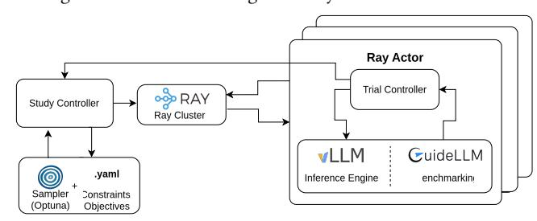
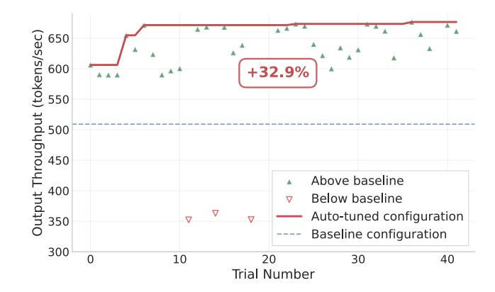
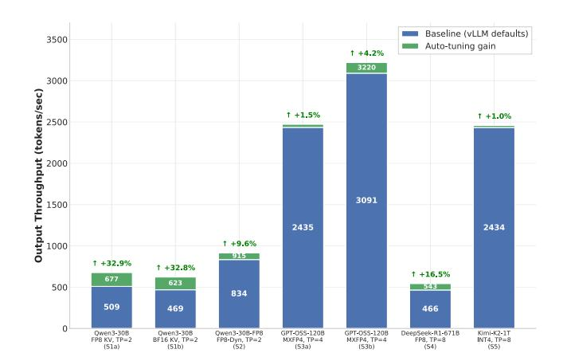
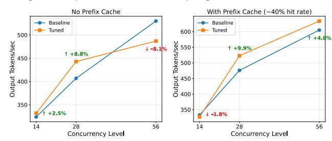

# llm-tuna - Hyperparameter Optimization for LLM Inference

Thameem Abbas Ibrahim Bathusha Red Hat, LLC. Boston, MA, USA thibrahi@redhat.com

Aanya Sharma Red Hat, LLC. Boston, MA, USA aansharm@redhat.com

Andy Huynh Boston University Boston, MA, USA ndhuynh@bu.edu

Rehan Samaratunga Boston University Boston, MA, USA rdsam@bu.edu

Ashish Kamra Red Hat, LLC. Boston, MA, USA akamra@redhat.com

#### Abstract

The performance of large language model (LLM) inference engines heavily relies on deployment-specific parameters such as batch size, parallelism, CUDA graphs, and GPU and network topology, however, with every new LLM released, the optimal setting of these parameters becomes a problem of interest. Additionally, as developers find new applications for LLMs, the parameter space only increases, with large scale inference deployments that span multiple nodes (i.e. llm-d [\[5\]](#page-3-0)). In this work, we demonstrate "llmtuna", an open-source framework that automates parameter search for vLLM [\[4\]](#page-3-1) based inference workloads across a diverse set of hardware setups. Our framework utilizes Bayesian optimization via Optuna to select the best configuration while parallelizing trials across multiple nodes to enable large scale studies.

We evaluate our system on a mixture-of-experts (MoE) model family (Qwen3-30B-A3B, Kimi-K2-INT4, GPT-OSS-120B, Deepseek-R1-671B), configuring each experiment to avoid artifacts of KVcache pre-emption effects. Our method achieves output throughput gains of up to 32.9% while never suggesting configurations that are worse than vLLMs' baseline performance. Our results demonstrate the potential of systematic auto-tuning to expose non-obvious performance regimes and guide operator defaults.

# CCS Concepts

• Computing methodologies → Machine learning approaches; Gaussian processes; • Computer systems organization → Distributed architectures; • Software and its engineering → Searchbased software engineering.

#### Keywords

Large Language Model Inference, Auto-tuning, vLLM, Bayesian Optimization, Performance Optimization, Mixture-of-Experts, GPU Computing

#### ACM Reference Format:

Thameem Abbas Ibrahim Bathusha, Aanya Sharma, Andy Huynh, Rehan Samaratunga, and Ashish Kamra. 2026. llm-tuna - Hyperparameter Optimization for LLM Inference. In Proceedings of the ACM Web Conference 2026 (WWW '26), April 13–17, 2026, Dubai, United Arab Emirates. ACM, Dubai, UAE, [4](#page-3-2) pages.<https://doi.org/10.1145/3774904.3792953>

#### 1 Introduction

vLLM. As large language models (LLMs) become widely available, demand for high-performance, easy-to-deploy inference engines

[This work is licensed under a Creative Commons Attribution 4.0 International License.](https://creativecommons.org/licenses/by/4.0)

WWW '26, Dubai, United Arab Emirates. © 2026 Copyright held by the owner/author(s). ACM ISBN 979-8-4007-2307-0/2026/04 <https://doi.org/10.1145/3774904.3792953>

has surged. vLLM is one such popular open-source engine [\[4\]](#page-3-1). It offers a simple API, leading performance, and broad compatibility across state-of-the-art models. Compatibility comes with a cost; to extract the maximum performance from vLLM, users must tune the system by setting the optimal parameters tailored to the application. Automatic Tuning. Manually tuning any software system can be tedious and expensive, as each test setup time can be in the order of minutes. Recent advancements in automatic tuning for other systems have demonstrated that machine learning techniques can be successfully applied to tune systems for optimal performance [\[1,](#page-3-3) [3,](#page-3-4) [7\]](#page-3-5). These methods follow a feedback loop of recommending configurations, testing, and recording metrics until the best configuration is determined.

Tuning vLLM. vLLM tuning presents unique challenges: performance depends critically on workload-specific parameters (sequence lengths, concurrency), and hardware topology [\[4\]](#page-3-1). Together, these factors produce a multi-dimensional configuration space that is prohibitively expensive to explore by hand. Running even a single experiment requires considerable setup, benchmarking, and teardown time. Non-linear dependencies between parameters often introduce instability that amplifies the overall experimentation burden. Optimal configurations vary significantly across model architectures (MoE, dense, and quantized) and GPU generations, rendering manual tuning efforts non-transferable and necessitating intelligent, automated search strategies.

llm-tuna. We introduce llm-tuna, an open source tool that leverages Bayesian optimization to recommend near-optimum vLLM [\[4\]](#page-3-1) tuning for a given workload and model. We show llm-tuna can recommend configurations that increase output throughput up to 32% over the baseline. Auto-tuning delivers performance improvements across a wide range of model scales, quantization formats, and workload profiles, substantially surpassing vLLM's default configurations. However, these gains are often workload-specific, as configurations tuned for one concurrency or sequence-length regime may fail to generalize to others. Our findings highlight that a small set of high-impact parameters—together with quantization and parallelism choices—can unlock significant performance. This motivates developing automated and workload-aware tuning strategies. To the best of our knowledge, llm-tuna is the first automatic tuning tool that is able to tune for all of vLLMs parameters.

# 2 Background

# 2.1 Inference Engines

Modern LLM serving relies on inference engines that efficiently schedule requests, manage GPU utilization, and handle KV cache memory under varied workloads. Leading engines including vLLM employ PagedAttention, continuous batching, chunked prefill, and multi-node serving to achieve higher throughputs and lower latencies than naive PyTorch [\[4\]](#page-3-1). Performance heavily depends on workload characterization - input sequence length (ISL), output sequence length (OSL), server-side concurrency, and burstiness.

# 2.2 Key Parameters

The study focuses on several impactful vLLM [\[4\]](#page-3-1) configuration parameters. Parallelism governs how computation is distributed across GPUs: higher tensor parallelism reduces latency by splitting every layer across devices, while expert parallelism in MoE models improves tokens-per-GPU efficiency at larger batch sizes. max-num-batched-tokens controls the upper bound on total batched tokens across concurrent sequences, trading off GPU utilization against tail latency. cuda-graph-sizes specifies the CUDA graph input sizes for which execution is pre-traced. This reduces host-side synchronization and lowers inter-token latency.

long-prefill-token-threshold directs smaller prefill requests to bypass large prefill operations, improving latency for heterogeneous workloads. We exclude experimental features from this study due to uncertain development trajectories.

# 2.3 Key Components

The system integrates four primary components: Optuna [\[2\]](#page-3-6), which provides the hyperparameter optimization framework that drives the parameter search; Ray [\[6\]](#page-3-7), which enables distributed execution for running parallel trials; vLLM [\[4\]](#page-3-1), the high-performance LLM inference engine that serves as the optimization target; and GuideLLM [\[8\]](#page-3-8), which functions as the workload generator and metrics collector for benchmarking.

# 3 Problem Statement

The performance of LLM inference engines relies on a complex and expansive set of deployment-specific parameters, including batch size, parallelism, and GPU/network topology. As models scale and deployments span multiple nodes (e.g., in large scale setups like llm-d [\[5\]](#page-3-0)), the magnitude of this configuration space grows combinatorially, making manual exploration impractical. While vLLM's default settings provide strong baseline performance across many scenarios, certain workload characteristics such as extreme sequence lengths, high concurrency, or specific quantization schemes can benefit from targeted parameter tuning. However, manually searching this parameter space to optimize for specific objectives (e.g., maximizing throughput under latency constraints) requires significant expertise and time investment. The fundamental challenge is to create an automated system that can efficiently discover near-optimal vLLM configurations for a given workload and model combination, reducing the barrier to deployment optimization.

# 4 Auto-Tuning-vLLM

Design Goals. We present the design goals associated with our auto-tuning platform as follows:

Automation and Sample Efficiency - eliminate manual hyperparameter exploration through Bayesian optimization to find nearoptimal configurations in 20-100 trials. This represents a &gt; 99% reduction in overhead compared to an exhaustive grid search requiring over 23,000 trials for the same parameter space.

Scalability and Flexibility - support distributed optimization across multiple GPUs and nodes via Ray while accommodating diverse deployment scenarios through configurable single/multi-objective optimization

Production Readiness - Reliable execution through robust error handling, persistent PostgreSQL [\[9\]](#page-3-9) storage for study resumption, and comprehensive centralized observability.

Bayesian Optimization Approach. We employ Bayesian Optimization via Optuna to intelligently navigate vLLM's vast configuration space, using Tree-structured Parzen Estimator (TPE) as our default sampler for its efficiency with mixed parameter types. The framework supports multiple sampling strategies including TPE, Gaussian Process samplers, BoTorch, and NSGA-II for multi-objective search when exploring throughput-latency tradeoffs. Each study begins with random explorations(default: 10) to initialize the Bayesian model, and supports preset optimization strategies (high\_throughput, low\_latency, balanced) that can produce Pareto frontiers for users.

#### 4.1 System Architecture

Implementation. Figure [1](#page-1-0) illustrates the llm-tuna architecture. The Study Controller orchestrates the optimization study, submitting trials to the Ray Cluster and reporting results to the sampler, which then suggests new parameter configurations using Bayesian optimization. Ray spawns isolated actors for parallel execution, each running a Trial Controller that manages the lifecycle of a vLLM server instance configured with trial-specific parameters and a GuideLLM benchmark process. GuideLLM generates concurrent load against the vLLM endpoint, collecting throughput and latency metrics that are returned to the Study Controller, completing the optimization loop.

We co-locate benchmarks with servers to eliminate network effects without observable interference on our hardware. In our empirical testing, we do not observe distinguishable interference from this on sufficiently equipped hardware. This choice might be reconsidered for other accelerators if they have high CPU overhead. The tool implements centralized logging via PostgreSQL [\[9\]](#page-3-9) to view the logs from the host running the study.

Figure 1: llm-tuna architecture

Trial Execution Pipeline. Each optimization trial executes in a Ray actor which spawns a vLLM server with suggested parameters, continuous health monitoring and automatic cancellation on failures. It then runs GuideLLM benchmark for the configured duration. Duration is set greater than 5 x median request latency to collect enough samples for stable metrics. Trials can fail due to out-of-memory conditions, invalid parameter combinations, or benchmark errors—all are classified and logged to the study database, allowing Optuna's pruning mechanism to learn from failures, while the trial isolation allows for other trials to progress.

Metrics and Observability. Our framework tracks: (1) Throughput: output tokens/sec, total tokens/sec, requests/sec; (2) Latency: end-to-end latency, time-to-first-token, inter-token-latency; each with median, mean, p95, and p99 aggregations. This enables flexible objectives: maximize mean throughput (batch workloads), minimize p95 latency (interactive apps), or Pareto frontiers (multi-objective trade-offs). All trial metadata is stored in PostgreSQL with CLI tools for real-time monitoring.

#### 4.2 Experimental Setup

Hardware(HW). The studies were run on the following hardware configurations with GPU driver in the 580 major version:

- H1 Dual Intel Xeon Processors (Sapphire Rapids, 64 cores, 128 threads) and 1.0 TiB of RAM and 4xH100 SXM 80GB running RHEL 9.6 or Openshift 4.19
- H2 Dual Intel Xeon (SapphireRapids, 80 Cores, 160 threads) and 2 TiB RAM and 8xH200 SXM 141GB running RHEL 9.6

Table [1](#page-2-0) summarizes the experimental studies, where ISL/OSL denotes input/output sequence lengths, TP is tensor parallelism, and concurrency is the number of concurrent requests.

| Study | Model             | HW | Quantization | ISL/OSL | TP | Concurrency |
|-------|-------------------|----|--------------|---------|----|-------------|
| S1a   | Qwen3-30B-A3B     | H1 | FP8 KV       | 20k/500 | 2  | 35          |
| S1b   | Qwen3-30B-A3B     | H1 | BF16 KV      | 20k/500 | 2  | 35          |
| S2    | Qwen3-30B-A3B-FP8 | H1 | FP8 KV       | 20k/500 | 2  | 50          |
| S3a   | GPT-OSS-120B      | H1 | MXFP4        | 1k/8k   | 4  | 64          |
| S3b   | GPT-OSS-120B      | H1 | MXFP4        | 8k/1k   | 4  | 20          |
| S4    | DeepSeek-R1-671B  | H2 | FP8          | 10k/1k  | 8  | 28          |
| S5    | Kimi-K2-1T        | H2 | INT4         | 1k/1k   | 8  | 200         |

Table 1: Experimental studies

Software stack. Our framework was implemented in Python 3.12, utilizing vLLM 0.11.0 [\[4\]](#page-3-1) for serving, Optuna 4.6.0, Ray 2.49.2 [\[6\]](#page-3-7) for distributed computing, and GuideLLM [\[8\]](#page-3-8) 0.3.1 for benchmarking. Trial setup. For the purpose of the study, we scope the tunable parameters and setup experiments to reduce trial to trial variance unrelated to the tunable parameters. Namely, prefix caching can potentially mask the effects of tuning other parameters. We explicitly disable it to reliably observe the effects of the tuned parameters. We set the essential parameters static across all trials and baseline. Concurrency defined workloads are chosen for better reproducibility and interpretability over RPS (rate per second) defined workloads.

#### 5 Results

vLLM provides sensible default configurations, but these cannot anticipate every deployment context. We evaluate auto-tuning's effectiveness across model scales (Qwen3-30B-A3B, DeepSeek-R1- 671B, Kimi-K2), quantization schemes (BF16, FP8 Model and KV cache), and workloads (varying concurrency levels, prefix caching patterns). Primary metrics are output throughput (tokens/sec) and end-to-end latency.

Performance Across Models. Figure [2](#page-2-1) illustrates the optimization achieved for Qwen3-30B-A3B with FP8 KV cache. Auto-tuning achieves a 32.90% output throughput improvement (509.15 → 676.66 tokens/sec) over vLLM defaults. This peak was achieved by tuning max\_num\_batched\_tokens to 85212 and cuda\_graph\_sizes to 136. We observe good gains (>10%) across models and quantization schemes: Qwen3-30B-A3B with BF16 KV cache, Qwen3-30B-A3B-FP8-dynamic, and DeepSeek-R1-FP8, along with limited (<3%) to no gains in GPT-OSS, and Kimi-K2 (detailed results in Figure [3\)](#page-2-2).

Figure 2: Qwen3-30B-A3B FP8 Quantization Optimization

Figure [3](#page-2-2) shows consistent and substantial performance improvements on diverse model scales, workloads, and hardware. Qwen3- 30B-A3B shows striking gains for both FP8 and BF16 KV cache quantizations, achieving +32.9% and +32.8% output throughput improvement, demonstrating tuning headroom across precision schemes. The DeepSeek-R1 (671B) model improves +16.5% despite its massive scale, indicating that auto-tuning remains effective even for frontier-scale models where exhaustive searches are considerably more expensive. Interestingly, the Kimi-K2-INT4 model exhibits only a +1.0% gain, suggesting that either (1) vLLM's defaults are already well-calibrated for this particular model/quantization scheme and workload profile, or (2) the parameter space for this configuration is inherently constrained, leaving little room for optimization.

Figure 3: Auto-Tuning Performance Across Models

Generalization Across Concurrency Levels. Real-world deployments can face varying request concurrency as load fluctuates. We evaluate the generalization of a tuned configuration over different concurrencies. We optimized DeepSeek for concurrency-28 and tested the resulting configuration at both lower (concurrency-14) and higher (concurrency-56) levels (Figure [4\)](#page-3-10). The tuned configuration achieved a +8.8% improvement in output tokens/sec at concurrency-28 without prefix caching, but degraded by -8.1% at

concurrency-56. We also tested with prefix caching enabled(upto 40% hit rate) to observe +9.9% improvement at tuned concurrency-28 and a -8.6% degradation at concurrency-56. These results indicate that optimal configurations may be specific to the workload being tuned: parameters tuned for one load level do not reliably transfer to significantly different concurrency regimes.

Figure 4: Tuning Generalization over Concurrency: DeepSeek-R1 (Tuned for Concurrency-28)

Discussion and Practical Recommendations. Practitioners should begin with high-impact, low-effort optimizations. In practice, two classes of configuration changes tend to yield the largest improvements with minimal experimentation:

Quantization Strategy: FP8, INT4, and dynamic quantization offer substantial speedups with minimal tuning and can be easily adopted via open-source quantized variants.

Parallelism Configuration: Adjusting Tensor, Pipeline, Expert, and Data Parallel sizes helps navigate throughput–latency tradeoffs and usually requires only a few experiments.

When Tuning Helps. Tuning becomes valuable for workloads with long sequences, high concurrency under tight latency budgets, burstiness, or large variability in request lengths. For more conventional workloads (ISL/OSL < 2000 tokens and moderate concurrency), vLLM defaults are often near-optimal.

Most Impactful Parameters. Our experiments centered on two parameters that consistently improve performance regardless of token distributions: max-num-batched-tokens and CUDA graph sizes. Practitioners should also consider tuning

long-prefill-token-threshold, depending on the expected variance in request lengths.

Tuning Cost. Our studies completed in 4-12 hours on 4-8 GPUs (similar to small production configurations). For production deployments with 10+ GPUs running stable workloads, a 10% improvement reduces serving costs proportionally, amortizing tuning overhead within hours to days. Tuning is most valuable for long-running, large-scale deployments.

# 6 Code and Data Availability

Our framework is open-source and available at [https://github.com/](https://github.com/openshift-psap/auto-tuning-vllm) [openshift-psap/auto-tuning-vllm.](https://github.com/openshift-psap/auto-tuning-vllm) The repository includes all configuration files, example studies, and documentation for reproducing our experiments.

# 7 Limitations and Future Work

Parameter Space Coverage. This study focused on vLLM 0.11.0's primary performance parameters while excluding experimental features and prefix caching tuning. Future work should explore the expanded parameter space of newer vLLM versions, including speculative decoding configurations and scheduling policies.

Workload Representation. Future work should evaluate autotuning using production trace replays to better capture real-world

traffic complexity, including burstiness and request size variability. Cross-Hardware Generalization. While we tested on H100 and H200 hardware, transfer learning approaches that leverage tuning results across different hardware platforms remain unexplored and could dramatically reduce tuning overhead for organizations operating heterogeneous clusters.

#### 8 Conclusion

While the underlying optimization techniques are established, "llmtuna" provides a significant applied engineering contribution by systematizing vLLM tuning. Targeted configuration tuning can provide clear benefits for structurally complex workloads— with long sequences, high concurrency, or bursty and highly variable request patterns—where default vLLM settings may not expose peak performance. Across our studies, max\_num\_batched\_tokens and CUDA graph sizes emerged as the most consistently impactful parameters. However, tuned configurations rarely generalize across shifting traffic patterns or model families, highlighting the need for periodic re-evaluation in real deployments.

# 9 Acknowledgments

We thank Michey Mehta, Naveen Miriyalu, Nikhil Palaskar, Jennifer Mulready, Brian Riordan, Samuel Monson, and the Red Hat PSAP team for their support and resources.

#### References

[1] Dana Van Aken, Andrew Pavlo, Geoffrey J. Gordon, and Bohan Zhang. 2017. Automatic Database Management System Tuning Through Large-scale Machine Learning. In Proceedings of the 2017 ACM International Conference on Management of Data, SIGMOD Conference 2017, Chicago, IL, USA, May 14-19, 2017, Semih Salihoglu, Wenchao Zhou, Rada Chirkova, Jun Yang, and Dan Suciu (Eds.). ACM, 1009–1024. [doi:10.1145/3035918.3064029](https://doi.org/10.1145/3035918.3064029) [2] Takuya Akiba, Shotaro Sano, Toshihiko Yanase, Takeru Ohta, and Masanori Koyama. 2019. Optuna: A Next-generation Hyperparameter Optimization Framework. In Proceedings of the 25th ACM SIGKDD International Conference on Knowledge Discovery & Data Mining, KDD 2019, Anchorage, AK, USA, August 4-8, 2019, Ankur Teredesai, Vipin Kumar, Ying Li, Rómer Rosales, Evimaria Terzi, and George Karypis (Eds.). ACM, 2623–2631. [doi:10.1145/3292500.3330701](https://doi.org/10.1145/3292500.3330701) [3] Herodotos Herodotou, Yuxing Chen, and Jiaheng Lu. 2021. A Survey on Automatic Parameter Tuning for Big Data Processing Systems. ACM Comput. Surv. 53, 2 (2021), 43:1–43:37. [doi:10.1145/3381027](https://doi.org/10.1145/3381027) [4] Woosuk Kwon, Zhuohan Li, Siyuan Zhuang, Ying Sheng, Lianmin Zheng, Cody Hao Yu, Joseph Gonzalez, Hao Zhang, and Ion Stoica. 2023. Efficient Memory Management for Large Language Model Serving with PagedAttention. In Proceedings of the 29th Symposium on Operating Systems Principles, SOSP 2023, Koblenz, Germany, October 23-26, 2023, Jason Flinn, Margo I. Seltzer, Peter Druschel, Antoine Kaufmann, and Jonathan Mace (Eds.). ACM, 611–626. [doi:10.1145/3600006.3613165](https://doi.org/10.1145/3600006.3613165) [5] LLM-d Community. 2024. LLM-d: Large Language Model Deployment Framework. [https://github.com/llm-d/llm-d.](https://github.com/llm-d/llm-d) Accessed: 2025-01-17. [6] Philipp Moritz, Robert Nishihara, Stephanie Wang, Alexey Tumanov, Richard Liaw, Eric Liang, Melih Elibol, Zongheng Yang, William Paul, Michael I. Jordan, and Ion Stoica. 2018. Ray: A Distributed Framework for Emerging AI Applications. In 13th USENIX Symposium on Operating Systems Design and Implementation (OSDI 18). USENIX Association, Carlsbad, CA, 561–577. [https://www.usenix.org/conference/](https://www.usenix.org/conference/osdi18/presentation/moritz) [osdi18/presentation/moritz](https://www.usenix.org/conference/osdi18/presentation/moritz) [7] Maryam Mozaffari, Anton Dignös, Johann Gamper, and Uta Störl. 2024. Selftuning Database Systems: A Systematic Literature Review of Automatic Database Schema Design and Tuning. ACM Comput. Surv. 56, 11 (2024), 277:1–277:37. [doi:10.1145/3665323](https://doi.org/10.1145/3665323) [8] Inc. Neural Magic. 2024. GuideLLM: Scalable Inference and Optimization for Large Language Models. [https://github.com/vllm-project/guidellm.](https://github.com/vllm-project/guidellm) [9] PostgreSQL Global Development Group. 2024. PostgreSQL: The World's Most Advanced Open Source Relational Database. [https://www.postgresql.org.](https://www.postgresql.org) Version 14+.