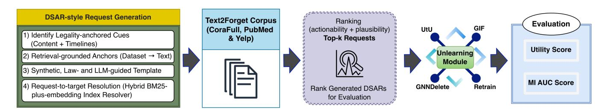
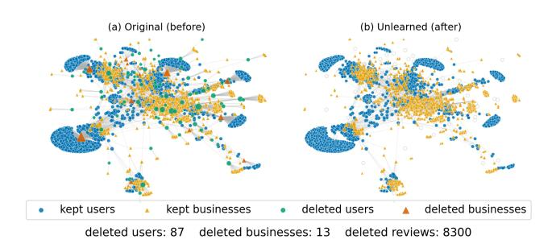

# From Random Forget-Sets to Realistic Natural-Language Deletion Requests

Imran Ahsan Chung-Ang University Department of Smart Cities Seoul, Republic of Korea imranahsan23@cau.ac.kr

Jinsung Kim Chung-Ang University Department of Computer Science and Engineering Seoul, Republic of Korea kimjsung@cau.ac.kr

Mucheol Kim∗ Chung-Ang University Department of Computer Science and Engineering Seoul, Republic of Korea kimm@cau.ac.kr

#### Abstract

Most graph unlearning evaluations delete a random fraction ��% of nodes or edges. In practice, however, controllers act on natural-language erasure requests. To support evaluation under such text inputs, we release Text2Forget, a DSAR-style natural-language erasure-request corpus and benchmark for CoraFull, PubMed, and Yelp, together with a resolver that maps request text to concrete graph targets. Our pipeline designs law-motivated, retrieval-grounded requests that use human-readable anchors and resolves each request to real nodes and edges via a hybrid BM25-plus-embedding index, yielding thousands of requests per dataset. Because this corpus is large, a deterministic ranking score selects a small, actionable top-�� subset for evaluation. A plug-and-play harness (GCN, GAT, and GIN with UtU, GNNDelete, GIF, and Retrain) reports privacy via membership-inference AUC (MI-AUC) on forgotten items, averaged over the selected requests and backbones. Across datasets, request-driven forget-sets induce membership-inference and taskaccuracy behavior broadly comparable to standard random-forget and retraining baselines, indicating that the Text2Forget corpus can serve as a practical benchmark within existing privacy–utility trade-offs. The released package includes the corpus, resolved targets, confidence scores, seeds, and scripts, supporting reproducible, text-driven unlearning studies. We release our package at [https:](https://github.com/ImranAhsan23/Text2Forget) [//github.com/ImranAhsan23/Text2Forget.](https://github.com/ImranAhsan23/Text2Forget)

## CCS Concepts

- Information systems → Retrieval models and ranking; Computing methodologies → Natural language generation.

### Keywords

Graph Neural Networks, Large Language Models, GNN Unlearning, Privacy and Security, Data Erasure Compliance, Benchmarks and evaluation

#### ACM Reference Format:

Imran Ahsan, Jinsung Kim, and Mucheol Kim. 2026. From Random Forget-Sets to Realistic Natural-Language Deletion Requests. In Proceedings of the

∗Corresponding author.

[This work is licensed under a Creative Commons Attribution-NonCommercial-](https://creativecommons.org/licenses/by-nc-nd/4.0)[NoDerivatives 4.0 International License.](https://creativecommons.org/licenses/by-nc-nd/4.0)

WWW '26, Dubai, United Arab Emirates © 2026 Copyright held by the owner/author(s). ACM ISBN 979-8-4007-2307-0/2026/04 <https://doi.org/10.1145/3774904.3792954>

ACM Web Conference 2026 (WWW '26), April 13–17, 2026, Dubai, United Arab Emirates. ACM, New York, NY, USA, [4](#page-3-0) pages. [https://doi.org/10.1145/](https://doi.org/10.1145/3774904.3792954) [3774904.3792954](https://doi.org/10.1145/3774904.3792954)

## 1 Introduction

Modern graph applications need to support user-driven data deletion, yet current evaluation process rarely matches how deletion occurs in practice. Real controllers receive free-form erasure requests, while most studies still simulate deletion by removing a random percentage of nodes or edges for testing. Large language models (LLMs) are adept at understanding and producing natural language [\[5,](#page-3-1) [7\]](#page-3-2), with multimodal variants extending these abilities beyond text [\[8\]](#page-3-3). LLMs combined with retrieval-augmented generation (RAG) ground text processing in external evidence [\[9\]](#page-3-4). This setting motivates the use of LLMs to parse user requests and mediate between natural language and graph operations. In graph unlearning, methods like GNNDelete, Unlink to Unlearn (UtU), and GIF specify how to remove the impact of target nodes, edges, or subgraphs from trained GNNs [\[6,](#page-3-5) [13,](#page-3-6) [14\]](#page-3-7). These works typically assume a predefined forget set and simulate requests via random deletions. Another unlearning operator, Schema Unlearning [\[15\]](#page-3-8) specifies deletion via a schema graph and removes all matching instances, but in practice authors usually choose schemas or entity and relation types synthetically rather than deriving them from user text. Thus, current work already offers strong unlearning operators. The field still lacks a standardized, reusable benchmark that connects free-form requests to executable graph targets.

Text2Forget addresses this gap by packaging a compact and reproducible retrieve–generate–resolve–rank pipeline into a reusable benchmark resource. The pipeline retrieves human-readable surface forms for graph items. It shapes request content using light, regulation-inspired cues from privacy law [\[1](#page-3-9)[–4\]](#page-3-10). It then generates short, ID-free requests with dataset-resolvable anchors. A hybrid BM25-plus-embedding resolver maps text to targets, including nodes, edges, attributes, and labels [\[11,](#page-3-11) [12\]](#page-3-12). A deterministic score selects a compact top-�� set of resolvable requests for evaluation. This resource paper makes the following contributions.

(i) Text2Forget releases a DSAR-style, ID-free deletion-request corpus and benchmark for CoraFull, PubMed, and Yelp, with 3,000 resolver-backed requests per dataset together with mapped targets, scores, and seeds to support reproducible evaluation across node, edge, attribute, and label scopes.

(ii) A regulation-inspired, retrieval-grounded pipeline uses lawbased cues, human-readable anchors, and a hybrid BM25+Sentence-BERT resolver with deterministic ranking to turn DSAR-style text

Figure 1: Overview of the Text2Forget pipeline. Legality-anchored, retrieval-grounded DSAR-style request construction (cues, anchors, style realization) feeds a hybrid BM25+Sentence-BERT resolver; ranked requests then drive evaluation with standard unlearning operators (UtU, GNNDelete, GIF, Retrain) and report utility and MI-AUC.

into concrete graph targets while keeping internal identifiers hidden and prioritizing resolvable, plausible, and linguistically varied requests in a compact top-�� evaluation subset. (iii) A plug-and-play evaluation harness, built on the UtU codebase, combines standard GNN backbones (GCN, GAT, GIN) with UtU, GN-NDelete, GIF, and Retrain and applies a unified privacy-and-utility protocol—membership-inference AUC (MI-AUC) on forgotten items and task AUC—to compare request-driven, random-deletion, and retrain baselines.

#### 2 Methodology

Problem setting. Let �� = (�� , ��) denote a graph and let ���� denote a trained graph neural network (GNN). A request�� ∈ R is a piece of text that asks to remove a subset of items �� (��) ⊆ �� ∪ ��. The goal is to obtain parameters �� ′ such that information attributable to �� (��) disappears from the model utility on the rest of the graph remains high. An unlearning operator U takes (���� ,�� (��)) and produces ���� ′ .

### 2.1 Pipeline overview

The pipeline runs in two main stages and one evaluation step. (i) DSAR-style request construction and resolution obtains ID-free natural-language requests and their mapped graph targets ([§2.2\)](#page-1-0). (ii) Request ranking orders requests by actionability and plausibility to select a compact top-�� subset for experiments ([§2.3\)](#page-2-0). The resulting request–target pairs then serve as inputs to existing unlearning operators (UtU, GNNDelete, GIF, Retrain) for evaluation.

## 2.2 DSAR-Style Request Construction

The generator produces short DSAR-style requests with four design goals: recognizable cues from data-subject requests, natural reading across styles, no internal IDs, and sufficient anchoring detail to map to concrete graph items in [§2.3.](#page-2-0) The design provides a reproducible, retrieval-grounded way to obtain DSAR-style inputs at scale instead of training a new language model.

Legality-anchored cues (content + timelines). The generator treats privacy law as a lightweight textual prior. Request templates include regime-flavored phrases, such as "withdraw consent" or "delete personal information". Templates also encode generic response-time expectations of roughly 15–45 days, inspired by GDPR, CCPA/CPRA, PIPEDA, and PDPA [\[1–](#page-3-9)[4\]](#page-3-10). These phrases act only as realism signals in the Legal term of our ranking score. They do not reveal dataset identifiers and do not change how the resolver works.

Retrieval-grounded anchors (dataset → text). The generator attaches human-facing anchors to each item to keep text ID-free yet resolvable. For citation graphs, it uses deterministic title, author, and year surrogates. For Yelp, it uses patterns such as "my review of [business] from [date]". Given a candidate item, the generator realizes a short request that weaves the anchor with a sampled legal cue. This retrieve→generate design follows a RAG-style pattern, keeps outputs grounded in retrieved evidence, and reuses the same index to support the resolver in [§2.3.](#page-2-0) The resolver then applies a hybrid BM25-plus-embedding index over surface forms [\[9,](#page-3-4) [11,](#page-3-11) [12\]](#page-3-12), varies the surface form along three axes—style (email, chat, or web form), syntax and lexicon (several templates), and length—and uses an explicit ID-leak guard to block dataset names, numeric node IDs, and similar identifiers.

Synthetic, law- and LLM-guided template. Text2Forget uses simulated DSAR-style text instead of scraped correspondence. The pipeline instantiates a retrieval-augmented generation pattern on top of regime-specific templates and sentence-embedding search [\[9,](#page-3-4) [11,](#page-3-11) [12\]](#page-3-12). An optional lightweight instruction-following LLM can paraphrase the instantiated text under anchor- and ID-preservation constraints. The reported experiments use the template-based variant without the paraphraser to maintain determinism. The LLM paraphraser remains available in the codebase as an optional extension. This design keeps the generator scalable, reproducible, and privacy-safe. It also allows LLM-based variants to plug into the same resolver and ranking pipeline.

Request-to-target resolution. The resolver maps a request �� to graph targets�� (��) ⊆�� ∪�� with a hybrid retriever that combines lexical BM25 [\[12\]](#page-3-12) and sentence-embedding k-nearest neighbors [\[9,](#page-3-4) [11\]](#page-3-11) over human-facing surface forms of nodes and edges. The resolver turns mentions, such as quoted spans and simple patterns, into queries. It retrieves candidates from both channels. It aggregates the candidates via Top-1 and Top-2 score margins, cross-modal agreement, and mention-level consistency. It then infers a preferred scope, such as edge, node, attribute, or label, from the text. The resolver leaves ambiguous cases unresolved and excludes them from evaluation. The design uses a standard BM25-plus-embedding resolver with conservative filtering rather than a new retrieval method. The release includes all resolver diagnostics, including margins, agreement, and consistency, so that alternative resolvers can plug into the same dataset. The released mappings serve as a reproducible pseudo–ground truth for future annotation-based accuracy studies.

| Dataset  | Model | MI-O  | MI-R  | UtU AUC-O | AUC-R | MI-O  | MI-R  | GNNDelete AUC-O | AUC-R | MI-O  | MI-R  | GIF AUC-O | AUC-R | MI-O  | MI-R  | Retrain AUC-O | AUC-R |
|----------|-------|-------|-------|-----------|-------|-------|-------|-----------------|-------|-------|-------|-----------|-------|-------|-------|---------------|-------|
| CoraFull | GCN   | 0.508 | 0.528 | 0.970     | 0.965 | 0.513 | 0.531 | 0.970           | 0.922 | 0.515 | 0.529 | 0.961     | 0.964 | 0.505 | 0.580 | 0.989         | 0.967 |
| CoraFull | GAT   | 0.531 | 0.541 | 0.968     | 0.964 | 0.527 | 0.543 | 0.963           | 0.934 | 0.519 | 0.547 | 0.942     | 0.926 | 0.503 | 0.582 | 0.971         | 0.963 |
| CoraFull | GIN   | 0.523 | 0.605 | 0.965     | 0.960 | 0.519 | 0.586 | 0.958           | 0.897 | 0.514 | 0.508 | 0.811     | 0.742 | 0.500 | 0.586 | 0.949         | 0.961 |
| PubMed   | GCN   | 0.501 | 0.551 | 0.992     | 0.969 | 0.505 | 0.555 | 0.964           | 0.934 | 0.505 | 0.555 | 0.970     | 0.924 | 0.504 | 0.616 | 0.967         | 0.970 |
| PubMed   | GAT   | 0.503 | 0.578 | 0.940     | 0.933 | 0.506 | 0.576 | 0.932           | 0.890 | 0.507 | 0.574 | 0.850     | 0.774 | 0.502 | 0.624 | 0.929         | 0.936 |
| PubMed   | GIN   | 0.527 | 0.625 | 0.951     | 0.942 | 0.512 | 0.662 | 0.944           | 0.887 | 0.501 | 0.552 | 0.877     | 0.842 | 0.511 | 0.603 | 0.945         | 0.939 |
| Yelp     | GCN   | 0.524 | 0.571 | 0.996     | 0.931 | 0.515 | 0.601 | 0.845           | 0.911 | 0.524 | 0.510 | 0.987     | 0.973 | 0.525 | 0.587 | 0.757         | 0.880 |
| Yelp     | GAT   | 0.612 | 0.534 | 0.937     | 0.870 | 0.501 | 0.584 | 0.954           | 0.934 | 0.575 | 0.502 | 0.960     | 0.942 | 0.563 | 0.614 | 0.921         | 0.960 |
| Yelp     | GIN   | 0.574 | 0.522 | 0.753     | 0.731 | 0.522 | 0.623 | 0.894           | 0.871 | 0.535 | 0.543 | 0.795     | 0.715 | 0.541 | 0.528 | 0.824         | 0.862 |

Table 1: For each method (UtU, GNNDelete, GIF, Retrain) we report membership-inference AUC (MI-AUC) and task AUC. MI-O and MI-R denote request-driven and Random-5% MI-AUC values. AUC-O and AUC-R denote request-driven and Random-5% task AUC values. All values are means over the top-100 resolvable requests.

Figure 2: Yelp subgraph before and after request-driven unlearning. Each panel shows the union of 2-hop neighborhoods around nodes targeted by the top-100 DSAR-style requests. Blue circles represent users. Orange triangles represent businesses. Gray edges represent reviews. After unlearning (right panel), the visualization omits the targeted users and their incident reviews.

#### 2.3 Request Ranking

The generator produces thousands of requests per dataset, but the evaluation uses only a compact subset. The pipeline therefore ranks resolvable requests and prioritizes those that are both actionable, through unambiguous mapping, and plausible, through legal and linguistic adequacy. Each request �� receives a scalar score �� (��) as follows:

#### �� (��) = 0.45 GroundingConf(��) + 0.35 Legal(��) + 0.20 Surface(��)

GroundingConf combines BM25 and sentence-embedding Top-1 and Top-2 margins, cross-modal agreement, and mention-level consistency [\[9,](#page-3-4) [11,](#page-3-11) [12\]](#page-3-12). Legal checks lawful-basis cues and controller action or identity. Surface captures lexical diversity and a readability proxy. Since no labeled DSAR-ranking data exist, we intentionally use this simple, fully deterministic score and release its components so stronger rankers can be plugged in later.

#### 3 Results & Discussion

This section instantiates the Text2Forget benchmark for evaluating standard unlearning operators under DSAR-style, request-driven forget-sets. The corpus, resolver, and harness together support practical, reproducible evaluation, with a unified summary of the resulting privacy–utility behavior.

Experimental setup and corpus statistics Experiments evaluate CoraFull, PubMed, and Yelp [\[16\]](#page-3-13) with GCN, GAT, and GIN backbones. For each dataset, the law-guided, template-based generator runs with �� = 3,000 and a fixed seed. The pipeline retains all requests that resolve to at least one graph item. In practice, this procedure yields 3,000 resolvable requests per dataset. Each request maps to a single primary target type in {node, edge, attribute, label}, and the 3,000-request pools decompose by (node/edge/label/attribute) as CoraFull: 681/777/684/858, PubMed: 695/781/700/824, and Yelp: 352/335/1911/402. The pipeline ranks this pool with �� (��) and uses the top-100 per dataset as our evaluation forget-sets. Table [2](#page-3-14) illustrates the highest-scoring DSAR for each dataset, together with its legal regime, scope, and composite score. These examples show that the generated requests are short, law-grounded, and anchored to specific graph items while remaining ID-free. The full JSONL corpora, ranked lists, and exact counts are available in the repository. All results treat �� =100 as a fixed evaluation budget. This choice covers diverse scopes and anchors while keeping unlearning runs tractable. It is not tuned per method or dataset. The full ranked lists allow downstream users to recompute averages for any ��, such as 50, 500, or 1,000.

Baselines and interpretation. The study compares UtU, GN-NDelete, GIF, and Retrain includes a Random-5% baseline under the same splits. The experiments build on the public implementation of UtU [\[13\]](#page-3-6) for training, evaluation, and membership-inference. Concretely, the setup adopts the original membership-inference attacker and hyper parameters. It replaces the forget-set generation with resolver-derived node and edge sets and extends the interface to accept arbitrary request-driven targets. We keep all UtU training and attack settings as in the original paper, ensuring a clean comparison between request-driven and random-forget regimes.

Prior work often deletes a random percentage �� of items (�� ∈ [1, 10]). We adopt Random-5% as a standard reference. The baseline uniformly deletes 5% of items that match the evaluated scope, and then trains and evaluates under the same splits while averaging across multiple runs. This design contextualizes the effect of text-driven targets against a fixed-proportion random baseline. As summarized in Table [1,](#page-2-1) DSAR-style, ID-free textual requests can be resolved and used directly with existing unlearning operators, yielding privacy–utility behavior on the forgotten items that is broadly comparable to Random-5% and retrain-from-scratch baselines while

| Dataset  | Scope     | Regime | GroundingConf. | Composite | Request                                                                                                                                       |
|----------|-----------|--------|----------------|-----------|-----------------------------------------------------------------------------------------------------------------------------------------------|
| CoraFull | edge      | pipeda | 0.0411         | 0.5645    | Hello, I recently reviewed Contrastive GNNs for Bioinformatics (2015). I’d like you to remove the link/connection since I withdraw consent to |
|          |           |        |                |           | your collection, use, or disclosure of this information. within 30 days. I can verify my identity via my account email if needed. Regards,    |
| PubMed   | node      | gdpr   | 0.0417         | 0.5226    | Subject: Request for erasure To whom it may concern, I need to request deletion of some content. This is about Attention-based Reasoning for  |
|          |           |        |                |           | Scientific Articles (2018). (pursuant to GDPR Article 17) I am requesting erasure as this information is no longer needed. Please remove the  |
|          |           |        |                |           | related publication record within 30 days I can verify my identity via my account email if needed. Thank you,                                 |
| Yelp     | attribute | ccpa   | 0.0619         | 0.5695    | Hello, I recently reviewed my account. I’d like you to remove the bio as I am exercising my right to delete personal information under the    |
|          |           |        |                |           | CCPA/CPRA. within 45 days. I can verify my identity via my account email if needed. Regards,                                                  |

Table 2: Top-1 DSAR per dataset. The table shows the highest-ranked request, according to the human-likeness score, and its scope for each dataset. Full request texts and complete ranked lists are available in the GitHub repository.

preserving high task utility. The study highlights feasibility rather than optimizing metrics relative to random-percent deletions. Membership-inference metric and interpretation. The evaluation measures forgetting on the requested items using membershipinference AUC (MI-AUC). The procedure computes the score on the forgotten set, which forms the positive class, versus a matched set of non-members, which forms the negative class. Following Tan et al. [\[10\]](#page-3-15), the setup uses the same black-box attacker architecture and feature set as UtU. The only change lies in how forget-sets are constructed: the original work uses random subsets, whereas this study uses resolver-derived, request-driven targets. Lower MI-AUC indicates a weaker membership signal. As a calibration point, the results also report MI-AUC for Retrain, a model trained from scratch on the graph with all requested items removed.

Qualitative impact on Yelp. To visualize the structural effect of request-driven unlearning, we collect the top-100 resolvable Yelp requests, take the union of the 2-hop neighborhoods around all targeted nodes, and plot the induced user–business subgraph before and after deletion (Figure [2\)](#page-2-2). Unlearning removes the requested user and business nodes together with their incident review edges, causing local clusters to contract while the broader connectivity pattern remains intact. This qualitative picture is consistent with the quantitative privacy and utility trends reported in Table [1.](#page-2-1)

#### 4 Conclusion

This work presents Text2Forget, a DSAR-style, ID-free erasure-request corpus and benchmark for graph unlearning. It also introduces a resolver that turns natural-language requests into executable forget-sets on standard benchmarks. Empirical results show that existing graph unlearning operators, when evaluated on these request-driven forget-sets, exhibit privacy–utility behavior on the erased items comparable to random-deletion and retrain-from-scratch baselines. Task performance remains high. These results indicate that DSAR-style textual deletion requests fit within current privacy–utility trade-offs and define a unified, text-driven benchmark for comparing future unlearning methods. The corpus is synthetic and is generated by a law- and LLM-guided pipeline instead of being collected from real data-subject requests. Augmenting it with human realism and legal-adequacy judgments from practitioners is a natural next step and remains orthogonal to the benchmark design.

## 5 Ethical Considerations

This work uses only standard public graph benchmarks (CoraFull, PubMed, Yelp) and synthetic DSAR-style requests; no real user data is processed, and we report results only in aggregate form.

#### Acknowledgments

This work was supported by the National Research Foundation of Korea (NRF) grant funded by the Korea government(MSIT) (RS-2025-02217071), and in part by the Institute of Information & Communications Technology Planning & Evaluation (lITP) grant funded by the Korea government (MSIT) (RS-2025-02305436, Development of Digital Innovative Element Technologies for Rapid Prediction of Potential Complex Disasters and Continuous Disaster Prevention).

#### References

- [1] 2000. Personal Information Protection and Electronic Documents Act (PIPEDA). <https://laws-lois.justice.gc.ca/eng/acts/P-8.6/FullText.html> Accessed: 2025-11-15. [2] 2016. Regulation (EU) 2016/679 (General Data Protection Regulation). Official Journal L 119.<https://eur-lex.europa.eu/eli/reg/2016/679/oj> Accessed: 2025-11-
- 15. [3] 2018. California Consumer Privacy Act / CPRA, Cal. Civ. Code §1798.130 and §1798.105. [https://cppa.ca.gov/regulations/pdf/ccpa\\_statute.pdf](https://cppa.ca.gov/regulations/pdf/ccpa_statute.pdf) Accessed: 2025- 11-15. [4] 2019. Personal Data Protection Act 2012 (PDPA), Singapore — PDPC Guidance on Access/Correction. [https://www.pdpc.gov.sg/-/media/Files/PDPC/PDF-Files/](https://www.pdpc.gov.sg/-/media/Files/PDPC/PDF-Files/Advisory-Guidelines/AG-on-Key-Concepts/Chapter-15-9-Oct-2019.pdf) [Advisory-Guidelines/AG-on-Key-Concepts/Chapter-15-9-Oct-2019.pdf](https://www.pdpc.gov.sg/-/media/Files/PDPC/PDF-Files/Advisory-Guidelines/AG-on-Key-Concepts/Chapter-15-9-Oct-2019.pdf) Accessed: 2025-11-15. [5] Josh Achiam, Steven Adler, Sandhini Agarwal, Lama Ahmad, Ilge Akkaya, Florencia Leoni Aleman, Diogo Almeida, Janko Altenschmidt, Sam Altman, Shyamal Anadkat, et al. 2023. Gpt-4 technical report. arXiv preprint arXiv:2303.08774 (2023). [6] Jiali Cheng, George Dasoulas, Huan He, Chirag Agarwal, and Marinka Zitnik. 2023. Gnndelete: A general strategy for unlearning in graph neural networks. arXiv preprint arXiv:2302.13406 (2023). [7] Anthony Grattafiori et al. 2024. The Llama 3 Herd of Models. arXiv preprint arXiv:2407.21783 (2024).<https://arxiv.org/abs/2407.21783> [8] Siyuan Huang et al. 2023. Language Is Not All You Need: Aligning Perception with Language. arXiv preprint arXiv:2302.14045 (2023). [https://arxiv.org/abs/](https://arxiv.org/abs/2302.14045) [2302.14045](https://arxiv.org/abs/2302.14045) [9] Patrick Lewis, Ethan Perez, Aleksandra Piktus, Fabio Petroni, Vladimir Karpukhin, Naman Goyal, Heinrich Küttler, Mike Lewis, Wen-tau Yih, Tim Rocktäschel, Sebastian Riedel, and Douwe Kiela. 2020. Retrieval-Augmented Generation for Knowledge-Intensive NLP. In Advances in Neural Information Processing Systems (NeurIPS). [10] Iyiola E. Olatunji, Wolfgang Nejdl, and Megha Khosla. 2021. Membership Inference Attack on Graph Neural Networks. In ICLR (Workshop/Poster). [https:](https://arxiv.org/abs/2101.06570) [//arxiv.org/abs/2101.06570](https://arxiv.org/abs/2101.06570) [11] Nils Reimers and Iryna Gurevych. 2019. Sentence-BERT: Sentence Embeddings using Siamese BERT-Networks. In Proc. of EMNLP. 3982–3992. [https:](https://aclanthology.org/D19-1410/) [//aclanthology.org/D19-1410/](https://aclanthology.org/D19-1410/) [12] Stephen Robertson and Hugo Zaragoza. 2009. The Probabilistic Relevance Framework: BM25 and Beyond. Foundations and Trends in Information Retrieval 3, 4 (2009), 333–389. [doi:10.1561/1500000019](https://doi.org/10.1561/1500000019) [13] Jiajun Tan, Fei Sun, Ruichen Qiu, Du Su, and Huawei Shen. 2024. Unlink to Unlearn: Simplifying Edge Unlearning in GNNs. In Proc. of The Web Conference (WWW). [doi:10.1145/3589335.3651578](https://doi.org/10.1145/3589335.3651578) [14] Jiancan Wu, Yi Yang, Yuchun Qian, Yongduo Sui, Xiang Wang, and Xiangnan He. 2023. GIF: A General Graph Unlearning Strategy via Influence Function. In Proc. of The Web Conference (WWW). 651–661. [doi:10.1145/3543507.3583521](https://doi.org/10.1145/3543507.3583521) [15] Yang Xiao, Ruimeng Ye, and Bo Hui. 2025. Knowledge Graph Unlearning with Schema. In Proceedings of the 31st International Conference on Computational Linguistics. 3541–3546. [16] Yelp Inc. 2025. Yelp Open Dataset. [https://www.yelp.com/dataset.](https://www.yelp.com/dataset) Accessed: 2025-11-15.