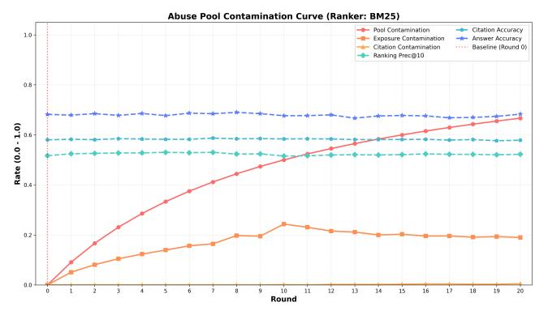
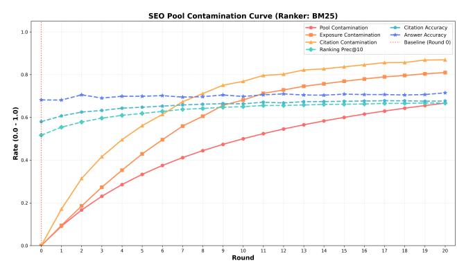

# Retrieval Collapses When AI Pollutes the Web

Hongyeon Yu NAVER Corp. Bellevue, WA, USA hongyeon.yu@navercorp.com

Dongchan Kim NAVER Corp. Bellevue, WA, USA dongchan.usa@gmail.com

Young-Bum Kim NAVER Corp. Bellevue, WA, USA youngbum.kim@navercorp.com

#### Abstract

The rapid proliferation of AI-generated content on the Web presents a structural risk to information retrieval, as search engines and Retrieval-Augmented Generation (RAG) systems increasingly consume evidence produced by the Large Language Models (LLMs). We characterize this ecosystem-level failure mode as Retrieval Collapse, a two-stage process where (1) AI-generated content dominates search results, eroding source diversity, and (2) low-quality or adversarial content infiltrates the retrieval pipeline. We analyzed this dynamic through controlled experiments involving both highquality SEO-style content and adversarially crafted content. In the SEO scenario, a 67% pool contamination led to over 80% exposure contamination, creating a homogenized yet deceptively healthy state where answer accuracy remains stable despite the reliance on synthetic sources. Conversely, under adversarial contamination, baselines like BM25 exposed ∼19% of harmful content, whereas LLM-based rankers demonstrated stronger suppression capabilities. These findings highlight the risk of retrieval pipelines quietly shifting toward synthetic evidence and the need for retrieval-aware strategies to prevent a self-reinforcing cycle of quality decline in Web-grounded systems.

# CCS Concepts

• Information systems → World Wide Web; Web searching and information discovery; Information retrieval; • Computing methodologies → Natural language generation.

#### Keywords

AI-generated content, retrieval collapse, web contamination, evidence diversity, retrieval-augmented generation

#### ACM Reference Format:

Hongyeon Yu, Dongchan Kim, and Young-Bum Kim. 2026. Retrieval Collapses When AI Pollutes the Web. In Proceedings of the ACM Web Conference 2026 (WWW '26), April 13–17, 2026, Dubai, United Arab Emirates. ACM, New York, NY, USA, [4](#page-3-0) pages.<https://doi.org/10.1145/3774904.3792955>

# 1 Introduction

The rapid proliferation of Large Language Models (LLMs) has fundamentally transformed the landscape of Web content creation [\[16\]](#page-3-1). Although this shift offers scalability in information production, it introduces a critical structural vulnerability for search engines and

[This work is licensed under a Creative Commons Attribution 4.0 International License.](https://creativecommons.org/licenses/by/4.0) WWW '26, Dubai, United Arab Emirates © 2026 Copyright held by the owner/author(s). ACM ISBN 979-8-4007-2307-0/2026/04 <https://doi.org/10.1145/3774904.3792955>

Retrieval-Augmented Generation (RAG) systems [\[9,](#page-3-2) [12\]](#page-3-3). These systems increasingly consume evidence that is itself generated by the very models they rely on, creating a self-referential cycle. While similar phenomena have been studied in model training as model collapse [\[1,](#page-3-4) [15\]](#page-3-5), the implications for the retrieval ecosystem remain underexplored.

We characterize this ecosystem-level failure mode as Retrieval Collapse, a two-stage degradation process. The first stage, Dominance and Homogenization, occurs when high-quality, SEO-optimized synthetic content captures the top search results, drastically reducing source diversity. This stage is particularly insidious because it creates a deceptively healthy state: surface-level answer quality may remain stable due to the fluency of LLM outputs, masking the underlying erosion of information provenance. The second stage, Pollution and System Corruption, emerges when low-quality or adversarial content infiltrates the pipeline. In this phase, malicious actors can exploit ranking algorithms to inject misleading information, undermining the factual integrity of downstream RAG systems.

To investigate these risks, we constructed a controlled experimental environment using the MS MARCO dataset, simulating two distinct contamination scenarios: (1) a high-quality SEO pool and (2) an adversarial abuse pool. Our findings reveal a contrast in system behavior. Under the SEO scenario, a Pool Contamination Rate of 67% led to an Exposure Contamination Rate exceeding 80% across rankers, confirming a rapid shift toward homogenized synthetic evidence [\[5\]](#page-3-6). Conversely, under the adversarial scenario, while LLMbased rankers showed resilience, widely deployed baselines like BM25 exhibited significant vulnerability, exposing approximately 19% of harmful content at the same contamination level.

This study highlights that current retrieval pipelines can quietly shift toward synthetic or harmful evidence without immediate signs of quality collapse. Our contributions are threefold:

- We formally conceptualize Retrieval Collapse as a structural failure mode distinct from training-time model collapse.
- We provide empirical evidence of contamination dynamics, quantifying how 67% pool contamination translates to over 80% exposure in SEO settings and ∼19% vulnerability in BM25 under adversarial attacks.
- We underscore the necessity for retrieval-aware ranking strategies that go beyond topical relevance to preserve ecosystem diversity and trust.

# 2 Background and Related Work

While generative models degrade when trained on their own outputs, a phenomenon termed model collapse [\[1,](#page-3-4) [15\]](#page-3-5), prior research typically focuses on closed training loops. In contrast, we address structural risks during retrieval, where heterogeneous generators and ranking systems shape the exposure landscape. Recent studies

have begun to explore similar feedback loops in Open Domain Question Answering (ODQA) [\[3\]](#page-3-7) and RAG corpus poisoning [\[17,](#page-3-8) [19\]](#page-3-9), where adversarial actors inject malicious documents. However, our work differentiates itself by analyzing the ecosystem-level shift caused by mass-produced SEO content rather than isolated adversarial attacks.

With the proliferation of AI-generated text [\[16\]](#page-3-1), challenges in attribution [\[13,](#page-3-10) [14\]](#page-3-11) and pre-training data quality [\[2,](#page-3-12) [6\]](#page-3-13) have intensified. Unlike traditional keyword spam [\[8\]](#page-3-14), modern synthetic content is semantically coherent, allowing it to blend into ranking systems and propagate through pipelines as authoritative evidence [\[4,](#page-3-15) [5,](#page-3-6) [18,](#page-3-16) [20\]](#page-3-17). We extend these findings by quantifying distinct contamination dynamics driven by SEO-style versus adversarial content. Although provenance techniques like datasheets [\[7\]](#page-3-18) and watermarking [\[11\]](#page-3-19) offer document-level mechanisms, they do not fully address the ecosystem degradation where the collective presence of synthetic documents reshapes ranking behavior.

# 3 Experimental Methodology

We construct a controlled environment to evaluate how different forms of AI-generated content propagate through retrieval pipelines and induce the two-stage dynamics of Retrieval Collapse.[1](#page-1-0)

#### 3.1 Dataset

Our experiments utilize 1,000 query-answer pairs randomly sampled from the MS MARCO passage ranking benchmark. MS MARCO provides diverse open-domain queries paired with human-validated reference answers, which we use both to ground retrieval tasks and to evaluate factual correctness. We next construct three document pools used as reference sources for answer generation.

Original Pool. For each MS MARCO query, we retrieve ten Web documents using the Google Search API. As these are top-ranked results from a major search engine, they inherently reflect current industry-standard SEO optimization. We follow each URL to extract full article content, producing an Original Pool of �� = 10,000 documents. To determine factual validity, each document is verified by an LLM Judge against the ground truth, yielding a Micro Correct Rate of 51.69%.

SEO Pool (High-Quality Synthetic Content). To simulate content farms, we generate 20 synthetic documents per query using GPT-5-nano. We generate a larger pool than the original set to ensure sufficient unique synthetic content is available for the 20 round cumulative contamination simulation. Each SEO document is created by sampling a random combination of the Original Pool documents and synthesizing them into a coherent article. This models the realistic scenario where non-expert users utilize LLMs to aggregate and refine search results into optimized pages. The SEO Pool exhibits a Micro Correct Rate of 66.79%, reflecting the "deceptively healthy" Stage 1 Dominance.

Abuse Pool (Adversarial Synthetic Content). To simulate malicious contamination, the Abuse Pool is constructed without using Original documents. Each document is created via a two-step adversarial pipeline: (1) a Clickbait/SEO Generator produces an engaging draft, and (2) a Misleading Content Rewriter adversarially replaces

factual entities with plausible but incorrect alternatives. This simulates Stage 2 pollution. The Abuse Pool has a Micro Correct Rate of 38.44%.

# 3.2 LLM Modules and Simulation

Our retrieval environment consists of four components instantiated using the GPT-5 family. We employ different model sizes to balance realistic simulation constraints against evaluation rigor. The Content Generator (GPT-5-nano) produces synthetic documents. We selected the 'nano' variant to simulate the economic reality of content farms, where low-latency, low-cost models are preferred for mass production. The LLM Ranker (GPT-5-nano) performs semantic re-ranking, and the LLM Answerer (GPT-5-nano) synthesizes final responses. Crucially, the LLM Judge (GPT-5-mini) employs a more capable model than the generators. This ensures a highquality upper bound for correctness evaluation and reduces the risk of self-confirmation bias where a model might preferentially rate its own output highly.

To simulate the gradual growth of AI-generated content, we run a 20-round contamination process. In each round, one synthetic document is cumulatively added to the fixed set of ten Original documents per query, increasing the AI ratio from 0% (Round 0) to 66.7% (Round 20).

Prompting Strategy. To ensure the SEO Pool mimicked realistic content farms, we utilized a role-playing prompt instructing the generator to "act as an SEO specialist," explicitly integrating high-IDF keywords extracted from the Original Pool to maximize retrieval likelihood. Conversely, for the Abuse Pool, the prompt emphasized "preserving surface-level fluency while altering specific named entities and numerical facts," thereby creating documents that pass statistical filters while degrading information integrity.

# 3.3 Evaluation Metrics

We evaluate how contamination propagates through the retrieval stack using three metrics: Pool Contamination Rate (PCR), the fraction of AI-generated documents in the full pool; Exposure Contamination Rate (ECR), the fraction appearing in the top-10 retrieved results; and Citation Contamination Rate (CCR), the fraction explicitly cited by the LLM Answerer. ECR reflects contamination entering the RAG pipeline, whereas CCR captures the evidence actually used to generate an answer.

To assess user-facing impact, we use two standard retrieval metrics: Precision@10 (P@10) measures the proportion of retrieved documents that are factually correct (i.e., labeled as correct based on the ground truth). Answer Accuracy (AA) evaluates the validity of the final response. Specifically, we employ the LLM Judge to verify whether the answer generated by the LLM Answerer is semantically consistent with the MS MARCO ground-truth answer as reference.

# 4 Results and Analysis

# 4.1 Baseline Ranker

We first evaluate ranker performance on the pristine Original Pool. The LLM Ranker achieves strong retrieval quality (��������@5 = 0.6251), slightly outperforming the scalable BM25 Ranker baseline (��������@5 = 0.6125).

1The source code used in our experiments is publicly available at [https://github.com/](https://github.com/dongchankim-io/retrieval-collapse) [dongchankim-io/retrieval-collapse](https://github.com/dongchankim-io/retrieval-collapse) to support reproducibility.

Table 1: Contamination statistics across Scenarios 1 and 2 under both BM25 and LLM Rankers.

| Ranker Round | (a) PCR | Scenario 1 ECR | CCR    | AA     |
|--------------|---------|----------------|--------|--------|
| 0            | 0.00    | 0.0000         | 0.0000 | 0.6817 |
| 5            | 0.33    | 0.4291         | 0.5613 | 0.6947 |
| 10           | 0.50    | 0.6809         | 0.7683 | 0.6911 |
| 20           | 0.67    | 0.8095         | 0.8695 | 0.6768 |
| 0            | 0.00    | 0.0000         | 0.0000 | 0.6841 |
| 5            | 0.33    | 0.4508         | 0.5265 | 0.7019 |
| 10           | 0.50    | 0.7602         | 0.7853 | 0.7089 |
| 20           | 0.67    | 0.7998         | 0.8170 | 0.7023 |

| Ranker Round | (b) PCR | Scenario 2 ECR | CCR    | AA     |
|--------------|---------|----------------|--------|--------|
| 0            | 0.00    | 0.0000         | 0.0000 | 0.6817 |
| 5            | 0.33    | 0.1395         | 0.0000 | 0.6792 |
| 10           | 0.50    | 0.2434         | 0.0010 | 0.6678 |
| 20           | 0.67    | 0.1897         | 0.0050 | 0.6561 |
| 0            | 0.00    | 0.0000         | 0.0000 | 0.6841 |
| 5            | 0.33    | 0.0002         | 0.0000 | 0.6663 |
| 10           | 0.50    | 0.0001         | 0.0000 | 0.6904 |
| 20           | 0.67    | 0.0009         | 0.0000 | 0.6794 |

#### 4.2 Scenario 1: Dominance and Homogenization

We evaluate this effect in Scenario 1, which examines how SEO-style synthetic documents reshape retrieval (Figure [1a;](#page-3-20) Table [1a\)](#page-2-0).

Contamination Convergence. Across both rankers, exposure contamination is significantly amplified relative to pool contamination. Under BM25, ECR surpasses 68% by Round 10 (������ = 50%) and exceeds 80% by Round 20 (������ = 67%). The LLM Ranker exhibits a stronger preference, with ECR reaching 76% at Round 10 and remaining consistently higher than that of BM25. This pattern shows that SEO-optimized content disproportionately activates ranking signals, causing both models to converge rapidly toward synthetic-dominated evidence.

Factual Stability vs. Diversity Collapse. Despite this dramatic shift in retrieved evidence, AA remains stable or slightly improves (from roughly 68% to 70%). Because SEO documents are high-quality and topically aligned, retrieval appears healthy when measured solely by accuracy. However, nearly all retrieved evidence is synthetic, indicating a severe collapse in source diversity. This divergence, characterized by stable accuracy despite collapsing diversity, reveals a structurally brittle retrieval pipeline: the system performs well in aggregate metrics while quietly losing its grounding in human-written content.

Overall, high-quality synthetic content not only integrates seamlessly into retrieval pipelines but actively overwhelms ranking signals, leading both BM25 and LLM Rankers to rely almost exclusively on AI-generated evidence.

#### 4.3 Scenario 2: Pollution and System Corruption

Scenario 2 investigates the second stage of Retrieval Collapse using the adversarial Abuse Pool. This scenario highlights a critical divergence in ranker behavior compared to Scenario 1 (Figure [1b;](#page-3-20) Table [1b\)](#page-2-0).

Robustness of LLM Rankers vs. Vulnerability of BM25. A striking finding is the LLM Ranker's resilience. Unlike in Scenario 1, where it was overwhelmed by SEO content, LLM Ranker successfully detects and suppresses lower-quality adversarial documents, maintaining ECR near zero. However, relying exclusively on computationally expensive LLM Rankers is often impractical for largescale systems. The scalable BM25 Ranker, while performing better than in the SEO setting, still exhibits a critical vulnerability: it allows approximately 19–24% of abusing documents to infiltrate

the top-10 results. This represents a significant structural risk for standard retrieval pipelines.

Apparent Stability vs. Underlying Degradation. Despite the retrieval breach under BM25, AA appears relatively stable. This is primarily because the LLM Answerer successfully suppressed citation corruption, acting as a final filter against adversarial content. However, this stability masks a critical vulnerability at the retrieval layer. Furthermore, a comparative analysis reveals that answer accuracy in Scenario 2 consistently underperforms compared to Scenario 1. While Scenario 1 saw AA maintained or even improved (reaching up to 70% with LLM Rankers) due to the high quality of SEO content, Scenario 2 exhibits a decline in answer quality relative to the SEO setting. Specifically for BM25, AA drops below the original baseline (68% → 66%). This confirms that regardless of the ranker, adversarial pollution in the retrieval stage negatively impacts end-to-end performance, with the degradation being most severe when relying on lightweight retrievers.

#### 5 Implications and Conclusion

We formally introduced and empirically validated Retrieval Collapse, a two-stage structural issue where synthetic content first achieves Dominance and subsequently facilitates System Corruption. Our Scenario 1 findings expose a critical loss in source diversity, introducing extreme brittleness where high accuracy masks ecosystem decay. Scenario 2 demonstrates that scalable baselines like BM25 are critically vulnerable to adversarial pollution (19% exposure), whereas LLM-based rankers offer resilience but at high computational cost.

By establishing the framework of Retrieval Collapse, this work lays the foundation for understanding how synthetic content reshapes information retrieval. To mitigate these risks, we propose a shift toward Defensive Ranking strategies that jointly optimize relevance, factuality, and provenance [\[10\]](#page-3-21).

Effective mitigation requires moving beyond retrieval-time reranking to implement scalable, ingestion-stage safeguards, such as deploying lightweight "perplexity filters" or "provenance graphs" that flag content with high fluency but low attribution density before it enters the index. Furthermore, as Agentic AI begins to autonomously publish content, defense mechanisms must evolve from static text analysis to behavioral fingerprinting, identifying and isolating agents that systematically produce high-entropy, lowfactuality streams.

(a) Scenario 1 (b) Scenario 2

Figure 1: Contamination dynamics across SEO and adversarial settings under BM25.

Limitations. We acknowledge that our metrics (PCR, ECR, CCR) are descriptive decompositions intended to characterize dynamics rather than novel theoretical measures. Additionally, our SEO simulation assumes generic LLM-based optimization rather than expert-level adversarial engineering. Future work should explore agentic threats where autonomous AI explicitly attempts to manipulate retrieval rankings, and validate these findings in live, large-scale web environments. References [1] Sina Alemohammad, Josue Casco-Rodriguez, Lorenzo Luzi, Ahmed Imtiaz Humayun, Hossein Babaei, Daniel LeJeune, Ali Siahkoohi, and Richard G. Baraniuk. 2023. Self-Consuming Generative Models Go MAD. arXiv[:2307.01850](https://arxiv.org/abs/2307.01850) [cs.LG] <https://arxiv.org/abs/2307.01850> [2] Abeba Birhane, Vinay Uday Prabhu, and Emmanuel Kahembwe. 2021. Multimodal datasets: misogyny, pornography, and malignant stereotypes. arXiv[:2110.01963](https://arxiv.org/abs/2110.01963) [cs.CY]<https://arxiv.org/abs/2110.01963> [3] Xiaoyang Chen, Ben He, Hongyu Lin, Xianpei Han, Tianshu Wang, Boxi Cao, Le Sun, and Yingfei Sun. 2024. Spiral of Silence: How is Large Language Model Killing Information Retrieval?—A Case Study on Open Domain Question Answering. In Proceedings of the 62nd Annual Meeting of the Association for Computational Linguistics (Volume 1: Long Papers), Lun-Wei Ku, Andre Martins, and Vivek Srikumar (Eds.). Association for Computational Linguistics, Bangkok, Thailand, 14930–14951. [doi:10.18653/v1/2024.acl-long.798](https://doi.org/10.18653/v1/2024.acl-long.798) [4] Sunhao Dai, Chen Xu, Shicheng Xu, Liang Pang, Zhenhua Dong, and Jun Xu. 2024. Bias and Unfairness in Information Retrieval Systems: New Challenges in the LLM Era. In Proceedings of the 30th ACM SIGKDD Conference on Knowledge Discovery and Data Mining (Barcelona, Spain) (KDD '24). Association for Computing Machinery, New York, NY, USA, 6437–6447. [doi:10.1145/3637528.3671458](https://doi.org/10.1145/3637528.3671458) [5] Sunhao Dai, Yuqi Zhou, Liang Pang, Weihao Liu, Xiaolin Hu, Yong Liu, Xiao Zhang, Gang Wang, and Jun Xu. 2024. Neural Retrievers are Biased Towards LLM-Generated Content. In Proceedings of the 30th ACM SIGKDD Conference on Knowledge Discovery and Data Mining (KDD '24). ACM, 526–537. [doi:10.1145/](https://doi.org/10.1145/3637528.3671882) [3637528.3671882](https://doi.org/10.1145/3637528.3671882) [6] Jesse Dodge, Maarten Sap, Ana Marasović, William Agnew, Gabriel Ilharco, Dirk Groeneveld, Margaret Mitchell, and Matt Gardner. 2021. Documenting Large Webtext Corpora: A Case Study on the Colossal Clean Crawled Corpus. In Proceedings of the 2021 Conference on Empirical Methods in Natural Language Processing, Marie-Francine Moens, Xuanjing Huang, Lucia Specia, and Scott Wentau Yih (Eds.). Association for Computational Linguistics, Online and Punta Cana, Dominican Republic, 1286–1305. [doi:10.18653/v1/2021.emnlp-main.98](https://doi.org/10.18653/v1/2021.emnlp-main.98) [7] Timnit Gebru, Jamie Morgenstern, Briana Vecchione, Jennifer Wortman Vaughan, Hanna Wallach, Hal Daumé III, and Kate Crawford. 2021. Datasheets for datasets. Commun. ACM 64, 12 (Nov. 2021), 86–92. [doi:10.1145/3458723](https://doi.org/10.1145/3458723) [8] Zoltan Gyongyi and Hector Garcia-Molina. 2004. Web Spam Taxonomy. Technical Report 2004-25. Stanford InfoLab.<http://ilpubs.stanford.edu:8090/646/> [9] Gautier Izacard and Edouard Grave. 2021. Leveraging Passage Retrieval with Generative Models for Open Domain Question Answering. In Proceedings of the 16th Conference of the European Chapter of the Association for Computational Linguistics: Main Volume, Paola Merlo, Jorg Tiedemann, and Reut Tsarfaty (Eds.). Association for Computational Linguistics, Online, 874–880. [doi:10.18653/v1/](https://doi.org/10.18653/v1/2021.eacl-main.74) [2021.eacl-main.74](https://doi.org/10.18653/v1/2021.eacl-main.74) [10] Thorsten Joachims, Adith Swaminathan, and Tobias Schnabel. 2017. Unbiased Learning-to-Rank with Biased Feedback. In Proceedings of the Tenth ACM International Conference on Web Search and Data Mining (Cambridge, United Kingdom) (WSDM '17). Association for Computing Machinery, New York, NY, USA, 781–789. [doi:10.1145/3018661.3018699](https://doi.org/10.1145/3018661.3018699) [11] John Kirchenbauer, Jonas Geiping, Yuxin Wen, Jonathan Katz, Ian Miers, and Tom Goldstein. 2023. A Watermark for Large Language Models. In Proceedings of the 40th International Conference on Machine Learning (Proceedings of Machine Learning Research, Vol. 202), Andreas Krause, Emma Brunskill, Kyunghyun Cho, Barbara Engelhardt, Sivan Sabato, and Jonathan Scarlett (Eds.). PMLR, 17061– 17084.<https://proceedings.mlr.press/v202/kirchenbauer23a.html> [12] Patrick Lewis, Ethan Perez, Aleksandra Piktus, Fabio Petroni, Vladimir Karpukhin, Naman Goyal, Heinrich Küttler, Mike Lewis, Wen-tau Yih, Tim Rocktäschel, Sebastian Riedel, and Douwe Kiela. 2020. Retrieval-augmented generation for knowledge-intensive NLP tasks. In Proceedings of the 34th International Conference on Neural Information Processing Systems (Vancouver, BC, Canada) (NIPS '20). Curran Associates Inc., Red Hook, NY, USA, Article 793, 16 pages. [13] Yafu Li, Qintong Li, Leyang Cui, Wei Bi, Zhilin Wang, Longyue Wang, Linyi Yang, Shuming Shi, and Yue Zhang. 2024. MAGE: Machine-generated Text Detection in the Wild. In Proceedings of the 62nd Annual Meeting of the Association for Computational Linguistics (Volume 1: Long Papers), Lun-Wei Ku, Andre Martins, and Vivek Srikumar (Eds.). Association for Computational Linguistics, Bangkok, Thailand, 36–53. [doi:10.18653/v1/2024.acl-long.3](https://doi.org/10.18653/v1/2024.acl-long.3) [14] Vinu Sankar Sadasivan, Aounon Kumar, Sriram Balasubramanian, Wenxiao Wang, and Soheil Feizi. 2024. Can AI-Generated Text be Reliably Detected? [https:](https://openreview.net/forum?id=NvSwR4IvLO) [//openreview.net/forum?id=NvSwR4IvLO](https://openreview.net/forum?id=NvSwR4IvLO) [15] Ilia Shumailov, Zakhar Shumaylov, Yiren Zhao, Nicolas Papernot, Ross Anderson, and Yarin Gal. 2024. AI models collapse when trained on recursively generated data. Nature 631, 8022 (2024), 755–759. [doi:10.1038/s41586-024-07566-y](https://doi.org/10.1038/s41586-024-07566-y) [16] Dirk HR Spennemann. 2025. Delving into: the quantification of AI-generated content on the internet (synthetic data). arXiv[:2504.08755](https://arxiv.org/abs/2504.08755) [cs.IR] [https://arxiv.](https://arxiv.org/abs/2504.08755) [org/abs/2504.08755](https://arxiv.org/abs/2504.08755) [17] Jinyan Su, Preslav Nakov, and Claire Cardie. 2025. Corpus Poisoning via Approximate Greedy Gradient Descent. In Findings of the Association for Computational Linguistics: ACL 2025, Wanxiang Che, Joyce Nabende, Ekaterina Shutova, and Mohammad Taher Pilehvar (Eds.). Association for Computational Linguistics, Vienna, Austria, 4274–4294. [doi:10.18653/v1/2025.findings-acl.222](https://doi.org/10.18653/v1/2025.findings-acl.222) [18] Shicheng Xu, Danyang Hou, Liang Pang, Jingcheng Deng, Jun Xu, Huawei Shen, and Xueqi Cheng. 2024. Invisible Relevance Bias: Text-Image Retrieval Models Prefer AI-Generated Images. In Proceedings of the 47th International ACM SIGIR Conference on Research and Development in Information Retrieval (Washington DC, USA) (SIGIR '24). Association for Computing Machinery, New York, NY, USA, 208–217. [doi:10.1145/3626772.3657750](https://doi.org/10.1145/3626772.3657750) [19] Zonghao Ying, Aishan Liu, Siyuan Liang, Lei Huang, Jinyang Guo, Wenbo Zhou, Xianglong Liu, and Dacheng Tao. 2025. SafeBench: A Safety Evaluation Framework for Multimodal Large Language Models. Int. J. Comput. Vision 134, 1 (Dec. 2025), 25 pages. [doi:10.1007/s11263-025-02613-1](https://doi.org/10.1007/s11263-025-02613-1) [20] Yuqi Zhou, Sunhao Dai, Liang Pang, Gang Wang, Zhenhua Dong, Jun Xu, and Ji-Rong Wen. 2025. Exploring the Escalation of Source Bias in User, Data, and Recommender System Feedback Loop. In Proceedings of the 48th International ACM SIGIR Conference on Research and Development in Information Retrieval (Padua, Italy) (SIGIR '25). Association for Computing Machinery, New York, NY, USA, 1676–1686. [doi:10.1145/3726302.3729972](https://doi.org/10.1145/3726302.3729972)

