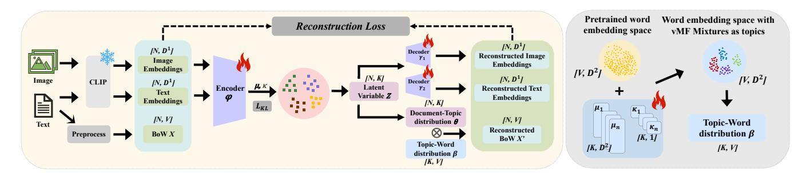
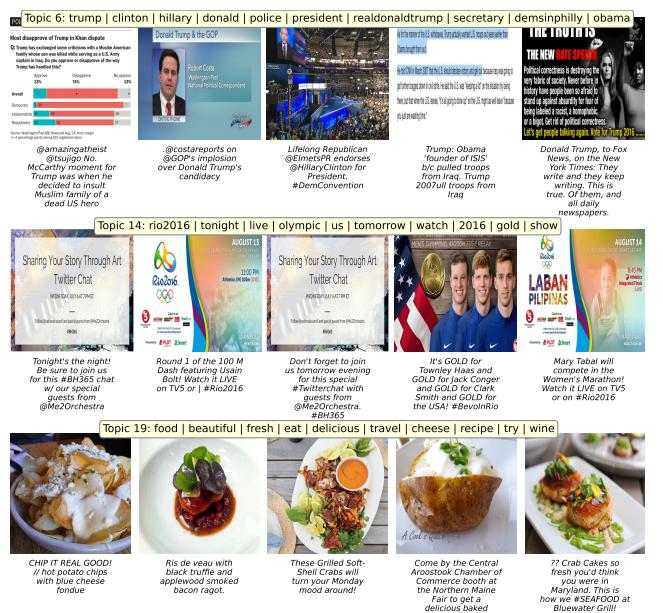
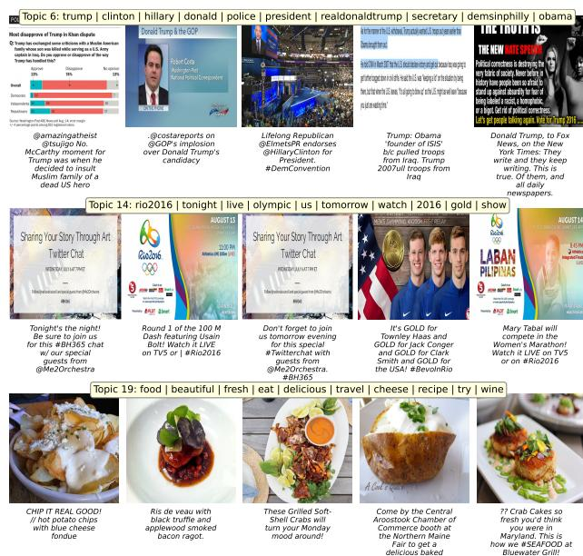
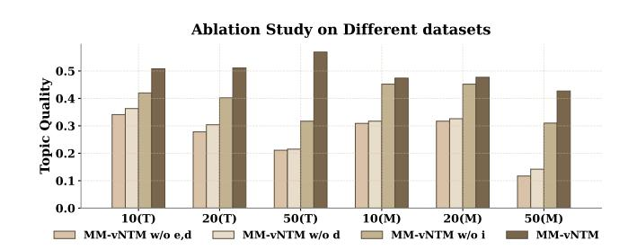

# Multimodal Topic Discovery in Web Media via von Mises-Fisher Mixture Neural Topic Models

Dayu Guo∗ lsdayuguo@bnbu.edu.cn Guangdong Provincial/Zhuhai Key Laboratory IRADS and Department of Computer Science, Beijing Normal-Hong Kong Baptist University Zhuhai, China

Zhiwen Luo∗ Nizar Bouguila zhiwen.luo@mail.concordia.ca nizar.bouguila@concordia.ca Concordia Institute for Information Systems Engineering, Concordia University Montreal, Canada

Wentao Fan† wentaofan@bnbu.edu.cn Guangdong Provincial/Zhuhai Key Laboratory IRADS and Department of Computer Science, Beijing Normal-Hong Kong Baptist University Zhuhai, China

### Abstract

Topic modeling plays a critical role in organizing and understanding large-scale web content. While neural topic models (NTMs) based on variational autoencoders (VAEs) have achieved notable success in analyzing textual data, they remain limited in addressing the multimodal nature of modern web content. Existing unimodal or multimodal extensions often suffer from posterior collapse and fail to capture the directional semantics inherent in both text and images, resulting in incoherent topics and limited interpretability. To address these challenges, we propose MM-vNTM (MultiModal Neural Topic Model with von Mises-Fisher Mixtures), a framework for web-scale topic discovery over multimodal data. MM-vNTM leverages pre-aligned cross-modal embeddings as inputs and jointly models document-level representations of text and image modalities in a shared hyperspherical latent space. Furthermore, it defines topics as mixtures of von Mises-Fisher (vMF) distributions in the ��2 normalized word embedding space, explicitly capturing directional similarity. Experiments on multimedia web datasets demonstrate that MM-vNTM consistently outperforms state-of-the-art unimodal and multimodal baselines in terms of overall topic quality, highlighting its effectiveness for real-world web scenarios.

### CCS Concepts

### • Computing methodologies → Information extraction; Topic modeling.

# Keywords

Neural Topic Modeling, Multimodal Learning, Variational Autoencoder, von Mises-Fisher distribution

### ACM Reference Format:

Dayu Guo, Zhiwen Luo, Nizar Bouguila, and Wentao Fan. 2026. Multimodal Topic Discovery in Web Media via von Mises-Fisher Mixture Neural Topic Models. In Proceedings of the ACM Web Conference 2026 (WWW '26), April

†Corresponding author.

[This work is licensed under a Creative Commons Attribution 4.0 International License.](https://creativecommons.org/licenses/by/4.0)

WWW '26, Dubai, United Arab Emirates © 2026 Copyright held by the owner/author(s). ACM ISBN 979-8-4007-2307-0/2026/04 <https://doi.org/10.1145/3774904.3792956>

13–17, 2026, Dubai, United Arab Emirates. ACM, New York, NY, USA, [4](#page-3-0) pages. <https://doi.org/10.1145/3774904.3792956>

# 1 Introduction

Topic modeling is a widely adopted unsupervised technique for discovering latent semantic structures in text corpora [\[3\]](#page-3-1), and most existing methods predominantly focus on unimodal textual data. With the rapid evolution of web content, however, multimodal data combining images and text have become ubiquitous across platforms such as social media. In many real-world scenarios, textual content is short, noisy, or ambiguous, which hinders coherent topic discovery, whereas accompanying images provide complementary visual semantics [\[6\]](#page-3-2). Integrating such visual information thus offers a promising avenue for more robust and interpretable topic modeling in real-world web scenarios.

Most existing multimodal topic models are extensions of Latent Dirichlet Allocation (LDA) [\[3\]](#page-3-1), and therefore inherit its fundamental limitations. These include a reliance on sampling-based or variational inference, which is computationally intensive, and a dependence on word co-occurrence statistics, which thereby restricts the capacity to capture deep semantics. Furthermore, many models process textual and visual modalities independently, limiting effective cross-modal semantic integration.

To improve both inference efficiency and semantic modeling capacity, neural topic models (NTMs) based on variational autoencoders (VAEs) have emerged [\[15\]](#page-3-3). For instance, the Embedded Topic Model (ETM) [\[5\]](#page-3-4) enhances topic coherence by incorporating pre-trained word embeddings, while ZeroShotTM [\[2\]](#page-3-5) and CombinedTM [\[1\]](#page-3-6) utilize contextualized embeddings for richer document-level representations. Despite these advances, most VAEbased NTMs adopt a Gaussian prior, which tends to concentrate the learned representations (particularly low-dimensional documentlevel embeddings) near the origin of the latent space, causing them to become geometrically entangled [\[17\]](#page-3-7). Moreover, Gaussian-based VAEs are prone to posterior collapse [\[4\]](#page-3-8), leading to poor-quality representations and degraded topic quality.

VAEs naturally accommodate multimodal inputs through joint encoding with neural networks, and recent efforts have extended VAE-based NTMs to multimodal settings. For instance, Multimodal-ZeroShotTM [\[6\]](#page-3-2) leverages pre-aligned image and text representations and fuses them into a shared latent space (e.g., using CLIP-style encoders [\[14\]](#page-3-9)), while Multimodal-Contrast [\[6\]](#page-3-2) introduces a crossmodal contrastive loss to strengthen semantic alignment across

∗Both authors contributed equally to this research.

| Num Evaluation        | of Topics Metrics | �� �� | 10 TD | Quality | �� �� | 20 TD | Quality | �� �� | 50 TD | Quality |
|-----------------------|-------------------|-------|-------|---------|-------|-------|---------|-------|-------|---------|
| LDA                   | (2003)            | 0.370 | 0.860 | 0.318   | 0.310 | 0.985 | 0.305   | 0.271 | 0.974 | 0.264   |
| NeuralLDA             | (2017)            | 0.395 | 1.000 | 0.395   | 0.338 | 1.000 | 0.338   | 0.381 | 0.954 | 0.364   |
| ETM                   | (2020)            | 0.360 | 0.210 | 0.076   | 0.365 | 0.185 | 0.068   | 0.380 | 0.174 | 0.066   |
| ZeroShotTM            | (2021)            | 0.401 | 0.950 | 0.381   | 0.412 | 0.675 | 0.278   | 0.448 | 0.470 | 0.211   |
| CombinedTM            | (2021)            | 0.403 | 0.930 | 0.375   | 0.432 | 0.675 | 0.292   | 0.463 | 0.522 | 0.241   |
| BERTopic Twitter100k  | (2022)            | 0.411 | 0.920 | 0.378   | 0.491 | 0.910 | 0.447   | 0.381 | 0.940 | 0.358   |
| vONT                  | (2023)            | 0.409 | 0.970 | 0.397   | 0.330 | 1.000 | 0.330   | 0.337 | 1.000 | 0.337   |
| NVGMTM                | (2023)            | 0.385 | 0.680 | 0.262   | 0.327 | 0.520 | 0.170   | 0.347 | 0.370 | 0.128   |
| Multimodal-ZeroShotTM | (2024)            | 0.378 | 0.960 | 0.363   | 0.385 | 0.790 | 0.304   | 0.438 | 0.490 | 0.215   |
| Multimodal-Contrast   | (2024)            | 0.506 | 0.860 | 0.435   | 0.501 | 0.900 | 0.451   | 0.503 | 0.824 | 0.414   |
| MM-vNTM               | (Ours)            | 0.508 | 1.000 | 0.508   | 0.511 | 1.000 | 0.511   | 0.580 | 0.982 | 0.569   |
| MS COCO               |                   |       |       |         |       |       |         |       |       |         |
| LDA                   | (2003)            | 0.420 | 0.880 | 0.370   | 0.428 | 0.835 | 0.357   | 0.378 | 0.756 | 0.286   |
| NeuralLDA             | (2017)            | 0.329 | 1.000 | 0.329   | 0.345 | 1.000 | 0.345   | 0.371 | 0.822 | 0.305   |
| ETM                   | (2020)            | 0.240 | 0.120 | 0.029   | 0.236 | 0.085 | 0.020   | 0.231 | 0.062 | 0.014   |
| ZeroShotTM            | (2021)            | 0.369 | 0.920 | 0.339   | 0.441 | 0.720 | 0.317   | 0.368 | 0.318 | 0.117   |
| CombinedTM            | (2021)            | 0.373 | 0.970 | 0.362   | 0.392 | 0.780 | 0.306   | 0.394 | 0.394 | 0.155   |
| BERTopic              | (2022)            | 0.441 | 0.850 | 0.375   | 0.463 | 0.765 | 0.354   | 0.498 | 0.698 | 0.348   |
| vONT                  | (2023)            | 0.358 | 1.000 | 0.358   | 0.354 | 0.980 | 0.347   | 0.353 | 0.972 | 0.343   |
| NVGMTM                | (2023)            | 0.249 | 0.720 | 0.180   | 0.283 | 0.555 | 0.157   | 0.299 | 0.352 | 0.105   |
| Multimodal-ZeroShotTM | (2024)            | 0.324 | 0.980 | 0.317   | 0.418 | 0.780 | 0.326   | 0.388 | 0.366 | 0.142   |
| Multimodal-Contrast   | (2024)            | 0.427 | 0.780 | 0.333   | 0.422 | 0.905 | 0.382   | 0.425 | 0.862 | 0.366   |
| MM-vNTM               | (Ours)            | 0.474 | 1.000 | 0.474   | 0.479 | 0.995 | 0.477   | 0.513 | 0.832 | 0.427   |
| LDA                   | (2003)            | 0.462 | 0.560 | 0.259   | 0.424 | 0.615 | 0.260   | 0.385 | 0.690 | 0.265   |
| NeuralLDA             | (2017)            | 0.329 | 0.990 | 0.326   | 0.287 | 0.950 | 0.272   | 0.315 | 0.690 | 0.217   |
| ETM                   | (2020)            | 0.366 | 0.190 | 0.070   | 0.362 | 0.135 | 0.049   | 0.381 | 0.112 | 0.043   |
| ZeroShotTM            | (2021)            | 0.452 | 0.850 | 0.384   | 0.484 | 0.615 | 0.298   | 0.494 | 0.336 | 0.166   |
| CombinedTM            | (2021)            | 0.478 | 0.760 | 0.363   | 0.480 | 0.630 | 0.303   | 0.498 | 0.326 | 0.162   |
| BERTopic Flickr30k    | (2022)            | 0.451 | 0.680 | 0.307   | 0.504 | 0.710 | 0.358   | 0.492 | 0.736 | 0.362   |
| vONT                  | (2023)            | 0.372 | 0.960 | 0.357   | 0.351 | 0.980 | 0.344   | 0.312 | 0.768 | 0.239   |
| NVGMTM                | (2023)            | 0.285 | 0.690 | 0.197   | 0.317 | 0.495 | 0.157   | 0.303 | 0.262 | 0.079   |
| Multimodal-ZeroShotTM | (2024)            | 0.455 | 0.870 | 0.395   | 0.451 | 0.700 | 0.316   | 0.441 | 0.344 | 0.152   |
| Multimodal-Contrast   | (2024)            | 0.342 | 0.720 | 0.246   | 0.442 | 0.795 | 0.351   | 0.430 | 0.684 | 0.294   |
| MM-vNTM               | (Ours)            | 0.414 | 1.000 | 0.414   | 0.472 | 0.990 | 0.467   | 0.463 | 0.806 | 0.373   |

potato!

Figure 2: Sample topics discovered from Twitter100k (top 10 words and top-5 image-text documents by topic probability).

# 3.2 Ablation Study

To evaluate the contribution of individual components: hyperspherical prior of latent space (e), vMF mixture topic modeling in word embedding space (d), and image-features input (i), we conduct an ablation study on three variants. As shown in Fig. [3,](#page-3-20) removing any component degrades performance, confirming their complementary roles. Removing both hyperspherical prior and vMF topic modeling (w/o e,d) yields the lowest scores, highlighting the limitations of Gaussian priors and fixed-point topic representations. Restoring the hyperspherical encoder alone (w/o d) brings marginal improvement, whereas reintroducing vMF mixture modeling (w/o i) significantly boosts coherence. Notably, even without image input (w/o i), the model substantially outperforms the fully ablated variant, attesting to the efficacy of geometric topic modeling with vMF distributions. Finally, the full MM-vNTM incorporating all components achieves consistent improvements (most pronounced at 50topics), validating that visual semantics enriches document representation and mitigates text sparsity in multimodal corpora.

Figure 3: Ablation study results under different topic number settings (10, 20, 50) on Twitter100k (T) and MS COCO (M).

### 4 Conclusion

In this work, we proposed MM-vNTM, a multimodal VAE-based NTM that unifies image-text features for learning document representations and models topics as vMF mixtures over the word embedding space. By enabling adaptive control of topic concentration and jointly reconstructing multimodal representations, MM-vNTM yields more coherent, diverse, and semantically grounded topics, advancing multimodal topic modeling for real-world web data. In future work, we plan to extend MM-vNTM to additional modalities such as audio and video, and to develop online or incremental inference schemes for streaming web content.

### Acknowledgments

The completion of this work was supported by the National Natural Science Foundation of China (62276106), Guangdong Basic and Applied Basic Research Foundation (2024A1515011767), the Guangdong Provincial Key Laboratory IRADS (2022B1212010006), and the Fonds de recherche du Québec (FRQ).

### References

[1] Federico Bianchi, Silvia Terragni, and Dirk Hovy. 2021. Pre-training is a hot topic: Contextualized document embeddings improve topic coherence. In Proceedings of the 59th annual meeting of the ACL and the 11th IJCNLP. 759–766. [2] Federico Bianchi, Silvia Terragni, Dirk Hovy, Debora Nozza, and Elisabetta Fersini. 2021. Cross-lingual contextualized topic models with zero-shot learning. In Proceedings of the 16th conference of the European chapter of the association for computational linguistics: Main volume. 1676–1683. [3] David M Blei, Andrew Y Ng, and Michael I Jordan. 2003. Latent dirichlet allocation. Journal of machine Learning research 3, Jan (2003), 993–1022. [4] Tim R Davidson, Luca Falorsi, Nicola De Cao, Thomas Kipf, and Jakub M Tomczak. 2018. Hyperspherical variational auto-encoders. In UAI 2018. Association For Uncertainty in Artificial Intelligence (AUAI), 856–865. [5] Adji B Dieng, Francisco JR Ruiz, and David M Blei. 2020. Topic modeling in embedding spaces. TACL 8 (2020), 439–453. [6] Felipe Gonzalez-Pizarro and Giuseppe Carenini. 2024. Neural Multimodal Topic Modeling: A Comprehensive Evaluation. In LREC-COLING 2024. 12159–12172. [7] Maarten Grootendorst. 2022. BERTopic: Neural topic modeling with a class-based TF-IDF procedure. arXiv preprint arXiv:2203.05794 (2022). [8] Yuting Hu, Liang Zheng, Yi Yang, and Yongfeng Huang. 2017. Twitter100k: A real-world dataset for weakly supervised cross-media retrieval. IEEE Transactions on Multimedia 20, 4 (2017), 927–938. [9] Zhixiang Li, Zhiwen Luo, Nizar Bouguila, Weifeng Su, and Wentao Fan. 2025. Disentangled representation learning for multi-view clustering via von Mises– Fisher hyperspherical embedding. Neural Networks 191 (2025), 107802. [10] Tsung-Yi Lin, Michael Maire, Serge Belongie, James Hays, Pietro Perona, Deva Ramanan, Piotr Dollár, and C Lawrence Zitnick. 2014. Microsoft coco: Common objects in context. In ECCV. Springer, 740–755. [11] Zhiwen Luo, Wentao Fan, Manar Amayri, and Nizar Bouguila. 2025. Dynamic Deep Clustering of High-Dimensional Directional Data via Hyperspherical Embeddings with Bayesian Nonparametric Mixtures. In Proceedings of the 31st ACM SIGKDD Conference on Knowledge Discovery and Data Mining V. 1. 938–949. [12] Zhiwen Luo, Wentao Fan, Manar Amayri, and Nizar Bouguila. 2026. Adaptive deep clustering via disentangled hyperspherical VAEs with contrastive geometry optimization. Neurocomputing 670 (2026), 132625. [13] Jeffrey Pennington, Richard Socher, and Christopher D Manning. 2014. Glove: Global vectors for word representation. In EMNLP 2014. 1532–1543. [14] Alec Radford, Jong Wook Kim, Chris Hallacy, Aditya Ramesh, Gabriel Goh, Sandhini Agarwal, Girish Sastry, Amanda Askell, Pamela Mishkin, Jack Clark, et al. 2021. Learning transferable visual models from natural language supervision. In ICML. PmLR, 8748–8763. [15] Akash Srivastava and Charles Sutton. 2017. Autoencoding Variational Inference For Topic Models. In International Conference on Learning Representations. [16] Yi-Kun Tang, Heyan Huang, Xuewen Shi, and Xian-Ling Mao. 2023. Neural variational gaussian mixture topic model. ACM Transactions on Asian and Low-Resource Language Information Processing 22, 4 (2023), 1–18. [17] Weijie Xu, Xiaoyu Jiang, Srinivasan Sengamedu Hanumantha Rao, Francis Iannacci, and Jinjin Zhao. 2023. vONTSS: vMF based semi-supervised neural topic modeling with optimal transport. In Findings of ACL 2023. 4433–4457. [18] Peter Young, Alice Lai, Micah Hodosh, and Julia Hockenmaier. 2014. From image descriptions to visual denotations: New similarity metrics for semantic inference over event descriptions. Trans. Assoc. Comput. Linguistics 2 (2014), 67–78.