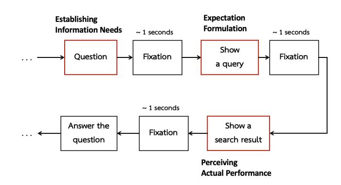

# Predicting Expectancy Violations Using Eye-Tracking Features: A Machine Learning Approach

[Sakrapee Paisalnan](https://orcid.org/1234-5678-9012) paisalnan\_s@su.ac.th Department of Electrical Engineering Silpakorn University Nakhon Pathom, Thailand

Yashar Moshfeghi yashar.moshfeghi@strath.ac.uk NeuraSearch Laboratory University of Strathclyde Glasgow, United Kingdom

### Abstract

Web searchers continuously form expectations about document content based on snippets and titles, yet when these expectations are violated, their attention and satisfaction are disrupted. Detecting such expectancy violations in real-time can enable adaptive, user-aware Web systems that respond to cognitive mismatches. This paper investigates whether eye-tracking features can predict expectancy violations during Web search and identifies which temporal aspects of attention carry predictive information. Using data from 34 participants performing controlled search tasks, we extracted four gaze metrics, i.e. time to first fixation, total fixation duration, number of fixations, and mean fixation duration, and trained machine learning models using a leave-one-participant-out cross-validation approach. Sustained attention features, particularly total fixation duration and number of fixations, predicted expectancy violations with 62.6% accuracy (p = .008), while initial attention metrics performed at chance. The results reveal that expectancy violations manifest through extended visual engagement rather than immediate orienting responses. The findings of this work contribute to the theoretical understanding of user–system interaction on the Web and provide a foundation for adaptive retrieval interfaces capable of detecting cognitive surprise and delivering timely support.

### CCS Concepts

• Information systems → Information retrieval; Users and interactive retrieval; • Human-centered computing → HCI theory, concepts and models.

### Keywords

Eye-Tracking, Prediction, Expectancy Disconfirmation Theory, Information Retrieval, Search behaviours

### ACM Reference Format:

Sakrapee Paisalnan and Yashar Moshfeghi. 2026. Predicting Expectancy Violations Using Eye-Tracking Features: A Machine Learning Approach. In Proceedings of the ACM Web Conference 2026 (WWW '26), April 13–17, 2026, Dubai, United Arab Emirates. ACM, New York, NY, USA, [4](#page-3-0) pages. <https://doi.org/10.1145/3774904.3792957>

### 1 Introduction

People searching the Web continuously form expectations about document content from snippets, titles, and URLs. When the content

[This work is licensed under a Creative Commons Attribution 4.0 International License.](https://creativecommons.org/licenses/by/4.0)

WWW '26, Dubai, United Arab Emirates. © 2026 Copyright held by the owner/author(s). ACM ISBN 979-8-4007-2307-0/2026/04 <https://doi.org/10.1145/3774904.3792957>

they encounter fails to match those expectations, a cognitive disruption, known as an expectancy violation, occurs. Such violations can alter users' trust, satisfaction, and subsequent behaviour during search sessions [\[1,](#page-3-1) [12\]](#page-3-2). Yet, how these expectancy mismatches unfold in real time remains poorly understood.

Prior studies have examined how expectancy violations affect search behaviour [\[12\]](#page-3-2). Related work has shown that implicit signals from log analysis [\[13\]](#page-3-3) such as dwell time [\[9,](#page-3-4) [11\]](#page-3-5), user satisfaction [\[6,](#page-3-6) [8\]](#page-3-7), and query reformulation patterns [\[6,](#page-3-6) [7\]](#page-3-8) provide insights into user experience, but most analyses rely on aggregated statistics or post-hoc self-reports. These approaches miss the fine-grained attentional dynamics that reveal when and how expectancy effects emerge during document evaluation. To move beyond static outcome measures, we need continuous behavioural signals that capture users' evolving cognitive states as interactions unfold on the Web.

Eye-tracking provides a rich, time-resolved window into visual attention [\[3,](#page-3-9) [4,](#page-3-10) [14\]](#page-3-11), allowing researchers to identify subtle shifts in engagement that correspond to expectation mismatch. However, it is unclear which specific attention metrics, initial allocation, sustained processing, or both, are most informative for detecting expectancy violations. At the same time, machine learning offers the opportunity to determine, in a data-driven manner, which behavioural features best discriminate between expectancy confirmation and violation without imposing a priori assumptions.

This paper bridges these perspectives by combining eye-tracking with machine learning to examine whether expectancy violations can be predicted from visual attention patterns during information search. Specifically, we ask:

- Can machine learning classifiers reliably distinguish expectancy violations from confirmations using eye-tracking metrics?
- Which temporal components of attention, initial allocation (e.g., time to first fixation) or sustained engagement (e.g., total fixation duration, number of fixations), carry predictive information?

Addressing these questions advances theoretical understanding of expectancy-driven cognition in Web search and lays a foundation for adaptive retrieval systems that can detect cognitive surprise in real time. By identifying temporal attention signatures of expectancy violations, this work contributes to the development of Web interfaces that are both cognitively responsive and user-aware.

## 2 Methodology

Design. We used a within-subjects design in which all participants experienced both expectancy-confirming and expectancy-violating conditions. The independent variable was expectancy condition with two levels: (1) expectancy confirmation (document content matched

the query and user expectations) and (2) expectancy violation (document content did not match the query and user expectations). The dependent variables were four eye-tracking metrics: (1) total fixation duration, (2) number of fixations, (3) mean fixation duration, and (4) time to first fixation. Each participant completed 40 trials: 20 expectancy-confirming scenarios and 20 expectancyviolating scenarios, presented in randomised order to control for order effects.

Participants and Ethical Approval. Forty participants (12 male, 28 female; mean age = 21.8, SD = 0.91) were recruited from Silpakorn University (undergraduate students and staff, normal or correctedto-normal vision, experienced with online search). Six participants were excluded due to calibration issues or incomplete data, leaving 34 for analysis.

Experimental Design and Materials. We developed 40 questionanswering tasks validated by five independent assessors: 20 designed to create expectancy-confirming scenarios and 20 designed to create expectancy-violating scenarios. Assessors independently evaluated two aspects: (1) whether the query would elicit expectations of relevant information for answering the question, and (2) whether the document content could effectively help answer the question. For expectancy-confirming trials, both the query and document were designed to directly answer the question. In expectancyviolating trials, the query appeared relevant to the question, but the document, while topically related, provided tangential or indirect information that could not effectively answer it. Each trial presented participants with a question, four answer options (including "need to search"), a query text to be used for searching (to allow expectation formation), and, finally, a document that either confirmed or violated those expectations based on its content relevance and match to the query.

Experimental Procedure. Ethical approval was obtained from the Silpakorn University Institutional Review Board (Protocol No. REC 67.1008-156-7882). Participants were given an information sheet describing the experiment and then signed a consent form stating that they could withdraw at any time. They subsequently completed an entry questionnaire that collected demographic and background information. Participants then completed 40 trials while their eye movements were recorded (Figure 1). Each trial began with a question and a set of answer options. If participants selected "need to search," they viewed a query text (to form expectations about the search results), then rated their expectations from the query, followed by viewing a document that either confirmed or violated those expectations. After viewing each document, participants were asked to rate its performance in answering the question. They then answered comprehension questions and concluded by indicating whether they were satisfied with the document. The trial order was randomised to avoid order effects. The full session lasted approximately 60 minutes.

Apparatus. Stimuli were presented using PsychoPy on a 24-inch monitor. Eye movements were recorded using a Tobii Pro Spark eye tracker (60 Hz sampling rate) with standard 9-point calibration (error <0.5° visual angle).

Eye tracking Feature Extraction. We extracted four standard eye-tracking metrics for each document viewing episode: (1) total

Figure 1: Experimental procedure showing question presentation, expectation formation from query viewing, and document viewing with continuous eye-tracking.

fixation duration — cumulative time spent fixating on the document (milliseconds), (2) number of fixations — count of distinct fixations, (3) mean fixation duration — average duration per fixation (milliseconds), and (4) time to first fixation — latency from document presentation to first fixation (milliseconds). These metrics capture different temporal aspects of visual attention: time to first fixation reflects initial attentional allocation, total fixation duration indicates sustained engagement, number of fixations represents examination frequency and re-examination behaviour, and mean fixation duration reflects processing depth during individual viewing episodes.

Machine Learning Classification. We trained ten classification algorithms: Logistic Regression, Random Forest, Gradient Boosting, Support Vector Machine (SVM) with linear and RBF kernels, Naive Bayes, K-Nearest Neighbours (K-NN), Decision Tree (max depth = 5), Multi-Layer Perceptron (MLP) with early stopping, and Linear Discriminant Analysis (LDA).

To identify which metrics contain predictive information, we trained models on six different feature combinations: (1) total fixation duration combined with number of fixations (sustained attention metrics), (2) total fixation duration alone, (3) number of fixations alone, (4) mean fixation duration alone, (5) time to first fixation alone (initial attention), and (6) all four features combined.

Validation Strategy. We employed three validation approaches: (1) 80/20 train-test split for initial assessment, (2) 10-fold cross-validation for stability assessment, and (3) leave-one-participant-out (LOPO) cross-validation for testing generalisation to new individuals. LOPO ensures classification performance reflects patterns generalising across individuals rather than memorising participant-specific idiosyncrasies.

To prevent data leakage, standardisation parameters (mean and standard deviation) were calculated from training data only within each fold and applied to test data.

Statistical Testing. We used permutation testing (1,000 iterations) to assess whether classification accuracy exceeded chance. For each permutation, we randomly shuffled condition labels and retrained models, generating a null distribution of accuracies expected by chance. P-values represent the proportion of permutations achieving accuracy equal to or exceeding the observed accuracy.

Effect Size. We quantified effect sizes using Cohen's h for differences in proportions, with h = 0.2 considered small, h = 0.5 medium, and h = 0.8 large.

Implementation. All analyses used Python 3.x with scikit-learn. Features were standardised (z-scored) before training. For each feature set, we report the best-performing model based on LOPO accuracy.

### 3 Results

Our experimental manipulation successfully induced expectancy violations; we analysed disconfirmation ratings and satisfaction data from the 375 document-viewing episodes. Expectancy-confirming trials yielded a mean disconfirmation of +0.30 (SD=1.03), indicating that performance slightly exceeded expectations. Expectancyviolating trials yielded a mean disconfirmation of -0.68 (SD=1.31), indicating performance fell short of expectations. This difference was highly significant with a large effect size (t=8.09, p<.001, Cohen's d=0.83). Satisfaction was reported in 96.0% of confirming trials versus 78.2% of violating trials, a 17.8 percentage-point difference (t = 4.18, p < .001, Cohen's d = 0.79). These measures confirm that our manipulation successfully induced genuine expectancy violations, with participants consciously experiencing negative disconfirmation and reduced satisfaction with the violating condition.

Eye-Tracking Classification Results. Table 1 presents classification performance across all feature sets. Results reveal a clear hierarchy of predictive utility.

Our main result is that sustained attention metrics successfully predict expectancy violations during web search, while initial attention metrics do not. Specifically, the combination of total fixation duration and number of fixations achieved 62.6% classification accuracy (p = .008), representing a statistically significant 11.4 percentage-point improvement over baseline chance level (51.2%). In contrast, initial attention allocation (time to first fixation) performed at chance level (49.7%, p = .568), revealing temporal specificity in how expectancy violations manifest through visual attention patterns.

Sustained Attention Metrics Successfully Predict Expectancy Violations. The combination of total fixation duration and number of fixations achieved the strongest performance (SVM-RBF: 62.6% LOPO accuracy, p=.008, h=0.231), representing a statistically significant 11.4 percentage-point improvement over chance (51.2%) with small-to-medium effect size. Each metric independently also predicted above chance: total fixation duration achieved 61.3% accuracy (SVM-RBF, p=.010, h=0.204) and number of fixations achieved 59.7% accuracy (Decision Tree, p=.013, h=0.171).

Expectancy-violating trials showed 15.3% longer total fixation duration (M=5.66s vs. 4.91s, t=-2.24, p=.026, d=0.23) and more fixations (M=14.37 vs. 13.15, t=-1.08, p=.279, d=0.11), indicating each metric independently captures reliable information about expectancy conditions.

Non-Predictive Features and Combined Models. In contrast, using other metrics failed to predict the expectancy violation. Mean fixation duration did not achieve significant classification (K-NN: 53.6% accuracy, p=.332, h=0.048) , suggesting that average processing depth per fixation does not systematically differ between conditions. Similarly, time to first fixation performed at chance level (Random Forest: 49.7% accuracy, p=.568, h=-0.031). Furthermore, combining all four features did not improve performance (Decision Tree: 53.0%, p=.376, h=0.036), likely because the inclusion of these non-predictive features diluted the predictive signal from sustained attention metrics.

### 4 Discussion

This study demonstrates that machine learning classifiers can reliably predict expectancy violations from eye-tracking metrics, achieving 62.6% accuracy using sustained attention features. Critically, predictive information resides specifically in sustained engagement metrics (total fixation duration, number of fixations) rather than initial attention metrics (time to first fixation) or average processing depth (mean fixation duration). This temporal specificity reveals when and how expectancy violations manifest in observable attention patterns during information search.

Temporal Dynamics of Expectancy Effects. The success of sustained attention metrics combined with the failure of initial attention metrics indicates that expectancy violations do not trigger immediate, detectable changes in initial attention allocation. Instead, expectancy effects emerge during extended document examination. Both expectancy-confirming and expectancy-violating documents receive similar initial attention, with systematic differences appearing through the course of viewing.

This temporal pattern suggests that expectancy influences operate during document evaluation rather than during initial orienting. Searchers appear to give all accessed documents fair initial consideration regardless of expectation match, with expectancy effects manifesting through sustained processing patterns.

Cumulative engagement and examination frequency: The predictive success of both total fixation duration (a cumulative measure) and the number of fixations (a frequency measure) indicates that expectancy violations create distinctive patterns in both the amount and the structure of visual attention. This combination suggests that expectancy match influences multiple aspects of how searchers interact with content over time.

Processing depth remains constant: The failure of mean fixation duration to predict expectancy conditions suggests that the intensity of processing during individual fixation episodes may not systematically differ between conditions, or any differences are too variable across participants or contexts to support reliable prediction. Expectancy effects appear to manifest in overall engagement patterns rather than moment-to-moment processing depth.

Relationship to Broader Information Search Literature. These findings connect to several theoretical frameworks in the information search.

Information Search Process models: Kuhlthau's ISP model describes stages involving uncertainty, exploration, and formulation [\[10\]](#page-3-12). Our findings suggest that expectancy violations require additional cognitive processing, as evidenced by increased fixation duration and frequency. This extended visual engagement may indicate that users are attempting to reconcile unexpected content with their initial expectations, a process that demands greater cognitive effort.

Relevance judgment frameworks: Models that emphasise multidimensional relevance judgments align with our findings—expectancy violations may require more complex evaluations on multiple criteria (topical relevance, novelty, reliability), manifesting as extended visual attention [\[2,](#page-3-13) [5,](#page-3-14) [15\]](#page-3-15).

Table 1: Classification Performance Across Eye-Tracking Feature Sets

| Feature      | Set        | Best     | Model  | LOPO  | Accu    |              |         |               |
|--------------|------------|----------|--------|-------|----------|--------------|---------|---------------|
|              |            |          |        |       | p -value | Chance Level | Cohen’s | h Effect Size |
| Fixation     | + NumLooks | SVM      | (RBF)  | 0.626 | .008**   | 0.512        | 0.231   | Small-Medium  |
| Fixation     | Only       | SVM      | (RBF)  | 0.613 | .010*    | 0.512        | 0.204   | Small-Medium  |
| NumLooks     | Only       | Decision | Tree   | 0.597 | .013*    | 0.512        | 0.171   | Small         |
| AvgGaze      | Only       | K-NN     |        | 0.536 | .332     | 0.512        | 0.048   | Negligible    |
| All Features |            | Decision | Tree   | 0.530 | .376     | 0.512        | 0.036   | Negligible    |
| TTFF         | Only       | Random   | Forest | 0.497 | .568     | 0.512        | − 0.031 | Negligible    |

Note. LOPO = Leave-one-participant-out cross-validation accuracy. p-values derived from permutation testing (1,000 iterations). Chance level represents the proportion of the majority class (confirm condition, 51.2%). Cohen's h quantifies effect size for differences in proportions (0.2 = small, 0.5 = medium, 0.8 = large). Fixation = total fixation duration; NumLooks = number of fixations; AvgGaze = mean fixation duration; TTFF = time to first fixation; K-NN = K-Nearest Neighbours. Best model indicates the algorithm achieving highest LOPO accuracy for each feature set. (\*p < .05. \*\*p < .01.)

Attention and interaction [\[4\]](#page-3-10): The distinction between initial and sustained attention in our results supports models that separate orienting (initial attention allocation) from sustained evaluation (extended processing), suggesting that these operate through different mechanisms during search.

Search behaviour prediction: Our work extends the growing literature on predicting search behaviours and outcomes from finegrained behavioural signals, demonstrating that internal cognitive states (expectancy match) can be inferred from observable attention patterns.

Limitations and Future Directions. While our controlled design enabled rigorous manipulation, future work should validate findings in naturalistic settings with user-generated queries and integrate eye-tracking measures with qualitative methods to deepen understanding of expectancy violation experiences.

### 5 Conclusion

This study demonstrates that machine learning classifiers can reliably predict expectancy violations during information search from eye-tracking metrics, with sustained attention features (total fixation duration and number of fixations) achieving 62.6% accuracy (p = .008). Initial attention metrics (time to first fixation) performed at chance level, revealing temporal specificity: expectancy effects manifest in sustained processing rather than initial attention allocation.

These findings advance both theory and practice in information search. Theoretically, they reveal when and how expectancy violations manifest in observable behaviour, constraining models of expectancy effects in search. Methodologically, they demonstrate the value of machine learning for data-driven discovery of which behavioural signals contain predictive information. In practice, they open the door to adaptive search systems that detect and respond to expectancy violations in real time.

The ability to predict expectancy violations from sustained attention patterns provides objective evidence that expectancy match systematically influences search behaviour in ways that generalise across individuals. This predictive approach complements traditional statistical analyses and offers new tools for both research and system design in information search.

### Acknowledgments

This research is financially supported by Thailand Science Research and Innovation (TSRI) National Science, Research and Innovation Fund (NSRF) (Fiscal Year 2024)

### References

- [1] Anol Bhattacherjee. 2001. Understanding information systems continuance: An expectation-confirmation model. MIS quarterly (2001), 351–370. [2] Pia Borlund. 2003. The concept of relevance in IR. Journal of the American Society for information Science and Technology 54, 10 (2003), 913–925. [3] Georg Buscher, Andreas Dengel, Ralf Biedert, and Ludger V Elst. 2012. Attentive documents: Eye tracking as implicit feedback for information retrieval and beyond. ACM Transactions on Interactive Intelligent Systems (TiiS) 1, 2 (2012), 1–30. [4] Laura A Granka, Thorsten Joachims, and Geri Gay. 2004. Eye-tracking analysis of user behavior in WWW search. In Proceedings of the 27th annual international ACM SIGIR conference on Research and development in information retrieval. 478–
- 479. [5] Jacek Gwizdka. 2014. Characterizing relevance with eye-tracking measures. In Proceedings of the 5th information interaction in context symposium. 58–67. [6] Ahmed Hassan, Xiaolin Shi, Nick Craswell, and Bill Ramsey. 2013. Beyond clicks: query reformulation as a predictor of search satisfaction. In Proceedings of the 22nd ACM international conference on Information & Knowledge Management. 2019–2028. [7] Bernard J Jansen, Danielle L Booth, and Amanda Spink. 2009. Patterns of query reformulation during web searching. Journal of the american society for information science and technology 60, 7 (2009), 1358–1371. [8] Jiepu Jiang, Ahmed Hassan Awadallah, Xiaolin Shi, and Ryen W White. 2015. Understanding and predicting graded search satisfaction. In Proceedings of the eighth ACM international conference on web search and data mining. 57–66. [9] Youngho Kim, Ahmed Hassan, Ryen W White, and Imed Zitouni. 2014. Modeling dwell time to predict click-level satisfaction. In Proceedings of the 7th ACM international conference on Web search and data mining. 193–202. [10] Carol C Kuhlthau. 1991. Inside the search process: Information seeking from the user's perspective. Journal of the American society for information science 42, 5 (1991), 361–371. [11] Jingjing Liu and Nicholas J Belkin. 2015. Personalizing information retrieval for multi-session tasks: Examining the roles of task stage, task type, and topic knowledge on the interpretation of dwell time as an indicator of document usefulness. Journal of the Association for Information Science and Technology 66, 1 (2015), 58–81. [12] Jiqun Liu and Chirag Shah. 2019. Investigating the impacts of expectation disconfirmation on web search. In Proceedings of the 2019 conference on human information interaction and retrieval. 319–323. [13] Mazlita Mat-Hassan and Mark Levene. 2005. Associating search and navigation behavior through log analysis. Journal of the American Society for Information Science and Technology 56, 9 (2005), 913–934. [14] Jarkko Salojärvi, Kai Puolamäki, and Samuel Kaski. 2005. Implicit relevance feedback from eye movements. In International Conference on Artificial Neural Networks. Springer, 513–518. [15] Tefko Saracevic. 2007. Relevance: A review of the literature and a framework for thinking on the notion in information science. Part III: Behavior and effects of relevance. Journal of the American Society for information Science and Technology 58, 13 (2007), 2126–2144.