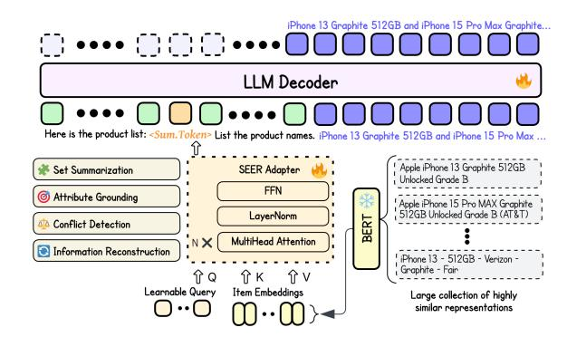
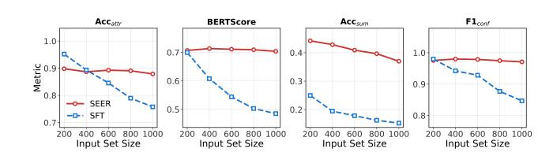

# SEER: Set Encoding for Efficient Representation in Large-Scale E-commerce

Yining Lin∗ eBay Inc. Shanghai, China yinilin@ebay.com

Yuming Shen eBay Inc. Shanghai, China yumishen@ebay.com

Yipeng Zhang eBay Inc. San Jose, CA, USA yipezhang@ebay.com

Canran Xu eBay Inc. Shanghai, China canxu@ebay.com

#### Abstract

Large Language Models (LLMs) perform well across many tasks but degrade when processing large collections of repetitive or highly similar inputs, a common scenario in applications such as nearduplicate search results and large e-commerce catalogs. In these settings, concatenation-based approaches—long-context prompting and supervised fine-tuning—suffer from attention saturation and diminished signal-to-noise ratio, causing models to miss subtle but important distinctions as input size grows. We introduce SEER (Set Encoding for Efficient Representation), a framework that enables LLMs to handle massive sets of near-duplicate items through a single learned token. SEER first encodes individual items with a pretrained embedding model, then aggregates them using an adapter that captures inter-item relationships and preserves fine-grained differences while mitigating redundancy. To ensure both discriminative and generative capabilities, we propose a multi-task alignment strategy that supervises set-level descriptions across multiple semantic dimensions. Experiments on a large-scale e-commerce dataset demonstrate that SEER substantially outperforms in-context and fine-tuned LLM baselines, maintaining stable performance even when processing thousands of highly similar items. These results establish SEER as an effective and scalable approach for LLM processing of dense, redundant input sets.

# CCS Concepts

#### • Computing methodologies → Natural language processing.

### Keywords

Large Language Models, Set Representation Learning, Token Compression, E-commerce

#### ACM Reference Format:

Yining Lin, Yuming Shen, Yipeng Zhang, and Canran Xu. 2026. SEER: Set Encoding for Efficient Representation in Large-Scale E-commerce. In Proceedings of the ACM Web Conference 2026 (WWW '26), April 13–17, 2026, Dubai, United Arab Emirates. ACM, New York, NY, USA, [4](#page-3-0) pages. <https://doi.org/10.1145/3774904.3792958>

WWW '26, Dubai, United Arab Emirates © 2026 Copyright held by the owner/author(s). ACM ISBN 979-8-4007-2307-0/2026/04 <https://doi.org/10.1145/3774904.3792958>

Figure 1: Overview of the SEER architecture. A variable-sized set of items is embedded by pretrained BERT models and compressed by the SEER adapter into a single token, which is then combined with a task-specific prompt to produce a set-level understanding or discrimination.

# 1 Introduction

Large Language Models (LLMs) have demonstrated strong capabilities across many domains [\[1\]](#page-3-1). However, they struggle when processing large amounts of repetitive or highly similar information, as observed in recent studies on very long contexts [\[2\]](#page-3-2). This regime is common in practice: near-duplicate search results, paraphrase clusters, and large e-commerce catalogs often contain dozens or hundreds of semantically overlapping items [\[3\]](#page-3-3). As repetition accumulates, token-level attention becomes saturated, signal-tonoise drops, and subtle yet important differences are obscured [\[4\]](#page-3-4). Developing methods that allow LLMs to efficiently process such dense, redundant sets remains an open challenge.

Current approaches remain inadequate for this challenge. Both long-context prompting and supervised fine-tuning concatenate all inputs into a single prompt, causing performance to degrade as the number of items grows: attention becomes overloaded, signalto-noise decreases, and fine-grained distinctions are lost [\[5,](#page-3-5) [6\]](#page-3-6). Consequently, these methods do not scale while preserving the ability to discriminate among similar items or to produce coherent summaries for large, redundant input sets [\[7\]](#page-3-7). This limitation is especially evident in e-commerce, where models must analyze vast collections of near-duplicate listings to identify and summarize subtle, distinguishing attributes. Because these listings are highly similar, effective processing requires explicitly modeling inter-item differences and relationships, which standard token-level attention mechanisms do not provide.

To effectively process massive sets of near-duplicate items in ecommerce, we propose the Set Encoding for Efficient Representation

∗Work done during an internship at eBay Inc.

[This work is licensed under a Creative Commons Attribution-NonCommercial-](https://creativecommons.org/licenses/by-nc-nd/4.0)[NoDerivatives 4.0 International License.](https://creativecommons.org/licenses/by-nc-nd/4.0)

(SEER), a framework that enables LLMs to handle large collections of similar items. Specifically, items are represented by a pretrained embedding model and then processed by a SEER adapter, which compresses a variable-sized set of related vectors into a compact representation directly interpretable by an LLM through a single, learned <summary\_token>. By modeling inter-item relationships and preserving subtle distinctions, SEER mitigates attention dilution and information redundancy inherent in long-context inputs. We then propose a multi-task fine-tuning strategy that constructs set-level descriptions along multiple attribute dimensions. Such multi-task training enhances both discriminative and generative performance on densely overlapping representations, effectively aggregating evidence and resolving minor inconsistencies regardless of set size. Evaluated on a large-scale e-commerce dataset, SEER maintains stable accuracy as item set size grows, avoiding the degradation observed in standard long-context LLMs. Our contributions can be summarized as follows:

- We propose SEER, a novel framework that enables LLMs to handle and summarize large collections of similar item representations using a single learnable token.
- We introduce a multi-task alignment strategy that ensures the latent representations of sets are semantically meaningful and coherent.
- We demonstrate SEER's superior performance on a large-scale e-commerce dataset requiring long-context understanding, showing that SEER outperforms both in-context and supervised finetuning baselines while maintaining stable performance even with thousands of inputs.

#### 2 Related Work

Our work connects set representation learning with LLM-based e-commerce understanding [\[8,](#page-3-8) [9\]](#page-3-9). DeepSets and Set Transformer learn permutation-invariant set summaries by pooling or attention and perform well on discriminative prediction with variable-sized inputs, but they lack a direct generative interface for LLMs and a mechanism to inject a set summary into the token stream [\[10,](#page-3-10) [11\]](#page-3-11). Thus these encoder based models are therefore insufficient for our setting, which requires both discriminative decisions and generative set-level outputs under a constant-token interface. In practice, industrial systems often rely on non-generative entity matching [\[12\]](#page-3-12), while LLM baselines concatenate all text and scale poorly due to attention saturation and redundancy [\[4\]](#page-3-4).

SEER uses a lightweight adapter to summarize the set into a single task-conditioned token that is mapped into the LLM embedding space and injected into the prompt. The idea is related to multimodal token compression that condenses images or videos into a few tokens for LLMs [\[13–](#page-3-13)[15\]](#page-3-14); here the compression operates over sets of text embeddings, leveraging modern embedding spaces [\[16,](#page-3-15) [17\]](#page-3-16). SEER is complementary to retrieval-augmented generation: retrieval selects relevant items, and SEER aggregates and structures the retrieved set before generation [\[18\]](#page-3-17).

### 3 Method

SEER is a compact neural interface that enables an LLM to process a variable-sized set of item embeddings through a single summary token. Given a set of �� embeddings �� = {���� ∈ R ���� } ��=1 produced by a pretrained encoder, an adapter computes a task-conditioned vector ���� ∈ R ��LLM that represents the entire set. Each item is first projected to keys and values by linear maps ���� = �������� and ���� = �������� with ����,���� ∈ R ���� ×���� , where ���� is the attention dimension. A learnable query ���� ∈ R ���� for task �� then attends to the set,

�� (��) = softmax�� �� ⊤ ���� √ ���� , ���� = ∑︁�� ��=1 �� (��) ���� .

The weights �� (��) �� act as soft evidence selection that highlights salient items and downweights redundancy, so ���� aggregates both shared signals and fine-grained contrasts within the set. A feedforward network then maps ���� into the LLM embedding space, producing the final vector ���� . Rather than encoding the set information as plain text, SEER directly injects it into the LLM's embedding sequence. Specifically, a special token <summary\_token> is inserted into the prompt; after tokenization, its embedding is replaced with ���� . This process creates a learned interface between the structured vector space and the LLM embedding space, enabling the model to process set-level semantics without explicit textual expansion. To enable cross-task reuse and generalization of item embeddings, we adopt an in-house BERT-based semantic encoder widely used in our search, advertising, and recommendation systems [\[19\]](#page-3-18). We keep this encoder frozen as a feature extractor to preserve cross-task compatibility and reduce training cost.

Cross-Modal Alignment. A core challenge in SEER is to bridge two different representation spaces: the continuous embedding space of item vectors and the discrete token embedding space of the LLM. Without explicit alignment, the summary token ���� may occupy a region of the embedding space that the LLM has never encountered, leading to unstable or ungrounded generation. To address this, SEER employs a staged cross-modal alignment procedure designed to gradually fuse the two modalities. (1) Alignment Stage: The LLM is frozen while the summarizer is trained under the standard next-token prediction objective on templated prompts so that the injected token behaves like a native input embedding. This ensures that the injected token resides in a region interpretable by the LLM. (2) Integration Stage: Both LLM and adapter are then fine-tuned jointly to enable smooth co-adaptation. This progressive alignment stabilizes optimization and yields a single <summary\_token> that serves as a faithful, trainable interface between structured data and natural language generation.

Table 1: Overview of SEER's multi-task alignment objectives.

|             | Component                  |       | Example    |        | Prompt       |           | Template         |                 |         |             |           |
|-------------|----------------------------|-------|------------|--------|--------------|-----------|------------------|-----------------|---------|-------------|-----------|
| System      | Prompt (shared)            | You   | are        | a      | helpful      | assistant | that             | understands and | reasons |             | about     |
|             |                            | pro   | duct       |        | information. |           | Always respond   | concisely       | and     | accurately. |           |
| Attribution | Grounding                  | Here  | is         | the    | product      | list:     | <summary_token>  | There           | may     | be          | one       |
|             |                            | or    | more       |        | types        | of        | products. What   | is the storage  | of      | the         | above     |
|             |                            | pro   |            | ducts? |              |           |                  |                 |         |             |           |
| Set         | Summarization              | Here  | is         | the    | product      | list:     | <summary_token>  | There           | may     | be          | one       |
|             |                            | or    | more       |        | types        | of        | products. Please | provide the     | product |             | names     |
|             |                            | of    | the        | above  |              | products. |                  |                 |         |             |           |
| Conflict    | Detection                  | Here  | is         | the    | product      | list:     | <summary_token>  | There           | may     | be          | one or    |
|             |                            | more  |            | types  | of           | products. | Identify the     | conflicts and   |         | consensus   | in        |
|             |                            |       | attributes |        | (brand,      | color,    | storage,         | carrier) among  | these   |             | products. |
|             | Information Reconstruction | Here  | is         | one    | item         |           | <summary_token>  | Please generate | a       |             | canonical |
|             |                            | title | for        |        | the above    | item.     |                  |                 |         |             |           |

Multi-Task Alignment Objectives. The datasets of training the SEER are chosen to shape the required processing over large, redundant sets drawn from one or more product concepts. Here, a product concept denotes a canonical product entity that groups listings referring to the same underlying item and is characterized by stable attributes such as brand, model, storage, and carrier. In this setting, each objective targets a complementary capability that the model must deploy on product concept sets: Attribution Grounding evaluates SEER's ability to infer shared attribute values (e.g., brand, model, color, storage, carrier) across heterogeneous listings; Set Summarization encourages aggregation and diversity awareness by asking the model to count and name distinct product concepts; Conflict Detection emphasizes contrastive sensitivity to fine-grained differences by separating shared attributes from conflicting ones, which is essential for near-duplicate scenarios; Information Reconstruction aligns the latent space with natural language so that the single token can support fluent decoding even when it is the only non-text input. All tasks use next-token prediction for supervision. Table [1](#page-1-0) lists the input prompt template for each objective.

### 4 Results

#### 4.1 Experimental Setup

Dataset. We evaluate on 523,422 unique cellphone listings from eBay.com, covering 2,706 product concepts as defined in Section [3.](#page-2-0) Each listing is represented by an embedding derived from textual attributes, mainly the title. Listings are grouped by shared product identifiers. Human annotators standardize titles by normalizing spelling, removing promotional phrasing, and consolidating synonyms so that the standardized title serves as the canonical concept label. Training set: 1.5 million examples constructed from these clusters. For the set-level objectives of Attribution Grounding, Set Summarization, and Conflict Detection, each sample contains 10 to 100 related items that represent 1 to 10 product concepts, with stratified coverage of brands, categories, and attribute configurations. Each query–answer pair is associated with a rule-based template that specifies the logical structure before the final prediction. For Information Reconstruction, each example contains one embedding–title pair, for a total of 60,000 examples. Test set: the same grouping logic applies. Each of the three set-level tasks has about 33,000 samples, for a total of about 99,000. Each sample contains 10 to 1,000 items and spans 1 to 10 categories, evenly distributed across these ranges.

Baseline Approaches. We compare SEER against two mainstream paradigms for set-level processing. In-context learning (ICL). We evaluate GPT-5 [\[20\]](#page-3-19) and GPT-4.1-mini [\[1\]](#page-3-1) by concatenating all item titles in the prompt. This setting tests whether the model can infer set-level patterns from text alone. Supervised fine-tuning (SFT). We fine-tune LLaMA-3.1-8B-Instruct [\[21\]](#page-3-20) on labeled instances to optimize end-task performance. This adapts the model parameters but scales poorly to large or variable-sized sets and lacks an explicit set-aggregation mechanism.

Implementation Details. SEER uses LLaMA-3.1-8B-Instruct as its backbone. The adapter has 4 multi-head attention layers with 8 heads and hidden size 512, followed by layer normalization and a feed-forward projection to the LLM dimensionality. The alignment stage uses a learning rate of 1 × 10−4 , batch size 256 and 1 training epoch on 4 H200 GPUs. The integration stage uses a learning rate of 2 × 10−5 , batch size 128, 4 epochs and a warm-up ratio of 0.03. The supervised fine-tuning baseline is trained with ms-swift on the same dataset, with learning rate 5 × 10−6 , batch size 128, warm-up ratio 0.05 and 4 epochs on 4 H200 GPUs.

Evaluation Metrics. For Attribution Grounding, we report ������attr, defined as exact-match accuracy across all requested attributes; a prediction is correct only when all attribute values match the labels. For Set Summarization, the model enumerates distinct product concepts. We report ������sum, which checks whether the predicted count matches the ground truth, and BERTScore [\[22\]](#page-3-21), which measures semantic similarity between generated type descriptions and references. For Conflict Detection, we report micro-averaged �� 1conf for identifying attribute-level differences.

#### 4.2 Performance Analysis

Table 2: Comparison with baselines and ablations. ������attr and ������sum are the accuracies for attribution grounding and set summarization; �� 1conf is the F1 for conflict detection.

Table [2](#page-2-1) summarizes the performance comparison between the baseline models and SEER. Across all evaluation metrics, SEER consistently outperforms all baselines, demonstrating superior capability in handling complex and information-dense prompts. While SFT provides moderate improvements over pure in-context learning, indicating that fine-tuning can capture subtle task-specific patterns, SEER still achieves the best overall results. Its adapter architecture effectively mitigates the degradation typically observed when prompts are excessively long or contain many similar items, allowing SEER to extract and utilize fine-grained information that conventional models fail to leverage. To further evaluate its robustness under extremely long prompts, we analyze performance as a function of input set size, which is proportional to the prompt length, and present the results in Figure [2.](#page-3-22) When the number of items exceeds 400, which is well beyond the distribution of the training data that contains at most 100 items, the performance of the SFT-optimized LLM degrades significantly. In contrast, SEER maintains strong performance, demonstrating its effectiveness in processing exceptionally long and repetitive prompts.

Ablation Study. In the bottom section of Table [2,](#page-2-1) we present ablations of three key components of SEER. Replacing the adapter with simple mean pooling (MeanPool) removes content-aware aggregation and performs poorly, showing that a learned adapter is

Figure 2: Performance vs. input-set size (bin upper bounds; 200 denotes 10–200).

necessary to capture intra-set structure. Removing the learnable query (w/o Learnable Query ���� ) turns the adapter into standard self-attention over the set; without task-specific queries, it is less able to emphasize items that matter for a given objective, which weakens conflict detection. Removing the Information Reconstruction objective (w/o Reconstruction) disrupts the semantic structure of the latent space, reducing the alignment between the summary token and natural language and degrading generation quality.

Latent Space Interpolation. We test whether SEER learns a semantically structured latent space through linear interpolation. As shown in Table [3,](#page-3-23) we mix two item embeddings ��1 and ��2 from a Samsung Galaxy S21 Ultra 128GB Phantom Silver – FAIR, and a Samsung Galaxy S23+ 256GB Phantom Black (AT&T). The composed embedding is ��composition = (1 − ��)��1 + ����2. As �� increases from 0 to 1, the generated titles change smoothly from S21 Ultra to S23+, blending capacity, color, network, and condition. This indicates that small movements in the embedding space correspond to coherent and interpretable attribute changes. In contrast, the w/o Reconstruction ablated variant shows noticeably less smooth and coherent interpolations, indicating a weaker latent structure.

Table 3: Interpolation between a Galaxy S21 and S23+, showing a smooth semantic transition of attributes.

### 5 Conclusion

We introduced SEER, which processes large sets of near-duplicate items efficiently. By compressing a variable-sized collection of item embeddings into a single summary token, SEER mitigates attention saturation and preserves fine-grained distinctions that are often lost in long-context processing. Through a multi-task alignment strategy, SEER achieves strong set-level performance across both discriminative and generative tasks. Experiments on a large-scale e-commerce dataset show that SEER outperforms ICL and SFT baselines while maintaining stable performance even with thousands of inputs. Overall, SEER offers a scalable foundation for set-level processing in LLMs and can be extended to multimodal or retrievalaugmented generation beyond e-commerce.

#### References

- [1] Josh Achiam, Steven Adler, Sandhini Agarwal, Lama Ahmad, Ilge Akkaya, Florencia Leoni Aleman, Diogo Almeida, Janko Altenschmidt, Sam Altman, Shyamal Anadkat, et al. Gpt-4 technical report. arXiv preprint arXiv:2303.08774, 2023. [2] Tianle Li, Ge Zhang, Quy Duc Do, Xiang Yue, and Wenhu Chen. Long-context llms struggle with long in-context learning. arXiv preprint arXiv:2404.02060, 2024. [3] Chester Palen-Michel, Ruixiang Wang, Yipeng Zhang, David Yu, Canran Xu, and Zhe Wu. Investigating llm applications in e-commerce. arXiv preprint arXiv:2408.12779, 2024. [4] Zhen Qin, Xiaodong Han, Weixuan Sun, Dongxu Li, Lingpeng Kong, Nick Barnes, and Yiran Zhong. The devil in linear transformer. arXiv preprint arXiv:2210.10340, 2022. [5] Zhen Qin, Xiaodong Han, Weixuan Sun, Dongxu Li, Lingpeng Kong, Nick Barnes, and Yiran Zhong. The devil in linear transformer. In Yoav Goldberg, Zornitsa Kozareva, and Yue Zhang, editors, Proceedings of the 2022 Conference on Empirical Methods in Natural Language Processing, pages 7025–7041, Abu Dhabi, United Arab Emirates, December 2022. Association for Computational Linguistics. [6] Cheng-Han Chiang and Hung-yi Lee. Over-reasoning and redundant calculation of large language models. In Yvette Graham and Matthew Purver, editors, Proceedings of the 18th Conference of the European Chapter of the Association for Computational Linguistics (Volume 2: Short Papers), pages 161–169, St. Julian's, Malta, March 2024. Association for Computational Linguistics. [7] Shuoxi Zhang, Hanpeng Liu, Stephen Lin, and Kun He. You only need less attention at each stage in vision transformers. In Proceedings of the IEEE/CVF Conference on Computer Vision and Pattern Recognition, pages 6057–6066, 2024. [8] Tian Tang, Zhixing Tian, Zhenyu Zhu, Chenyang Wang, Haiqing Hu, Guoyu Tang, Lin Liu, and Sulong Xu. Lref: A novel llm-based relevance framework for e-commerce search. In Companion Proceedings of the ACM on Web Conference 2025, pages 468–475, 2025. [9] Yipeng Zhang, Bowen Liu, Xiaoshuang Zhang, Aritra Mandal, Canran Xu, and Zhe Wu. Leser: Learning to expand via search engine-feedback reinforcement in e-commerce. arXiv preprint arXiv:2509.05570, 2025. [10] Manzil Zaheer, Satwik Kottur, Siamak Ravanbakhsh, Barnabás Póczos, Ruslan Salakhutdinov, and Alexander Smola. Deep sets. In Advances in Neural Information Processing Systems, 2017. [11] Juho Lee, Yoonho Lee, Jungtaek Kim, Adam R. Kosiorek, Seungjin Choi, and Yee Whye Teh. Set transformer: A framework for attention-based permutationinvariant neural networks. In Proceedings of ICML, 2019. [12] Sidharth Mudgal, Han Li, Theodoros Rekatsinas, AnHai Doan, Youngchoon Park, Ganesh Krishnan, Rohit Deep, Esteban Arcaute, and Vijay Raghavendra. Deep learning for entity matching: A design space exploration. In Proceedings of SIGMOD, 2018. [13] Yanwei Li, Chengyao Wang, and Jiaya Jia. Llama-vid: An image is worth 2 tokens in large language models. In European Conference on Computer Vision, pages 323–340. Springer, 2024. [14] Shaolei Zhang, Qingkai Fang, Yang Yang, and Yang Feng. Llava-mini: Efficient image and video large multimodal models with one vision token. In Y. Yue, A. Garg,
- N. Peng, F. Sha, and R. Yu, editors, International Conference on Representation Learning, volume 2025, pages 53285–53310, 2025. [15] Yipeng Zhang, Hongju Yu, Aritra Mandal, Canran Xu, Qunzhi Zhou, and Zhe Wu. Bridging modality gaps in e-commerce products via vision-language alignment. arXiv preprint arXiv:2508.10116, 2025. [16] John X. Morris, Volodymyr Kuleshov, Vitaly Shmatikov, and Alexander M. Rush. Text embeddings reveal (almost) as much as text. In Proceedings of the 2023 Conference on Empirical Methods in Natural Language Processing, pages 12448– 12460, Singapore, 2023. Association for Computational Linguistics. [17] Guy Tennenholtz, Yinlam Chow, Chih-Wei Hsu, Jihwan Jeong, Lior Shani, Azamat Tulepbergenov, Deepak Ramachandran, Martin Mladenov, and Craig Boutilier. Demystifying embedding spaces using large language models. In Proceedings of the International Conference on Learning Representations (ICLR), 2024. [18] Patrick Lewis, Ethan Perez, Aleksandra Piktus, Fabio Petroni, Vladislav Karpukhin, Naman Goyal, Heinrich Küttler, Mike Lewis, Wen-tau Yih, Tim Rocktäschel, et al. Retrieval-augmented generation for knowledge-intensive nlp. In Proceedings of NeurIPS, 2020. [19] Gilad Fuchs, Yoni Acriche, Idan Hasson, and Pavel Petrov. Intent-driven similarity in e-commerce listings. In Proceedings of the 29th ACM International Conference on Information & Knowledge Management, pages 2437–2444, 2020. [20] OpenAI. Introducing GPT-5. [https://openai.com/index/introducing-gpt-5/,](https://openai.com/index/introducing-gpt-5/) August 2025. Accessed: 2025-11-17. [21] AI@Meta. The llama 3 herd of models. Technical report, 2024. [22] Tianyi Zhang\*, Varsha Kishore\*, Felix Wu\*, Kilian Q. Weinberger, and Yoav Artzi. Bertscore: Evaluating text generation with bert. In International Conference on Learning Representations, 2020.