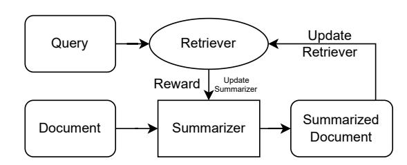

# ReSuMe: Retriever-Summarizer Mutual Enhancement via Reinforcement Learning

Owais Makroo∗ omakroo@amazon.com IIT Kharagpur Kharagpur, WB, India

Nikhil Pattisapu npattisa@amazon.com Amazon Inc. Bangalore, KA, India

Karan Gupta karaniis@amazon.com Amazon Inc. Bangalore, KA, India

Ankit Gandhi ganankit@amazon.com Amazon Inc. Bangalore, KA, India

Vijay Huddar vhhuddar@amazon.com Amazon Inc. Bangalore, KA, India

Atul Saroop asaroop@amazon.com Amazon Inc. Bangalore, KA, India

# Abstract

We present ReSuMe, a general framework for mutual enhancement of dense retrieval systems and document summarizers through reinforcement learning. The framework jointly optimizes a language model for generating retrieval-oriented summaries and adapts the retrieval model to these summaries through alternating fine-tuning phases. We employ Group Relative Policy Optimization (GRPO) to fine-tune the language model based on retrieval relevance rather than linguistic quality alone, while the retrieval model is iteratively updated using contrastive learning on the generated summaries. This co-optimization process addresses the fundamental distribution shift problem that arises when retrieval models trained on full documents must operate on synthetic summaries during inference. By progressively reducing this distribution gap, our framework yields two key benefits: improved retrieval performance and a highquality document summarizer optimized for retrieval tasks. We demonstrate our framework using Contriever on the MS-MARCO dataset, achieving consistent improvements of 13.2% in MRR@10 and 6.7% in Recall@100 over the baseline. The framework is model-agnostic and can be applied to enhance any dense retrieval system while simultaneously producing an effective document summarization model.

# CCS Concepts

• Information systems → Content analysis and feature selection; Content ranking; Language models.

# Keywords

Information Retrieval, Document Summarization, Language Models, Dense Retrieval, Policy Optimization

#### ACM Reference Format:

Owais Makroo, Nikhil Pattisapu, Karan Gupta, Ankit Gandhi, Vijay Huddar, and Atul Saroop. 2026. ReSuMe: Retriever-Summarizer Mutual Enhancement via Reinforcement Learning. In Proceedings of the ACM Web Conference 2026 (WWW '26), April 13–17, 2026, Dubai, United Arab Emirates. ACM, New York, NY, USA, [4](#page-3-0) pages.<https://doi.org/10.1145/3774904.3792959>

### 1 Introduction

Dense retrieval systems are fundamental components of modern information retrieval and retrieval-augmented generation (RAG) pipelines [\[12,](#page-3-1) [14\]](#page-3-2). By encoding queries and documents into dense vector representations, these models enable semantic similarity matching that goes beyond traditional keyword-based approaches. As a result, dense retrievers have become the backbone of largescale search engines and knowledge-intensive language modeling systems. However, documents in real-world corpora are often long, sparse, and noisy, containing substantial amounts of noninformative or redundant content, which makes efficient retrieval increasingly challenging in terms of both storage and inference cost.

Document summarization has therefore emerged as a promising approach to improve retrieval efficiency. By replacing full documents with concise summaries during retrieval, systems can significantly reduce memory footprint and accelerate similarity computation while retaining essential semantic information. Despite these benefits, summarization introduces a fundamental distribution shift problem: retrievers are typically trained on full documents sampled from �� (��), but are evaluated on LLM-generated summaries drawn from ���� (��|��) at inference time. This mismatch between training and inference distributions has been shown to consistently degrade retrieval performance across benchmarks and model families [\[1,](#page-3-3) [10\]](#page-3-4).

Most existing approaches to retrieval with summarized documents treat summarization and retrieval as independent components. Static summarization methods based on models such as PEGASUS [\[5\]](#page-3-5) or BART [\[9\]](#page-3-6) generate summaries without explicitly considering their downstream impact on retrieval quality [\[17\]](#page-3-7). While effective for human readability, these summaries are not optimized to preserve the fine-grained semantic cues required for dense similarity matching.

An alternative line of work explores asymmetric retrieval architectures, where queries and documents are encoded using different

∗Work done during an internship at Amazon Inc. Correspondence: makroo.owais@kgpian.iitkgp.ac.in

[This work is licensed under a Creative Commons Attribution 4.0 International License.](https://creativecommons.org/licenses/by/4.0) WWW '26, Dubai, United Arab Emirates © 2026 Copyright held by the owner/author(s). ACM ISBN 979-8-4007-2307-0/2026/04 <https://doi.org/10.1145/3774904.3792959>

models or representations to improve efficiency. Although such approaches can reduce computational overhead, training asymmetric retrievers remains challenging. Prior work has shown that asymmetric encoders are prone to representational drift, where query and document embeddings gradually diverge, leading to degraded semantic alignment and suboptimal retrieval performance [\[6,](#page-3-8) [16\]](#page-3-9). Mitigating this drift typically requires careful architectural constraints or specialized training procedures, which can limit model flexibility and generality [\[7\]](#page-3-10).

Recent research has increasingly explored reinforcement learning (RL) as a mechanism for aligning retrieval-related components with downstream objectives. LightRetriever [\[3\]](#page-3-11) employs retrievalbased rewards to train summarization models that generate more retrieval-friendly representations. DeepRetrieval [\[11\]](#page-3-12) further demonstrates that retrieval effectiveness can be improved by directly optimizing LLM outputs using real search engine feedback. While these approaches highlight the promise of RL-based alignment, they primarily focus on optimizing a single component—either the summarizer or the query generator—while assuming a fixed retriever.

Complementary work on retrieval-augmented generation introduces mechanisms for improving retrieval robustness through query decomposition or passage augmentation [\[8\]](#page-3-13). However, such methods typically assume static document representations and do not explicitly address the evolving distribution of summarized documents. More recent frameworks, including MMOA-RAG [\[15\]](#page-3-14) and RAG-RL [\[4\]](#page-3-15), move toward fully adaptive RAG pipelines by jointly optimizing multiple components under shared reinforcement signals. Although effective for end-to-end answer quality, these methods do not directly target summarization-induced distribution shift in dense retrieval settings.

Figure 1: Overview of the ReSuMe framework.

We propose ReSuMe (Retriever–Summarizer Mutual Enhancement), a novel framework (Figure [1\)](#page-1-0) that explicitly mitigates distribution shift by jointly optimizing retrieval and summarization models. Unlike prior approaches that optimize these components independently or assume a fixed retriever, ReSuMe alternates between training a summarization model to generate retrieval-oriented summaries using retrieval-based reward signals and adapting the retriever to the evolving summary distribution via contrastive learning.

This mutual enhancement process enables both components to co-evolve, progressively reducing distribution mismatch while simultaneously improving retrieval effectiveness. ReSuMe produces two complementary outcomes: a dense retriever that is robust to

summarized document representations and a specialized summarizer optimized for retrieval rather than human consumption.

ReSuMe is model-agnostic and can be applied to any dense retrieval architecture without architectural modifications, making it broadly applicable across domains and retrieval systems. Our main contributions are: (1) a general framework for mutual enhancement of retrievers and summarizers, (2) a principled solution to summarization-induced distribution shift via joint optimization, and (3) empirical validation demonstrating 13.2% improvement in MRR@10 and 6.7% in Recall@100 on MS-MARCO when applied to Contriever.

Through systematic co-adaptation, ReSuMe bridges retrieval and summarization, providing a unified, practical approach to efficient, robust dense retrieval at scale.

# 2 Methodology

Given a collection of documents D = {��1, ��2, . . . , ���� } and queries Q = {��1, ��2, . . . , ���� }, ReSuMe's objective is to enhance any dense retrieval model by jointly learning a summarization function ���� : �� → ��, where �� denotes a summary, and adapting the retrieval function ���� : (��, ��) → R to operate effectively on these summaries. The framework alternates between (i) optimizing the LLM summarizer via Group Relative Policy Optimization (GRPO) to generate retrieval-oriented summaries, and (ii) adapting the retrieval model to operate effectively on the newly generated summaries. Starting with any pretrained retrieval model ����0 and LLM ����0 , the procedure proceeds iteratively: at each iteration ��, the LLM is fine-tuned using GRPO where ������−1 serves as the reward model. The updated LLM ������ produces a new set of corpus summaries ���� = {������ (����) : ���� ∈ D}, which are then used to fine-tune the retrieval model using its native training procedure (e.g., contrastive learning for dense retrievers). The updated retriever parameters ���� are obtained as ���� = RetrieverUpdate(������−1 , ���� , Q). This iterative process continues until convergence as formalized in Algorithm [1.](#page-1-1)

#### Algorithm 1 ReSuMe: Retriever-Summarizer Mutual Enhancement

1: Initialize LLM ����0

and retrieval model ����0

2: for iteration �� = 1 to �� do

3: Fine-tune LLM using GRPO with ������−1

as reward model

4: ���� = GRPO(������−1

, ������−1 )

5: Summarize full corpus: ���� = {������

(����) : ���� ∈ D}

6: Fine-tune retriever using Contriever pipeline on ����

7: ���� = RetrieverUpdate(������−1

, ���� , Q)

8: if reward improvement &lt; �� then break

9: end for

Group Relative Policy Optimization (GRPO). To optimize summaries for retrieval, we employ GRPO, which fine-tunes the LLM based on relative preferences across a group of candidate summaries rather than absolute scores. For a group �� = {��1, . . . , ���� } corresponding to a document ��, the GRPO objective is defined as:

LGRPO = − log exp(��(����)/��) Í�� ��=1 exp(��(����)/��) , (1)

where ��(��) denotes the scalar reward and �� is a temperature parameter that smooths preference differences.

The total reward comprises two complementary components retrieval effectiveness and structural quality:

��(��, ��) = StructureReward(��) + ���� (�� + , ��− , ��, ��), (2)

where �� + and �� − represent sets of positive and negative queries for ��. Negative queries are sampled uniformly from �� \ �� + . The StructureReward(��) term enforces fluency, brevity, and proper format, while ���� (�� + , ��− , ��, ��) quantifies the improvement in retrieval relevance induced by summarization.

Retrieval-based Reward. �� measures the difference in retrieval quality between a summary and its corresponding original document:

Δ�� (�� + , ��− , ��, ��) = RetScore�� (�� + , ��− , ��) − RetScore�� (�� + , ��− , ��), (3)

with

RetScore�� (�� + , ��− , ��) = Í ��∈�� + S�� (��, ��) Í ��∈�� + S�� (��, ��) + Í ��∈�� − S�� (��, ��) , (4)

where S�� (��, ��) denotes the cosine similarity between query and text embeddings.

Discrete Reward Mapping. Following prior work [\[18\]](#page-3-16), we discretize the continuous retrieval signal Δ�� into a piecewise linear reward scale, ���� , to improve GRPO stability. Negative Δ�� values are assigned penalizing rewards of −1.0, −0.8, −0.6, and −0.3 for the ranges [−1, −0.5), [−0.5, −0.2), [−0.2, −0.1), and [−0.1, 0), respectively, while positive Δ�� values yield proportional gains of 0.3, 0.6, 0.8, and 1.0 for [0, 0.1), [0.1, 0.2), [0.2, 0.5), and [0.5, 1], respectively.

Structural Reward. The StructureReward(��) encourages summaries that are concise, well-formed, and adhere to the reasoning-to-summary format. It is computed using the retrieval model's tokenizer to evaluate the portion of text generated after the </think> token. The </think> token serves as an explicit separator between the model's internal reasoning and the final summary, ensuring that only the intended summary portion is evaluated and preventing leakage of chain-of-thought into the retrieved representation. Summaries whose tokenized length lies within 64–128 tokens receive a reward of 1, slightly overlength summaries receive 0.9, and underlength ones receive 0.3. If the </think> token is absent, both StructureReward(��) and Δ�� are assigned −1, penalizing invalid or unstructured outputs.

Retriever Adaptation. After each LLM update, the retriever is fine-tuned on the updated summaries ���� using a contrastive loss:

Lretrieval = − log exp(S(��, ��+ )) exp(S(��, ��+)) + Í �� − ∈N exp(S(��, ��−)), (5)

where �� + is a relevant summary, N is the set of negatives, and S(·, ·) denotes cosine similarity. This stage aligns ���� to the summary distribution, thereby reducing the domain shift.

#### 3 Experimental Setup

To validate our framework's effectiveness, we demonstrate its application using Contriever[1](#page-2-0) [\[2\]](#page-3-17) as the base retrieval model on the MS-MARCO passage ranking dataset [\[13\]](#page-3-18). This dataset contains

8.8M passages and 500K+ queries for training, with separate development and evaluation sets, making it suitable for evaluating retrieval performance improvements.

Implementation. We initialize the summarization component with Qwen3-4B-Thinking-2507 [\[19\]](#page-3-19) and apply our iterative GRPO framework to fine-tune both the LLM and Contriever model. The framework is implemented using PyTorch with GRPO using batch size 128 over 200 steps, learning rate 3e-7, and temperature �� = 0.5. The retrieval model adaptation uses AdamW optimizer with learning rate 1e-5. The iterative process runs for a maximum of ten iterations with early stopping based on validation convergence. We use greedy decoding during inference to ensure deterministic outputs. All document summaries are pre-computed and cached for efficient retrieval.

Baselines. We compare our iterative framework against: (1) Baseline: Original Contriever without summarization, (2) Fixed Summary: Contriever with static Qwen-generated summaries, (3) Noniterative: Single-step LLM fine-tuning without retriever adaptation, and (4) Iterative (Ours): Full iterative framework with GRPO. We evaluate using standard IR metrics: Mean Reciprocal Rank at 10 (MRR@10), Recall at 100/1000 (R@100/R@1000), and Normalized Discounted Cumulative Gain at 10 (NDCG@10). While contrastive training with hard negative examples can further enhance retrieval performance, we exclude such techniques from both the baseline and our proposed method to maintain experimental simplicity and prevent confounding effects.

Hardware. LLM alignment (GRPO) is performed on 40 NVIDIA A100 GPUs (40GB) using Ray, while standard LLM fine-tuning uses Fully Sharded Data Parallel (FSDP). Retrieval model adaptation is conducted with Distributed Data Parallel (DDP) across 8 A100 GPUs. Although GRPO alignment incurs a substantial training cost, this overhead does not affect deployment: all documents can be summarized offline, so inference requires no additional alignment computation.

#### 4 Results and Discussion

Table [1](#page-2-1) demonstrates the effectiveness of our iterative framework applied to Contriever on MS-MARCO. The iterative approach achieves substantial improvements across all metrics, with 13.2% relative improvement in MRR@10, 13.6% in NDCG@10, 6.7% in R@100, and 2.3% in R@1000 compared to the baseline. Notably, fixed summarization without adaptation performs worse than the original model (0.234 vs 0.266 MRR@10), highlighting the critical importance of addressing distribution shift through joint optimization.

Table 1: Performance comparison on MS-MARCO dataset.

| Method           | MRR@10 | NDCG@10 | R@100 | R@1000 |
|------------------|--------|---------|-------|--------|
| Baseline         | 0.266  | 0.324   | 0.819 | 0.954  |
| Fixed Summary    | 0.234  | 0.290   | 0.789 | 0.943  |
| Non-iterative    | 0.235  | 0.291   | 0.792 | 0.942  |
| Iterative (Ours) | 0.301  | 0.368   | 0.874 | 0.976  |

1<https://huggingface.co/facebook/contriever>

Out-of-Distribution Generalization. Our model also improves out-of-distribution performance when evaluated on NFCorpus, as shown in Table [2.](#page-3-20) While the gains of the Iterative method over the Baseline and Fixed Summary settings are smaller than those observed in-distribution, this is expected due to the domain shift between MS-MARCO and NFCorpus.

Table 2: Out-of-distribution performance on NFCorpus.

| Method           | MRR@10 | NDCG@10 | R@100 |
|------------------|--------|---------|-------|
| Baseline         | 0.501  | 0.305   | 0.290 |
| Fixed Summary    | 0.470  | 0.280   | 0.283 |
| Iterative (Ours) | 0.535  | 0.329   | 0.303 |

Ablation Studies. Table [3](#page-3-21) summarizes the ablation results. The full model attains the best NDCG@10. Removing the retrieval adaptation module causes the largest drop, confirming its importance for aligning the retriever with summarized inputs. Excluding negative query generation or the discrete reward also reduces performance, indicating that each component, and the iterative optimization they support, contributes meaningfully to overall effectiveness.

Table 3: Ablation study results (NDCG@10)

| Configuration |           |            | NDCG@10 |
|---------------|-----------|------------|---------|
| Full          | model     |            | 0.368   |
| w/o           | retrieval | adaptation | 0.291   |
| w/o           | negative  | queries    | 0.362   |
| w/o           | discrete  | reward     | 0.340   |

Convergence Analysis. The iterative framework demonstrates stable convergence within 3-5 iterations. Performance improvements are most significant in the first two iterations, with diminishing returns afterward. The validation MRR@10 stabilizes around third iteration, indicating effective convergence of the joint optimization process.

Summary Quality. We present a representative example of a document and its corresponding summary generated by the best model on MS-MARCO. The full evolution of summaries across iterations is available on the accompanying GitHub page [2](#page-3-22) . As shown in Table [4,](#page-3-23) the generated summary is concise and focused, effectively capturing the core information relevant to retrieval while omitting peripheral details.

### 5 Conclusion

We introduced an iterative fine-tuning framework that jointly optimizes a GRPO-trained summarizer and a Contriever-based retriever, enabling effective adaptation to LLM-generated summaries and yielding strong performance gains on MS-MARCO, including a 13.2% relative improvement in MRR@10 and a 6.7% gain in Recall@100. These results demonstrate that iterative co-training is highly effective, even before considering the downstream implications of distribution shift, and that GRPO provides stable, rewarddriven optimization suited for retrieval-oriented summarization.

Table 4: Example of original passage and generated summary (MS-MARCO).

|                   | Content |               |            |              |             |            |             |           |              |              |           |            |                  |
|-------------------|---------|---------------|------------|--------------|-------------|------------|-------------|-----------|--------------|--------------|-----------|------------|------------------|
| Original Passage  | Primary | biliary       | cirrhosis, | or           | PBC,        | is a       | chronic,    |           | or           | long-term,   | disease   | of         | the liver that   |
|                   | slowly  | destroys      | the        | medium-sized |             | bile       | ducts       |           | within the   | liver. Bile  | is        | a          | digestive liquid |
| that              | is made | in            | the liver. | It           | travels     | through    | the         | bile      | ducts        | to the       | small     | intestine, | where it         |
| helps             | digest  | fats          | and        | fatty        | vitamins.In |            | patients    |           | with PBC,    | the bile     |           | ducts      | are destroyed    |
| by                |         | inflammation. | This       | causes       | bile        | to remain  | in          | the       | liver,       | where        | gradual   | injury     | damages          |
| liver             | cells   | and           | causes     | cirrhosis,   |             | or         | scarring    | of        | the liver.As |              | cirrhosis |            | progresses and   |
| the               | amount  | of            | scar       | tissue in    | the         | liver      | increases,  |           | the liver    | loses        | its       | ability    | to function.t    |
|                   | travels | through       | the        | bile ducts   | to          | the        | small       |           | intestine,   | where it     | helps     | digest     | fats and         |
| fatty             |         | vitamins.     | In         | patients     | with        | PBC,       | the bile    |           | ducts are    | destroyed    |           | by         | inflammation.    |
| This              | causes  | bile          | to         | remain in    | the         | liver,     | where       |           | gradual      | injury       | damages   |            | liver cells and  |
|                   | causes  | cirrhosis,    | or         | scarring     | of          | the liver. |             |           |              |              |           |            |                  |
| Generated Summary | Primary | biliary       | cirrhosis  | (PBC)        | is          | a chronic  |             | liver     | disease      | that         | slowly    | destroys   | medium          |
| sized             | bile    | ducts         | within     | the          | liver.      | In PBC,    | bile        |           | ducts are    | destroyed    |           | by         | inflammation,    |
|                   | causing | bile to       | accumulate | in           | the         | liver.     | This        | bile      |              | accumulation | leads     | to         | gradual liver    |
| cell              | injury  | and           | cirrhosis, | or           | scarring    | of         | the         | liver.    | Bile is      | a digestive  |           | liquid     | produced by      |
| the               | liver   | that          | normally   | travels      |             | through    | bile        | ducts     | to the       | small        | intestine | to         | aid fat and      |
| fatty             |         | vitamin       | digestion. | PBC          | causes      |            | progressive |           | liver        | scarring     | as        | cirrhosis  | advances.        |
|                   | Primary | biliary       | cirrhosis  | is a         |             | chronic    | liver       | disease.x |              |              |           |            |                  |

The overall performance improvements highlight the importance of aligning the retriever to the evolving summary distribution, pointing to distribution shift as a key challenge in retrieval systems using synthetic or compressed inputs.

Looking ahead, we aim to extend this framework to multi-modal retrieval, larger-scale datasets, and alternative policy-optimization methods. We also plan to study the impact of summarizer and retriever model sizes, incorporate continual-learning strategies to prevent retriever drift, and investigate the theoretical convergence properties of iterative co-training.

#### References

[1] A. Wang et al. 2023. Self-RAG: Learning to Retrieve, Generate, and Critique through Self-Reflection. arXiv:2310.11511 (2023). [2] G. Izacard et al. 2021. Unsupervised dense information retrieval with contrastive learning. arXiv:2112.09118 (2021). [3] G. Ma et al. 2025. LightRetriever: A LLM-based Text Retrieval Architecture with Extremely Faster Query Inference. arXiv:2505.12260 (2025). [4] J. Huang et al. 2025. RAG-RL: Advancing Retrieval-Augmented Generation via Reinforcement Learning and Curriculum Learning. arXiv:2503.12759 (2025). [5] J. Zhang et al. 2020. PEGASUS: Pre-training with Extracted Gap-sentences for Abstractive Summarization. arXiv:1912.08777 (2020). [6] K. Santhanam et al. 2022. ColBERTv2: Effective and Efficient Retrieval via Lightweight Late Interaction. arXiv:2112.01488 (2022). [7] L. Xiong et al. 2020. Approximate nearest neighbor negative contrastive learning for dense text retrieval. In International Conference on Learning Representations. [8] M. Kim et al. 2024. QPaug: Question and Passage Augmentation for Open-Domain Question Answering of LLMs. arXiv:2406.14277 (2024). [9] M. Lewis et al. 2019. BART: Denoising Sequence-to-Sequence Pre-training for Natural Language Generation, Translation, and Comprehension. arXiv:1910.13461 (2019). [10] N. Thakur et al. 2021. BEIR: A heterogenous benchmark for zero-shot evaluation of information retrieval models. arXiv:2104.08663 (2021). [11] P. Jiang et al. 2025. DeepRetrieval: Hacking Real Search Engines and Retrievers with Large Language Models via Reinforcement Learning. arXiv:2503.00223 (2025). [12] P. Lewis et al. 2020. Retrieval-augmented generation for knowledge-intensive NLP tasks. Advances in Neural Information Processing Systems (2020). [13] T. Nguyen et al. 2016. MS MARCO: A human generated machine reading comprehension dataset. arXiv:1611.09268 (2016). [14] V. Karpukhin et al. 2020. Dense passage retrieval for open-domain question answering. In Proceedings of EMNLP. [15] Y. Chen et al. 2024. MMOA-RAG: Improving Retrieval-Augmented Generation through Multi-Agent Reinforcement Learning. arXiv:2501.15228 (2024). [16] O. Khattab and M. Zaharia. 2020. ColBERT: Efficient and effective passage search via contextualized late interaction over BERT. In Proceedings of SIGIR. [17] Y. Liu and M. Lapata. 2019. Text summarization with pretrained encoders. In Proceedings of EMNLP-IJCNLP. [18] Y. Mroueh. 2025. Reinforcement Learning with Verifiable Rewards: GRPO's Effective Loss, Dynamics, and Success Amplification. arXiv:2503.06639 (2025). [19] Qwen Team. 2025. Qwen3 Technical Report. arXiv:2505.09388 (2025).

2<https://makrooowais.github.io/resume-paper/>